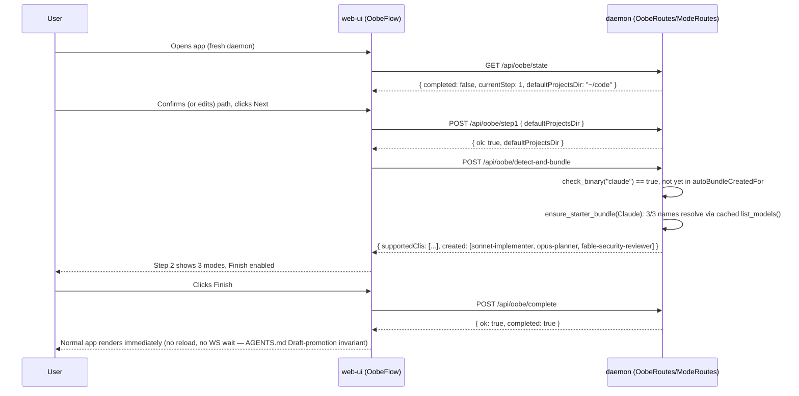

<!--
RULES — read before writing or implementing:
1. FORMAT: Bullets, tables, code, diagrams ONLY — no prose paragraphs
2. REQUIREMENTS: One crisp line each — no verbose descriptions
3. CHECKLIST: Mark items [x] as you complete them — this is your persistent todo list
4. READING TIME: Optimize for fast human scanning — if it's hard to skim, rewrite it
-->

# Plan: OOBE (first-run onboarding)

> Two-step first-run flow (project location → batch-created starter agent modes), gated on a
> daemon-persisted completion flag, reusing existing CLI-detection and mode-CRUD machinery.

**Issue:** oobe-onboarding
**Branch:** `feat/oobe-onboarding`
**Status:** Pending
**PRD:** `.vibekit/feature-plans/pending/oobe-onboarding/prd-oobe-onboarding.md`

**Reference files:**
- Data / schema: `rust/vst-types/src/rest/modes.rs`, `rust/vst-types/src/rest/settings.rs` (patterns to copy)
- Core logic: `rust/vst-routes/src/modes.rs`, `rust/vst-agents/src/plugin.rs`, `rust/vst-agents/src/claude.rs`
- UI / entrypoint: `web-ui/src/App.tsx`, `web-ui/src/components/settings/ModesSetting.tsx`
- Wiring (DI / routing / config): `rust/vst-daemon/src/server.rs`

---

## Problem & Concept

- See [prd-oobe-onboarding.md](./prd-oobe-onboarding.md) for the full problem statement, screen
  layouts, and CUJs — this plan does not restate them.
- Two facts drive the technical shape: (1) `vst doctor`'s CLI-on-PATH check is currently CLI-side
  only (`rust/vst-cli/src/commands/doctor.rs`) and the daemon's own equivalent
  (`rust/vst-daemon/src/doctor.rs::check_binary`) is not reachable from any REST route today — it
  must become shared, daemon-reachable logic, not reimplemented. (2) the claude-vs-generic starter
  bundle split is CLI-specific behavior and must live entirely behind `AgentPlugin` (AGENTS.md §
  Agent plugin), never as an `if cli == "claude"` branch in a route handler.

## Out of Scope

- No onboarding tour/tooltips beyond the two OOBE steps (PRD Non-goals).
- No curated starter bundle for cursor/opencode/agy — they get the generic 1-mode fallback only.
- No per-user OOBE state — one daemon-wide flag.
- `App.tsx:27-29`'s `vst open <path>` navigation TODO — untouched; the OOBE gate must not
  intercept the `navigate` WS-event handler's effect, only the `<Routes>` render below it.

## Requirements

| # | Requirement |
|---|-------------|
| 1 | Every PRD requirement (R1-R24, including lettered sub-requirements) is implemented — see Files & Phase Impact for the R→phase-item trace. |
| 2 | The **daemon-side** `check_binary`/CLI-on-PATH detection has exactly one implementation, reused by `vst-daemon`'s internal `run_doctor` AND `GET /api/supported-clis` (OOBE + Settings). `vst-cli`'s own client-side `vst doctor` intentionally stays a separate, self-contained implementation — see Decision 8. |
| 3 | The claude-3-mode-bundle-vs-generic-1-mode split is expressed as an `AgentPlugin` trait method override, never a CLI-name branch in `vst-routes`/`vst-daemon`. |
| 4 | OOBE completion is daemon-persisted (`~/.vibe-station/oobe.json`), survives new browser/device/reinstall (R20/R21). |

---

## Change Map

```
rust/vst-types/src/rest/
  oobe.rs            + OobeState, step1/bundle/complete wire types
  modes.rs           ~ SupportedCli gains `detected`
  mod.rs             ~ registers oobe module
rust/vst-types/src/
  events.rs          ~ ServerEvent::OobeStateUpdated
rust/vst-agents/src/
  registry.rs        ~ hosts moved `check_binary`
  plugin.rs          ~ AgentPlugin::starter_bundle() (default impl)
  claude.rs          ~ starter_bundle() override (3-mode bundle)
rust/vst-daemon/src/
  doctor.rs          ~ uses moved check_binary, no local copy
  server.rs          ~ registers /oobe/* + /modes/:cli/starter-bundle routes
rust/vst-routes/src/
  oobe.rs            + OobeRoutes (state, step1, detect-and-bundle, complete)
  modes.rs           ~ list_supported_clis gains `detected`; ensure_starter_bundle()
web-ui/src/api/
  types.ts           ~ SupportedCli.detected, OobeState, StarterBundleResult
  client.ts          ~ oobe + starter-bundle client methods
  mock.ts            ~ same, for tests/dev mode
web-ui/src/components/oobe/
  OobeFlow.tsx        + step router, no close affordance
  OobeStep1Location.tsx + project-location step
  OobeStep2Modes.tsx  + blocking mode-bundle step
web-ui/src/components/agent/
  CliDetectionPanel.tsx + shared detection+bundle UI (OOBE + Settings)
web-ui/src/components/settings/
  ModesSetting.tsx    ~ embeds CliDetectionPanel (opt-in)
web-ui/src/hooks/
  useOobeGate.ts      + fetch/track OOBE state
web-ui/src/
  App.tsx             ~ OOBE gate before <Routes>
```

| Today | After this plan |
|-------|-----------------|
| No first-run flow; app opens straight to Workspace with zero projects/modes | New daemon routes OOBE until location set + ≥1 mode backed by a detected CLI exists |
| `check_binary` exists only in `vst-daemon`, unreachable from any REST route | Shared in `vst-agents::registry`, used by `vst-daemon`'s `run_doctor` AND `GET /api/supported-clis` (`vst-cli`'s own client-side `vst doctor` stays separate, Decision 8) |
| `SupportedCli` has no detected/not-detected signal | `detected: bool` field, computed from the shared `check_binary` |
| Modes are created one at a time via the New-mode dialog only | A CLI's starter bundle (claude: 3 named modes; others: 1 generic) batch-creates on first detection |
| `ModesSetting.tsx` has no CLI-detection UI | Shows the same detected/not-detected badges + opt-in "Recreate" bundle action as OOBE |

---

## Research

- `rust/vst-cli/src/commands/doctor.rs:1-7` — `vst doctor` is a **client-side** command running its
  own subprocess checks; it is NOT a thin wrapper over any daemon endpoint. There is currently no
  server-side REST route exposing per-CLI PATH detection at all.
- `rust/vst-daemon/src/doctor.rs:43-49` — `check_binary(binary: &str) -> bool` (`which <binary>`)
  is the daemon-side equivalent, used only by `run_doctor()` (an internal health-check aggregator,
  not exposed over REST) at lines 187, 212, 229.
- `rust/vst-agents/src/registry.rs:16` — `SUPPORTED_CLIS: [CliId; 4]` already lives here and is
  imported by both `vst-daemon/src/doctor.rs` and `vst-routes/src/modes.rs` — the natural home for
  a shared `check_binary` too (both crates already depend on `vst-agents`).
- `rust/vst-routes/src/modes.rs:274-299` — `ModeRoutes::list_supported_clis()` builds `SupportedCli`
  today with `id`, `default_model`, `supports_json`, `imports_native_history`,
  `supports_json_to_terminal_resume` — no detection field; this is the single call both OOBE and
  Settings must extend and share (PRD Resolved-design-question 4).
- `rust/vst-routes/src/modes.rs:378-455` — `ModeRoutes::create_mode` already does name-conflict
  (409), 20-mode cap, icon derivation via `resolve_plugin(cli).default_mode_icon(...)`, and
  broadcasts `ServerEvent::ModeCreated` — the starter-bundle algorithm must call this, not duplicate
  its validation.
- `rust/vst-routes/src/modes.rs:301-370` — `ModeRoutes::resolve_cli_models` already TTL-caches
  (10 min) + in-flight-dedupes `plugin.list_models()` — the bundle algorithm's per-name discovery
  lookup (R13a) must call this, not `plugin.list_models()` directly, to avoid a second cache.
- `rust/vst-agents/src/claude.rs:33-46` — `CLAUDE_MODELS` curated list literally contains
  `"sonnet"`, `"opus"`, `"fable"` as list entries — R13a's "look up by name" is a plain membership
  check against `resolve_cli_models(Claude).models`, no fuzzy matching needed.
- `rust/vst-agents/src/plugin.rs:226-345` — `AgentPlugin` trait: every optional method has a
  default body; required methods have none. A new `starter_bundle()` optional method (default
  impl = generic single mode) is the correct shape — claude overrides it, cursor/opencode/agy don't
  need to.
- `rust/vst-routes/src/settings.rs:87-112,196-333` — `SettingsRoutes` is the established pattern for
  a daemon-wide, non-per-project JSON file (`~/.vibe-station/config.json`) with an `Arc<Mutex<()>>`
  write-lock held across the whole read-modify-write cycle — `OobeRoutes`'s own `~/.vibe-station/
  oobe.json` copies this exact shape.
- `rust/vst-routes/src/fs.rs:37-49,60-73` — `expand_tilde`/path-absoluteness validation already
  exists and is reusable for OOBE step 1's path field; `FsRoutes::check` only reports
  exists/is_directory/is_git, no writability check — step 1's "unwritable" case (R9) needs its own
  `tokio::fs::create_dir_all` attempt, not an extension of `fs/check`.
- `rust/vst-daemon/src/server.rs:521-707` — every REST route is built inside one `Router::new()`
  chain nested under `/api` (`.nest("/api", api)`); only `/health`, `/mobile-auth`, `/ws` are root
  (AGENTS.md § CLI route-prefix invariant — applies equally to any new web-ui fetch call, which must
  go through `apiFetch`'s existing `/api`-prefixed `baseUrl()`, already used by every other
  `web-ui/src/api/client.ts` method referenced below).
- `rust/vst-types/src/rest/mod.rs:1-7` — `vst-routes`/`vst-cli` are forbidden from defining their
  own `Serialize`/`Deserialize` shapes; every new wire type goes in a new `vst-types/src/rest/
  oobe.rs` module.
- `web-ui/src/App.tsx:19-32,70-97` — the `navigate` WS-event effect (line 24, the pre-existing
  `vst open <path>` TODO at 27-29) and the `<Routes>` block (line 76) are separate; the OOBE gate
  wraps only the `<Routes>` render, leaving the WS-navigate effect (and its TODO) untouched.
- `web-ui/src/components/dialogs/FolderChooserDialog.tsx:1-12` — existing reusable directory-picker
  dialog (built on `useDirSuggestions`/`GET /fs/complete`) — OOBE step 1's "Browse" button reuses
  this verbatim, no new picker.
- `web-ui/src/components/settings/ModesSetting.tsx:15-53` — existing `listModes()`/`mode:created`/
  `mode:updated`/`mode:deleted` WS-sync pattern that any bundle-creation UI (OOBE step 2 included)
  must follow to stay in sync without a manual refetch.
- `rust/scripts/rust-gate.sh:16-38` — the repo's one Rust test/lint command:
  `rust/scripts/rust-gate.sh <crate>` (fmt-check + clippy deny-groups + `cargo test -p <crate>`, plus
  a `vst-types` wire-fixture re-run) or `--workspace` for everything.
- **Root cause:** no first-run gate exists at all today, and the two pieces of state it needs
  (installed-CLI detection, a daemon-wide completion flag) either don't exist yet (the flag) or
  exist only on the wrong side of the client/daemon boundary (detection, CLI-only).

---

## Architecture Diagram

```mermaid
flowchart LR
    subgraph WebUI[web-ui]
      Gate[App.tsx OOBE gate] --> Step1[OobeStep1Location]
      Gate --> Step2[OobeStep2Modes]
      Step2 --> Panel[CliDetectionPanel]
      Panel --> Settings2[ModesSetting.tsx]
    end
    subgraph Daemon[vst-daemon / vst-routes]
      OobeR[OobeRoutes] -->|reads/writes| OobeFile[(~/.vibe-station/oobe.json)]
      OobeR -->|ensure_starter_bundle| ModeR[ModeRoutes]
      ModeR -->|resolve_plugin(cli).starter_bundle| Plugin[vst-agents AgentPlugin]
      ModeR -->|create_mode| ModesFile[(~/.vibe-station/modes.json)]
      OobeR -->|patch_settings defaultProjectsDir| SettingsR[SettingsRoutes]
      ModeR -->|check_binary| Registry[vst-agents::registry]
    end
    Gate -->|"GET /api/oobe/state"| OobeR
    Step1 -->|"POST /api/oobe/step1"| OobeR
    Step2 -->|"POST /api/oobe/detect-and-bundle"| OobeR
    Panel -->|"POST /api/modes/:cli/starter-bundle"| ModeR
    Step2 -->|"POST /api/oobe/complete"| OobeR
```

---

## Design Details

### System Boundaries

| Boundary | Fields + types | Errors | Source of truth |
|----------|----------------|--------|------------------|
| web-ui ↔ daemon: `GET /api/oobe/state` | → `{ completed: bool, currentStep: 1\|2, defaultProjectsDir: string }` | none (always 200) | daemon (`~/.vibe-station/oobe.json` + `~/.vibe-station/config.json`) |
| web-ui ↔ daemon: `POST /api/oobe/step1` | `{ defaultProjectsDir: string }` → `{ ok: true, defaultProjectsDir: string }` | `400 validation_error` (relative path, or `create_dir_all` failed = unwritable) | daemon |
| web-ui ↔ daemon: `POST /api/oobe/detect-and-bundle` | (no body) → `{ supportedClis: SupportedCli[], created: Mode[] }` | none (always 200; per-CLI failures surface as empty `created` for that CLI) | daemon |
| web-ui ↔ daemon: `POST /api/modes/:cli/starter-bundle` | `:cli` path param → `{ created: Mode[], alreadyPresent: Mode[], skipped: string[], usedFallback: bool, alreadyComplete: bool }` | `400 unknown_cli` | daemon |
| web-ui ↔ daemon: `POST /api/oobe/complete` | (no body) → `{ ok: true, completed: true }` | `409 no_mode_for_detected_cli` (R19 not satisfied) | daemon |
| web-ui ↔ daemon: `GET /api/supported-clis` | existing contract + new `detected: bool`, `starterBundleNames: string[]`, `usingFallbackOnly: bool` fields (not otherwise changing) | none | daemon |
| `OobeRoutes` ↔ `SettingsRoutes` (in-process) | `OobeRoutes` holds an owned `SettingsRoutes` clone, calls `.patch_settings(PatchSettingsBody{ default_projects_dir: Some(dir), ..default })` | propagates `SettingsRouteError` | `SettingsRoutes` (unchanged owner of `config.json`) |
| `ModeRoutes` ↔ `AgentPlugin` (in-process) | `resolve_plugin(cli).starter_bundle() -> Vec<StarterBundleEntry>` | none (pure) | plugin (CLI-specific data only) |

### Critical User Journeys (CUJs)

#### CUJ 1 — First launch, claude detected, bundle succeeds (happy path)



- **Error path — R13c (full discovery failure):** `detect-and-bundle` calls `resolve_cli_models`,
  gets `error: Some(...)` or an empty/mismatched list; all 3 named entries skip; `ensure_starter_bundle`
  creates one `claude-default` fallback mode instead; response's `created` = `[claude-default]`,
  `usedFallback: true`; the returned `supportedClis` entry for claude now has `usingFallbackOnly:
  true` (so the banner survives a page reload — it's recomputed from `starterBundleNames` +
  `listModes()`, not just this one response); `autoBundleCreatedFor` is NOT updated for claude
  (R13c-i) so the next Re-check/back-next retries the real bundle; a later successful retry ADDS the
  3 named modes alongside `claude-default` (R13c-ii) without deleting it, and `usingFallbackOnly`
  flips back to `false` once ≥1 named mode exists; a second failed retry reuses the same
  `claude-default` row (R13c-iii, matched by name) instead of creating `claude-default-2` — see
  Decision 3's corrected algorithm for exactly how "already exists" is distinguished from "missing".
- **Edge case — zero CLIs detected (R17/R18):** `detect-and-bundle` returns `created: []`,
  `supportedClis` all `detected: false`; `OobeStep2Modes` renders the zero-CLI warning + "Re-check"
  button (re-issues the same call); Finish stays disabled since no mode is backed by a detected CLI.

#### CUJ 2 — Upgraded daemon, pre-existing project + mode (R1a auto-complete)

```
Daemon boots with existing store data, oobe.json absent
  → First GET /api/oobe/state
  → OobeRoutes::get_state() detects oobe.json missing
  → Reads store.get_all_projects() (≥1) and load_modes() (≥1)
  → Both non-empty → persists { completed: true, step1Confirmed: true,
     autoBundleCreatedFor: <every CLI that has ≥1 existing mode> }
  → Returns completed: true
  → App.tsx never renders OobeFlow
```

- **Edge case — R1b/R1c (only a mode exists, no project):** same migration check, `has_project =
  false` → `step1Confirmed = false`, `completed = false` → OOBE resumes at **step 1** (not step 2 —
  R1b says "still goes through OOBE", and no project means step 1's precondition is genuinely
  unmet); once step 1 is confirmed, step 2 loads with `autoBundleCreatedFor` already containing the
  pre-existing mode's CLI, so `detect-and-bundle` does not fire a redundant bundle for that CLI
  (R1c) — Finish is enabled immediately if that CLI is still detected on this machine.
- **Edge case — R1b/R1d (only a project exists, no mode):** `has_project = true` →
  `step1Confirmed = true` → OOBE resumes directly at **step 2**; `autoBundleCreatedFor` is empty →
  `detect-and-bundle` proceeds exactly like a fresh daemon (R1d).

### Data Model

| Entity | Field | Type | Constraints | Notes |
|--------|-------|------|-------------|-------|
| `OobeState` (`~/.vibe-station/oobe.json`) | `completed` | `bool` | default `false` | R6/R20/R21 |
| `OobeState` | `step1Confirmed` | `bool` | default `false` | drives R5's resume-step logic |
| `OobeState` | `autoBundleCreatedFor` | `Vec<CliId>` (JSON: lowercase strings) | dedup, order-insensitive | R12a/R12a-i/R1c marker — only ever grows |
| `SupportedCli` (existing, `rest/modes.rs`) | `detected` | `bool` | computed via `plugin.binary_name()`, never persisted | R10/R11/R22 |
| `SupportedCli` | `starterBundleNames` | `Vec<String>` | computed from `plugin.starter_bundle()`, never persisted | lets the client compute "N missing" for Recreate (R23-i) |
| `SupportedCli` | `usingFallbackOnly` | `bool` | computed from `starterBundleNames` + `load_modes()`, never persisted | true iff this CLI has a real (≥2-entry) bundle, none of its named modes exist yet, and its `<cli>-default` fallback does — drives the R13c warning banner, survives a page reload since it's recomputed on every `GET /supported-clis` |
| `Mode` (existing, `rest/shared.rs`) | *(unchanged)* | — | — | bundle-created modes are ordinary `Mode` rows, no new field |

- **Relationships:** `OobeState.autoBundleCreatedFor` references `CliId` values, not `Mode.id` —
  it survives a bundle mode being deleted (R12a-i), which an FK to `Mode.id` could not.
- **Indexes:** none — single-row JSON files, same as `config.json`/`modes.json`.
- **Migration:** N — brand-new file; a missing file is the normal "never onboarded" state, handled
  by the R1a-d lazy-migration check in `OobeRoutes::get_state()`, not a schema migration.

### API Contracts

```
GET /api/oobe/state
  Request:  —
  Response: { completed: bool, currentStep: 1 | 2, defaultProjectsDir: string }
  Errors:   — (always 200; first call may perform the R1a-d migration write)

POST /api/oobe/step1
  Request:  { defaultProjectsDir: string }
  Response: { ok: true, defaultProjectsDir: string }
  Errors:   400 validation_error — relative path, or the daemon could not
            create/write the directory (covers R9's "invalid/unwritable")

POST /api/oobe/detect-and-bundle
  Request:  —
  Response: { supportedClis: SupportedCli[], created: Mode[] }
  Errors:   — (always 200; per-CLI discovery failures are reflected in `created`,
            never surfaced as an HTTP error)

POST /api/modes/:cli/starter-bundle
  Request:  — (`:cli` one of claude|cursor|opencode|agy)
  Response: { created: Mode[], alreadyPresent: Mode[], skipped: string[],
              usedFallback: bool, alreadyComplete: bool }
            `created` = newly created this call; `alreadyPresent` = bundle-name
            modes that already existed (R12b-i / R23-i); `alreadyComplete` =
            true iff `created` and `skipped` are both empty (nothing needed
            creating, nothing failed to resolve).
  Errors:   400 unknown_cli

POST /api/oobe/complete
  Request:  —
  Response: { ok: true, completed: true }
  Errors:   409 no_mode_for_detected_cli — R19 not satisfied server-side

GET /api/supported-clis
  Existing contract (see rust/vst-types/src/rest/modes.rs::SupportedCli) + 3 new
  fields: `detected: bool`, `starterBundleNames: string[]` (the mode names
  `plugin.starter_bundle()` would create — lets the client compute how many
  are missing), `usingFallbackOnly: bool` (R13c banner state, recomputed on
  every call so it survives a page reload). Not otherwise changing.
```

### Key Decisions

#### Decision 1: Move `check_binary` into `vst-agents::registry`, delete the `vst-daemon` copy

- **Decision:** relocate `pub fn check_binary(binary: &str) -> bool` from
  `rust/vst-daemon/src/doctor.rs:43` into `rust/vst-agents/src/registry.rs`, re-exported as
  `vst_agents::registry::check_binary`; `vst-daemon/src/doctor.rs` imports it instead of defining
  its own.
- **Rationale:** `vst-routes` cannot depend on `vst-daemon` (dependency would be backwards — daemon
  depends on routes), so a REST-reachable detection check needs to live somewhere both
  `vst-daemon`'s `run_doctor` and `vst-routes`'s `ModeRoutes::list_supported_clis` can import;
  `vst-agents` is already a shared dependency of both (Research § `registry.rs:16`). This satisfies
  R10 on the **daemon side only** — `vst-daemon`'s `run_doctor` and `GET /api/supported-clis` now
  share one `check_binary`. `vst-cli`'s own client-side `vst doctor`
  keeps its separate, pre-existing `which()` call (Decision 8) — it is not affected by this move.
- **Where:** `rust/vst-agents/src/registry.rs` (new fn), `rust/vst-daemon/src/doctor.rs:43-49`
  (delete local fn, `use vst_agents::registry::check_binary;`), `rust/vst-routes/src/modes.rs:274-299`
  (new call site).

#### Decision 2: `AgentPlugin::starter_bundle()` + `binary_name()` — CLI-specific data only, generic orchestration

- **Decision:** add two optional trait methods. `starter_bundle()`: default impl = one generic
  entry; claude overrides it with 3 named entries. `binary_name()`: default impl = `self.name()`;
  cursor overrides it to `"cursor-agent"` (the binary it actually launches —
  `rust/vst-agents/src/cursor.rs:343`'s `get_launch_command` — vs. `self.name()`'s `"cursor"`, which
  is only the plugin's own id, not a binary on PATH). The bundle-CREATION algorithm (calling
  `resolve_cli_models`, matching names, falling back) and the PATH-detection call both live once in
  `ModeRoutes`, cli-agnostic — neither ever branches on `CliId`.
- **Rationale:** AGENTS.md's plugin-boundary invariant — the only CLI-specific facts are *what a
  bundle contains* and *what binary this CLI's `claude`/`cursor-agent`/... process actually is*, not
  *how detection or bundle-creation work*; both belong in the plugin, not a `CliId` match in
  `vst-routes`. Without `binary_name()`, a naive `check_binary(cli.to_string())` would check for a
  binary literally named `"cursor"` and never find the real `cursor-agent` executable, permanently
  showing cursor as "not detected" even when correctly installed.
- **Where:** `rust/vst-agents/src/plugin.rs` (trait + `StarterBundleEntry` type),
  `rust/vst-agents/src/claude.rs` (`starter_bundle` override),
  `rust/vst-agents/src/cursor.rs` (`binary_name` override).

```rust
/// One entry in a CLI's starter mode bundle. `model_name` is a name to look
/// up in this CLI's OWN discovery/curated list at creation time (R13a) — e.g.
/// "sonnet" for claude, matched by plain membership against
/// `resolve_cli_models(cli).models`. `None` means "use `default_model()`
/// literally, no discovery lookup required" (the generic-CLI shape, R14).
pub struct StarterBundleEntry {
    pub name: String,
    pub model_name: Option<String>,
    pub context: String,
}

pub trait AgentPlugin: Send + Sync {
    // ...existing methods...

    /// The binary name to check for on PATH (`which <binary_name()>`) when
    /// deciding whether this CLI is "detected" (R10). Defaults to `self.name()`
    /// — correct for claude/opencode/agy, whose plugin id IS their binary name.
    /// Cursor overrides this: its plugin id is `"cursor"` but the binary it
    /// actually spawns is `cursor-agent` (`get_launch_command`, cursor.rs:343).
    fn binary_name(&self) -> &str {
        self.name()
    }

    /// Starter bundle offered the first time this CLI is detected (R12) or via
    /// the explicit "create starter modes" action (R23). Default: one generic
    /// mode named "<cli>-default" with no discovery-dependent model (R14).
    /// Claude overrides with its 3 named modes (R13).
    fn starter_bundle(&self) -> Vec<StarterBundleEntry> {
        vec![StarterBundleEntry {
            name: format!("{}-default", self.name()),
            model_name: None,
            context: "You are a helpful coding assistant.".to_string(),
        }]
    }
}
```

#### Decision 3: Bundle-creation algorithm — an existing bundle-name mode is "satisfied", never a miss

- **Decision:** `ModeRoutes::ensure_starter_bundle(cli)` (new method, no marker parameter — see
  below) implements the shared algorithm below. It is called identically from BOTH the automatic
  `detect-and-bundle` path and the explicit `/modes/:cli/starter-bundle` route; the two paths differ
  only in what their CALLER does with the result afterward (Decision 4's `autoBundleCreatedFor`
  marker is written by `OobeRoutes::detect_and_bundle` alone — the explicit route never touches it,
  which is what makes it exempt from R12a per R12b, with no flag needed on `ensure_starter_bundle`
  itself).
- **The bug this fixes:** a first draft of this algorithm treated `create_mode`'s `Conflict` error
  (the bundle-name mode already exists) as a silent no-op that neither counted as success NOR
  populated a "this one's fine" set — so `created` could end up empty even when all 3 named modes
  already existed, wrongly triggering the R13c fallback (creating a spurious `claude-default`
  alongside 3 modes that were already there) and reporting `alreadyComplete: false` when the CLI's
  bundle was, in fact, already fully complete (breaking R23-i). The fix below tracks "already
  existed" as its OWN outcome (`already_present`), separate from `created` (newly made) and
  `skipped` (name unresolvable) — the fallback trigger and `alreadyComplete` both key off
  `created.is_empty() && already_present.is_empty()` (truly nothing there yet), never off
  `created.is_empty()` alone.
- **Rationale:** encodes R13a/R13b/R13c/R13c-i/R13c-ii/R13c-iii/R12b-i in one place instead of
  scattering conflict/fallback handling across call sites.
- **Testability:** `ModeRoutes` gains two test-only injection seams, following the existing
  `with_modes_file` builder-method pattern (`rust/vst-routes/src/modes.rs:207-210`): `pub fn
  with_plugin_resolver(mut self, f: fn(CliId) -> Box<dyn AgentPlugin>) -> Self` (default
  `resolve_plugin`) and `pub fn with_binary_checker(mut self, f: fn(&str) -> bool) -> Self` (default
  `vst_agents::registry::check_binary`), stored as `plugin_resolver`/`binary_checker` fields and
  used everywhere this file currently calls `resolve_plugin`/`check_binary` directly. Tests inject a
  fake plugin (e.g. one whose `list_models()` returns `ListModelsResult { models: vec![], error:
  Some(...) }`) to exercise R13b/R13c without depending on claude's real, always-succeeding curated
  list, and a fake `binary_checker` (e.g. `|_| true`) to exercise "CLI detected" without depending on
  what's actually on the test machine's PATH.
- **Where:** `rust/vst-routes/src/modes.rs` (new method + fields on `ModeRoutes`).

```rust
// Pseudocode — the exact shape a fresh implementer must produce.
pub struct BundleOutcome {
    pub created: Vec<Mode>,         // newly created this call
    pub already_present: Vec<Mode>, // bundle-name modes that already existed (R12b-i / R23-i)
    pub skipped: Vec<String>,       // entry names whose model_name didn't resolve (R13b)
    pub used_fallback: bool,        // true iff the generic "<cli>-default" fallback was used/reused
    pub primary_satisfied: bool,    // true iff >=1 REAL named entry exists now (new or pre-existing)
}

async fn ensure_starter_bundle(&self, cli: CliId) -> BundleOutcome {
    let plugin = (self.plugin_resolver)(cli);
    let entries = plugin.starter_bundle();
    let mut created = vec![];
    let mut already_present = vec![];
    let mut skipped = vec![];
    let has_named_entries = entries.iter().any(|e| e.model_name.is_some());
    let existing_modes = self.load_modes().await;

    for entry in &entries {
        // An existing mode with this bundle name is ALWAYS "satisfied" — check
        // this BEFORE attempting any discovery lookup or create_mode call, so a
        // pre-existing mode never depends on discovery succeeding again.
        if let Some(existing) = existing_modes.iter().find(|m| m.cli == cli && m.name == entry.name) {
            already_present.push(existing.clone());
            continue;
        }

        let model = match &entry.model_name {
            None => plugin.default_model().to_string(),
            Some(name) => {
                let models = self.resolve_cli_models(cli).await; // TTL-cached
                if models.models.iter().any(|m| m == name) {
                    name.clone()
                } else {
                    skipped.push(entry.name.clone()); // R13b: skip only this one
                    continue;
                }
            }
        };
        match self.create_mode(CreateModeBody { name: entry.name.clone(), cli, context: entry.context.clone(), model: Some(model), icon: None }).await {
            Ok(mode) => created.push(mode),
            // A conflict here means a concurrent caller created it first between
            // our existing_modes snapshot and this call — treat it the same as
            // "already present", never as a failure.
            Err(ModeRouteError::Conflict { .. }) => {
                if let Some(m) = self.load_modes().await.into_iter().find(|m| m.cli == cli && m.name == entry.name) {
                    already_present.push(m);
                }
            }
            Err(_) => skipped.push(entry.name.clone()),
        }
    }

    // R13c: fallback fires ONLY when truly nothing named exists yet — not when
    // an explicit "Recreate" is called on an already-complete bundle.
    let nothing_named_exists = has_named_entries && created.is_empty() && already_present.is_empty();
    let used_fallback = nothing_named_exists;
    if used_fallback {
        let fallback_name = format!("{}-default", plugin.name());
        // R13c-iii: reuse the existing fallback mode by name instead of duplicating it.
        if let Some(existing) = existing_modes.iter().find(|m| m.cli == cli && m.name == fallback_name) {
            already_present.push(existing.clone());
        } else if let Ok(mode) = self.create_mode(CreateModeBody { name: fallback_name, cli, context: "You are a helpful coding assistant.".into(), model: Some(plugin.default_model().to_string()), icon: None }).await {
            created.push(mode);
        }
    }

    // R13c-i: the "primary satisfied" marker only counts real named entries
    // (new or pre-existing), never the fallback mode.
    let primary_satisfied = !used_fallback && (!created.is_empty() || !already_present.is_empty());
    BundleOutcome { created, already_present, skipped, used_fallback, primary_satisfied }
}
```

#### Decision 4 (superseded): no migration — a fresh `oobe.json` always starts at step 1

- **Original decision (superseded post-ship):** `OobeRoutes::get_state()`, on first read with
  `oobe.json` missing, inferred "already onboarded" from pre-existing projects/modes
  (`completed = has_project && has_mode`, `step1Confirmed = has_project`, `autoBundleCreatedFor`
  seeded from existing modes' CLIs) — see git history for the original R1a-d requirement text this
  implemented.
- **Why superseded:** in practice this meant any daemon with pre-existing data (demo-seeded dev
  sandboxes, an upgrade from a pre-OOBE version) never showed OOBE at all — including the very
  sandbox meant to be used to visually verify the feature. Decided instead: OOBE never infers
  anything from existing state. A fresh `oobe.json` is always `PersistedOobe::default()`
  (`completed: false`, `step1Confirmed: false`, `autoBundleCreatedFor: []`) — see current R1a/R1b in
  the PRD.
- **Consequence for `detect_and_bundle`:** since the marker always starts empty, the first
  `detect-and-bundle` call now genuinely runs `ensure_starter_bundle` for every detected CLI —
  Decision 3's algorithm already treats any pre-existing bundle-name mode as `already_present`
  (never re-created) while filling in any missing named entries, so a daemon with a partial
  pre-existing bundle gets the gaps filled rather than being skipped entirely. This is a strict
  improvement over the old skip-if-any-mode-exists behavior, not a regression.
- **Where:** `rust/vst-routes/src/oobe.rs` (`OobeRoutes::seed_default`, replacing the old
  `migrate()`). The `store: StoreHandle` field/constructor param was removed from `OobeRoutes`
  entirely — nothing in this file reads project state anymore.

#### Decision 5: OOBE completion uses its own persisted file, not `config.json`

- **Decision:** `~/.vibe-station/oobe.json`, following `SettingsRoutes`'s exact read-modify-write +
  `Arc<Mutex<()>>` write-lock pattern, rather than adding fields to `Settings`.
- **Rationale:** `Settings` is the user-editable-config surface (`PATCH /settings` is a public,
  arbitrary-field-patchable API); OOBE's fields (`completed`, `step1Confirmed`,
  `autoBundleCreatedFor`) are machine-written state, never user-patched, and mixing the two would
  let a client's `PATCH /settings` accidentally clobber OOBE bookkeeping it has no business
  touching. A dedicated file mirrors the existing `config.json`/`modes.json` split (Research §
  `settings.rs`).
- **Where:** `rust/vst-routes/src/oobe.rs`.

#### Decision 6: Step 1's HTTP response persists BOTH the OOBE marker and the settings field, self-sufficiently

- **Decision:** `POST /api/oobe/step1`'s handler calls `SettingsRoutes::patch_settings` (owned
  clone held on `OobeRoutes`) AND writes `oobe.json`'s `step1Confirmed = true` in the same request,
  returning `{ ok: true, defaultProjectsDir }` — the client applies this directly, never waiting on
  a WS broadcast.
- **Rationale:** matches the AGENTS.md "Draft promotion" invariant verbatim — the calling client
  already has everything it needs in the response; R5a's "saved daemon-side immediately,
  independent of the completion flag" is satisfied because `defaultProjectsDir` lands in
  `config.json` (survives independently of whether OOBE is ever completed).
- **Where:** `rust/vst-routes/src/oobe.rs::confirm_step1`.

#### Decision 7: `detected` lives on the existing `GET /api/supported-clis`, no separate detection endpoint

- **Decision:** extend the existing, already-shared `SupportedCli` response with `detected: bool`
  rather than adding a `GET /api/oobe/detected-clis` endpoint.
- **Rationale:** directly satisfies PRD Resolved-design-question 4 ("same detection call/result
  shape... rendered in both places") — OOBE step 2 and `ModesSetting.tsx` literally call the same
  client method, `getSupportedClis()`.
- **Where:** `rust/vst-types/src/rest/modes.rs` (field), `rust/vst-routes/src/modes.rs:274-299`
  (compute via Decision 1's `check_binary`).

#### Decision 8: `vst-cli`'s own `vst doctor` stays a separate, self-contained implementation

- **Decision:** this plan unifies detection ONLY on the daemon side (`vst-daemon`'s `run_doctor` +
  the new `GET /api/supported-clis` field, both via Decision 1's shared `check_binary`). It does
  NOT change `rust/vst-cli/src/commands/doctor.rs`'s own independent `which()` (line 205) or its
  hardcoded `["claude", "cursor", "opencode", "agy"]` binary-name list (line 308).
- **Rationale:** `vst-cli`'s `Cargo.toml` does not depend on `vst-agents` at all (Research §
  `Cargo.toml`), and the file's own header comment (`rust/vst-cli/src/commands/doctor.rs:1-7`)
  explicitly documents this as intentional — it is "a **client-side** command running its own
  subprocess checks", not a daemon wrapper — and `find_claude_acp_entry` in the same file (lines
  150-156) independently re-documents the same "don't pull in `vst-agents` just for one path check,
  it would break this file's self-contained boundary" reasoning for a near-identical case. Adding a
  `vst-agents` dependency to `vst-cli` purely to share `binary_name()` would cross a boundary this
  codebase has already deliberately drawn twice; it is out of scope for this feature.
- **Known pre-existing gap this decision leaves untouched:** `vst-cli/src/commands/doctor.rs:308`
  checks for a binary literally named `"cursor"`, not `"cursor-agent"` — the same mismatch Decision
  2 fixes on the daemon side — so `vst doctor` can under-report cursor as missing even when
  correctly installed. This is a pre-existing bug, not introduced by this plan, and fixing it is out
  of scope here; Requirement 2 above is worded to cover only the daemon-side unification this
  feature actually needs.
- **Where:** no file changes — this decision is a scope boundary, recorded so a future reader
  doesn't read Requirement 2 as a promise to touch `vst-cli`.

---

## Risks / Open Questions

| # | Question | Notes |
|---|----------|-------|
| 1 | **Does `create_dir_all` as the step-1 writability check ever have an unwanted side effect?** | It creates the directory eagerly on Next, before any project is created there — acceptable per PRD screen mock ("Path not writable ← inline error, blocks Next"); document this behavior in the step-1 component's comment so a future reader doesn't mistake it for a bug. |
| 2 | **Should `POST /api/oobe/complete` broadcast a WS event for other already-open tabs?** | Yes — add `ServerEvent::OobeStateUpdated { completed: bool }` (Change Map), a matching `{ type: "oobe:state-updated"; completed: boolean }` member in web-ui's `WSEvent` union (`web-ui/src/api/types.ts`), and a subscription in `useOobeGate` (Phase 4.1) that flips its local `completed` state when this event arrives — otherwise the broadcast has no listener and a second tab sitting on OOBE never actually unblocks. The completing tab itself must NOT wait for this event (Decision 6's sibling rule, AGENTS.md Draft-promotion invariant) — it applies its own HTTP response directly. |
| 3 | **What happens if `detect-and-bundle` is called while a previous call is still in flight (double-click Re-check)?** | `ensure_starter_bundle`'s existing-mode check (Decision 3) plus `create_mode`'s name-conflict handling make a second concurrent call idempotent in practice (the loser's lookup/create calls resolve to `already_present` per Decision 3's corrected algorithm) — no additional lock needed beyond `ModeRoutes`'s existing `modes_cache` RwLock. |

---

## Implementation Phases

---

### Phase 1 — Wire types, shared `check_binary`, and the `starter_bundle` plugin capability

- [x] **1.1** Move `pub fn check_binary(binary: &str) -> bool` from
  `rust/vst-daemon/src/doctor.rs:43-49` to `rust/vst-agents/src/registry.rs` (new `pub fn
  check_binary`, same `Command::new("which").arg(binary).output()...` body). Update
  `rust/vst-daemon/src/doctor.rs` to `use vst_agents::registry::check_binary;` and delete the local
  definition; all 3 existing call sites (lines 187, 212, 229) keep working unchanged.
- [x] **1.2** In `rust/vst-types/src/rest/modes.rs`, add 3 fields to the `SupportedCli` struct (after
  `supports_json_to_terminal_resume`): `pub detected: bool`, `pub starter_bundle_names: Vec<String>`,
  `pub using_fallback_only: bool`. `#[serde(rename_all = "camelCase")]` already applies at the
  struct level — no extra attribute needed. (Phase 1 only adds the fields; Phase 2 computes and
  populates them in `list_supported_clis` — see 2.1-2.3.)
- [x] **1.3** Create `rust/vst-types/src/rest/oobe.rs` with:
  - `OobeStateResponse { pub completed: bool, pub current_step: u8, pub default_projects_dir: String }`
  - `ConfirmStep1Body { pub default_projects_dir: String }`
  - `ConfirmStep1Result { pub ok: bool, pub default_projects_dir: String }`
  - `DetectAndBundleResult { pub supported_clis: Vec<crate::rest::modes::SupportedCli>, pub created: Vec<crate::rest::shared::Mode> }`
  - `StarterBundleResult { pub created: Vec<crate::rest::shared::Mode>, pub already_present: Vec<crate::rest::shared::Mode>, pub skipped: Vec<String>, pub used_fallback: bool, pub already_complete: bool }`
  - `CompleteOobeResult { pub ok: bool, pub completed: bool }`
  - All `#[derive(Clone, Debug, PartialEq, Serialize, Deserialize)]`, `#[serde(rename_all = "camelCase")]`.
- [x] **1.4** Register `pub mod oobe;` in `rust/vst-types/src/rest/mod.rs` (alongside the existing
  `pub mod modes;` etc.).
- [x] **1.5** Add `OobeStateUpdated { completed: bool }` variant to `ServerEvent` in
  `rust/vst-types/src/events.rs`, `#[serde(rename = "oobe:state-updated", rename_all = "camelCase")]`
  (follow the exact attribute shape of `ModeCreated`/`SettingsThemeUpdated` at lines 124/147).
- [x] **1.6** Add `StarterBundleEntry { pub name: String, pub model_name: Option<String>, pub context: String }`,
  `fn binary_name(&self) -> &str { self.name() }` (default impl), and `fn starter_bundle(&self) ->
  Vec<StarterBundleEntry>` (default impl per Decision 2's snippet) to the `AgentPlugin` trait in
  `rust/vst-agents/src/plugin.rs` (add after `list_models`, near the other optional-with-default
  methods).
- [x] **1.7** Override `starter_bundle()` in `rust/vst-agents/src/claude.rs`'s `impl AgentPlugin for
  ClaudePlugin` block, returning exactly 3 entries:
  `{name: "sonnet-implementer", model_name: Some("sonnet"), context: "You are an implementation-focused coding agent. Write and modify code directly, favoring working increments over long upfront design."}`,
  `{name: "opus-planner", model_name: Some("opus"), context: "You are a planning-focused coding agent. Investigate the codebase and produce a clear implementation plan before writing code."}`,
  `{name: "fable-security-reviewer", model_name: Some("fable"), context: "You are a security-focused code reviewer. Review diffs for vulnerabilities, unsafe patterns, and missing input validation."}`.
- [x] **1.8** Override `binary_name()` in `rust/vst-agents/src/cursor.rs`'s `impl AgentPlugin for
  CursorPlugin` block (the same `impl` block that already defines `name()` returning `"cursor"` at
  lines 325-327) to return `"cursor-agent"` — the actual binary `get_launch_command` spawns
  (`rust/vst-agents/src/cursor.rs:343`). Do not override `binary_name()` in claude/opencode/agy — for
  those three, `self.name()` already equals the real binary name, so the default is correct.

**Verify phase 1:**
- [x] **1.T1** Unit — `rust/vst-agents/src/claude.rs`: `ClaudePlugin.starter_bundle()` returns
  exactly 3 entries with names `sonnet-implementer`/`opus-planner`/`fable-security-reviewer` and
  `model_name` `Some("sonnet")`/`Some("opus")`/`Some("fable")` respectively; `ClaudePlugin.binary_name()`
  (unoverridden) returns `"claude"`.
- [x] **1.T2** Unit — `rust/vst-agents/src/cursor.rs`: the DEFAULT `starter_bundle()` (no override)
  returns exactly 1 entry named `"cursor-default"` with `model_name: None`; `CursorPlugin.binary_name()`
  returns `"cursor-agent"`, distinct from `CursorPlugin.name()`'s `"cursor"`.
- [x] **1.T3** Unit — `rust/vst-agents/src/registry.rs`: `check_binary("sh")` returns `true` on any
  POSIX CI runner (a binary guaranteed present); `check_binary("definitely-not-a-real-binary-xyz")`
  returns `false`.
- [ ] Run `rust/scripts/rust-gate.sh vst-types` then `rust/scripts/rust-gate.sh vst-agents` then
  `rust/scripts/rust-gate.sh vst-daemon` (confirms the `doctor.rs` call-site update still compiles
  and its existing doctor tests still pass). **Left unchecked**: all 3 exit 1 at the gate's first
  step, `cargo fmt --all --check`, on branch-wide formatting drift in files this phase never touches
  (confirmed pre-existing by stashing this phase's diff and re-running — same failure on the base
  commit). Orchestrator independently verified in place of the gate: `cargo test -p vst-agents --lib`
  (6/6 phase tests pass), `cargo check --workspace --all-targets` (clean), `cargo fmt --check` scoped
  to only this phase's changed files (zero diffs), and the daemon's `parity_harness` (2/2 pass, after
  the `node_parity_fixtures.json` update below). This same pre-existing fmt blocker will affect every
  later phase's gate run identically — future phases should verify the same way rather than treating
  a red `rust-gate.sh` as a phase-1-caused regression.

---

### Phase 2 — `ModeRoutes` bundle algorithm + `OobeRoutes` + daemon wiring

- [x] **2.1** Add two fields to `ModeRoutes` (`rust/vst-routes/src/modes.rs`, in the `struct
  ModeRoutes` block alongside `modes_cache`/`cli_model_cache`): `plugin_resolver: fn(CliId) -> Box<dyn
  AgentPlugin>` (default `resolve_plugin` in `ModeRoutes::new`) and `binary_checker: fn(&str) ->
  bool` (default `vst_agents::registry::check_binary` in `ModeRoutes::new`); add builder methods
  `pub fn with_plugin_resolver(mut self, f: fn(CliId) -> Box<dyn AgentPlugin>) -> Self` and `pub fn
  with_binary_checker(mut self, f: fn(&str) -> bool) -> Self` following the exact style of the
  existing `with_modes_file` builder at lines 207-210. Update every existing call site in this file
  that calls `resolve_plugin(...)` or (after Phase 1) `vst_agents::registry::check_binary(...)`
  directly to go through `(self.plugin_resolver)(cli)` / `(self.binary_checker)(name)` instead, so
  tests can inject fakes.
- [x] **2.2** Change `ModeRoutes::list_supported_clis` (lines 274-299) from `pub fn
  list_supported_clis(&self) -> Vec<SupportedCli>` to `pub async fn list_supported_clis(&self) ->
  Vec<SupportedCli>` (it needs `load_modes().await` below; update its one call site in
  `rust/vst-daemon/src/server.rs`'s `handle_supported_clis` to `.await` it). Fetch `let modes =
  self.load_modes().await;` once, before the per-CLI loop. Inside the loop, replace the per-CLI `let
  default_model = ...` block's plain field construction with:
  ```rust
  let plugin = (self.plugin_resolver)(cli);
  let detected = (self.binary_checker)(plugin.binary_name());
  let starter_bundle_names: Vec<String> =
      plugin.starter_bundle().iter().map(|e| e.name.clone()).collect();
  let has_named_entry = |n: &str| modes.iter().any(|m| m.cli == cli && m.name == n);
  let using_fallback_only = starter_bundle_names.len() > 1
      && !starter_bundle_names.iter().any(|n| has_named_entry(n))
      && has_named_entry(&format!("{}-default", plugin.name()));
  ```
  Note the `m.cli == cli` filter on every mode-name comparison — matching by name alone would let a
  same-named mode under a DIFFERENT cli (e.g. a user-created "opus-planner" under `cursor`) falsely
  count as claude's bundle entry. Add the 3 new fields (`detected`, `starter_bundle_names`,
  `using_fallback_only`) to the constructed `SupportedCli`.
- [x] **2.3** Add `pub async fn ensure_starter_bundle(&self, cli: CliId) -> BundleOutcome` to
  `ModeRoutes` in `rust/vst-routes/src/modes.rs`, implementing Decision 3's corrected algorithm
  exactly (define `pub struct BundleOutcome { pub created: Vec<Mode>, pub already_present: Vec<Mode>,
  pub skipped: Vec<String>, pub used_fallback: bool, pub primary_satisfied: bool }` as a plain
  `vst-routes`-internal struct — NOT a wire type, since it's an in-process return value consumed by
  `OobeRoutes`/the route handler in 2.9, which map it into the wire `DetectAndBundleResult`/
  `StarterBundleResult` from Phase 1). Use `(self.plugin_resolver)(cli)`, not `resolve_plugin(cli)`
  directly (per 2.1's seam).
- [x] **2.4** Create `rust/vst-routes/src/oobe.rs` with `pub struct OobeRoutes { store: StoreHandle,
  mode_routes: ModeRoutes, settings_routes: SettingsRoutes, broadcaster: Broadcaster, paths: Paths,
  write_lock: Arc<tokio::sync::Mutex<()>> }` (constructor `OobeRoutes::new(store, mode_routes,
  settings_routes, broadcaster, paths)`), file path `paths.vst_home().join("oobe.json")`, following
  `SettingsRoutes`'s exact read-raw/write-with-lock shape (`rust/vst-routes/src/settings.rs:109-120,
  225-331`).
- [x] **2.5** Implement `OobeRoutes::get_state(&self) -> OobeStateResponse`: read `oobe.json`; if
  missing, run Decision 4's migration (using `self.store.get_all_projects()` and
  `self.mode_routes.load_modes()`), persist the result, then compute `current_step = if
  step1_confirmed { 2 } else { 1 }` and read `default_projects_dir` via
  `self.settings_routes.get_settings().await.default_projects_dir`.
- [x] **2.6** Implement `OobeRoutes::confirm_step1(&self, dir: String) -> Result<ConfirmStep1Result,
  OobeRouteError>`: validate `dir` is absolute (reuse `rust/vst-routes/src/fs.rs::expand_tilde` for
  a leading `~`), attempt `tokio::fs::create_dir_all(&resolved)` (its failure is the R9
  "unwritable" case → `400 validation_error`), then call
  `self.settings_routes.patch_settings(PatchSettingsBody { default_projects_dir: Some(resolved_string), ..Default::default() })`,
  then persist `oobe.json`'s `step1_confirmed = true` under `self.write_lock`.
- [x] **2.7** Implement `OobeRoutes::detect_and_bundle(&self) -> DetectAndBundleResult`: compute
  `supported_clis = self.mode_routes.list_supported_clis().await` (now async per 2.2); for each entry
  where `detected == true` AND its `id` is NOT in the persisted `autoBundleCreatedFor`, call
  `self.mode_routes.ensure_starter_bundle(entry.id).await`; collect all `created` modes across
  CLIs (wire response's `created` field — `already_present`/`skipped` from each outcome are NOT
  surfaced on this particular endpoint's response shape, only used to decide the marker below); for
  each CLI where `outcome.primary_satisfied`, add it to `autoBundleCreatedFor` and persist (single
  write after the loop, under `write_lock`). Re-fetch `supported_clis` once more AFTER the bundle
  loop (so `usingFallbackOnly`/`starterBundleNames` in the response reflect the just-created modes)
  before returning `DetectAndBundleResult { supported_clis, created }`.
- [x] **2.8** Implement `OobeRoutes::complete(&self) -> Result<CompleteOobeResult, OobeRouteError>`:
  re-verify R19 server-side — load `self.mode_routes.list_modes()` and
  `self.mode_routes.list_supported_clis().await`, check at least one mode's `cli` matches a
  `detected: true` entry; if satisfied, persist `completed = true` under `write_lock`, broadcast
  `ServerEvent::OobeStateUpdated { completed: true }`, return `{ ok: true, completed: true }`; else
  return `OobeRouteError::NoModeForDetectedCli` (→ `409`).
- [x] **2.9** Add the route handler for `POST /modes/:cli/starter-bundle` directly in
  `rust/vst-daemon/src/server.rs`, in the same block as the other handler functions (alongside
  `handle_supported_clis` at line ~2707) — NOT in `vst-routes/src/modes.rs`, so all 5 new handler
  functions (this one plus the 4 OOBE ones from 2.10) live in one place and follow the exact same
  `async fn handle_x(State(state): State<AppState>, ...) -> ...` shape already used by every other
  handler in that file: parse the `:cli` path param into `CliId` (`400 { "error": "unknown_cli" }`
  on failure), call `state.mode_routes.ensure_starter_bundle(cli).await` (no marker check — the
  marker lives only in `OobeRoutes::detect_and_bundle`, per Decision 3/R12b), map the returned
  `BundleOutcome` into `StarterBundleResult { created: outcome.created, already_present:
  outcome.already_present, skipped: outcome.skipped, used_fallback: outcome.used_fallback,
  already_complete: outcome.created.is_empty() && outcome.skipped.is_empty() }` (note: `created`
  being empty is fine here because a fully-satisfied bundle's entries land in `already_present`, not
  `created` — this is the exact bug Decision 3 fixes).
- [x] **2.10** Wire `OobeRoutes` into `rust/vst-daemon/src/server.rs`: add `oobe_routes: OobeRoutes`
  field to `AppState` (after `tailscale_routes`), construct it in `build_state` (after
  `mode_routes`/`settings_routes` are built, since it needs both), and register 5 new routes inside
  the `api` `Router::new()` chain (before line 699's closing `;`):
  `.route("/oobe/state", get(handle_oobe_state))`,
  `.route("/oobe/step1", post(handle_oobe_step1))`,
  `.route("/oobe/detect-and-bundle", post(handle_oobe_detect_and_bundle))`,
  `.route("/oobe/complete", post(handle_oobe_complete))`,
  `.route("/modes/:cli/starter-bundle", post(handle_starter_bundle))` (the last one is 2.9's
  handler).

**Verify phase 2:**
- [x] **2.T1** Unit — `rust/vst-routes/src/modes.rs::ensure_starter_bundle`: a `ModeRoutes` built
  with `.with_plugin_resolver(|_| Box::new(ClaudePlugin))` (real claude plugin, real curated list,
  no injection needed for the success case) on an empty `modes.json` → `created.len() == 3`,
  `already_present.is_empty()`, `used_fallback == false`, `primary_satisfied == true`.
- [x] **2.T2** Unit — `ensure_starter_bundle` with `.with_plugin_resolver(|_| Box::new(FailingModelsPlugin))`
  where `FailingModelsPlugin` is a small test-only `AgentPlugin` impl (defined in the test module)
  whose `list_models()` returns `ListModelsResult { models: vec![], error: Some("offline".into()) }`
  and whose `starter_bundle()` returns the same 3 named entries as claude's — on an empty
  `modes.json` → `created == [claude-default]` (well, `"<plugin.name()>-default"`), `already_present.is_empty()`,
  `used_fallback == true`, `primary_satisfied == false` (R13c/R13c-i).
- [x] **2.T3** Unit — `ensure_starter_bundle` with a test-only `PartialModelsPlugin` whose
  `list_models()` returns `models: vec!["sonnet".into()]` and the same 3 named entries — on an empty
  `modes.json` → `created.len() == 1` (`sonnet-implementer`), `skipped ==
  ["opus-planner", "fable-security-reviewer"]`, `already_present.is_empty()`, `used_fallback ==
  false` (R13b).
- [x] **2.T4** Unit — `ensure_starter_bundle` with the SAME `ClaudePlugin` resolver as 2.T1, called
  on a `modes.json` that already contains a `Mode` named `sonnet-implementer` and one named
  `opus-planner` (seeded before the call) — result: `already_present.len() == 2`, `created.len() ==
  1` (`fable-security-reviewer`), `used_fallback == false`, `primary_satisfied == true` — proves an
  existing bundle-name mode is "satisfied", not a miss (the Decision 3 bug fix).
- [x] **2.T5** Unit — `ensure_starter_bundle` with the SAME `ClaudePlugin` resolver, called on a
  `modes.json` that already contains all 3 named modes — result: `created.is_empty()`,
  `already_present.len() == 3`, `used_fallback == false` (NOT `true` — this is the exact regression
  the bug fix targets: calling "Recreate" on an already-complete bundle must not spawn a spurious
  `claude-default`), `primary_satisfied == true`.
- [x] **2.T6** Integration — `rust/vst-routes/tests/oobe.rs` (new file): fresh `OobeRoutes` (no
  `oobe.json`, empty store, empty `modes.json`) → `get_state()` returns `completed: false,
  current_step: 1`.
- [x] **2.T7** Integration — `rust/vst-routes/tests/oobe.rs`: seed store with 1 project + seed
  `modes.json` with 1 mode, no `oobe.json` → `get_state()` returns `completed: true` (R1a).
- [x] **2.T8** Integration — `rust/vst-routes/tests/oobe.rs`: seed only 1 project (no modes), no
  `oobe.json` → `get_state()` returns `completed: false, current_step: 2` (R1b/R1d).
- [x] **2.T9** Integration — `rust/vst-routes/tests/oobe.rs`: seed only 1 mode (`cli: Claude`, no
  projects), no `oobe.json` → `get_state()` returns `completed: false, current_step: 1`; after
  seeding a project and re-calling `get_state()`, build the `ModeRoutes` used by this test's
  `OobeRoutes` with `.with_binary_checker(|b| b == "claude")` (so only claude reads as detected,
  without depending on the test machine's real PATH — a checker returning `true` for every CLI would
  make cursor/opencode/agy also read as detected, spawn their own `<cli>-default` fallback modes, and
  falsely fail the `created == []` assertion below) and call `detect_and_bundle()` — asserts
  `created == []` (claude was already marked via the pre-existing mode, R1c).
- [x] **2.T10** Integration — `rust/vst-routes/tests/oobe.rs`: `confirm_step1("relative/path")` →
  `400`; `confirm_step1("/an/absolute/path")` under a temp dir → `200`, and a follow-up
  `get_state()` shows `current_step: 2`.
- [x] **2.T11** Integration — `rust/vst-routes/tests/oobe.rs`: `complete()` with zero modes → `409
  no_mode_for_detected_cli`; build `ModeRoutes` with `.with_binary_checker(|_| true)`, call
  `ensure_starter_bundle(CliId::Claude)` directly to seed a mode, then `complete()` succeeds and a
  follow-up `get_state()` shows `completed: true`.
- [ ] Run `rust/scripts/rust-gate.sh vst-routes` then `rust/scripts/rust-gate.sh vst-daemon`. **Left
  unchecked** (same pre-existing fmt-drift blocker as Phase 1 — see that phase's note). Orchestrator
  independently verified: `cargo test -p vst-routes --lib modes::` (5/5), `cargo test -p vst-routes
  --test oobe` (6/6, covering 2.T6-2.T11's scenarios), `cargo test -p vst-routes --test
  modes_and_open` (11/11, existing regression suite), `cargo test -p vst-daemon --test
  parity_harness` (2/2, with a disclosed intentional divergence for `/supported-clis`'s new fields —
  see that test file's `is_phase2_intentional_divergence`), `cargo check --workspace --all-targets`
  (clean), `cargo fmt --check` scoped to every file this phase touched (zero diffs — the drift found
  in `server.rs`/`parity_harness.rs` is at line numbers outside this phase's own diff hunks,
  confirmed pre-existing).

---

### Phase 3 — web-ui API client + shared `CliDetectionPanel`

- [x] **3.1** In `web-ui/src/api/types.ts`, add 3 fields to the `SupportedCli` interface (line
  ~447): `detected: boolean;`, `starterBundleNames: string[];` (the mode names a bundle-creation
  call for this CLI would use — lets the client compute how many are missing), `usingFallbackOnly:
  boolean;` (true when this CLI's only existing bundle mode is its generic fallback — drives the
  R13c warning banner). Also add:
  ```ts
  export interface OobeState {
    completed: boolean;
    currentStep: 1 | 2;
    defaultProjectsDir: string;
  }
  export interface StarterBundleResult {
    created: Mode[];
    alreadyPresent: Mode[];
    skipped: string[];
    usedFallback: boolean;
    alreadyComplete: boolean;
  }
  export interface DetectAndBundleResult {
    supportedClis: SupportedCli[];
    created: Mode[];
  }
  ```
  Also add a new `WSEvent` union member (near the existing `"settings:updated"` member, line ~706):
  `{ type: "oobe:state-updated"; completed: boolean }` — matches the daemon's
  `ServerEvent::OobeStateUpdated` (Phase 1.5), needed so `useOobeGate` (Phase 4.1) can listen for it.
- [x] **3.2** In `web-ui/src/api/client.ts`, add 5 methods following the exact `apiFetch`/
  `parseJson` pattern used by `getSupportedClis`/`createMode` (lines 981-1003):
  `getOobeState(): Promise<OobeState>` (`GET /oobe/state`),
  `confirmOobeStep1(defaultProjectsDir: string): Promise<{ ok: true; defaultProjectsDir: string }>`
  (`POST /oobe/step1`), `detectAndBundleOobe(): Promise<DetectAndBundleResult>`
  (`POST /oobe/detect-and-bundle`), `createStarterBundle(cli: CliId): Promise<StarterBundleResult>`
  (`POST /modes/${encodeURIComponent(cli)}/starter-bundle`), `completeOobe(): Promise<{ ok: true;
  completed: true }>` (`POST /oobe/complete`).
- [x] **3.3** In `web-ui/src/api/mock.ts`, implement the same 5 methods against an in-memory mock
  store consistent with the existing `listModes`/`createMode`/`getSupportedClis` mocks (lines
  1146-1189), so component tests can run without a real daemon.
- [x] **3.4** Create `web-ui/src/components/agent/CliDetectionPanel.tsx`: props `{ api: ApiInstance;
  variant: "oobe" | "settings" }`. On mount, calls `api.getSupportedClis()` and `api.listModes()`.
  Renders one row per CLI with its name and a detected/not-detected badge; when not detected, shows
  a static per-CLI install-hint string (R11). For each `detected: true` CLI, computes `missingCount
  = supportedCli.starterBundleNames.filter(name => !modes.some(m => m.cli === supportedCli.id &&
  m.name === name)).length` (comparing the CLI's `starterBundleNames` array against the currently
  fetched `modes` list — this is the ONLY client-side data needed to compute how many bundle modes
  are missing; no plugin knowledge is required client-side). Shows a button labeled `"Create starter
  modes"` when `missingCount === supportedCli.starterBundleNames.length` (none exist yet), or
  `"Recreate {missingCount}"` when `0 < missingCount < starterBundleNames.length`, or a disabled,
  non-interactive `"✓ all created"` label when `missingCount === 0`. The button calls
  `api.createStarterBundle(supportedCli.id)`, then re-fetches both `api.listModes()` and
  `api.getSupportedClis()` to refresh `missingCount`/`usingFallbackOnly` (a completed bundle-creation
  call changes both the mode list AND the server-recomputed `usingFallbackOnly`/`starterBundleNames`
  fields). Also subscribes to the `"mode:created"`/`"mode:updated"`/`"mode:deleted"` WS events (same
  events `ModesSetting.tsx` already subscribes to, per AGENTS.md's "a component with its own fetched
  copy needs its own WS reconciliation" pattern) and re-fetches `api.listModes()` on each — this keeps
  `missingCount` correct after a mode is edited/deleted/added from elsewhere on the page (e.g. the
  `Edit`/`Delete` actions on `OobeStep2Modes`'s own mode list, Phase 4.3) without requiring a manual
  refresh. When `supportedCli.usingFallbackOnly` is true, shows the R13c warning banner next to that
  CLI's row. In `variant="settings"`, this component still renders the same rows and buttons, but
  R24 requires that nothing it does can block or disable any OTHER control on the page (e.g. the
  pre-existing `+ New mode` button in `ModesSetting.tsx`) — it must not, for example, render a
  full-page overlay or set any page-level disabled state.

**Verify phase 3:**
- [x] **3.T1** Unit — `web-ui/src/api/client.test.ts` (existing file — add new test cases to it):
  `getOobeState()` issues `GET /api/oobe/state` (through the same `apiFetch`/`baseUrl()` helper
  every other method in this file already uses, so the request is correctly `/api`-prefixed) and
  parses the response into `OobeState`; `createStarterBundle("claude")` issues `POST
  /api/modes/claude/starter-bundle` and parses a `StarterBundleResult`.
- [x] **3.T2** Unit — `CliDetectionPanel.test.tsx` (new file): renders a "✘ not found" badge + hint
  text for an undetected CLI, no button; renders a "Create starter modes" button for a detected CLI
  with `starterBundleNames.length` names and zero matching existing modes; renders "Recreate 1" when
  1 of 3 names is missing; renders the disabled "✓ all created" label when 0 are missing; renders
  the R13c warning banner when `usingFallbackOnly` is true; clicking "Create starter modes" calls
  `api.createStarterBundle` and re-renders with the updated count after `api.listModes()` refreshes.
- [ ] Run `pnpm --filter @vibestation/web test` and `pnpm lint`. **Left unchecked**: the full test
  run exits 1 on 8 pre-existing failures in `TopBar.test.tsx`/`WorkspaceCanvas.test.tsx`/
  `VcsPanel.test.tsx` — confirmed pre-existing by stashing this phase's diff and re-running just
  those 3 files (identical 8 failures on the base commit). This phase's own tests (`client.test.ts`'s
  new cases + `CliDetectionPanel.test.tsx`) pass 15/15 in isolation, and `pnpm lint` reports 0 errors
  (15 pre-existing warnings, none in files this phase touched).

---

### Phase 4 — OOBE screens, gate hook, and `App.tsx` wiring

- [x] **4.1** Create `web-ui/src/hooks/useOobeGate.ts`: `useOobeGate(api: ApiInstance, opts: {
  enabled: boolean })` — internal state is `{ fetched: boolean, completed: boolean, currentStep: 1 |
  2, defaultProjectsDir: string }`, initialized `{ fetched: false, completed: true, currentStep: 1,
  defaultProjectsDir: "" }`. **`loading` is NOT stored in state — it is computed inline on every
  render as `const loading = opts.enabled && !fetched;`.** This is deliberate: a `useState` initial
  value is only read on that state's very first mount and is frozen after that, so seeding
  `loading` from `opts.enabled` inside the initializer would still read stale on the render where
  `enabled` later flips from `false` to `true` (React runs that render, computing return values,
  BEFORE the effect that would update `fetched` runs) — the caller (`App.tsx`) would see
  `loading: false, completed: true` for that one render and briefly mount `<Routes>`/Workspace
  before the effect resolves. Deriving `loading` inline from the current `opts.enabled` and `fetched`
  values on every render (not from a value captured once at mount) means it is correct immediately,
  with no one-render lag. An internal `useEffect` (deps: `[opts.enabled]`) only calls
  `api.getOobeState()` (and only subscribes to the `"oobe:state-updated"` WS event via `api.on(...)`)
  when `opts.enabled` is `true`; while `enabled` is `false`, `fetched` stays `false` but the derived
  `loading` is also `false` (since `opts.enabled && !fetched` short-circuits on `enabled`), and
  `completed` stays the placeholder `true` (the caller in 4.5 never renders anything that reads this
  placeholder either way, since it's only returned while `authed` is false, which already renders
  the login screen instead). Once `getOobeState()` resolves, sets `fetched: true` and the real
  `completed`/`currentStep`/`defaultProjectsDir` from the response (which makes the derived `loading`
  become `false` on that same re-render). Exposes `{ loading: boolean; completed: boolean;
  currentStep: 1 | 2; defaultProjectsDir: string; markStep1Confirmed(): void; markCompleted(): void
  }`; `markStep1Confirmed`/`markCompleted` update local state directly from a caller-supplied HTTP
  response, never re-fetching (Decision 6). Also subscribe to the `"oobe:state-updated"` WS event
  (added to `WSEvent` in Phase 3.1): when it arrives with `completed: true`, call the same
  state-setter `markCompleted()` uses — this is what makes a second, already-open tab unblock
  without a reload (Risk #2).
- [x] **4.2** Create `web-ui/src/components/oobe/OobeStep1Location.tsx`: single path `Input` (reuse
  `web-ui/src/components/ui/Input`) pre-filled from `defaultProjectsDir` prop, a "Browse" button
  opening `web-ui/src/components/dialogs/FolderChooserDialog.tsx` (existing component, reuse
  verbatim per Research), inline error area, "Next" button calling `api.confirmOobeStep1(path)` —
  on `400`, show the response error inline and do not advance (R9); on success, call the
  `onConfirmed(defaultProjectsDir)` prop.
- [x] **4.3** Create `web-ui/src/components/oobe/OobeStep2Modes.tsx`. On mount AND on every
  "Re-check"/"Back then Next again" re-entry, calls `api.detectAndBundleOobe()` (R12a's automatic
  trigger points) and merges the response's `created` into a local mode list separately fetched via
  `api.listModes()`. Also subscribes to the `"mode:created"`/`"mode:updated"`/`"mode:deleted"` WS
  events (same pattern as `CliDetectionPanel`, Phase 3.4) and re-fetches `api.listModes()` on each, so
  this screen's own mode list — and therefore the `canFinish` computation below — never goes stale
  after an Edit/Delete/Add performed via this same screen's dialogs (or the embedded
  `CliDetectionPanel`'s "Recreate"/"Create starter modes" action). Embeds `CliDetectionPanel`
  (`variant="oobe"`) for the detected/not-detected badges (R10/R11) and the per-CLI R13c warning
  banner (driven by `usingFallbackOnly`, Phase 3.4). Lists every mode belonging to a detected CLI
  (name/cli/model, `Edit`/`Delete` reusing `web-ui/src/components/dialogs/EditModeDialog.tsx`, and an
  `"+ Add another mode"` button reusing `NewModeDialog.tsx` — both already imported by
  `ModesSetting.tsx`). Zero-CLIs-detected state (R17/R18) renders a warning plus a "Re-check" button
  that re-calls `detectAndBundleOobe()`.
  **Finish-button gating contract (self-contained — do not require reading any other phase to
  implement this):** compute `canFinish = modes.some(m => supportedClis.find(c => c.id === m.cli)
  ?.detected === true)` from the two already-fetched lists (`modes` via `api.listModes()`,
  `supportedClis` via the `detectAndBundleOobe()`/`getSupportedClis()` response) — i.e. "Finish" is
  enabled only when at least one existing mode's `cli` field matches a `SupportedCli` entry whose
  `detected` is `true`. This mirrors a server-side re-check the daemon performs independently in
  `OobeRoutes::complete()` (which returns `409 no_mode_for_detected_cli` if not satisfied — see the
  API Contracts section; there is no `400` case for this endpoint), so an approximate or stale client
  computation can never let an actually-unsatisfied state through. Clicking "Finish" calls
  `api.completeOobe()` → on success, calls the `onCompleted()` prop. **No close/skip/X affordance
  anywhere on this screen** (R3).
- [x] **4.4** Create `web-ui/src/components/oobe/OobeFlow.tsx`: takes `{ api, currentStep,
  defaultProjectsDir, onCompleted }`; renders `OobeStep1Location` or `OobeStep2Modes` based on local
  step state (starts at `currentStep` from the gate, i.e. resumes correctly per R5); "Back" from
  step 2 to step 1 is allowed (PRD screen mock shows "← Back") and does NOT re-run
  `confirm_step1`/does NOT reset `step1Confirmed`; returning to step 2 (Next again) DOES re-trigger
  `detectAndBundleOobe()` (still R12a-exempt from duplicate creation via the server-side marker).
- [x] **4.5** In `web-ui/src/App.tsx`'s `AppShell()`, call `const oobe = useOobeGate(api, { enabled:
  authed })` UNCONDITIONALLY at the top of the function, alongside the existing `useAuth()`/
  `useNavigate()` calls and BEFORE the `loading`/`!authed` early-return blocks (never after them —
  calling a hook after an early return is a Rules-of-Hooks violation, since a later render where
  `authed` flips true would then call this hook in a position it didn't run in on the previous
  render). The `enabled: authed` param (per 4.1) means the hook's internal fetch/WS-subscribe
  effect is a no-op until `authed` becomes `true`, so no `/oobe/state` request fires during the
  logged-out/loading states. After the existing `loading`/`!authed` early returns (i.e. only once
  execution reaches the authenticated branch), read `oobe.loading`/`oobe.completed`: if
  `oobe.loading`, render the same minimal `TopBar`-only loading shell already used for the
  `loading`/`!authed` cases (lines 34-50); else if `!oobe.completed`, render `<OobeFlow api={api}
  currentStep={oobe.currentStep} defaultProjectsDir={oobe.defaultProjectsDir}
  onCompleted={oobe.markCompleted} />` INSTEAD of `<ErrorBoundary><Routes>...</Routes></ErrorBoundary>`.
  Leave the `navigate` WS-event `useEffect` at lines 24-32 exactly as-is — it runs regardless of the
  OOBE gate, per Out of Scope.

**Verify phase 4:**
- [x] **4.T1** Unit — `useOobeGate.test.ts`, using `@testing-library/react`'s `renderHook` +
  `rerender`: first render with `{ enabled: false }` — never calls `api.getOobeState()` and returns
  the placeholder `{ loading: false, completed: true }` shape; **then `rerender({ enabled: true })`
  with a `getOobeState()` mock that hasn't resolved yet, and assert the return value from THAT
  rerender (not a fresh initial render) already has `loading: true`** — this specifically targets the
  flash bug where a `useState` initializer seeded from `enabled` would still read the stale
  pre-transition value on this exact rerender, since the initializer only runs once at first mount;
  asserting on a transition rerender (not a fresh mount with `enabled: true` from the start) is what
  makes this test actually catch that class of bug. Once the mocked `api.getOobeState()` resolves `{
  completed: false, currentStep: 1, ... }`, exposes `loading: false, completed: false, currentStep:
  1`; emitting a mocked `"oobe:state-updated"` WS event with `completed: true` flips the hook's
  `completed` to `true` without calling `getOobeState()` again.
- [x] **4.T2** Integration — `OobeStep1Location.test.tsx`: typing a relative path and clicking Next
  shows the inline error from a mocked `400` response and does not call `onConfirmed`; a valid path
  calls `onConfirmed` with the confirmed value.
- [x] **4.T3** Integration — `OobeStep2Modes.test.tsx`: zero detected CLIs → Finish button is
  `disabled`; after mocking `detectAndBundleOobe` to return a claude bundle (with the matching
  `supportedClis` entry's `detected: true`), Finish becomes enabled and clicking it calls
  `api.completeOobe()` then `onCompleted()`.
- [x] **4.T4** Regression — `web-ui/src/App.test.tsx` (existing file — add a new test case to it):
  an authed session with `getOobeState()` mocked to `completed: true` renders the normal `<Routes>`
  tree (Workspace), never `OobeFlow`; a `loading: true`/`!authed` case still renders its existing
  minimal shell without ever calling `getOobeState()` (regression guard for the hooks-order fix in
  4.5).
- [ ] Run `pnpm --filter @vibestation/web test` and `pnpm lint`. **Left unchecked**: the full test
  run exits 1 — same 8 pre-existing failures as Phase 3 (`TopBar`/`WorkspaceCanvas`/`VcsPanel`) plus
  a `FileTreeSidebar.test.tsx` tabIndex assertion that also failed identically with this phase's
  changes stashed out (confirmed pre-existing/flaky, unrelated to OOBE). This phase's own 12 tests
  (`useOobeGate`, `OobeStep1Location`, `OobeStep2Modes`, `App.test.tsx`'s new OOBE cases) pass 12/12
  in isolation. `pnpm lint` and `tsc --noEmit` both clean (0 errors; same 15 pre-existing warnings).

---

### Phase 5 — Settings reuse + full-workspace verification

- [x] **5.1** In `web-ui/src/components/settings/ModesSetting.tsx`, render `<CliDetectionPanel
  api={api} variant="settings" />` above the existing modes list (after the `SectionHeader` block,
  before the info banner at line ~91) — purely additive, opt-in, never disables the existing
  `+ New mode`/Edit/Delete affordances (R24).
- [x] **5.2** Grep-verify no new `if cli == CliId::Claude` / `match cli { CliId::Claude => ... }`
  branch was introduced anywhere in `rust/vst-routes/` or `rust/vst-daemon/` by THIS plan's changes
  — the claude-vs-generic bundle split must be visible ONLY inside `rust/vst-agents/src/claude.rs`'s
  `starter_bundle()` override and the default trait body in `rust/vst-agents/src/plugin.rs`. The
  pre-existing `let cli_name = match cli { ... }` block inside `ModeRoutes::list_supported_clis`
  (used only for `has_native_history_importer(cli_name)`, unrelated to detection or bundles) is NOT
  something this plan touches or needs to remove — Phase 1/2's `binary_name()` fix (Decision 2)
  specifically replaces the WOULD-BE-WRONG pattern of reusing that same match arm for detection;
  confirm the new `detected` field goes through `plugin.binary_name()`, never through `cli_name`.
- [x] **5.3** Manual/integration check of R5/R5a/R21: start a daemon fresh, confirm step 1, restart
  the daemon process (simulating a new browser session against the same daemon), confirm
  `GET /api/oobe/state` still returns `currentStep: 2` (not 1) — proves step 1's persistence
  survived independently of any in-memory state.

**Verify phase 5:**
- [x] **5.T1** Integration — `web-ui/src/components/settings/ModesSetting.test.tsx` (new file — no
  test file exists for this component today): `CliDetectionPanel` renders inside the Settings page
  and its "Create starter modes" action does not alter or block the pre-existing `+ New mode`
  button's behavior (R24 regression guard); the pre-existing (currently untested) modes list/Edit/
  Delete flow still renders and functions correctly with `CliDetectionPanel` mounted alongside it.
- [x] **5.T2** Regression — re-run `4.T1`-`4.T4` and `3.T1`-`3.T2` (all previously created in this
  plan) once more after the Phase 5 changes land, to catch any interaction between
  `CliDetectionPanel`'s two `variant`s.
- [ ] Run `rust/scripts/rust-gate.sh --workspace`, `pnpm --filter @vibestation/web test`, `pnpm lint`.
  **Left unchecked**: same pre-existing `cargo fmt --all --check` blocker (Phase 1) and the same
  pre-existing/flaky web-ui failures (Phases 3-4) — neither introduced or affected by this phase.
  Orchestrator independently verified in place of the gates: `cargo test -p vst-routes --test oobe`
  (7/7, incl. the new fresh-instance persistence test), `cargo check --workspace --all-targets`
  (clean), `pnpm --filter @vibestation/web test` scoped to all 6 OOBE-related test files across every
  phase (20/20 pass together — confirms no cross-phase interaction regression), `pnpm lint` (0
  errors, same 15 pre-existing warnings), and independently re-ran the 5.2 plugin-boundary grep audit
  (confirmed: the only new `match`/CLI-identity reference introduced by this feature is
  `server.rs`'s starter-bundle route handler parsing a URL string into `CliId` — routing plumbing,
  not CLI-specific behavior — everything else found by the grep predates this feature).

All 5 Implementation Phases complete. See individual phase commits for full verification detail.

---

## Files & Phase Impact

| File | Status | Phase | Description / Contract Change |
|------|--------|-------|-------------------------------|
| `rust/vst-agents/src/registry.rs` | **Modified** | 1.1 | Contract: adds `pub fn check_binary(binary: &str) -> bool` |
| `rust/vst-daemon/src/doctor.rs` | **Modified** | 1.1 | Removes local `check_binary`, imports the shared one |
| `rust/vst-types/src/rest/modes.rs` | **Modified** | 1.2 | Contract: `SupportedCli` gains `detected: bool`, `starterBundleNames: Vec<String>`, `usingFallbackOnly: bool` |
| `rust/vst-types/src/rest/oobe.rs` | **New** | 1.3 | Contract: `OobeStateResponse`, `ConfirmStep1Body/Result`, `DetectAndBundleResult`, `StarterBundleResult`, `CompleteOobeResult` |
| `rust/vst-types/src/rest/mod.rs` | **Modified** | 1.4 | Registers `pub mod oobe;` |
| `rust/vst-types/src/events.rs` | **Modified** | 1.5 | Adds `ServerEvent::OobeStateUpdated { completed: bool }` |
| `rust/vst-agents/src/plugin.rs` | **Modified** | 1.6 | Contract: `AgentPlugin::binary_name() -> &str` and `starter_bundle() -> Vec<StarterBundleEntry>` (both default impls) |
| `rust/vst-agents/src/claude.rs` | **Modified** | 1.7 | Overrides `starter_bundle()` with the 3-mode curated bundle |
| `rust/vst-agents/src/cursor.rs` | **Modified** | 1.8 | Overrides `binary_name()` to `"cursor-agent"` |
| `rust/vst-routes/src/modes.rs` | **Modified** | 2.1, 2.2, 2.3 | Contract: `list_supported_clis` becomes `async`, computes `detected`/`starterBundleNames`/`usingFallbackOnly`; adds `ensure_starter_bundle(cli) -> BundleOutcome`; adds `with_plugin_resolver`/`with_binary_checker` test seams |
| `rust/vst-routes/src/oobe.rs` | **New** | 2.4-2.8 | Contract: `OobeRoutes::{get_state, confirm_step1, detect_and_bundle, complete}` · Owns: `oobe.json` write-lock |
| `rust/vst-daemon/src/server.rs` | **Modified** | 2.9, 2.10 | Registers 5 new `/api` routes (incl. `/modes/:cli/starter-bundle`'s handler) + `oobe_routes` in `AppState`; updates `handle_supported_clis` to `.await` the now-async `list_supported_clis` |
| `rust/vst-routes/tests/oobe.rs` | **New** | 2.T6-2.T11 | Integration tests for migration + bundle + complete flows |
| `web-ui/src/api/types.ts` | **Modified** | 3.1 | Contract: `SupportedCli.detected`/`starterBundleNames`/`usingFallbackOnly`, new `OobeState`/`StarterBundleResult`/`DetectAndBundleResult`, new `WSEvent` member `"oobe:state-updated"` |
| `web-ui/src/api/client.ts` | **Modified** | 3.2 | Contract: 5 new methods (`getOobeState`, `confirmOobeStep1`, `detectAndBundleOobe`, `createStarterBundle`, `completeOobe`) |
| `web-ui/src/api/mock.ts` | **Modified** | 3.3 | Same 5 methods, mock-backed |
| `web-ui/src/api/client.test.ts` | **Modified** | 3.T1 | Adds cases for the 5 new client methods (existing file) |
| `web-ui/src/components/agent/CliDetectionPanel.tsx` | **New** | 3.4 | Contract: `{ api, variant: "oobe" \| "settings" }` — shared detection/bundle UI, computes missing-count from `starterBundleNames` + `listModes()` |
| `web-ui/src/components/agent/CliDetectionPanel.test.tsx` | **New** | 3.T2 | Unit tests for detection badges, missing-count, and bundle action |
| `web-ui/src/hooks/useOobeGate.ts` | **New** | 4.1 | Contract: `useOobeGate(api, { enabled: boolean })` exposes `{ loading, completed, currentStep, defaultProjectsDir, markStep1Confirmed, markCompleted }`; subscribes to `"oobe:state-updated"` |
| `web-ui/src/components/oobe/OobeStep1Location.tsx` | **New** | 4.2 | Location step, reuses `FolderChooserDialog` |
| `web-ui/src/components/oobe/OobeStep2Modes.tsx` | **New** | 4.3 | Blocking mode-bundle step, no close affordance |
| `web-ui/src/components/oobe/OobeFlow.tsx` | **New** | 4.4 | Step router between 1 and 2 |
| `web-ui/src/App.tsx` | **Modified** | 4.5 | `useOobeGate` called unconditionally (Rules-of-Hooks); OOBE gate rendered before `<Routes>` |
| `web-ui/src/hooks/useOobeGate.test.ts` | **New** | 4.T1 | Unit tests for the gate hook, incl. `enabled: false` no-op and WS-event handling |
| `web-ui/src/components/oobe/OobeStep1Location.test.tsx` | **New** | 4.T2 | Validation-error + confirm tests |
| `web-ui/src/components/oobe/OobeStep2Modes.test.tsx` | **New** | 4.T3 | Zero-CLI, Finish-gating, bundle tests |
| `web-ui/src/App.test.tsx` | **Modified** | 4.T4 | Adds OOBE-gate regression cases (existing file) |
| `web-ui/src/components/settings/ModesSetting.tsx` | **Modified** | 5.1 | Embeds `CliDetectionPanel` (opt-in, non-blocking) |
| `web-ui/src/components/settings/ModesSetting.test.tsx` | **New** | 5.T1 | First test file for this component — panel-integration + R24 regression assertions |
