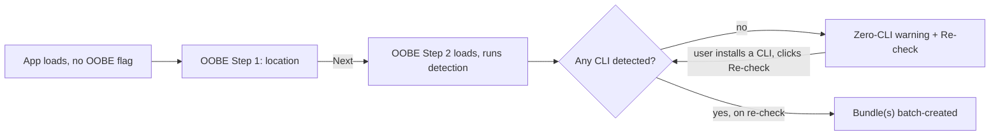
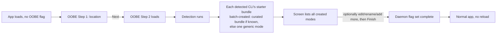
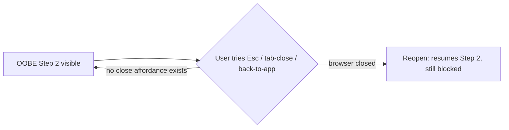
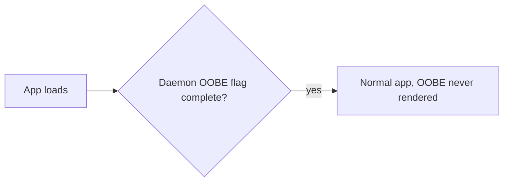
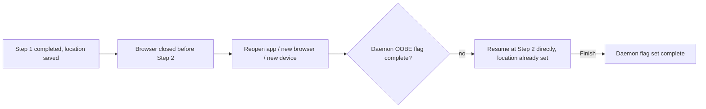

<!--
RULES — read before writing or implementing:
1. FORMAT: Bullets, tables, code, diagrams ONLY — no prose paragraphs
2. REQUIREMENTS: One crisp line each — no verbose descriptions
3. CHECKLIST: Mark items [x] as you complete them — this is your persistent todo list
4. READING TIME: Optimize for fast human scanning — if it's hard to skim, rewrite it
-->

# PRD: OOBE (first-run onboarding)

> Two-step first-run flow — set a default project location, then batch-create starter agent modes (cli + model + context) from auto-detected installed CLIs, blocking until at least one mode exists — gated on a daemon-persisted completion flag.

**Status:** Draft
**Technical plan:** `.vibekit/feature-plans/pending/oobe-onboarding/plan-oobe-onboarding.md` _(not yet created)_

---

## Problem

- No first-run flow exists today — a brand-new user lands directly in the app with no default project location and zero agent modes.
- A mode is a cli + model + custom-context bundle, not a single choice — a blank "pick one" step doesn't reflect what actually needs to be set up, and an empty modes list is a dead end (no agent can run at all).
- Nothing tells a new user which CLIs (claude/cursor/opencode/agy) are actually installed before modes get created against them.

## Goals

- Every new install completes exactly two steps before touching the rest of the app: project location, then having at least one usable mode.
- Step 2 does the work for the user — detected CLIs get a batch of ready-to-use starter modes created automatically, not a menu the user must configure from scratch.
- Installed-CLI detection is visible at the moment it matters (creating modes) and reused verbatim in Settings.
- Completion state travels with the daemon, not the browser.

## Non-goals

- No onboarding tour/tooltips/feature walkthrough beyond the two steps.
- No new CLI-detection mechanism — reuses existing `doctor` detection as-is.
- No per-user OOBE state (single daemon-wide flag, matches today's single-user daemon model).
- No curated starter-mode bundle for every CLI on day one — only claude has one defined; others get a single generic mode (see §3).

---

## Requirements

### 1. Flow & gating

| ID | Requirement |
|----|-------------|
| R1 | A daemon with no completed-OOBE flag routes every screen to OOBE instead of the normal app. |
| R1a | OOBE never infers "already onboarded" from pre-existing projects/modes — a daemon with no completed-OOBE flag ALWAYS starts at step 1, even one already seeded with projects and modes (e.g. demo data, or an upgrade from a pre-OOBE version). |
| R1b | Pre-existing modes are not hidden or specially marked — they simply appear in step 2's list, and `detect-and-bundle` treats them as already-satisfied bundle entries (filling in only the gaps), the same as if the user had created them during this OOBE session. |
| R2 | OOBE has exactly two steps: project location, then agent mode. |
| R3 | Step 2 (agent mode) is a hard blocker — no close/skip affordance gets the user past it until at least one mode backed by a detected CLI exists. |
| R4 | Step 1 (project location) can be advanced past with a sensible default location, but not skipped without a value being set. |
| R5 | Closing the browser/tab, or opening a new browser/device, mid-OOBE resumes at the first incomplete step, not step 1. |
| R5a | Step 1's confirmed location is saved daemon-side immediately, independent of the completion flag, so R5's resume works. |
| R6 | Completing step 2 flips the daemon-side flag and immediately unblocks normal app routing, no reload required. |

### 2. Step 1 — Project location

| ID | Requirement |
|----|-------------|
| R7 | User sees one field for a default project location, pre-filled with a sensible OS default. |
| R8 | User can browse/edit the path before confirming. |
| R9 | Invalid/unwritable path shows an inline error and blocks advancing. |

### 3. Step 2 — Agent mode creation + CLI detection

| ID | Requirement |
|----|-------------|
| R10 | Screen runs the same installed-CLI detection `vst doctor` uses and lists each supported CLI as detected/not-detected. |
| R11 | A CLI with no binary on PATH is shown disabled, with a one-line hint on how to install it. |
| R12 | The first time a CLI is detected on this daemon, its **starter bundle** of modes is batch-created automatically — the user isn't asked to configure a mode from scratch to get past OOBE. |
| R12a | Automatic bundle creation (initial detection, Back/Next, resume, Re-check) fires at most once per CLI per daemon. |
| R12a-i | That once-per-daemon marker is tracked independently of whether any bundle mode still exists, so deleting a bundle mode does not resurrect it on the next automatic detection. |
| R12b | The explicit "create starter modes" action (R23, and OOBE's own retry affordance) is exempt from R12a. |
| R12b-i | The explicit action always creates whichever of that CLI's bundle-mode names are currently missing, letting the user deliberately restore a deleted one. |
| R13 | Claude's starter bundle is exactly 3 modes: `sonnet-implementer`, `opus-planner`, `fable-security-reviewer`. |
| R13a | Each bundle mode's model is looked up by name (`sonnet` / `opus` / `fable`) in claude's model discovery/curated list at creation time — never a hardcoded model id. |
| R13b | A named model missing from discovery (offline, not authed, curated list changed) skips only that one bundle mode, with the rest of the bundle still created. |
| R13c | If discovery fails for all 3 names at once, claude falls back to R14's single generic mode instead of an empty bundle. |
| R13c-i | R12a's "created" marker only counts a named bundle mode (`sonnet-implementer`/`opus-planner`/`fable-security-reviewer`), never R13c's generic fallback — so a fully-failed attempt keeps retrying the real bundle on each later automatic detection/Re-check. |
| R13c-ii | A retry that later succeeds adds the real bundle modes alongside the earlier generic fallback, rather than replacing it — user deletes the now-redundant generic one via R16 if unwanted. |
| R13c-iii | At most one generic fallback mode exists per CLI at a time — a retry that fails again reuses the existing fallback mode rather than creating another one. |
| R14 | A detected CLI with no curated bundle defined gets one generic default mode (that CLI's default discovered model, no preset context) instead of a named bundle. |
| R15 | After batch-creation, the screen lists every mode that exists for a detected CLI (name + cli + model) — bundle-created or pre-existing — so the user knows what now exists, before they can finish. |
| R16 | User can rename, edit the context of, or delete any auto-created mode, and can add further modes from scratch, all without leaving OOBE. |
| R17 | Zero CLIs detected: no modes can be created; screen still renders, no crash/blank state. |
| R18 | Zero-CLI state explains at least one CLI must be installed, and offers a "Re-check" action that re-runs detection (and, per R12a, any not-yet-created bundles) without a full reload. |
| R19 | Finishing requires at least one existing mode backed by a detected CLI — bundle-created, pre-existing (R1b), or hand-created (R16). |

### 4. Persistence

| ID | Requirement |
|----|-------------|
| R20 | OOBE-completed state is stored daemon-side and survives a web-ui reinstall, a new browser, or a new device pointed at the same daemon. |
| R21 | A second client (new browser/device) connecting to an already-onboarded daemon never sees OOBE. |

### 5. Settings reuse

| ID | Requirement |
|----|-------------|
| R22 | The modes settings screen shows the same installed/not-installed CLI badges as OOBE step 2, from the same detection call. |
| R23 | Settings offers the same starter-bundle action as OOBE, for any detected CLI, at any time — not just during first run. |
| R23-i | Per R12b it fills in any of that CLI's bundle modes that are currently missing, and shows an already-complete state when none are. |
| R24 | CLI detection and bundle creation in Settings are opt-in only — nothing there ever blocks editing/creating modes, unlike the OOBE blocker. |

---

## Resolved design questions

1. **Is OOBE per-user or per-daemon?** — **Per-daemon, one flag.** Matches the current single-user daemon model; no user accounts exist to scope it to.
2. **Can step 1 be skipped entirely?** — **No, but it has a pre-filled default** — advancing without editing the field is fine, having no location set is not.
3. **What blocks step 2 specifically?** — **No mode backed by a detected CLI exists yet.** A user with zero installed CLIs is stuck at step 2 by design until they install one and re-run detection.
4. **Does Settings get a separate detection implementation?** — **No — same detection call/result shape and same bundle-creation action as OOBE, rendered in both places.**
5. **Why batch-create modes instead of one blank "pick a mode" step?** — **A mode is cli+model+context, not a single pick — asking a new user to author 3 of those from scratch before they can use the app is the wrong first impression.** Pre-built starter modes give immediate, differentiated value (a planner, an implementer, a reviewer) and are fully editable afterward.
6. **Do cursor/opencode/agy get curated bundles too?** — **Not yet — only claude has one defined.** Other detected CLIs get one generic default mode; per-CLI bundles can be added later without changing this flow's shape.
7. **Where do the bundle's model choices come from?** — **Claude's model discovery/curated model list, looked up by name** (`sonnet`/`opus`/`fable`) at creation time — never a hardcoded model string, so the bundle stays correct as the curated list changes.
8. **What if creation fires twice for the same CLI?** — **Automatic triggers never duplicate (R12a); an explicit "create starter modes" click is the one deliberate way to restore a deleted bundle mode (R12b).**

---

## Screen layouts

### OOBE — Step 1: Project location

```
┌───────────────────────────────────────────────────┐
│  Welcome to vibe-station              Step 1 of 2  │
│                                                     │
│  Where should your projects live?                  │
│                                                     │
│  ┌─────────────────────────────────┐ ┌──────────┐  │
│  │ ~/code                          │ │  Browse  │  │
│  └─────────────────────────────────┘ └──────────┘  │
│  (pre-filled default; edit or browse to change)    │
│                                                     │
│  ⚠ Path not writable   ← inline error, blocks Next │
│                                                     │
│                                    ┌─────────────┐ │
│                                    │    Next →   │ │
│                                    └─────────────┘ │
└───────────────────────────────────────────────────┘
```

### OOBE — Step 2: Agent modes, freshly batch-created (blocking)

```
┌─────────────────────────────────────────────────────┐
│  ← Back                                  Step 2 of 2 │
│  We set up some agent modes for you      [BLOCKING]  │
│                                                       │
│  Detected CLIs:                                      │
│   claude     ✔ detected                              │
│   cursor     ✔ detected                              │
│   opencode   ✘ not found      "brew install ..."     │
│   agy        ✘ not found      "brew install ..."     │
│                                                       │
│  Modes created for you:                              │
│   ● sonnet-implementer     claude · sonnet [Edit][Del│
│   ● opus-planner           claude · opus   [Edit][Del│
│   ● fable-security-reviewer claude·fable   [Edit][Del│
│   ● cursor-default         cursor·(default)[Edit][Del│
│                                                       │
│  [+ Add another mode]                                │
│                                                       │
│  No close / skip / X button on this screen.          │
│                                    ┌─────────────┐   │
│                                    │   Finish    │   │
│                                    └─────────────┘   │
│                                    (disabled until a  │
│                                     mode backed by a  │
│                                     detected CLI, per │
│                                     R19, exists)      │
└─────────────────────────────────────────────────────┘
```

Notes:
- `[Edit]` opens the mode's name/model/context editor inline (rename included) — same editor Settings uses.
- `[Del]` removes that mode; per R12a-i it will not silently reappear on a later automatic re-detection of its CLI.

### OOBE — Step 2, zero CLIs detected (R17)

```
┌─────────────────────────────────────────────────────┐
│  ← Back                                  Step 2 of 2 │
│  Set up an agent mode                    [BLOCKING]  │
│                                                       │
│   claude     ✘ not found                             │
│   cursor     ✘ not found                             │
│   opencode   ✘ not found                             │
│   agy        ✘ not found                             │
│                                                       │
│  ⚠ No supported CLI found on PATH — nothing to       │
│    create a mode from. Install one, then re-check.   │
│                                    ┌─────────────┐   │
│                                    │  Re-check   │   │
│                                    └─────────────┘   │
│                                    (Finish stays      │
│                                     disabled)         │
└─────────────────────────────────────────────────────┘
```

### OOBE — Step 2, claude bundle fell back to generic (R13c)

```
┌─────────────────────────────────────────────────────┐
│  ← Back                                  Step 2 of 2 │
│  We set up some agent modes for you      [BLOCKING]  │
│                                                       │
│  Modes created for you:                              │
│   ● claude-default          claude · (default)[Edit] │
│                                                       │
│  ⚠ claude: couldn't reach any of the 3 starter       │
│    models — using a generic mode for now.            │
│                                    [Retry bundle]     │
│                                                       │
│  Finish is enabled (claude-default satisfies R19);   │
│  Retry bundle replaces nothing — a later success adds│
│  the 3 named modes alongside this one (R13c-ii).     │
└─────────────────────────────────────────────────────┘
```
The warning row itself is mutually exclusive with the mock above at a given
point in time — it appears only while a CLI's fallback mode is its only mode
(R13c); it clears once a successful retry adds the real bundle (R13c-ii) or
once R13b lets ≥1 named bundle mode through instead of the full fallback.

### Settings → Modes — CLI detection + bundle creation (R22/R23/R24)

```
┌─────────────────────────────────────────────────────┐
│  Modes                                      [+ New]  │
│                                                       │
│  Installed CLIs: claude ✔   cursor ✔   opencode ✘    │
│                  agy ✘                                │
│  claude starter modes: ✔ all 3 created  [Recreate 0]  │
│  cursor starter modes: ✔ created        [Recreate 0]  │
│  ← opt-in, never blocking; "Recreate N" only enables   │
│    when N of that CLI's bundle modes are missing       │
│  ───────────────────────────────────────────────────  │
│  ● sonnet-implementer        claude      [Edit][×]   │
│  ● opus-planner              claude      [Edit][×]   │
│  ● fable-security-reviewer   claude      [Edit][×]   │
│  ● cursor-default            cursor      [Edit][×]   │
└─────────────────────────────────────────────────────┘
```

---

## CUJ diagrams

### CUJ A — First launch, no CLIs detected



### CUJ B — First launch, some CLIs detected



### CUJ C — User tries to skip/close OOBE before completing step 2 (blocked)



### CUJ D — Returning user who already completed OOBE



### CUJ E — OOBE interrupted mid-flow, resumed later


