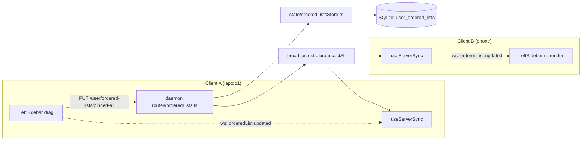

<!--
RULES — read before writing or implementing:
1. FORMAT: Bullets, tables, code, diagrams ONLY — no prose paragraphs
2. REQUIREMENTS: One crisp line each — no verbose descriptions
3. CHECKLIST: Mark items [x] as you complete them — this is your persistent todo list
4. READING TIME: Optimize for fast human scanning — if it's hard to skim, rewrite it
-->

# Plan: pinned-order-sync

> Move the pinned-items drag order (currently `localStorage`-only, per-browser) to the daemon DB so pin order stays consistent across every client (phone, laptop1, laptop2, …), designed as the first instance of a generic per-user "ordered list" primitive other client-only orderings (projects, saved workspaces) can adopt later without a schema change.

**Issue:** pinned-order-sync
**Branch:** `pinned-order-clients` (current worktree branch)
**Status:** WIP — implementation complete except 3.T4 (manual two-client verification)
**PRD:** none — small enough to skip (single table, 2 endpoints, 1 sidebar wiring point)

**Reference files:**
- Data / schema: `daemon/src/services/dbSchema.ts`
- Core logic: `daemon/src/state/orderedListsStore.ts` (new), `daemon/src/routes/orderedLists.ts` (new)
- UI / entrypoint: `web-ui/src/components/layout/LeftSidebar.tsx`
- Wiring: `daemon/src/server.ts`, `web-ui/src/hooks/useServerSync.ts`, `web-ui/src/hooks/useStore.ts`, `web-ui/src/api/client.ts`, `web-ui/src/api/mock.ts`

---

## Problem

- `sortOrders["pinned-all"]` — the user's dragged order for the combined pinned-worktrees + pinned-direct-sessions list — lives only in `zustand/persist` → `localStorage` (`web-ui/src/hooks/useStore.ts:252,829-832,1345`), keyed `"vibestation:workspace"`.
- Each browser/device has its own `localStorage`, so the same account sees a different pin order on phone vs. laptop1 vs. laptop2 — no daemon round-trip happens on drag.
- Regular (unpinned) worktree/session order is **already** server-backed via a real `sortOrder` column + `PATCH /worktrees/:id/reorder` / `PATCH /sessions/:id/reorder` (`daemon/src/routes/worktrees.ts:790`, `daemon/src/routes/sessions.ts:1019`) — that mechanism is *not* broken, it's per-project/per-worktree by design and can't express a list that mixes items across projects, which is what "pinned" requires (documented at `LeftSidebar.tsx:299-303`).

## Out of Scope

- The two other local-only orderings that share the identical mechanism — `sortOrders["projects"]` and `workspaceOrder["workspaces:global"]` (`useStore.ts:252-258`, `LeftSidebar.tsx:553`) — are NOT migrated this round.
  - The new table/route generalize by `scopeKey` so either can adopt it later with zero schema change (Decision 1) — that generalization is in scope, migrating their call sites is not.
- No real multi-user auth/identity — matches `PRD-scenes.md:29-35,102-103`'s explicit phasing (single implicit `local` user now, real user model deferred).
- No UI to view/manage order history or per-item pin metadata beyond the existing `pinnedAt` column — unchanged.
- No change to `Worktree.pinnedAt` / `Session.pinnedAt` (which items are pinned, and the default-if-never-dragged order) — those already round-trip through the daemon (`dbSchema.ts:44,73`) and are untouched.

## Concept

- New daemon-owned table stores a **named, user-scoped ordered list of ids** — generic enough that "pinned-all" is just the first `scopeKey` to use it.
- Sidebar's pinned-list drag handler writes to the daemon (not just local state) on every reorder; every connected client receives the new order over the existing WebSocket broadcast channel and re-renders, the same way `worktree:updated`/`session:updated` already propagate.
- On load, a client with a still-local-only order (pre-migration `localStorage` state) pushes it to the daemon exactly once if the daemon has no row yet, so nobody's current arrangement is silently discarded.

## Requirements

| # | Requirement |
|---|-------------|
| 1 | Dragging to reorder the pinned list persists the new order to the daemon DB, not just `localStorage`. |
| 2 | A second open client (same daemon, different browser/device) sees the new pinned order live, without a manual refresh, via the existing WS channel. |
| 3 | A fresh client with no daemon-side order yet (first upgrade) does not lose a user's existing local drag order — it is pushed up once. |
| 4 | Storage is shaped so it can be namespaced per real user later (`users/<id>/...`) with no migration, per the Scenes-PRD direction (`PRD-scenes.md:29-35`) — implemented today as a single implicit `userId = 'local'`. |
| 5 | The new table/endpoint generalize by `scopeKey`, not a `pinned`-specific name, so `sortOrders["projects"]` / `workspaceOrder["workspaces:global"]` can move to the same mechanism later without a new table. |

---

## Research

### Current pinned-order storage (client-only)

- **File:** `web-ui/src/hooks/useStore.ts:252` — `sortOrders: Record<string, string[]>` field declaration.
- **File:** `web-ui/src/hooks/useStore.ts:829-832` — `setSortOrder(scopeKey, orderedIds)` setter, plain local `set()`, no API call.
- **File:** `web-ui/src/hooks/useStore.ts:1345` — `sortOrders: s.sortOrders` inside `partialize`, persisted to `localStorage` under key `"vibestation:workspace"` (`useStore.ts:1088-1089`, schema `version: 16`).
- **Risk:** MEDIUM — three scopes (`pinned-all`, `projects`, `workspaces:global`) share this exact mechanism; touching `setSortOrder`'s signature affects all three, so this plan adds new plumbing alongside it rather than changing the shared setter's contract.

### Pinned-list render + reorder site

- **File:** `web-ui/src/components/layout/LeftSidebar.tsx:412-427` — `orderedPinnedItems`: builds `[...pinnedWorktrees, ...pinnedDirectSessions]`, default-sorts by `pinnedAt` DESC, then overrides via `applyLocalSortOrder(sortOrders["pinned-all"], ids)` (`LeftSidebar.tsx:109-116`).
- **File:** `web-ui/src/components/layout/LeftSidebar.tsx:439-452` — `handleReorder(scopeKey, currentIds, e)`: generic dnd-kit drag-end handler; for the pinned section called with `scopeKey = "pinned-all"`, ends in `setSortOrder(scopeKey, next)` — this is the **only** call site needing a daemon write added.
- **File:** `web-ui/src/components/layout/LeftSidebar.tsx:472-511` — `handleServerReorder(...)`: the *existing* pattern for a server-backed reorder (optimistic local patch via `useServerStore`, `api.reorderWorktree`/`api.reorderSession`, rollback on failure) — model the new pinned write path on this, not on `handleReorder`'s local-only shape.
- **Risk:** LOW — single call site, well-isolated function.

### Server-side reorder precedent (regular worktree/session order)

- **File:** `daemon/src/routes/worktrees.ts:786-815` — `PATCH /worktrees/:id/reorder`, `zod` body validation, `mutateProject` write, **full-object** WS broadcast (`broadcastAll({ type: "worktree:updated", worktree: ... })`) — comment at `worktrees.ts:770-776` explains a partial `{id, sortOrder}` broadcast previously corrupted client state ("reorder-drag-makes-the-row-vanish bug"). New broadcast must carry the full new list, not a delta.
- **File:** `daemon/src/routes/sessions.ts:1019` — identical pattern for sessions.
- **Risk:** LOW — pattern to imitate is clear and proven.

### Closest whole-resource GET/PATCH precedent

- **File:** `daemon/src/routes/settings.ts:14-46` — `GET /settings` / `PATCH /settings`, backed by `readSettings()`/`writeSettings()` (`daemon/src/services/config.ts`, JSON file at `~/.vibe-station/config.json`, **not** SQLite).
- **Decision:** the pinned order needs live WS fan-out to other clients and is naturally keyed (`scopeKey`), which the settings file (single global blob) doesn't model well — use SQLite + a dedicated route file instead of extending `settings.ts` (see Decision 2).

### Daemon schema / migration mechanism

- **File:** `daemon/src/services/dbSchema.ts:19-93` — `ensureSchema(db)`, `better-sqlite3`, raw SQL, `CREATE TABLE IF NOT EXISTS` for new tables (idempotent, runs on every `getDb()` open).
- **File:** `daemon/src/services/dbSchema.ts:138-142` — `addColumnIfMissing(db, table, column, ddl)` — only needed for *adding a column to an existing table*; a brand-new table just needs `CREATE TABLE IF NOT EXISTS`, no migration helper required.
- **No existing `settings`/`user_prefs`/order-list table in SQLite** — this is a new table, not a retrofit.

### Route registration + WS broadcast plumbing

- **File:** `daemon/src/server.ts:134-140` — every route module is registered here (`registerProjectRoutes(app)` … `registerSettingsRoutes(app)`); a new `registerOrderedListsRoutes(app)` call is added alongside them.
- **File:** `daemon/src/broadcaster.ts:32` — `export function broadcastAll(msg: ServerMessage): void` — the single fan-out point every route already uses. **`ServerMessage` is a zod-validated discriminated union**, not a bare TS type — `daemon/src/ws/protocol.ts:469-502` (`export const ServerMessage = z.discriminatedUnion("type", [...])`, e.g. `WorktreeUpdatedEvent` at `protocol.ts:409-412`). A new event needs its own `z.object({...})` schema added to that array **in addition to** the client-side `WSEvent` union below — `broadcastAll` will throw/reject at runtime if the event shape isn't in this array, regardless of what `web-ui/src/api/types.ts` declares.
- **File:** `web-ui/src/api/types.ts:313-492` — `WSEvent` discriminated union (`session:created` | `session:updated` | … | `worktree:updated` | …) — a new member is added here (client-side type only; does not satisfy `protocol.ts`'s server-side runtime schema above).
- **File:** `web-ui/src/hooks/useServerSync.ts:97-121` — `api.on("worktree:updated", ...)` etc.: the pattern every incremental WS reducer follows; a new `api.on("orderedList:updated", ...)` handler is added the same way.
- **File:** `daemon/src/server.ts:95-119` — a global Fastify `onRequest` hook enforces auth (Bearer token or `vst-session` cookie) on every route except the explicitly-stubbed `/auth/*` routes in no-auth dev mode; **no per-route opt-out exists**, so the new routes inherit this automatically — no extra wiring needed, but the API Contract below must document the `401` this implies (see Decision 3 update).

### Client API pattern

- **File:** `web-ui/src/api/client.ts:385-393` — `reorderWorktree(id, sortOrder)`: `apiFetch` + `PATCH` + `parseJson` — template for the new methods.
- **File:** `web-ui/src/api/mock.ts:501` — mirrored mock implementation; every real `client.ts` method needs a mock counterpart (mock/preview mode has no daemon). Mock methods that mutate state also **emit** the matching WS-shaped event (e.g. `mock.ts:501`'s `reorderWorktree` emits `worktree:updated`) so mock-mode tests can exercise the same `useServerSync` reducer path as the real client — the new mock `setOrderedList` must do the same for `orderedList:updated`.
- **File:** `web-ui/src/api/index.ts:8` — `ApiInstance = ReturnType<typeof createMockApi> | ReturnType<typeof createClientApi>` — no separate interface to edit; adding a method to both factories is sufficient, TypeScript infers the union.
- **Risk:** LOW — established, repeated pattern (this is the 3rd/4th "add a reorder-shaped endpoint" in this codebase).

## Root Cause

- The pinned list is the one ordering surface whose items legitimately span projects (mixed worktree + direct-session ids from anywhere), so it was deliberately kept off the existing per-project `sortOrder` column (`LeftSidebar.tsx:299-303`) — and nothing was ever built to replace that gap with a cross-project, server-side equivalent.
- Everything else needed (auth, DB, WS broadcast, route conventions) already exists in the codebase; this is additive plumbing, not a new subsystem.

---

## Architecture Diagram



---

## Design Details

### System Boundaries

| Boundary | Fields + types | Errors | Source of truth |
|----------|----------------|--------|-----------------|
| Frontend ↔ Backend | `scopeKey: string` (path param, allowlisted — Decision 7), `itemIds: string[]` (body/response), `updatedAt: string \| null` (ISO8601) | `400 VALIDATION_ERROR` (bad body shape or non-allowlisted `scopeKey`) · `401` (missing/invalid auth — global `onRequest` hook, `server.ts:95-119`, applies to every route including these, same as `/worktrees/*`) | Daemon SQLite is authoritative; client `sortOrders[scopeKey]` is a cache overlaid by WS/refetch |
| Client ↔ DB | table `user_ordered_lists(userId, scopeKey, itemIds, updatedAt)`, PK `(userId, scopeKey)` | n/a (no FK — `userId` is a bare string, no `users` table exists yet) | daemon owns writes; `mutateProject`-style single-writer discipline not needed since this table isn't nested under `projects.json`-equivalent state |

### Critical User Journeys (CUJs)

#### CUJ 1 — Drag-reorder propagates to a second open client

```
User on laptop1 drags a pinned item to a new position
  → LeftSidebar.handleReorder computes `next: string[]`
  → Optimistic local setSortOrder("pinned-all", next) — list re-renders instantly on laptop1
  → api.setOrderedList("pinned-all", next) → PUT /user/ordered-lists/pinned-all
  → daemon upserts row, broadcasts { type: "orderedList:updated", scopeKey: "pinned-all", itemIds: next, updatedAt }
  → phone (open, WS connected) receives the event, useServerSync applies it into sortOrders["pinned-all"]
  → phone's pinned list re-renders in the new order, no manual refresh
```

- **Error path:** `PUT` fails (network drop) → laptop1's optimistic local order stays, no rollback attempted (there is nothing to roll back *to* — local state already reflects the user's intent, unlike `handleServerReorder`'s rollback which restores a known-good prior value). No user-visible error toast. It is stale vs. daemon until the next successful write or the next mount-time `GET`.
- **Edge case:** two clients drag concurrently within the same second → last `PUT` wins (whole-array overwrite, no merge) — acceptable, same last-write-wins semantics as every other WS-synced entity in this codebase (e.g. `worktree:updated`).
- **Self-echo:** `broadcastAll` fans out to every connected client **including the one that issued the `PUT`** — laptop1 also receives its own `orderedList:updated` event. The reducer (Phase 2.4) applies it unconditionally (`setSortOrder("pinned-all", ev.itemIds)`), which is a harmless no-op re-set to the same value it optimistically wrote already — same posture as `worktree:updated`'s existing self-echo (no dedup/origin-check exists for that event either), so no new mechanism is needed here.
- **Reconnect race:** `refresh()` (Decision 5's hydrate/migrate block) re-runs on **every `ws:open`**, not just initial mount (`useServerSync.ts:87-90`) — a reconnect that lands between an optimistic local drag and its in-flight `PUT`'s response could `GET` a stale server array and clobber the just-made local order via the `else` (hydrate) branch. Mitigation: skip the hydrate branch's `setSortOrder` call if a `setOrderedList` call is currently in flight (module-level `let orderedListWriteInFlight: Promise<unknown> | null` in `useServerSync.ts`, set/cleared around the Phase 3.1 `PUT` the same way `inFlightRefresh` guards `refresh()`) — the pending write's own response (or its WS echo) will land right after and settle to the correct value regardless.

#### CUJ 2 — First load after upgrade: local-only order migrates up once

```
User opens vibe-station on a client that already has sortOrders["pinned-all"] in localStorage
  → useServerSync mount effect: GET /user/ordered-lists/pinned-all
  → Response has itemIds: [] (no daemon row yet — never synced before)
  → Local sortOrders["pinned-all"] is non-empty
  → Client pushes it once: PUT /user/ordered-lists/pinned-all { itemIds: <local order> }
  → Daemon row now exists; every other client's next GET/broadcast sees this order
```

- **Edge case:** daemon already has a row (another client synced first) → server response `itemIds` is authoritative, local `sortOrders["pinned-all"]` is overwritten with it (no merge, no "whose order wins" prompt) — first client to sync after this ships wins, deterministic and simple.
- **Edge case:** neither client has ever set an order → both get `itemIds: []`, `applyLocalSortOrder` already handles an empty/undefined order by falling back to `pinnedAt` DESC (`LeftSidebar.tsx:109-116`) — no special-case code needed.

### Data Model

| Entity | Field | Type | Constraints | Notes |
|--------|-------|------|-------------|-------|
| `user_ordered_lists` | `userId` | `TEXT` | PK (composite), `NOT NULL DEFAULT 'local'` | No `users` table yet — bare string, matches `PRD-scenes.md:33-35`'s `users/<id>/...`-shaped-but-single-user-today direction |
| `user_ordered_lists` | `scopeKey` | `TEXT` | PK (composite), `NOT NULL` | e.g. `"pinned-all"` today; `"projects"` / `"workspaces:global"` could reuse this table later, out of scope this round |
| `user_ordered_lists` | `itemIds` | `TEXT` | `NOT NULL` | JSON-encoded `string[]` — mirrors the client's `sortOrders[scopeKey]: string[]` shape exactly, no translation needed at either boundary |
| `user_ordered_lists` | `updatedAt` | `TEXT` | `NOT NULL` | ISO8601, set server-side on every upsert |

- **Relationships:** none (no FK — `userId` is not yet backed by a real `users` table, by design, same posture as Scenes).
- **Indexes:** none beyond the composite PK — lookups are always by exact `(userId, scopeKey)`, no range/scan query exists.
- **Migration:** Y — brand-new table via `CREATE TABLE IF NOT EXISTS` in `ensureSchema` (`dbSchema.ts`); no `addColumnIfMissing` needed since nothing is added to an existing table. No backfill — table starts empty, CUJ 2 backfills client-side on first sync per user/browser.

### API Contracts

```
GET /user/ordered-lists/:scopeKey
  Request:  — (scopeKey e.g. "pinned-all", validated against an allowlist — Decision 7)
  Response: { scopeKey: string, itemIds: string[], updatedAt: string | null }
            (itemIds: [], updatedAt: null when no row exists yet — never a 404 for an unknown-but-valid scopeKey)
  Errors:   400 VALIDATION_ERROR (scopeKey not in the allowlist) · 401 (auth — global hook, every route)

PUT /user/ordered-lists/:scopeKey
  Request:  { itemIds: string[] }
  Response: { ok: true, scopeKey: string, itemIds: string[], updatedAt: string }
  Errors:   400 VALIDATION_ERROR (itemIds missing / not string[], or scopeKey not in the allowlist) · 401 (auth)
```

- Both routes implicitly operate on `userId = 'local'` server-side — no `userId` in the URL or body (Decision 3).
- WS broadcast on every successful `PUT`: `{ type: "orderedList:updated", scopeKey: string, itemIds: string[], updatedAt: string }` — new member on **both** the server-side `ServerMessage` zod union (`daemon/src/ws/protocol.ts:469-502`) and the client-side `WSEvent` TS union (`web-ui/src/api/types.ts`) — see Phase 1.5/1.6.

### Key Decisions

#### Decision 1: Generic `scopeKey`-dimensioned table, not a `pinned_order`-specific one

- **Decision:** table and route are named/shaped around an arbitrary `scopeKey: string`, not hardcoded to pinned items.
- **Rationale:** `sortOrders["projects"]` and `workspaceOrder["workspaces:global"]` (`useStore.ts:252-258`) are the exact same "client-only ordered id list" shape — building `scopeKey`-generic plumbing now means moving them later is a client-side wiring change only, zero new table/migration. Matches the plan's explicit future-scalability ask.
- **Where:** `daemon/src/services/dbSchema.ts` (table def), `daemon/src/routes/orderedLists.ts` (route param).

#### Decision 2: New SQLite table + route, not an extension of `settings.ts`

- **Decision:** dedicated `user_ordered_lists` table and `orderedLists.ts` route, instead of adding a `pinnedOrder` field to the JSON-file-backed `Settings` (`daemon/src/services/config.ts`).
- **Rationale:** Settings is a single global blob with no live WS fan-out to other clients (`settings.ts:14-46` — no `broadcastAll` call anywhere in that file); this feature's core requirement (#2: live cross-client sync) needs the WS broadcast + keyed-row pattern that `worktrees.ts`/`sessions.ts` already use. SQLite is also queryable per-key, which a single JSON blob is not.
- **Where:** `daemon/src/services/dbSchema.ts`, `daemon/src/routes/orderedLists.ts` (new), `daemon/src/server.ts:139` (registration).

#### Decision 3: Implicit `userId = 'local'`, no user in the URL

- **Decision:** every route call operates on a single hardcoded `userId = 'local'` string; the API surface never accepts a `userId` param today.
- **Rationale:** no real user/auth-identity model exists yet (confirmed: `daemon/src/routes/auth.ts` is a single shared-token login, no per-user identity) — matches `PRD-scenes.md:29-35` exactly ("store scenes on the daemon under a single implicit user... defaulting to a `local` user"). The `userId` **column** exists today so a future real user model is an `authenticated-user-id-instead-of-'local'` swap at the route layer, not a schema migration.
- **Where:** `daemon/src/routes/orderedLists.ts` — every query hardcodes `'local'`.

#### Decision 4: Whole-array upsert (last-write-wins), no operational-transform / merge

- **Decision:** `PUT` always replaces the entire `itemIds` array; no per-item move/insert endpoint, no conflict resolution beyond "last write wins."
- **Rationale:** matches this codebase's existing WS-sync semantics — full-object broadcast, not a patch (`worktrees.ts:770-776`'s "reorder-drag-makes-the-row-vanish" comment).
  - Concurrent drags from two devices in the same second are rare and low-stakes (worst case: re-drag to fix) — not worth building real conflict resolution for a pin-order list.
- **Where:** `daemon/src/routes/orderedLists.ts`.

#### Decision 5: One-time client-side migration push, no server-side backfill

- **Decision:** the "don't lose an existing local order on upgrade" requirement (#3) is handled entirely client-side in `useServerSync`'s mount effect (CUJ 2) — the daemon has no awareness of `localStorage` and does nothing special on first boot.
- **Rationale:** the daemon cannot see `localStorage` (it's per-browser); the client already knows its own local `sortOrders["pinned-all"]` and can trivially detect "server has nothing yet" via `updatedAt === null` on the `GET` response — no daemon-side migration script is needed or possible.
- **Where:** `web-ui/src/hooks/useServerSync.ts` (new block in the mount effect, alongside the existing initial-bundle fetch).

```ts
// useServerSync.ts — inside the existing mount-effect refresh(), after the
// initial projects/worktrees/sessions fetch. NOTE: refresh() re-runs on
// EVERY ws:open, not just initial mount (useServerSync.ts:87-90) — so this
// block runs on every reconnect too, not once. The `orderedListWriteInFlight`
// check (CUJ 1 "Reconnect race") guards the hydrate branch from clobbering
// a drag that's still in flight when a reconnect happens to land.
const pinnedOrder = await api.getOrderedList("pinned-all");
if (pinnedOrder.updatedAt === null) {
  // No daemon row yet — this client is the first to sync since upgrade.
  // Push local state up if there is any; an empty local order pushes an
  // empty array, which is harmless (GET already treats [] as "no order").
  const local = useWorkspaceStore.getState().sortOrders["pinned-all"];
  if (local && local.length > 0) {
    await api.setOrderedList("pinned-all", local);
  }
} else if (!orderedListWriteInFlight) {
  useWorkspaceStore.getState().setSortOrder("pinned-all", pinnedOrder.itemIds);
}
```

#### Decision 6: Reuse `setSortOrder` for the server-hydrated value, no new store field

- **Decision:** the daemon's `itemIds` for `"pinned-all"` is written into the exact same `sortOrders["pinned-all"]` field the local-only mechanism already uses — no parallel `serverSortOrders` field.
- **Rationale:** `orderedPinnedItems` (`LeftSidebar.tsx:412-427`) already reads `sortOrders["pinned-all"]` via `applyLocalSortOrder` — keeping one field means zero changes to the render/merge logic; only the *write path* gains a daemon round-trip (Decision 5's snippet, plus the drag handler in Phase 3).
- **`localStorage` persistence stays unchanged:** `sortOrders` remains in `useStore.ts:1345`'s `partialize` (still written to `localStorage`). Post this change it doubles as an offline/first-paint cache — a client renders its last-known order immediately on load, then the mount-effect hydrate (Decision 5) overwrites it with the daemon's value once the `GET` resolves. This can produce a brief stale-order flash on a client that's behind (acceptable — same "flash then reconcile" pattern the app already has for `sessionStates`, see `useServerSync.ts:70-74`'s comment on why REST truth overlays the persisted cache rather than replacing it outright).
- **Where:** `web-ui/src/hooks/useStore.ts:829-832` (`setSortOrder`, unchanged signature/body), `web-ui/src/components/layout/LeftSidebar.tsx:439-452` (`handleReorder`, gains a conditional API call for `scopeKey === "pinned-all"`).

#### Decision 7: `scopeKey` allowlisted server-side, not free-form

- **Decision:** the route validates `scopeKey` against a small hardcoded allowlist (`["pinned-all"]` today) via zod, rejecting anything else with `400`, rather than accepting any string.
- **Rationale:** Decision 1 deliberately makes the table/route generic over `scopeKey` for future reuse (`projects`, `workspaces:global`) — but an unvalidated free-form key lets any authenticated client grow the table with arbitrary rows (no cap on distinct keys or on `itemIds` length). An allowlist keeps the generalization (schema/route shape) while closing that off; extending to a new scope later is a one-line allowlist addition, not a schema change.
- **Where:** `daemon/src/routes/orderedLists.ts` — `z.enum(["pinned-all"])` (or equivalent) on the `scopeKey` path param; `itemIds` also capped (e.g. `z.array(z.string()).max(500)`) since a pinned list has no natural bound enforced elsewhere.

---

## Risks / Open Questions

| # | Question | Notes |
|---|----------|-------|
| 1 | **Should `handleReorder`'s daemon write be awaited/rolled back on failure, like `handleServerReorder`?** | No — Decision 4/CUJ 1: local state already reflects user intent optimistically; a failed `PUT` just means this client is stale vs. daemon until the next successful write or mount-time `GET`. Silent retry-on-next-drag is acceptable for a cosmetic ordering feature. |
| 2 | **What if `itemIds` references a worktree/session id that's since been deleted?** | Handled identically to today: `applyLocalSortOrder` (`LeftSidebar.tsx:109-116`) already filters `order` down to `liveIds` and appends any new/unknown live ids — no daemon-side validation needed, stale ids are silently dropped client-side same as now. |
| 3 | **Multiple browser tabs on the same device — does each push its own migration (Decision 5) redundantly?** | Yes, possible but harmless: second tab's `GET` will see `updatedAt` already set (first tab's push landed) and skip the migration push — a race where both fire simultaneously just means two back-to-back identical `PUT`s, no corruption (Decision 4, last-write-wins on an identical array is a no-op). |
| 4 | **Does a reconnect mid-drag clobber the local order before the in-flight `PUT` resolves?** | Mitigated by the `orderedListWriteInFlight` guard (CUJ 1 "Reconnect race", Decision 5 snippet) — the hydrate branch skips `setSortOrder` while a write is pending; the pending write's own response/echo settles the value right after. `clearOrderedListWrite` (Phase 2.3/3.1) is compare-and-clear, so a second drag's still-pending write can't be cleared early by the first drag's `finally` settling after it started. |
| 5 | **Does the originating client double-apply its own reorder via the WS self-echo?** | No functional issue — `broadcastAll` fans out to the originator too (no origin-check exists for any event in this codebase), so the reducer re-`setSortOrder`s to the same value it already optimistically set. Harmless no-op, same posture as every other WS-synced entity. |

---

## Implementation Phases

- Each phase ends with a **verification block** — the phase is not complete until those tests pass
- Test items use `N.Tn` numbering to distinguish them from implementation items

---

### Phase 1 — Daemon: schema, store, route, broadcast

- [x] **1.1** `daemon/src/services/dbSchema.ts`: add `CREATE TABLE IF NOT EXISTS user_ordered_lists (userId TEXT NOT NULL, scopeKey TEXT NOT NULL, itemIds TEXT NOT NULL, updatedAt TEXT NOT NULL, PRIMARY KEY (userId, scopeKey))` inside the existing `db.exec(...)` block (alongside `projects`/`worktrees`/`sessions`/`manifest_migrations`) — no `DEFAULT 'local'` needed since the route always supplies it explicitly (Decision 3).
- [x] **1.2** New `daemon/src/state/orderedListsStore.ts`: `getOrderedList(scopeKey: string): { itemIds: string[]; updatedAt: string | null }` (SELECT by `userId='local' AND scopeKey=?`, `JSON.parse(itemIds)`, `{itemIds: [], updatedAt: null}` if no row) and `setOrderedList(scopeKey: string, itemIds: string[]): { itemIds: string[]; updatedAt: string }` (upsert via `INSERT ... ON CONFLICT(userId, scopeKey) DO UPDATE SET itemIds=excluded.itemIds, updatedAt=excluded.updatedAt`, `JSON.stringify(itemIds)`, `updatedAt = new Date().toISOString()`) using `getDb()` from `daemon/src/state/db.ts`.
- [x] **1.3** New `daemon/src/routes/orderedLists.ts`: `registerOrderedListsRoutes(app: FastifyInstance)` with `GET /user/ordered-lists/:scopeKey` and `PUT /user/ordered-lists/:scopeKey`. `scopeKey` param validated via `z.enum(["pinned-all"])` (Decision 7); `PUT` body via `z.object({ itemIds: z.array(z.string()).max(500) })`; 400 on either `safeParse` failure, mirroring `worktrees.ts:790-795`'s validation shape. `PUT` calls `setOrderedList`, then `broadcastAll({ type: "orderedList:updated", scopeKey, itemIds, updatedAt })`.
- [x] **1.4** `daemon/src/ws/protocol.ts:469-502`: add `const OrderedListUpdatedEvent = z.object({ type: z.literal("orderedList:updated"), scopeKey: z.string(), itemIds: z.array(z.string()), updatedAt: z.string() })` and insert it into the `ServerMessage` discriminated-union array — **required** for `broadcastAll` in 1.3 to accept the event at runtime; the client-side `WSEvent` union (1.6) alone does not satisfy this.
- [x] **1.5** `daemon/src/server.ts:139` (next to `registerSettingsRoutes(app)`): add `registerOrderedListsRoutes(app)` + its import.
- [x] **1.6** `web-ui/src/api/types.ts:313-492` (`WSEvent` union): add `| { type: "orderedList:updated"; scopeKey: string; itemIds: string[]; updatedAt: string }` member.

**Verify phase 1:**
- [x] **1.T1** Integration — `orderedLists route`: `GET /user/ordered-lists/pinned-all` with no prior `PUT` returns `{ scopeKey: "pinned-all", itemIds: [], updatedAt: null }`.
- [x] **1.T2** Integration — `orderedLists route`: `PUT /user/ordered-lists/pinned-all` with `{ itemIds: ["a","b"] }` returns `{ ok: true, scopeKey: "pinned-all", itemIds: ["a","b"], updatedAt: <iso> }`, and a subsequent `GET` returns the same `itemIds`.
- [x] **1.T3** Integration — `orderedLists route`: `PUT` with `{ itemIds: "not-an-array" }` returns `400` with `error: "Validation error"`; `PUT /user/ordered-lists/not-a-real-scope` also returns `400` (Decision 7 allowlist).
- [x] **1.T4** Integration — `orderedLists route`: `PUT /user/ordered-lists/pinned-all` broadcasts `{ type: "orderedList:updated", scopeKey: "pinned-all", itemIds, updatedAt }` via `broadcastAll` — assert on a spied `broadcaster.ts` export, mirroring `daemon/src/__tests__/sessions.rename.broadcast.test.ts`'s pattern.
- [x] **1.T5** Unit — `orderedListsStore`: `setOrderedList` called twice with different arrays for the same `scopeKey` overwrites (not appends) — second `getOrderedList` reflects only the latest call.
- [x] **1.T6** Unit — `orderedListsStore`: `setOrderedList("pinned-all", ["a"])` then `setOrderedList("workspaces:global", ["b"])` — `getOrderedList("pinned-all")` still returns `["a"]` (store itself is not allowlist-restricted, only the route is — composite-PK isolation is the property under test, Decision 1's premise).

---

### Phase 2 — Web-UI: API client + store wiring

- [x] **2.1** `web-ui/src/api/client.ts` (near `reorderWorktree`, `client.ts:385-393`): add `getOrderedList(scopeKey: string): Promise<{ scopeKey: string; itemIds: string[]; updatedAt: string | null }>` (`GET`) and `setOrderedList(scopeKey: string, itemIds: string[]): Promise<{ ok: true; scopeKey: string; itemIds: string[]; updatedAt: string }>` (`PUT`, JSON body `{ itemIds }`).
- [x] **2.2** `web-ui/src/api/mock.ts` (near `reorderWorktree`, `mock.ts:501-507`): mirrored in-memory mock — module-level `Map<string, {itemIds: string[], updatedAt: string | null}>`, same request/response shapes as 2.1. `setOrderedList` must call `emit({ type: "orderedList:updated", scopeKey, itemIds, updatedAt })` after writing, same as `mock.ts:505`'s `reorderWorktree` — required for 2.T4/3.T2 to exercise the WS reducer path in mock mode.
- [x] **2.3** `web-ui/src/hooks/useServerSync.ts`: add a module-level `let orderedListWriteInFlight: Promise<unknown> | null = null;` (mirrors `inFlightRefresh` at `useServerSync.ts:24`) plus two exported functions: `export function markOrderedListWrite(p: Promise<unknown>): void { orderedListWriteInFlight = p; }` and `export function clearOrderedListWrite(p: Promise<unknown>): void { if (orderedListWriteInFlight === p) orderedListWriteInFlight = null; }` — the compare-and-clear on `clearOrderedListWrite` is required so a second drag's still-pending write (a newer promise) can't be wiped by the first drag's `finally` settling after it. `LeftSidebar.tsx` (Phase 3.1) is a different module and cannot reach a bare module-level `let` directly, so it drives the flag through these two functions.
- [x] **2.4** `web-ui/src/hooks/useServerSync.ts`: inside the existing mount `refresh()` effect (`useServerSync.ts:59-92`), after the initial bundle fetch, add the Decision 5 migration/hydrate block (GET → push-if-empty-on-server else hydrate local `sortOrders["pinned-all"]` via `useWorkspaceStore.getState().setSortOrder`, guarded by `orderedListWriteInFlight`) — note this effect re-runs on every `ws:open`, not just initial mount.
- [x] **2.5** `web-ui/src/hooks/useServerSync.ts`: in the incremental WS-reducer effect (`useServerSync.ts:97-121`), add `api.on("orderedList:updated", (ev) => { if (ev.type === "orderedList:updated" && ev.scopeKey === "pinned-all") useWorkspaceStore.getState().setSortOrder("pinned-all", ev.itemIds); })`.

**Verify phase 2:**
- [x] **2.T1** Unit — `mock.ts`: `getOrderedList("pinned-all")` before any `setOrderedList` call returns `{ itemIds: [], updatedAt: null }`; after `setOrderedList("pinned-all", ["x"])`, `getOrderedList` returns `{ itemIds: ["x"], updatedAt: <non-null> }`.
- [x] **2.T2** Integration — `useServerSync` mount effect: given a mocked `api.getOrderedList` returning `updatedAt: null` and a pre-populated local `sortOrders["pinned-all"] = ["a","b"]`, asserts `api.setOrderedList` is called once with `("pinned-all", ["a","b"])`.
- [x] **2.T3** Integration — `useServerSync` mount effect: given `api.getOrderedList` returning `{ itemIds: ["c","d"], updatedAt: "..." }`, asserts local store's `sortOrders["pinned-all"]` becomes `["c","d"]` (server wins over any stale local value).
- [x] **2.T4** Integration — `useServerSync` WS reducer: firing a mocked `orderedList:updated` event with `scopeKey: "pinned-all"` updates `sortOrders["pinned-all"]` in the store; an event with a different `scopeKey` (e.g. `"projects"`) is a no-op (Decision 1 forward-compat — no consumer for other scopes yet).
- [x] **2.T5** Integration — `useServerSync` mount effect: while `orderedListWriteInFlight` is set (simulated pending `setOrderedList` promise), a `refresh()` triggered by a mocked `ws:open` does NOT call `setSortOrder` from the hydrate branch, even if `api.getOrderedList` resolves with a different `itemIds` than local state (CUJ 1 "Reconnect race", Risk 4).

---

### Phase 3 — Sidebar drag handler + end-to-end

- [x] **3.1** `web-ui/src/components/layout/LeftSidebar.tsx:439-452` (`handleReorder`): after the existing `setSortOrder(scopeKey, next)` call, add a daemon write for the pinned scope that also drives the Phase 2.3 in-flight guard via its exported functions:
  ```ts
  import { markOrderedListWrite, clearOrderedListWrite } from "@/hooks/useServerSync";
  // ...
  if (scopeKey === "pinned-all") {
    const p = api.setOrderedList("pinned-all", next).catch(() => {
      // stale until next successful write or reload — Decision/Risk 1
    });
    markOrderedListWrite(p);
    // Compare-and-clear: if a second drag started a newer write before this
    // one settles, `clearOrderedListWrite` no-ops instead of wiping the
    // newer promise out from under it (Risk 4).
    void p.finally(() => clearOrderedListWrite(p));
  }
  ```
- [x] **3.2** Update the doc comment at `LeftSidebar.tsx:299-303` and `:408-411,438` to reflect that `pinned-all` is no longer purely local — it's now daemon-synced (still distinct from the `sortOrder`-column mechanism used for regular worktrees/sessions).
- [x] **3.3** `LeftSidebar.test.tsx`: extend/add coverage for the pinned-list drag handler calling `api.setOrderedList` with the new order (mock `api`, assert call args), plus a case that a WS `orderedList:updated` event re-renders the list in the new order.

**Verify phase 3:**
- [x] **3.T1** Unit — `LeftSidebar.test.tsx`: dragging a pinned item calls `api.setOrderedList("pinned-all", <expected new order>)` exactly once.
- [x] **3.T2** Integration — `LeftSidebar.test.tsx`: simulating an incoming `orderedList:updated` WS event with `scopeKey: "pinned-all"` re-renders `orderedPinnedItems` in the new order without a page reload.
- [x] **3.T3** Regression — `LeftSidebar.test.tsx`: `sortOrders["projects"]` reorder (unrelated scope) still works unchanged — no `api.setOrderedList` call for that scope (confirms Decision 1's scoping didn't leak).
- [ ] **3.T4** Manual/device — two browser sessions against the same daemon (e.g. two tabs, or laptop + phone over Tailscale): drag a pinned item in one, confirm the other reflects the new order within a few seconds without manual refresh.

---

## Files & Phase Impact

| File | Status | Phase | Description / Contract Change |
|------|--------|-------|-------------------------------|
| `daemon/src/services/dbSchema.ts` | **Modified** | 1.1 | New table: `user_ordered_lists(userId, scopeKey, itemIds, updatedAt)`, composite PK |
| `daemon/src/state/orderedListsStore.ts` | **New** | 1.2 | Contract: `getOrderedList(scopeKey): {itemIds, updatedAt}`, `setOrderedList(scopeKey, itemIds): {itemIds, updatedAt}` · Owns: `user_ordered_lists` rows |
| `daemon/src/routes/orderedLists.ts` | **New** | 1.3 | Contract: `GET/PUT /user/ordered-lists/:scopeKey`, `scopeKey` allowlisted (Decision 7) |
| `daemon/src/ws/protocol.ts` | **Modified** | 1.4 | New `ServerMessage` union member: `OrderedListUpdatedEvent` (zod schema — required for `broadcastAll` to accept the event) |
| `daemon/src/server.ts` | **Modified** | 1.5 | Register `registerOrderedListsRoutes(app)` |
| `web-ui/src/api/types.ts` | **Modified** | 1.6 | New `WSEvent` member: `orderedList:updated` |
| `web-ui/src/api/client.ts` | **Modified** | 2.1 | New methods: `getOrderedList`, `setOrderedList` |
| `web-ui/src/api/mock.ts` | **Modified** | 2.2 | Mirrored mock implementations; `setOrderedList` emits `orderedList:updated` |
| `web-ui/src/hooks/useServerSync.ts` | **Modified** | 2.3, 2.4, 2.5 | `orderedListWriteInFlight` guard + exported `markOrderedListWrite`, mount-time migration/hydration, WS reducer for `orderedList:updated` |
| `web-ui/src/components/layout/LeftSidebar.tsx` | **Modified** | 3.1, 3.2 | `handleReorder` gains a daemon write + in-flight guard for `scopeKey === "pinned-all"` |
| `web-ui/src/components/layout/LeftSidebar.test.tsx` | **Modified** | 3.3 | New/extended drag + WS-sync test cases |
| `daemon/src/__tests__/orderedListsStore.test.ts` | **New** | 1.T5, 1.T6 | Unit tests for the store module, incl. scope isolation |
| `daemon/src/__tests__/orderedLists.routes.test.ts` | **New** | 1.T1-1.T4 | Route integration tests incl. broadcast (mirrors `worktrees.reorder.test.ts` / `sessions.rename.broadcast.test.ts` conventions) |
