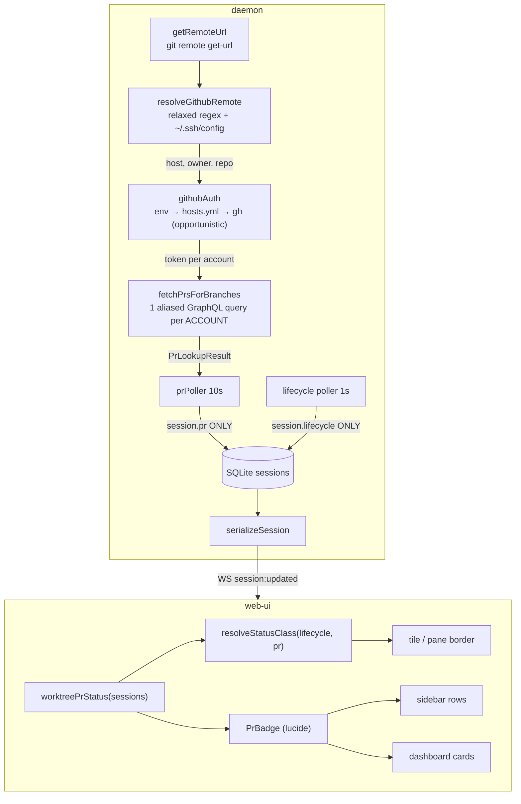

<!--
RULES — read before writing or implementing:
1. FORMAT: Bullets, tables, code, diagrams ONLY — no prose paragraphs
2. REQUIREMENTS: One crisp line each — no verbose descriptions
3. CHECKLIST: Mark items [x] as you complete them — this is your persistent todo list
4. READING TIME: Optimize for fast human scanning — if it's hard to skim, rewrite it
-->

# Plan: PR status axis — fix dead PR detection + two-axis status UI

**Issue:** — · **Branch:** `pr-created-state` · **Status:** wip · **PRD:** none (chain was `plan-implement`)
**Research:** `.vibekit/reports/2026-08-16-pr-detection-broken-root-cause-and-fix.md` — **authoritative**; D1–D16 are locked, do not re-litigate.

> **Phase-ordering invariant:** `needs_review` stays in every type union until **Phase 4**, which removes it everywhere atomically. Phases 1–3 are additive so `pnpm typecheck` passes at the end of each. Do not delete a union member early.

## Problem
- PR detection is 100% dead — **0 of 269 sessions have ever reached `needs_review`** since the feature shipped in `4ada68d`.
- Root cause: `parseGithubRepo` (`daemon/src/services/github.ts:46-56`) requires a literal `github.com` host; 103 of 147 worktrees use SSH host aliases → `prPoller.ts:112` silently returns, no log.
- Two more silent failures stack behind it: no credentials (private repos → 404) and per-worktree polling (147 req/tick = 8,820/hr, over the 5,000/hr authed cap).
- Every failure returns the same `null` as "no PR exists" — which is why this hid for weeks.
- `needs_review` conflates two orthogonal facts (agent activity vs PR existence) into one enum slot with three uncoordinated writers.

## Concept
- Split status into two axes: **lifecycle** (agent activity) and **PR** (VCS outcome), each with its own indicator.
- PR open → **yellow**; PR merged → **green**; both derived live from the worktree's *current branch*, so a branch change re-derives naturally and merged-green persists until the worktree is removed.

## Requirements
| # | Requirement |
|---|-------------|
| R1 | PR detection works for SSH host aliases (`git@github-<user>:owner/repo`) |
| R2 | Both GitHub accounts (`techwithnidhi`, `fastestdevalive`) work simultaneously |
| R3 | ≤2 GitHub API requests per poll tick regardless of worktree count |
| R4 | "Couldn't check" is never treated as "no PR" — state holds on transient failure |
| R5 | `needs_review` removed from `LifecycleState`; PR status on an orthogonal field |
| R6 | PR open renders yellow, merged green, on border + badge |
| R7 | `waiting_for_human` (red) is never masked by PR color |
| R8 | Status colors are per-theme CSS tokens, defined once |
| R9 | Docker dev sandbox makes zero network calls and zero log lines |
| R10 | Records persisted with `needs_review` still load |

## Research
- **State model:** `LifecycleState` `daemon/src/types.ts:8-15`; UI mirror `SessionState` `web-ui/src/api/types.ts:74-81`; rollup + rank `web-ui/src/lib/worktreeStatus.ts:3-11,17-26,34-53,62-92`.
- **Poller:** `daemon/src/services/prPoller.ts` — `pollWorktree:98-140`, `pollAllPrs:143-175`, interval `:38`, `setWorktreePrMergedAt:72-96`.
- **Transport:** `github.ts` — header `:1-11`, `getRemoteUrl:28-37`, `parseGithubRepo:46-56`, cache `:58-68` (TTL `:67`), `fetchPrForBranch:77-89`, `fetchPrForBranchUncached:98-140`. Error paths all `return null` (`:116,127,137-139`).
- **Route consumer:** `daemon/src/routes/worktrees.ts:20` (import), `:1168-1172` (`GET /worktrees/:id/pr`); test `daemon/src/__tests__/worktrees.test.ts:872-889`.
- **Session persistence:** `serializeSession` `daemon/src/routes/sessions.ts:374`; `INSERT INTO sessions` explicit column list `daemon/src/state/project-store.ts:257-258`; `rowToSession` `sqliteRowMappers.ts:45`. Existing session columns are **camelCase** (`spawnedFrom`, `lastTransitionAt`).
- **`needs_review` — all 14 code sites:** `daemon/src/ws/protocol.ts:209-217,218-226,253-261` (3 zod enums); `daemon/src/__tests__/protocol.test.ts:21-29`; `daemon/src/__tests__/prPoller.test.ts:165,179,182,199-213,234-235,282,286-287`; `web-ui/src/components/dev/DevStatePanel.tsx:17-25`; `web-ui/src/lib/worktreeStatus.test.ts:54,61-67`; `worktreeStatus.ts:3-11,17-26,34-53`; `StatusDot.tsx:5`; `DashboardPanel.tsx:38`. **`lifecycle.ts` has ZERO occurrences** — do not touch it.
- **Comment-only mentions to scrub:** `daemon/src/main.ts:174`; `prPoller.ts:9-18,52`; `dbSchema.ts:114`; `web-ui/src/api/types.ts:41-43,68-72`; `useStore.ts:172`; `LeftSidebar.tsx:143`; `workspace.css:2121-2123`; `workspace-canvas.css:399-408,417-421`; `chat.css:14-24`.
- **`prMergedAt` inventory:** `types.ts:302`; `dbSchema.ts:116`; `sqliteRowMappers.ts:133,150,168`; `project-store.ts:253-254`; `prPoller.ts:66,72-96,104,123-125,132-137,168`; `routes/worktrees.ts:142`; `web-ui/src/api/types.ts:47`; `DashboardPanel.tsx:161-164`; tests `prPoller.test.ts:98-101,103-108,126,217,251,268`.
- **Colors:** only 2 of 8 states have a dot color — `waiting_for_human` `#ef4444` (`workspace.css:2125`), `needs_review` `#b98cff` (`:2129`). Only 2 have a border — `#ef4444` + `var(--success)` (`workspace-canvas.css:410,414`; `chat.css:26,30`). **`needs_review` is split-brain: violet dot, green border.** Unrelated `#ef4444` at `workspace.css:4525` (diff stats) — leave it.
- **Non-color cues retained:** `tile--exited{opacity:.9}` (`workspace-canvas.css:422-424`), `tile--spawning{border-style:dashed}` (`:426-428`).
- **Canvas status sites (NOT the drag-drop lines):** `WorkspaceCanvas.tsx:161` (`showAgentStatusBorders`), `:419` (`worktreeRolledUpStatus`), `:813-815` (`sessionStatus`), `:846-848` (tile class), `:867` (`<StatusDot>`).
- **VCS panel PR colors:** `workspace.css:3857,3897` (open `#4ade80`), `:3861` (merged `#a78bfa`), `:3865` (closed `#f87171`).
- **Tokens:** `tokens.css` dark `:73-106`, light `:108-140`. `--success` `#16a34a` (`:100,133`), `--accent` `#6e78c7`/`#5c64b5` (`:74,109`). No `--status-*` family exists.
- **Env:** `gh` **not** in `dev.Dockerfile:21-24`; `ssh` not either. Sandbox repos are `git init` with no remotes (`scripts/demo-seed.sh:44,765`). `~/.config/gh/hosts.yml` holds plaintext `oauth_token` per user.
- **Tests:** vitest. Daemon compiles under `cli` via symlink `cli/src/daemon -> ../../daemon/src` (`preserveSymlinks: true`) — so `daemon/src/__tests__/x.ts` **is** `cli/src/daemon/__tests__/x.ts`, one file, two paths. `prPoller.test.ts:33-37` factory-mocks the whole `github.js` module. **`daemon/src/__tests__/github.test.ts` already exists** (200+ lines, `describe("parseGithubRepo") :16-41`, `toBeNull()` assertions `:105,110,115,177-200`).

## Architecture



- **Key invariant:** `prPoller` writes **only** `session.pr`; `lifecycle.ts` writes **only** `session.lifecycle`. This is what removes the clobber race (D5/D6).

## Design Details

### CUJs
| # | Flow | Expected |
|---|------|----------|
| C1 | Agent opens a PR on its branch → next 10s tick | Tile border turns yellow; `PrBadge` shows `GitPullRequestArrow`; dashboard card moves to PR column |
| C2 | PR merges | Border turns green, badge → `GitMerge`; card stays in PR column until the worktree is removed |
| C3 | Agent needs input while its PR is open | Border is **red** (`waiting_for_human` wins, R7); yellow PR badge still visible |
| C4 | *(error)* GitHub returns 403 rate-limited | `session.pr` keeps its previous `state`; `error` set; border unchanged; one throttled warn |
| C5 | *(error)* Worktree has no git remote (Docker sandbox) | `not_github` cached; zero network calls; zero log lines (R9) |
| C6 | Branch is re-pointed to a new branch with no PR | `pr.state` → `none`; border reverts to lifecycle color |

### Data model
| Field | Type | Constraint | Where |
|---|---|---|---|
| `LifecycleState` | `not_started\|working\|idle\|waiting_for_human\|done\|exited` | `needs_review` removed **in Phase 4** | `daemon/src/types.ts:8-15` |
| `SessionRecord.pr` | `PrStatus \| undefined` | optional; absent ≡ never checked | `daemon/src/types.ts` |
| `PrStatus.state` | `none\|draft\|open\|merged\|closed` | required | — |
| `PrStatus.number` | `number \| undefined` | present iff a PR exists | — |
| `PrStatus.url` | `string \| undefined` | present iff a PR exists | — |
| `PrStatus.checkedAt` | ISO8601 string | required | — |
| `PrStatus.error` | `string \| undefined` | set on `error`/`no_credentials` | — |
| `sessions.prState/prNumber/prUrl/prCheckedAt` | TEXT/INTEGER/TEXT/TEXT | nullable; **camelCase** to match `spawnedFrom` | `dbSchema.ts` |
| `WorktreeRecord.prMergedAt` | — | **deleted** | superseded by D5 |

- **Migration:** additive columns via `addColumnIfMissing`. Removing `prMergedAt` drops only the `addColumnIfMissing` call — the column stays orphaned on existing DBs (SQLite has no cheap `DROP COLUMN`); that is the accepted rollback posture.
- **Back-compat (R10):** a row/manifest with `lifecycle.state === "needs_review"` maps to `idle` + `pr:{state:"open"}` in `rowToSession` (`sqliteRowMappers.ts:45`). The three zod enums in `protocol.ts` **keep** `"needs_review"` as an accepted input value (never emitted) so legacy clients/records don't fail validation.

### System boundaries — daemon ↔ web-ui
| Boundary | Contract |
|---|---|
| REST | `GET /sessions/:id` and every session-bearing route return `serializeSession` output, now including `pr?: {state, number?, url?, checkedAt, error?}` — `daemon/src/routes/sessions.ts:374` |
| WS | Existing `session:updated` carries the whole serialized session; add `pr` to its zod schema in `daemon/src/ws/protocol.ts`. **No new event type.** |
| REST | `GET /worktrees/:id/pr` → `200 {kind:"pr",pr:PrInfo}` · `200 {kind:"no_pr"}` · `200 {kind:"not_github"}` · `503 {kind:"error",reason,message}` · `503 {kind:"no_credentials"}` |
| Source of truth | daemon; client never derives `pr`, only renders it |

```ts
// daemon/src/services/github.ts — exported surface (mockable exactly like today)
export async function getRemoteUrl(repoPath: string): Promise<string | null>;
export async function resolveGithubRemote(remoteUrl: string):
  Promise<{ host: string; owner: string; repo: string } | null>;   // replaces parseGithubRepo, now async
export async function fetchPrForBranch(owner: string, repo: string, branch: string):
  Promise<PrLookupResult>;
export async function fetchPrsForBranches(
  entries: Array<{ owner: string; repo: string; branch: string }>,
): Promise<Map<string, PrLookupResult>>;                            // key `${owner}/${repo}#${branch}`
export function _clearPrCacheForTest(): void;

export type PrLookupResult =
  | { kind: "pr"; pr: PrInfo }
  | { kind: "no_pr" }
  | { kind: "not_github" }
  | { kind: "no_credentials" }
  | { kind: "error"; reason: "network"|"rate_limited"|"auth"|"api"; message: string; retryAfterMs?: number };
```

| `PrLookupResult` | `session.pr` write | Lifecycle | Log |
|---|---|---|---|
| `pr` open non-draft | `{state:"open"}` | untouched | none |
| `pr` draft/merged/closed | matching `state` | untouched | none |
| `no_pr` | `{state:"none"}` | untouched | none |
| `not_github` | untouched | untouched | none, ever (cached per worktree) |
| `no_credentials` | `error` set, `state` **held** | untouched | `warn` once per daemon lifetime |
| `error` | `error` set, `state` **held** | untouched | `warn` throttled 10min per reason |

```ts
// web-ui/src/lib/statusColor.ts — returns a CSS CLASS SUFFIX (matches existing
// `workspace-canvas__tile--${x}` / `agent-pane-slot--${x}` convention), never a hex or var().
export function worktreePrStatus(sessions: Session[]): PrStatus | null;   // isMain session's pr, else null
export function resolveStatusClass(
  lifecycle: WorktreeRolledUpStatus,   // rolled-up, NOT raw SessionState
  pr: PrStatus | null,
): string | null;                      // "waiting_for_human" | "pr-merged" | "pr-open" | lifecycle | null
```
- Precedence (K6/D12): `waiting_for_human` → `pr=merged` → `pr=open` → lifecycle → `null`.

### Key decisions
| # | Decision | Where |
|---|---|---|
| K1 | No `gh` binary — GraphQL over `fetch`, creds from `hosts.yml` (D2/D3) | `daemon/src/services/githubAuth.ts` (new) |
| K2 | SSH alias resolved by parsing `~/.ssh/config` in TS, never `ssh -G` (D4) | `github.ts` |
| K3 | Account→repo by probe, cached in-memory (D4b) | `github.ts` |
| K4 | One aliased GraphQL query per account per tick (D1) | `github.ts` |
| K5 | Poller holds state on non-definitive results (D8) | `prPoller.ts` |
| K6 | Border precedence via `resolveStatusClass` (D12) | `web-ui/src/lib/statusColor.ts` |
| K7 | Lifecycle keeps text glyphs; PR axis uses lucide (D16) | `PrBadge.tsx` |
| K8 | Poll 60s→10s **and** cache TTL 30s→5s, else the cache defeats the interval | `prPoller.ts:38`, `github.ts:67` |
| K9 | PR is per-session but rendered per-worktree → `worktreePrStatus` reads the **`isMain`** session (matches `prPoller.ts:161`) | `statusColor.ts` |

## Risks / Open Questions
| # | Question | Notes |
|---|----------|-------|
| 1 | `hosts.yml` keyring storage (no plaintext token) | Fallback chain step 4 covers it; only this host inspected |
| 2 | `~/.ssh/config` `Include` / `Match` blocks | Parser handles one `Include` level, no `Match`; falls back to `/^github[-.]/i` |
| 3 | Daemon restart required to see any of this | Running binary predates even `966b676` |

---

## Implementation Phases

### Phase 1 — GitHub transport (daemon, additive)
- [x] **1.1** New `daemon/src/services/githubAuth.ts`: `listAccounts(): Promise<Array<{login,token}>>` — env `GH_TOKEN_<LOGIN>` → `GITHUB_TOKEN`/`GH_TOKEN` → `~/.config/gh/hosts.yml` `users.<login>.oauth_token` → `gh auth token --user X` only if `gh` on PATH. Never throws; `[]` when nothing found.
- [x] **1.2** `github.ts`: add `PrInfo` + `PrLookupResult`; add async `resolveGithubRemote` (relaxed regex capturing any host → `~/.ssh/config` `HostName` → `/^github[-.]/i` heuristic → `null`). Cache parsed ssh-config by mtime. **Keep `parseGithubRepo` exported** until Phase 4.
- [x] **1.3** `github.ts`: implement `fetchPrsForBranches` — group by resolved account, one aliased GraphQL query per account (`repoN: repository(owner:,name:){ pullRequests(headRefName:, last:1, orderBy:{field:CREATED_AT,direction:DESC}){ nodes{ number url title state isDraft merged author{login} } } }`). Read GraphQL `errors[]` per alias; `NOT_FOUND` → probe other accounts, cache `owner→account`.
- [x] **1.4** `github.ts`: rewrite `fetchPrForBranch` as a single-entry wrapper over `fetchPrsForBranches`; return type becomes `PrLookupResult`; cache TTL `:67` 30s→5s (K8); never cache `error`.
- [x] **1.5** `daemon/src/routes/worktrees.ts:20,1168-1172`: migrate `GET /worktrees/:id/pr` to `resolveGithubRemote` + `PrLookupResult`, mapping each `kind` to the HTTP shapes in § System boundaries.
- [x] **1.6** Replace the `github.ts:1-11` header comment per D2 (config-file dependency, not binary; ssh-config parsed not invoked).
- [x] **1.7** **Required for Phase 1 to typecheck** — `prPoller.ts:114-137` still consumes the old `PrInfo | null` shape (`.state`/`.draft`/`.merged`). Adapt it minimally: `kind:"pr"` → existing behaviour, every other `kind` → early return. Full rewrite lands in 2.6.
- [x] **1.8** Web-ui consumer of the changed route — `web-ui/src/api/client.ts:606-613` casts `{pr: PrInfo|null}` via unchecked `parseJson`, so a stale shape **typechecks green and silently blanks the PR banner**. Switch on `kind`; mirror `PrLookupResult` into `web-ui/src/api/types.ts`. Check `VcsPanel.tsx:36,49,173,276-281` still renders.
- [x] **1.T1** Unit — `resolveGithubRemote`: `git@github-x:o/r.git` → `{host:"github-x",owner:"o",repo:"r"}`; `git@gitlab.com:o/r.git` → `null`; strips `.git`; handles `https://` and `ssh://`.
- [x] **1.T2** Unit — `listAccounts`: env wins over `hosts.yml`; `[]` when neither exists (no throw).
- [x] **1.T3** Unit — `fetchPrsForBranches`: a response with one `NOT_FOUND` alias still returns sibling results.
- [x] **1.T4** Unit — error mapping: non-2xx → `{kind:"error",reason:"api"}`; 403 + rate-limit headers → `reason:"rate_limited"` + `retryAfterMs`; no accounts → `{kind:"no_credentials"}`.
- [x] **1.T5** Regression — rewrite existing `daemon/src/__tests__/github.test.ts`: `describe("parseGithubRepo") :16-41` → `resolveGithubRemote`; convert the **5** `toBeNull()` assertions (`:39,55,105,110,115`) to `{kind:"no_pr"}`/`{kind:"error"}`; update the 3 cache tests at `:173-204` (`toHaveBeenCalledTimes`) for the 30s→5s TTL.
- [x] **1.T6** Regression — `daemon/src/__tests__/worktrees.test.ts`: `:865-870` asserts `{pr: null}` → `{kind:"not_github"}`; `:872-889` spy returns `PrLookupResult`.

**Verify phase 1:** `pnpm --filter @vibestation/cli test` green; `pnpm typecheck` clean (both packages).

### Phase 2 — `session.pr` + poller (daemon, additive)
- [x] **2.1** `types.ts`: add `PrStatus` interface + `SessionRecord.pr?: PrStatus`. **Do not touch `LifecycleState` yet.**
- [x] **2.2** `dbSchema.ts`: `addColumnIfMissing(db,"sessions","prState"|"prNumber"|"prUrl"|"prCheckedAt", …)` (camelCase, matching `spawnedFrom`).
- [x] **2.3** `sqliteRowMappers.ts`: add the 4 keys to `SessionRow`, `rowToSession` (`:45`), `sessionToRow`. **And** extend the explicit `INSERT INTO sessions` column list + `VALUES` at `project-store.ts:257-258` — omitting this silently drops every write.
- [x] **2.4** `routes/sessions.ts:374` `serializeSession`: emit `pr`. Add `pr` to the session shape in `daemon/src/ws/protocol.ts`.
- [x] **2.5** Delete `prMergedAt`: `types.ts:295,302` (doc comment + field), `dbSchema.ts:111-116` (comment block **and** the `addColumnIfMissing` call), `sqliteRowMappers.ts:133,150,168`, `project-store.ts:253-254`, `routes/worktrees.ts:142`, `prPoller.ts:66,72-96,104,123-125,132-137,168`.
- [x] **2.6** `prPoller.ts`: rewrite `pollAllPrs` to collect all worktrees → one `fetchPrsForBranches` call → apply the per-variant table. `pollWorktree` writes **only** `session.pr`; remove every `persistLifecycleState` call. Interval `:38` → `10_000`.
- [x] **2.7** `prPoller.ts`: add the D10 startup self-check log — per project, resolvable? credentialed? Replace `warnedNoToken` with the `no_credentials` once-per-lifetime warn.
- [x] **2.T1** Unit — `{kind:"error"}` leaves `session.pr.state` **and** lifecycle unchanged (R4 — the latent bug being fixed).
- [x] **2.T2** Unit — open non-draft → `pr.state==="open"`; merged → `"merged"`; `not_github` → no write, no log.
- [x] **2.T3** Unit — one tick, 3 worktrees, 2 accounts → exactly 2 batch queries (R3).
- [x] **2.T4** Unit — `getRemoteUrl` returns `null` → zero `fetch` calls, zero log lines (R9/C5).
- [x] **2.T5** Integration — `prState` survives a write→read round-trip through `project-store` (guards the 2.3 INSERT trap).
- [x] **2.T6** Regression — rewrite **all 11** `prPoller.test.ts` cases (`:165,179,182,199-213,217,234-235,251,268,282,286-287`) as `pr.state` assertions; drop `getCurrentPrMergedAt`/`seedProjectWithMergedAt` helpers (`:98-108,126`); update the mock factory (`:33-37`) to `{getRemoteUrl, resolveGithubRemote, fetchPrsForBranches, fetchPrForBranch, _clearPrCacheForTest}`.

**Verify phase 2:** `pnpm --filter @vibestation/cli test` green; `pnpm typecheck` clean; `grep -rn "prMergedAt" daemon/ web-ui/src` → **only** `web-ui/src/api/types.ts:47` and `DashboardPanel.tsx:161` (both removed in Phase 4).

### Phase 3 — Tokens, badge, borders (web-ui, additive)
- [x] **3.1** `tokens.css`: add `--status-waiting`, `--pr-open`, `--pr-merged`, `--pr-draft`, `--pr-closed` to **both** blocks (dark `:73-106`, light `:108-140`). D14 values: open `#eab308`/`#a16207`, merged `#22c55e`/`#15803d`, draft `#8a8a8a`/`#737373`, closed `#6b6b6b`/`#737373`, waiting `#ef4444`/`#dc2626`.
- [x] **3.2** Replace `#ef4444` with `var(--status-waiting)` at `workspace.css:2125`, `workspace-canvas.css:410`, `chat.css:26`. **Leave `workspace.css:4525`** (diff stats, unrelated). Add `.workspace-canvas__tile--pr-open`/`--pr-merged` and `.agent-pane-slot--pr-open`/`--pr-merged` rules.
- [x] **3.3** `web-ui/src/api/types.ts`: add `PrStatus` + `Session.pr?: PrStatus`. **Do not remove `needs_review` yet.**
- [x] **3.4** New `web-ui/src/lib/statusColor.ts`: `worktreePrStatus` + `resolveStatusClass` per the § System boundaries signatures. Pure, no React.
- [x] **3.5** New `web-ui/src/components/layout/PrBadge.tsx`: lucide `GitPullRequestArrow`/`GitMerge`/`GitPullRequestDraft`/`GitPullRequestClosed`, 14px `strokeWidth={2.5}`, colored by the matching token, `aria-label` per state, `null` when `state==="none"`.
- [x] **3.6** `WorkspaceCanvas.tsx:846-848` (tile class) + `:867` (`<StatusDot>`): derive the class via `resolveStatusClass`; render `PrBadge` beside `StatusDot`. `AgentPaneSlot.tsx:57-60` receives a **single** `session?: Session` (`AgentPaneSlotProps:10-14`), not a list — so call `resolveStatusClass(sessionStatus(session.state), session.pr ?? null)` there, **not** `worktreePrStatus`.
- [x] **3.T1** Unit — `resolveStatusClass`: `waiting_for_human` + `pr=open` → `"waiting_for_human"` (R7); `done` + `pr=merged` → `"pr-merged"`; `working` + `pr=none` → `"working"`; `pr=draft`/`closed` never win.
- [x] **3.T2** Unit — `worktreePrStatus`: returns the `isMain` session's `pr`; `null` when no main session.
- [x] **3.T3** Unit — `PrBadge`: `null` for `none`; correct `aria-label` for the other 4.
- [x] **3.T4** Regression — `exited` opacity + `spawning` dashed cues still apply (`workspace-canvas.css:422-428`).

**Verify phase 3:** `pnpm --filter @vibestation/web test` green; `pnpm typecheck` clean.

### Phase 4 — Remove `needs_review` atomically + dashboard/sidebar
> Every edit below lands in one phase because the union member cannot be removed piecemeal without breaking `typecheck`.
- [x] **4.1** `daemon/src/types.ts:8-15`: remove `needs_review` from `LifecycleState`.
- [x] **4.2** `daemon/src/ws/protocol.ts:209-217,218-226,253-261`: keep `"needs_review"` as an **accepted input** in all three zod enums (never emitted) per the back-compat rule; add a comment saying so.
- [x] **4.3** `sqliteRowMappers.ts:45` `rowToSession`: map a persisted `needs_review` → `idle` + `pr:{state:"open"}` (R10).
- [x] **4.4** `web-ui/src/api/types.ts`: remove `needs_review` from `SessionState:74-81`; delete `prMergedAt:47`; scrub comments `:41-43,68-72`.
- [x] **4.5** `worktreeStatus.ts:3-11,17-26,34-53,79`: remove from union, `rank`, `sessionStatus`, and the `else if (st === "needs_review")` branch inside `worktreeRolledUpStatus:62-92`.
- [x] **4.5b** `github.ts`: delete the now-unused `parseGithubRepo` export (kept through Phases 1–3 for compatibility).
- [x] **4.6** `StatusDot.tsx:5`: remove the `◆` entry. `workspace.css:2128-2130`: delete `.status-dot--needs_review`. `workspace-canvas.css:413-415` + `chat.css:29-31`: delete `--needs_review` border rules.
- [x] **4.7** `web-ui/src/components/dev/DevStatePanel.tsx:17-25`: remove `"needs_review"` from `STATES`.
- [x] **4.8** `DashboardPanel.tsx:24-40`: `bucketForRollup(rollup, pr)` — `pr.state==="open"||"merged"` → `"pr"`, checked **after** the `hasLiveActivity` short-circuit (`:144-157`), **before** the rollup. Delete the `prMergedAt` short-circuit (`:161-164`). Render `PrBadge` on worktree cards (`:216+`) and direct-session cards (`:194-215`).
- [x] **4.9** `LeftSidebar.tsx:938-940,1064-1068,1467-1469,1616-1620`: render `PrBadge` beside `StatusDot` at all four sites.
- [x] **4.10** Recolor **all six** VCS PR color sites in `workspace.css` — icons `:3857` `#4ade80`→`var(--pr-open)`, `:3861` `#a78bfa`→`var(--pr-merged)`, `:3865` `#f87171`→`var(--pr-closed)`; badges `:3897`→`var(--pr-open)`, `:3902`→`var(--pr-merged)`, `:3907`→`var(--pr-closed)`. Missing the badge trio leaves icon and badge different colors. `.vcs-pr--draft` already uses `var(--fg-muted)` — leave it.
- [x] **4.11** Scrub remaining `needs_review` comments: `daemon/src/main.ts:174`, `prPoller.ts:9-18,52`, `dbSchema.ts:114`, `useStore.ts:172`, `LeftSidebar.tsx:143`, `workspace.css:2121-2123`, `workspace-canvas.css:399-408,417-421`, `chat.css:14-24`. **`prPoller.ts:13-18`'s claim that "nothing else ever touches a `needs_review` session" is factually wrong** — `lifecycle.ts:205-222,295-303` moves it out within ~1s; correct the text, don't just delete it.
- [x] **4.T1** Unit — `bucketForRollup`: `done` + `pr=merged` → `"pr"` not `"finished"`; `working` + `pr=open` → `"working"` (live activity wins).
- [x] **4.T2** Integration — `DashboardPanel`: a worktree whose PR merges stays in the PR column across a `session:updated` event (replaces deleted `prMergedAt` coverage).
- [x] **4.T3** Integration — `daemon/src/__tests__/protocol.test.ts:21-29`: a legacy `session:state` carrying `"needs_review"` still parses (R10).
- [x] **4.T4** Integration — a session row persisted with `needs_review` loads as `idle` + `pr.state==="open"` (R10).
- [x] **4.T5** Regression — `web-ui/src/lib/worktreeStatus.test.ts:54,61-67`: rewrite the two `needs_review` cases against the new union.
- [x] **4.T6** Regression — `DashboardPanel`: an `archivedAt`-set session in `waiting_for_human` does **not** place its worktree in the Waiting bucket (`:137-142`); a direct session (`worktreeId == null`) with `pr.state==="open"` lands in the PR bucket (`:172-186`).

**Verify phase 4:** `pnpm ci` green (typecheck + lint + all tests); `grep -rn "needs_review" daemon/src web-ui/src` returns **only** `protocol.ts` (accepted-input enums + comment) and `sqliteRowMappers.ts` (back-compat map).

### Phase 5 — Recolour + rebucket per D17–D20 (amendment, 2026-08-17)
> Supersedes D14 and parts of 3.1/3.4/4.8. Requested after seeing Phase 1–4 in the sandbox.

- [x] **5.1** `tokens.css`: `--status-working` 🟡 `#eab308`/`#a16207` (new); `--pr-open` yellow→🔵 blue `#3b82f6`/`#1d4ed8`; `--pr-merged` 🟢 unchanged; `--status-waiting` 🔴 unchanged. Both theme blocks.
- [x] **5.2** `statusColor.ts` `resolveStatusClass`: precedence becomes `working|not_started` → `pr=merged` → `pr=open` → `waiting_for_human` → `idle` → `null`. **`done`/`exited` always return `null`** (neutral). _Superseded by D21 (done/exited inherit PR colour) and B2 (spawning/not_started wins over PR, checked ahead of the PR branches, not folded into `working`) — see `docs/STATUS-INDICATORS.md`._
- [x] **5.3** CSS: add `--working` border rules to `workspace-canvas.css` + `chat.css` (re-broadens what `6f020b6` scoped down — deliberate, user-requested). Recolour `--pr-open` rules to blue.
- [x] **5.4** **Branch-keyed PR (D20):** add `prBranch` to `PrStatus` + a `prBranch` SQLite column (`dbSchema.ts`, `sqliteRowMappers.ts`, `project-store.ts` INSERT list, `serializeSession`, `protocol.ts`, web-ui `PrStatus`). `prPoller` records the branch it queried.
- [x] **5.5** `statusColor.ts`: `worktreePrStatus(sessions, currentBranch)` returns `null` when `pr.prBranch !== currentBranch` — stale PR colour never renders. Update both call sites (`WorkspaceCanvas`, `DashboardPanel`, `LeftSidebar`).
- [x] **5.6** `DashboardPanel.tsx` `bucketForRollup`: `done`/`exited` → **Finished always**, checked FIRST, before live-activity and before PR (D19). Then live activity → Working; then branch-matched `pr=open|merged` → PR; then `waiting_for_human`/`idle` → Waiting.
- [x] **5.7** VCS panel: recolour `.vcs-pr--open` foreground **and** background to blue (`workspace.css:3857,3897,3892-3904`).
- [x] **5.8** **One indicator, not two (user request 2026-08-17):** the primary marker is the existing `●` dot from `StatusDot`, recoloured by `resolveStatusClass` — yellow (working), blue (PR open), green (PR merged). `waiting_for_human` keeps its shape-distinct red `!`; `idle` `○`, `done` `✓`, `exited` `×` stay neutral.
- [x] **5.9** **Retire `PrBadge` from the sidebar, canvas tiles and dashboard cards** — the coloured dot replaces it. Keep `PrBadge.tsx` + its test only if the VCS panel adopts it; otherwise delete both files and their imports. Simpler than maintaining two indicators per row.
  - Trade-off accepted: blue/green/yellow dots differ by colour alone. Mitigation — `aria-label` and `title` already carry the state name, and `waiting_for_human` (the urgent one) stays shape-distinct.
- [x] **5.T1** Unit — `resolveStatusClass`: `working`+`pr=open` → `"working"`; `waiting_for_human`+`pr=open` → `"pr-open"`; `idle`+`pr=open` → `"pr-open"`; `done`+`pr=merged` → `null`; `waiting_for_human`+no PR → `"waiting_for_human"`. _`done`+`pr=merged` → `null` superseded by D21 (now `"pr-merged"`) — see `statusColor.test.ts`'s D21 cases._
- [x] **5.T2** Unit — `worktreePrStatus`: returns `null` when `prBranch` ≠ current branch; returns the status when equal.
- [x] **5.T3** Unit — `bucketForRollup`: `done`+`pr=merged` → `"finished"` (D19 regression — the previously-wrong case).
- [x] **5.T4** Integration — `prBranch` round-trips through `project-store` (same INSERT-column trap as 2.T5).
- [x] **5.T5** Unit — `StatusDot`: renders `●` with the `pr-open` class for `waiting_for_human`+`pr=open`; `title`/`aria-label` names the state so it isn't colour-only.

**Verify phase 5:** `pnpm typecheck` + `pnpm lint` clean; both suites green; sandbox at `localhost:5184` shows yellow/red/blue/green per the D18 table.

## Files & Phase Impact
| File | Status | Phase | Description / Contract Change |
|------|--------|-------|-------------------------------|
| `daemon/src/services/githubAuth.ts` | **New** | 1.1 | Contract: `listAccounts(): Promise<Array<{login,token}>>` · Owns: token cache |
| `daemon/src/services/github.ts` | Modified | 1.2–1.4, 1.6 | Contract: `resolveGithubRemote`, `fetchPrsForBranches`, `PrLookupResult` · Owns: PR + ssh-config + owner→account caches |
| `daemon/src/routes/worktrees.ts` | Modified | 1.5, 2.5 | `GET /:id/pr` → `PrLookupResult` HTTP mapping; `prMergedAt` removed |
| `web-ui/src/api/client.ts` | Modified | 1.8 | `getPr` switches on `kind` — unchecked `parseJson` cast means a stale shape typechecks green (`:606-613`) |
| `web-ui/src/components/tools/VcsPanel.tsx` | Modified | 1.8 | Consume the `kind`-tagged result (`:36,49,173,276-281`) |
| `daemon/src/__tests__/github.test.ts` | **Modified** | 1.T1–1.T5 | Existing file — rewrite `parseGithubRepo` block, convert `toBeNull()` assertions |
| `daemon/src/__tests__/worktrees.test.ts` | Modified | 1.T6 | `fetchPrForBranch` spy returns `PrLookupResult` |
| `daemon/src/types.ts` | Modified | 2.1, 2.5, 4.1 | `PrStatus` + `SessionRecord.pr`; `prMergedAt` deleted; `LifecycleState` loses `needs_review` (Phase 4) |
| `daemon/src/services/dbSchema.ts` | Modified | 2.2, 2.5, 4.11 | 4 `pr*` session columns; drop `prMergedAt` add |
| `daemon/src/state/sqliteRowMappers.ts` | Modified | 2.3, 2.5, 4.3 | Map `pr*`; remove `prMergedAt`; back-compat `needs_review` → `idle`+`pr.open` |
| `daemon/src/state/project-store.ts` | Modified | 2.3, 2.5 | Extend `INSERT INTO sessions` column list `:257-258`; drop `prMergedAt` `:253-254` |
| `daemon/src/routes/sessions.ts` | Modified | 2.4 | `serializeSession` emits `pr` |
| `daemon/src/ws/protocol.ts` | Modified | 2.4, 4.2 | Session shape gains `pr`; 3 zod enums keep `needs_review` as accepted input |
| `daemon/src/services/prPoller.ts` | Modified | 2.5–2.7, 4.11 | Contract: writes only `session.pr`; batch lookup; 10s interval; self-check log |
| `daemon/src/__tests__/prPoller.test.ts` | Modified | 2.T1–2.T6 | Mock surface updated; all 11 cases → `pr.state` |
| `daemon/src/__tests__/protocol.test.ts` | Modified | 4.T3 | Legacy `needs_review` still parses |
| `daemon/src/main.ts` | Modified | 4.11 | Comment scrub |
| `web-ui/src/api/types.ts` | Modified | 3.3, 4.4 | `PrStatus` + `Session.pr`; `SessionState` loses `needs_review`; `prMergedAt` deleted |
| `web-ui/src/styles/tokens.css` | Modified | 3.1 | 5 new tokens in both theme blocks |
| `web-ui/src/styles/workspace.css` | Modified | 3.2, 4.6, 4.10, 4.11 | Tokenize `#ef4444`; delete `needs_review` dot; recolor 4 `.vcs-pr--*` |
| `web-ui/src/styles/workspace-canvas.css` | Modified | 3.2, 4.6, 4.11 | Tokenize; add `--pr-open`/`--pr-merged`; delete `--needs_review` |
| `web-ui/src/styles/chat.css` | Modified | 3.2, 4.6, 4.11 | Same |
| `web-ui/src/lib/statusColor.ts` | **New** | 3.4 | Contract: `worktreePrStatus(sessions)`, `resolveStatusClass(lifecycle, pr)` → class suffix · Owns: nothing (pure) |
| `web-ui/src/components/layout/PrBadge.tsx` | **New** | 3.5 | Contract: `<PrBadge pr={PrStatus|null} />`, `null` when `none` |
| `web-ui/src/components/layout/WorkspaceCanvas.tsx` | Modified | 3.6 | Tile class via `resolveStatusClass` (`:846-848`); `PrBadge` at `:867` |
| `web-ui/src/components/layout/AgentPaneSlot.tsx` | Modified | 3.6 | Border via `resolveStatusClass` |
| `web-ui/src/components/layout/StatusDot.tsx` | Modified | 4.6 | Drop `needs_review` glyph |
| `web-ui/src/lib/worktreeStatus.ts` | Modified | 4.5 | Union + rank + `sessionStatus` lose `needs_review` |
| `web-ui/src/lib/worktreeStatus.test.ts` | Modified | 4.T5 | Rewrite 2 `needs_review` cases |
| `web-ui/src/components/dev/DevStatePanel.tsx` | Modified | 4.7 | Remove from `STATES` |
| `web-ui/src/components/layout/DashboardPanel.tsx` | Modified | 4.8 | `bucketForRollup(rollup, pr)`; `prMergedAt` short-circuit deleted; `PrBadge` on cards |
| `web-ui/src/components/layout/LeftSidebar.tsx` | Modified | 4.9, 4.11 | `PrBadge` at 4 sites |
| `web-ui/src/hooks/useStore.ts` | Modified | 4.11 | Comment scrub |
| `web-ui/src/lib/statusColor.test.ts` | **New** | 3.T1–3.T2 | Unit — precedence + rollup |
| `web-ui/src/components/layout/PrBadge.test.tsx` | **New** | 3.T3 | Unit — rendering + a11y labels |
| `web-ui/src/components/layout/DashboardPanel.test.tsx` | Modified | 4.T1–4.T6 | Two-axis bucketing coverage |

### Phase 6 — Agents as the dashboard unit (amendment, 2026-08-17)
> User decision: a worktree is normally single-agent; multi-agent is rare (large features /
> parallel work). That removes the PR-duplication objection to per-agent cards, and deletes the
> lossy rollup that caused `966b676`'s hidden-working-sibling bug.

- [x] **6.1** `DashboardPanel.tsx`: replace the `DashboardItem` union with **one card per non-archived agent session** — worktree-attached and direct alike. Drops the two card types and the `kind: "worktree" | "direct"` special-casing.
- [x] **6.2** Bucket per session via `bucketForRollup(sessionStatus(liveState), pr)` — **delete the `hasLiveActivity` short-circuit** and the `worktreeRolledUpStatus` call from this file; both existed only to paper over the rollup.
- [x] **6.3** PR per session = `session.pr`, branch-guarded against its worktree's `branch` (direct sessions have no worktree → no PR).
- [x] **6.4** **Dropped by user decision (2026-08-17), not implemented.** No multi-agent PR guard: every non-archived agent session's card shows its own PR colour/bucket independently, with no `isMain` special-casing in `DashboardPanel.tsx`. Same-branch duplication across sibling sessions is expected/intended ("it's fine for 2 agents to transition through states together"). `worktreePrStatus()`'s `isMain` preference is unchanged and still used by the sidebar/canvas rollup — only the dashboard dropped the guard.
- [x] **6.5** Card content: agent/session name as the title, with worktree + branch as the subtitle so worktree context isn't lost. Link to `/session/:id` for direct sessions, `/worktree/:id` for worktree-attached (preserve existing nav).
- [x] **6.6** Split the Waiting column: `waiting_for_human` → **"Needs you"** (red), `idle` → **"Idle"**. Fixes the observed "in Waiting with no red exclamation" confusion. Idle is shown by default (not hidden behind "Show finished") — idle is open work, not done.
- [x] **6.7** Update `docs/STATUS-INDICATORS.md` (bucket table + § Per-session vs per-worktree, which no longer applies to the dashboard) and the AGENTS.md trigger list if bucket names changed.
- [x] **6.T1** Unit — `bucketForRollup`: unchanged semantics, plus the new `idle` → `"idle"` bucket; `waiting_for_human` → `"needs-you"`.
- [x] **6.T2** Integration — a worktree with 2 agent sessions renders 2 cards; **both** carry the PR colour/bucket when both match the branch (6.4 dropped — no `isMain` guard).
- [x] **6.T3** Integration — a direct (worktree-less) agent session renders one card and buckets by its own state.
- [x] **6.T4** Regression — archived sessions (`archivedAt != null`) still produce no card.
- [x] **6.T5** Regression — a `working` session and a `waiting_for_human` session in the same worktree now appear as two separate cards in two columns (the `966b676` bug becomes structurally impossible).

**Verify phase 6:** `pnpm typecheck` + `pnpm lint` clean; both suites green; sandbox at :5184 shows one card per agent across five columns.
