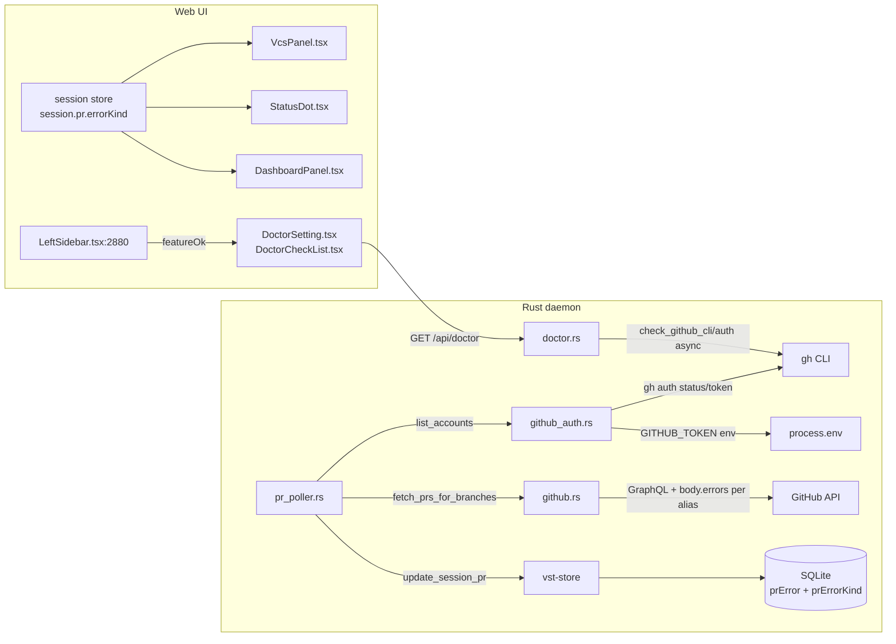

<!--
RULES — read before writing or implementing:
1. FORMAT: Bullets, tables, code, diagrams ONLY — no prose paragraphs
2. REQUIREMENTS: One crisp line each — no verbose descriptions
3. CHECKLIST: Mark items [x] as you complete them — this is your persistent todo list
4. READING TIME: Optimize for fast human scanning — if it's hard to skim, rewrite it
-->

# Plan: PR status — gh CLI credentials + error UX

> Replace `hosts.yml` credential parsing with `gh` CLI; persist PR errors to stop the 74-session rewrite storm; surface credential issues in Doctor, VCS panel, and dashboard.

**Issue:** —
**Branch:** `pr-status-ux-plan`
**Status:** WIP
**PRD:** —
**Reference:** `.vibekit/reports/2026-09-29-pr-status-ux-plan.md`

**Reference files:**
- Types: `rust/vst-types/src/domain.rs:104`
- Doctor REST types: `rust/vst-types/src/rest/doctor.rs:5`
- Store schema: `rust/vst-store/src/schema.rs:131`
- Store mapper: `rust/vst-store/src/row_mappers.rs:167`
- Store lib: `rust/vst-store/src/lib.rs:315`
- Credential chain: `rust/vst-lifecycle/src/github_auth.rs:104`
- PR fetch: `rust/vst-lifecycle/src/github.rs:238`
- PR poller: `rust/vst-lifecycle/src/pr_poller.rs:53`
- Doctor: `rust/vst-daemon/src/doctor.rs:37`
- Doctor hints: `rust/vst-types/src/rest/doctor_hints.rs`
- Routes (PR endpoint): `rust/vst-routes/src/worktrees.rs:1861`
- TS types: `web-ui/src/api/types.ts:241`
- Doctor checklist: `web-ui/src/components/doctor/DoctorCheckList.tsx:151`
- Doctor settings: `web-ui/src/components/settings/DoctorSetting.tsx:29`
- Doctor hook: `web-ui/src/hooks/useDoctorStatus.ts`
- Bottom-bar dot: `web-ui/src/components/layout/LeftSidebar.tsx:2880`
- VCS panel: `web-ui/src/components/tools/VcsPanel.tsx:88`
- Status dot: `web-ui/src/components/layout/StatusDot.tsx:31`
- Dashboard: `web-ui/src/components/layout/DashboardPanel.tsx:60`

---

## Problem & Concept

- `hosts.yml` absent → `list_accounts()` returns `[]` → env vars (`GITHUB_TOKEN` etc.) never fire → PR status silently disabled
- `pr.error` is written by the poller but never persisted (hardcoded `None` in mapper `row_mappers.rs:184`) → every 30s tick sees a diff → rewrites all 74 sessions
- Account A's error inserted with `or_insert_with` on a single map blocks account B from being tried
- `INSUFFICIENT_SCOPES` from GraphQL surfaces as "repository not found" — wrong root cause shown
- No user-visible signal that PR status is offline

## Out of Scope

- GHES (GitHub Enterprise Server) support
- PR status for direct (worktree-less) sessions
- `git credential fill` integration

## Requirements

| # | Requirement |
|---|-------------|
| 1 | `gh auth login` is the required setup step for PR status; `GITHUB_TOKEN`/`GH_TOKEN_<LOGIN>` env vars still work as override |
| 2 | `GITHUB_TOKEN` env var alone (no `gh` installed) creates a synthetic account — env-only users are not broken |
| 3 | Missing `gh` or no login → Doctor `Feature`-group checks are `error`; bottom-bar dot in `LeftSidebar.tsx` goes red |
| 4 | `pr.error` + `pr.error_kind` round-trip through SQLite — no rewrite storm |
| 5 | Account A error does not block account B from being tried |
| 6 | `INSUFFICIENT_SCOPES` → `auth` kind; HTTP 401 ("Bad credentials") → `auth` kind; only 5xx / network → `transient` |
| 7 | Transient error preserves last-known PR state; `no_credentials`/`auth`/`not_found` errors clear it |
| 8 | VCS panel, Dashboard header, and StatusDot tooltip surface `pr.error_kind` |
| 9 | `STATUS-INDICATORS.md` matrix rows unchanged — `pr.error` is informational only |
| 10 | Minimum `gh` version: 2.40 (required for `gh auth token --user`) — checked in `check_github_cli` |

---

## Change Map

```
rust/vst-types/src/
  domain.rs               ~ add PrErrorKind enum + error_kind to PrStatus
  rest/doctor.rs          ~ add Feature to CheckGroup; featureOk to DoctorReport
rust/vst-store/src/
  schema.rs               ~ add prError + prErrorKind columns
  row_mappers.rs          ~ read/write pr_error + pr_error_kind; fix positional indices
  lib.rs                  ~ update_session_pr SQL + SESSION_COLS + INSERT
rust/vst-lifecycle/src/
  github_auth.rs          ~ replace hosts.yml parser with gh auth; GITHUB_TOKEN synthetic account
  github.rs               ~ split resolved/last_err maps; parse error kinds from body.errors[]
  pr_poller.rs            ~ keep-last-known on transient only; add error_kind to equivalence check
rust/vst-daemon/src/
  doctor.rs               ~ Feature group + github-cli + github-auth checks; with_timeout wrapper
rust/vst-routes/src/
  worktrees.rs            ~ update PrLookupResult match arms for new Error { kind } shape
web-ui/src/api/
  types.ts                ~ PrErrorKind union; errorKind on PrStatus; featureOk on DoctorReport
web-ui/src/components/doctor/
  DoctorCheckList.tsx     ~ render Feature group section
web-ui/src/components/settings/
  DoctorSetting.tsx       ~ update issueCount to include Feature errors
web-ui/src/components/layout/
  LeftSidebar.tsx         ~ bottom-bar dot goes red on featureOk=false
  StatusDot.tsx           ~ tooltip suffix when pr.error set (both glyph and spinner branches)
  DashboardPanel.tsx      ~ header chip when any main session has errorKind
web-ui/src/components/tools/
  VcsPanel.tsx            ~ thread session.pr from store; add error row below PrBanner
docs/
  STATUS-INDICATORS.md    ~ add pr.error informational note
```

| Today | After this plan |
|-------|-----------------|
| `hosts.yml` absent → credentials empty → PR status silently disabled | `gh auth status` + `GITHUB_TOKEN` synthetic account drive credential list; Doctor reports missing credentials |
| `pr.error` written but `row_to_session` returns `error: None` → 74-session rewrite storm every 30s | `prError`/`prErrorKind` columns persist and round-trip; equivalence check includes `error_kind` → zero rewrites on unchanged errors |
| Account A error blocks account B via `or_insert_with` on single map | Separate `resolved`/`last_err` maps; B is tried for every branch A errored on |
| Transient error clears the PR badge for one cycle | Only `transient` errors preserve last-known state; `no_credentials`/`auth`/`not_found` clear it |
| `INSUFFICIENT_SCOPES` shows "repository not found" | `body.errors[].type` parsed per alias → `auth` kind with "token lacks 'repo' scope" message |
| No user signal for missing PR credentials | Doctor `Feature` group; bottom-bar dot (`LeftSidebar.tsx:2880`); VCS panel error row; dashboard chip |

---

## Research

- `rust/vst-store/src/row_mappers.rs:184` — `PrStatus` constructed with `error: None` hardcoded → storm root cause
- `rust/vst-store/src/lib.rs:329` — `update_session_pr` SQL has 5 params (`prState/Number/Url/CheckedAt/Branch`); no `prError`/`prErrorKind`
- `rust/vst-store/src/lib.rs:393` — `SESSION_COLS` drives both SELECT (`r.get(N)`) and INSERT; `prBranch` is at index 32 (`r.get(32)` at line 425-426); new columns need indices 33/34
- `rust/vst-lifecycle/src/github_auth.rs:107-119` — reads `hosts.yml`; returns `[]` if file missing
- `rust/vst-lifecycle/src/github.rs:301-309` — HTTP/JSON error uses `result.entry().or_insert_with()` → first error wins
- `rust/vst-lifecycle/src/github.rs:362-371` — null-alias path uses `result.insert` (not `or_insert_with`), same problem
- `rust/vst-lifecycle/src/github.rs:336-354` — data-null path reads `body.errors[0].message` but discards `.type` → `INSUFFICIENT_SCOPES` indistinguishable from `NOT_FOUND`
- `rust/vst-routes/src/worktrees.rs:1861-1866` — matches `PrLookupResult::NoCredentials`/`Error` directly; will fail to compile when those variants are merged
- `rust/vst-daemon/src/doctor.rs:37-54` — `CheckGroup` enum: `Required/AgentCli/Optional/Diagnostic`; no `Feature`
- `rust/vst-daemon/src/doctor.rs:70` — `with_timeout` takes a sync `Fn`, not async; async doctor checks need `tokio::spawn` + timeout wrapper
- `rust/vst-types/src/rest/doctor.rs:5` — `DoctorReport` struct; `CheckGroup` at line 38; `From<CheckGroup>` at `vst-daemon/src/doctor.rs:518`
- `web-ui/src/api/types.ts:519` — `DoctorCheckGroup` union type needs `"feature"`
- `web-ui/src/components/doctor/DoctorCheckList.tsx:151-153` — groups checks into sections; not `DoctorSetting.tsx`
- `web-ui/src/components/settings/DoctorSetting.tsx:29-32` — `issueCount` counts checks; ignores feature group today
- `web-ui/src/components/layout/LeftSidebar.tsx:2880-2885` — bottom-bar dot; reads `hardOk`/`ok` (L2873)
- `web-ui/src/components/tools/VcsPanel.tsx:385` — `api.getPr(worktreeId)` — no `session.pr` in scope; `.catch(()=>null)` swallows errors; PR error is invisible here today
- **Root cause (storm):** poller writes `error = Some(..)` → no DB column → mapper reads `None` → equivalence sees diff → rebroadcasts all 74 sessions every 30s

---

## Architecture Diagram



---

## Design Details

### System Boundaries

| Boundary | Contract | Errors | Source of truth |
|----------|----------|--------|-----------------|
| `github_auth.rs` ↔ `gh` CLI | `gh auth status --hostname github.com 2>&1`; `gh auth token --user <login> --hostname github.com`; stdin closed, 5s timeout | Non-zero exit / timeout = not found | `gh` CLI (v2.40+) |
| `github_auth.rs` ↔ env | `GITHUB_TOKEN` / `GH_TOKEN` / `GH_TOKEN_<LOGIN>` — checked after gh accounts are built | None | process.env |
| `github.rs` ↔ GitHub GraphQL | One aliased query per account; `body.errors[].type` per alias path | `INSUFFICIENT_SCOPES` → `Auth`; `NOT_FOUND` / null alias → `NotFound`; HTTP 401 → `Auth`; HTTP 5xx / network → `Transient` | GitHub API |
| `vst-store` ↔ SQLite | `update_session_pr` writes `prError TEXT, prErrorKind TEXT`; `SESSION_COLS` + `r.get(33)` / `r.get(34)` | `StoreError::Mutation` | SQLite |
| Daemon REST ↔ Web UI | `PrStatus` in `SessionRecord` gains `error?: string` and `errorKind?: PrErrorKind` (camelCase — serde `rename_all = "camelCase"` on the type) | No new endpoints | Daemon |

### Critical User Journeys

#### CUJ 1 — Happy path: gh logged in, PR open

```
PR poller tick (30s)
  → list_accounts(): `gh auth status --hostname github.com` → alice found
  → `gh auth token --user alice --hostname github.com` → token returned
  → GraphQL returns PR for branch
  → pr_lookup_to_status → { state: Open, number: 42, error: None, errorKind: None }
  → pr_status_equivalent: matches existing → no DB write, no WS broadcast
```

#### CUJ 2 — `gh` not installed, GITHUB_TOKEN set

```
PR poller tick
  → list_accounts(): `gh` not on PATH → gh logins = []
  → GITHUB_TOKEN is set → synthesize GithubAccount { login: "env:GITHUB_TOKEN", token: Some(...) }
  → GraphQL succeeds → PR status works
  → Doctor: check_github_cli → Error "gh CLI not installed"
  → Doctor: check_github_auth → Ok "PR status active via GITHUB_TOKEN env var" (env token takes priority)
  → featureOk = false (github-cli is Error) → LeftSidebar dot goes red (users know to install gh)
```

#### CUJ 3 — gh installed, not logged in, no env token

```
PR poller tick
  → list_accounts(): gh auth status exits non-zero → [] → no env tokens → []
  → fetch_prs_for_branches: all empty → all branches get NoCredentials { kind: NoCredentials }
  → pr_lookup_to_status: no existing or different branch → { state: None, errorKind: NoCredentials }
  → VCS panel: session.pr.errorKind = "no_credentials" → shows "No GitHub credentials — run gh auth login"
  → Doctor: check_github_auth → Error "Not logged in — run gh auth login"
  → LeftSidebar.tsx:2880 dot goes red
```

#### CUJ 4 — Multi-account: A blocked, B has access

```
PR poller tick
  → list_accounts() returns [alice, bob]
  → account alice: GraphQL body.errors[0].type = "INSUFFICIENT_SCOPES" for alias a0
    → last_err[branch] = (Auth, "token for alice lacks 'repo' scope")
    → resolved does NOT contain branch
  → account bob: GraphQL returns Pr { number: 7 }
    → resolved[branch] = Pr(...)
  → merge: branch is resolved → last_err discarded
  → Status: 🟢 green, no error shown
```

#### CUJ 5 — Transient error (network flap)

```
PR poller tick — HTTP 502
  → Error { kind: Transient, error: "GitHub API HTTP 502" }
  → pr_lookup_to_status(existing=Some({ state: Open, number: 42, pr_branch: "feat/x" }), branch="feat/x")
  → Transient + branch matches → preserves state=Open, number=42, url
  → Sets error="GitHub API HTTP 502", errorKind=Transient
  → StatusDot: still 🟢 (colour unchanged); tooltip: "pr-open · PR: GitHub API HTTP 502"
  → Next tick: HTTP 200 → error cleared → no tooltip
```

### Data Model

| Entity | Field | Type | Constraints | Notes |
|--------|-------|------|-------------|-------|
| `sessions` | `prError` | `TEXT` | nullable | Human-readable error; was never stored → no backfill |
| `sessions` | `prErrorKind` | `TEXT` | nullable | `"no_credentials"` / `"auth"` / `"not_found"` / `"transient"` |

- **Migration:** Y — two `add_column_if_missing` calls; existing rows get `NULL` → `error: None, errorKind: None` — correct
- `prBranch` is at `r.get(32)` (`lib.rs:425-426`); `prError` → `r.get(33)`; `prErrorKind` → `r.get(34)`

### API Contracts

No new endpoints. `PrStatus` gains two optional fields (camelCase — `#[serde(rename_all = "camelCase")]` already on the type):

```
PrStatus (extended):
  state:      PrState           -- unchanged
  number:     i64 | null        -- unchanged
  url:        string | null     -- unchanged
  checkedAt:  string            -- unchanged (camelCase in JSON)
  prBranch:   string | null     -- unchanged
  error:      string | null     -- NEW
  errorKind:  PrErrorKind|null  -- NEW: "no_credentials"|"auth"|"not_found"|"transient"
```

`CheckGroup` gains one value; `DoctorReport` gains one field:

```
CheckGroup: "required"|"agent_cli"|"optional"|"diagnostic"|"feature"  -- NEW "feature"

DoctorReport (rust/vst-types/src/rest/doctor.rs):
  + featureOk: bool   -- true when no Feature check is Error
```

Two new checks in the Doctor response:

```
{ name: "github-cli",  group: "feature", status: "ok"|"error",
  message: "gh 2.x.y" | "gh CLI not installed (requires 2.40+)",
  installHint: "https://cli.github.com" }

{ name: "github-auth", group: "feature", status: "ok"|"error",
  message: "Logged in as alice, bob" | "Not logged in — run gh auth login" }
```

### Key Decisions

#### Decision 1: `gh` CLI as primary credential source; `GITHUB_TOKEN` synthesizes an account when gh absent

- **Decision:** `list_accounts()` first calls `gh auth status --hostname github.com` to get logins; if `gh` is absent/not-logged-in, falls back to checking `GITHUB_TOKEN`/`GH_TOKEN` env vars to create a synthetic `GithubAccount { login: "env:GITHUB_TOKEN", token }`; per-login `GH_TOKEN_<LOGIN>` env overrides always applied on top
- **Rationale:** Env-var-only setups (CI, Docker) must keep working; `gh` is the preferred interactive path — see Research § github_auth
- **Where:** `rust/vst-lifecycle/src/github_auth.rs:104`

```rust
// Skeleton — full impl in Phase 2
pub async fn list_accounts() -> Vec<GithubAccount> {
    let mut accounts = gh_logged_in_accounts().await; // shells `gh auth status --hostname github.com`

    // Env overrides on gh accounts (GH_TOKEN_<LOGIN> uppercased)
    for acc in &mut accounts { apply_per_login_env(acc); }

    // Synthetic account from generic env token if gh found no logins
    if accounts.is_empty() {
        if let Some(tok) = env_generic_token() {
            accounts.push(GithubAccount { login: "env:GITHUB_TOKEN".into(), token: Some(tok) });
        }
    }
    accounts
}
```

#### Decision 2: separate `resolved` / `last_err` maps — all error paths write to `last_err`

- **Decision:** `fetch_prs_for_branches` maintains `resolved: HashMap<String, PrLookupResult>` (only `Pr`/`NoPr`) and `last_err: HashMap<String, (PrErrorKind, String)>`; all error paths (HTTP error L301, JSON error L326, null-alias L362, whole-data-null L336) write to `last_err`; skip guard is `resolved.contains_key(branch)` — see Research § account loop
- **Where:** `rust/vst-lifecycle/src/github.rs:267-424`

```rust
// Null-alias path (previously used result.insert — now last_err)
last_err.insert(branch.clone(), (PrErrorKind::NotFound, "repo not visible to <login>".into()));
```

#### Decision 3: `INSUFFICIENT_SCOPES` and HTTP 401 → `auth`; HTTP 5xx / network → `transient`

- **Decision:** Parse `body.errors[]` per alias; map `type == "INSUFFICIENT_SCOPES"` → `Auth`; `type == "NOT_FOUND"` / null alias with no error entry → `NotFound`; HTTP 401 → `Auth` (not `Transient`); HTTP 5xx / network / timeout → `Transient`
- **Rationale:** 401 is a permanent credential failure, not a flap; lumping it with transient would keep a stale token's PR badge alive indefinitely
- **Where:** `rust/vst-lifecycle/src/github.rs:312-354`

#### Decision 4: keep last-known PR only for `Transient` errors

- **Decision:** `pr_lookup_to_status` only preserves `state/number/url` from existing when the new result is `Error { kind: Transient }` AND `existing.pr_branch == branch`; for `NoCredentials`/`Auth`/`NotFound`, clears the PR to `state: None` (with `error` set)
- **Rationale:** A flaky network hit should not blank a visible PR for one cycle. But a permanent credential failure should show the real state (no PR known) to avoid a misleading green dot after logout. — see CUJ 5 vs CUJ 3
- **Where:** `rust/vst-lifecycle/src/pr_poller.rs:94`

#### Decision 5: `Feature` check group — `featureOk` on `DoctorReport`, dot via `LeftSidebar.tsx:2880`

- **Decision:** New `CheckGroup::Feature` variant in `rust/vst-types/src/rest/doctor.rs:38`; `DoctorReport` gains `feature_ok: bool`; `LeftSidebar.tsx:2880` dot condition: `!hardOk || !featureOk || !ok`
- **Rationale:** `Required` implies agents are broken (they're not); `Optional` is silent; `Feature` is the middle ground — see Research § doctor group
- **Where:** `rust/vst-types/src/rest/doctor.rs:5`, `rust/vst-daemon/src/doctor.rs:518`, `web-ui/src/api/types.ts:519`, `web-ui/src/components/layout/LeftSidebar.tsx:2880`

#### Decision 6: VCS panel keeps `api.getPr` for PrBanner; adds error row from session store

- **Decision:** Keep the existing `api.getPr(worktreeId)` call (L385) — `PrBanner` takes `PrInfo` (has `title`), which `PrStatus` does not carry. The parent is `web-ui/src/components/layout/ToolPanel.tsx:280`; it resolves `PrStatus | null` via `worktreePrStatus(sessions.filter(...), branch)` (from `statusColor.ts:17`) and passes it as a new `pr` prop. The error row renders only when `pr?.errorKind` is set AND `!pr?.url`.
- **Where:** `web-ui/src/components/tools/VcsPanel.tsx:88,385`, `web-ui/src/components/layout/ToolPanel.tsx:280`, `web-ui/src/lib/statusColor.ts:17`

#### Decision 7: error message normalization for stable equivalence

- **Decision:** Normalize all `transient` error messages to a stable per-kind string (e.g. `"GitHub API HTTP 5xx"` not `"GitHub API HTTP 502"`); this prevents `pr_status_equivalent` from seeing a diff between "502" and "503" on successive ticks
- **Where:** `rust/vst-lifecycle/src/github.rs:312-319`

---

## Risks / Open Questions

| # | Question | Notes |
|---|----------|-------|
| 1 | `gh auth status` output format varies across versions | **Do not use `--json`** — it is not available on gh 2.40 (the minimum required version); always parse text output with regex `Logged in to github.com account ([A-Za-z0-9-]+)` regardless of exit code; treat parse failure as not-logged-in, never hard-error |
| 2 | `gh` lists GHES accounts too | Always pass `--hostname github.com` to all gh calls |
| 3 | Dev sandbox Docker image likely has no `gh` installed | Phase 4 verification limited to: `GITHUB_TOKEN` env path + Doctor showing checks; real `gh` path tested locally, not in sandbox |
| 4 | `check_github_auth` is async, `with_timeout` takes sync fn | Wrap in `tokio::time::timeout(Duration::from_secs(10), ...)` directly instead of `with_timeout` |

---

## Implementation Phases

---

### Phase 1 — Rust foundation: types + store

- [x] **1.1** Add `PrErrorKind` enum to `rust/vst-types/src/domain.rs` after `PrState` (after line 130): `pub enum PrErrorKind { NoCredentials, Auth, NotFound, Transient }` — derive `Clone, Copy, Debug, PartialEq, Eq, Serialize, Deserialize`; `#[serde(rename_all = "snake_case")]`
- [x] **1.2** Add `pub error_kind: Option<PrErrorKind>` to `PrStatus` at `rust/vst-types/src/domain.rs:113` (after the existing `error: Option<String>` field)
- [x] **1.3** Add two `add_column_if_missing` calls in `rust/vst-store/src/schema.rs` immediately after line 131 (the `prBranch` call): `add_column_if_missing(db, "sessions", "prError", "TEXT")?;` then `add_column_if_missing(db, "sessions", "prErrorKind", "TEXT")?;`
- [x] **1.4** Add `pub pr_error: Option<String>` and `pub pr_error_kind: Option<String>` to `SessionRow` in `rust/vst-store/src/row_mappers.rs` after the `pr_branch` field (~line 172)
- [x] **1.5** Update `row_to_session` at `rust/vst-store/src/row_mappers.rs:184`: set `error: row.pr_error.clone()` and `error_kind: row.pr_error_kind.as_deref().and_then(parse_pr_error_kind)`; add `fn parse_pr_error_kind(s: &str) -> Option<PrErrorKind>` matching `"no_credentials"`, `"auth"`, `"not_found"`, `"transient"`
- [x] **1.6** Update `session_to_row` in `rust/vst-store/src/row_mappers.rs` (~line 285): set `pr_error: session.pr.as_ref().and_then(|p| p.error.clone())` and `pr_error_kind: session.pr.as_ref().and_then(|p| p.error_kind).map(pr_error_kind_str)`; add `fn pr_error_kind_str(k: PrErrorKind) -> &'static str`
- [x] **1.7** Update `update_session_pr` SQL in `rust/vst-store/src/lib.rs:329`: extend to `SET prState=?1, prNumber=?2, prUrl=?3, prCheckedAt=?4, prBranch=?5, prError=?6, prErrorKind=?7 WHERE id=?8`; add two params to `params![]`; add `"prError", "prErrorKind"` to `SESSION_COLS` string at line 393 (read order must match column order for `r.get(33)` and `r.get(34)`) and to the INSERT columns + values at line 639
- [x] **1.8** Fix all `PrStatus` struct literals that break from the new `error_kind` field: `rust/vst-store/src/row_mappers.rs:202` (`legacy_pr`); `rust/vst-lifecycle/tests/behavior_contract.rs` (4 occurrences); `rust/vst-store/tests/project_store.rs` (7 occurrences); `rust/vst-store/tests/row_mappers.rs` (1 occurrence); `rust/vst-routes/tests/sessions_group_b1.rs` (1 occurrence) — add `error_kind: None` to each

**Verify phase 1:**
- [ ] **1.T1** Unit — `parse_pr_error_kind`: `"auth"` → `Some(Auth)`, `"no_credentials"` → `Some(NoCredentials)`, `"unknown"` → `None`
- [ ] **1.T2** Unit — `session_to_row` / `row_to_session` round-trip with `PrStatus { error: Some("msg"), error_kind: Some(Auth) }` → both fields preserved
- [ ] **1.T3** Run `cargo test -p vst-store -p vst-types` — all existing tests pass; no compile errors

---

### Phase 2 — Rust: credential chain + PR logic + Doctor

- [x] **2.1** Rewrite `rust/vst-lifecycle/src/github_auth.rs::list_accounts`: delete `parse_hosts_yml`, all YAML walking, and the `hosts.yml` file-read; implement `async fn gh_logged_in_logins() -> Vec<String>` (runs `gh auth status --hostname github.com 2>&1` with stdin closed and 5s timeout via `tokio::time::timeout`; **parse stdout/stderr output regardless of exit code** — `gh` exits non-zero if any account's token is stale but still prints valid accounts; parse all lines matching `Logged in to github.com account ([A-Za-z0-9-]+)` using regex `([A-Za-z0-9-]+)` to handle hyphenated logins; return `[]` only on timeout or if `gh` is not on PATH — never error just because exit code is non-zero); implement `async fn gh_token_for_user(login: &str) -> Option<String>` (runs `gh auth token --user <login> --hostname github.com`, 5s timeout, returns trimmed stdout on exit 0 else `None`); implement `fn env_generic_token() -> Option<String>` (checks `GITHUB_TOKEN` then `GH_TOKEN`); assemble per Decision 1 skeleton; **do not use `--json` flag** — it is not available on gh 2.40 (the minimum required version)
- [ ] **2.2** Add a testable inner function `pub(crate) async fn fetch_with(accounts: Vec<GithubAccount>, base_url: &str, remote: &GithubRemote, branches: &[String]) -> GithubResult<HashMap<String, PrLookupResult>>` in `rust/vst-lifecycle/src/github.rs` that contains the actual logic; refactor `fetch_prs_for_branches` to build accounts + base_url and call `fetch_with`; add `mockito = "..."` to `[dev-dependencies]` in `rust/vst-lifecycle/Cargo.toml`
- [ ] **2.3** Fix all error paths in `fetch_with` to write to `last_err` instead of `result`: HTTP/JSON error at L301-309; null-alias at L362-371; whole-data-null at L336-354 (assign `PrErrorKind::NotFound` for alias errors here); change skip guard from `result.contains_key` to `resolved.contains_key`; after the loop, merge `last_err` into the return map as `PrLookupResult::Error { kind, error }`; fill remaining branches with `PrLookupResult::NoPr`
- [ ] **2.3b** Update `PrLookupResult` in `rust/vst-lifecycle/src/github.rs:43`: merge `NoCredentials { error }` and `Error { error }` into `Error { kind: PrErrorKind, error: String }`; the early-return at L250-262 (no accounts) becomes `Error { kind: PrErrorKind::NoCredentials, error: "no GitHub credentials available".into() }`
- [ ] **2.4** Parse per-alias GraphQL errors in `rust/vst-lifecycle/src/github.rs` (~line 357): when alias `aN` is null/missing, check `body.errors[]` for an entry where `path[0] == "aN"` or path contains the alias; map `type == "INSUFFICIENT_SCOPES"` → `(Auth, "token for <login> lacks 'repo' scope")`; `type == "NOT_FOUND"` or no matching error entry → `(NotFound, "repo not visible to <login>")`
- [ ] **2.5** Map HTTP 401 to `Auth` in `rust/vst-lifecycle/src/github.rs:312-319`: change the non-success status block to `if status == 401 { (Auth, "bad credentials for <login>") } else { (Transient, "GitHub API HTTP 5xx") }` (normalize all 5xx to the stable string `"GitHub API HTTP 5xx"`)
- [ ] **2.6** Update `vst-routes/src/worktrees.rs:1861-1866`: fix `PrLookupResult` match arms to use the new `Error { kind, error }` shape instead of the old `NoCredentials { error }` / `Error { error }` arms
- [ ] **2.7** Update `rust/vst-lifecycle/src/pr_poller.rs::pr_lookup_to_status` signature to accept `existing: Option<&PrStatus>`; in the `Error` arm: if `kind == PrErrorKind::Transient` AND `existing.and_then(|e| e.pr_branch.as_deref()) == Some(branch)` → preserve `state/number/url` from existing, set `error`/`error_kind`; otherwise (`NoCredentials`/`Auth`/`NotFound`, or branch mismatch) → `state: PrState::None, number: None, url: None`; update call site in `poll_all_prs` to pass `session.pr.as_ref()`
- [ ] **2.8** Update `pr_status_equivalent` at `rust/vst-lifecycle/src/pr_poller.rs:53` to add `&& a.error_kind == b.error_kind`
- [ ] **2.9** Add `Feature` variant to `CheckGroup` in **both** `rust/vst-types/src/rest/doctor.rs:38` AND `rust/vst-daemon/src/doctor.rs:47` (the daemon has its own copy of this enum); add `pub feature_ok: bool` to `DoctorReport` at `rust/vst-types/src/rest/doctor.rs:5`; update the `From<CheckGroup>` impl at `rust/vst-daemon/src/doctor.rs:518` to map `Feature`; fix the `DoctorReport` struct literal at `rust/vst-daemon/src/doctor.rs:553` (`build_report`) to include `feature_ok: false` / `feature_ok: feature_checks_ok`; fix any `DoctorReport { ... }` struct literal at `rust/vst-types/src/rest/doctor.rs:50` similarly
- [ ] **2.10** Add `pub async fn check_github_cli() -> DoctorCheck` in `rust/vst-daemon/src/doctor.rs`: checks `gh --version` with `tokio::time::timeout(5s)`; if ok, parses the first version number from stdout using `(\d+)\.(\d+)` regex; compare `(major, minor) >= (2, 40)` — if version is below 2.40, return `Error` with message `"gh {version} found, requires 2.40+"` and install hint; if version is >= 2.40, return `Ok` with message `"gh {version}"`; if `gh` not on PATH or timeout, return `Error` with message `"gh CLI not installed (requires 2.40+)"` and `install_hint: Some("https://cli.github.com")`
- [x] **2.11** Add `pub async fn check_github_auth() -> DoctorCheck` in `rust/vst-daemon/src/doctor.rs`: first call `env_generic_token()` (from `github_auth.rs`); if set, return early `{ name: "github-auth", group: Feature, status: Ok, message: "PR status active via GITHUB_TOKEN env var" }` — this path must NOT depend on `gh` being installed; otherwise if `check_github_cli()` is `Error`, return `{ status: Error, message: "requires gh CLI (see github-cli check)" }`; else call `list_accounts().await` (wrapped in `tokio::time::timeout(10s)`); if empty → Error `"Not logged in — run gh auth login"`; if accounts have tokens → Ok `"Logged in as <logins joined by ', '>"`; add `installHint` to `doctor_hints.rs` for both checks
- [x] **2.12** Wire both `check_github_cli()` and `check_github_auth()` into `run_doctor()` at `rust/vst-daemon/src/doctor.rs:385`; compute `feature_ok` and populate `DoctorReport.feature_ok`

**Verify phase 2:**
- [ ] **2.T1** Unit — `list_accounts` with `gh` replaced by a tempdir empty PATH: call inside a tokio runtime → returns `[]` without panic within 6s; if `GITHUB_TOKEN=test` is set → returns one synthetic account
- [ ] **2.T2** Unit — `fetch_prs_for_branches` with injected accounts `[alice_err, bob_ok]` and a stub HTTP server at a test base URL: alice returns `INSUFFICIENT_SCOPES` error body; bob returns PR data → result contains `Pr` for bob, no `Error` entry; stub server can be `mockito` or `wiremock`
- [ ] **2.T3** Unit — `pr_lookup_to_status` with `Error { kind: Transient }` + `existing = Some({ state: Open, number: 42, pr_branch: "feat/x" })` + `branch = "feat/x"` → output `state: Open, number: 42, error_kind: Transient`
- [ ] **2.T4** Unit — `pr_lookup_to_status` with `Error { kind: NoCredentials }` + same existing → output `state: None, error_kind: NoCredentials` (does not preserve state)
- [ ] **2.T5** Run `cargo test -p vst-lifecycle -p vst-daemon -p vst-routes` — all pass

---

### Phase 3 — TypeScript / React UI

- [x] **3.1** Add `PrErrorKind` type and update `PrStatus` in `web-ui/src/api/types.ts:241`: add `export type PrErrorKind = "no_credentials" | "auth" | "not_found" | "transient";` after line 255; add `errorKind?: PrErrorKind` to `PrStatus` (camelCase — matches serde output); add `featureOk: boolean` to `DoctorReport` type (find it near line 518-525); add `"feature"` to `DoctorCheckGroup` union at line 519; add `featureOk` to the mock report in `web-ui/src/api/mock.ts:1445`
- [x] **3.2** Update `web-ui/src/components/layout/LeftSidebar.tsx:2880`: change the dot condition from the existing `!hardOk`-based expression to also fire on `!featureOk`; read `featureOk` from the same doctor status source already wired there
- [x] **3.3** Update `web-ui/src/components/doctor/DoctorCheckList.tsx:151-153`: add a case/section for `group === "feature"` checks, rendered under a "Features" section header with the same visual pattern as existing groups
- [x] **3.4** Update `web-ui/src/components/settings/DoctorSetting.tsx:29-32`: include Feature-group `error` checks in `issueCount` so the red badge on the Settings option reflects missing credentials
- [x] **3.5** Update `web-ui/src/components/tools/VcsPanel.tsx`: **keep the existing `api.getPr(worktreeId)` call** (line 385) — `PrBanner` takes `PrInfo` (has `title`), which `PrStatus` does not carry; the HTTP call is the correct source for the banner; the parent that mounts `VcsPanel` is `web-ui/src/components/layout/ToolPanel.tsx:280` — add a `pr: PrStatus | null` prop to `VcsPanel` and resolve it in `ToolPanel.tsx` as `worktreePrStatus(useServerStore(s => s.sessions).filter(x => x.worktreeId === worktreeId), branch)` from `web-ui/src/lib/statusColor.ts:17` (branch-guarded, same approach as `DashboardPanel.tsx:107-133`); pass that value as the `pr` prop; in `VcsPanel`, below the `PrBanner` render site, add a muted error row that renders when `pr?.errorKind` is set AND `!pr?.url` (i.e., no banner showing): `"no_credentials"` → `"No GitHub credentials — run gh auth login"`, `"auth"` → `"GitHub token can't access this repo"`, `"not_found"` → `"Repo not visible to configured accounts"`, `"transient"` → `"PR lookup failed, retrying…"`; also update `web-ui/src/components/tools/VcsPanel.test.tsx` to cover: (a) the error row renders for each `errorKind` when `pr.url` is absent, (b) `PrBanner` still renders when `pr.url` is present
- [x] **3.6** Update `web-ui/src/components/layout/StatusDot.tsx:31`: in the glyph `<span>` at line 63 update `title={label}` to `title={pr?.error ? \`${label} · PR: ${pr.error}\` : label}`; apply the same to the spinner `<span>` in the `working` branch at line 37-44
- [x] **3.7** Add dashboard header chip in `web-ui/src/components/layout/DashboardPanel.tsx`: before the bucket columns, render `<div className="dashboard-pr-error-chip">` when any `isMain` session visible in the current project filter has `pr?.errorKind` set (use `worktreePrStatus()` branch-guarded, same as elsewhere); chip text: `⚠ PR status unavailable ({N} worktrees)`; clicking navigates to `/settings/doctor`; `N` = count of distinct affected worktrees
- [x] **3.8** Update `docs/STATUS-INDICATORS.md`: after the "Precedence — dot colour" section, add: `> **pr.error / pr.errorKind** — informational only. Never affects dot colour or dashboard bucket. Surfaced in: StatusDot tooltip, VCS panel error row, Dashboard header chip, Doctor Feature group.`

**Verify phase 3:**
- [ ] **3.T1** Unit — `StatusDot` with `pr={{ state: 'none', error: 'no credentials', errorKind: 'no_credentials' }}` and `status="idle"` → rendered `title` contains `"PR: no credentials"`
- [ ] **3.T2** Unit — `StatusDot` with `status="working"` and `pr={{ error: 'flap', errorKind: 'transient' }}` → spinner `<span>` title also contains `"PR: flap"`
- [ ] **3.T3** Unit — `StatusDot` with `pr=null` → title unchanged (regression guard)
- [ ] **3.T4** Unit — `bucketForRollup` with `pr={{ state: 'none', errorKind: 'auth' }}` and `status="idle"` → returns `"idle"` (errorKind does not affect bucket)
- [ ] **3.T5** Unit — `VcsPanel` (mocked, `VcsPanel.test.tsx`): (a) `session.pr = { state: 'none', errorKind: 'no_credentials' }` + no `api.getPr` result → renders "No GitHub credentials" error row; (b) `session.pr = { state: 'open', number: 7, url: 'https://github.com/...' }` + `api.getPr` returns `PrInfo` → renders `PrBanner`; (c) both `session.pr.url` and `session.pr.errorKind` set → only `PrBanner` shows (url wins, no error row)
- [ ] **3.T6** Run `cd web-ui && npx vitest run StatusDot DashboardPanel DoctorCheckList VcsPanel statusColor` — all pass; verify `VcsPanel.test.tsx` is included in the run
- [ ] **3.T7** Run `cd web-ui && npm run typecheck` — zero TypeScript errors

---

### Phase 4 — Dev sandbox verification + screenshots + report

> Note: dev sandbox Docker image does not include `gh` CLI. Verification of the `gh` path is done by setting `GITHUB_TOKEN` env. If `gh` is available locally, also run 4.4-4.5 locally.
>
> Screenshots are saved to `.vibekit/reports/screenshots/pr-status-gh-auth/` and linked in the `/sdlc report` at step 4.9.

- [x] **4.1** Forward `GITHUB_TOKEN` into the dev sandbox container: add `GITHUB_TOKEN: ${GITHUB_TOKEN:-}` to the `environment:` block in `docker-compose.dev.yml` (the daemon service, ~L61-80); this is required for 4.2-4.4 to be verifiable; add this file to Files & Phase Impact
- [x] **4.2** Start sandbox: `GITHUB_TOKEN=<real PAT> scripts/dev-sandbox.sh up --seed=demo`; open Settings → Doctor; confirm `github-cli` check shows `error` (not installed in sandbox) AND `github-auth` shows `ok` "PR status active via GITHUB_TOKEN env var"; confirm bottom-bar dot in `LeftSidebar` is still red (because `github-cli` is Error → `featureOk = false` even when `github-auth` is Ok)
- [x] **4.3** Verify env-token Doctor state in sandbox: with `GITHUB_TOKEN` set → `github-cli` shows Error (not installed), `github-auth` shows Ok "PR status active via GITHUB_TOKEN env var"; unset `GITHUB_TOKEN`, restart, confirm both `github-cli` and `github-auth` show Error, and bottom-bar dot is red in both cases (featureOk=false whenever any Feature check is Error)
- [x] **4.4** VCS panel: open a worktree whose branch has a known open PR (or create one for testing); confirm VCS panel shows PR banner with `GITHUB_TOKEN` set; unset token, restart, confirm VCS panel shows `no_credentials` error row instead
- [ ] **4.5** WS storm check: with `GITHUB_TOKEN` unset and daemon running, open DevTools → Network → WS; watch for 90s; count `session:updated` events — should be ≤1 initial per session, then 0 (error stable → no rewrite storm)
- [x] **4.6** Take screenshots with `GITHUB_TOKEN` **unset** (error state — no credentials):
  - `doctor-no-credentials.png` — Settings → Doctor page showing `github-cli` Error + `github-auth` Error + red bottom-bar dot visible
  - `bottom-bar-red-dot.png` — cropped bottom-bar showing the red `Feature` dot
  - `vcs-panel-no-credentials.png` — VCS panel showing the "No GitHub credentials" error row (not PrBanner)
  - Save all to `.vibekit/reports/screenshots/pr-status-gh-auth/`
- [x] **4.7** Take screenshots with `GITHUB_TOKEN` **set** (env-token state):
  - `doctor-env-token.png` — Settings → Doctor showing `github-cli` Error + `github-auth` Ok + red dot still present
  - Save to `.vibekit/reports/screenshots/pr-status-gh-auth/`
- [x] **4.8** Run `scripts/dev-sandbox.sh down` to clean up
- [x] **4.9** Write `/sdlc report` to `.vibekit/reports/2026-09-29-pr-status-gh-auth-verification.md` with:
  - **Bugs** section — any issues found during 4.2–4.5 (or "none found" row)
  - **Root cause** section — brief restatement of the storm root cause + credential chain fix
  - **Screenshots** section — markdown image links to each screenshot:
    - ``
    - ``
    - ``
    - ``
  - Format: tables + bullet points only, no prose paragraphs (per sdlc report rules)

**Verify phase 4:**
- [ ] **4.T1** Manual checks 4.2–4.5 all pass; WS storm check shows ≤1 `session:updated` per session after initial sync
- [ ] **4.T2** All 4 screenshots exist at `.vibekit/reports/screenshots/pr-status-gh-auth/`
- [ ] **4.T3** Report file exists at `.vibekit/reports/2026-09-29-pr-status-gh-auth-verification.md` with screenshot image links

---

## Files & Phase Impact

| File | Status | Phase | Description / Contract Change |
|------|--------|-------|-------------------------------|
| `rust/vst-types/src/domain.rs` | **Modified** | 1.1–1.2 | Add `PrErrorKind` enum + `error_kind: Option<PrErrorKind>` to `PrStatus` |
| `rust/vst-types/src/rest/doctor.rs` | **Modified** | 2.9 | `CheckGroup::Feature` variant; `DoctorReport.feature_ok: bool` |
| `rust/vst-store/src/schema.rs` | **Modified** | 1.3 | Two `add_column_if_missing` calls for `prError`, `prErrorKind` |
| `rust/vst-store/src/row_mappers.rs` | **Modified** | 1.4–1.6 | `SessionRow` gets `pr_error`/`pr_error_kind`; `row_to_session` reads them; `session_to_row` writes them |
| `rust/vst-store/src/lib.rs` | **Modified** | 1.7 | `update_session_pr` SQL params 6–8; `SESSION_COLS` + INSERT extended; `r.get(33)`/`r.get(34)` |
| `rust/vst-lifecycle/src/github_auth.rs` | **Modified** | 2.1 | Contract: `list_accounts() -> Vec<GithubAccount>` — gh CLI primary + GITHUB_TOKEN synthetic account fallback; 5s timeout on each shell call |
| `rust/vst-lifecycle/src/github.rs` | **Modified** | 2.2–2.5 | `PrLookupResult::Error` gains `kind: PrErrorKind`; separate `resolved`/`last_err` maps; per-alias error kind parsing; HTTP 401 → `Auth`; 5xx normalized |
| `rust/vst-lifecycle/src/pr_poller.rs` | **Modified** | 2.7–2.8 | `pr_lookup_to_status` keep-last-known on `Transient` only; `pr_status_equivalent` includes `error_kind` |
| `rust/vst-daemon/src/doctor.rs` | **Modified** | 2.9–2.12 | `From<CheckGroup>` for `Feature`; `check_github_cli()` + `check_github_auth()` async fns; wired into `run_doctor`; `featureOk` computed |
| `rust/vst-routes/src/worktrees.rs` | **Modified** | 2.6 | `PrLookupResult` match arms updated for merged `Error { kind }` shape |
| `rust/vst-types/src/rest/doctor_hints.rs` | **Modified** | 2.10–2.11 | Install hints for `github-cli` and `github-auth` |
| `web-ui/src/api/types.ts` | **Modified** | 3.1 | `PrErrorKind` union; `errorKind?` on `PrStatus`; `featureOk` on Doctor response; `"feature"` on `DoctorCheckGroup` |
| `web-ui/src/api/mock.ts` | **Modified** | 3.1 | `featureOk: true` added to mock Doctor report |
| `web-ui/src/components/layout/LeftSidebar.tsx` | **Modified** | 3.2 | Bottom-bar dot condition includes `featureOk` at line 2880 |
| `web-ui/src/components/doctor/DoctorCheckList.tsx` | **Modified** | 3.3 | Renders `Feature` group section |
| `web-ui/src/components/settings/DoctorSetting.tsx` | **Modified** | 3.4 | `issueCount` includes Feature-group errors |
| `web-ui/src/components/tools/VcsPanel.tsx` | **Modified** | 3.5 | Keeps `api.getPr` for PrBanner; threads `session.pr` prop from store; error row when `errorKind` set and no URL |
| `web-ui/src/components/tools/VcsPanel.test.tsx` | **Modified** | 3.5 | Add test cases for error row per `errorKind`; PrBanner render when url present |
| `web-ui/src/components/layout/StatusDot.tsx` | **Modified** | 3.6 | Tooltip suffix in both glyph and spinner branches |
| `web-ui/src/components/layout/DashboardPanel.tsx` | **Modified** | 3.7 | Header chip when any main session has `errorKind`; links to `/settings/doctor` |
| `docs/STATUS-INDICATORS.md` | **Modified** | 3.8 | Informational note: `pr.error` never affects colour or bucket |
| `docker-compose.dev.yml` | **Modified** | 4.1 | Forward `GITHUB_TOKEN: ${GITHUB_TOKEN:-}` in the daemon service `environment:` block so Phase 4 verification receives the token |
| `web-ui/src/components/layout/ToolPanel.tsx` | **Modified** | 3.5 | Resolve `worktreePrStatus(...)` and pass as `pr` prop to `VcsPanel` |
