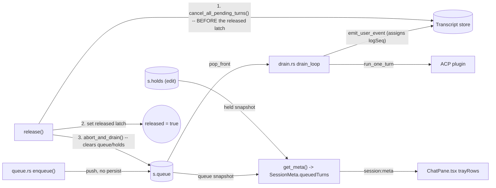
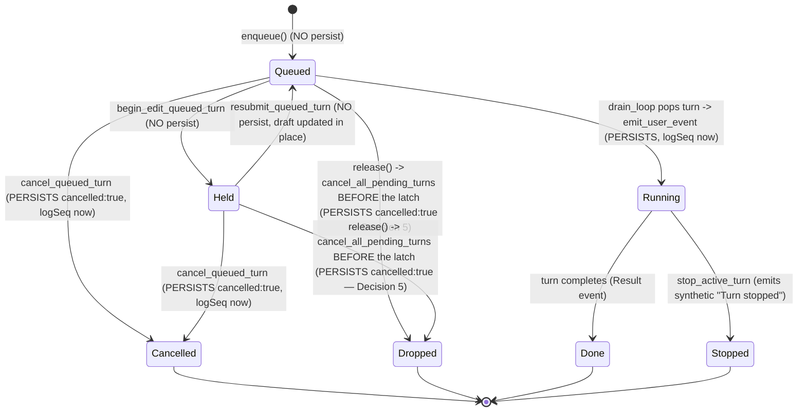
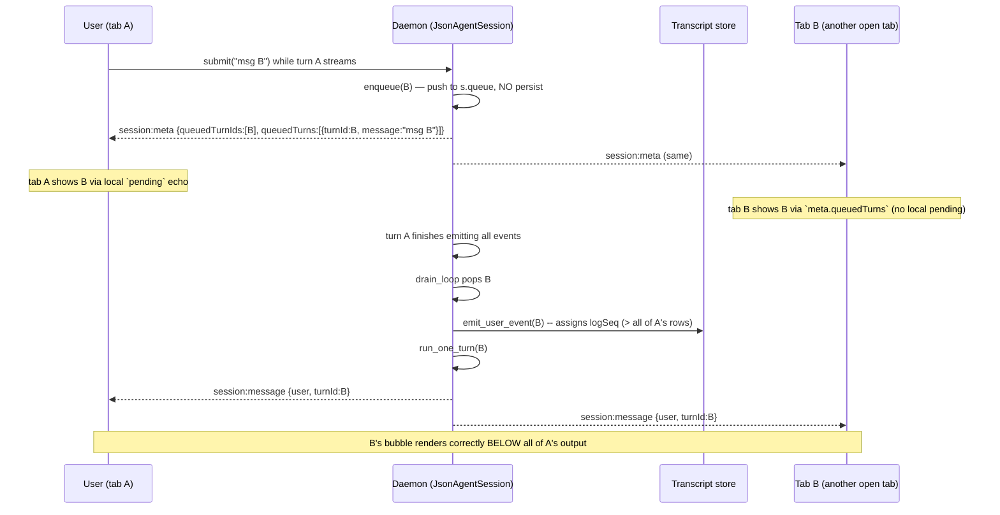
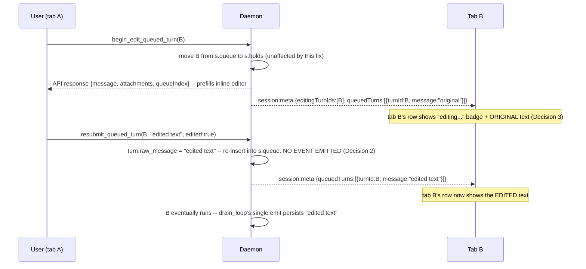
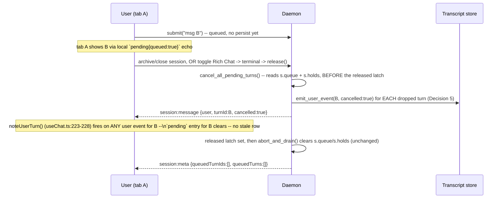

<!--
RULES — read before writing or implementing:
1. FORMAT: Bullets, tables, code, diagrams ONLY — no prose paragraphs
2. REQUIREMENTS: One crisp line each — no verbose descriptions
3. CHECKLIST: Mark items [x] as you complete them — this is your persistent todo list
4. READING TIME: Optimize for fast human scanning — if it's hard to skim, rewrite it
-->

# Plan: Fix queued-message ordering in the chat transcript

> A queued turn's `user` bubble is persisted (and logSeq-ordered) at enqueue time instead of run
> time, so it renders above the trailing output of the turn it waited behind — permanently.

**Issue:** queued-msg-ordering
**Branch:** `fix/queued-msg-ordering`
**Status:** WIP
**PRD:** none (engineering-only fix, root cause pre-investigated)
**Parent:** none (zero-parts feature, this plan IS `root`)

**Reference files:**
- Turn queue: `rust/vst-agents/src/json_agent_session/queue.rs`
- Drain loop / turn runner: `rust/vst-agents/src/json_agent_session/drain.rs`
- Event synthesis: `rust/vst-agents/src/json_agent_session/events.rs`
- Session state + live meta + release: `rust/vst-agents/src/json_agent_session/mod.rs`
- No-live-session meta assembly: `rust/vst-agents/src/json_agent_session/meta.rs`
- Wire types: `rust/vst-types/src/domain.rs`
- Channel-switch meta constructors: `rust/vst-routes/src/sessions.rs`
- Existing queue/drain integration tests: `rust/vst-agents/tests/json_agent_session_queue.rs`
- Frontend meta type: `web-ui/src/api/types.ts`
- Frontend tray wiring: `web-ui/src/components/layout/ChatPane.tsx`
- Frontend optimistic-turn state: `web-ui/src/hooks/useChat.ts`

---

## Problem & Concept

- When a user sends a message while a turn is streaming, the queued turn's `user` event is
  persisted (and assigned its `logSeq` ordering key) **at enqueue time**, before the turn it's
  queued behind has finished emitting events.
- Result: the queued message's bubble renders **above** the trailing output of the turn it waited
  behind, in the live view AND after a reload (the wrong position is durable — it's the persisted
  `logSeq`).
- Success: a queued turn's `user` event is persisted only when it actually starts running, so its
  `logSeq` is always higher than everything emitted before it — ordering is correct live and durable.

## Out of Scope

- `enqueue_order` (queue-tray-only ordering counter) — untouched, still assigned at enqueue time.
- The steer path (`queue.rs:140-147`) and the notice-turns silent-event path (`drain.rs:385-394`)
  — both already emit at the correct time; not touched.
- No new persisted event type — reuses the existing `user` event / `emit_user_event`.
- `mock.ts`'s `SessionMeta` fixtures — always report empty `queuedTurnIds`, so the new field is
  never exercised there; no change needed (see Research).
- Re-deriving whether a fork should supersede a turn still in `s.holds` — Decision 6 documents the
  behavior change and adds a regression test, but the fork-supersede algorithm itself is untouched.

## Requirements

| # | Requirement |
|---|-------------|
| 1 | A queued turn's `user` transcript event is persisted only when the turn starts running (leaves the queue and enters `run_one_turn`), never at enqueue time. |
| 2 | The queued-message tray still shows each queued/held turn's text + attachments, sourced from live session state, not from the (now-deferred) transcript event. |
| 3 | Editing a queued turn (`resubmit_queued_turn`, `edited: true`) updates the stashed draft in place; no transcript event is emitted until the turn actually runs. |
| 4 | `fork_turn`, `cancel_queued_turn`, `promote_queued_turn` keep their current observable behavior (regression only) — except the two explicitly-documented, correctness-neutral changes in Decision 6 and Decision 7. |
| 5 | The fix must not change `enqueue_order`, the notice-slot path, or the steer path. |
| 6 | A turn dropped by `release()` (queue/hold cleared — session archive/dispose, OR the ordinary Rich Chat -> terminal channel toggle) is not silently lost: it is persisted as a `cancelled` event BEFORE the `released` latch goes up, and no client is left with a stale "pending" tray row for it. |

---

## Change Map

```
rust/vst-agents/src/json_agent_session/
  queue.rs   ~ drop early persist, fix resubmit, new cancel_all_pending_turns
  drain.rs   ~ persist user event at pop-time
  mod.rs     ~ get_meta() populates queued_turns; release() persists before latch
  meta.rs    ~ populate queued_turns (empty) in no-live-session path
rust/vst-types/src/
  domain.rs  + QueuedTurnMeta, SessionMeta.queued_turns
rust/vst-routes/src/
  sessions.rs   ~ two SessionMeta literals gain queued_turns: vec![]
web-ui/src/api/
  types.ts   ~ add queuedTurns to SessionMeta
web-ui/src/components/layout/
  ChatPane.tsx   ~ tray reads text from meta.queuedTurns first
```

| Today | After this plan |
|-------|-----------------|
| Queued turn's `user` event persists (gets its `logSeq`) at enqueue time | Persists only when the turn starts running — `logSeq` always trails prior output |
| Tray text for a queued/held turn comes from the transcript's `user` event | Tray text comes from `SessionMeta.queuedTurns` (live queue/hold state), transcript as fallback |
| Editing a queued turn emits a superseding `user` event | Editing a queued turn only updates the in-memory draft; nothing persists until run |
| A cancelled queued turn's bubble sits at its original enqueue position (a 2nd, superseding event updates its text in place) | A cancelled queued turn's bubble is the ONLY event for that turn, and sits at the CANCEL-TIME position — see Decision 7 |
| `release()` silently drops queued/held turns (`abort_and_drain` clears them, emits nothing) — includes the ordinary Rich Chat -> terminal channel toggle, not just archive | `release()` persists a `cancelled` event for each dropped turn BEFORE the `released` latch goes up, and the sender's stale "pending" tray row clears via the existing `noteUserTurn` mechanism — see Decision 5 |

---

## Research

- `queue.rs:66-72` — `enqueue()` calls `emit_user_event` (→ `persist_event`, which assigns
  `logSeq`) synchronously, before the turn is ever queued or run. **This is the bug.**
- `drain.rs:57-72` — the human queue is drained by one loop: `s.queue.pop_front()` then
  `self.run_one_turn(turn).await` (line 66-71). Grep-verified: `drain.rs:68` is the **only**
  `pop_front` call in `vst-agents/src` — every human-authored `QueuedTurn` (normal, promoted,
  resubmitted) enters execution here.
- `drain.rs:149-321` — `run_one_turn` is shared by **two** callers: the human-queue loop above,
  and `run_notice_slot_turn` (`drain.rs:403-417`), which builds its own synthetic `QueuedTurn` and
  calls `run_one_turn` directly, after already calling `emit_user_event` with `silent: true`
  (`drain.rs:386-394`).
- **Consequence for placement:** emitting the new user event *inside* `run_one_turn` itself would
  double-emit for notice turns. The fix emits at the human-queue's pop site in `drain_loop`
  (`drain.rs:66-71`) instead.
- `queue.rs:295-334` — `resubmit_queued_turn`: already updates `turn.raw_message`/`attachments` in
  place when `edited: true` (line 309-310) *before* re-inserting into `s.queue`; the only thing to
  remove is the trailing `emit_user_event` call (lines 319-329).
- `queue.rs:224-257` — `cancel_queued_turn` emits its `cancelled: true` event **at cancel time**
  (now), not at enqueue time. Post-fix it becomes the ONLY persisted event for that turn instead of
  superseding an earlier one — this moves its rendered position from enqueue-time to cancel-time
  (Decision 7); the grouping logic that would otherwise keep a superseding event at its first-seen
  position is `MessageList.tsx:123-124,169-181`.
- `queue.rs:339-368` — `fork_turn` calls `enqueue()` for the new forked turn, inheriting the fix
  automatically. `first_seq_of_turn` (`transcript.rs:407-416`) only resolves once a turn has
  actually run and persisted a real row — unaffected.
- `mod.rs:627-663` — `release()` calls `abort_and_drain()` (`mod.rs:646`), which is the **only**
  call site of `abort_and_drain` in the codebase (grep-verified). `release()` itself is NOT a
  rare teardown-only path — grep-verified callers: `sessions.rs:3751` (the ordinary Rich Chat ->
  terminal **channel toggle**, json->tty) and `session_runtime.rs:128`
  (`release_session_runtime_with_warn`, the general session-teardown path), in addition to
  archive/dispose.
- `mod.rs:633-638` — `release()` sets `self.0.released.swap(true, ..)` (the latch) **first**,
  under the store lock, THEN (line 646) calls `abort_and_drain()`. `persist_event`
  (`mod.rs:885-889`) checks that same latch and no-ops the append if it's set. **Consequence:**
  anything `abort_and_drain` tries to persist AFTER the latch is already up is silently dropped —
  the fix must persist dropped-turn events BEFORE the latch, not inside `abort_and_drain` itself
  (Decision 5).
- `queue.rs:162-182` — `abort_and_drain` clears `s.queue` and `s.holds` and emits nothing.
  **Today**, each dropped turn's enqueue-time row already exists, so its text survives in the
  transcript, and the sender's `useChat.ts` `pending` entry for it was already cleared the moment
  that row arrived. **Post-fix**, with no early persist, a turn dropped this way would have NO
  persisted row at all (text loss) and the sender's `pending{queued:true}` entry would never clear
  (`useChat.ts:223-228`'s `noteUserTurn` only fires on a real `user` event) — a new regression this
  plan must close (Decision 5), and closing it means persisting BEFORE the latch (see the bullet
  above), not by editing `abort_and_drain`.
- `plugin.rs:292-294` — `AgentPlugin::supports_acp()` defaults to `false`. A plugin that doesn't
  override it makes `run_one_turn` take the "unsupported" branch (`drain.rs:151-167`), which
  **persists an `Error` event** for that turn — this matters for picking a test double (a plugin
  used to prove logSeq ordering must override `supports_acp() -> true`, or the "no extra events"
  assumption is false).
- `mod.rs:434-453` (`get_meta`) / `meta.rs:75-93` (`assemble_meta`) — `SessionMeta.queued_turn_ids`
  is built from `s.queue.iter().map(|t| t.turn_id.clone())` — ids only, no text.
- `domain.rs:432-463` — `SessionMeta` has no `Default` impl/derive, so every struct literal must
  name every field. Grep for `SessionMeta {` found **6** literal sites beyond `meta.rs`/`mod.rs`:
  `sessions.rs:3927-3953` and `sessions.rs:3957-3983` (production, the channel-switch route's
  error/else branches), plus 4 test literals: `json_agent_stream.rs:60`, `json_agent_stream.rs:100`
  (approx, second occurrence), `json_agent_meta.rs:173`, `json_agent_meta.rs:202`. All 6 must gain
  `queued_turns: vec![]` or the workspace fails to build.
- `web-ui/…/ChatPane.tsx:230-270` (`trayRows`) — for each id in `queuedTurnIds`/`editingTurnIds`,
  text comes from `userEvents.map.get(turnId)` (built from persisted transcript `user` events,
  `ChatPane.tsx:210-220`, shape `{text, attachments?}`), falling back to the client-local
  optimistic `pending` array (`ChatPane.tsx:236`, shape `{message, attachments}`) for queued rows
  only — held (editing) rows have no `pending` fallback (`ChatPane.tsx:252`: `info?.text ?? ""`).
  **The two existing lookup sources use different field names (`text` vs `message`)** — the new
  `meta.queuedTurns` lookup must be normalized to the `{text, attachments?}` shape before being
  merged into the same `??` chain, or the code doesn't type-check under `strict` (Decision 4).
- `hooks/useChat.ts:9-17,223-228` — `pending` (`PendingTurn[]`) is the SENDER tab's own optimistic
  echo, cleared whenever **any** `user` event (cancelled or not) for that `turnId` arrives
  (`noteUserTurn` has no `cancelled` check) — this is what makes Decision 5's fix work with zero
  frontend changes. It is reset to `[]` on cold start and is never populated for a REMOTE tab or
  after a reload — the gap `SessionMeta.queuedTurns` fills.
- `hooks/useChat.ts:327-345` (`session:fork` handler) — drops `pending`/`editingDrafts` bookkeeping
  only for turn ids in the server's `supersededTurnIds`, which `mark_superseded_from` derives from
  **persisted** rows (`transcript.rs:386-406`). A turn sitting in `s.holds` with no persisted row
  (post-fix) can never be superseded by a fork, so it now **survives** a fork instead of being
  dropped — a behavior change from today, where its enqueue-time row put it at/after the fork point
  (Decision 6).
- `MessageList.tsx:512` — `canFork = !!onForkTurn && !!api && !!sessionId && !turnActive` — forking
  is allowed whenever no turn is actively running, i.e. even while `s.holds` is non-empty; nothing
  here changes with this fix, it's what makes Decision 6's scenario reachable.
- `mock.ts:1690-1762` — every mocked `SessionMeta` hardcodes `queuedTurnIds: []`; the new
  `queuedTurns` field is optional and never populated there — no update required.
- `sessions.rs:3901-3953` — the channel-switch route's computed `SessionMeta` is bound to `_meta`
  and never read: the route returns `PatchChannelResult { ok, channel, history_imported }`
  (`sessions.rs:4011-4015`), which carries no meta, and `sessions.rs:4002` comments that no
  `SessionMeta` broadcast exists for this route. The two literals there (Decision 8) are a pure
  compile-time obligation — there is nothing to assert on beyond `cargo build`.
- `rust/vst-agents/tests/json_agent_session_queue.rs:231-252` (`HangingTurnPlugin::run_turn`) — a
  turn only completes if its message `starts_with("complete")`; any other message hangs on
  `cancel.cancelled()` forever. A test built on this fixture MUST name its "should finish" turns
  `"complete ..."` and wrap any `settled()`/polling wait in `tokio::time::timeout`, exactly as
  `test_promote_stops_active_and_runs_promoted_to_completion` (`:479-496`) already does.
- **Root cause:** `emit_user_event`/`persist_event` for a queued turn runs at enqueue time instead
  of at the moment the turn is popped to actually run, so its `logSeq` — the sole ordering key the
  UI trusts — is minted before, not after, the events of whatever turn it was queued behind.

---

## Architecture Diagram

- Single module (`json_agent_session`) plus its `SessionMeta` wire type and one frontend
  consumer — no cross-service boundary.



### Turn lifecycle — which transitions persist a row



---

## Design Details

### System Boundaries

| Boundary | Fields + types | Errors | Source of truth |
|----------|----------------|--------|-----------------|
| Daemon `JsonAgentSession` ↔ frontend `ChatPane` | `SessionMeta.queuedTurns: Array<{turnId: string, message: string, attachments?: Attachment[]}>` over the existing `session:meta` WS event | none (best-effort snapshot, always resent on next `emit_meta()`) | daemon (`s.queue` + `s.holds`, in-memory) |

### Critical User Journeys (CUJs)

#### CUJ 1 — Message queued while a turn runs, then drains



- **Edge case — page reload while B is still queued:** `pending` is empty (cold start), but the
  initial meta snapshot's `queuedTurns` still supplies B's text — no blank row.
- **Error path — see CUJ 3** (session torn down while B is still queued).

#### CUJ 2 — Queued message edited, then drains unedited vs edited



- **Edge case — Discard instead of Save:** `discardEdit` (unchanged) drops the hold; B never ran,
  so nothing was ever persisted for it — no orphaned event (an improvement over today, where a
  discarded turn still left its stale enqueue-time event behind).
- **Edge case — resubmit unedited (`edited: false`):** `raw_message`/`attachments` are NOT mutated
  (existing gate at `queue.rs:308`, unchanged); tray still reads the unchanged text from
  `meta.queuedTurns`.

#### CUJ 3 — Session released while messages are still queued/held (error/edge path)



- **Without Decision 5 (or with the persist placed AFTER the latch):** B's text is lost entirely
  (no transcript row — `persist_event` no-ops once `released` is set), and tab A's `pending` row
  for B never clears (`noteUserTurn` never fires) — a permanent stale "queued" row until the next
  full page reload wipes `pending` on cold start.
- **User-visible consequence of Decision 5 done correctly:** toggling Rich Chat -> terminal while
  messages are queued now leaves `cancelled` bubbles in the transcript instead of the messages
  silently never running — the user sees them if they toggle back to Rich Chat. This is strictly
  better than today's silent loss, but it IS a visible change worth calling out (see Risks).

### Data Model

- No persisted schema change — `SessionMeta` is a live, in-memory, rebuilt-on-every-emit wire
  snapshot (not stored), and the transcript's `NormalizedEvent` shape is unchanged (still just a
  `user`-role event, same fields, emitted later or with `cancelled: true`).
- **Migration:** N.

| Entity | Field | Type | Constraints | Notes |
|--------|-------|------|-------------|-------|
| `SessionMeta` (Rust: `vst_types::domain::SessionMeta`) | `queued_turns` | `Vec<QueuedTurnMeta>` | new, NOT `Option` — every struct literal must set it (Decision 8) | wire: `queuedTurns` (camelCase) |
| `QueuedTurnMeta` (new) | `turn_id` | `String` | — | wire: `turnId` |
| `QueuedTurnMeta` (new) | `message` | `String` | raw (pre-injection) text | wire: `message` |
| `QueuedTurnMeta` (new) | `attachments` | `Option<Vec<Attachment>>` | `None` when empty (via `#[skip_serializing_none]`) | wire: `attachments` |

### API Contracts

- `session:meta` WS event (unchanged shape otherwise) — `SessionMeta` gains one field:

```
SessionMeta.queuedTurns: Array<{ turnId: string; message: string; attachments?: Attachment[] }>
  - Populated from BOTH the live queue (s.queue) and the edit-hold map (s.holds) — Decision 3.
  - Order does not matter: consumed as a turnId -> text lookup, never iterated for display order.
  - Empty array on every path that constructs SessionMeta without a live queue: the
    no-live-session meta.rs path, AND the two production sessions.rs literals (Decision 8).
  - Optional on the TypeScript side ONLY because mock.ts / an older daemon may omit it
    (Decision 4) -- the Rust field itself is always present on the wire.
```

### Key Decisions

#### Decision 1: Emit the deferred `user` event at the human-queue pop site in `drain_loop`, not inside `run_one_turn`

- **Decision:** add the `emit_user_event` call in `drain.rs`'s `drain_loop`, immediately after
  `s.queue.pop_front()` and immediately before `self.run_one_turn(turn).await` (drain.rs:66-71),
  not inside `run_one_turn` itself.
- **Rationale:** `run_one_turn` is also called by `run_notice_slot_turn`, which already emits its
  own (silent) user event before calling it — see Research.
- **Where:** `rust/vst-agents/src/json_agent_session/drain.rs:66-71`

```rust
// Before (drain.rs:66-71):
let turn = {
    let mut s = self.0.state.lock().unwrap();
    s.queue.pop_front()
};
let Some(turn) = turn else { break };
self.run_one_turn(turn).await;

// After — emit assigns logSeq NOW, guaranteed after everything already persisted:
let turn = {
    let mut s = self.0.state.lock().unwrap();
    s.queue.pop_front()
};
let Some(turn) = turn else { break };
self.emit_user_event(&turn.turn_id, &turn.raw_message, &turn.attachments, EmitUserEventOpts::default());
self.run_one_turn(turn).await;
```

- Also import `EmitUserEventOpts` in `drain.rs` (it's already imported in `queue.rs`).

#### Decision 2: `resubmit_queued_turn` never emits — it only mutates the stashed draft

- **Decision:** delete the `if edited { self.emit_user_event(...) }` block in
  `resubmit_queued_turn` (queue.rs:319-329) entirely. Keep the existing `turn.raw_message =
  message.clone(); turn.attachments = attachments.clone();` mutation (queue.rs:309-310).
- **Rationale:** with no early persist, there is no prior event to supersede; the edited text is
  simply the current value of `turn.raw_message`, read fresh whenever the turn runs (Decision 1)
  or the tray renders (Decision 3).
- **Where:** `rust/vst-agents/src/json_agent_session/queue.rs:295-334`
- **Note:** after this change, `EmitUserEventOpts.edited` is never set to `true` anywhere in the
  codebase (grep-verified no frontend code reads `NormalizedEvent.edited` either). Leave the field
  defined (it's still part of the public event shape / harmless dead capability) — do not remove it
  as part of this plan; removing an unused-but-documented field is out of scope here.

#### Decision 3: `SessionMeta.queued_turns` covers `s.queue` AND `s.holds`, not just `s.queue`

- **Decision:** populate the new field from both the live queue and the edit-hold map:
  `s.queue.iter().chain(s.holds.values().map(|h| &h.turn))`.
- **Rationale:** a turn moved straight into `s.holds` via `begin_edit_queued_turn` may never have
  run yet, so post-fix it has no persisted transcript event either — without this, any tab that is
  NOT the one editing sees a blank "editing…" row (CUJ 2).
- **Where:** `rust/vst-agents/src/json_agent_session/mod.rs:419-453` (`get_meta`)

```rust
// mod.rs get_meta() — queued_turns must see BOTH the queue and the edit holds:
queued_turns: s.queue.iter().chain(s.holds.values().map(|h| &h.turn)).map(|t| {
    vst_types::QueuedTurnMeta {
        turn_id: t.turn_id.clone(),
        message: t.raw_message.clone(),
        attachments: if t.attachments.is_empty() { None } else { Some(t.attachments.clone()) },
    }
}).collect(),
```

#### Decision 4: Frontend lookup — normalize `meta.queuedTurns` to `{text, attachments}` BEFORE merging with the transcript-event map

- **Decision:** in `ChatPane.tsx`, build a memoized map `queuedTurnsMeta: Map<string, {text:
  string; attachments?: Attachment[]}>` from `meta.queuedTurns`, renaming `message` → `text` at
  construction time. Then resolve each row's `info` as `queuedTurnsMeta.get(turnId) ??
  userEvents.map.get(turnId)`, and keep the existing `pending` fallback below that.
- **Rationale:** `userEvents.map` already holds `{text, attachments?}` (`ChatPane.tsx:211`) and the
  existing consumers read `info?.text` (`ChatPane.tsx:240,252`) — normalizing `meta.queuedTurns` to
  the SAME shape at the map-construction boundary (not at every call site) is the only way the `??`
  chain type-checks and behaves correctly. Do NOT merge `{message}` and `{text}` shapes directly.
- **Where:** `web-ui/src/components/layout/ChatPane.tsx:210-270`

```typescript
// New, alongside the existing `userEvents` useMemo (ChatPane.tsx:210-220):
const queuedTurnsMeta = useMemo(() => {
  const map = new Map<string, { text: string; attachments?: Attachment[] }>();
  for (const qt of meta?.queuedTurns ?? []) {
    map.set(qt.turnId, { text: qt.message, ...(qt.attachments ? { attachments: qt.attachments } : {}) });
  }
  return map;
}, [meta?.queuedTurns]);

// trayRows (ChatPane.tsx:230-270) — both the queuedTurnIds loop and the editingTurnIds loop:
// change `const info = userEvents.map.get(turnId);`
// to     `const info = queuedTurnsMeta.get(turnId) ?? userEvents.map.get(turnId);`
// Everything downstream (`info?.text`, `info?.attachments`, the `fallback`/`draft` handling)
// is UNCHANGED — only the source of `info` changes.
```

- Add `queuedTurnsMeta` to the `trayRows` `useMemo` dependency array (ChatPane.tsx:270).

#### Decision 5: A new `cancel_all_pending_turns()` persists a `cancelled` event for every queued/held turn, called FIRST in `release()` — BEFORE the `released` latch

- **Decision:** add `JsonAgentSession::cancel_all_pending_turns(&self)` to `queue.rs`. It reads
  (without draining) every turn currently in `s.queue` and `s.holds`, drops the state lock, then
  calls `emit_user_event(&t.turn_id, &t.raw_message, &t.attachments, EmitUserEventOpts {
  cancelled: true, ..Default::default() })` for each — the same event shape `cancel_queued_turn`
  (`queue.rs:224-257`) already emits for a single turn. Call it as the **very first statement** of
  `release()` (`mod.rs:627`), before the block that sets `self.0.released.swap(true, ..)`.
  `abort_and_drain()` (`queue.rs:162-182`) itself is **NOT modified** — it keeps clearing
  `s.queue`/`s.holds` with no emit, exactly as today, and still runs afterward (it now just clears
  turns whose `cancelled` event was already persisted a moment earlier).
- **Rationale:** `release()` sets the `released` latch BEFORE calling `abort_and_drain()`
  (`mod.rs:633-646`), and `persist_event` no-ops any append once that latch is set
  (`mod.rs:885-889`, Research). Emitting INSIDE `abort_and_drain` (as originally drafted) would
  therefore silently persist nothing in production — `release()` is not a rare teardown path
  either: it's also the ordinary Rich Chat -> terminal channel toggle (`sessions.rs:3751`) and the
  general session-teardown path (`session_runtime.rs:128`, Research). Persisting BEFORE the latch,
  in a dedicated function called ahead of it, is the only placement where the emit actually lands.
  Reusing `cancel_queued_turn`'s existing event shape means the frontend needs no change — the same
  `noteUserTurn` mechanism that clears `pending` for a normal cancel already handles this one.
- **Where:** `rust/vst-agents/src/json_agent_session/queue.rs` (new method, placed near
  `cancel_queued_turn`, `queue.rs:222-257`) and `rust/vst-agents/src/json_agent_session/mod.rs:627`
  (`release()`'s first line).

```rust
// queue.rs — new method, same emit shape cancel_queued_turn already uses:
/// Persist a `cancelled` event for every turn currently queued or held,
/// WITHOUT touching `s.queue`/`s.holds` — `abort_and_drain` (called right
/// after this, from `release()`) does the actual clearing. Must run BEFORE
/// the `released` latch goes up, or `persist_event` silently no-ops every
/// emit here (mod.rs:885-889) and the text is lost with no error.
pub fn cancel_all_pending_turns(&self) {
    let dropped: Vec<QueuedTurn> = {
        let s = self.0.state.lock().unwrap();
        s.queue
            .iter()
            .cloned()
            .chain(s.holds.values().map(|h| h.turn.clone()))
            .collect()
    };
    for t in &dropped {
        self.emit_user_event(
            &t.turn_id,
            &t.raw_message,
            &t.attachments,
            EmitUserEventOpts { cancelled: true, ..Default::default() },
        );
    }
}
```

```rust
// mod.rs::release() — call BEFORE the latch block (mod.rs:627 onward):
pub async fn release(&self) {
    // Persist a cancelled marker for every still-queued/held turn BEFORE the
    // `released` latch goes up (Decision 5) -- persist_event no-ops once the
    // latch is set, and release() is not teardown-only: it's also the
    // ordinary Rich Chat -> terminal channel toggle (sessions.rs:3751).
    self.cancel_all_pending_turns();
    {
        let _store = self.0.store.lock().unwrap();
        if self.0.released.swap(true, Ordering::SeqCst) {
            return;
        }
    }
    // ... rest of release() UNCHANGED from here (notice_slot clear,
    // abort_and_drain(), settled() wait, connection teardown, store close).
}
```

- If `release()` is called twice (it's idempotent — the `swap` check returns early on the second
  call), the second `cancel_all_pending_turns()` call is a no-op: the first call's `abort_and_drain`
  already emptied `s.queue`/`s.holds`.
- This only changes behavior when the queue/holds are non-empty at release time — the common case
  (nothing queued) is a no-op, matching today exactly.

#### Decision 6: A turn parked in `s.holds` now SURVIVES a fork instead of being dropped — documented behavior change, not a regression

- **Decision:** no code change — accept and document that a fork's `mark_superseded_from` can only
  supersede turns with a persisted row, so a still-being-edited (never-run) held turn is no longer
  swept up by a fork the way its enqueue-time row would have caused today.
- **Rationale:** this is a strictly narrower "what gets superseded" set, driven entirely by
  Decision 1-3 (no persisted row until run) — recreating the old behavior would require inventing a
  new "supersede an unrun hold" mechanism, which is out of scope for an ordering-logSeq bug fix.
  Flagged as a Risk (see below) with its own regression test so it's a tracked, intentional change,
  not a silent one.
- **Where:** `hooks/useChat.ts:327-345` (no change), `queue.rs:339-368` (no change) — behavior-only,
  verified by 1.T8.

#### Decision 7: A cancelled queued/held turn's bubble now renders at CANCEL time, not enqueue time — documented behavior change

- **Decision:** no code change — accept that `cancel_queued_turn`'s event becomes the ONLY
  (first-and-only) row for that turnId, so `MessageList.tsx`'s "keep the bubble at its first
  position, update text" grouping (`MessageList.tsx:123-124,169-181`) now places it at the
  cancel-time `logSeq` instead of the enqueue-time one.
- **Rationale:** there is no longer an enqueue-time row to anchor the old position to; the new
  position (where the user actually clicked cancel) is arguably more intuitive, and no UI logic
  depends on a cancelled bubble occupying its enqueue-time slot.
- **Where:** `web-ui/src/components/chat/MessageList.tsx:123-124,169-181` (no change) — behavior
  only, verified by 1.T6.

#### Decision 8: Every `SessionMeta` struct literal in the workspace must set `queued_turns` — no `Default` impl to fall back on

- **Decision:** `queued_turns: Vec<QueuedTurnMeta>` is a required (non-`Option`) field. Every one
  of the 6 non-`meta.rs`/`mod.rs` literal sites found in Research gets `queued_turns: vec![]` (they
  have no live queue to report from).
- **Rationale:** `SessionMeta` has no `Default` derive (Research), so this is a compile-time
  requirement, not a style choice — skipping any site fails `cargo build --workspace`.
- **Where:** `rust/vst-routes/src/sessions.rs:3927-3953,3957-3983` (production),
  `rust/vst-agents/tests/json_agent_stream.rs` (2 literals), `rust/vst-agents/tests/json_agent_meta.rs`
  (2 literals).

---

## Risks / Open Questions

| # | Question | Notes |
|---|----------|-------|
| 1 | **Does removing the early persist break anything that scanned the transcript for a not-yet-run turn's text (e.g. a notification, a search index)?** | No other call site was found reading a queued turn's text from the transcript — `QueuedTray`/`ChatPane` (fixed here) and `editingDrafts` (already API-response-sourced) are the only consumers; `abort_and_drain`'s drop path is now also covered (Decision 5). |
| 2 | **Race: `emit_user_event` at the pop site (Decision 1) runs synchronously right before `run_one_turn` — could the plugin's own first event ever get a lower/equal logSeq?** | No — `persist_event`/`append` assigns `log_seq` under the single store mutex (`transcript.rs:337-343`) in call order; the emit call happens-before `run_one_turn` is even invoked. |
| 3 | **Fork-while-held now diverges from today (Decision 6) — is this acceptable?** | Yes, treated as an intentional, narrower correctness improvement, not silently — has its own regression test (1.T8) and Change Map/Requirement 4 call it out explicitly. |
| 4 | **Cancelled bubble now renders at cancel-time position instead of enqueue-time (Decision 7) — any UI code assumes the old position?** | No — checked `MessageList.tsx`'s grouping logic; it only keeps FIRST-SEEN position, and post-fix the cancel event IS the first (and only) occurrence, so this is self-consistent, just a different logSeq. |
| 5 | **`queuedTurns` optional on the TS side but always-present on the Rust wire — could this drift?** | Intentional (Decision 4): optional exists only so `mock.ts` fixtures that predate this field don't need updating; a real daemon always sends it. Don't "fix" it into a required TS field. |
| 6 | **Decision 5 makes cancelled bubbles appear on an ordinary Rich Chat -> terminal channel toggle, not just on archive — is that user-visible change acceptable?** | Yes — strictly better than today's silent text loss on that same toggle; flagged explicitly in CUJ 3 so it's a tracked, intentional change. |

---

## Implementation Phases

- Each phase ends with a **verification block** — the phase is not complete until those tests pass,
  run with the exact commands listed.
- Test items use `N.Tn` numbering to distinguish them from implementation items.
- **Test doubles to use** (do not write new ones — reuse these):
  - `rust/vst-agents/src/json_agent_session/mod.rs:1048-1095` — `NoopPlugin` (`session()` helper at
    `:1097-1164`, drops its `TempDir`/home-guard at return — `mod.rs:1098-1099`). `supports_acp()`
    is NOT overridden (defaults to `false`, `plugin.rs:292-294`), so a turn run against it takes
    the error branch and persists an `Error` event (`drain.rs:151-167`) — this is still fine for a
    turn that COMPLETES via the error branch and gets a pop-time `user` row either way (so
    `first_seq_of_turn` still resolves), but tests using `NoopPlugin` must know this and never
    claim "no extra events are emitted" (1.T1, 1.T5-1.T7 only need the "nothing persisted BEFORE
    the drain task runs" property, which holds regardless of which branch the turn eventually
    takes). Any test that needs to prove logSeq ordering ACROSS two turns must use one of the two
    fixtures below instead — `NoopPlugin`'s error-branch event still has a real logSeq, so it
    cannot serve as a "no events" baseline.
  - `rust/vst-agents/tests/json_agent_session_queue.rs:62-118` — `MockTurnPlugin`
    (`supports_acp() -> true`, emits a `Result` event after a 50ms delay, unconditionally — no
    message-prefix requirement). Used by the existing
    `test_stop_active_turn_then_enqueue_runs_turn_and_sets_log_seq` (`:120-192`). Prefer this over
    `HangingTurnPlugin` whenever a turn just needs to run to completion without being stopped.
  - `rust/vst-agents/tests/json_agent_session_queue.rs:195-296` — `HangingTurnPlugin` +
    `make_hanging_session()` helper. **Only** a message whose text `starts_with("complete")`
    finishes (after a 30ms delay, `:231-252`); any other message hangs on `cancel.cancelled()`
    forever. A test using this fixture MUST name its "should finish" turns `"complete ..."` and
    wrap any `settled()`/polling wait in `tokio::time::timeout` — see
    `test_promote_stops_active_and_runs_promoted_to_completion` (`:461-507`) for the exact pattern
    (poll on `active_turn_id`, `timeout(..., settled())`).
  - Prefer the **integration test file** (`rust/vst-agents/tests/json_agent_session_queue.rs`) for
    any new test that needs `settled()` across a real (delayed) turn — its fixtures keep the
    `TempDir`/home-guard alive for the test's duration, unlike `mod.rs::session()`. Specifically:
    1.T2, 1.T3, 1.T4, 1.T8, 1.T9, and 1.T10 all belong in this integration file, NOT in `mod.rs`'s
    `mod tests` block — 1.T8 and 1.T10 need `MockTurnPlugin` (only reachable from the integration
    file) to drive a turn to actual completion, and `mod.rs::session()`'s dropped `TempDir` makes a
    disk-backed transcript read after the fact fragile. Only 1.T1, 1.T5, 1.T6, 1.T7 stay in
    `mod.rs`'s `mod tests` (they only need `NoopPlugin` and never read from disk after drop).
  - **No-`.await`-before-the-action caveat:** `enqueue()` calls `kick_drain()`, which
    `tokio::spawn`s the drain task — a turn only provably stays in `s.queue` until the test's FIRST
    `.await`. 1.T1 already states this; 1.T9's "both sit in `s.queue`" setup and 1.T10's
    "enqueue, then immediately `begin_edit_queued_turn`" setup rely on the exact same property —
    do the enqueue(s)/hold synchronously, with no `.await` in between, before asserting queue/hold
    contents.
- **Exact verify commands** (run from the repo root unless noted):
  - Rust build (catches every missing-field compile error from Decision 8): `cd rust && cargo build --workspace`
  - Rust unit tests (Phase 1's `mod.rs` additions): `cd rust && cargo test -p vst-agents --lib`
  - Rust integration tests (Phase 1's new `json_agent_session_queue.rs` tests): `cd rust && cargo test -p vst-agents --test json_agent_session_queue`
  - Rust wire-type tests (Phase 2): `cd rust && cargo test -p vst-agents --test json_agent_meta && cargo test -p vst-agents --test json_agent_stream`
  - Rust routes build/tests (Decision 8's production literals): `cd rust && cargo test -p vst-routes`
  - Frontend type-check (Phase 3): `cd web-ui && npx tsc --noEmit`
  - Frontend targeted test (Phase 3): `cd web-ui && npx vitest run src/components/layout/ChatPane.test.tsx`
  - Frontend full suite (Phase 3 regression sweep): `cd web-ui && npx vitest run`

---

### Phase 1 — Defer user-event persistence to run time (Rust backend)

- [x] **1.1** `queue.rs::enqueue` (queue.rs:47-103): remove the `self.emit_user_event(...)` call
      (lines 66-72) that fires before the turn is pushed to `s.queue`. Keep everything else
      unchanged. Update the doc comment at `queue.rs:42-43` ("Synthesizes the daemon-owned `user`
      event immediately (Decision 12)") — it now runs at pop time, not enqueue time; point it at
      `drain_loop`.
- [x] **1.2** `drain.rs::drain_loop` (drain.rs:57-72): add the emit call between `pop_front` and
      `run_one_turn`, exactly as shown in Decision 1's snippet. Add `use super::events::EmitUserEventOpts;`
      to `drain.rs`'s imports.
- [x] **1.3** `queue.rs::resubmit_queued_turn` (queue.rs:295-334): delete the
      `if edited { self.emit_user_event(...) }` block (lines 319-329) per Decision 2. Keep the
      `turn.raw_message = message.clone(); turn.attachments = attachments.clone();` mutation
      (lines 309-310) and the rest of the function unchanged. Update the doc comment at
      `queue.rs:311` ("Emit the superseding user event outside the lock (below)") — delete it, it
      no longer applies.
- [x] **1.4** Add `queue.rs::cancel_all_pending_turns` (new method, near `cancel_queued_turn` at
      queue.rs:222-257) per Decision 5's first snippet, and call it as the FIRST statement of
      `mod.rs::release()` (mod.rs:627), BEFORE the `self.0.released.swap(true, ..)` latch block —
      per Decision 5's second snippet. Do NOT modify `abort_and_drain` (queue.rs:162-182) — it
      stays exactly as it is today (clears `s.queue`/`s.holds`, emits nothing) and keeps running
      immediately after the latch, as it already does.
- [x] **1.5** `queue.rs::cancel_queued_turn` (queue.rs:222-223) and `MessageList.tsx` (comment near
      `MessageList.tsx:123`): update the doc comments that describe a cancelled/edited event as
      "superseding" an earlier one — post-fix it's the only row for that turn. (Code behavior is
      unchanged; comments only.)

**Verify phase 1:**
- [x] **1.T1** Unit (`rust/vst-agents/src/json_agent_session/mod.rs`, new `#[tokio::test]` in the
      existing `mod tests` block) — `enqueue_does_not_persist_user_event`: call
      `s.enqueue("hello", vec![], None, None)`, then IMMEDIATELY (before any `.await`) assert
      `s.read_transcript()` contains zero events with `turn_id == Some(turn_id)`. Must be
      `#[tokio::test]` (current-thread flavor) so the `tokio::spawn`'d drain task provably hasn't
      run yet.
- [x] **1.T2** Integration (`rust/vst-agents/tests/json_agent_session_queue.rs`, new test using
      `MockTurnPlugin`) — `enqueue_then_drain_persists_user_event_after_running_turn`: enqueue one
      turn, `session.settled().await`, assert the transcript now contains exactly one `user` event
      for that `turn_id` with the right text, `edited/cancelled/silent == None`, and a real
      `log_seq`.
- [x] **1.T3** Integration (`json_agent_session_queue.rs`, using `HangingTurnPlugin` +
      `make_hanging_session()`) — `queued_turn_logseq_trails_active_turns_output`: enqueue A =
      `"complete A"`, poll until `active_turn_id == A`, enqueue B = `"complete B"`,
      `stop_active_turn(None)` to let A finish with its "Turn stopped" event, wrap
      `session.settled().await` in `tokio::time::timeout(Duration::from_secs(3), ...)` (mirroring
      `:479-496`), then assert B's `user` event's `log_seq` is strictly greater than the `log_seq`
      of EVERY event with `turn_id == A` (including A's "Turn stopped" row). This is the test that
      actually fails before the fix and passes after.
- [x] **1.T3b** Add the plain drain-on-idle variant in the same file (no stop involved — the exact
      user-reported path) — `queued_turn_logseq_trails_completed_turn_result`: A = `"complete A"`
      (`MockTurnPlugin`, 50ms), poll until `active_turn_id == A`, enqueue B = `"complete B"`, wrap
      `settled()` in a timeout, then assert B's `user.log_seq` is greater than A's `Result` event's
      `log_seq` (`drain.rs:289` stamps A's `turn_id` onto that row).
- [x] **1.T4** Add a promote/force-send variant in the same file —
      `promoted_turn_logseq_trails_stopped_active_turn`: mirror
      `test_promote_stops_active_and_runs_promoted_to_completion` (`:461-507`) but additionally
      assert X's (the promoted turn's) `user` event `log_seq` is greater than A's "Turn stopped"
      event's `log_seq`.
- [x] **1.T5** Unit (`mod.rs` tests, `NoopPlugin`) — `resubmit_edited_does_not_emit`: enqueue a
      turn, `begin_edit_queued_turn`, `resubmit_queued_turn(turn_id, "edited text", vec![], true)`,
      assert `s.read_transcript()` is still empty for that `turn_id`, and (white-box, via
      `s.0.state.lock().unwrap().queue`) the requeued `QueuedTurn.raw_message == "edited text"`.
- [x] **1.T6** Regression (`mod.rs` tests, `NoopPlugin`) — `resubmit_unedited_does_not_mutate_or_emit`:
      same as 1.T5 but `edited: false` with a different `message` argument — assert the requeued
      turn's `raw_message` is UNCHANGED from the original, still nothing persisted.
- [x] **1.T7** Regression (`mod.rs` tests, `NoopPlugin`) — `cancel_queued_turn_still_persists_cancelled_event`:
      enqueue a turn, `cancel_queued_turn(turn_id)`, assert `s.read_transcript()` contains EXACTLY
      ONE event for that `turn_id` with `cancelled == Some(true)` (assert count `== 1`, not `>= 1`,
      per Decision 7 — today it would be the second of two).
- [x] **1.T8** Integration (`json_agent_session_queue.rs`, `MockTurnPlugin`) —
      `fork_turn_inherits_deferred_persistence`: drive a turn to completion (enqueue + `settled()`
      under a timeout), call `fork_turn` on it with a new message, assert the FORKED turn's `user`
      event is NOT in the transcript immediately after `fork_turn` returns, then `settled()` again
      and assert it now is.
- [x] **1.T9** Integration (`json_agent_session_queue.rs`) —
      `release_persists_cancelled_for_dropped_queue_and_holds` (Decision 5, N1 fix): using a
      `live_session`-style setup (mirror `tests/json_agent_transcript_locks.rs:49` for the
      `(session, data_dir)` pattern), enqueue turn A and turn B with nothing running (both land in
      `s.queue`, no `.await` in between), move B into `s.holds` via `begin_edit_queued_turn`, call
      `session.release().await`, then assert via `read_transcript_from_data_dir(&data_dir,
      session_id)` (`mod.rs:948` — reads from DISK since the store is closed after release) that
      the transcript now contains a `cancelled: true` event for BOTH A and B, each with the
      original text AND `log_seq.is_some()`. This must go through the REAL `release()` path (not
      call `cancel_all_pending_turns`/`abort_and_drain` directly) — calling them directly on an
      un-released session would pass even if the latch-ordering bug from N1 were still present.
- [x] **1.T10** Integration (`json_agent_session_queue.rs`, `MockTurnPlugin`) —
      `fork_while_held_turn_survives` (Decision 6): enqueue+complete a turn (`settled()` under a
      timeout), enqueue a second turn and immediately `begin_edit_queued_turn` it (held, never
      run — no `.await` in between the enqueue and the hold), call `fork_turn` on the FIRST
      (completed) turn, then assert via `session.get_meta().editing_turn_ids` that the held turn's
      id is STILL present — proving today's "fork drops everything after it" behavior no longer
      sweeps up an unrun held turn.

**Run:** `cd rust && cargo build --workspace && cargo test -p vst-agents --lib && cargo test -p vst-agents --test json_agent_session_queue`

---

### Phase 2 — Surface queued/held turn text on `SessionMeta` (Rust wire type)

^- [x] **2.1** `rust/vst-types/src/domain.rs`: add a new struct near `Attachment` (domain.rs:200-213):
      ```rust
      #[skip_serializing_none]
      #[derive(Clone, Debug, PartialEq, Serialize, Deserialize)]
      #[serde(rename_all = "camelCase")]
      pub struct QueuedTurnMeta {
          pub turn_id: String,
          pub message: String,
          pub attachments: Option<Vec<Attachment>>,
      }
      ```
^- [x] **2.2** `rust/vst-types/src/domain.rs`: add `pub queued_turns: Vec<QueuedTurnMeta>,` to
      `SessionMeta` (domain.rs:432-463), directly after `pub editing_turn_ids: Vec<String>,`.
^- [x] **2.3** `rust/vst-agents/src/json_agent_session/meta.rs::assemble_meta` (meta.rs:69-93): add
      `queued_turns: Vec::new(),` to the constructed `SessionMeta`.
^- [x] **2.4** `rust/vst-agents/src/json_agent_session/mod.rs::get_meta` (mod.rs:419-453): add the
      `queued_turns` field per Decision 3's snippet.
^- [x] **2.5** `rust/vst-routes/src/sessions.rs`: add `queued_turns: vec![],` to BOTH `SessionMeta`
      literals in the channel-switch route — the `Err(_)` branch (`sessions.rs:3927-3953`) and the
      `else` branch (`sessions.rs:3957-3983`) — per Decision 8. This is a **required compile fix**,
      not optional.
^- [x] **2.6** `rust/vst-agents/tests/json_agent_stream.rs`: add `queued_turns: vec![],` to both
      `SessionMeta` literals (`:60` and the second occurrence in
      `message_and_meta_channels_are_distinct`) per Decision 8.
^- [x] **2.7** `rust/vst-agents/tests/json_agent_meta.rs`: add `queued_turns: vec![],` to both
      `SessionMeta` literals (`session_meta_roundtrips_notice_slot_shape` at `:173` and
      `session_meta_omits_active_turn_id_when_none` at `:202`) per Decision 8.

**Verify phase 2:**
^- [x] **2.T1** Unit (`mod.rs` tests) — `get_meta_reports_queued_turns_from_queue`: enqueue two
      turns with distinct messages/attachments, assert `s.get_meta().queued_turns` has 2 entries
      with the right `turn_id`/`message` (order-independent).
^- [x] **2.T2** Unit (`mod.rs` tests) — `get_meta_reports_queued_turns_from_holds`: enqueue a turn,
      `begin_edit_queued_turn(turn_id)`, assert `s.get_meta().queued_turns` still contains an entry
      for that `turn_id` (now sourced from `s.holds`) with the original message.
^- [x] **2.T3** Regression (`rust/vst-agents/tests/json_agent_meta.rs`) —
      `assemble_meta_no_live_session_has_empty_queued_turns`: call BOTH
      `meta::build_meta_from_store_meta` and `meta::build_meta_from_transcript` with an empty/bare
      input, assert `.queued_turns == vec![]` on each (catches a forgotten field on either
      no-live-session entry point, not just one).
- Note: no test targets the two `sessions.rs` literals from 2.5 directly — their computed
  `SessionMeta` is bound to `_meta` and never read (route returns `PatchChannelResult`, no meta;
  see Research), so `queued_turns: vec![]` there is a pure compile-time obligation. `cargo build
  --workspace` (first step below) is the entire verification for 2.5.

**Run:** `cd rust && cargo build --workspace && cargo test -p vst-agents --test json_agent_meta && cargo test -p vst-agents --test json_agent_stream && cargo test -p vst-routes`

---

### Phase 3 — Frontend tray reads from `SessionMeta.queuedTurns`

- [x] **3.1** `web-ui/src/api/types.ts` (near `SessionMeta`, types.ts:425-450): add
      ```typescript
      /** Live text/attachments for each queued or held (editing) turn — the daemon's
       *  source of truth while the turn hasn't run yet (its transcript event doesn't
       *  exist until it does). Optional only because mock.ts / an older daemon may
       *  omit it — a real daemon always sends it. */
      queuedTurns?: Array<{ turnId: string; message: string; attachments?: Attachment[] }>;
      ```
      as a field on `SessionMeta`, directly after `editingTurnIds`.
- [x] **3.2** `web-ui/src/components/layout/ChatPane.tsx` (near `userEvents`, ChatPane.tsx:210-220):
      add the `queuedTurnsMeta` memoized lookup map exactly as shown in Decision 4's snippet
      (normalizing `message` → `text` at construction time).
- [x] **3.3** `web-ui/src/components/layout/ChatPane.tsx::trayRows` (ChatPane.tsx:230-270): change
      both the `queuedTurnIds` loop (line 233-245) and the `editingTurnIds` loop (line 246-258) to
      resolve `info` as `queuedTurnsMeta.get(turnId) ?? userEvents.map.get(turnId)` per Decision 4,
      keeping every existing `fallback`/`draft` handling exactly as-is. Add `queuedTurnsMeta` to the
      `useMemo` dependency array (line 270).

**Verify phase 3:**
- [x] **3.T1** Regression — `ChatPane.test.tsx` "relocates a queued turn to the tray..."
      (ChatPane.test.tsx:91-110): still passes unchanged (no `meta.queuedTurns` set in this test —
      falls through to the existing `userEvents.map` path).
- [x] **3.T2** Regression — `ChatPane.test.tsx` "V3g-b: userEvents index skips silent events..."
      (ChatPane.test.tsx:382-409): still passes unchanged (same reasoning).
- [x] **3.T3** New — `ChatPane.test.tsx`: a queued turn present ONLY in `meta.queuedTurns` (no
      transcript `user` event pushed, no matching `pending` entry) renders its text in the tray —
      proves the new source alone is sufficient (the reload/cross-tab case).
- [x] **3.T4** New — `ChatPane.test.tsx`: a turn in `editingTurnIds` with a `meta.queuedTurns` entry
      but no local `draft` (a DIFFERENT tab than the one editing) renders that turn's text (not
      blank) with the "editing…" badge — proves Decision 3's `s.holds` coverage.
- [x] **3.T5** Regression — full frontend suite passes: `cd web-ui && npx vitest run` — catches any
      other test asserting on `SessionMeta`'s exact field set.
- [x] **3.T6** Regression — `cd web-ui && npx tsc --noEmit` passes (catches a `{message}`/`{text}`
      shape mismatch if Decision 4's normalization step were ever skipped).

**Run:** `cd web-ui && npx tsc --noEmit && npx vitest run src/components/layout/ChatPane.test.tsx && npx vitest run`

---

## Files & Phase Impact

| File | Status | Phase | Description / Contract Change |
|------|--------|-------|-------------------------------|
| `rust/vst-agents/src/json_agent_session/queue.rs` | **Modified** | 1.1, 1.3, 1.4, 1.5 | Remove early persist in `enqueue`; remove superseding emit in `resubmit_queued_turn`; new `cancel_all_pending_turns` method; stale doc comments fixed |
| `rust/vst-agents/src/json_agent_session/drain.rs` | **Modified** | 1.2 | `drain_loop` emits the human turn's `user` event at pop time, before `run_one_turn` |
| `rust/vst-agents/src/json_agent_session/mod.rs` | **Modified** | 1.4, 2.4 | `release()` calls `cancel_all_pending_turns()` before the `released` latch; `get_meta()` populates `queued_turns` from `s.queue` + `s.holds` — Contract: `QueuedTurnMeta { turn_id, message, attachments }` |
| `rust/vst-agents/src/json_agent_session/mod.rs` (tests mod) | **Modified** | 1.T1, 1.T5, 1.T6, 1.T7, 2.T1, 2.T2 | New unit tests in the existing `#[cfg(test)] mod tests` block (`NoopPlugin`-based only) |
| `rust/vst-agents/src/json_agent_session/meta.rs` | **Modified** | 2.3 | `assemble_meta` sets `queued_turns: Vec::new()` (no-live-session path) |
| `rust/vst-types/src/domain.rs` | **Modified** | 2.1, 2.2 | New `QueuedTurnMeta` struct; `SessionMeta.queued_turns: Vec<QueuedTurnMeta>` (required field) |
| `rust/vst-routes/src/sessions.rs` | **Modified** | 2.5 | Two `SessionMeta` literals gain `queued_turns: vec![]` (compile fix only — the value is never read, see Research) |
| `rust/vst-agents/tests/json_agent_stream.rs` | **Modified** | 2.6 | Two `SessionMeta` literals gain `queued_turns: vec![]` (compile fix) |
| `rust/vst-agents/tests/json_agent_meta.rs` | **Modified** | 2.7, 2.T3 | Two existing `SessionMeta` literals gain `queued_turns: vec![]`; new no-live-session regression test |
| `rust/vst-agents/tests/json_agent_session_queue.rs` | **Modified** | 1.T2, 1.T3, 1.T3b, 1.T4, 1.T8, 1.T9, 1.T10 | New integration tests using existing `MockTurnPlugin`/`HangingTurnPlugin` fixtures |
| `web-ui/src/api/types.ts` | **Modified** | 3.1 | `SessionMeta.queuedTurns?: Array<{turnId, message, attachments?}>` |
| `web-ui/src/components/layout/ChatPane.tsx` | **Modified** | 3.2, 3.3 | `trayRows` resolves text via `queuedTurnsMeta` before `userEvents.map` |
| `web-ui/src/components/layout/ChatPane.test.tsx` | **Modified** | 3.T3, 3.T4 | New tests for `meta.queuedTurns`-sourced tray rows (queued + held) |
