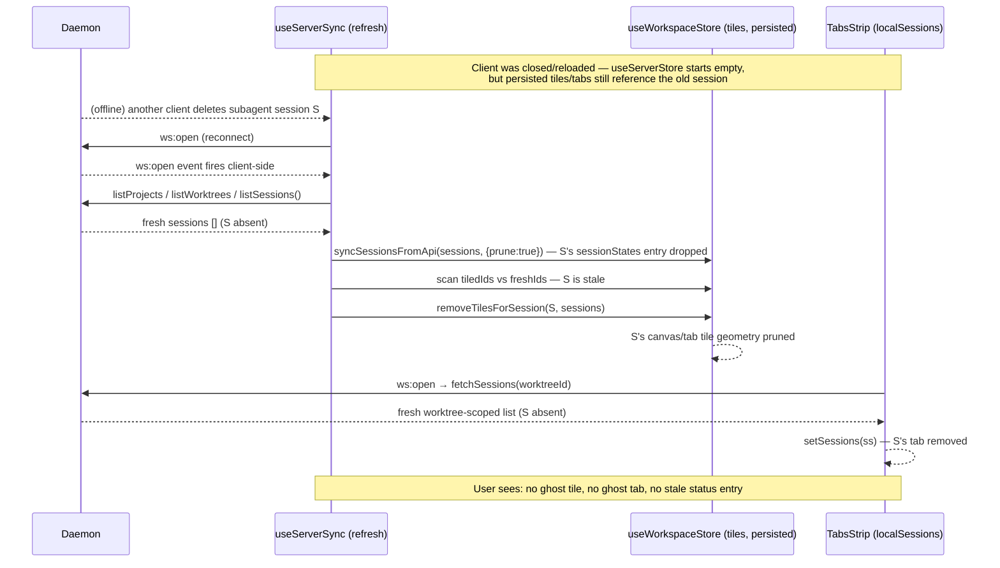

<!--
RULES — read before writing or implementing:
1. FORMAT: Bullets, tables, code, diagrams ONLY — no prose paragraphs
2. REQUIREMENTS: One crisp line each — no verbose descriptions
3. CHECKLIST: Mark items [x] as you complete them — this is your persistent todo list
4. READING TIME: Optimize for fast human scanning — if it's hard to skim, rewrite it
-->

# Plan: Reconnect stale state — prune ghost tiles, tabs, and sessionStates

> Reconnect already refetches projects/worktrees/sessions correctly (`useServerStore` is truth), but three pieces of *derived* client state never get reconciled against that fresh fetch, so sessions deleted while offline survive as inert, tappable ghosts.

**Issue:** reconnect-stale-state
**Branch:** `fix/reconnect-stale-state`
**Status:** Pending
**PRD:** none — small, already-scoped bugfix (see investigation report below)

**Reference files:**
- Report: `.vibekit/reports/2026-09-21-reconnect-ghost-sessions.md`
- Core logic: `web-ui/src/hooks/useServerSync.ts`, `web-ui/src/hooks/useStore.ts`
- UI / entrypoint: `web-ui/src/components/layout/TabsStrip.tsx`

---

## Problem & Concept

- A session deleted (or a `ws:open` reconnect that misses its `session:deleted` broadcast) while the client is offline leaves three pieces of client state stale: canvas/tab tile geometry, `TabsStrip`'s own fetched `localSessions` copy, and the `sessionStates` live-status map — all three are only pruned by the *live* `session:deleted`/incremental-event handlers, never by the reconnect refetch itself.
- Tapping a resulting ghost tile/tab sets `activeSessionId` to an id `useServerStore.sessions` no longer has, so `AgentPaneSlot` renders neither `ChatPane` nor `TerminalPane` — a silently inert pane (`.vibekit/reports/2026-09-21-reconnect-ghost-sessions.md:10`).
- Success: after a reconnect, any session deleted while offline disappears from canvas tiles, tab strips, and `sessionStates` — the same outcome a live `session:deleted` event already produces, just also reachable via the refetch path.

## Out of Scope

- Daemon-side WS resume-from-cursor / "you missed N events" mechanism (report's "Not checked" — daemon WS handshake wasn't read; out of scope for a client-only fix).
- Mobile-wrapper-specific reconnect lifecycle (report's "Not checked").
- Any change to the `session:deleted` live-event handlers themselves (`useServerSync.ts:271-292`) — they already work correctly; this plan only adds the equivalent reconciliation to the refetch path.

## Requirements

| # | Requirement |
|---|-------------|
| 1 | `useServerSync.ts`'s `refresh()` must remove every canvas/tab tile whose `sessionId` is not in the freshly-fetched (unscoped) session list — computed by comparing tile-referenced ids against the fresh list, not a store snapshot (Decision 1, revised after review — see `## Superseded Decisions`). |
| 2 | `TabsStrip.tsx` must re-run its worktree-scoped `listSessions` fetch on every `ws:open`, not just on `worktreeId`/`kind` change, and must discard a stale (out-of-order) fetch response (Decision 4). |
| 3 | `syncSessionsFromApi` must not leave `sessionStates` entries for session ids no longer returned by the fresh fetch — **only** when the caller passes the full, unscoped session list; the two worktree-scoped callers (`TabsStrip.tsx:405,633`) must keep today's upsert-only behavior (Decision 2, revised after review). |
| 4 | No shared reconciliation helper is introduced — each fix stays inline at its call site (see Decision 3). |

---

## Change Map

```
web-ui/src/hooks/
  useStore.ts        ~ syncSessionsFromApi gets an opt-in prune mode
  useServerSync.ts   ~ refresh() prunes stale tiles + sessionStates
web-ui/src/components/layout/
  TabsStrip.tsx      ~ re-fetch localSessions on ws:open
```

| Today | After this plan |
|-------|-----------------|
| `syncSessionsFromApi` only upserts fresh ids; a ghost id's `sessionStates` entry lives forever | An opt-in `prune: true` mode rebuilds wholesale — used only by `refresh()`'s unscoped call; `TabsStrip`'s scoped calls keep upsert-only |
| `refresh()` calls `replaceAll`/`syncSessionsFromApi` but never touches canvas/tab tile geometry | `refresh()` compares every tile's `sessionId` against the fresh (unscoped) list and prunes tiles for ids not in it — survives page reload and in-flight `session:created` races |
| `TabsStrip.tsx`'s `localSessions` only refetches on `worktreeId`/`kind` change — a reconnect gap leaves deleted sessions' tabs in place, tappable and inert | `TabsStrip.tsx` also refetches on `ws:open`, using the same `arrivedDuringFetch` union it already uses for `session:created` races, guarded by a request token so an out-of-order response can't win |

---

## Research

- `useServerSync.ts:91-118` — `refresh()` fetches `[projects, worktrees, sessions]`, calls `replaceAll(...)` then `syncSessionsFromApi(sessions)`; nothing here touches `layoutByWorktree`/`workspaceDocs` tiles.
- `useServerSync.ts:271-292` — the *live* `session:deleted` handler is the only caller of `removeTilesForSession` today; it captures the deleted session's `worktreeId` from the store *before* calling `applySessionDeleted`, then filters the post-deletion `useServerStore.getState().sessions` by that `worktreeId` to build `remainingSessions` for the fallback-session lookup inside `removeTilesForSession`.
- `useStore.ts:1043-1050` — `syncSessionsFromApi` spreads the existing `sessionStates` map and only overwrites entries for ids present in the fresh `sessions` argument; ids absent from that argument (deleted sessions) keep their stale entry forever.
- `useStore.ts:1195-1226` — `removeTilesForSession(sessionId, remainingSessions?)` prunes `layoutByWorktree[*].scratchCanvas` and every `workspaceDocs[*]` tile referencing `sessionId`, and re-derives `activeSessionId`/`activeTerminalSessionId` off `remainingSessions` if either pointed at the deleted session.
- `useStore.ts:511-528` — `resolveSupersededChains(sessions)` reads the same fresh `sessions` array `refresh()` already fetches; a superseded (reset) session id is still *present* in that array (with `supersededBy` set), so it can never appear in the "vanished" id set the new diff computes — no ordering conflict between the new pruning loop and the existing supersede-relink loop.
- `web-ui/src/api/client.ts:581` / `web-ui/src/api/repositories/sessionRepository.ts:16` — `sessionRepo.listSessions()` called with no `worktreeId` argument (as `refresh()` does at `useServerSync.ts:99`) returns the full, all-worktree session list — so a wholesale rebuild of `sessionStates` from that list in `syncSessionsFromApi` cannot accidentally drop a still-live session's entry.
- `TabsStrip.tsx:376-556` — the single `useEffect` (deps `[api, worktreeId, kind, isAgent, isProject, setActiveSession]`) both runs the initial `listSessions(worktreeId)` fetch (as an anonymous async IIFE, lines 386-420) and registers the `session:created`/`session:deleted`/`session:updated`/`session:state`/`session:exited`/`session:resumed` listeners (lines 422-546) — no `ws:open` listener exists anywhere in the file (report, evidence table row 5).
- `TabsStrip.tsx:371-374` — `arrivedDuringFetch` ref already solves "fetch in flight, live event arrives" races for `session:created`; the same union pattern (lines 395-401) is reusable for a `ws:open`-triggered refetch without new machinery.
- **Root cause:** the reconnect refetch path (`useServerSync.ts` `refresh()`) is a `replaceAll` against `useServerStore`, but three *other* pieces of client state (`layoutByWorktree`/`workspaceDocs` tiles, `TabsStrip.localSessions`, `sessionStates`) were each wired to reconcile only off live incremental WS events, never off the refetch itself — the exact "component with its own fetched session copy needs its own WS reconciliation" pattern AGENTS.md already documents (Session status in a pane section), now recurring for add/remove staleness instead of `.state` staleness.

### Added after opus review (see `## Superseded Decisions`)

- `TabsStrip.tsx:405` (`store.syncSessionsFromApi(all)`, inside the worktree-scoped `fetchSessions`) and `TabsStrip.tsx:633` (`useWorkspaceStore.getState().syncSessionsFromApi(all)`, inside `refreshTabs()`) both call `syncSessionsFromApi` with `all = await api.listSessions(worktreeId)` — a **single-worktree** list, not the full cross-worktree one. A wholesale-rebuild `syncSessionsFromApi` (the original Decision 2) would wipe `sessionStates` for every OTHER worktree on every tab-strip mount/reconnect.
- `web-ui/src/hooks/useServerStore.ts:13` — `useServerStore`'s `create<ServerData>(...)` has no `persist(...)` wrapper (unlike `useWorkspaceStore`, `useStore.ts:646`) — it starts empty on every page load and is only populated by the first `refresh()`. `layoutByWorktree`/`workspaceDocs` (persisted) can therefore contain tiles for sessions that predate this page load entirely — a "previous session snapshot from the store" (original Decision 1) is empty on the very first `refresh()` after a reload, so it prunes nothing on a reload-then-stale-tile case, which is exactly the scenario in the bug report (mobile client reconnects after being closed/backgrounded, not just a live tab regaining a WS).
- `rust/vst-routes/src/sessions.rs:339-382` — the `GET /sessions` handler confirms: no `worktree_id` query param → returns every session across every worktree in the project; `worktree_id` present → filtered to that worktree only. Matches the client-side `api.listSessions(worktreeId?)` contract cited above.
- `useServerSync.ts:185-228` (`offSessCreated`, the `session:created` handler) inserts a tile immediately when `ev.parentSessionId` names a currently-tiled source (`findScratchCanvasesTilingSession`/`findWorkspacesTilingSession`) — this can fire *while* `refresh()`'s `Promise.all` is still in flight, so a tile can exist for a session id the in-flight fetch's response predates. A staleness check that only asks "is this tile's id in the fresh response" would prune that just-created tile out from under the user (opus review, Blocking #2/#4) — the fix needs the same "record ids announced while a fetch is in flight, union them back in" pattern `TabsStrip.tsx`'s own `arrivedDuringFetch` (lines 371-401) already uses for the identical race, one file over.

---

## Architecture Diagram

- Single-module-class change per phase (each phase touches one file's existing reconciliation path) — no new module boundary crossed. No diagram.

---

## Design Details

### System Boundaries

- No boundary changes — all three fixes are client-only reconciliation of state already fetched via existing REST/WS contracts (`api.listSessions`, `ws:open`). Existing contracts, unchanged.

### Critical User Journeys (CUJs)

#### CUJ 1 — Session deleted while offline (client closed/reloaded, not just backgrounded), tile + tab + status all clear on reconnect



- **Error path:** the fresh `listSessions()`/`listProjects()`/`listWorktrees()` fetch itself fails (network blip). `refresh()`'s existing `try/finally` (`useServerSync.ts:94-118`) only clears `inFlightRefresh`; it never reaches `replaceAll`/the new pruning logic when the `Promise.all` rejects, so a failed fetch prunes nothing (no partial/incorrect state). The next `ws:open` retries the whole refetch. `TabsStrip.tsx`'s `fetchSessions` has the same shape — an `await api.listSessions(worktreeId)` rejection propagates out of the `async function` before any `setSessions`/token-check runs. No new error handling needed in either file.
- **Edge case:** the deleted session was `activeSessionId` in that worktree — `removeTilesForSession`'s existing fallback-to-main-agent logic (`useStore.ts:1217-1226`, unchanged by this plan) re-derives it from the `remainingSessions` argument; see Decision 1's note and Risk #3 for the one known scoping gap this plan does not fix.

### Data Model

- No persisted schema changes — `sessionStates`, `layoutByWorktree`, and `workspaceDocs` all keep their existing shapes.

| Field | Type | Before this plan | After this plan |
|-------|------|-------------------|------------------|
| `sessionStates` (`useStore.ts:189`) | `Record<string, SessionState>` | Always upsert-only (grows monotonically until `sessionAttachState`-style manual cleanup, which doesn't exist for it) | Upsert-only by default; wholesale-rebuilt only when a caller passes `{ prune: true }` (only `useServerSync.ts`'s `refresh()` does) |
| `layoutByWorktree[*].scratchCanvas.tiles[*].sessionId`, `workspaceDocs[*].tiles[*].sessionId` (`useStore.ts:114+`) | tile field, unchanged | Pruned only by the live `session:deleted` WS handler | Also pruned by `refresh()`'s reconnect path, via the same `removeTilesForSession` |

### API Contracts

- No new endpoints or events. Existing contracts unchanged:
  - `GET /sessions` (via `sessionRepo.listSessions()` / `api.listSessions(worktreeId?)`) — unchanged request/response.
  - `ws:open` client-side event (via `api.on("ws:open", ...)`) — unchanged payload (none); this plan adds a second, third listener for an event both `useServerSync.ts` and (new) `TabsStrip.tsx` already know how to consume.

### Key Decisions

#### Decision 1: Prune by comparing **tile-referenced ids** against the fresh list, not a store snapshot

- **Decision:** do NOT diff `useServerStore`'s previous `sessions` array (see `## Design History`). Instead, inside `refresh()`, after the fresh fetch resolves: merge in any session announced via `session:created` while the fetch was in flight (full snapshot, not just the id — needed so its `sessionStates` entry survives the prune below), collect every distinct `sessionId` currently referenced by a tile (scanning `layoutByWorktree[*].scratchCanvas.tiles` across every worktree, plus every `workspaceDocs[*].tiles`), subtract the merged id set, and call `removeTilesForSession` for each id left over — scoping its `remainingSessions` fallback argument to the currently active worktree.
- **Rationale:**
  - Tile-referenced-ids-vs-fresh is correct on the very first `refresh()` after a page reload, when `useServerStore.sessions` starts empty (Research § `useServerStore.ts:13`) but persisted tiles can already reference long-gone sessions.
  - Merging in-flight-announced sessions (as full `Session` objects, not bare ids) before pruning fixes two things at once: a tile for a session created mid-fetch is not treated as stale, AND that session's `sessionStates` entry (still `"not_started"` — see Decision 2) is not wiped by the same prune pass, which would otherwise be indistinguishable from "session gone" to the `known === "not_started"` spawn-race guards at `useServerSync.ts:260`/`useSubscription.ts:73`.
  - `removeTilesForSession` already exists and already does the right thing (`useStore.ts:1195-1226`) — the only missing pieces are computing the correct "which ids are stale" set, calling it per id, and scoping its worktree-fallback argument correctly (see the scoping note below).
- **Where:** `web-ui/src/hooks/useServerSync.ts` — a new module-level guard map alongside `inFlightRefresh`, a `session:created` handler addition, and the pruning loop inside `refresh()`'s IIFE.

```ts
// Alongside `inFlightRefresh` (useServerSync.ts:26) — module-level, same
// lifetime/reset rules. Maps id -> full snapshot (not just a Set<string>)
// because the merged session object is what syncSessionsFromApi needs to
// preserve that session's live state through the prune. Mirrors
// TabsStrip.tsx's `arrivedDuringFetch` for the identical race.
let sessionsAnnouncedDuringRefresh = new Map<string, Session>();
```

```ts
// Inside refresh()'s IIFE, after the Promise.all resolves. Note the ORDER:
// merge announced sessions in BEFORE pruning sessionStates (fix for the
// "not_started" wipe) and clear the guard map in `finally`, not only on
// success (a failed fetch must not let announced ids leak into the NEXT
// refresh's merge and mask a real deletion).
replaceAll({ projects, worktrees, sessions });
const mergedSessions = [...sessions];
for (const [id, snapshot] of sessionsAnnouncedDuringRefresh) {
  if (!sessions.some((s) => s.id === id)) mergedSessions.push(snapshot);
}
syncSessionsFromApi(mergedSessions, { prune: true }); // Decision 2
const freshIds = new Set(mergedSessions.map((s) => s.id));

const { layoutByWorktree, workspaceDocs, activeWorktreeId } = useWorkspaceStore.getState();
const tiledIds = new Set<string>();
for (const layout of Object.values(layoutByWorktree)) {
  for (const tile of layout.scratchCanvas?.tiles ?? []) {
    if (tile.sessionId) tiledIds.add(tile.sessionId);
  }
}
for (const doc of Object.values(workspaceDocs)) {
  for (const tile of doc.tiles) {
    if (tile.sessionId) tiledIds.add(tile.sessionId);
  }
}
// Scope the fallback lookup to the ACTIVE worktree — activeSessionId (the
// only thing remainingSessions is consulted for) always belongs to
// activeWorktreeId, so this is the correct scope regardless of which
// worktree's tile the stale id actually came from.
const activeWorktreeSessions = mergedSessions.filter((s) => s.worktreeId === activeWorktreeId);
for (const staleId of tiledIds) {
  if (freshIds.has(staleId)) continue; // still present, not a ghost
  useWorkspaceStore.getState().removeTilesForSession(staleId, activeWorktreeSessions);
}
for (const { oldId, finalId } of resolveSupersededChains(sessions)) {
  useWorkspaceStore.getState().relinkSessionTiles(oldId, finalId);
}
```

```ts
// In the SECOND useEffect's session:created handler (useServerSync.ts:185-228),
// add one line right after `snapshot` is constructed, before the existing
// applySessionCreated/tile-insertion logic (both stay unchanged):
if (ev.snapshot) {
  const snapshot = {
    ...ev.snapshot,
    parentSessionId: ev.snapshot.parentSessionId ?? ev.parentSessionId ?? null,
  };
  if (inFlightRefresh) sessionsAnnouncedDuringRefresh.set(snapshot.id, snapshot);
  applySessionCreated(snapshot);
  patchSessionState(snapshot.id, snapshot.state);
}
```

```ts
// refresh()'s try/finally already exists (useServerSync.ts:94-118) — add the
// guard-map clear to the SAME finally block that already resets
// inFlightRefresh, so a failed fetch also can't leak announced ids into the
// next refresh's merge:
} finally {
  inFlightRefresh = null;
  sessionsAnnouncedDuringRefresh = new Map();
}
```

- A superseded (not deleted) session id is still present in `sessions` (Research § `resolveSupersededChains`), so it never enters the `tiledIds`-minus-`freshIds` set — no interaction with the existing relink loop below it.
- **Pre-existing race, not introduced by this plan:** `replaceAll({ projects, worktrees, sessions })` itself can still bring back (into `useServerStore`) a session deleted while the fetch was in flight, or omit one created during it — same shape of race as the tile-pruning fix addresses, just one layer up, in `useServerStore` rather than `useWorkspaceStore`. Out of scope here; flagged for awareness, not a regression.

#### Decision 2: `syncSessionsFromApi` gets an opt-in `prune` mode — never a default wholesale rebuild

- **Decision:** change the signature to `syncSessionsFromApi(sessions: Session[], opts?: { prune?: boolean }): void`. When `opts?.prune` is true, rebuild `sessionStates` wholesale from `sessions` (dropping ids not present). When falsy (the default — **all existing call sites keep today's behavior unchanged**), keep the current upsert-only spread. Only `useServerSync.ts`'s `refresh()` passes `{ prune: true }`.
- **Rationale:** `TabsStrip.tsx:405` and `:633` both call `syncSessionsFromApi(all)` with `all = await api.listSessions(worktreeId)` — a single-worktree list (Research § "Added after opus review", confirmed against `rust/vst-routes/src/sessions.rs:339-382`). A default wholesale rebuild would wipe `sessionStates` for every other worktree on every tab-strip mount, worktree switch, or `ws:open` (this plan's own Phase 3 addition makes the last one happen on every reconnect) — silently marking still-`working` sessions as if they had no known state, and per `useServerSync.ts:260` / `useSubscription.ts:73`'s `known === "not_started"` race guard, `sessionStates` gaps have observable, permanent side effects (`exited` is terminal). Making `prune` opt-in, defaulting to off, means the two scoped call sites need **zero changes** — only `refresh()`'s unscoped call opts in.
- **Where:** `web-ui/src/hooks/useStore.ts:1043-1050` (signature + body), `useStore.ts:289` (interface), `useServerSync.ts:106` (call site passes `{ prune: true }`)

#### Decision 3: No shared reconciliation helper — three inline fixes, not one abstraction — *no snippet needed*

- **Decision:** do not extract a `reconcileClientStateWithSessions(freshSessions)` helper (report's Follow-up #4); keep Decision 1, Decision 2, and the `TabsStrip.tsx` fix (Phase 3) as independent, inline changes.
- **Rationale:** the three fixes operate on structurally different data — Decision 1 compares a fresh session-id set against live tile references and drives a cross-store side effect (`useWorkspaceStore` tile pruning); Decision 2 is a pure `Record` rebuild inside a single store's own setter; Phase 3 is a React-component-local `useState` copy plus adding a `ws:open` subscription, not a diff at all. A shared helper would need three different call shapes (store getter + cross-store call / pure setter / component state setter) to converge on, which is more indirection than the ~10 lines each fix actually needs — AGENTS.md's own guidance ("What to watch for" in the Session-status section) is to give each own-fetched-copy its own reconciliation, not to force one shared function across React state and Zustand stores.
- **Where:** n/a (explicitly not adding a file)

#### Decision 4: `TabsStrip.tsx`'s `fetchSessions` needs a stale-response guard

- **Decision:** add a `useRef<number>(0)` request-token counter. Each `fetchSessions()` call increments it and captures its own local `token` at the top; after `await api.listSessions(worktreeId)` resolves, if `token !== fetchTokenRef.current` the response is stale (a newer call started after this one) — return without calling `setSessions`/`syncSessionsFromApi`/the active-session pick. The token is ALSO bumped in the effect's cleanup, so an effect re-run that takes an early-return branch (no worktree, project scope) still invalidates any fetch left in flight from the previous run.
- **Rationale:** two overlapping `fetchSessions()` calls (initial mount racing a near-simultaneous `ws:open`, or a `ws:open` racing a `worktreeId` change) have no ordering guarantee on which `await` resolves last; an older response landing after a newer one can silently resurrect a just-deleted tab, drop a just-created one (its `arrivedDuringFetch.current = []` reset at the top of the *older* call's `fetchSessions` can wipe an entry the *newer* call's in-flight race depends on), or — after a worktree switch, including a switch to no worktree at all — write worktree A's tabs into worktree B's strip (or into a scope with no worktree). Bumping the token in cleanup, not just at the top of a new `fetchSessions()` call, closes that last gap: `TabsStrip.tsx:377-382`'s early-return branches (`isProject`, `!worktreeId`) never call `fetchSessions()` again to naturally invalidate the old token.
- **Where:** `web-ui/src/components/layout/TabsStrip.tsx`, inside the same `useEffect` as Phase 3's other changes.

```ts
const fetchTokenRef = useRef(0);
// ...
async function fetchSessions(): Promise<void> {
  const token = ++fetchTokenRef.current;
  setSessionsLoaded(false);
  arrivedDuringFetch.current = [];
  const all = await api.listSessions(worktreeId);
  if (token !== fetchTokenRef.current) return; // superseded by a newer call
  const ss = [
    ...all.filter(matches),
    ...arrivedDuringFetch.current.filter((s) => matches(s) && !all.some((a) => a.id === s.id)),
  ];
  arrivedDuringFetch.current = [];
  setSessions(ss);
  setSessionsLoaded(true);
  // ...existing syncSessionsFromApi/active-session-pick logic, unchanged
}
// ...
return () => {
  fetchTokenRef.current++; // invalidate any fetch left in flight from this run
  offCreated();
  offReconnect();
  // ...existing offDeleted()/offState()/etc. calls, unchanged
};
```

---

## Design History

Two earlier drafts of Decision 1 and Decision 2 were reworked before implementation — recorded here since the current Key Decisions text above assumes this context.

| Earlier draft | Why reworked |
|----------------|-----------------|
| Decision 1 diffed a `useServerStore.getState().sessions` snapshot taken right before `replaceAll`, comparing it to the fresh list | `useServerStore` is not persisted (`useServerStore.ts:13`), so the snapshot is empty on the very first `refresh()` after a page reload — pruned nothing in exactly the reconnect-after-reload case the bug report describes. It also raced a `session:created` arriving mid-fetch: the new session was in the (post-fetch) snapshot but missing from the (pre-fetch) server response, so the diff could prune a just-created tile. Reworked into a tile-referenced-ids-vs-fresh-list comparison, which needs no "before" snapshot, plus an announced-during-fetch merge to close the race. |
| Decision 2 unconditionally rebuilt `sessionStates` wholesale on every `syncSessionsFromApi` call | `TabsStrip.tsx:405,633` call `syncSessionsFromApi` with a single-worktree list (confirmed against `rust/vst-routes/src/sessions.rs:339-382`), so an unconditional rebuild would wipe `sessionStates` for every other worktree on every tab-strip mount/reconnect. Reworked into an opt-in `{ prune: true }` parameter used only by `refresh()`'s unscoped call. |
| Decision 1's merge step first passed only bare fetched `sessions` (not the announced-during-fetch sessions) to `syncSessionsFromApi(..., { prune: true })` | A session announced mid-fetch had its tile correctly spared, but its `sessionStates` entry (still `"not_started"`) was wiped by the same prune pass anyway — reintroducing the spawn-race failure the merge was meant to prevent, just one step later. Fixed by pruning against the MERGED session list (fresh + announced), not the raw fetched list. |
| Decision 1's `removeTilesForSession` call passed the full unfiltered `sessions` array as `remainingSessions` | The main-agent fallback (`useStore.ts:1217-1226`) only engages when the pruned id was `activeSessionId` — the common case for the bug report's own scenario (user was actively viewing the session that got deleted). An unfiltered array let the fallback pick a main agent from any worktree, not necessarily the one the user was in. Fixed by scoping to `activeWorktreeId`. |
| Decision 4's `fetchTokenRef` was only bumped inside `fetchSessions()` | An effect re-run that took an early-return branch (no worktree, project scope) never called `fetchSessions()` again, so a fetch left in flight from the previous run could still land and apply stale data. Fixed by also bumping the token in the effect's cleanup. |
| The announced-during-refresh guard was only cleared on a successful `refresh()` | A failed fetch left ids in the guard set, which then incorrectly protected them from pruning on the NEXT refresh even if they were genuinely gone. Fixed by clearing the guard in the same `finally` block that already resets `inFlightRefresh`. |

---

## Risks / Open Questions

| # | Question | Notes |
|---|----------|-------|
| 1 | Could `removeTilesForSession` fire twice for the same id (once from a live `session:deleted` handler, once from `refresh()`'s new diff) if both race on reconnect? | Yes, possible if a `session:deleted` WS event and a `ws:open`-triggered `refresh()` land close together — but `removeTilesForSession` is idempotent (filters tiles that reference `sessionId`; a second call on an already-pruned canvas is a no-op filter over an already-clean array). No dedup needed. |
| 2 | Does `TabsStrip.tsx`'s new `ws:open` listener need the same `inFlightRefresh`-style module-level dedup guard as `useServerSync.ts`? | No — Decision 4's per-component request-token guard (`fetchTokenRef`) already makes overlapping calls converge on the last-started call's result; a module-level guard isn't needed for a per-worktree-scoped strip, and would need to be keyed per-`worktreeId` to avoid cross-instance interference (more complexity than the token ref). |

---

## Implementation Phases

- Each phase ends with a **verification block** — the phase is not complete until those tests pass
- Test items use `N.Tn` numbering to distinguish them from implementation items

---

### Phase 1 — `syncSessionsFromApi` gets an opt-in `prune` mode

- [x] **1.1** In `web-ui/src/hooks/useStore.ts:289`, change the interface signature to `syncSessionsFromApi: (sessions: Session[], opts?: { prune?: boolean }) => void`.
- [x] **1.2** In `web-ui/src/hooks/useStore.ts:1043-1050`, change the implementation: when `opts?.prune` is true, build `next: Record<string, SessionState> = {}` from scratch and populate only from `sessions`; when falsy, keep the existing spread-then-upsert behavior verbatim (Decision 2). Do not touch either call site in this phase — `useServerSync.ts:106` and `TabsStrip.tsx:405,633` all keep calling it with no `opts` (i.e. upsert, unchanged) until Phase 2 explicitly opts `useServerSync.ts:106` in.

**Verify phase 1:**
- [x] **1.T1** Unit — `useStore.test.ts`: `syncSessionsFromApi([sessA], { prune: true })` followed by `syncSessionsFromApi([sessB], { prune: true })` (different id) leaves `sessionStates` containing only `sessB.id`, not `sessA.id`.
- [x] **1.T2** Regression — `useStore.test.ts`: `syncSessionsFromApi([sessA])` then `syncSessionsFromApi([sessB])` **without** `{ prune: true }` leaves `sessionStates` containing BOTH `sessA.id` and `sessB.id` (today's upsert behavior, unchanged, is the default).
- [x] **1.T3** Regression — `useStore.test.ts`: `syncSessionsFromApi([sessA_v1])` then `syncSessionsFromApi([sessA_v1_with_new_state])` (no `opts`) still updates `sessionStates[sessA.id]` to the new state.
- Run: `cd web-ui && pnpm exec vitest run src/hooks/useStore.test.ts`

---

### Phase 2 — Prune ghost canvas/tab tiles on reconnect refetch

- [x] **2.1** In `web-ui/src/hooks/useServerSync.ts`, add a module-level `let sessionsAnnouncedDuringRefresh = new Map<string, Session>();` alongside `inFlightRefresh` (near `useServerSync.ts:26`). Import `Session` if not already imported (it is — `useServerSync.ts:3`).
- [x] **2.2** In the same file's second `useEffect` (the incremental-event reducers block), inside the existing `session:created` handler's `if (ev.snapshot) { ... }` body (`useServerSync.ts:187-193`), add `if (inFlightRefresh) sessionsAnnouncedDuringRefresh.set(snapshot.id, snapshot);` right after the `snapshot` object is constructed, before `applySessionCreated(snapshot)` — see Decision 1's third snippet for exact placement.
- [x] **2.3** In `refresh()`'s IIFE (`useServerSync.ts:94-116`), after `replaceAll({ projects, worktrees, sessions })`, build `mergedSessions` (fresh `sessions` plus any entries from `sessionsAnnouncedDuringRefresh` not already present by id — Decision 1's second snippet), then call `syncSessionsFromApi(mergedSessions, { prune: true })` (Decision 2) — **not** `syncSessionsFromApi(sessions, ...)`; this ordering (merge before prune) is what keeps an in-flight-announced session's `sessionStates` entry alive.
- [x] **2.4** Immediately after, add the pruning block from Decision 1's second snippet verbatim: build `freshIds` from `mergedSessions`, read `layoutByWorktree`, `workspaceDocs`, and `activeWorktreeId` off `useWorkspaceStore.getState()`, collect `tiledIds` by scanning `layoutByWorktree[*].scratchCanvas.tiles` and `workspaceDocs[*].tiles` for non-null `sessionId`s, build `activeWorktreeSessions = mergedSessions.filter(s => s.worktreeId === activeWorktreeId)`, then call `useWorkspaceStore.getState().removeTilesForSession(staleId, activeWorktreeSessions)` for every id in `tiledIds` not in `freshIds`. Place this before the existing `resolveSupersededChains` loop (which keeps using the original `sessions`, not `mergedSessions` — see Decision 1 snippet).
- [x] **2.5** In `refresh()`'s existing `finally` block (`useServerSync.ts:113-115`, currently `inFlightRefresh = null;`), add `sessionsAnnouncedDuringRefresh = new Map();` right after it — Decision 1's fourth snippet. This must run on BOTH success and failure paths, which `finally` already guarantees.
- [x] **2.6** No new imports needed beyond `Session` (already imported) — `useWorkspaceStore` is already imported at `useServerSync.ts:7-12`.

**Verify phase 2:**
- ⚠️ Test-setup trap: `createSessionRepository`/`createWorktreeRepository` capture their `api` reference at `useMemo` time (mount), and `refresh()` also runs once automatically on mount. Any `vi.spyOn(api, "listSessions")` / deferred-promise mock MUST be installed **before** `renderHook`/`render`, and tests that need to control the FIRST (mount-triggered) `refresh()` call must account for it explicitly rather than assuming the first controllable call is the one they trigger via `ws:open`.
- [x] **2.T1** Unit — `useServerSync.test.ts`: seed `useWorkspaceStore` with a canvas tile referencing session id `S` (no corresponding entry needed in `useServerStore` — this must work even when `useServerStore.sessions` starts empty, i.e. the post-reload case), mock `sessionRepo.listSessions()` to return a list without `S`, trigger `refresh()` (mount, or `api.__test.emit({ type: "ws:open" })`), assert the tile for `S` is gone from `layoutByWorktree` afterward.
- [x] **2.T2** Regression — `useServerSync.test.ts`: same setup but the mocked fresh list still contains `S` — assert its tile is untouched.
- [x] **2.T3** Regression — `useServerSync.test.ts`: a session `S` with `supersededBy: "S2"` present in the fresh list (both `S` and `S2` present) does not trigger `removeTilesForSession` for `S` — only the existing `relinkSessionTiles(S, S2)` path runs.
- [x] **2.T4** Race regression — `useServerSync.test.ts`: install a deferred-promise mock for `sessionRepo.listSessions()` BEFORE `renderHook` (see trap above), let the mount-triggered `refresh()` start, while its promise is pending fire `api.__test.emit({ type: "session:created", sessionId: "new1", snapshot: {...} })` for a session tiled via the existing parent-tiling logic, then resolve the deferred promise with a list that does NOT contain `new1` — assert `new1`'s tile survives (it's in `sessionsAnnouncedDuringRefresh`, merged in before both the prune and the tile-staleness check).
- [x] **2.T5** Other-worktree regression — `useServerSync.test.ts`: after Phase 2's `{ prune: true }` call, a session belonging to a DIFFERENT worktree that's still present in the (unscoped) fresh list keeps its `sessionStates` entry — confirms `refresh()`'s call site is safe with `prune: true` because it always fetches the full cross-worktree list (Research § `client.ts:581`), unlike `TabsStrip.tsx`'s scoped calls which never opt in.
- [x] **2.T6** `sessionStates` survives the announced-session race — `useServerSync.test.ts`: same setup as 2.T4, additionally assert `useWorkspaceStore.getState().sessionStates["new1"] === "not_started"` still holds after `refresh()` finishes (this is the specific bug Decision 1's merge-before-prune ordering fixes — a naive `syncSessionsFromApi(sessions, { prune: true })` using the un-merged fetch response would wipe it).
- [x] **2.T7** Failed-refresh guard-clear — `useServerSync.test.ts`: mock `sessionRepo.listSessions()` to reject once, trigger `refresh()`, assert it rejects/settles without pruning anything; then fire `session:created` for a session `X` (not inside any refresh), then trigger a SECOND `refresh()` (mocked to resolve, list not containing `X`) — assert `X`'s tile IS pruned this time (i.e. `sessionsAnnouncedDuringRefresh` was cleared after the first, failed, `refresh()` and `X`'s announcement — which landed outside any in-flight refresh — was never added to it in the first place).
- [x] **2.T8** Active-worktree fallback scoping — `useServerSync.test.ts`: set `activeWorktreeId` to worktree `W`, set `activeSessionId` to a tiled session `S` that is IN `W` and goes stale (absent from the fresh list), and seed `mergedSessions`/the fresh list with a main-agent session `M-other` belonging to a DIFFERENT worktree plus a main-agent session `M-W` belonging to `W` — after `refresh()` prunes `S`'s tile, assert `activeSessionId` falls back to `M-W`, never `M-other` (confirms `activeWorktreeSessions` scoping prevents the cross-worktree fallback pick the unscoped `sessions` array would have allowed).
- Run: `cd web-ui && pnpm exec vitest run src/hooks/useServerSync.test.ts` ✅

> **Implementation note (Phase 2, for the Phase 3 implementer):** Phase 2's refetch pruning
> broke seven pre-existing tests in `useServerSync.test.ts` that seeded canvas tiles
> referencing session ids (`sess-source` in the Phase 4c describe, `sess-x` in the
> worktree:deleted test) that were NOT registered in the mock API's `listSessions()` result.
> On mount, `refresh()` now correctly treats those as ghosts and prunes them, so the tests
> could no longer rely on the source tile surviving. I fixed the fixtures by registering the
> referenced session in the fetched list (a `mockSourcePresent(api)` helper in the 4c
> describe, and an inline `sess-x` registration in the worktree:deleted test), installed via
> `vi.spyOn(api, "listSessions")` BEFORE `renderHook` — mirroring production, where a tiled
> source session IS part of the REST list. This is a test-fixture correction, not a change to
> the Phase 2 implementation or the plan's spec. Also note: 2.T7's failing `refresh()`
> produces an unhandled rejection from `useServerSync`'s `void refresh()` (pre-existing —
> the hook never attaches a catch), so that test registers a `process.on("unhandledRejection")`
> swallow handler around its body.

---

### Phase 3 — `TabsStrip.tsx` re-fetches `localSessions` on `ws:open`, with a stale-response guard

- [x] **3.1** In `web-ui/src/components/layout/TabsStrip.tsx`, add `const fetchTokenRef = useRef(0);` near the existing `arrivedDuringFetch` ref declaration (`TabsStrip.tsx:371-374`).
- [x] **3.2** In `web-ui/src/components/layout/TabsStrip.tsx:376-421`, extract the anonymous async IIFE (currently `void (async () => { ... })()`) into a named `async function fetchSessions(): Promise<void> { ... }` declared inside the same `useEffect` body, keeping its existing logic verbatim (the `arrivedDuringFetch` union at lines 395-401, the `syncSessionsFromApi`/active-session-pick logic at lines 404-419 — this call keeps passing no `opts`, i.e. stays upsert-only per Phase 1). The `setSessionsLoaded(false)` and `arrivedDuringFetch.current = []` reset lines currently sit OUTSIDE the IIFE, just before it (`TabsStrip.tsx:383`, `:385`) — move both INSIDE `fetchSessions`, at its top, so every call (not just the first) resets them. Add `const token = ++fetchTokenRef.current;` as the very first line of `fetchSessions`, before those two resets. Immediately after `const all = await api.listSessions(worktreeId);` resolves, add `if (token !== fetchTokenRef.current) return;` (Decision 4) before any of `setSessions`/`setSessionsLoaded`/`syncSessionsFromApi`/active-session-pick runs.
- [x] **3.3** Call `void fetchSessions();` once at the point the old IIFE used to run (replacing the extracted block).
- [x] **3.4** Register a new listener in the same effect: `const offReconnect = api.on("ws:open", () => { void fetchSessions(); });` — placed alongside the existing `offCreated`/`offDeleted`/etc. listener registrations (lines 422+). Wrap the call in `try/catch` — `void fetchSessions().catch(() => {})` — so a `ws:open`-triggered fetch failure doesn't surface as an unhandled promise rejection (the existing mount-time call has the same exposure today; this is a cheap opportunistic hardening, not a required behavior change).
- [x] **3.5** In the effect's cleanup function (`TabsStrip.tsx:548-555`), add `fetchTokenRef.current++;` as the FIRST line (before `offCreated()`/`offReconnect()`/etc.) — Decision 4's fix for the early-return-branch gap — then add `offReconnect();` alongside the existing `offCreated()`/`offDeleted()`/etc. calls.
- [x] **3.6** Do not add `api` to the effect's dependency array beyond what's already there (`[api, worktreeId, kind, isAgent, isProject, setActiveSession]`, `TabsStrip.tsx:556`) — `api` is already a listed dep.

**Verify phase 3:**
- [x] **3.T1** Integration — `TabsStrip.test.tsx`: render `TabsStrip` for a worktree with 2 agent sessions, let the initial fetch settle, remove one session from the mock API's `listSessions` response, fire `api.__test.emit({ type: "ws:open" })`, assert the removed session's tab disappears from the rendered strip without any prop/dep change.
- [x] **3.T2** Regression — `TabsStrip.test.tsx`: existing `session:created`-during-fetch race test (`TabsStrip.test.tsx:1167`) still passes — the extraction into `fetchSessions` must not change its behavior when called from the initial mount path.
- [x] **3.T3** Stale-response regression — `TabsStrip.test.tsx`: mock `api.listSessions` to return two different deferred promises on consecutive calls; call `fetchSessions` via mount, then fire `ws:open` before the first call's promise resolves, resolve the SECOND (newer) call's promise first, then resolve the FIRST (older, now-stale) call's promise — assert the rendered tabs reflect the second call's result, not the first's (the token guard discards the stale response).
- [x] **3.T4** Worktree-switch regression — `TabsStrip.test.tsx`: mount for worktree A, before its fetch resolves switch `worktreeId` to B (component re-renders with a new `worktreeId` prop, triggering a new `fetchSessions` per the effect's deps) — assert worktree A's stale response, once it resolves, does not overwrite B's tabs.
- [x] **3.T5** Early-return-branch regression (fixes the cleanup-token-bump gap) — `TabsStrip.test.tsx`: mount with a valid `worktreeId`, before its `fetchSessions()` promise resolves re-render with `worktreeId: undefined` (or `isProject: true`) — both take the early-return branch at `TabsStrip.tsx:377-382` and never call `fetchSessions()` again — then resolve the original deferred promise; assert its (now-stale) result is discarded (does not call `setSessions`/populate `localSessions`), confirming the cleanup's `fetchTokenRef.current++` invalidated it even though no new `fetchSessions()` call did.
- Run: `cd web-ui && pnpm exec vitest run src/components/layout/TabsStrip.test.tsx` ✅

---

## Post-implementation checks (all phases)

- [ ] `cd web-ui && pnpm typecheck`
- [ ] `pnpm lint` (repo root — lints `web-ui/src` and `web-ui/e2e`)
- [ ] `cd web-ui && pnpm test` (full suite, catches any cross-file regression the per-phase runs above didn't scope to)

---

## Files & Phase Impact

| File | Status | Phase | Description / Contract Change |
|------|--------|-------|-------------------------------|
| `web-ui/src/hooks/useStore.ts` | **Modified** | 1.1, 1.2 | `syncSessionsFromApi(sessions: Session[], opts?: { prune?: boolean }): void` — opt-in wholesale rebuild, upsert stays default · Owns: `sessionStates` map |
| `web-ui/src/hooks/useStore.test.ts` | **Modified** | 1.T1, 1.T2, 1.T3 | New/updated unit tests for prune-opt-in vs. default-upsert behavior |
| `web-ui/src/hooks/useServerSync.ts` | **Modified** | 2.1, 2.2, 2.3, 2.4, 2.5, 2.6 | `refresh()` merges in-flight-announced sessions, opts into `{ prune: true }`, compares tile-referenced ids against the merged fresh list, calls `removeTilesForSession` per stale id scoped to the active worktree, clears the announced-guard map in `finally` |
| `web-ui/src/hooks/useServerSync.test.ts` | **Modified** | 2.T1–2.T8 | New tests: tile pruning on refetch (incl. post-reload/empty-store case), no false-positive, no double-handling of superseded ids, in-flight `session:created` race survives (tile AND `sessionStates`), other-worktree `sessionStates` unaffected, failed-refresh guard-clear, active-worktree fallback scoping |
| `web-ui/src/components/layout/TabsStrip.tsx` | **Modified** | 3.1–3.6 | Extracts fetch IIFE into `fetchSessions()`, adds `ws:open` listener re-invoking it, adds a request-token guard (bumped on every call AND on effect cleanup) against stale responses · Owns: `localSessions` React state |
| `web-ui/src/components/layout/TabsStrip.test.tsx` | **Modified** | 3.T1–3.T5 | New integration tests for `ws:open` re-fetch, existing race-tolerance regression, stale-response discard, worktree-switch overlap, early-return-branch cleanup guard |
