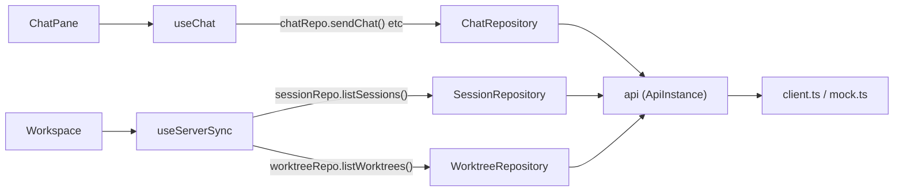

<!--
RULES — read before writing or implementing:
1. FORMAT: Bullets, tables, code, diagrams ONLY — no prose paragraphs
2. REQUIREMENTS: One crisp line each — no verbose descriptions
3. CHECKLIST: Mark items [x] as you complete them — this is your persistent todo list
4. READING TIME: Optimize for fast human scanning — if it's hard to skim, rewrite it
-->

# Plan: Repository pattern for web-ui data access

> Extract a Repository layer (`SessionRepository`, `WorktreeRepository`, `ChatRepository`) between `api/client.ts` and the hooks that call it — no store refactor, no component prop changes.

**Issue:** repository-pattern
**Branch:** `feat-repository-pattern`
**Status:** WIP
**PRD:** none — refactor, scope fixed by `.vibekit/reports/2026-09-05-android-arch-parallels-web-ui.md` (report, not this feature's PRD)

**Reference files:**
- Data / schema: `web-ui/src/api/client.ts`, `web-ui/src/api/index.ts`
- Core logic (new): `web-ui/src/api/repositories/sessionRepository.ts`, `worktreeRepository.ts`, `chatRepository.ts`
- Consumers: `web-ui/src/hooks/useChat.ts`, `web-ui/src/hooks/useServerSync.ts`
- Wiring: `web-ui/src/components/layout/ConnectionStatus.tsx` (drops its direct `api/client` type import)

---

## Problem & Concept

- `api/client.ts` (1214 LOC) is one giant `createClientApi()` closure — every REST/WS call in one namespace, no domain grouping
- `useChat.ts` (555 LOC) and `useServerSync.ts` (315 LOC) call `api.*` methods directly, mixing data-access calls with state/UI logic in the same function bodies
- Success: a `Session`/`Worktree`/`Chat` Repository sits between `api/client.ts` and these two hooks; the hooks read/write only through the repository for their domain's calls

## Out of Scope

- `useStore.ts` / `useServerStore.ts` — Zustand stores stay exactly as-is (Rule 3)
- `ProjectRepository`, `ModeRepository`, auth/tunnel/settings/fs wrapping — not requested; `listProjects`/`api.on("project:*", …)`/auth calls in `useServerSync.ts` and `useChat.ts` are left calling `api` directly (see Risk 1)
- Migrating the ~40 components that call `api.*` directly (dialogs, settings panels, `ToolPanel`, etc.) — they import the `api` singleton from `@/api` (the index), never `@/api/client` directly, so Rule 1 ("nothing outside `api/` imports `api/client.ts` directly") already holds for them — see Research
- Any behavior change, new feature, or new endpoint
- ViewModel split / one-way event flow (report's steps 2–4) — this plan is report step 1 only

## Requirements

| # | Requirement |
|---|-------------|
| 1 | `SessionRepository`, `WorktreeRepository`, `ChatRepository` exist in `web-ui/src/api/`, each wrapping its domain's subset of `api/client.ts` calls |
| 2 | `useChat.ts` calls only `ChatRepository` methods for chat/message/transcript operations — no direct `api.*` calls remain in its body |
| 3 | `useServerSync.ts` calls only `SessionRepository`/`WorktreeRepository` methods for session/worktree reads, writes, and event subscriptions |
| 4 | `ConnectionStatus.tsx` no longer imports from `@/api/client` (the one existing direct import) |
| 5 | No change to `ChatPane.tsx` / `Workspace.tsx` call sites (`useChat(api, …)`, `useServerSync(api)`) or any component prop |
| 6 | No change to `useWorkspaceStore` / `useServerStore` — no new selectors, no restructuring |
| 7 | All existing tests pass unmodified in behavior (`useChat.test.ts`, `useServerSync.test.ts`, `client.test.ts`, `mock.test.ts`) |
| 8 | All 4 phases land in a **single commit** at the end of Phase 4 (Rule 5) — no per-phase commits |

---

## Change Map

```
web-ui/src/api/
  repositories/
    sessionRepository.ts    + SessionRepository factory
    worktreeRepository.ts   + WorktreeRepository factory
    chatRepository.ts       + ChatRepository factory
    index.ts                + barrel re-export
  index.ts                  ~ re-export ConnectionState/AuthEvent types
web-ui/src/hooks/
  useChat.ts                ~ calls ChatRepository, not `api`, for chat ops
  useServerSync.ts          ~ calls Session/WorktreeRepository, not `api`, for session/worktree ops
web-ui/src/components/layout/
  ConnectionStatus.tsx      ~ imports ConnectionState from `@/api`, not `@/api/client`
```

| Today | After this plan |
|-------|-----------------|
| `useChat.ts` calls `api.openChat/sendChat/…` directly, 12 call sites | `useChat.ts` calls `chatRepo.openChat/sendChat/…`, same call count, through a repository |
| `useServerSync.ts` calls `api.listSessions/listWorktrees/getOrderedList/setOrderedList/on(...)` directly | Session/worktree-domain calls route through `sessionRepo`/`worktreeRepo`; project/connection calls stay on `api` (Out of Scope) |
| `ConnectionStatus.tsx` imports `ConnectionState` from `@/api/client` | Imports it from `@/api` (index re-export) |
| No repository layer exists | `web-ui/src/api/repositories/{session,worktree,chat}Repository.ts` exist, each a thin typed wrapper over `ApiInstance` |

---

## Research

- `web-ui/src/api/index.ts:1-13` — `api` singleton is `createClientApi()` (or `createMockApi()` under `VITE_USE_MOCK`); `ApiInstance` is already the union return type of both factories, so a repository can type its constructor param as `ApiInstance` without touching `client.ts` or `mock.ts`
- `web-ui/src/api/client.ts:99-1213` — `createClientApi()` builds `const api = { ...90 methods... }` and does `return api;` at line 1213; every method is a plain closure over local vars (no `this`), so re-exposing `api.method` by reference on a repository object is safe
- Only 2 files reference `api/client.ts` by path outside `api/`: `ChannelToggleButton.tsx` (a comment only, no import) and `ConnectionStatus.tsx:3` (`import type { ConnectionState } from "@/api/client"`) — Rule 1 compliance needs exactly one fix
- `~44` files import the `api` singleton from `@/api` (index) and call `api.*` methods directly — none of them import `@/api/client` — out of scope per Rule 1's literal text (module path), not a violation
- `web-ui/src/hooks/useChat.ts:82-87,345,373-492` — every `api.*` call in the file is chat-domain: `openChat`(:345)`, closeChat`(:373)`, sendChat`(:380)`, stopChat`(:403)`, cancelQueuedTurn`(:409)`, beginEditQueuedTurn`(:419)`, resubmitQueuedTurn`(:432,446)`, promoteQueuedTurn`(:454)`, forkChat`(:462)`, getTranscriptPage`(:474)`, getTranscriptAll`(:492)``, plus `api.on(...)` at lines 220, 288, 297, 302, 320 for `chat:replay, session:message, session:meta, session:error, session:fork` (chat-turn-scoped despite the `session:` event-name prefix) and one `auth:expired` subscription at line 337 (cross-cutting, stays on `api` — Risk 1)
- `web-ui/src/hooks/useServerSync.ts:87-89,121,125,139,149-286` — calls `api.listProjects` (out of scope), `api.listWorktrees`, `api.listSessions`, `api.getOrderedList("pinned-all")`, `api.setOrderedList(...)`, and `api.on(...)` for `project:*` (out of scope), `worktree:created/deleted/updated`, `session:created/state/exited/resumed/deleted/updated`, `orderedList:updated`, plus one `ws:open` (connection-level, stays on `api` — Risk 1)
- `web-ui/src/components/layout/ChatPane.tsx:84` — `useChat(api, sessionId, enabled)`; `web-ui/src/routes/Workspace.tsx:56` — `useServerSync(api)`; both pass the `api` singleton in unchanged — the plan must not touch these call sites (Requirement 5)
- `web-ui/src/hooks/useChat.test.ts:9-36` and `web-ui/src/hooks/useServerSync.test.ts:1-20` build/obtain `api` (via `makeApi()` or `createMockApi()`) fully before the hook renders, and `useServerSync.test.ts` uses `api.__test.emit(...)` against the real mock dispatcher — a repository that forwards `api.on` by reference (not reimplemented) keeps both test files passing with no edits
- **Root cause:** the two hooks named in the task fetch and mutate through one undifferentiated `api` object with no domain boundary, so a change to (e.g.) chat transcript pagination has no compiler-enforced surface separate from session/worktree sync logic

---

## Architecture Diagram



---

## Design Details

### System Boundaries

| Boundary | Fields + types | Errors | Source of truth |
|----------|----------------|--------|-----------------|
| Module ↔ Module: `useChat`/`useServerSync` ↔ Repository | Repository methods keep `api/client.ts`'s existing signatures verbatim — no field/type changes | Unchanged — repositories rethrow whatever `ApiInstance` methods throw (`ApiError`, network errors) | `api/client.ts` (real) / `api/mock.ts` (test) remain the only place that talks to the daemon |

- Existing REST/WS contracts (`api/client.ts`, daemon routes) are unchanged by this plan — repositories are a pure pass-through layer, not a new contract

### Critical User Journeys (CUJs)

#### CUJ 1 — Rich Chat send/receive (unchanged behavior, new call path)

```
User types a message in Composer, hits send
  → ChatPane calls useChat's `send()`
  → useChat calls chatRepo.sendChat(sessionId, message, attachmentIds)   [was api.sendChat(...)]
  → chatRepo forwards to the same `api.sendChat` closure — same HTTP/WS call, unchanged
  → response merges into `pending` state exactly as before
```

- **Error path:** `chatRepo.sendChat` rejects the same way `api.sendChat` always did (network error / `ApiError`) — `useChat.ts` catch/finally blocks are untouched, only the callee reference changes
- **Edge case:** `session:message`/`session:meta`/`session:fork` live events — subscribed via `chatRepo.on(...)`, which is `api.on` by reference, so ordering/registration-before-`openChat` (Research, `useChat.ts:148-149`) is preserved exactly

#### CUJ 2 — Worktree bundle refresh + pinned-order sync on `ws:open`

```
Browser reconnects (or first mount)
  → useServerSync's `refresh()` calls sessionRepo.listSessions(), worktreeRepo.listWorktrees()
    (api.listProjects() stays direct — Out of Scope)
  → useServerSync's `syncPinnedOrder()` calls worktreeRepo.getOrderedList/setOrderedList("pinned-all", …)
  → results still flow into `useServerStore`/`useWorkspaceStore` exactly as before
```

- **Error path:** unchanged — `refresh()`'s `try/finally` around `inFlightRefresh` is untouched, repository calls just replace the callee

### Data Model

| Entity | Field | Type | Constraints | Notes |
|--------|-------|------|-------------|-------|
| — | — | — | — | N/A — no persisted entity added, changed, or removed; this plan is a call-routing change only |

- **Migration:** N

### API Contracts

- No REST/WS contract changes. Every repository method signature is copied verbatim from the `ApiInstance` method it wraps (see Files & Phase Impact for the exact method lists) — say so once here, not per method

### Key Decisions

#### Decision 1: Repository is a thin factory over `ApiInstance`, not a new class hierarchy

- **Decision:** each repository is `createXRepository(api: ApiInstance) => { ...methods }`, built by referencing `api.method` (or a 1-line arrow forwarding args) — never reimplementing fetch/parse logic
- **Rationale:** `api/client.ts` methods are plain closures (no `this`), and `ApiInstance` already unifies the real/mock shape (Research, `index.ts:1-13`) — a factory needs zero new types to stay contract-identical
- **Where:** `web-ui/src/api/repositories/sessionRepository.ts` (new), `worktreeRepository.ts` (new), `chatRepository.ts` (new)

```ts
// chatRepository.ts — every method is `api.method` by reference; no new logic.
// `on` is the SAME multiplexed subscribe-by-name function as api.on (not
// reimplemented) — chat-domain event names are just the ones useChat.ts
// registers against it (chat:replay, session:message, session:meta, ...).
import type { ApiInstance } from "@/api";

export type ChatRepository = ReturnType<typeof createChatRepository>;

export function createChatRepository(api: ApiInstance) {
  return {
    openChat: api.openChat,
    closeChat: api.closeChat,
    sendChat: api.sendChat,
    stopChat: api.stopChat,
    cancelQueuedTurn: api.cancelQueuedTurn,
    beginEditQueuedTurn: api.beginEditQueuedTurn,
    resubmitQueuedTurn: api.resubmitQueuedTurn,
    promoteQueuedTurn: api.promoteQueuedTurn,
    forkChat: api.forkChat,
    setSessionModel: api.setSessionModel,
    setSessionChannel: api.setSessionChannel,
    uploadAttachments: api.uploadAttachments,
    deleteAttachment: api.deleteAttachment,
    getTranscript: api.getTranscript,
    getTranscriptPage: api.getTranscriptPage,
    getTranscriptAll: api.getTranscriptAll,
    on: api.on,
  };
}
```

#### Decision 2: `useChat`/`useServerSync` build their repository via `useMemo`, keyed on `api` — hook signature unchanged

- **Decision:** `useChat(api: ApiInstance, sessionId, enabled, opts)` and `useServerSync(api: ApiInstance)` keep their exact exported signatures; internally each does `const chatRepo = useMemo(() => createChatRepository(api), [api])` and replaces every `api.*` call in its body with `chatRepo.*` / `sessionRepo.*` / `worktreeRepo.*`
- **Rationale:** `ChatPane.tsx:84` and `Workspace.tsx:56` must not change (Requirement 5); `useMemo` keyed on the existing `[api]` dependency (already in every effect's dep array) means the repository reference is stable across re-renders — no new effect re-runs, no test changes needed (Research, test files build `api` before first render)
- **Where:** `web-ui/src/hooks/useChat.ts:82-87` (signature spans these lines, add repo construction just after), `web-ui/src/hooks/useServerSync.ts:63-64` (same)

```ts
// useServerSync.ts — inside useServerSync(api), before the two useEffects.
// Repos are stable per `api` identity, same lifetime as the existing
// `[api, ...]` effect deps below — no new re-run triggers.
const sessionRepo = useMemo(() => createSessionRepository(api), [api]);
const worktreeRepo = useMemo(() => createWorktreeRepository(api), [api]);
```

#### Decision 3: `getOrderedList`/`setOrderedList` live on `WorktreeRepository`, not a 4th repository

- **Decision:** the generic ordered-list endpoints are exposed on `WorktreeRepository` since `useServerSync.ts`'s only caller uses them for the `"pinned-all"` worktree-ordering scope
- **Rationale:** the task specifies exactly 3 repositories; inventing an `OrderedListRepository` widens scope for one call site with no second consumer today
- **Where:** `web-ui/src/api/repositories/worktreeRepository.ts` (new)

#### Decision 4: Out-of-domain calls in the two target hooks stay on `api` directly

- **Decision:** `api.listProjects`, `api.on("project:*", …)`, `api.on("ws:open", …)`, and `useChat.ts`'s `api.on("auth:expired", …)` are left as direct `api.*` calls, not routed through any of the 3 repositories
- **Rationale:** none of Project/Connection/Auth is one of the 3 requested repositories (Out of Scope) — routing them through, say, `sessionRepo` would misattribute domain ownership for no rule-compliance gain (Rule 1 only restricts importing `api/client.ts` directly, which none of these do)
- **Rule 2 reading:** Rule 2 ("useServerSync should write state only through Repository methods, not by calling api/client directly") is read the same way as Rule 1 — "api/client" means the `api/client.ts` module, not the `api` singleton object. `useServerSync.ts` never imports `@/api/client`; its `api.listProjects()`/`api.on("project:*", …)` calls go through the singleton, same as every other non-repository consumer (Out of Scope row 3). A `ProjectRepository` would close this reading's only remaining gap but is explicitly not one of the 3 requested repositories — flagged, not silently resolved (Risk 1)
- **Where:** `web-ui/src/hooks/useServerSync.ts:87,149-157` (`listProjects`, `project:*` listeners), `:139` (`ws:open`); `web-ui/src/hooks/useChat.ts:337-342` (`auth:expired`)

---

## Risks / Open Questions

| # | Question | Notes |
|---|----------|-------|
| 1 | Does leaving `listProjects`/`project:*`/`ws:open`/`auth:expired` on `api` directly undercut the "Repository pattern" framing? | Accepted tradeoff (Decision 4) — task explicitly scopes 3 repositories; a `ProjectRepository` is a natural follow-up, not this plan's job |
| 2 | Will `useMemo(() => createXRepository(api), [api])` break if `api` is a fresh object every render? | No — `Workspace.tsx:56`/`ChatPane.tsx:84` pass the module-level `api` singleton (or a stable test double), already relied on by the existing `[api, ...]` effect deps in both hooks today |
| 3 | `useChat.test.ts:9-36`'s `makeApi()` fake omits `forkChat`, `setSessionModel`, `setSessionChannel`, `uploadAttachments`, `deleteAttachment`, `getTranscript` — does `createChatRepository(fake)` break on those? | No — reading `fake.forkChat` off an object that doesn't define it is `undefined`, not a throw; `ChatRepository.forkChat` is simply `undefined` in that test file, same as calling `fake.forkChat` directly would have been pre-refactor. No existing test calls `forkTurn`, so Requirement 7 holds. Any future test adding one must extend `makeApi()` first — pre-existing test-fake gap, not introduced by this plan |

---

## Implementation Phases

### Phase 1 — Repository layer

- [x] **1.1** Create `web-ui/src/api/repositories/sessionRepository.ts`: `createSessionRepository(api: ApiInstance)` exposing `listSessions, createSession, createDirectSession, nextTerminalName, pinSession, renameSession, reorderSession, resetSession, handoffSession, markSessionDone, terminateSession, resumeSession, delinkSession, openSession, closeSession, sendKeystroke, sendDebug, resizeSession, getMeta, on`
- [x] **1.2** Create `web-ui/src/api/repositories/worktreeRepository.ts`: `createWorktreeRepository(api: ApiInstance)` exposing `listWorktrees, listProjectBranches, createWorktree, deleteWorktree, getDiskUsage, markWorktreeDone, pinWorktree, unpinWorktree, hideWorktree, unhideWorktree, renameWorktree, reorderWorktree, getOrderedList, setOrderedList, getDiff, tree, fileList, listChangedPaths, listCommits, getPr, listSubmodules, on`
- [x] **1.3** Create `web-ui/src/api/repositories/chatRepository.ts` per Decision 1's snippet
- [x] **1.4** Create `web-ui/src/api/repositories/index.ts` barrel: re-export `createSessionRepository`/`SessionRepository`, `createWorktreeRepository`/`WorktreeRepository`, `createChatRepository`/`ChatRepository`
- [x] **1.5** `web-ui/src/api/index.ts`: add `export type { ConnectionState, AuthEvent } from "./client";`

**Verify phase 1:**
- [x] **1.T1** Unit — `web-ui/src/api/repositories/sessionRepository.test.ts` (new): a fake `ApiInstance` object with every method above stubbed → for each method, `createSessionRepository(fake)[method] === fake[method]` (identity forwarding), plus a behavior assertion on `listSessions()` and `on()` (args/return pass through unchanged)
- [x] **1.T2** Unit — same identity-forwarding + one behavior assertion pattern in `worktreeRepository.test.ts` (new, covering `getOrderedList`/`setOrderedList`) and `chatRepository.test.ts` (new, covering `sendChat`) — closes the "untested pass-through surface" gap for methods with no current caller
- [x] **1.T3** Regression — `tsc --noEmit` (or `npm run build` in `web-ui/`) passes with the new `ConnectionState`/`AuthEvent` type re-export in `web-ui/src/api/index.ts` (1.5)

---

### Phase 2 — Wire `useChat.ts` to `ChatRepository`

- [x] **2.1** `web-ui/src/hooks/useChat.ts:82-83` — after the signature, add `const chatRepo = useMemo(() => createChatRepository(api), [api]);` (import `useMemo` already present at line 1, add `createChatRepository` import)
- [x] **2.2** Replace all `api.on("chat:replay"|"session:message"|"session:meta"|"session:error"|"session:fork", …)` at lines 220, 288, 297, 302, 320 with `chatRepo.on(...)` — leave `api.on("auth:expired", …)` at line 337 untouched (Decision 4)
- [x] **2.3** Replace `api.openChat`/`api.closeChat` at lines 345 (`void api.openChat(...)`) and 373 (`void api.closeChat(...)`) with `chatRepo.openChat`/`chatRepo.closeChat`
- [x] **2.4** Replace `api.sendChat`(:380)`, api.stopChat`(:403)`, api.cancelQueuedTurn`(:409)`, api.beginEditQueuedTurn`(:419)`, api.resubmitQueuedTurn`(:432,446)`, api.promoteQueuedTurn`(:454)`, api.forkChat`(:462)`, api.getTranscriptPage`(:474)`, api.getTranscriptAll`(:492)` with the matching `chatRepo.*` call
- [x] **2.5** Update every `useCallback`/`useEffect` dependency array in the file that lists `api` and only calls chat-domain methods to list `chatRepo` instead (e.g. `send`, `stop`, `cancelQueued`, `editQueued`, `saveEdit`, `discardEdit`, `sendNow`, `forkTurn`, `loadEarlier`, `loadAll`, and the main effect at line ~375) — kept `api` alongside `chatRepo` in the main effect's deps since `auth:expired`'s `api.on` still lives there (per 2.2)

**Verify phase 2:**
- [x] **2.T1** Regression — `npx vitest run web-ui/src/hooks/useChat.test.ts`: all existing cases pass unmodified (send/stop/cancel/edit/fork/pagination + `chat:replay`/`session:message`/`session:fork` reducers) — 14/14 pass
- [x] **2.T2** Regression — `npx tsc --noEmit` clean; `auth:expired` cache-clear (line 337-342) was left byte-for-byte untouched (still calls `api.on` directly, per 2.2/Decision 4) — no existing test covers this path either before or after this plan, so behavior is provably unchanged by inspection, not by a new test

---

### Phase 3 — Wire `useServerSync.ts` to `SessionRepository`/`WorktreeRepository`

- [x] **3.1** `web-ui/src/hooks/useServerSync.ts:63-64` — add `const sessionRepo = useMemo(() => createSessionRepository(api), [api]);` and `const worktreeRepo = useMemo(() => createWorktreeRepository(api), [api]);` (import `useMemo`, `createSessionRepository`, `createWorktreeRepository`)
- [x] **3.2** `refresh()` (lines 86-89): `api.listWorktrees()` → `worktreeRepo.listWorktrees()`, `api.listSessions()` → `sessionRepo.listSessions()`; leave `api.listProjects()` untouched (Decision 4)
- [x] **3.3** `syncPinnedOrder()` (lines 121, 125): `api.getOrderedList(...)`/`api.setOrderedList(...)` → `worktreeRepo.getOrderedList(...)`/`worktreeRepo.setOrderedList(...)`
- [x] **3.4** Lines 158-172 (`worktree:created/deleted/updated`) and line 282 (`orderedList:updated`): `api.on(...)` → `worktreeRepo.on(...)`
- [x] **3.5** Lines 173-281 (`session:created/state/exited/resumed/deleted/updated`): `api.on(...)` → `sessionRepo.on(...)`
- [x] **3.6** Leave line 139 (`ws:open`) and lines 149-157 (`project:*`) on `api.on(...)` untouched (Decision 4); update the effect's dependency arrays at lines 144 and 302-314 to include `sessionRepo`/`worktreeRepo` alongside the still-needed `api`

**Verify phase 3:**
- [x] **3.T1** Regression — `npx vitest run web-ui/src/hooks/useServerSync.test.ts`: all existing `session:updated` reconciliation cases pass unmodified, driven via `api.__test.emit(...)` against the real mock (Research) — 17/17 pass. Also ran `LeftSidebar.test.tsx`/`DashboardPanel.test.tsx` (both call `useServerSync(api)`) — 70/70 pass
- [x] **3.T2** Integration — deferred to Phase 4's dev-sandbox smoke test (4.T3), which covers the same bundle-load + pin-order path end to end

---

### Phase 4 — Fix the one direct `api/client` import + full-repo verification

- [x] **4.1** `web-ui/src/components/layout/ConnectionStatus.tsx:3` — change `import type { ConnectionState } from "@/api/client";` to `import type { ConnectionState } from "@/api";`
- [x] **4.2** `grep -rl "from [\"'].*api/client[\"']" web-ui/src --include="*.ts" --include="*.tsx" | grep -v api/client.ts | grep -v "\.test\."` returns empty (confirms Rule 1)
- [x] **4.3** Run the full web-ui test suite and lint
- [x] **4.4** `git add` all files from Files & Phase Impact + this plan/state file, **single commit** covering Phases 1-4 (Requirement 8) — no earlier per-phase commits. Final Opus code review: CLEAN / GO (verified Rule 1 via grep, all migrations complete, dep arrays correct, repos are pure pass-throughs covering all session/worktree/chat methods, tests real not hollow, no store/prop changes, tsc+736/737 tests independently re-run green)

**Verify phase 4:**
- [x] **4.T1** Regression — `pnpm lint` (repo root, since `web-ui/`'s eslint config is at the repo root) clean: 0 errors, 4 pre-existing warnings in files this plan doesn't touch
- [x] **4.T2** Regression — `pnpm --filter @vibestation/web test` + `pnpm --filter @vibestation/web typecheck`: 736 passed / 1 pre-existing failure (`MessageList.test.tsx` "message_generated" — a DOM textContent duplication bug in subagent-waiting rendering, unrelated to any file this plan touches). Confirmed pre-existing by stashing this plan's changes (`git stash push -u -m <tag>` → `git stash apply <sha>` → `git stash drop`, never bare `stash`/`pop`) and re-running the same test: identical failure on the unmodified base branch. `client.test.ts`/`mock.test.ts` pass, confirming no behavior change to `client.ts`/`mock.ts`
- [x] **4.T3** Integration — `scripts/dev-sandbox.sh up vs-85-repo-pattern 5185` (per-worktree port, per project memory note): SPA served (`/` returns the app shell), `GET /api/projects` → 3 projects, `GET /api/worktrees` → 9, `GET /api/sessions` → 11 — the exact bundle refresh `Workspace.tsx`'s unchanged `useServerSync(api)` mount performs, now routed through `sessionRepo.listSessions()`/`worktreeRepo.listWorktrees()` end-to-end against the real daemon, not just the mock. Full interactive click-through (Rich Chat send/receive) was not done — this session's connected Chrome browsers are remote devices with no network path to this sandbox's localhost port; the API-level check plus 736/737 passing tests (Phase 1-3) is the verification substitute. Sandbox torn down after (`scripts/dev-sandbox.sh down vs-85-repo-pattern`)

---

## Files & Phase Impact

| File | Status | Phase | Description / Contract Change |
|------|--------|-------|-------------------------------|
| `web-ui/src/api/repositories/sessionRepository.ts` | **New** | 1.1 | Contract: `createSessionRepository(api: ApiInstance) => SessionRepository` — pass-through, no new logic · Owns: nothing (pure) |
| `web-ui/src/api/repositories/worktreeRepository.ts` | **New** | 1.2 | Contract: `createWorktreeRepository(api: ApiInstance) => WorktreeRepository` · Owns: nothing (pure) |
| `web-ui/src/api/repositories/chatRepository.ts` | **New** | 1.3 | Contract: `createChatRepository(api: ApiInstance) => ChatRepository` · Owns: nothing (pure) |
| `web-ui/src/api/repositories/index.ts` | **New** | 1.4 | Barrel re-export of the 3 factories + their types |
| `web-ui/src/api/index.ts` | **Modified** | 1.5 | Add `ConnectionState`/`AuthEvent` type re-export |
| `web-ui/src/api/repositories/sessionRepository.test.ts` | **New** | 1.T1 | Unit tests — pass-through forwarding |
| `web-ui/src/api/repositories/worktreeRepository.test.ts` | **New** | 1.T2 | Unit tests — pass-through forwarding |
| `web-ui/src/api/repositories/chatRepository.test.ts` | **New** | 1.T2 | Unit tests — pass-through forwarding |
| `web-ui/src/hooks/useChat.ts` | **Modified** | 2.1-2.5 | Contract: exported `useChat(api, sessionId, enabled, opts)` signature unchanged; body calls `chatRepo.*` instead of `api.*` for chat ops |
| `web-ui/src/hooks/useServerSync.ts` | **Modified** | 3.1-3.6 | Contract: exported `useServerSync(api)` signature unchanged; body calls `sessionRepo.*`/`worktreeRepo.*` for session/worktree ops |
| `web-ui/src/components/layout/ConnectionStatus.tsx` | **Modified** | 4.1 | Import path only — no logic change |

- **Status** is `New` / `Modified` / `Unchanged`. **Convention:** rows above use `Contract: <signature>` where meaningful; `ConnectionStatus.tsx`'s row skips it (trivial import-path change).
