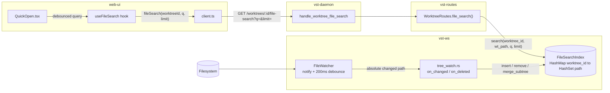
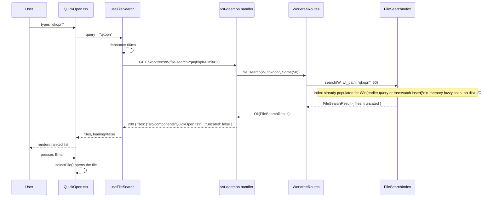
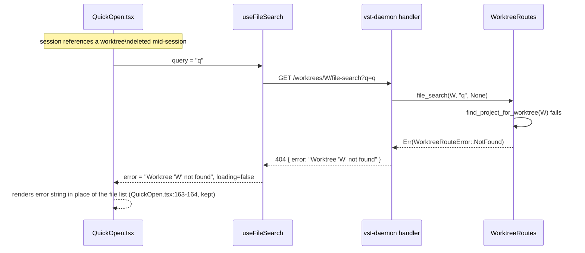

<!--
RULES — read before writing or implementing:
1. FORMAT: Bullets, tables, code, diagrams ONLY — no prose paragraphs
2. REQUIREMENTS: One crisp line each — no verbose descriptions
3. CHECKLIST: Mark items [x] as you complete them — this is your persistent todo list
4. READING TIME: Optimize for fast human scanning — if it's hard to skim, rewrite it
-->

# Plan: Server-driven Quick Open file search

> Replace Quick Open's stale client-side file cache with a server-owned, incrementally-updated
> in-memory filename index, queried per-keystroke over a new HTTP endpoint.

**Issue:** server-driven-file-search
**Branch:** `feat/server-driven-file-search`
**Status:** WIP
**PRD:** none — this chain skips the PRD step; grounded directly in the research/design doc below
**Parent:** none

**Reference files:**
- Design doc: `.vibekit/reports/2026-09-18-file-search-server-driven-design.md`
- Core logic: `rust/vst-ws/src/services/file_search.rs`
- Wiring (watcher → index): `rust/vst-ws/src/handlers/tree_watch.rs`
- Wiring (HTTP route → index): `rust/vst-routes/src/worktrees.rs`, `rust/vst-daemon/src/server.rs`
- UI entrypoint: `web-ui/src/components/dialogs/QuickOpen.tsx`

---

## Problem & Concept

- Quick Open's file list is cached client-side (`web-ui/src/hooks/useWorktreeFiles.ts`), keyed by
  worktree, and survives dialog close/reopen — its ONLY invalidation path is a `tree:changed` WS
  event, but the watch behind that event is torn down every time Quick Open closes
  (`QuickOpen.tsx:37-41` passes `null` when `!open`)
- Files created by an agent while Quick Open is closed (or focused on a different worktree) are
  invisible in Quick Open until an unrelated event forces a refetch — this is the single most
  common trigger in practice, not an edge case (multi-worktree agents write files constantly)
- Success state: the daemon owns an always-fresh, incrementally-updated per-worktree filename
  index; every Quick Open keystroke queries it live; there is nothing left to go stale client-side

## Out of Scope

- **Command palette (`>` prefix) commands** — only a static "No commands yet" placeholder ships;
  no command registry, no execution, reserved for a future feature
- **`/projects/:id/file-search`** — project-scope Quick Open (direct sessions,
  `web-ui/src/routes/Workspace.tsx:733-738`) has no standing tree-watcher to begin with
  (`useSubscription.ts:215` — "No daemon-side tree watcher for project scope"), so it never had
  this specific staleness bug from a torn-down watch; it keeps using the existing
  `/projects/:id/file-list` endpoint, now queried fresh (no cache) with client-side scoring — see
  Decision 6
- **Persisting the index to disk** — purely in-memory, rebuilt lazily per worktree on first query;
  acceptable to lose on daemon restart (see Data Model)
- **Changing the 200ms per-path debounce inside `FileWatcher`** (`file_watcher.rs:149-192`) — this
  plan only adds a new consumer of its existing callbacks, it does not touch the debounce itself
- **Reworking `tree:changed`'s payload/semantics for the sidebar file tree** — `TreeChanged`
  messages keep being sent exactly as today; this plan only adds a second, independent consumer
  (`FileSearchIndex`) of the same underlying watcher callbacks

## Requirements

| # | Requirement |
|---|-------------|
| 1 | Quick Open never shows a stale file list — a file created while the dialog is closed is found on next open with no manual refresh |
| 2 | Per-keystroke query latency stays interactive (index is an in-memory scan, no per-keystroke `rg` process) |
| 3 | Incremental index updates are O(changed-subtree), not O(repo) — no periodic full-repo rebuild |
| 4 | `:<digits>` jumps to that line in the currently-open file with no file-search query issued |
| 5 | `>` shows a static placeholder with no query issued and no command executed |
| 6 | Existing `/worktrees/:id/file-list` and `/worktrees/:id/search` endpoints are unchanged — this plan adds a new endpoint, it does not modify them |

---

## Change Map

```
rust/vst-ws/src/services/
  file_search.rs      ~ rewrite to incremental index
  file_list.rs        ~ to_posix made pub(crate)
rust/vst-ws/src/handlers/
  tree_watch.rs        ~ wire insert/remove/merge_subtree
rust/vst-ws/src/
  server.rs            ~ DispatchContext.file_search wiring
rust/vst-routes/src/
  worktrees.rs         ~ file_search field + route method
rust/vst-daemon/src/
  server.rs            ~ route registration + handler + shared Arc
rust/vst-types/src/rest/
  worktrees.rs         + FileSearchResult type
web-ui/src/api/
  client.ts            + fileSearch() method
  types.ts             + FileSearchResult type
web-ui/src/hooks/
  useFileSearch.ts     + new debounced query hook
  useWorktreeFiles.ts  ~ deleted, superseded by useFileSearch
web-ui/src/components/dialogs/
  QuickOpen.tsx        ~ rewired to useFileSearch + :line/> prefixes
```

| Today | After this plan |
|-------|-----------------|
| Quick Open reads a module-level client cache, invalidated only by a torn-down-on-close watch | Every keystroke queries a server-owned, incrementally-updated in-memory index |
| `tree:changed` events are discarded except to mark the client cache stale | The same watcher callbacks also drive O(1) index `insert`/`remove` (or scoped `merge_subtree`) |
| `rust/vst-ws/src/services/file_search.rs` exists in this worktree as uncommitted WIP implementing a superseded debounced-full-rebuild design; does not compile (`vst-daemon`'s `DispatchContext` literal is missing the `file_search` field it declares) | Rewritten to the incremental design below; compiles; used end-to-end |
| No `:<digits>` or `>` prefix handling in Quick Open | `:42` jumps to line 42 in the active file; `>` shows a placeholder; neither issues a search query |
| Quick Open's `filtered` `useMemo` does client-side 3-tier scoring | Server returns pre-scored, pre-limited results; no client-side scoring for worktree scope |

- Every `~`/`+` entry above has a matching row in Files & Phase Impact below

---

## Research

- `useWorktreeFiles.ts:25,63,94-97,140-157` — module-level cache, keyed `scope:worktreeId`,
  survives close/reopen; only invalidated by a 500ms-debounced `tree:changed` handler
- `QuickOpen.tsx:37-41` — `useWorktreeFiles(api, open ? worktreeId : null, scope)`; the underlying
  `tree:watch` (`useSubscription.ts:207-227`) is torn down whenever `open` is `false`
- `file_watcher.rs:240-255` — `FileWatcher::spawn`'s event loop: a newly-materialized directory
  gets re-`watch_tree_pruned`-registered for FUTURE changes, but `schedule_debounced` (line 255)
  fires once for the directory's own path only — files already inside it at creation time get no
  individual event and must be walked explicitly by the consumer (this is the mitigation for
  future changes, not a fix for the initial contents — the actual directory-materialized gap)
- `file_watcher.rs:45-48` — `WatcherCallbacks::on_changed`/`on_deleted` are
  `Arc<dyn Fn(String) + Send + Sync>`, already receive the specific **absolute** changed path, and
  are already invoked after a 200ms per-path debounce internal to `FileWatcher` itself
  (`schedule_debounced`, `file_watcher.rs:149-192`) — no additional debounce layer is needed for
  single-file `insert`/`remove` calls
- `tree_watch.rs:57,71` (current) — `on_changed`/`on_deleted` closures bind the callback's `String`
  argument as `_`, discarding it; only the coarse watched-root `tree_path` is forwarded to the
  browser via `TreeChanged`
- `file_list.rs:77-86,248-254` — `FileList::list_files(wt_path)` does the actual walk (`rg --files`
  preferred, `ignore`-crate walkdir fallback) and returns worktree-relative POSIX paths via a
  private `to_posix` helper; both backends already skip `.git`, include dotfiles, cap at
  `MAX_ENTRIES`
- **Stray WIP already in this worktree** (uncommitted, `git status`): `rust/Cargo.toml` and
  `rust/vst-ws/Cargo.toml` already add `nucleo-matcher` (workspace dep, `= "0.3"`) — keep it, it's
  correct; `rust/vst-ws/src/services/file_search.rs` (untracked) implements a **superseded**
  design (`schedule_rebuild` + full `FileList::list_files` re-walk on a 400ms debounce, no
  `insert`/`remove`/`merge_subtree`) that contradicts the incremental design this doc's source
  design doc settled on (its own commit history: `docs: revise design to incremental index
  updates, not full rebuilds`); `rust/vst-ws/src/server.rs` and
  `rust/vst-ws/src/handlers/tree_watch.rs` already declare/thread a `file_search: Arc<FileSearchIndex>`
  field and parameter but never call any of its methods — confirmed via `cargo build -p vst-ws`:
  fails with `error: unused variable: file_search` at `tree_watch.rs:27`; `vst-daemon/src/server.rs:311-321`'s
  `DispatchContext { ... }` literal does not include `file_search` at all, a second, independent
  compile failure once the first is fixed
- `worktrees.rs:361-394` — `WorktreeRoutes` already owns `file_list: Arc<FileList>`, constructed
  inside `WorktreeRoutes::new()`; `file_list()`/`search()` route methods (`worktrees.rs:1241-1340`)
  both resolve the project via `find_project_for_worktree` (`worktrees.rs:2072-2085`) then the
  worktree path via `self.paths.worktree_path(...)`
- `server.rs:1447-1489` (vst-daemon) — `handle_worktree_file_list`/`handle_worktree_search` both
  follow `State(state) → state.worktree_routes.<method>(...).await.map(Json).map_err(worktree_err_to_response)`;
  route registration sits at `server.rs:403-405`
- `server.rs:1672-1707` (vst-daemon) — `worktree_err_to_response` maps `WorktreeRouteError`
  variants to status codes; `ServiceUnavailable` → 503 is used today only for a missing `rg`
  binary in `search()` (`worktrees.rs:1311-1317`) — `FileList::list_files` has no such failure
  mode (it falls back to a walkdir-based walker automatically), so the new endpoint has no
  ripgrep-unavailable error case
- `client.ts:827-850` — `fileList`/`search` client methods: `fileBase(scope, worktreeId)` builds
  `/worktrees/:id` or `/projects/:id`, `AbortSignal` passed through, `parseJson<T>` throws
  `ApiError` on non-2xx
- `SearchPanel.tsx:75-134` — the existing per-keystroke debounced, abort-on-supersede pattern:
  cancel the in-flight `AbortController` on every new call, guard state updates with
  `abortControllerRef.current !== controller`, treat `ApiError` status `503` specially, ignore
  `AbortError`
- `useStore.ts:905-925` and `FilePreviewPane.tsx:343-367` — `setActiveFilePathAtLine(worktreeId,
  path, line)` sets `pendingFileLine`; `FilePreviewPane` scrolls to the matching
  `.workspace-code-line` gutter element and calls `clearPendingFileLine()` once found — already
  used by `SearchPanel.tsx:165`, needs no new capability
- `rust/vst-types/src/rest/worktrees.rs:266-300` — `FileListResult`/`SearchResult` pattern:
  `#[serde(rename_all = "camelCase")]`, plain field list, no nested `Result`/`Option` at the top
  level
- **Root cause:** the client-side cache in `useWorktreeFiles.ts` is invalidated only by an event
  whose emitting watch is torn down on dialog close — nothing else refreshes it, and even a live
  watch cannot retroactively report files that existed before it started

---

## Architecture Diagram



- `WorktreeRoutes` (HTTP, vst-routes) and `DispatchContext` (WS, vst-ws) share the SAME
  `Arc<FileSearchIndex>` instance — see Decision 4; two separate instances would mean WS-driven
  updates never reach HTTP-driven queries

---

## Design Details

### System Boundaries

| Boundary | Fields + types | Errors | Source of truth |
|----------|----------------|--------|-----------------|
| web-ui ↔ vst-daemon (HTTP) | `GET /worktrees/:id/file-search?q=<string>&limit=<uint>` → `{ files: string[], truncated: boolean }` | `404 { error: string }` (worktree not found) | daemon — see API Contracts |
| `tree_watch.rs` ↔ `FileSearchIndex` (in-process, vst-ws) | `insert(worktree_id: &str, rel_path: &str)`, `remove(worktree_id: &str, rel_path: &str)`, `merge_subtree(worktree_id: &str, prefix: &str, files: Vec<String>)` | none (best-effort, fire-and-forget from a `tokio::spawn`) | `FileSearchIndex`'s own `RwLock<HashMap<...>>` |
| `WorktreeRoutes` ↔ `FileSearchIndex` (in-process, vst-routes ↔ vst-ws) | `search(worktree_id: &str, wt_path: &Path, query: &str, limit: usize) -> FileSearchResult` | none — always returns a (possibly empty) result | same as above |
| `FileSearchIndex` ↔ `FileList` (in-process, vst-ws) | `list_files(wt_path: PathBuf) -> FileListResult` — existing, unchanged | none surfaced (internal fallback to walkdir) | filesystem, via `FileList` |

### Critical User Journeys (CUJs)

#### CUJ 1 — Happy path: typing to find a file



- **Edge case — first query ever for W:** `FileSearchIndex.search` finds no entry for `worktree_id`,
  synchronously calls `FileList::list_files` once (lazy populate) before scoring — same request,
  slightly higher latency, no separate round trip
- **Edge case — empty query:** `q=""` returns the first `limit` index entries in `HashSet`
  iteration order — see Decision 3 for why this doesn't need to be sorted/stable beyond `limit`
  truncation
- **Edge case — no matches:** `200 { files: [], truncated: false }`, not an error; QuickOpen already
  renders "No files found" for an empty `filtered` list (`QuickOpen.tsx:161-168`, kept)

#### CUJ 2 — Alternate path: jump to line in the open file

```
User opens Quick Open, types ":42"
  → Input matches /^:\d+$/ → QuickOpen does NOT call useFileSearch at all
  → On Enter: reads activeFilePath for worktree W from useWorkspaceStore
  → Calls setActiveFilePathAtLine(W, activeFilePath, 42)
  → FilePreviewPane scrolls to the gutter line "42", clears pendingFileLine
  → Quick Open closes (same as selectFile's onClose)
```

- **Edge case — no active file:** show an inline "No file open" placeholder instead of an empty
  list; do not call `setActiveFilePathAtLine`

#### CUJ 3 — Error path: worktree not found



### Data Model

_No persisted entity — this is an in-memory index, documented here as its lightweight equivalent._

| Entity | Field | Type | Constraints | Notes |
|--------|-------|------|-------------|-------|
| `FileSearchIndex` | `index` | `RwLock<HashMap<String, HashSet<String>>>` | key = worktree id, value = worktree-relative POSIX file paths | read-heavy (one query per keystroke), write-light (one `insert`/`remove` per debounced fs event) |

- **Relationships:** one `HashSet<String>` per worktree id; no relationship to any persisted table
- **Indexes:** none — a linear scan over the `HashSet` per query; acceptable given typical repo
  sizes and that `FileList::MAX_ENTRIES` (`file_list.rs:27`, 100,000) already caps the worst case
- **Migration:** N — in-memory only; lost on daemon restart; self-heals via the lazy-populate path
  in CUJ 1's first-query edge case, so no explicit warm-up is required

### API Contracts

```
GET /worktrees/:id/file-search
  Request:  q: string (optional, default ""), limit: uint (optional, default 50)
  Response: { files: string[], truncated: boolean }
  Errors:   404 { error: "Worktree '<id>' not found" }
```

- No `400 VALIDATION_ERROR` — unlike `/worktrees/:id/search` (`worktrees.rs:1264-1266`, requires
  non-empty `q`), an empty `q` here is valid (CUJ 1's empty-query edge case)
- No `503` — see Research: `FileList::list_files` has no ripgrep-unavailable failure mode
- `GET /worktrees/:id/file-list` and `GET /worktrees/:id/search` are unchanged (Requirement 6)

### Key Decisions

#### Decision 1: Index shape, incremental-update methods, and populate-window discipline — *with a snippet, the shape is the decision*

- **Decision:** `FileSearchIndex` holds `HashMap<String /* worktree_id */, HashSet<String> /* rel posix path */>`
  behind a single `tokio::sync::RwLock`, plus `file_list: Arc<FileList>`. Public async methods:
  `new(file_list: Arc<FileList>)`, `file_list_handle(&self) -> Arc<FileList>` (clones the stored
  `Arc`; used by Phase 2's directory-materialized case), `search`, `insert`, `remove`,
  `merge_subtree`, and a private `populate` helper `search` calls internally. Replaces the stray
  WIP's `Vec<String>` + debounced-full-rebuild design entirely (see Research) — that file is
  rewritten, not extended.
- **Rationale:** `HashSet` gives O(1) `insert`/`remove`/dedup for the single-file case (Requirement 3);
  `HashMap<String, ...>` matches ref-editor's per-workspace isolation, adapted to per-worktree — see
  design doc Part 3. `populate()` inserting an EMPTY set under the write lock, before starting the
  (slow) walk, closes a real hole: without it, any `insert`/`remove` fired while a worktree's first
  walk is in flight would be silently dropped (key still absent), so a file deleted mid-populate
  would stay indexed PERMANENTLY — the opposite of what the no-op guard below intends, and a direct
  violation of Requirement 1. The walk's own result is UNIONED into the set afterward, never
  assigned outright, so a concurrent `remove` fired during the walk is not resurrected by the walk's
  stale-at-start result.
- **Where:** `rust/vst-ws/src/services/file_search.rs` (full rewrite)

```rust
pub struct FileSearchIndex {
    index: RwLock<HashMap<String, HashSet<String>>>,
    file_list: Arc<FileList>,
}

impl FileSearchIndex {
    pub fn file_list_handle(&self) -> Arc<FileList> {
        Arc::clone(&self.file_list)
    }

    // A present entry — even an empty one — means "populated or currently
    // populating"; insert/remove target it directly and are never dropped.
    // Only a worktree with NO entry at all (never queried) is a no-op: the
    // next `search()` call's lazy `populate()` will include it naturally.
    pub async fn insert(&self, worktree_id: &str, rel_path: &str) {
        let mut idx = self.index.write().await;
        if let Some(set) = idx.get_mut(worktree_id) {
            set.insert(rel_path.to_string());
        }
    }

    pub async fn remove(&self, worktree_id: &str, rel_path: &str) {
        let mut idx = self.index.write().await;
        if let Some(set) = idx.get_mut(worktree_id) {
            set.remove(rel_path);
        }
    }

    // Called from `search()` on first-ever query for `worktree_id`. Inserts an
    // EMPTY entry BEFORE releasing the write lock and starting the walk, so
    // insert/remove fired during the walk apply to the real set instead of
    // being dropped (see Rationale above). The walk result is UNIONED in, not
    // assigned, so a concurrent `remove` during the walk stays removed.
    async fn populate(&self, worktree_id: &str, wt_path: std::path::PathBuf) {
        {
            let mut idx = self.index.write().await;
            if idx.contains_key(worktree_id) {
                return; // already populated, or another caller is populating
            }
            idx.insert(worktree_id.to_string(), HashSet::new());
        }
        let result = self.file_list.list_files(wt_path).await;
        let mut idx = self.index.write().await;
        if let Some(set) = idx.get_mut(worktree_id) {
            set.extend(result.files);
        }
    }
}
```

- **Known benign race:** a `search()` arriving while another caller's `populate()` walk for the same
  worktree is still in flight sees `contains_key → true` and ranks over the still-empty (or
  partially-filled) set, returning few/no results. Self-corrects on the caller's next keystroke once
  the walk completes and does not lose data (unlike the hole above, which this design fixes) — not
  worth an `await`-on-in-progress-populate mechanism for a one-keystroke cosmetic gap.

#### Decision 2: `merge_subtree` covers both the directory-materialized gap AND directory deletion

- **Decision:** `merge_subtree(worktree_id: &str, prefix: &str, files: Vec<String>)` replaces every
  indexed entry starting with `prefix` (`starts_with(&format!("{prefix}/"))`, plus an exact-match
  on `prefix` itself for a file literally named `prefix`) with `files`. Directory-materialized case
  (`mkdir dir && cp -r stuff dir/` fires ONE `on_changed` for `dir`, no per-file events — same gap
  `file_watcher.rs:240-255` documents) calls it with a freshly-walked `files`; directory-deletion
  calls it with `files: vec![]`.
- **Rationale:** a single bulk prefix-swap is O(subtree) and handles create, and (with an empty
  vec) delete, without two code paths — see Research on `file_watcher.rs:240-255`
- **Where:** `rust/vst-ws/src/services/file_search.rs`

```rust
pub async fn merge_subtree(&self, worktree_id: &str, prefix: &str, files: Vec<String>) {
    let mut idx = self.index.write().await;
    let Some(set) = idx.get_mut(worktree_id) else { return }; // see Decision 1
    set.retain(|p| p != prefix && !p.starts_with(&format!("{prefix}/")));
    set.extend(files);
}
```

- **Deletion without a stat:** `on_deleted` cannot `std::fs::metadata` a path that no longer
  exists, so it cannot tell "was this a file or a directory?" after the fact. Resolution:
  `apply_tree_change` (Phase 2 item 2.1b) for the deleted case calls ONLY
  `merge_subtree(worktree_id, rel_path, vec![])` — no separate `remove()` call is needed, since
  `merge_subtree`'s exact-prefix-match branch (`p != prefix` above) already deletes a single-file
  entry too (a no-op `retain` on the `"{file}/"` branch if `rel_path` was in fact a file, since no
  other entry can start with it)

#### Decision 3: `search()` scoring precedence and empty-query behavior

- **Decision:** bucket candidates: (2) filename exact-prefix match > (1) filename fuzzy match > (0)
  full-path fuzzy match, sorted by bucket desc then fuzzy score desc then path asc for determinism;
  ties within the prefix bucket favor shorter filenames. Matching is CASE-INSENSITIVE throughout —
  the query is lowercased once before scoring; `nucleo-matcher`'s contract (`nucleo-matcher` crate
  docs, `Matcher::fuzzy_match`) requires the caller to case-fold both sides itself, it does not do
  so internally despite `Config::DEFAULT.ignore_case` existing (that flag affects internal scoring
  weights, not case folding). Empty `q` returns the first `limit` `HashSet` entries (iteration-order,
  not sorted) with `truncated = files.len() > limit` — handled as an explicit early-return in
  `rank()`, not by falling through the prefix-match branch (an empty needle would match everything
  in the prefix bucket, sorted only by name length — not the intended behavior). For a NON-empty
  `q`, `truncated = <count of candidates that scored > 0> > limit` — a separate rule from
  `FileListResult`'s own `truncated` flag (that one signals the index-size cap at
  `FileList::MAX_ENTRIES`; it is irrelevant to scoring here).
- **Rationale:** preserves/improves the old client-side 3-tier scoring in `QuickOpen.tsx:58-73`
  (prefix=3, contains=2, path-contains=1) while switching to real fuzzy matching (`nucleo-matcher`,
  already a workspace dep per Research) instead of substring `indexOf`; the old client code
  case-folded both sides (`QuickOpen.tsx:66-68`, `.toLowerCase()` on both `name` and `q`) — the
  server-side scorer must preserve that or every query with an uppercase character (`"Main"`,
  `"QuickOpen"`) silently returns zero matches, a real regression
- **Where:** `rust/vst-ws/src/services/file_search.rs` — `rank()` helper, called from `search()`

```rust
// nucleo-matcher 0.3 requires a FRESH Vec<char> scratch buffer per Utf32Str::new()
// call — it must not be reused across different source strings. The needle must be
// case-folded by the CALLER (nucleo-matcher does not do this internally) — do it
// once, outside the loop, not per-candidate.
fn rank(query: &str, candidates: &HashSet<String>, limit: usize) -> FileSearchResult {
    if query.is_empty() {
        let files: Vec<String> = candidates.iter().take(limit).cloned().collect();
        return FileSearchResult { truncated: candidates.len() > limit, files };
    }
    let query_lower = query.to_lowercase();
    let mut matcher = Matcher::new(Config::DEFAULT);
    let mut scored: Vec<(u8, u32, &str)> = Vec::new();
    for path in candidates {
        let name = path.rsplit('/').next().unwrap_or(path);
        let name_lower = name.to_lowercase();

        let mut query_buf = Vec::new();
        let query_key = Utf32Str::new(&query_lower, &mut query_buf);

        if name_lower.starts_with(&query_lower) {
            scored.push((2, u32::MAX - name.len() as u32, path)); // shorter name wins ties
            continue;
        }
        let mut name_buf = Vec::new();
        let name_key = Utf32Str::new(&name_lower, &mut name_buf);
        if let Some(score) = matcher.fuzzy_match(name_key, query_key) {
            scored.push((1, score as u32, path));
            continue;
        }
        let path_lower = path.to_lowercase();
        let mut path_buf = Vec::new();
        let path_key = Utf32Str::new(&path_lower, &mut path_buf);
        if let Some(score) = matcher.fuzzy_match(path_key, query_key) {
            scored.push((0, score as u32, path)); // fuzzy_match returns Option<u16>
        }
    }
    let truncated = scored.len() > limit;
    scored.sort_by(|a, b| b.0.cmp(&a.0).then(b.1.cmp(&a.1)).then(a.2.cmp(b.2)));
    let files = scored.into_iter().take(limit).map(|(_, _, p)| p.to_string()).collect();
    FileSearchResult { files, truncated }
}
```

#### Decision 4: One shared `Arc<FileSearchIndex>` across the WS and HTTP layers — *no snippet, the danger is silent duplication, not a code shape*

- **Decision:** `WorktreeRoutes::new()` constructs `file_list: Arc<FileList>` then
  `file_search: Arc<FileSearchIndex>` from the SAME `file_list` clone, exactly like `file_list` is
  constructed today (`worktrees.rs:391`). `vst-daemon/src/server.rs`'s `DispatchContext { ... }`
  literal (`server.rs:311-321`) is populated with `worktree_routes.file_search.clone()` — NOT a
  second, independently-constructed `FileSearchIndex`.
- **Rationale:** `tree_watch.rs`'s `on_changed`/`on_deleted` (WS layer) and the new
  `/worktrees/:id/file-search` route (HTTP layer, vst-routes) MUST observe the same index instance
  — a second instance would silently never see the other's writes, and queries would look
  permanently stale despite the watcher firing correctly. Phase 2's temporary construction of
  `FileSearchIndex` for `DispatchContext` alone (before `WorktreeRoutes` has the field) is
  explicitly REPLACED in Phase 3, not left in place — see Phase 3 item 3.3.
- **Where:** `rust/vst-routes/src/worktrees.rs:376-394`, `rust/vst-daemon/src/server.rs:226-234,311-321`

#### Decision 5: `on_changed`/`on_deleted` closures spawn their own task — *with a snippet, the sync/async boundary is the tricky part*

- **Decision:** `WatcherCallbacks::on_changed`/`on_deleted` are plain sync
  `Arc<dyn Fn(String) + Send + Sync>` (`file_watcher.rs:46-47`), but `FileSearchIndex`'s methods are
  `async`. Each closure keeps sending its existing synchronous `ServerMessage::TreeChanged` (via
  `conn.send`, unchanged) AND additionally `tokio::spawn`s a small async block that converts the
  absolute path, decides `insert`/`remove` vs `merge_subtree` (via a `std::fs::metadata` directory
  check — see below), and awaits the index call.
- **Rationale:** cannot `.await` inside a sync `Fn(String)`; matches the existing pattern in the
  same file for `FileSearchIndex::schedule_rebuild` in the (now-removed) stray WIP, which already
  used `tokio::spawn` for this reason
- **Where:** `rust/vst-ws/src/handlers/tree_watch.rs:53-80` (the `on_changed`/`on_deleted` closure
  bodies inside `handle_tree_watch`; the path-conversion/directory-check/index-call logic itself
  lives in the extracted `apply_tree_change` helper — see Phase 2 item 2.1b)

```rust
let on_changed = {
    let c = conn.clone();
    let wt = worktree_id.clone();
    let tp = tree_path.clone();
    let file_search = Arc::clone(file_search);
    let root = root.clone();
    Arc::new(move |abs: String| {
        c.send(ServerMessage::TreeChanged { /* ...unchanged... */ });
        let file_search = Arc::clone(&file_search);
        let wt = wt.clone();
        let root = root.clone();
        let abs = abs.clone();
        tokio::spawn(async move {
            apply_tree_change(&file_search, &wt, &root, &abs, false).await;
        });
    })
};
```

- `on_deleted` mirrors this exactly (same thin-wrapper shape), passing `deleted: true` to
  `apply_tree_change` instead of `false` — `apply_tree_change`'s deleted branch calls ONLY
  `merge_subtree(&wt, &rel_posix, vec![])`, not a separate `remove()` (Decision 2 — `merge_subtree`
  already deletes the exact-path entry via its `p != prefix` retain clause, so a second `remove`
  call would be redundant dead code)

#### Decision 6: Project-scope Quick Open keeps its old fetch-and-score path

- **Decision:** `useFileSearch` branches on `scope`: `scope === "worktree"` calls the new
  `api.fileSearch()`; `scope === "project"` calls the EXISTING `api.fileList(worktreeId, signal,
  "project")` (unchanged endpoint) on every debounce tick (no caching — the module-level cache is
  removed for both scopes) and scores client-side with the same bucket logic as old
  `QuickOpen.tsx:58-73`.
- **Rationale:** no daemon-side watcher exists for project scope at all (Research,
  `useSubscription.ts:215`), so there is no incremental-index story to build for it here — see Out
  of Scope. Dropping the cache (instead of just leaving it) removes staleness for this scope too,
  as a side effect of this plan, without requiring a new endpoint.
- **Where:** `web-ui/src/hooks/useFileSearch.ts` (new)

#### Decision 7: `:<digits>` and `>` prefixes short-circuit before any network call

- **Decision:** `QuickOpen.tsx`'s query-change effect checks `/^:\d+$/` and `/^>/` BEFORE invoking
  `useFileSearch` — matched inputs pass `null` as `useFileSearch`'s `worktreeId` argument instead
  of the real worktree id. Per item 4.4, `useFileSearch` issues no request and returns
  `{ files: [], truncated: false, loading: false, error: null }` when `worktreeId === null` — this
  is NOT the same as passing an empty query string, since `q: ""` is itself a valid, fetch-issuing
  query per Decision 3/CUJ1 (it returns the first `limit` entries). Matched inputs render their own
  UI branch and never reach the hook's fetch path at all (not merely "fetch and ignore the
  result").
- **Rationale:** Requirements 4 and 5 — avoids wasted daemon round-trips for inputs that are never
  filenames
- **Where:** `web-ui/src/components/dialogs/QuickOpen.tsx`

---

## Risks / Open Questions

| # | Question | Notes |
|---|----------|-------|
| 1 | **Does the 60ms debounce ever cause a visible flash of stale results while typing fast?** | Same risk `SearchPanel.tsx`'s 200ms debounce already accepts; abort-on-supersede (Decision from `SearchPanel.tsx:75-134`) means only the LAST keystroke's response ever renders, so no stale flash — just latency, not correctness |
| 2 | **`HashSet` iteration order for the empty-query case is not sorted — is that a problem?** | No requirement says empty-query results must be alphabetical; if reviewers want determinism, sort in `rank()`'s empty-query branch — cheap, O(n log n) on an already-capped-by-`limit` slice if sorted after truncation, deferred unless requested |
| 3 | **What if `tree:watch` was never established for a worktree Quick Open queries (e.g. sidebar never opened it)?** | `FileSearchIndex::search`'s lazy-populate (CUJ 1) handles this independently of any watch — the index is self-sufficient per query, the watcher is purely an optimization to keep it fresh between queries |
| 4 | **Two daemon processes / hot-reload wiping the index** | Out of scope — same lifetime as every other in-memory daemon service (`FileList`, `PendingFileOpensQueue`); no special handling needed |

---

## Implementation Phases

- All `cd rust && ...` commands and all `pnpm --filter @vibestation/web ...` commands below are run
  from the repository root (this worktree's top-level directory, the one containing `rust/`,
  `web-ui/`, and `pnpm-workspace.yaml`)

### Phase 1 — `FileSearchIndex` service + unit tests

- [x] **1.1** Rewrite `rust/vst-ws/src/services/file_search.rs` wholesale: `HashMap<String,
  HashSet<String>>` behind `tokio::sync::RwLock`, constructor `FileSearchIndex::new(file_list:
  Arc<FileList>)`, plus an accessor `pub fn file_list_handle(&self) -> Arc<FileList>` (clones the
  stored `Arc`) for Decision 5's directory-materialized case in Phase 2. DELETE the existing
  `rebuild`/`schedule_rebuild`/`REBUILD_DEBOUNCE` machinery entirely — see Research and Decision 1.
- [x] **1.2** Implement `insert(worktree_id: &str, rel_path: &str)` and `remove(worktree_id: &str,
  rel_path: &str)` per Decision 1's snippet (no-op if `worktree_id` has no entry yet)
- [x] **1.3** Implement `merge_subtree(worktree_id: &str, prefix: &str, files: Vec<String>)` per
  Decision 2's snippet
- [x] **1.4** Implement `search(worktree_id: &str, wt_path: &Path, query: &str, limit: usize) ->
  FileSearchResult`: calls `self.populate(worktree_id, wt_path.to_path_buf()).await` (Decision 1's
  populate-window-safe lazy fill, a no-op if already populated/populating) then the `rank()`
  scoring helper from Decision 3 using `nucleo_matcher::{Config, Matcher, Utf32Str}` (already a
  workspace dep — `rust/Cargo.toml` diff confirmed in Research; keep it, do not re-add)
- [x] **1.5** `FileSearchResult { files: Vec<String>, truncated: bool }` struct defined locally in
  `file_search.rs` for now (promoted to `vst_types` in Phase 3 — see 3.1)
- [x] **1.6** Confirm `rust/Cargo.toml` and `rust/vst-ws/Cargo.toml` still have the `nucleo-matcher`
  dependency lines from the stray WIP (Research) — if a prior phase or manual edit removed them,
  re-add: `nucleo-matcher = "0.3"` under `[workspace.dependencies]` in `rust/Cargo.toml`, and
  `nucleo-matcher = { workspace = true }` in `rust/vst-ws/Cargo.toml`

**Verify phase 1:**
- [x] **1.T1** Unit — `FileSearchIndex::search`: prefix match ranks above fuzzy match ("main" over
  `["src/main.rs", "src/main_test.rs", "src/other/zzmain.rs"]` → `src/main.rs` first)
- [x] **1.T2** Unit — `FileSearchIndex::search`: filename fuzzy match falls back correctly ("qkopn"
  over `["src/components/QuickOpen.tsx", "README.md"]` → matches `QuickOpen.tsx`)
- [x] **1.T3** Unit — `FileSearchIndex::search`: full-path fuzzy match only ("hooksuse" over
  `["src/hooks/useWorktreeFiles.ts", "src/main.ts"]` → matches only via the path, not the filename
  alone)
- [x] **1.T4** Unit — `FileSearchIndex::search`: empty query returns first `limit` entries with
  `truncated: true` when the index has more than `limit` entries
- [x] **1.T5** Unit — `FileSearchIndex::search`: unknown worktree lazily fills from disk via
  `FileList::list_files`, second call hits the populated index without touching the filesystem
  again (assert by passing a bogus path on the second call and expecting the same result)
- [x] **1.T6** Unit — `FileSearchIndex::insert`/`remove`: calling `insert` on an unpopulated
  `worktree_id` is a no-op (does not create a partial entry) — assert `search()` afterward still
  triggers a full lazy populate rather than returning only the inserted file
- [x] **1.T7** Unit — `FileSearchIndex::insert`/`remove`: on an already-populated worktree, `insert`
  then `search` finds the new file; `remove` then `search` no longer finds it
- [x] **1.T8** Unit — `FileSearchIndex::merge_subtree`: replaces every entry under `prefix` with the
  given `files`, leaves entries outside `prefix` untouched
- [x] **1.T9** Unit — `FileSearchIndex::merge_subtree`: called with `files: vec![]` removes every
  entry under `prefix` (directory-deletion case)
- [x] **1.T10** Unit — `FileSearchIndex::search`: no match returns `{ files: [], truncated: false }`
- [x] **1.T11** Unit — `FileSearchIndex::search`: query case is ignored — `"QUICKOPEN"`, `"QuickOpen"`,
  and `"quickopen"` all over `["src/components/QuickOpen.tsx"]` return that file (regression guard
  for Decision 3's case-folding requirement — `nucleo-matcher` does not case-fold internally)

**Run:** `cd rust && cargo test -p vst-ws`

---

### Phase 2 — `tree_watch.rs` incremental wiring + shared index construction

- [x] **2.1** In `rust/vst-ws/src/services/file_list.rs:248`, change `fn to_posix` to `pub(crate) fn
  to_posix` so `tree_watch.rs` (same crate) can call it without duplicating the logic
- [x] **2.1b** In `rust/vst-ws/src/handlers/tree_watch.rs`, add `use std::path::Path;` to the file's
  imports (currently only `use std::path::PathBuf;`), then add a new function: `pub(crate) async fn
  apply_tree_change(file_search: &FileSearchIndex, worktree_id: &str, root: &Path, abs: &str,
  deleted: bool)`. Body: strip the `root` prefix from `abs` (return early if outside root), convert
  to POSIX via `crate::services::file_list::to_posix`. If `deleted`, call ONLY
  `file_search.merge_subtree(worktree_id, &rel_posix, vec![]).await` (Decision 2 — no separate
  `remove()`, see Decision 2's "Deletion without a stat" bullet). Otherwise,
  `std::fs::metadata`-check whether `abs` is a directory: if so, walk the subtree via
  `file_search.file_list_handle().list_files(Path::new(abs).to_path_buf()).await` (note the
  `.await` — `list_files` is async), prefix each result with `rel_posix`, and call
  `file_search.merge_subtree(...).await`; if a file, call
  `file_search.insert(worktree_id, &rel_posix).await`. This is a plain async fn with no
  `WsConnection`/`WatcherRegistry` dependency, callable directly from a test (see 2.T1-2.T3).
- [x] **2.2** In `rust/vst-ws/src/handlers/tree_watch.rs`, rewrite the `on_changed` closure
  (currently `tree_watch.rs:53-66`, binds the callback argument as `_`) to accept the real `abs:
  String` path and, per Decision 5's snippet, become a thin wrapper: keep the existing
  `c.send(ServerMessage::TreeChanged { ... })` call unchanged, then `tokio::spawn` a task whose
  entire body is one call to `apply_tree_change(&file_search, &wt, &root, &abs, false).await`
  (2.1b) — no path-conversion/directory-check logic inline in the closure itself.
- [x] **2.3** Rewrite the `on_deleted` closure (`tree_watch.rs:67-80`) identically: keep the
  existing `TreeChanged` send unchanged, then `tokio::spawn` a task whose body is one call to
  `apply_tree_change(&file_search, &wt, &root, &abs, true).await`.
- [x] **2.4** Remove the leading underscore from `handle_tree_watch`'s `_file_search: &Arc<FileSearchIndex>`
  parameter (making it `file_search: &Arc<FileSearchIndex>`) now that 2.2/2.3 use it. Update the
  call site in `rust/vst-ws/src/server.rs`'s `dispatch()` if needed — it already passes
  `&ctx.file_search` (existing stray wiring), confirmed to compile. NOTE (task scope override):
  this phase does NOT touch `rust/vst-daemon/src/server.rs`; the plan's original temporary
  `let file_search = ...` construction there is deferred to Phase 3, which wires the shared
  `worktree_routes.file_search.clone()` instance directly (Decision 4) — no vst-daemon change in
  this phase.
- [x] **2.5** In `rust/vst-ws/src/server.rs`, update the existing doc comment on
  `DispatchContext.file_search`'s field declaration (currently describes the superseded
  debounced-rebuild design) to instead describe incremental `insert`/`remove`/`merge_subtree`
  updates (Decision 1). NOTE (task scope override): the plan's original `file_search:
  file_search.clone()` addition to the `rust/vst-daemon` `DispatchContext { ... }` literal is
  deferred to Phase 3 alongside 2.4's construction — no vst-daemon change in this phase.

**Verify phase 2:**
- [x] **2.T1** Unit — `apply_tree_change`: a single-file change (`deleted: false`, path not a
  directory) calls `FileSearchIndex::insert` with the correct worktree-relative POSIX path
  (construct a test `FileSearchIndex`, pre-populate one worktree entry, call `apply_tree_change`
  directly with a known absolute path under `root`, assert the new relative path appears in a
  subsequent `search`)
- [x] **2.T2** Unit — `apply_tree_change`: a change whose path is a directory containing
  pre-existing files (directory-materialized gap, `deleted: false`) results in every file under it
  being indexed via `merge_subtree`, not just the directory path itself
- [x] **2.T3** Unit — `apply_tree_change`: calling it with `deleted: true` removes both the exact
  entry AND any entries nested under it as a prefix, via `merge_subtree` alone (Decision 2 — no
  separate `remove()` call to verify)
- [x] **2.T4** Regression — existing `tree_watch.rs` tests (if any currently assert on
  `TreeChanged` message shape) still pass: the `c.send(ServerMessage::TreeChanged { ... })` call
  and its fields are unchanged by this phase. No `#[cfg(test)] mod tests` existed in
  `tree_watch.rs` before this phase (confirmed via `grep -n "mod tests"`), so there is nothing to
  regress — the `TreeChanged` send and its fields were left byte-for-byte unchanged.

**Run:** `cd rust && cargo test -p vst-ws` (this phase's scope is entirely within `rust/vst-ws/`; the
`cargo build -p vst-daemon` from the plan is intentionally NOT run — vst-daemon's file_search wiring
is a later phase)

---

### Phase 3 — Rust route + daemon handler + `vst-types` + integration test

- [x] **3.1** Add to `rust/vst-types/src/rest/worktrees.rs` (after `SearchResult`, ~line 300):
  ```rust
  /// `GET /worktrees/:id/file-search` response.
  #[derive(Clone, Debug, PartialEq, Serialize, Deserialize)]
  #[serde(rename_all = "camelCase")]
  pub struct FileSearchResult {
      pub files: Vec<String>,
      pub truncated: bool,
  }
  ```
  Delete the locally-defined `FileSearchResult` from `rust/vst-ws/src/services/file_search.rs`
  (added in 1.5) and import `vst_types::rest::worktrees::FileSearchResult` there instead — add
  `vst-types` as a dependency of `vst-ws`'s `Cargo.toml` if not already present (check
  `rust/vst-ws/Cargo.toml` for an existing `vst-types = { workspace = true }` line first)
- [x] **3.2** In `rust/vst-routes/src/worktrees.rs`: add `use
  vst_ws::services::file_search::FileSearchIndex;` next to the existing `use
  vst_ws::services::file_list::FileList;` import (no `FileSearchIndex` import exists today — only
  `FileList`, `build_ignore_matcher`, `PendingFileOpens` around line 72-74, per Research). Add `pub
  file_search: Arc<FileSearchIndex>` field to the `WorktreeRoutes` struct (~line 371, next to `pub
  file_list: Arc<FileList>`), using the short unqualified name consistently; in
  `WorktreeRoutes::new()` (~line 383-394), bind `file_list` to a local variable BEFORE constructing
  `Self { ... }` and build `file_search: Arc::new(FileSearchIndex::new(file_list.clone()))` from
  it, so both fields share one `FileList` instance
- [x] **3.3** In `rust/vst-daemon/src/server.rs`: DELETE the temporary `let file_search = ...` line
  added in 2.4, and change the `DispatchContext { ... }` literal's `file_search:` field (added in
  2.5) to read `file_search: worktree_routes.file_search.clone(),` — this is the fix described in
  Decision 4; both `DispatchContext` (WS) and `WorktreeRoutes` (HTTP) now share the exact same
  `Arc<FileSearchIndex>` constructed inside `WorktreeRoutes::new()`
- [x] **3.3b** In `rust/vst-daemon/src/server.rs`: extract the `AppState` construction out of
  `pub fn build_app(opts: BuildServerOptions) -> Router` (`server.rs:210-353`, everything before the
  `Router::new()...with_state(state)` chain) into a new `pub fn build_state(opts: BuildServerOptions)
  -> AppState` containing that same body, ending in `state` as the return value instead of feeding it
  into a router. `build_app` becomes: `let state = build_state(opts); Router::new()...with_state(state)`
  (same router-building code as today, `server.rs:355-548`, just now consuming a pre-built `state`).
  No behavior change — this only makes `AppState` (and therefore `dispatch_ctx`/`worktree_routes`)
  reachable from a test, which nothing outside `build_app` could previously obtain (`AppState` is
  consumed by `.with_state(state)` at `server.rs:548` and never returned)
- [x] **3.4** Add `pub async fn file_search(&self, wt_id: &str, q: &str, limit: Option<usize>) ->
  Result<FileSearchResult, WorktreeRouteError>` to `WorktreeRoutes` (~worktrees.rs:1241, next to
  `file_list`/`search`): resolve project via `find_project_for_worktree`, resolve `wt_path` via
  `self.paths.worktree_path(...)`, default `limit` to `50`, call
  `self.file_search.search(wt_id, &wt_path, q, limit).await` and return it directly (`search()`
  already returns `FileSearchResult` per item 3.1 — nothing to wrap). No
  validation error for empty `q` (API Contracts — differs from `search()`'s required-`q` check at
  `worktrees.rs:1264-1266`)
- [x] **3.5** In `rust/vst-daemon/src/server.rs`: register `.route("/worktrees/:id/file-search",
  get(handle_worktree_file_search))` next to the existing `/worktrees/:id/search` route
  (`server.rs:404-405`)
- [x] **3.6** Add `handle_worktree_file_search` handler next to `handle_worktree_search`
  (~server.rs:1469-1489), following the exact same shape:
  ```rust
  #[derive(Deserialize)]
  struct FileSearchQuery {
      q: Option<String>,
      limit: Option<usize>,
  }

  async fn handle_worktree_file_search(
      State(state): State<AppState>,
      axum::extract::Path(id): axum::extract::Path<String>,
      Query(query): Query<FileSearchQuery>,
  ) -> Result<Json<FileSearchResult>, (StatusCode, Json<serde_json::Value>)> {
      let q = query.q.as_deref().unwrap_or("");
      state
          .worktree_routes
          .file_search(&id, q, query.limit)
          .await
          .map(Json)
          .map_err(worktree_err_to_response)
  }
  ```
  Add `FileSearchResult` to the `vst_types::rest::worktrees::{ ... }` import block (`server.rs:76-81`)

**Verify phase 3:**
- [x] **3.T1** Integration — `rust/vst-routes/tests/worktrees.rs` (new test fn, alongside
  `test_get_file_and_file_list` at `worktrees.rs:698`): `test_file_search_integration` — create a
  real temp worktree with known files, call `WorktreeRoutes::file_search(id, "main", None)`, assert
  the expected file is present and correctly ranked first
  (mirrors `test_search_integration_real_rg` at `worktrees.rs:807`)
- [x] **3.T2** Integration — `test_file_search_empty_query_returns_entries`: `q=""` returns entries
  without error
- [x] **3.T3** Integration — `test_file_search_unknown_worktree`: calling with a nonexistent
  worktree id returns `WorktreeRouteError::NotFound`, and (via the daemon-level handler, or a
  vst-daemon HTTP integration test if that layer has its own test harness) surfaces as HTTP 404
- [x] **3.T4** Regression — `test_get_file_and_file_list` and the existing `/search` tests
  (`worktrees.rs:807,855`) still pass unmodified (Requirement 6)
- [x] **3.T5** Integration — `rust/vst-daemon/tests/main_logic.rs` (new test fn) — shared-index
  wiring: build `opts` the same way `rust/vst-daemon/tests/auth_middleware.rs:24-45`'s `make_opts`
  does (temp dir, `StoreHandle::open`, etc. — adapt that helper or call it if importable), call
  `let state = vst_daemon::server::build_state(opts);` (item 3.3b), then assert
  `Arc::ptr_eq(&state.dispatch_ctx.file_search, &state.worktree_routes.file_search)` — proves
  `build_state` itself wires one shared instance (Decision 4). This is only reachable after 3.3b
  makes `AppState` obtainable outside `build_app`/`.with_state()`

**Run:** `cd rust && cargo test -p vst-types -p vst-ws -p vst-routes -p vst-daemon`

---

### Phase 4 — web-ui client method + `useFileSearch` hook + its tests

- [x] **4.1** Add `FileSearchResult` interface to `web-ui/src/api/types.ts` (next to `SearchResult`,
  ~line 496): `export interface FileSearchResult { files: string[]; truncated: boolean; }`
- [x] **4.2** Add `fileSearch()` to `web-ui/src/api/client.ts` (next to `fileList`/`search`,
  ~line 827-850), following the `search()` shape:
  ```ts
  async fileSearch(
    worktreeId: string,
    q: string,
    limit: number | undefined,
    signal?: AbortSignal,
  ): Promise<FileSearchResult> {
    const params = new URLSearchParams({ q });
    if (limit != null) params.set("limit", String(limit));
    const res = await apiFetch(`${fileBase("worktree", worktreeId)}/file-search?${params}`, { signal });
    return parseJson<FileSearchResult>(res);
  },
  ```
  Note: worktree-scope only (Decision 6) — `fileBase` is called with the literal `"worktree"`, not
  a passed-through `scope` param, since no `/projects/:id/file-search` route exists
- [x] **4.3** Add `FileSearchResult` to the `client.ts` top-of-file type import list
  (`client.ts:1-20` block)
- [x] **4.4** Create `web-ui/src/hooks/useFileSearch.ts`: `useFileSearch(api, worktreeId: string |
  null, query: string, scope: FileScope)` — returns `{ files: [], truncated: false, loading:
  false, error: null }` and issues no request when `worktreeId === null` (Decision 7). Otherwise
  debounces `query` 60ms (Decision 3's design-doc-cited value), then:
  - `scope === "worktree"`: calls `api.fileSearch(worktreeId, query, 50, signal)`
  - `scope === "project"`: calls `api.fileList(worktreeId, signal, "project")` then scores
    client-side with the same bucket function ported from old `QuickOpen.tsx:58-73` (prefix=3,
    contains=2, path-contains=1), capped at 50 — see Decision 6
  Both branches follow `SearchPanel.tsx:75-134`'s abort-on-supersede pattern: cancel the previous
  `AbortController` before issuing a new request, guard every state update with
  `abortControllerRef.current !== controller`, ignore `AbortError`, return `{ files, truncated,
  loading, error }`. `useFileSearch.ts` contains no module-level cache and never calls
  `useTreeWatch` (Requirement 1).

**Verify phase 4:**
- [x] **4.T1** Unit — `useFileSearch.test.ts` (new): worktree scope debounces — firing three query
  changes within 60ms results in exactly one `api.fileSearch` call, using the LAST query value
- [x] **4.T2** Unit — abort-on-supersede: a slow first `api.fileSearch` call whose promise resolves
  AFTER a second, faster call has already resolved does not clobber the second call's `files` state
  (mock `api.fileSearch` with two promises resolved out of order, assert final `files` matches the
  second call's result)
- [x] **4.T3** Unit — project scope: `useFileSearch(api, id, "main", "project")` calls
  `api.fileList` (not `api.fileSearch`) and returns client-side-scored, prefix-first results
- [x] **4.T4a** Unit — superseded-error handling: a superseded request's rejection (an older
  in-flight `api.fileSearch`/`api.fileList` call that resolves/rejects AFTER a newer call has
  already updated state) does not clobber the current (newer) `files` state (mirrors
  `SearchPanel.tsx:108-127`'s don't-clobber-on-supersede guard)
- [x] **4.T4b** Unit — genuine-error handling: a non-superseded, non-abort `Error` from
  `api.fileSearch` sets `error` and `loading: false`, AND clears `files` (matches
  `SearchPanel.tsx:108-127`'s actual behavior — a real, non-superseded error DOES call
  `setResults(null)`; the don't-clobber guard applies only to the superseded/unmounted branch)

**Run:** `pnpm --filter @vibestation/web test -- src/hooks/useFileSearch.test.ts` then
`pnpm --filter @vibestation/web typecheck`

---

### Phase 5 — `QuickOpen.tsx` rewiring + `:digit`/`>` prefix handling + its tests

- [x] **5.1** Replace the `useWorktreeFiles` import and call (`QuickOpen.tsx:5,37-41`) with
  `useFileSearch(api, open ? worktreeId : null, query, scope)` from Phase 4 — note the hook now
  takes `query` directly (it does its own debounced fetch per query change), unlike the old hook
  which fetched the full list once and left scoring to the caller
- [x] **5.2** Replace the scoring `useMemo` (`QuickOpen.tsx:58-73`) with `const filtered =
  useMemo(() => files.map((path) => ({ path, name: basename(path) })), [files]);` — for
  `scope === "worktree"` the server already returns pre-scored, pre-limited results (Requirement 6
  / API Contracts); for `scope === "project"` the hook itself now does the scoring (Decision 6), so
  QuickOpen no longer needs to score, only shape the render input. `handleKeyDown`
  (`QuickOpen.tsx:94-118`, consumes `filtered[selectedIndex].path`/`filtered.length` at
  `QuickOpen.tsx:99,107-108,117`) is unchanged — it still reads from `filtered`, just now populated
  from the server-ranked `files` instead of client-scored results.
- [x] **5.3** Add prefix detection before the debounced-fetch path takes effect: check
  `/^:\d+$/.test(query)` and `/^>/.test(query)` in a branch ahead of (or gating) the `useFileSearch`
  call — per Decision 7, matched inputs must not reach the hook's fetch at all, so pass `null` as
  `useFileSearch`'s `worktreeId` argument (not an empty query string — `q: ""` is itself a valid,
  fetch-issuing query per Decision 3/CUJ1) when either regex matches
- [x] **5.4** `:<digits>` branch: on Enter, read `activeFilePath` for the current worktree from
  `useWorkspaceStore` (`useStore.ts` — same store already imported at `QuickOpen.tsx:4`), call
  `setActiveFilePathAtLine(wt, activeFilePath, Number(query.slice(1)))` (Research —
  `useStore.ts:905-925`), then `onClose()`. If `activeFilePath` is null, render "No file open"
  instead of the file list and do not call `setActiveFilePathAtLine` on Enter (CUJ 2's edge case)
- [x] **5.5** `>` branch: render a static list item "No commands yet" (or equivalent placeholder
  text), disabled/non-interactive, no `onClick`, no `useFileSearch` call (Requirement 5)
- [x] **5.6** Update the empty-state message logic (`QuickOpen.tsx:161-168`) to account for the two
  new branches instead of always showing "No files found" / "Loading files…" / the fetch `error`
- [x] **5.7** Delete `web-ui/src/hooks/useWorktreeFiles.ts` and
  `web-ui/src/hooks/useWorktreeFiles.test.ts` (moved from Phase 4 — item 5.1 above already rewires
  `QuickOpen.tsx` off `useWorktreeFiles`, so this is now safe within the same phase) — first confirm
  no OTHER consumer depends on it: run `grep -rln useWorktreeFiles web-ui/src`. Expected result at
  this point: exactly the two files being deleted here (`useWorktreeFiles.ts` and
  `useWorktreeFiles.test.ts` self-match their own definitions/imports) — those two matching is
  normal, not a problem. If any file OTHER than those two and `QuickOpen.tsx` matches, STOP and flag
  it rather than deleting — do not silently drop another feature's data source

**Verify phase 5:**
- [x] **5.T1** Unit — `QuickOpen.test.tsx` (new file, none currently exists): typing a
  plain query (e.g. `"main"`) calls `useFileSearch` with that query and renders the returned files
- [x] **5.T2** Unit — `QuickOpen.test.tsx`: typing `:42` does NOT trigger a `useFileSearch`
  fetch (mock `api.fileSearch` and `api.fileList`, assert neither is called), and pressing Enter
  calls `setActiveFilePathAtLine` with the current `activeFilePath` and `42`
- [x] **5.T3** Unit — `QuickOpen.test.tsx`: typing `:42` with no `activeFilePath` set renders "No
  file open" and Enter is a no-op (no store mutation)
- [x] **5.T4** Unit — `QuickOpen.test.tsx`: typing `>foo` does NOT trigger a fetch and renders the
  static placeholder; Enter does nothing
- [x] **5.T5** Regression — `QuickOpen.test.tsx`: selecting a file from worktree-scope results
  still opens it via `openFileTabNew`/`setActiveFileTabIdx` exactly as before (`selectFile`,
  `QuickOpen.tsx:79-92`, unchanged by this phase)
- [x] **5.T6** Regression — project-scope Quick Open (`Workspace.tsx:733-738`'s direct-session
  usage) still renders a file list, now via Decision 6's `api.fileList` + client-scoring path
- [x] **5.T7** Regression — `grep -rn useWorktreeFiles web-ui/src` returns zero matches after 5.7
  (confirms no orphaned import)

**Run:** `pnpm --filter @vibestation/web test -- src/components/dialogs/QuickOpen.test.tsx` then
`pnpm --filter @vibestation/web typecheck && pnpm --filter @vibestation/web lint`

---

## Files & Phase Impact

| File | Status | Phase | Description / Contract Change |
|------|--------|-------|-------------------------------|
| `rust/vst-ws/src/services/file_search.rs` | **Modified** | 1.1-1.6 | Contract: `FileSearchIndex::{new, insert, remove, merge_subtree, search}` · Owns: `RwLock<HashMap<String, HashSet<String>>>` — rewrites the stray superseded WIP |
| `rust/vst-ws/src/services/file_list.rs` | **Modified** | 2.1 | `fn to_posix` → `pub(crate) fn to_posix` |
| `rust/vst-ws/src/handlers/tree_watch.rs` | **Modified** | 2.1b, 2.2, 2.3 | + `apply_tree_change` helper (2.1b); `on_changed`/`on_deleted` closures now thin wrappers calling it |
| `rust/vst-ws/src/server.rs` | **Modified** | 2.5 (then 3.3 replaces the source of the value) | `DispatchContext.file_search` field populated; doc comment updated to describe incremental updates |
| `rust/vst-daemon/src/server.rs` | **Modified** | 2.4, 2.5, 3.3, 3.3b, 3.5, 3.6 | Adds route `/worktrees/:id/file-search`, handler `handle_worktree_file_search`, fixes `DispatchContext` construction, extracts `pub fn build_state` from `build_app` |
| `rust/vst-routes/src/worktrees.rs` | **Modified** | 3.2, 3.4 | `WorktreeRoutes.file_search: Arc<FileSearchIndex>` field · Contract: `file_search(wt_id: &str, q: &str, limit: Option<usize>) -> Result<FileSearchResult, WorktreeRouteError>` |
| `rust/vst-types/src/rest/worktrees.rs` | **Modified** | 3.1 | + `FileSearchResult { files: Vec<String>, truncated: bool }` |
| `rust/vst-ws/Cargo.toml` | **Modified** | 1.6 | `nucleo-matcher = { workspace = true }` (confirm present) |
| `rust/Cargo.toml` | **Modified** | 1.6 | `nucleo-matcher = "0.3"` workspace dep (confirm present) |
| `web-ui/src/api/client.ts` | **Modified** | 4.2, 4.3 | + `fileSearch(worktreeId, q, limit, signal)` |
| `web-ui/src/api/types.ts` | **Modified** | 4.1 | + `FileSearchResult` interface |
| `web-ui/src/hooks/useFileSearch.ts` | **New** | 4.4 | Contract: `useFileSearch(api, worktreeId: string \| null, query, scope) -> { files, truncated, loading, error }` — no-op when `worktreeId === null` (Decision 7) · Owns: nothing (no module-level cache) |
| `web-ui/src/hooks/useWorktreeFiles.ts` | **Deleted** | 5.7 | Superseded by `useFileSearch.ts` |
| `web-ui/src/hooks/useWorktreeFiles.test.ts` | **Deleted** | 5.7 | Superseded by `useFileSearch.test.ts` |
| `web-ui/src/hooks/useFileSearch.test.ts` | **New** | 4.T1-4.T3, 4.T4a, 4.T4b | Debounce, abort-on-supersede, project-scope fallback, superseded vs. genuine error handling |
| `web-ui/src/components/dialogs/QuickOpen.tsx` | **Modified** | 5.1-5.6 | Rewired to `useFileSearch`; adds `:digit`/`>` prefix branches; drops client-side scoring |
| `web-ui/src/components/dialogs/QuickOpen.test.tsx` | **New** | 5.T1-5.T6 | Filename search, `:digit` jump, `>` placeholder, regression coverage |
| `rust/vst-routes/tests/worktrees.rs` | **Modified** | 3.T1-3.T4 | + `test_file_search_*` integration tests |
| `rust/vst-daemon/tests/main_logic.rs` | **Modified** | 3.T5 | + shared-`Arc<FileSearchIndex>` wiring assertion (Decision 4) |
