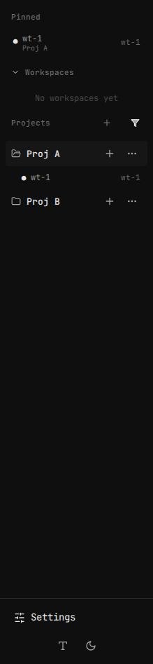
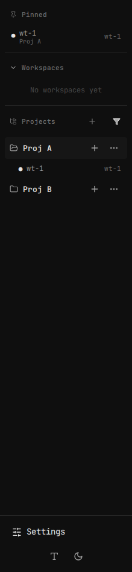

# Sidebar header consistency — before / after

Captured with Playwright against `VITE_USE_MOCK=true` (one project expanded, one worktree pinned so all three sections — Pinned, Workspaces, Projects — render).

## Before

- Titles don't line up: "Pinned" and "Projects" sit flush against the left edge, "Workspaces" is indented past its chevron
- No visual separation between sections

## After

- Pinned gets a leading pin icon, Projects a leading folder-tree icon, both sized to match Workspaces' chevron — all three titles now line up at the same x-offset
- A 1px divider separates each rendered section
- Projects are drag-reorderable (not visible in a static screenshot — see the plan's Requirement 4/Phase 2)

