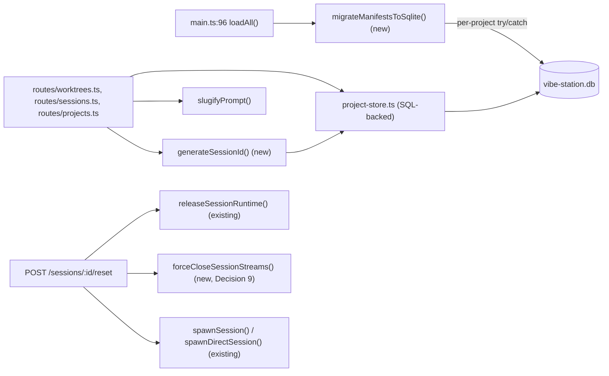

<!--
RULES — read before writing or implementing:
1. FORMAT: Bullets, tables, code, diagrams ONLY — no prose paragraphs
2. REQUIREMENTS: One crisp line each — no verbose descriptions
3. CHECKLIST: Mark items [x] as you complete them — this is your persistent todo list
4. READING TIME: Optimize for fast human scanning — if it's hard to skim, rewrite it
-->

# Plan: SQLite data layer — schema, migration, adapter, naming, rename/reset

> Replace per-project `manifest.json` with `vibe-station.db`, remove `slot` as an identity concept, add deterministic naming, cosmetic rename, and the generalized reset/archive/handoff endpoint.

**Issue:** sqlite-agent-naming
**Branch:** `sqlite-agent-naming`
**Status:** WIP
**PRD:** none — see `../arch-sqlite-agent-naming.md` and `.feature-plans/sqlite_agent_naming_plan.md` (repo root) for full research/decisions
**Parent:** `../arch-sqlite-agent-naming.md`

**Reference files:**
- Data / schema (today, JSON): `daemon/src/services/manifest.ts`, `daemon/src/types.ts:168-210` (`SessionRecord`)
- Core logic (today): `daemon/src/state/project-store.ts`, `daemon/src/services/sessionId.ts`
- Routes: `daemon/src/routes/worktrees.ts`, `daemon/src/routes/sessions.ts`, `daemon/src/routes/projects.ts`
- Boot: `daemon/src/main.ts`
- Existing SQLite precedent: `daemon/src/services/sqliteTranscriptStore.ts`, `daemon/src/services/transcriptMigration.ts`
- WS protocol/teardown: `daemon/src/ws/protocol.ts`, `daemon/src/ws/connection.ts`, `daemon/src/ws/handlers/sessionClose.ts`, `daemon/src/broadcaster.ts`
- Session runtime teardown: `daemon/src/services/sessionRuntime.ts`
- Spawn plumbing: `daemon/src/services/spawn.ts`, `daemon/src/services/promptBuilder.ts`

---

## Superseded

| Prior approach | Why it failed | Superseded on |
|-----------------|---------------|---------------|
| First draft of this plan | Opus review (iteration 1) found: missed `routes/projects.ts` creation call sites; web-ui hardcodes `${wt.id}-m}` id fallback; invented a non-existent `closeSessionRuntime()` (real function is `releaseSessionRuntime`, and it doesn't close WS streams — needed a second, separate mechanism); Decision 2's snippet used field/function names that don't exist (`SessionContext.projectId`, `spawnMainOrAgentSession`); `mutateProject` return type stated wrong; no DB file path/connection-ownership plan; test 2.T2 was factually false | this revision |

---

## Problem

- `manifest.json` per project (`daemon/src/services/manifest.ts:12` `readManifest`, `:43` `writeManifest`) is hard to query/modify at scale
- `slot` (`daemon/src/services/sessionId.ts`) conflates uniqueness key, tmux-name input, and implicit display order — reordering (Part 03) can't work while order lives inside `slot`
- No naming, no rename endpoint, no way to reset a session without losing worktree state
- See `../arch-sqlite-agent-naming.md` § Problem for full context

## Out of Scope

- CLI commands and `/vst` in-chat delivery — Part 02
- Wiring the frontend prototype to these endpoints — Part 03
- Real git branch/directory rename, LLM-assisted auto-naming, transcript migration, `modes.json` migration, retention policy for archived sessions — see arch § Out of Scope

## Concept

- `vibe-station.db` becomes the sole source of truth for `projects`/`worktrees`/`sessions` metadata — no in-memory cache in front of it
- `project-store.ts`'s public functions (`getProject`, `getAllProjects`, `mutateProject`, `addProject`, `deleteProject`) keep their exact current signatures — every caller in `routes/*.ts`, `services/lifecycle.ts`, `services/recover.ts` is unchanged
- `slot` is deleted as a concept; `isMain` + independently-generated `id` + `sortOrder` replace its three jobs

## Requirements

| # | Requirement |
|---|-------------|
| 1 | Boot migrates every project's `manifest.json` into `vibe-station.db`, once, idempotently |
| 2 | A bad/corrupt project's migration failure never blocks daemon boot for other projects |
| 3 | `slugifyPrompt()` runs synchronously at worktree/session creation when a prompt is present |
| 4 | `PATCH /sessions/:id/rename` and `PATCH /worktrees/:id/rename` are cosmetic-only |
| 5 | `POST /sessions/:id/reset` implements the full reset contract (see Key Decisions) |
| 6 | Existing sessions' `id`/`tmuxName` are untouched by the migration (grandfathered) |
| 7 | No web-ui code that currently guesses a main session id as `${wt.id}-m` breaks once ids are independently generated |

---

## Research

### Manifest read/write (today)

- **File:** `daemon/src/services/manifest.ts:12` `readManifest()`, `:43` `writeManifest()` — atomic tmp-write + rename, per project
- **File:** `daemon/src/services/paths.ts:53` `manifestPath()`, `:63` `worktreePath()` (keyed on `wtId`, not branch — unaffected by any rename work), `:39` `vstHome()` — base dir for the new `vibe-station.db`
- **Risk:** LOW — being fully replaced, not extended

### In-memory store + mutation lock (today)

- **File:** `daemon/src/state/project-store.ts:53` `getProject`, `:58` `getAllProjects` — synchronous reads from the `Map`
- **File:** `daemon/src/state/project-store.ts:67-79` `mutateProject(id, fn): Promise<ProjectRecord>` — `withProjectLock` (per-project mutex) → apply update fn → update `Map` → `writeManifest` → **returns the updated record** (not `void`)
- **File:** `daemon/src/state/project-store.ts:87` `addProject`, `:101` `deleteProject`
- **Risk:** HIGH — this is the file being rewritten; every route in the codebase depends on its exact function signatures staying stable, including the `Promise<ProjectRecord>` return

### Slot reservation (today, being removed)

- **File:** `daemon/src/services/sessionId.ts:34` `reserveNextWorktreeNum` — unaffected, worktree numbering stays (not part of `slot`)
- **File:** `daemon/src/services/sessionId.ts:60` `agentHighWaterMark`, `:76` `reserveNextAgentSlot`, `:84` `reserveNextTerminalSlot`, `:100` `reserveNextDirectSlot` — all parse `slot` strings (`startsWith("a"/"t"/"d")`) — being removed as reservation functions, but `agentHighWaterMark`'s COUNTER (not the slot-parsing) survives for labels, see Decision 5
- **File:** `daemon/src/services/sessionId.ts:117` `buildTmuxName(prefix, worktreeNum, slot)`, `:126` `buildDirectTmuxName(prefix, slot)` — being replaced by an id-derived tmux name
- **Risk:** HIGH — session `id` is currently built from `slot` at THREE call sites (not the two the first draft of this plan found), listed below

### Session id construction — ALL THREE call sites (today, being changed)

- **File:** `daemon/src/routes/sessions.ts:459` — direct session (via `POST /sessions`): `const sessionId = \`${projectId}-${slot}\`;`
- **File:** `daemon/src/routes/sessions.ts:573` — worktree session (via `POST /sessions`): `const sessionId = \`${worktreeId}-${slot}\`;`
- **File:** `daemon/src/routes/worktrees.ts:333-354` — main session at worktree creation (via `POST /worktrees`), `slot: "m"` hardcoded, `id: \`${wtId}-m\``
- **File:** `daemon/src/routes/projects.ts:526-528` — main session, again, via the "create project + first worktree" convenience route: `id: \`${wtId}-m\``, `mainTmuxName = buildTmuxName(freshProject.prefix, wtNum, "m")`
- **File:** `daemon/src/routes/projects.ts:648-660` — direct session, again, via the same convenience route: `sessionId = \`${id}-${slot}\``
- **Risk:** HIGH — id generation must move to one shared helper used by all FIVE of these call sites (2 in `sessions.ts`, 2 in `worktrees.ts`/`projects.ts` for main sessions, 1 more in `projects.ts` for direct)

### `slot === "m"` checks (today, being replaced by `isMain`)

- **File:** `daemon/src/routes/sessions.ts:693` — `DELETE /sessions/:id` guard: `if (session.slot === "m") return 400`
- **File:** `daemon/src/routes/worktrees.ts:131` — `mainSessionId: w.sessions.find((s) => s.slot === "m")?.id ?? null`
- **File:** `daemon/src/routes/sessions.ts:288-303` — `labelForSlot(slot, type)` — default label derivation, `slot === "m"` → `"main"`
- **Risk:** MEDIUM — grep `daemon/src` for `.slot` exhaustively before considering Phase 3 done; the two greps above already missed `routes/projects.ts` once

### web-ui hard-codes the `${wt.id}-m` id shape — MUST be fixed here, not deferred to Part 03

- **File:** `web-ui/src/components/dialogs/NewAgentDialog.tsx:775,872,945` — uses `wt.mainSessionId ?? \`${wt.id}-m\`` as a client-side fallback
- **File:** `web-ui/src/components/dialogs/NewSessionDialog.tsx:146` — same fallback pattern
- **Why this can't wait for Part 03:** the moment session ids are independently generated (Decision 1), `${wt.id}-m` is no longer a valid id for ANY session — these fallbacks will silently target a nonexistent session id the instant this part ships, breaking existing UI flows before Part 03 even starts
- **Fix (minimal, not full Part-03 wiring):** remove the `?? \`${wt.id}-m\`` fallback entirely; if `wt.mainSessionId` is falsy, disable the affected action / show a "no main session" state instead of guessing

### Boot sequence (migration insertion point)

- **File:** `daemon/src/main.ts:92` `main()` — order is `acquireLock()` (`:93`) → `loadAll()` (`:96`) → `recoverNotStartedSessions()` (`:98`) → `sweepDirectPtySessionsOnBoot()` (`:99`)
- **Decision:** migration runs inside/replacing `loadAll()` at `:96` — after acquiring the daemon lock, before session recovery reads anything
- **Risk:** MEDIUM — a migration bug here blocks boot entirely; mitigated by per-project try/catch (Key Decision 3)

### Existing SQLite precedent to mirror

- **File:** `daemon/src/services/sqliteTranscriptStore.ts` — WAL mode, one file per session, single-writer pattern
- **File:** `daemon/src/services/transcriptMigration.ts` `migrateJsonlIntoDb` — existing JSONL→SQLite migration convention to mirror structurally (not reuse directly — different data shape)
- **Risk:** LOW — precedent exists, reduces design risk

### CLI prompt resolution (confirms F1 heuristic input, no extra work needed)

- **File:** `cli/src/commands/worktree/create.ts` — `const prompt = resolveFileOrInline(opts.prompt, opts.promptFile, "--prompt-file")`, sent as `prompt` in `POST /worktrees` body
- **File:** `cli/src/commands/session/create.ts:45` — same pattern for `POST /sessions`
- **File:** `cli/src/lib/text-source.ts:23` `resolveFileOrInline` — resolves `--prompt`/`--prompt-file` client-side into one string
- **Confirms:** daemon route handlers only ever see `req.body.prompt` already resolved — `slugifyPrompt()` needs no special-casing for the prompt-file path

### `--name` flag already exists but is dropped server-side

- **File:** `cli/src/commands/worktree/create.ts` — `--name <name>` option exists, sent as `name` in `POST /worktrees` body
- **File:** `daemon/src/routes/worktrees.ts:135-144` `CreateWorktreeBody` zod schema — has no `name` field, so it's silently stripped today
- **Fix:** add `name: z.string().trim().max(60).optional()` to `CreateWorktreeBody`

### Session teardown on reset — TWO separate mechanisms needed, not one

- **File:** `daemon/src/services/sessionRuntime.ts:35` `releaseSessionRuntime(session, {clearAttachments?}): Promise<void>` — already exists, kills the tmux pane / direct-pty child / JSON agent process group. This is what `DELETE /sessions/:id` (`routes/sessions.ts:703`) already calls. **Reset must call this too** (`{clearAttachments: false}` — reset is not destructive to staged attachments).
- **What `releaseSessionRuntime` does NOT do:** touch `WSConnection.openStreams` (`daemon/src/ws/connection.ts:37`) or run under `withSessionLock` (`:121`). After a reset, any browser tab with a terminal pane open on the OLD session id still holds a live `OpenStreamEntry` for it — the process is dead but the client-side stream registration lingers.
- **File:** `daemon/src/ws/handlers/sessionClose.ts:22-40` `closeSessionLocked` — the exact logic that needs to run for every connection holding a stream on the archived session id: `entry.stream.off("chunk", entry.onChunk)` → `await entry.stream.detach(entry.subscriberId)` → `conn.unregisterOpenStream(sessionId)`, guarded by `conn.withSessionLock`
- **File:** `daemon/src/broadcaster.ts:10` `const connections = new Set<WSConnection>()` — the global registry `broadcastAll` iterates; reset needs an equivalent iteration to force-close streams (see Decision 9)

### Spawning the replacement session — real functions, not an invented one

- **File:** `daemon/src/services/spawn.ts:214-224` `SpawnOptions { project, worktree, session, plugin, daemonPort, systemPrompt, taskPrompt?, model? }`, `:225-234` `DirectSpawnOptions { project, session, plugin, daemonPort, systemPrompt, taskPrompt?, model? }`
- **File:** `daemon/src/services/spawn.ts:320` `spawnSession(opts: SpawnOptions): Promise<void>` (worktree-scoped), `:511` `spawnDirectSession(opts: DirectSpawnOptions): Promise<void>` (direct) — there is no `spawnMainOrAgentSession`; pick one of these two based on `SessionContext.kind`
- **File:** `daemon/src/services/promptBuilder.ts:67` `buildPrompt({project, worktree, modeContext, userPrompt}): Promise<BuiltPrompt>` (worktree), `:118` `buildDirectPrompt({...}): Promise<BuiltPrompt>` (direct) — reuse these to build the new session's system/task prompt, do not hand-roll a new prompt-building path

### `SessionContext` shape (today) — no `projectId`/`worktreePath` fields

- **File:** `daemon/src/routes/sessions.ts:125-127` — `type SessionContext = { kind: "worktree"; project: ProjectRecord; worktree: WorktreeRecord; session: SessionRecord } | { kind: "direct"; project: ProjectRecord; session: SessionRecord }`
- **Derive what's needed from this:** `ctx.project.id` for the project id; `worktreePath(ctx.project.id, ctx.worktree.id)` (from `services/paths.ts`) for a worktree session's cwd; `ctx.project.absolutePath` for a direct session's cwd

---

## Root Cause

- `manifest.json` + in-memory `Map` was fine for one-worktree-at-a-time usage; doesn't scale to querying/reordering across projects
- `slot` was overloaded from day one (identity + naming + implicit order) because order was never a first-class concept until now

---

## Architecture Diagram



---

## Design Details

### System Boundaries

| Boundary | Fields + types | Errors | Source of truth |
|----------|----------------|--------|-----------------|
| `project-store.ts` ↔ `vibe-station.db` | see Data Model below | SQLite constraint violations → thrown, caught by route handlers as `500` | `vibe-station.db`, no cache |
| Route handlers ↔ `project-store.ts` | unchanged signatures: `getProject(id): ProjectRecord \| undefined`, `getAllProjects(): ProjectRecord[]`, `mutateProject(id, fn): Promise<ProjectRecord>` (returns the updated record, not `void`), `addProject(record): Promise<void>`, `deleteProject(id): Promise<void>` | unchanged from today | `project-store.ts` |
| HTTP client ↔ Daemon | see API Contracts below | `400`/`404` per contract | Daemon |

### Critical User Journeys (CUJs)

#### CUJ 1 — Boot migration, happy path

```
Daemon starts
  → acquireLock() succeeds
  → migrateManifestsToSqlite() runs once (schema_version check via PRAGMA user_version)
  → for each ~/.vibe-station/projects/<id>/manifest.json:
      → parse, insert into vibe-station.db (projects/worktrees/sessions rows)
      → old manifest.json left on disk, untouched
  → loadAll()'s callers (recoverNotStartedSessions, etc.) now read from SQLite
```

- Edge case: `vibe-station.db` already has `user_version` ≥ current → skip migration entirely, boot proceeds straight to reads

#### CUJ 2 — Boot migration, one corrupt project

```
Daemon starts → migrateManifestsToSqlite()
  → project A: migrates cleanly
  → project B: manifest.json is malformed JSON → caught, logged, B is SKIPPED (quarantined)
  → project C: migrates cleanly
  → boot continues; A and C are usable, B is absent from vibe-station.db until manually fixed
```

- Error path: quarantined project's `manifest.json` is left untouched on disk (not deleted) so it can be fixed and re-migrated on a future boot

#### CUJ 3 — Reset with `--handoff`, worktree-scoped agent session

```
POST /sessions/:id/reset { handoff: true }
  → findSessionContext(id) → ctx.kind === "worktree" (or "direct" — both supported)
  → session must be type=agent (400 if terminal)
  → session must not already be archived (400 if archivedAt is set)
  → run handoff turn, bounded by timeout (60s default)
      → success: handoffText = contents of .vibe-station/HANDOFF.md under the session's cwd
      → timeout/failure: handoffText = null, proceed anyway
  → releaseSessionRuntime(session, {clearAttachments: false})   // kills the process/pane
  → forceCloseSessionStreams(session.id)                        // tells every connected browser to detach
  → UPDATE sessions SET archivedAt = now(), handoffSummary = handoffText WHERE id = :id
  → INSERT new session row: new id (Decision 1), isMain = old.isMain, worktreeId = old.worktreeId,
      sortOrder = old.sortOrder, name = old.name, nameSource = old.nameSource,
      initialPrompt = handoffText (or null if handoff failed and no explicit prompt given)
  → buildPrompt()/buildDirectPrompt() for the new session, then spawnSession()/spawnDirectSession()
  → 200 { archivedSessionId, newSessionId }
```

### Data Model

| Table | Field | Type | Constraints | Notes |
|-------|-------|------|-------------|-------|
| `projects` | `id` | TEXT | PK | |
| `projects` | `absolutePath` | TEXT | NOT NULL | |
| `projects` | `prefix` | TEXT | NOT NULL | |
| `projects` | `isGit` | INTEGER | NOT NULL | boolean 0/1 |
| `projects` | `defaultBranch` | TEXT | NULL | |
| `projects` | `createdAt` | TEXT | NOT NULL | ISO8601 |
| `projects` | `hidden` | INTEGER | NOT NULL DEFAULT 0 | boolean 0/1 |
| `projects` | `directSessionSeq` | INTEGER | NOT NULL DEFAULT 0 | |
| `projects` | `nextWorktreeNum` | INTEGER | NOT NULL DEFAULT 1 | |
| `worktrees` | `id` | TEXT | PK | `${prefix}-${n}`, unchanged |
| `worktrees` | `projectId` | TEXT | FK → `projects.id` ON DELETE CASCADE | index |
| `worktrees` | `name` | TEXT | NULL | **new** — cosmetic, `NULL` = fall back to `branch` |
| `worktrees` | `branch` | TEXT | NOT NULL | |
| `worktrees` | `baseBranch` | TEXT | NULL | |
| `worktrees` | `baseSha` | TEXT | NULL | |
| `worktrees` | `createdAt` | TEXT | NOT NULL | |
| `worktrees` | `pinnedAt` | TEXT | NULL | |
| `worktrees` | `sortOrder` | REAL | NOT NULL | **new** — fractional rank |
| `worktrees` | `terminalSeq` | INTEGER | NOT NULL DEFAULT 0 | |
| `worktrees` | `agentSeq` | INTEGER | NOT NULL DEFAULT 0 | kept only for the default "Agent N" label — see Decision 5 |
| `sessions` | `id` | TEXT | PK | **changed** — independently generated, see Decision 1 |
| `sessions` | `worktreeId` | TEXT | FK → `worktrees.id` ON DELETE CASCADE, NULL | **new field on `SessionRecord`** (doesn't exist on the type today) — nullable = direct session |
| `sessions` | `projectId` | TEXT | FK → `projects.id` ON DELETE CASCADE | **new field on `SessionRecord`** — index |
| `sessions` | `isMain` | INTEGER | NOT NULL DEFAULT 0, `CHECK (isMain = 0 OR worktreeId IS NOT NULL)` | **new** |
| `sessions` | `sortOrder` | REAL | NOT NULL | **new** |
| `sessions` | `type` | TEXT | NOT NULL, `CHECK (type IN ('agent','terminal'))` | |
| `sessions` | `modeId` | TEXT | NULL | |
| `sessions` | `name` | TEXT | NULL | |
| `sessions` | `nameSource` | TEXT | NULL, `CHECK (nameSource IN ('auto','user') OR nameSource IS NULL)` | **new** |
| `sessions` | `tmuxName` | TEXT | NOT NULL | **changed** — `"vst-" + id` for new sessions, unchanged for migrated ones |
| `sessions` | `useTmux` | INTEGER | NOT NULL | boolean 0/1 |
| `sessions` | `channel` | TEXT | NULL | |
| `sessions` | `state` | TEXT | NOT NULL | flattened from `lifecycle.state` |
| `sessions` | `reason` | TEXT | NULL | flattened from `lifecycle.reason` |
| `sessions` | `lastTransitionAt` | TEXT | NOT NULL | flattened from `lifecycle.lastTransitionAt` |
| `sessions` | `transcriptKind` | TEXT | NULL | flattened from `transcriptRef.kind` (`types.ts:189`) |
| `sessions` | `transcriptPath` | TEXT | NULL | flattened from `transcriptRef.path` |
| `sessions` | `agentChatId` | TEXT | NULL | |
| `sessions` | `modelOverride` | TEXT | NULL | |
| `sessions` | `pinnedAt` | TEXT | NULL | |
| `sessions` | `initialPrompt` | TEXT | NULL | |
| `sessions` | `archivedAt` | TEXT | NULL | **new** |
| `sessions` | `handoffSummary` | TEXT | NULL | **new** |

- **Relationships:** `projects` 1→N `worktrees` 1→N `sessions`; `sessions.worktreeId` nullable for direct sessions
- **Indexes:** `worktrees(projectId)`, `sessions(worktreeId)`, `sessions(projectId)`
- **Migration:** Y — full boot-time migration from `manifest.json`, see Decision 3. No `slot` column carried over. No placeholder-branch column exists in the codebase today and none is added here (F2b was never implemented, so there's nothing to "remove")
- **A reset-created session with `channel: "json"` must get a fresh `transcriptRef`** (Decision 2's snippet constructs one, mirroring `routes/sessions.ts`'s direct-session creation pattern: `{kind: "vst-json", path: join(<sessionDataDir>(project.id, newId), "messages.jsonl")}`) — otherwise it has nowhere to persist its turns

### API Contracts

```
PATCH /sessions/:id/rename
  Request:  { name: string }
  Response: { ok: true, name: string | null }
  Errors:   400 VALIDATION_ERROR (>60 chars), 404 NOT_FOUND
  Behavior: empty string "" is stored as NULL (clears override, see Decision 4)
            sets nameSource = "user"

PATCH /worktrees/:id/rename
  Request:  { name: string }
  Response: { ok: true, name: string | null }
  Errors:   400 VALIDATION_ERROR (>60 chars), 404 NOT_FOUND
  Behavior: same NULL-on-empty rule; never touches branch or on-disk directory

POST /sessions/:id/reset
  Request:  { handoff?: boolean, prompt?: string }
  Response: { ok: true, archivedSessionId: string, newSessionId: string }
  Errors:   400 (type=terminal, or already archived), 404 NOT_FOUND
  Behavior: see Decision 2 (full contract)
```

### Key Decisions

#### Decision 1: Session `id` is generated independently, tmux name derives from it

- **Decision:** `id = \`${scopeId}-${type[0]}-${randomSuffix(4 bytes hex)}\`` where `scopeId` is `worktreeId` for worktree sessions, `projectId` for direct sessions (e.g. `vs-3-a-x7f3k2`); `tmuxName = "vst-" + id` for every NEW session
- **Rationale:** today's `id = \`${worktreeId}-${slot}\`` is the root cause of the archiving tmux-collision risk. An independent id keeps ids greppable (scope/type prefix) while removing slot as the source of uniqueness.
- **Where:** new `daemon/src/services/sessionId.ts` functions, replacing the slot-based construction at ALL FIVE call sites found in Research: `routes/sessions.ts:459,573`, `routes/worktrees.ts:333-354`, `routes/projects.ts:526-528,648-660`

```typescript
// daemon/src/services/sessionId.ts (new functions, alongside existing reserveNextWorktreeNum which is unchanged)
import { randomBytes } from "node:crypto";

export function generateSessionId(scopeId: string, type: "agent" | "terminal"): string {
  // scopeId = worktreeId for worktree sessions, projectId for direct sessions.
  // Deliberately NOT slot-derived — every call produces a unique id, so a
  // respawned session (reset) never collides with the row it replaced.
  const suffix = randomBytes(4).toString("hex"); // 8 hex chars, plenty for per-scope uniqueness
  return `${scopeId}-${type[0]}-${suffix}`;
}

export function tmuxNameForSession(id: string): string {
  return `vst-${id}`;
}
```

- **Grandfathering:** migration copies existing `id`/`tmuxName` values verbatim — these functions are only called at NEW session creation (including reset), never retroactively (see Decision 3)
- **web-ui fix required in the same phase:** see Research § "web-ui hard-codes the `${wt.id}-m` id shape" — `NewAgentDialog.tsx:775,872,945`, `NewSessionDialog.tsx:146` must stop guessing the main session id

#### Decision 2: Reset contract — new row, old name kept, no prompt resend

- **Decision:** `POST /sessions/:id/reset` always inserts a new row; never mutates the old one in place beyond archiving it. Depends on Decision 1 (id generation) and the `SessionRecord` field additions from Phase 1's schema (`worktreeId`, `projectId`, `isMain`, `sortOrder`, `nameSource`, `archivedAt`, `handoffSummary` — none of these exist on `SessionRecord` today, see Research).
- **Rationale:** user-confirmed contract (see `.feature-plans/sqlite_agent_naming_plan.md` § F4/F5/F6) — reset is a continuation, not a new task
- **Where:** `daemon/src/routes/sessions.ts` new handler

```typescript
// daemon/src/routes/sessions.ts — POST /sessions/:id/reset
app.post("/sessions/:id/reset", async (req, reply) => {
  const { id } = req.params as { id: string };
  const { handoff, prompt } = ResetBody.parse(req.body); // z.object({ handoff: z.boolean().optional(), prompt: z.string().optional() })

  const ctx = findSessionContext(id); // real shape: {kind:"worktree",project,worktree,session} | {kind:"direct",project,session}
  if (!ctx) return reply.status(404).send({ error: `Session '${id}' not found` });
  const { session, project } = ctx;
  if (session.type !== "agent") return reply.status(400).send({ error: "Reset only applies to agent sessions" });
  if (session.archivedAt) return reply.status(400).send({ error: "Session already archived" });

  const cwd = ctx.kind === "worktree" ? worktreePath(ctx.project.id, ctx.worktree.id) : ctx.project.absolutePath;

  let handoffText: string | null = null;
  if (handoff) {
    const ok = await runHandoffTurn(session, { timeoutMs: 60_000 }); // bounded — see Decision 6
    handoffText = ok ? await readHandoffFileOrNull(join(cwd, ".vibe-station", "HANDOFF.md")) : null;
  }

  await releaseSessionRuntime(session, { clearAttachments: false }); // existing function, services/sessionRuntime.ts:35
  await forceCloseSessionStreams(session.id);                        // new, Decision 9 — detaches every WS client's stream

  // Name: keep old name UNLESS an explicit new prompt was given.
  const newName = prompt ? (slugifyPrompt(prompt) || session.name) : session.name;
  // Prompt: never the ORIGINAL creation prompt. handoff summary + explicit prompt combine if both given (Decision 7).
  const newInitialPrompt = [handoffText, prompt].filter(Boolean).join("\n\n---\n\n") || undefined;

  const scopeId = ctx.kind === "worktree" ? ctx.worktree.id : ctx.project.id;
  const newId = generateSessionId(scopeId, "agent");
  const newSession: SessionRecord = {
    id: newId,
    worktreeId: session.worktreeId,
    projectId: session.projectId,
    isMain: session.isMain,
    sortOrder: session.sortOrder,
    type: "agent",
    modeId: session.modeId,
    name: newName,
    nameSource: prompt ? "auto" : session.nameSource,
    tmuxName: tmuxNameForSession(newId),
    useTmux: session.useTmux,
    channel: session.channel,
    lifecycle: { state: "not_started", lastTransitionAt: new Date().toISOString() },
    initialPrompt: newInitialPrompt,
    ...(session.channel === "json"
      ? { transcriptRef: { kind: "vst-json", path: join(sessionDataDir(project.id, ctx.kind === "worktree" ? ctx.worktree.id : null, newId), "messages.jsonl") } }
      : {}),
  };

  await mutateProject(project.id, (p) => archiveAndInsert(p, session.id, newSession));
  // archiveAndInsert: sets old row's archivedAt/handoffSummary, appends newSession to the
  // same worktree.sessions array (or project.directSessions) — see Files & Phase Impact.
  // mutateProject returns Promise<ProjectRecord> — do not assume void.

  const wtIdForSerialize = ctx.kind === "worktree" ? ctx.worktree.id : null;
  broadcastAll({ type: "session:updated", sessionId: session.id, archivedAt: new Date().toISOString() });
  broadcastAll({ type: "session:created", session: serializeSession(wtIdForSerialize, project.id, newSession) });

  // Actually spawn the new session's runtime, mirroring the existing creation path exactly
  // (see routes/projects.ts:505-512 for the same dynamic-import pattern used at creation).
  const { loadModes } = await import("../routes/modes.js");
  const { resolvePlugin } = await import("../agent-plugins/registry.js");
  const modes = await loadModes();
  const mode = modes.find((m) => m.id === newSession.modeId)!;
  const plugin = resolvePlugin(mode.cli);
  const daemonPort = (app.server.address() as { port?: number })?.port ?? 7421;
  if (ctx.kind === "worktree") {
    const built = await buildPrompt({ project, worktree: ctx.worktree, modeContext: mode.context, userPrompt: newInitialPrompt });
    void spawnSession({ project, worktree: ctx.worktree, session: newSession, plugin, daemonPort, systemPrompt: built.systemPrompt, taskPrompt: built.taskPrompt });
  } else {
    const built = await buildDirectPrompt({ project, modeContext: mode.context, userPrompt: newInitialPrompt });
    void spawnDirectSession({ project, session: newSession, plugin, daemonPort, systemPrompt: built.systemPrompt, taskPrompt: built.taskPrompt });
  }

  return reply.send({ ok: true, archivedSessionId: session.id, newSessionId: newId });
});
```

- **Resolved (was a placeholder):** mode lookup is `loadModes()` from `routes/modes.ts`, dynamically imported exactly as `routes/projects.ts:510` already does at creation — `mode.context` (a string) feeds `buildPrompt`/`buildDirectPrompt`'s `modeContext` param, `mode.cli` feeds `resolvePlugin`. `sessionDataDir` takes 3 args (`projectId, worktreeId | null, sessionId`, `services/paths.ts:83`); `serializeSession` takes 3 args (`worktreeId | null, projectId, session`, `routes/sessions.ts:306`) — both fixed above.

#### Decision 3: Boot migration — per-project quarantine, idempotent, non-destructive

- **Decision:** migration runs once per `schema_version` (via `PRAGMA user_version`), wraps each project's migration in its own try/catch, never deletes `manifest.json`
- **Rationale:** a single shared DB file is a new single point of failure for every project unless defensive; old JSON stays as a rollback safety net for one release
- **Where:** new `daemon/src/services/dbMigration.ts`, called from `daemon/src/main.ts:96` in place of (or wrapping) `loadAll()`

```typescript
// daemon/src/services/dbMigration.ts (new)
export async function migrateManifestsToSqlite(db: Database): Promise<void> {
  const version = db.pragma("user_version", { simple: true }) as number;
  if (version >= CURRENT_SCHEMA_VERSION) return; // already migrated, no-op

  ensureSchema(db); // CREATE TABLE IF NOT EXISTS ..., PRAGMA foreign_keys = ON

  const projectDirs = await listProjectDirs(); // ~/.vibe-station/projects/*
  for (const dir of projectDirs) {
    try {
      const record = await readManifest(dir.projectId); // existing manifest.ts function, unchanged
      insertProjectRecord(db, record); // maps ProjectRecord -> projects/worktrees/sessions rows, id/tmuxName copied verbatim
    } catch (err) {
      logger.error({ projectId: dir.projectId, err }, "manifest migration failed — quarantined, manifest.json left on disk");
      // deliberately continue the loop — one bad project must not abort boot
    }
  }
  db.pragma(`user_version = ${CURRENT_SCHEMA_VERSION}`);
}
```

#### Decision 4: Empty-string rename clears to NULL

- **Decision:** `PATCH .../rename { name: "" }` stores `NULL`, not `""`
- **Rationale:** user-confirmed — falls back to `branch` (worktrees) / default label (sessions), same as never having set a name
- **Where:** `daemon/src/routes/sessions.ts`, `daemon/src/routes/worktrees.ts` — rename handlers: `const value = name.trim() === "" ? null : name.trim().slice(0, 60);`

#### Decision 5: `agentSeq`/`terminalSeq`/`directSessionSeq` survive, scope shrinks to labels only

- **Decision:** keep these three counters, but they are read ONLY by the default-label logic now, never for id/tmux-name uniqueness
- **Rationale:** removing them entirely would require a live COUNT query for every default label render; keeping a cheap persisted counter is simpler and the counters already exist
- **Where:** `daemon/src/routes/sessions.ts` label derivation — rename `labelForSlot(slot, type)` to `defaultLabel(session: SessionRecord): string` using `isMain`/`type` instead of `slot`
- **Also:** `DELETE /sessions/:id` (`routes/sessions.ts:~723`) currently recomputes/persists `agentSeq`'s high-water mark on delete via `agentHighWaterMark`, which parses `slot` strings — once `slot` is gone, this recomputation has nothing to parse. Simplify: `agentSeq` no longer needs recomputation on delete at all (it only ever needs to monotonically increase for the next label, and deleting a session should not decrease it) — remove the high-water recomputation call at this line entirely

#### Decision 6: Handoff turn timeout, proceed-without-notes on failure

- **Decision:** 60s timeout on the handoff turn; on timeout or any failure, proceed with the reset anyway, `handoffSummary = null`
- **Rationale:** a user clicking reset must not be blocked indefinitely by a stuck agent turn
- **Where:** `runHandoffTurn(session, { timeoutMs: 60_000 })`, `daemon/src/routes/sessions.ts` reset handler (Decision 2 snippet)

#### Decision 7: `reset --handoff <prompt>` combines both

- **Decision:** when both a handoff summary and an explicit prompt exist, concatenate them (`handoffText + "\n\n---\n\n" + prompt`) rather than one silently winning
- **Rationale:** arbitrary but explicit default for an open question (arch § Risks #3) — resolved via judgment call rather than blocking; least information-losing option
- **Where:** `newInitialPrompt` construction in Decision 2's snippet

#### Decision 8: `INTEGER` booleans need a shared coercion helper

- **Decision:** one `rowToBool(v: number): boolean` helper, used everywhere a SQLite row maps back onto `ProjectRecord`/`SessionRecord`/`WorktreeRecord`'s real `boolean` fields
- **Rationale:** `better-sqlite3` returns `0`/`1`, not `true`/`false` — ad hoc `!!v` scattered across the adapter is exactly the kind of thing that gets forgotten in one call site
- **Where:** new `daemon/src/state/sqliteRowMappers.ts`

#### Decision 9: WS stream teardown on reset is a SEPARATE step from process teardown

- **Decision:** add `forceCloseSessionStreams(sessionId): Promise<void>` that iterates every connected `WSConnection` (the same `connections: Set<WSConnection>` registry `broadcastAll` uses) and, for each one holding an `openStreams` entry for `sessionId`, runs the exact detach/unregister sequence `sessionClose.ts`'s `closeSessionLocked` uses — under that connection's own `withSessionLock`
- **Rationale:** `releaseSessionRuntime` (Decision 2) kills the actual process, but does nothing about a browser tab's already-open terminal-pane WS stream pointing at the now-dead session id — without this, that tab's pane silently stops receiving output with no error, and a stale entry lingers in `openStreams`
- **Where:** new function in `daemon/src/broadcaster.ts` (co-located with `connections`), called from the reset handler right after `releaseSessionRuntime`

```typescript
// daemon/src/broadcaster.ts (new function, added next to `connections`/`broadcastAll`)
export async function forceCloseSessionStreams(sessionId: string): Promise<void> {
  for (const conn of connections) {
    await conn.withSessionLock(sessionId, async () => {
      const entry = conn.openStreams.get(sessionId);
      if (!entry) return;
      try {
        entry.stream.off("chunk", entry.onChunk);
        await entry.stream.detach(entry.subscriberId);
      } catch {
        // Stream already gone — nothing to detach, matches closeSessionLocked's own tolerance.
      }
      if (conn.openStreams.get(sessionId) === entry) conn.unregisterOpenStream(sessionId);
    });
  }
}
```

---

## Risks / Open Questions

| # | Question | Notes |
|---|----------|-------|
| 1 | `reset --handoff <prompt>` combination | Resolved as concatenation — Decision 7. Revisit if user feedback disagrees |
| 2 | Does anything assume "worktree always has exactly one live main session"? | Not verified — **Phase 4 task 4.4** greps for this before the reset endpoint ships |
| 3 | `modes.json` migration scope | Deferred, confirmed out of scope for this part |
| 4 | Two daemons fighting over one `vibe-station.db` | `acquireLock()` (`main.ts:93`) is assumed to already prevent two daemon processes — **Phase 1 task 1.5** confirms this holds for the DB file too |
| 5 | Exact `mode`/`serializeSession` lookup helpers reused in Decision 2's spawn path | Named generically in the snippet — implementer must grep `routes/sessions.ts`'s existing `POST /sessions` handler for the real helper names and reuse them verbatim (Phase 4.2) |

---

## Implementation Phases

---

### Phase 1 — Schema + boot migration

- [x] **1.1** Create `daemon/src/services/dbSchema.ts` — `ensureSchema(db)`: `CREATE TABLE IF NOT EXISTS projects/worktrees/sessions` per Data Model above, `PRAGMA journal_mode = WAL`, `PRAGMA foreign_keys = ON` on every connection open, indexes on `worktrees.projectId`, `sessions.worktreeId`, `sessions.projectId`
- [x] **1.2** Add `dbPath()` to `daemon/src/services/paths.ts`: `export function dbPath(): string { return join(vstHome(), "vibe-station.db"); }`
- [x] **1.3** Create `daemon/src/state/db.ts` — singleton connection owner: `export function getDb(): Database` opens `new Database(dbPath())` once (lazy-init, module-level cached instance), applies `ensureSchema`; every other module imports `getDb()`, never opens its own connection
- [x] **1.4** Create `daemon/src/services/dbMigration.ts` — `migrateManifestsToSqlite(db)` per Decision 3, using `PRAGMA user_version`
- [x] **1.5** Create `daemon/src/state/sqliteRowMappers.ts` — `rowToBool()` (Decision 8) + row↔`ProjectRecord`/`WorktreeRecord`/`SessionRecord` mappers, including the `transcriptKind`/`transcriptPath` ↔ `transcriptRef` flattening (Data Model note)
- [x] **1.6** Wire migration into `daemon/src/main.ts:96`, replacing the direct `loadAll()` call with one that runs migration first (via `getDb()`), then loads from SQLite
- [x] **1.7** Confirm `acquireLock()` (`main.ts:93`) prevents two daemon processes from opening `vibe-station.db` concurrently (Risk #4) — add a comment if it does, a fix if it doesn't
- [x] **1.8** Add `worktreeId`, `projectId`, `isMain`, `sortOrder`, `nameSource`, `archivedAt`, `handoffSummary` fields to `SessionRecord` in `daemon/src/types.ts:168-210` (additive — `slot` removal happens in Phase 3, both coexist temporarily so Phase 1/2 can compile independently)

**Verify phase 1:**
- [x] **1.T1** Unit — `dbMigration.test.ts`: migrating a well-formed multi-project fixture produces correct row counts in all 3 tables
- [x] **1.T2** Unit — `dbMigration.test.ts`: a malformed `manifest.json` for one project is quarantined (logged, skipped) without throwing, and does not affect other projects' migration
- [x] **1.T3** Unit — `dbMigration.test.ts`: running migration twice is a no-op the second time (idempotency via `user_version`)
- [x] **1.T4** Integration — boot the daemon against a fixture `~/.vibe-station` dir with 2 existing manifest-based projects, confirm `GET /projects` returns both correctly post-migration
- [x] **1.T5** Unit — `sqliteRowMappers.test.ts`: `rowToBool(0) === false`, `rowToBool(1) === true`

---

### Phase 2 — `project-store.ts` adapter rewrite

- [x] **2.1** Rewrite `daemon/src/state/project-store.ts` internals to read/write `vibe-station.db` (via `getDb()`), keeping `getProject`, `getAllProjects`, `mutateProject` (returns `Promise<ProjectRecord>`, not `void`), `addProject`, `deleteProject` signatures byte-identical
- [x] **2.2** `mutateProject`'s per-project mutex (`withProjectLock`) stays — SQLite writes still need serialization per project to avoid lost updates within a single process
- [x] **2.3** Remove `daemon/src/services/manifest.ts`'s write path usage from `project-store.ts` (keep `readManifest`/`writeManifest` themselves for the migration's one-time read, per Decision 3 — don't delete the file)
- [x] **2.4** Update `daemon/src/__tests__/worktrees.test.ts:362,392,421,467` (and any other test hardcoding `${wt.id}-m`) to read the API-returned `mainSessionId` field instead of constructing the id — these tests will NOT pass unmodified, per the reviewer finding

**Verify phase 2:**
- [x] **2.T1** Unit — `project-store.test.ts`: `mutateProject` applied twice concurrently on the same project serializes correctly (no lost update)
- [x] **2.T2** Regression — `daemon/src/__tests__/worktrees.test.ts` (updated per 2.4) passes against the new adapter
- [x] **2.T3** Integration — `POST /worktrees` → `GET /worktrees` round-trips correctly through the SQL-backed store

---

### Phase 3 — Slot refactor + naming heuristic + cosmetic rename

- [x] **3.1** Add `generateSessionId()`/`tmuxNameForSession()` to `daemon/src/services/sessionId.ts` (Decision 1); replace slot-based id/tmux construction at ALL FIVE call sites: `routes/sessions.ts:459,573`, `routes/worktrees.ts:333-354`, `routes/projects.ts:526-528,648-660`
- [x] **3.2** Remove `slot` field from `SessionRecord` type (`daemon/src/types.ts`); replace every `slot === "m"` check with `isMain` — confirmed sites (verified across two review rounds, still re-grep before calling this done): `routes/sessions.ts:693,131,288-303,1499`; `daemon/src/ws/protocol.ts:197` (`slot: z.string()` is a **required** field in the serialized-session zod schema — remove it, this will break serialization if missed); `daemon/src/services/promptBuilder.ts:93` (`slot=${s.slot}` in sibling-session context lines — replace with an `isMain`/`type`-based description)
- [x] **3.3** Fix web-ui fallback: `web-ui/src/components/dialogs/NewAgentDialog.tsx:775,872,945`, `NewSessionDialog.tsx:146` — remove `?? \`${wt.id}-m\`` fallback, handle a falsy `mainSessionId` explicitly (disable action / show empty state). Also update `web-ui/src/components/dialogs/NewAgentDialog.attachments.test.tsx:54` (currently asserts `mainSessionId === \`${wt.id}-m\`` — will fail once ids are independent) and `web-ui/src/api/mock.ts:820` (mock data generator still produces the old `${wt.id}-m` shape — update to a mock-independent id so it doesn't quietly keep the stale assumption alive)
- [x] **3.4** Add `daemon/src/services/naming.ts` — `slugifyPrompt()` exactly per `.feature-plans/sqlite_agent_naming_plan.md` § F1 (STOPWORDS/NOISE lists, path-stripping, max 3 words / 60 chars)
- [x] **3.5** Wire `slugifyPrompt()` into worktree creation (`routes/worktrees.ts`, `routes/projects.ts:515-535` — writes the same slug to both `worktrees.name` and the main session's `name`) and into standalone session creation (`routes/sessions.ts`, `routes/projects.ts:648-660`)
- [x] **3.6** Add `CreateWorktreeBody.name` field (currently dropped, see Research) — explicit `--name` always wins over the heuristic and sets `nameSource: "user"`
- [x] **3.7** Add `PATCH /sessions/:id/rename`, `PATCH /worktrees/:id/rename` per Decision 4 (empty string → NULL)
- [x] **3.8** Update `agentSeq`/`terminalSeq`/`directSessionSeq` usage to label-only per Decision 5, including removing the high-water recomputation in `DELETE /sessions/:id`

**Verify phase 3:**
- [x] **3.T1** Unit — `naming.test.ts`: `slugifyPrompt("Implement the login flow described in SPEC.md") === "implement-login-flow"`
- [x] **3.T2** Unit — `naming.test.ts`: `slugifyPrompt("Review the diff at /tmp/pr.diff and summarise findings.")` does not contain `"tmp"` or `"pr"` (path-stripping works)
- [x] **3.T3** Unit — `naming.test.ts`: empty/whitespace-only prompt → `""`; non-ASCII-only prompt (e.g. all-Japanese) → `""`
- [x] **3.T4** Unit — `naming.test.ts`: output length never exceeds 60 chars even for a long run-on prompt
- [x] **3.T5** Integration — `POST /worktrees {prompt}` (no `name`) → both `worktrees.name` and the main session's `name` equal the same slug
- [x] **3.T6** Integration — `PATCH /sessions/:id/rename {name: ""}` → subsequent `GET` shows `name: null`, UI-facing label falls back correctly
- [x] **3.T7** Regression — `DELETE /sessions/:id` still blocks a live main session (now via `isMain`, not `slot`)
- [x] **3.T8** Component — `NewAgentDialog.test.tsx`/`NewSessionDialog.test.tsx` (or equivalent): a worktree with `mainSessionId: null` renders the disabled/empty state, never guesses an id

---

### Phase 4 — Reset / archive / handoff endpoint

- [x] **4.1** `sessions.archivedAt`, `sessions.handoffSummary` columns (already in Phase 1 schema — this task wires reads/writes for them)
- [x] **4.2** Implement `POST /sessions/:id/reset` per Decision 2's full snippet — grep `routes/sessions.ts`'s existing `POST /sessions` handler for the real `mode`-lookup and `serializeSession` helper names and reuse them verbatim (Risk #5); include `runHandoffTurn` timeout (Decision 6) and prompt-combination (Decision 7)
- [x] **4.3** Implement `forceCloseSessionStreams()` in `daemon/src/broadcaster.ts` per Decision 9; call it (plus the existing `releaseSessionRuntime`) from the reset handler — do NOT invent a new combined teardown function, these are two separate, already-real pieces
- [x] **4.4** Grep the codebase (daemon + web-ui) for any assumption that "a worktree always has exactly one live main session" (Risk #2) — fix or explicitly accept the brief zero-main window during reset
- [x] **4.5** Add `session:updated`/`session:created` WS broadcast fields (`archivedAt`, new session shape) to `daemon/src/ws/protocol.ts`'s zod union

**Verify phase 4:**
- [x] **4.T1** Unit — `sessions.reset.test.ts`: resetting a terminal session returns `400`
- [x] **4.T2** Unit — `sessions.reset.test.ts`: resetting an already-archived session returns `400`
- [x] **4.T3** Integration — `POST /sessions/:id/reset {}` (no args): new row has `initialPrompt: undefined`, `name` equal to the old row's name, `isMain`/`sortOrder` inherited
- [x] **4.T4** Integration — `POST /sessions/:id/reset {prompt: "new task"}`: new row's `name` is re-derived from the new prompt, `initialPrompt` equals exactly `"new task"` (original prompt never resent)
- [x] **4.T5** Integration — `POST /sessions/:id/reset {handoff: true}` against a mocked/stubbed agent turn: `handoffSummary` populated on the archived row, new row's `initialPrompt` equals the handoff text
- [x] **4.T6** Integration — handoff turn timeout (mock a hang) → reset still completes, `handoffSummary: null`
- [x] **4.T7** Regression — old session's tmux/PTY process is actually terminated after reset (`releaseSessionRuntime` called, verify via tmux name lookup)
- [x] **4.T8** Integration — a mock `WSConnection` with an open stream on the old session id has that stream detached and unregistered after reset (`forceCloseSessionStreams` verified directly, not just inferred from 4.T7)

---

## Files & Phase Impact

| File | Status | Phase | Description / Contract Change |
|------|--------|-------|-------------------------------|
| `daemon/src/services/dbSchema.ts` | **New** | 1.1 | `ensureSchema(db)` — table/index/pragma setup |
| `daemon/src/services/paths.ts` | **Modified** | 1.2 | Add `dbPath(): string` |
| `daemon/src/state/db.ts` | **New** | 1.3 | `getDb(): Database` singleton connection owner |
| `daemon/src/services/dbMigration.ts` | **New** | 1.4 | `migrateManifestsToSqlite(db)` — per-project quarantine, idempotent |
| `daemon/src/state/sqliteRowMappers.ts` | **New** | 1.5 | `rowToBool`, row↔record mappers incl. `transcriptRef` flattening |
| `daemon/src/main.ts` | **Modified** | 1.6 | Boot sequence calls migration before load |
| `daemon/src/types.ts` | **Modified** | 1.8, 3.2 | `SessionRecord`: add `worktreeId`/`projectId`/`isMain`/`sortOrder`/`nameSource`/`archivedAt`/`handoffSummary`; remove `slot` |
| `daemon/src/state/project-store.ts` | **Modified** | 2.1-2.3 | Contract: same public function signatures (`mutateProject` returns `Promise<ProjectRecord>`), SQL-backed internals |
| `daemon/src/__tests__/worktrees.test.ts` | **Modified** | 2.4 | Replace hardcoded `${wt.id}-m` with API-returned `mainSessionId` |
| `daemon/src/services/sessionId.ts` | **Modified** | 3.1 | Contract: `generateSessionId(scopeId, type): string`, `tmuxNameForSession(id): string` — replaces slot-based reservation functions |
| `daemon/src/routes/worktrees.ts` | **Modified** | 3.1, 3.2, 3.5, 3.6, 3.7, 4.4 | id/tmux via Decision 1, `isMain` checks, naming wiring, `name` field, `PATCH .../rename` |
| `daemon/src/routes/sessions.ts` | **Modified** | 3.1, 3.2, 3.5, 3.7, 3.8, 4.2, 4.4 | id/tmux via Decision 1, `isMain` checks, naming wiring, rename + reset endpoints, delete high-water fix |
| `daemon/src/routes/projects.ts` | **Modified** | 3.1, 3.2, 3.5 | Same id/tmux/naming/isMain changes at its own main+direct session creation sites |
| `daemon/src/services/naming.ts` | **New** | 3.4 | `slugifyPrompt(prompt, maxWords?, maxLen?): string` — pure function |
| `web-ui/src/components/dialogs/NewAgentDialog.tsx` | **Modified** | 3.3 | Remove `${wt.id}-m` fallback |
| `web-ui/src/components/dialogs/NewSessionDialog.tsx` | **Modified** | 3.3 | Remove `${wt.id}-m` fallback |
| `web-ui/src/components/dialogs/NewAgentDialog.attachments.test.tsx` | **Modified** | 3.3 | Fix stale `${wt.id}-m` assertion |
| `web-ui/src/api/mock.ts` | **Modified** | 3.3 | Fix mock generator's stale id shape |
| `daemon/src/services/promptBuilder.ts` | **Modified** | 3.2 | Remove `slot=${s.slot}` sibling-context line |
| `daemon/src/broadcaster.ts` | **Modified** | 4.3 | Add `forceCloseSessionStreams(sessionId)` |
| `daemon/src/ws/protocol.ts` | **Modified** | 3.2, 4.5 | Remove required `slot` field from serialized-session schema; add new broadcast fields on `session:updated`/`session:created` |
| `daemon/src/services/dbMigration.test.ts` | **New** | 1.T1-1.T3 | Migration unit tests |
| `daemon/src/state/sqliteRowMappers.test.ts` | **New** | 1.T5 | Boolean coercion tests |
| `daemon/src/state/project-store.test.ts` | **New/Modified** | 2.T1 | Concurrency test for `mutateProject` |
| `daemon/src/services/naming.test.ts` | **New** | 3.T1-3.T4 | Heuristic slug unit tests |
| `web-ui/src/components/dialogs/NewAgentDialog.test.tsx` | **New/Modified** | 3.T8 | Null `mainSessionId` handling |
| `daemon/src/routes/sessions.reset.test.ts` | **New** | 4.T1-4.T8 | Reset endpoint integration tests, incl. WS stream teardown |
