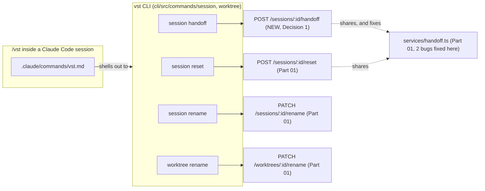

<!--
RULES — read before writing or implementing:
1. FORMAT: Bullets, tables, code, diagrams ONLY — no prose paragraphs
2. REQUIREMENTS: One crisp line each — no verbose descriptions
3. CHECKLIST: Mark items [x] as you complete them — this is your persistent todo list
4. READING TIME: Optimize for fast human scanning — if it's hard to skim, rewrite it
-->

# Plan: CLI commands + `/vst` in-chat command delivery

> New `vst` CLI subcommands for the Part 01 endpoints (plus one new daemon endpoint this part needs), plus the `/vst` slash command available inside a running agent's own chat.

**Issue:** sqlite-agent-naming
**Branch:** `sqlite-agent-naming`
**Status:** Pending
**PRD:** none — see `../arch-sqlite-agent-naming.md` § F11 and `.feature-plans/sqlite_agent_naming_plan.md`
**Parent:** `../arch-sqlite-agent-naming.md`

**Reference files:**
- CLI entrypoint: `cli/src/program.ts`
- CLI conventions: `cli/src/commands/session/kill.ts`, `cli/src/commands/session/meta.ts`, `cli/src/commands/send.ts`, `cli/src/commands/worktree/done.ts`
- Daemon client: `cli/src/lib/daemon-client.ts`
- Shipped Part 01 endpoints: `daemon/src/routes/sessions.ts` (reset, rename), `daemon/src/routes/worktrees.ts` (rename), `daemon/src/services/handoff.ts` (`runHandoffTurn`, `readHandoffFileOrNull`)
- Per-CLI plugin hook: `daemon/src/agent-plugins/claude.ts:290` `setupWorkspaceHooks`

---

## Superseded

| Prior approach | Why it failed | Superseded on |
|-----------------|---------------|---------------|
| First draft of this plan | Opus review found: no checklist item actually built the new `POST /sessions/:id/handoff` endpoint (only mentioned in the Files table); Decision 1's snippet passed `runHandoffTurn` an incomplete options object (missing required `handoffPath`) and didn't match the real `await import(...)` cycle-avoidance pattern Part 01 uses; response shapes for all 4 endpoints were never stated, leaving a "mechanical" Phase 1 impossible to execute cold; Phase 1 mixed a non-mechanical daemon-route task into a haiku-suitable CLI phase; 1.T2 referenced a test harness that doesn't exist; two real latent bugs in `handoff.ts` were undiscovered (stale-file reuse, json-channel timeout waste) | this revision |

---

## Problem

- No CLI commands exist for the Part 01 endpoints (`rename`, `reset`)
- No standalone "just write a handoff summary" endpoint exists yet — Part 01 only built it inline inside reset
- No way to trigger any of this from inside a running agent's own chat
- See `../arch-sqlite-agent-naming.md` § F11 for the full command-mapping table

## Out of Scope

- The Part 01 endpoints themselves (reset, rename) — already shipped, commit `b68b09a`
- Wiring the web-ui to call these — Part 03
- `/vst pin`/`unpin` — explicitly skipped for v1 (arch § F11 notes)

## Concept

- One new daemon endpoint (`POST /sessions/:id/handoff`) plus two small bug fixes in the shared `handoff.ts` module it (and Part 01's reset) both depend on
- Four new CLI commands, following the exact conventions already in `cli/src/commands/session/*.ts` and `cli/src/commands/worktree/*.ts`
- One new in-chat slash command (`/vst`), Claude Code first, Cursor/OpenCode researched via a fable-model consultation

## Requirements

| # | Requirement |
|---|-------------|
| 1 | `vst session reset <id> [--handoff] [--prompt <text>]` calls `POST /sessions/:id/reset` |
| 2 | `vst session handoff <id>` calls a NEW `POST /sessions/:id/handoff` (write-only, no archive/respawn) |
| 3 | `vst session rename <id> <name>` calls `PATCH /sessions/:id/rename` |
| 4 | `vst worktree rename <id> <name>` calls `PATCH /worktrees/:id/rename` |
| 5 | `/vst reset`, `/vst handoff`, `/vst rename` work inside a Claude Code session, targeting `$VST_SESSION` with no id argument |
| 6 | A second handoff attempt (via either reset or the new endpoint) never returns a stale summary from a prior run |

## Data Model

- No schema changes in this part — reuses Part 01's `sessions.archivedAt`/`handoffSummary` columns as-is (only the reset path writes them; the new standalone handoff endpoint does not persist anything, it just returns text)

---

## Research

### CLI command registration pattern

- **File:** `cli/src/program.ts:90-101` — `session` subcommand group registers via `registerSessionX(session)` functions, one file per command
- **File:** `cli/src/commands/session/kill.ts:6-21` — canonical shape: `session.command("kill <id>").description(...).action(async (id) => { await preflight(); const result = await daemonDelete(...); if (!result.ok) die(result.error, result.status === 404 ? 2 : 1); success(...); })` — note the exit-code convention: `404 → exit 2`, everything else `→ exit 1`
- **File:** `cli/src/commands/worktree/done.ts:13` — URLs are built with `encodeURIComponent(id)` — follow this for every new command
- **Risk:** LOW — pure mechanical follow-the-pattern work once the daemon-side response shapes are known (see below)

### `daemonPatch` doesn't exist yet

- **File:** `cli/src/lib/daemon-client.ts:59-77` — `daemonGet`, `daemonPost`, `daemonPut`, `daemonDelete` all exist; no `daemonPatch`
- **Fix:** add `export async function daemonPatch<T>(path: string, body?: unknown): Promise<DaemonResult<T>> { return daemonRequest<T>("PATCH", path, body); }`, mirroring `daemonPut` exactly

### Actual response shapes of the endpoints these commands call (verified against shipped code, not assumed)

- **File:** `daemon/src/routes/sessions.ts:1308` — `POST /sessions/:id/reset` → `{ ok: true, archivedSessionId: string, newSessionId: string }`
- **File:** `daemon/src/routes/sessions.ts:820-853` — `PATCH /sessions/:id/rename` → `{ ok: true, name: string | null }`; body is `z.object({ name: z.string().max(60) })`; **empty string clears the override** (stored/returned as `null`, per `sessions.ts:829`)
- **File:** `daemon/src/routes/worktrees.ts:575-586` — `PATCH /worktrees/:id/rename` → `{ ok: true, name: string | null }`, same empty-string-clears rule
- **New (Decision 1):** `POST /sessions/:id/handoff` → `{ ok: true, handoffSummary: string | null }`

### `handoff.ts` — real signature, and two real bugs the new endpoint must not inherit

- **File:** `daemon/src/services/handoff.ts:24-31` — `RunHandoffTurnOpts { timeoutMs: number; handoffPath: string; pollMs?: number }` — `handoffPath` is REQUIRED, not optional
- **File:** `daemon/src/services/handoff.ts:38-64` `runHandoffTurn(session, opts): Promise<boolean>` — delivers the instruction (tmux paste / direct-pty write / no-op for json channel), then polls `opts.handoffPath` for existence up to `opts.timeoutMs`
- **File:** `daemon/src/routes/sessions.ts:1173-1177` — the REAL call site (inside reset), for the exact pattern to copy: `const { runHandoffTurn, readHandoffFileOrNull } = await import("../services/handoff.js"); const handoffPath = join(cwd, ".vibe-station", "HANDOFF.md"); const ok = await runHandoffTurn(session, { timeoutMs: 60_000, handoffPath }); handoffText = ok ? await readHandoffFileOrNull(handoffPath) : null;` — dynamic import is deliberate (cycle-avoidance), not a style choice, keep it
- **Bug 1 — stale file reuse:** `handoff.ts`'s poll loop checks `existsSync(opts.handoffPath)` immediately on entry (before any wait). Nothing deletes a pre-existing `HANDOFF.md` before delivering the instruction. A SECOND handoff (via reset or the new endpoint) on a session that already has an old `HANDOFF.md` returns instantly with the STALE summary, never actually waiting for a fresh one. **This bug already exists in Part 01's shipped reset path too** — fixing it in `handoff.ts` itself fixes both call sites at once.
- **Bug 2 — json-channel sessions waste the full timeout:** `sessionChannel(session) === "json"` sessions get a no-op delivery (comment at `handoff.ts:46-52` acknowledges this), then still poll for the full `timeoutMs` (60s) before giving up, since nothing will ever produce the file via this mechanism. Should return `false` immediately instead.
- **Risk:** MEDIUM — both fixes touch already-shipped, tested code; keep the fix minimal and re-run Part 01's existing `handoff`/`reset` tests to confirm no regression

### `/vst` delivery — Claude Code has a real hook point, Cursor/OpenCode already implement the SAME optional interface method (verified, not a stub situation)

- **File:** `daemon/src/services/spawn.ts:112` — `setupWorkspaceHooks?(worktreePath): Promise<void>` is already declared OPTIONAL on `AgentPlugin`
- **File:** `daemon/src/agent-plugins/claude.ts:290-345` — implements it (writes `.claude/settings.json` + hook scripts); this is where `.claude/commands/vst.md` gets added
- **File:** `daemon/src/agent-plugins/cursor.ts:375`, `daemon/src/agent-plugins/opencode.ts:342` — **both already implement `setupWorkspaceHooks` for their own purposes** (not a missing interface method) — read what they currently write before deciding whether either CLI has an equivalent custom-command mechanism to extend
- **Convention (Claude Code custom slash commands):** a markdown file at `.claude/commands/<name>.md` becomes `/name`; the file body is the prompt template, `$ARGUMENTS` is replaced with whatever the user typed after the command — this is a documented convention, not yet verified against a live instance in this repo (Risk #1)
- **Gap:** whether Cursor/OpenCode have an equivalent CUSTOM SLASH COMMAND mechanism (as opposed to just "a place `setupWorkspaceHooks` already writes to") is genuinely unresearched
- **Risk:** MEDIUM — consult a fable-model subagent (Decision 3) rather than guessing; Claude-only is an acceptable v1 outcome

### `$VST_WORKTREE` is not always set

- **File:** `daemon/src/services/spawn.ts:359-361` (worktree sessions) vs `:549` (direct sessions) — direct sessions never get `$VST_WORKTREE` injected
- **Implication:** the `/vst rename --worktree <name>` template must handle its absence explicitly (error message, not a broken CLI invocation with an empty id)

---

## Root Cause

- These are net-new features (Part 01 just shipped the core endpoints) — there's no "why is this broken" beyond the two real `handoff.ts` bugs found above

---

## Architecture Diagram



---

## Design Details

### System Boundaries

| Boundary | Fields + types | Errors | Source of truth |
|----------|----------------|--------|-----------------|
| CLI ↔ Daemon | reuses Part 01's contracts exactly for reset/rename (shapes confirmed in Research); **adds** `POST /sessions/:id/handoff` → `{}` request, `{ ok: true, handoffSummary: string \| null }` response | `400` (non-agent session), `404` | Daemon |
| `.claude/commands/vst.md` ↔ CLI | slash-command args → shell arguments, no typed contract (plain text) | N/A — CLI's own error output surfaces to the chat | CLI |

### Critical User Journeys (CUJs)

#### CUJ 1 — User types `/vst reset --handoff` mid-conversation

```
User types /vst reset --handoff in the Claude Code chat
  → Claude Code expands .claude/commands/vst.md with $ARGUMENTS = "reset --handoff"
  → the expanded prompt instructs the agent to run:
      vst session reset $VST_SESSION --handoff
  → agent runs the shell command via its own tool-use
  → CLI resolves $VST_SESSION, calls POST /sessions/:id/reset {handoff: true}
  → daemon archives + respawns (Part 01 behavior)
  → CLI prints the new session id; the OLD session's process is now torn down
    (this turn of the OLD agent effectively never completes — see Decision 2)
```

- Edge case: `/vst reset` on a terminal session → CLI's own `400` from the daemon surfaces as an error message in chat, no daemon behavior needed beyond Part 01

#### CUJ 2 — `vst session handoff` called twice in a row

```
User runs: vst session handoff abc123
  → handoff.ts deletes any pre-existing HANDOFF.md first (Bug-1 fix)
  → delivers instruction, polls, gets a FRESH summary
  → CLI prints it

User runs the SAME command again 5 minutes later
  → handoff.ts again deletes the (now-fresh-from-last-time) file first
  → delivers instruction again, polls, gets a NEW fresh summary
  → CLI prints the NEW one, never the stale one from 5 minutes ago
```

#### CUJ 3 — `vst session rename` clears an override

```
User runs: vst session rename abc123 ""
  → PATCH /sessions/abc123/rename { name: "" }
  → 200 { ok: true, name: null }
  → CLI must print "cleared" or similar, not crash on a null name
```

### API Contracts

```
POST /sessions/:id/handoff   (NEW)
  Request:  {}
  Response: { ok: true, handoffSummary: string | null }
  Errors:   400 (type=terminal), 404 NOT_FOUND
  Behavior: runs runHandoffTurn (services/handoff.ts, Part 01 + Bug fixes
            from this plan) but does NOT archive or respawn — write-only
```

### Key Decisions

#### Decision 1: `vst session handoff` needs a NEW daemon endpoint — exact snippet, matching the real shipped pattern

- **Decision:** add `POST /sessions/:id/handoff`, copying the exact call pattern already shipped inside reset (`routes/sessions.ts:1173-1177`), factored out to skip archive/respawn
- **Rationale:** arch § F11 table lists `/vst handoff` as a standalone checkpoint, distinct from `/vst reset --handoff`; Part 01 only built the combined path
- **Where:** `daemon/src/routes/sessions.ts` — new handler, placed near the existing `POST /sessions/:id/reset` handler

```typescript
// daemon/src/routes/sessions.ts — POST /sessions/:id/handoff (new)
app.post("/sessions/:id/handoff", async (req, reply) => {
  const { id } = req.params as { id: string };
  const ctx = findSessionContext(id);
  if (!ctx) return reply.status(404).send({ error: `Session '${id}' not found` });
  if (ctx.session.type !== "agent") {
    return reply.status(400).send({ error: "Handoff only applies to agent sessions" });
  }

  // No archivedAt guard here (unlike reset) — a standalone handoff summary is
  // still meaningful to request even after a session is archived (read-only history).
  const cwd = ctx.kind === "worktree" ? worktreePath(ctx.project.id, ctx.worktree.id) : ctx.project.absolutePath;
  const { runHandoffTurn, readHandoffFileOrNull } = await import("../services/handoff.js"); // matches reset's cycle-avoidance import
  const handoffPath = join(cwd, ".vibe-station", "HANDOFF.md");
  const ok = await runHandoffTurn(ctx.session, { timeoutMs: 60_000, handoffPath });
  const handoffSummary = ok ? await readHandoffFileOrNull(handoffPath) : null;

  return reply.send({ ok: true, handoffSummary });
});
```

#### Decision 1b: Fix `handoff.ts`'s two bugs in the shared module (benefits reset too)

- **Decision:** (a) delete any pre-existing file at `opts.handoffPath` before delivering the instruction (best-effort, ignore `ENOENT`); (b) if `sessionChannel(session) === "json"`, return `false` immediately instead of polling
- **Rationale:** both bugs are real and already present in Part 01's shipped reset path; fixing the shared function fixes both call sites without touching either route handler again
- **Where:** `daemon/src/services/handoff.ts:38` `runHandoffTurn`

```typescript
// daemon/src/services/handoff.ts — runHandoffTurn, patched
// `existsSync` already imported from "node:fs"; add `unlink` to the EXISTING
// `import { readFile } from "node:fs/promises"` line rather than a second fs import.
import { existsSync } from "node:fs";
import { readFile, unlink } from "node:fs/promises";
// sessionChannel is already imported (handoff.ts:19) — no new import needed for the check below.

export async function runHandoffTurn(session: SessionRecord, opts: RunHandoffTurnOpts): Promise<boolean> {
  // Bug 2 fix: json-channel delivery is a documented no-op — don't waste the full timeout polling for a file nothing will produce.
  if (sessionChannel(session) === "json") return false;

  // Bug 1 fix: a stale HANDOFF.md from a prior handoff/reset must not be mistaken for a fresh one.
  try {
    await unlink(opts.handoffPath);
  } catch {
    // ENOENT is the expected case (no prior file) — anything else is still non-fatal, we proceed either way.
  }

  // The json-channel branch above already returns before this point, so the
  // remaining two delivery paths (tmux / direct-pty) are exhaustive — no
  // third branch to preserve, safe to collapse the old `else if` to `else`.
  try {
    if (session.useTmux) {
      await pasteBuffer(session.tmuxName, `_vst_handoff-${session.id}`, `${HANDOFF_INSTRUCTION}\n`);
    } else {
      directPtyRegistry.get(session.id)?.write?.(`${HANDOFF_INSTRUCTION}\r`);
    }
  } catch {
    return false;
  }

  const pollMs = opts.pollMs ?? 1000;
  const start = Date.now();
  while (Date.now() - start < opts.timeoutMs) {
    if (existsSync(opts.handoffPath)) return true;
    await new Promise((r) => setTimeout(r, pollMs));
  }
  return existsSync(opts.handoffPath);
}
```

#### Decision 2: `/vst reset` runs from inside the session it's about to kill — fire-and-forget from the agent's perspective

- **Decision:** the `.claude/commands/vst.md` prompt instructs the agent to run the CLI command as its last action for that turn; the agent cannot observe the daemon's response meaningfully, since its own process is torn down as part of executing the command
- **Rationale:** inherent to what reset does — the command's own template text should set this expectation explicitly ("this ends your turn; the user will see a fresh session")
- **Where:** the `.claude/commands/vst.md` template text itself (Phase 3)

#### Decision 3: extend the EXISTING `setupWorkspaceHooks` on all three plugins, don't add a stub

- **Decision:** `setupWorkspaceHooks` is already optional (`spawn.ts:112`) and already implemented by all three plugins for their own purposes (`claude.ts:290`, `cursor.ts:375`, `opencode.ts:342`). Add the `/vst`-equivalent to Claude's implementation directly. For Cursor/OpenCode, consult a fable-model subagent on whether either tool has an actual custom-slash-command mechanism worth writing into their already-existing `setupWorkspaceHooks` — if yes, extend; if genuinely no equivalent exists, leave their implementations untouched and document the gap in `spawn.ts`'s interface doc comment
- **Note:** `cursor.ts:375`'s `setupWorkspaceHooks()` takes NO path argument, unlike `claude.ts`/`opencode.ts` which take `worktreePath`. If Cursor turns out to have a real command-file mechanism worth writing to, its `setupWorkspaceHooks` signature must be widened to accept the path first — this is itself a small `AgentPlugin` interface change, not just a body edit
- **Rationale:** per arch § Risks #4 and the user's blocker-handling instruction — don't stall on an unresearched external constraint, ship what's real
- **Where:** `daemon/src/agent-plugins/claude.ts` (definitely), `cursor.ts`/`opencode.ts` (conditionally, per fable consultation), `daemon/src/services/spawn.ts:112` (doc comment)

---

## Risks / Open Questions

| # | Question | Notes |
|---|----------|-------|
| 1 | Exact Claude Code custom-slash-command frontmatter/`$ARGUMENTS` behavior | Documented convention, not verified live — Phase 3 manually tests it against the dev sandbox before considering the phase done |
| 2 | Cursor/OpenCode equivalent | Genuinely unresearched — consult fable subagent per Decision 3, do not guess |

---

## Implementation Phases

---

### Phase 1 — Daemon: new handoff endpoint + `handoff.ts` bug fixes (needs judgment — sonnet, NOT mechanical)

- [x] **1.1** Fix `handoff.ts`'s two bugs per Decision 1b (stale-file deletion, json-channel short-circuit)
- [x] **1.2** Add `POST /sessions/:id/handoff` per Decision 1's exact snippet

**Verify phase 1:**
- [x] **1.T1** Unit — `daemon/src/__tests__/handoff.test.ts` (new — no pre-existing dedicated test file for this module; extend if the implementer finds one was added elsewhere in Part 01, don't duplicate): a second call to `runHandoffTurn` with a pre-existing stale file at `handoffPath` does NOT return `true` instantly — it deletes the stale file and actually waits
- [x] **1.T2** Unit — same file: `runHandoffTurn` on a session with `sessionChannel(session) === "json"` returns `false` immediately (assert via fake timers that it does NOT wait `timeoutMs`)
- [x] **1.T3** Integration — `daemon/src/__tests__/sessions.handoff.test.ts` (new): `POST /sessions/:id/handoff` on a terminal session → `400`; on a nonexistent id → `404`; on a valid agent session (mocked `runHandoffTurn`) → `200 { ok: true, handoffSummary }`
- [x] **1.T4** Regression, narrow scope — `daemon/src/__tests__/sessions.reset.test.ts:40` mocks the entire `handoff.js` module (`vi.mock`), so its existing 4.T5/4.T6 cases exercise the mock, not the real bug fixes — they will NOT catch a regression here. Real coverage is 1.T1/1.T2 only. Just confirm those existing mocked tests still pass unmodified (the mock's shape is unaffected by this phase), don't rely on them for handoff.ts correctness

---

### Phase 2 — CLI commands (mechanical — suitable for a cheaper/haiku implementer, ONLY after Phase 1 ships)

- [x] **2.1** Add `daemonPatch<T>()` to `cli/src/lib/daemon-client.ts`, mirroring `daemonPut` exactly
- [x] **2.2** `cli/src/commands/session/reset.ts` — `session reset <id> [--handoff] [--prompt <text>]`, calls `POST /sessions/:id/reset`, prints `{archivedSessionId, newSessionId}` on success; follow `kill.ts`'s shape and exit-code convention (`404 → exit 2`, else `exit 1`) exactly, `encodeURIComponent` the id
- [x] **2.3** `cli/src/commands/session/handoff.ts` — `session handoff <id>`, calls `POST /sessions/:id/handoff` (Phase 1), prints `handoffSummary` or "no summary produced" if `null`
- [x] **2.4** `cli/src/commands/session/rename.ts` — `session rename <id> <name>`, calls `PATCH /sessions/:id/rename`; if the response `name` is `null` (empty-string input), print "name cleared", not a blank/broken line
- [x] **2.5** `cli/src/commands/worktree/rename.ts` — `worktree rename <id> <name>`, calls `PATCH /worktrees/:id/rename`, same null-handling as 2.4
- [x] **2.6** Register all four in `cli/src/program.ts` (`registerSessionReset`, `registerSessionHandoff`, `registerSessionRename`, `registerWorktreeRename`)

**Verify phase 2:**
- [x] **2.T1** Unit — `cli/src/__tests__/daemon-client.test.ts` (create if none exists — CLI tests live in `cli/src/__tests__/`, not co-located with the command files): `daemonPatch` sends `PATCH` with the given body to the given path
- [x] **2.T2** Unit — `cli/src/__tests__/session-reset.test.ts`, `session-handoff.test.ts`, `session-rename.test.ts`, `worktree-rename.test.ts` (new, same `__tests__` directory convention as `program.test.ts`): mock `cli/src/lib/daemon-client.ts`'s relevant function (`vi.mock`), assert each command calls it with the correct URL (including `encodeURIComponent`) and body, and prints the expected output for both the success shape AND the `name: null` case (2.4/2.5)
- [x] **2.T3** Regression — `vst session --help` / `vst worktree --help` list the new subcommands

---

### Phase 3 — `/vst` in-chat command delivery (needs judgment — sonnet)

- [x] **3.1** Add `.claude/commands/vst.md` template content, written by `setupWorkspaceHooks` in `daemon/src/agent-plugins/claude.ts:290` (extend the existing function) — template maps `/vst reset`, `/vst reset --handoff`, `/vst reset <prompt>`, `/vst handoff`, `/vst rename <name>`, `/vst rename --worktree <name>` to the exact CLI invocations from Phase 2, substituting `$VST_SESSION`/`$VST_WORKTREE`; `--worktree` variant must check `$VST_WORKTREE` is set and print a clear error if not (direct sessions never have it, per Research)
- [x] **3.2** Manually verify against the dev sandbox (`docker-compose.dev.vs34.yml`, rebuild after this phase since it's a daemon-side change) that `/vst` actually appears as a slash command in a spawned Claude Code session and expands correctly (Risk #1) — record the result (pass/fail + what was observed) in this plan's completion notes
- [x] **3.3** Consult a fable-model subagent on Cursor/OpenCode `/vst` equivalents (Decision 3); extend `cursor.ts`/`opencode.ts`'s existing `setupWorkspaceHooks` if a real mechanism exists, otherwise leave them untouched
- [x] **3.4** Update the `AgentPlugin.setupWorkspaceHooks` doc comment (`daemon/src/services/spawn.ts:112`) noting the `/vst` addition and its per-CLI coverage status

**Verify phase 3:**
- [x] **3.T1** Manual — recorded in plan completion notes, not automated: confirm `/vst reset` actually works in a live Claude Code session in the dev sandbox. **What was actually done (honest bar):** rebuilt `docker-compose.dev.vs34.yml` (project `vs-34`), created a NEW worktree (`fsd-3`) on the `file-search-demo` project via `POST /api/worktrees` (which spawns its main Claude session and runs `setupWorkspaceHooks`), then `docker exec`'d into the container and read `/home/vst/.vibe-station/projects/file-search-demo/worktrees/fsd-3/.claude/commands/vst.md` — confirmed the file exists with the exact expected template content (all six argument-pattern mappings, the `$VST_WORKTREE`-unset guard text, and the reset-ends-session expectation-setting text). This is file-exists-with-expected-content verification, NOT a live `/slash` command execution inside an interactive Claude Code TUI — that was not attempted (no interactive TUI access from this environment). Test worktree was deleted afterward via `DELETE /api/worktrees/fsd-3`.
- [x] **3.T2** Unit — `daemon/src/__tests__/plugins.test.ts:446-508` (existing `setupWorkspaceHooks` test block) extended: writes `.claude/commands/vst.md` with the expected content for a fixture worktree path. Also added equivalent coverage for `.opencode/commands/vst.md` (opencode) and `.cursor/commands/vst.md` (cursor), since the fable-model consultation (3.3) found real mechanisms for both.
- [x] **3.T3** Regression — the rest of `plugins.test.ts` (hook scripts, settings.json assertions) still passes — this function is being extended, not replaced. Confirmed: 41/41 tests in `plugins.test.ts` pass.

---

## Files & Phase Impact

| File | Status | Phase | Description / Contract Change |
|------|--------|-------|-------------------------------|
| `daemon/src/services/handoff.ts` | **Modified** | 1.1 | Fix stale-file reuse + json-channel timeout waste |
| `daemon/src/routes/sessions.ts` | **Modified** | 1.2 | New `POST /sessions/:id/handoff` |
| `cli/src/lib/daemon-client.ts` | **Modified** | 2.1 | Add `daemonPatch<T>()` |
| `cli/src/commands/session/reset.ts` | **New** | 2.2 | `session reset <id> [--handoff] [--prompt]` |
| `cli/src/commands/session/handoff.ts` | **New** | 2.3 | `session handoff <id>` |
| `cli/src/commands/session/rename.ts` | **New** | 2.4 | `session rename <id> <name>` |
| `cli/src/commands/worktree/rename.ts` | **New** | 2.5 | `worktree rename <id> <name>` |
| `cli/src/program.ts` | **Modified** | 2.6 | Register 4 new commands |
| `daemon/src/agent-plugins/claude.ts` | **Modified** | 3.1 | Extend `setupWorkspaceHooks` to write `.claude/commands/vst.md` |
| `daemon/src/agent-plugins/cursor.ts`, `opencode.ts` | **Modified (maybe)** | 3.3 | Extend existing `setupWorkspaceHooks`, per fable consultation |
| `daemon/src/services/spawn.ts` | **Modified** | 3.4 | `AgentPlugin.setupWorkspaceHooks` doc comment update |
| `daemon/src/__tests__/handoff.test.ts` | **New** | 1.T1-1.T2 | Bug-fix regression tests |
| `daemon/src/__tests__/sessions.handoff.test.ts` | **New** | 1.T3 | New endpoint integration tests |
| `cli/src/__tests__/daemon-client.test.ts` | **New/Modified** | 2.T1 | `daemonPatch` unit test |
| `cli/src/__tests__/session-reset.test.ts`, `session-handoff.test.ts`, `session-rename.test.ts`, `worktree-rename.test.ts` | **New** | 2.T2 | Mocked-daemon-client command unit tests |
| `daemon/src/__tests__/plugins.test.ts` | **Modified** | 3.T2, 3.T3 | Extend existing `setupWorkspaceHooks` block |
