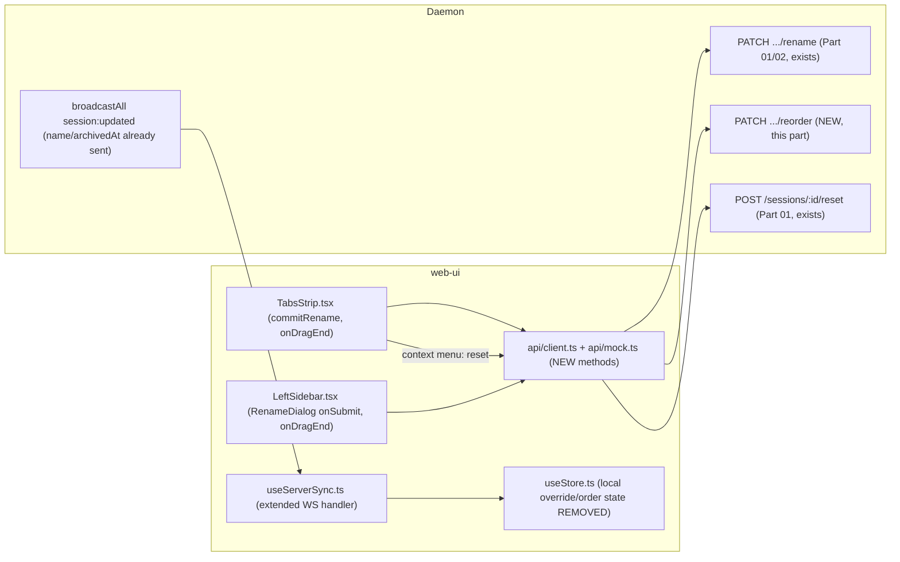

<!--
RULES — read before writing or implementing:
1. FORMAT: Bullets, tables, code, diagrams ONLY — no prose paragraphs
2. REQUIREMENTS: One crisp line each — no verbose descriptions
3. CHECKLIST: Mark items [x] as you complete them — this is your persistent todo list
4. READING TIME: Optimize for fast human scanning — if it's hard to skim, rewrite it
-->

# Plan: UI layer — wire rename/drag-reorder/reset prototype to real endpoints

> Replace the existing frontend-only (local/optimistic) rename + drag-reorder prototype with real calls to the Part 01/02 daemon endpoints, plus a small daemon addition for persisting drag order.

**Issue:** sqlite-agent-naming
**Branch:** `sqlite-agent-naming`
**Status:** Pending
**PRD:** none — see `../arch-sqlite-agent-naming.md` and `.feature-plans/sqlite_agent_naming_plan.md`
**Parent:** `../arch-sqlite-agent-naming.md`

**Reference files:**
- Prototype (frontend-only, local state): `web-ui/src/components/layout/TabsStrip.tsx`, `LeftSidebar.tsx`, `web-ui/src/hooks/useStore.ts`, `web-ui/src/components/dialogs/RenameDialog.tsx` (commits `17755b6`, `9e15483`)
- API client/mock/types: `web-ui/src/api/client.ts`, `web-ui/src/api/mock.ts`, `web-ui/src/api/types.ts`
- WS reconciliation: `web-ui/src/hooks/useServerSync.ts`
- Pane mounting (remount-invariant): `web-ui/src/routes/Workspace.tsx`, `web-ui/src/components/layout/AgentPaneSlot.tsx`
- Existing confirm-dialog pattern: `web-ui/src/components/dialogs/ConfirmDialog.tsx`
- Daemon serialization: `daemon/src/routes/sessions.ts` (`serializeSession`), `daemon/src/routes/worktrees.ts` (`serializeWorktree`)
- Shipped Part 01/02 endpoints: rename (`PATCH .../rename`), reset (`POST /sessions/:id/reset`), handoff (`POST /sessions/:id/handoff`)

---

## Superseded

| Prior approach | Why it failed | Superseded on |
|-----------------|---------------|---------------|
| First draft of this plan | Opus review found: no tasks for the `api/client.ts`/`api/mock.ts` methods every daemon call actually goes through; Decision 2 claimed WS reconciliation works via `session:updated`, but that event type only carries `pinnedAt`/`channel` client-side (daemon broadcasts `name`/`archivedAt` too, but the client type + handler both drop them); Decision 2 targeted the wrong component (`RenameDialog.tsx` is presentational only — the real writes are `TabsStrip.tsx`'s inline `commitRename` and `LeftSidebar.tsx`'s `onSubmit` handler); `Session`/`Worktree` types were missing `archivedAt`/`name` respectively; Decision 3's confirm-dialog and Decision 4's remount-invariant references pointed at speculative/wrong files when real ones (`ConfirmDialog.tsx`, `AgentPaneSlot.test.tsx`) already exist | this revision |

---

## Problem

- The rename + drag-reorder UI built in Part 03's prototype only persists to local zustand/localStorage — no server call at all
- `sortOrder` exists in the DB schema (Part 01) but is not yet exposed in the JSON API (`serializeSession`/`serializeWorktree` don't return it) — confirmed by reading both functions directly
- No endpoint exists yet to persist a `sortOrder` change — Part 01's plan explicitly scoped reorder-persistence to this part
- No API client/mock methods exist for rename/reorder/reset — every daemon call in this codebase goes through `web-ui/src/api/client.ts` (+ a mirror in `mock.ts`), and none of the needed methods exist there yet
- The WS `session:updated` event drops `name`/`archivedAt` client-side even though the daemon already broadcasts both — no live reconciliation is possible today
- Tab context menu has no "Reset (+handoff)" action wired to the real endpoint; no archived-session read-only UI state exists

## Out of Scope

- The rename/reset/handoff endpoints themselves — already shipped (Part 01/02)
- Retention policy for archived sessions, exact UI placement of archived-session history — both still explicitly open per arch § Risks, this plan picks a default and documents it as a judgment call (Decision 4)
- Cursor/OpenCode `/vst` — Part 02, already done

## Concept

- Expose `sortOrder` (and `nameSource`, `handoffSummary`, `archivedAt`, `Worktree.name`) fully through the JSON API AND the WS `session:updated`/`worktree:updated` event types
- Add `PATCH /sessions/:id/reorder` and `PATCH /worktrees/:id/reorder`, single-field, fractional-value updates
- Add the missing `api/client.ts` methods (+ `api/mock.ts` mirrors) for rename/reorder/reset/handoff
- Replace `useStore.ts`'s local `sessionNameOverrides`/`worktreeNameOverrides`/`sortOrders`/`applySortOrder` state with real API calls at their ACTUAL call sites (`TabsStrip.tsx`'s inline `commitRename`, `LeftSidebar.tsx`'s `RenameDialog` `onSubmit`, both strips' `onDragEnd`)
- Wire "Reset (+handoff)" and archived-session read-only state into the existing tab context menu, reusing the existing `ConfirmDialog` component

## Requirements

| # | Requirement |
|---|-------------|
| 1 | Drag-reordering a tab/row persists to the server and survives a full page reload from a DIFFERENT browser/profile (proves it's server-side, not just localStorage) |
| 2 | Renaming a tab (inline) or a worktree/session (via dialog) calls the real `PATCH .../rename` endpoint, not local state |
| 3 | "Reset" (with optional handoff) in the tab context menu calls the real `POST /sessions/:id/reset` |
| 4 | An archived session shows a disabled, read-only composer |
| 5 | TerminalPane-remount invariant still holds — verified by extending the EXISTING `AgentPaneSlot.test.tsx` remount-count harness, not a new test |
| 6 | A rename/reset/reorder made in one browser tab is reflected live in another, via WS `session:updated`/`worktree:updated` |

---

## Research

### `sortOrder`/`archivedAt`/`name` gaps — confirmed by reading the code directly

- **File:** `daemon/src/routes/sessions.ts:307-326` `serializeSession` — returns `id, worktreeId, projectId, isMain, type, modeId, name, label, tmuxName, useTmux, channel, state, lifecycleState, createdAt, pinnedAt, archivedAt` — **no `sortOrder`, no `nameSource`, no `handoffSummary`**
- **File:** `daemon/src/routes/worktrees.ts:119-136` `serializeWorktree` — returns `id, projectId, name, branch, baseBranch, baseSha, createdAt, pinnedAt, mainSessionId` — **no `sortOrder`**
- **File:** `web-ui/src/api/types.ts:24-43` `Worktree` — **has no `name` field at all**, even though `serializeWorktree` already returns it today
- **File:** `web-ui/src/api/types.ts:62-85` `Session` — **has no `archivedAt` field**, even though `serializeSession` already returns it today
- **Fix:** add `sortOrder` to both serializers/types; add `nameSource`, `handoffSummary` to `Session`/`serializeSession`; add the two ALREADY-RETURNED-BUT-UNTYPED fields (`Worktree.name`, `Session.archivedAt`) to their respective client interfaces

### WS reconciliation is broken today — confirmed, not assumed

- **File:** `web-ui/src/api/types.ts:275-289` — the `session:updated` event type carries only `sessionId, pinnedAt?, channel?` — no `name`, no `archivedAt`
- **File:** `web-ui/src/hooks/useServerSync.ts:132-145` — the handler builds `patch: Partial<Session>` from ONLY `channel`/`pinnedAt`, explicitly dropping anything else even if the wire payload had it
- **File:** `daemon/src/routes/sessions.ts:852` — the rename endpoint's `broadcastAll` DOES include `name`; `:1251` — reset's archive step DOES include `archivedAt` — **the daemon already sends what's needed, the client just discards it**
- **Fix:** extend `session:updated`'s type to include `name?: string | null`, `archivedAt?: string | null`; extend `useServerSync.ts`'s patch-building `if` chain to apply them when present. Same treatment needed for `worktree:updated` if worktree rename doesn't already reconcile live (check `worktree:updated`'s current type/handler analogously before assuming it needs the same fix)

### No reorder-persistence endpoint exists — confirmed

- Grep for `reorder` across `daemon/src/routes/*.ts` returns nothing; `types.ts:185,262` (approximate — re-check exact lines at implementation time) only have comments deferring this to Part 03
- **Fix:** add `PATCH /sessions/:id/reorder { sortOrder: number }` and `PATCH /worktrees/:id/reorder { sortOrder: number }`, mirroring the existing rename endpoints' shape/`mutateProject` pattern exactly (`mutateProject(id, fn): Promise<ProjectRecord>`, confirmed signature from Part 01)

### API client pattern — every daemon call goes through here, confirmed real methods missing

- **File:** `web-ui/src/api/client.ts:249-257` `hideProject(id)` — canonical shape: `apiFetch(\`${baseUrl()}/projects/${encodeURIComponent(id)}\`, { method: "PATCH", headers: {"Content-Type":"application/json"}, body: JSON.stringify({...}) })` then `parseJson<T>(res)`
- **File:** `web-ui/src/api/mock.ts` — mirrors every `client.ts` method for the mock/demo mode; has its own `mock.test.ts`. New methods MUST be added here too or component tests using the mock API (the normal test setup) will fail to find them
- **Fix:** add `renameSession`, `renameWorktree`, `reorderSession`, `reorderWorktree`, `resetSession`, `handoffSession` to BOTH `client.ts` and `mock.ts`, following `hideProject`'s exact shape

### Existing prototype's local-state shape AND its real call sites (to be replaced, not the wrong component)

- **File:** `web-ui/src/hooks/useStore.ts:122,124,138` — `sessionNameOverrides: Record<string, string>`, `worktreeNameOverrides: Record<string, string>`, `sortOrders: Record<string, string[]>` (ordered array of ids per scope, not numeric)
- **File:** `web-ui/src/hooks/useStore.ts:150` `applySortOrder(order, liveIds): string[]` — merge helper
- **File:** `web-ui/src/hooks/useStore.ts:389,393,397` — the three setter definitions
- **File:** `web-ui/src/hooks/useStore.ts:541-543` — these three keys are ALSO persisted via zustand's `partialize` — removing the state without removing this too leaves stale data in localStorage
- **REAL call site 1 — inline tab rename:** `web-ui/src/components/layout/TabsStrip.tsx:129-153` — `commitRename()` reads `renameValue`, and **only calls `setSessionNameOverride` if `trimmed` is non-empty** (`if (trimmed) setSessionNameOverride(...)`) — this silently NO-OPS on an empty submission today, which conflicts with the real endpoint's "empty string clears to null" contract (Decision 2 must change this behavior, not just swap the call)
- **REAL call site 2 — dialog rename:** `web-ui/src/components/layout/LeftSidebar.tsx:1274-1279` — `RenameDialog`'s `onSubmit` handler calls `setWorktreeNameOverride(renameTarget.worktree.id, name)` or `setSessionNameOverride(renameTarget.session.id, name)` depending on `renameTarget.kind`
- **`RenameDialog.tsx` itself is purely presentational** (`{open, title, currentName, onCancel, onSubmit}`, no store access) — do NOT modify it for the API wiring, only its two callers above
- **Risk:** MEDIUM — the prototype's "ordered array of ids" representation must be bridged to the server's "numeric fractional `sortOrder` per row" representation (Decision 1)

### TerminalPane-remount invariant — real mounting location and real test harness

- **File:** `web-ui/src/routes/Workspace.tsx:185,203` — panes mount via `AgentPaneSlot`, driven by `activeSessionId`; confirmed NEITHER `TabsStrip.tsx` nor `LeftSidebar.tsx` renders a pane directly — both only set `activeSessionId`, and reordering is a `.map()` re-sort keyed by `s.id` (`TabsStrip.tsx:169-178`) — invariant genuinely holds today
- **File:** `web-ui/src/components/layout/AgentPaneSlot.test.tsx:7-36,82` — this is the EXISTING remount-count test harness. Extend this file for the reorder-doesn't-remount regression test, do not create a new one in `TabsStrip.test.tsx`

### Existing confirm-dialog pattern — reuse, don't grep-and-guess

- **File:** `web-ui/src/components/dialogs/ConfirmDialog.tsx` — `{open, title, message, confirmLabel?, onConfirm, onCancel, confirmDisabled?}`, has its own `ConfirmDialog.test.tsx`
- **File:** `web-ui/src/components/layout/TabsStrip.tsx:120` — `closeTarget` state is the EXISTING pattern for "confirm before a destructive tab action" (used for tab close) — mirror this exact pattern with a new `resetTarget` state for Decision 3, don't invent a new confirmation mechanism

---

## Root Cause

- The prototype (built before Part 01/02 shipped their endpoints) was deliberately scoped to local-only state so interaction/UX could be tested before the backend existed — this part is exactly the planned follow-up, not a bug fix

---

## Architecture Diagram



---

## Design Details

### System Boundaries

| Boundary | Fields + types | Errors | Source of truth |
|----------|----------------|--------|-----------------|
| web-ui ↔ Daemon (reorder, NEW) | `PATCH /sessions/:id/reorder { sortOrder: number }` → `{ ok: true, sortOrder: number }`; same shape for `/worktrees/:id/reorder` | `400` (non-finite number), `404` | Daemon (`sortOrder` column, Part 01) |
| web-ui ↔ Daemon (rename, existing) | unchanged from Part 01/02 | unchanged | Daemon |
| web-ui ↔ Daemon (reset, existing) | unchanged from Part 01 | unchanged | Daemon |
| Daemon → web-ui (WS, extended) | `session:updated` gains `name?: string \| null`, `archivedAt?: string \| null` | N/A | Daemon (already sends these on the wire — client-side type/handler catch up) |

### Critical User Journeys (CUJs)

#### CUJ 1 — Drag a tab to reorder, persists across browsers

```
User drags Tab B to sit before Tab A in the tab strip
  → dnd-kit onDragEnd fires with the new local order [B, A, C, ...]
  → client computes B's new sortOrder = midpoint(A's current sortOrder, whatever
    came before A — or A's sortOrder - 1 if B is now first), reading REAL
    sortOrder values from already-fetched session data (Research fix), not
    the removed local sortOrders array
  → optimistic local update: apply the new order immediately (UI feels instant)
  → api.reorderSession(B.id, { sortOrder: <computed value> })
  → on success: no-op (already applied optimistically)
  → on failure: revert to the last known-good order, show a toast
User opens the SAME worktree in a different browser profile
  → GET /sessions returns sortOrder-annotated results, client sorts by it → same order appears
```

- Edge case: two clients drag concurrently → last-write-wins on `sortOrder`, no conflict resolution needed (cosmetic ordering, not correctness-critical)
- Edge case: fractional values eventually get very close together after many reorders in the same spot — out of scope for this part (rebalance-the-whole-scope is a future concern, not blocking)

#### CUJ 2 — Reset with handoff from the tab context menu

```
User right-clicks a tab → "Reset (with handoff)"
  → sets resetTarget state (mirrors closeTarget's existing pattern, TabsStrip.tsx:120)
  → ConfirmDialog opens ("This will end the current chat...")
  → on confirm: api.resetSession(id, { handoff: true })
  → daemon archives + respawns (Part 01)
  → WS session:updated (archivedAt set, now reconciled per the Research fix)
    + session:created (new session) arrive
  → old tab becomes read-only (Decision 4); new tab appears in the same position
```

#### CUJ 3 — Viewing an archived session

```
User clicks an archived session's tab/row
  → composer is disabled, shows "This session has been archived. Start a new
    agent to continue." (exact copy from the original F5 mockup)
  → if handoffSummary is present, show it (read-only) — exact placement is Decision 4
```

### API Contracts

```
PATCH /sessions/:id/reorder   (NEW)
  Request:  { sortOrder: number }
  Response: { ok: true, sortOrder: number }
  Errors:   400 (non-finite number), 404 NOT_FOUND

PATCH /worktrees/:id/reorder   (NEW)
  Request:  { sortOrder: number }
  Response: { ok: true, sortOrder: number }
  Errors:   400 (non-finite number), 404 NOT_FOUND
```

### Key Decisions

#### Decision 1: Client computes the fractional `sortOrder` value; server just persists a single number

- **Decision:** no whole-list reorder endpoint. On drag-end, the client reads the CURRENT `sortOrder` of the two rows now adjacent to the moved item (from already-fetched session/worktree data) and computes the moved item's new value as the midpoint (or ±1 if at an edge), then calls the new `api.reorderSession`/`api.reorderWorktree`
- **Rationale:** matches the "fractional/rank-based sortOrder" decision already locked in Part 01's schema; avoids a transactional whole-list update endpoint
- **Where:** new client-side helper in `web-ui/src/hooks/useStore.ts` (replacing `sortOrders`/`applySortOrder`)

```typescript
// web-ui/src/hooks/useStore.ts (replaces the sortOrders/applySortOrder local state)
function computeNewSortOrder(prevSortOrder: number | undefined, nextSortOrder: number | undefined): number {
  if (prevSortOrder == null && nextSortOrder == null) return 0; // only item in the scope
  if (prevSortOrder == null) return nextSortOrder! - 1;          // now first
  if (nextSortOrder == null) return prevSortOrder + 1;           // now last
  return (prevSortOrder + nextSortOrder) / 2;                    // between two neighbors
}
```

- **Tie-breaker note:** live session/worktree creation assigns `sortOrder: Date.now()` (`routes/sessions.ts:487,622`, `routes/projects.ts:671`) — two rows created in the same millisecond collide, and a midpoint between two equal values returns that same value, so a drag between them would silently no-op. Not fixed in this part (rare in practice, cosmetic ordering only) — if it turns out to matter, break ties by nudging with a tiny epsilon rather than a full rebalance.

- Sessions/worktrees are simply sorted by their real `sortOrder` field on render once this ships — remove `sortOrders`/`applySortOrder`/`sessionNameOverrides`/`worktreeNameOverrides` from `useStore.ts` (state definition AND the `partialize` list at `:541-543`) rather than keeping both representations alive
- **Exception — pinned sections don't get real drag-reorder in this part.** `LeftSidebar.tsx:271,278` reorder `sortOrders["pinned-worktrees"]`/`["pinned-direct"]`, which are CROSS-PROJECT lists (`:217-239`). Part 01's `sortOrder` column is scoped per-worktree/per-project (`state/project-store.ts:56-65`) — it cannot express a cross-project manual order without a new column, which would mean reopening Part 01's already-shipped schema. **Scope decision: pinned sections keep their existing pin-recency (`pinnedAt`) ordering** (unaffected by this part, already shipped), and lose the prototype's manual-drag-order capability specifically within the pinned sub-lists. Regular (unpinned) per-worktree/per-project lists get full real drag-reorder as designed above. A future pass could add a dedicated global `pinnedSortOrder` column if manual pinned-ordering turns out to matter — not this part.

#### Decision 2: Rename goes through the real endpoint, AT THE REAL CALL SITES, with corrected empty-string handling

- **Decision:** fix `TabsStrip.tsx:129-153`'s `commitRename()` to call `api.renameSession(id, { name: trimmed })` UNCONDITIONALLY (removing the `if (trimmed)` guard that currently silently drops empty submissions) so an empty submission correctly clears to `null` server-side, matching the endpoint's contract; fix `LeftSidebar.tsx:1274-1279`'s `onSubmit` handler to call `api.renameWorktree`/`api.renameSession` instead of the local override setters
- **Rationale:** `RenameDialog.tsx` itself needs no changes — it's presentational and already calls `onSubmit(name)` with whatever the user typed (including empty string, per its own `MAX_LEN`/trim handling — verify this at implementation time); the bug is purely in what the two CALLERS do with that value
- **Where:** `TabsStrip.tsx:129-153`, `LeftSidebar.tsx:1274-1279`

#### Decision 3: Reset requires confirmation, reusing the EXISTING `ConfirmDialog` + `closeTarget`-style pattern

- **Decision:** add a `resetTarget: Session | null` state to `TabsStrip.tsx`, mirroring `closeTarget`'s existing pattern (`:120`) exactly; render the existing `ConfirmDialog` component (not a new one) with reset-specific copy
- **Rationale:** an existing, tested confirm-dialog component and an existing "destructive tab action" state pattern both already exist — build on them, don't invent parallel machinery
- **Where:** `TabsStrip.tsx`, new `resetTarget` state + `<ConfirmDialog>` usage alongside the existing `closeTarget`/close-confirm rendering

#### Decision 4: Archived sessions render as a greyed-out row in place, not a separate history section

- **Decision:** an archived session keeps its exact tab/sidebar position (via `sortOrder`, unchanged by archiving), rendered with a visually distinct (greyed/dimmed) style and a small "archived" badge, rather than moving to a separate collapsed history section
- **Rationale:** simplest given the existing tab-strip/sidebar-row rendering already iterates a flat sorted list; a separate history section needs a second rendering path and a layout decision — deferred, not needed for v1
- **Where:** `TabsStrip.tsx`/`LeftSidebar.tsx` row rendering — add an `archivedAt != null` visual branch (now readable once `Session.archivedAt` is typed, per Research)
- **Explicitly a judgment call** on a previously-open question (arch § Risks #1) — revisit if this doesn't feel right in practice

---

## Risks / Open Questions

| # | Question | Notes |
|---|----------|-------|
| 1 | Retention policy for archived sessions | Still not enforced — out of scope, arch § Risks #2 unchanged |
| 2 | Fractional `sortOrder` drift / tie collisions (same-millisecond creates) after many reorders | Accepted for v1 — a future rebalance/epsilon-nudge pass, not this part |
| 3 | Manual drag-reorder within pinned sections | Explicitly descoped this part (Decision 1 exception) — pinned sections keep pin-recency ordering; would need a new cross-project column to support manual order |

---

## Implementation Phases

---

### Phase 1 — Daemon + API layer: expose fields, add reorder endpoints, fix WS reconciliation

- [x] **1.1** Add `sortOrder` to `serializeSession` (`daemon/src/routes/sessions.ts:307-326`) and `serializeWorktree` (`daemon/src/routes/worktrees.ts:119-136`); add `nameSource`, `handoffSummary` to `serializeSession`
- [x] **1.2** Add `sortOrder`, `nameSource`, `handoffSummary`, `archivedAt` to `web-ui/src/api/types.ts`'s `Session` interface (`:62-85`); add `sortOrder`, `name` to `Worktree` (`:24-43`) — note `name` is ALREADY returned by the server today and simply untyped client-side
- [x] **1.3** Extend `session:updated`'s WS event type (`types.ts:275-289`) with `name?: string | null`, `archivedAt?: string | null`; extend `useServerSync.ts:132-145`'s patch-building to apply them when present. `worktree:updated` does NOT have this bug (Risk #3, resolved) — it already carries the whole `Worktree` object (`types.ts:373-375`, handler `useServerSync.ts:102-104`) and self-fixes once `Worktree.name` is typed in 1.2 — no separate fix needed there
- [x] **1.4** Add `PATCH /sessions/:id/reorder` and `PATCH /worktrees/:id/reorder` — mirror the existing rename endpoints' validation/`mutateProject` pattern exactly, `sortOrder: z.number()` (plain — matches this codebase's existing zod style at `sessions.ts:821`; `.finite()` is a no-op in the zod version this repo uses, `z.number()` already rejects `NaN`/`Infinity`)
- [x] **1.5** Add `renameSession`, `renameWorktree`, `reorderSession`, `reorderWorktree`, `resetSession`, `handoffSession` methods to BOTH `web-ui/src/api/client.ts` and `web-ui/src/api/mock.ts`, following `client.ts:249-257`'s `hideProject` shape exactly

**Verify phase 1:**
- [x] **1.T1** Integration — `GET /sessions`/`GET /worktrees` responses include `sortOrder` (and `nameSource`/`handoffSummary` for sessions)
- [x] **1.T2** Unit — `PATCH /sessions/:id/reorder` with a non-finite number (`NaN`, `Infinity`) → `400`
- [x] **1.T3** Integration — `PATCH /sessions/:id/reorder {sortOrder: 5}` then `GET /sessions` shows the new value persisted
- [x] **1.T4** Unit — `useServerSync.test.ts` (extend existing if present): a `session:updated` event carrying `name`/`archivedAt` updates the client-side `Session` accordingly
- [x] **1.T5** Unit — `mock.test.ts`: new mock methods exist and behave consistently with `client.ts`'s real ones (same success/shape contract)

---

### Phase 2 — Frontend: rename + reorder wired to real endpoints

- [x] **2.1** Remove `sessionNameOverrides`/`worktreeNameOverrides`/`applySortOrder` from `useStore.ts`, INCLUDING their entries in the `partialize` list at `:541-543`. For `sortOrders`: remove ONLY the non-pinned scope keys' usage — the `"pinned-worktrees"`/`"pinned-direct"` scopes stay as-is (Decision 1 exception), so `sortOrders` itself and its pinned-scope call sites (`LeftSidebar.tsx:271,278`) are NOT removed, only no longer used for the per-worktree/per-project scopes this phase converts
- [x] **2.2** Implement `computeNewSortOrder()` per Decision 1, wire into `TabsStrip.tsx`'s and `LeftSidebar.tsx`'s `onDragEnd` handlers for NON-pinned scopes only, calling the new `api.reorderSession`/`api.reorderWorktree`; pinned-scope drag handlers keep using the existing local `sortOrders` mechanism unchanged
- [x] **2.3** Fix `TabsStrip.tsx:129-153`'s `commitRename()` and `LeftSidebar.tsx:1274-1279`'s `onSubmit` per Decision 2 — real endpoint calls, corrected empty-string handling
- [x] **2.4** Re-verify the TerminalPane-remount invariant holds after 2.1/2.2 by extending `AgentPaneSlot.test.tsx` (Research) — do not just trust the prior commit's code comment

**Verify phase 2:**
- [x] **2.T1** Component — dragging a tab in `TabsStrip.test.tsx` calls the mocked `reorderSession` with the correct computed `sortOrder`, not a local-only state update
- [x] **2.T2** Component — inline tab rename (`commitRename`) with an EMPTY submission calls `renameSession` with `{name: ""}` and the UI reflects the resulting `null` (default label), not a silent no-op; `LeftSidebar`'s dialog rename calls the real endpoint too
- [x] **2.T3** Regression — extend `AgentPaneSlot.test.tsx`'s existing remount-count harness: dragging a tab to reorder does not increment the pane's mount count
- [x] **2.T4** Integration — reordering in one browser tab, then loading `GET /sessions` fresh (simulating a different browser/profile) shows the persisted order

---

### Phase 3 — Frontend: reset + archived-session UI

- [x] **3.1** Add "Reset" / "Reset with handoff" to the tab context menu; add `resetTarget` state to `TabsStrip.tsx` mirroring `closeTarget` (`:120`); render the existing `ConfirmDialog` with reset-specific copy per Decision 3
- [x] **3.2** Add the archived-session read-only composer state (exact copy from the original F5 mockup: "This session has been archived. Start a new agent to continue."), now that `Session.archivedAt` is typed (Phase 1)
- [x] **3.3** Add the greyed-out/badge visual treatment for archived rows per Decision 4

**Verify phase 3:**
- [x] **3.T1** Component — clicking "Reset" shows the `ConfirmDialog`, and only calls `resetSession` after confirming
- [x] **3.T2** Component — an archived session's composer renders disabled with the exact expected copy
- [x] **3.T3** Integration — after a real `POST /sessions/:id/reset` (against a test daemon, or mocked WS events per the Phase 1 fix), the old tab shows archived styling and the new tab appears live (no manual refresh needed)

---

## Files & Phase Impact

| File | Status | Phase | Description / Contract Change |
|------|--------|-------|-------------------------------|
| `daemon/src/routes/sessions.ts` | **Modified** | 1.1, 1.4 | `serializeSession` gains fields; new `PATCH /sessions/:id/reorder` |
| `daemon/src/routes/worktrees.ts` | **Modified** | 1.1, 1.4 | `serializeWorktree` gains `sortOrder`; new `PATCH /worktrees/:id/reorder` |
| `web-ui/src/api/types.ts` | **Modified** | 1.2, 1.3 | New fields on `Session`/`Worktree`; extended `session:updated` (and `worktree:updated` if Risk #3 applies) |
| `web-ui/src/hooks/useServerSync.ts` | **Modified** | 1.3 | Apply `name`/`archivedAt` from `session:updated` |
| `web-ui/src/api/client.ts` | **Modified** | 1.5 | New rename/reorder/reset/handoff methods |
| `web-ui/src/api/mock.ts` | **Modified** | 1.5 | Mirror the new methods |
| `web-ui/src/hooks/useStore.ts` | **Modified** | 2.1, 2.2 | Remove local-only override/order state (incl. `partialize`); add `computeNewSortOrder` |
| `web-ui/src/components/layout/TabsStrip.tsx` | **Modified** | 2.2, 2.3, 2.4, 3.1, 3.3 | Real reorder/rename calls, `resetTarget` + `ConfirmDialog`, archived styling |
| `web-ui/src/components/layout/LeftSidebar.tsx` | **Modified** | 2.2, 2.3, 3.3 | Real reorder/rename calls, archived styling |
| `daemon/src/__tests__/sessions.reorder.test.ts`, `worktrees.reorder.test.ts` | **New** | 1.T1-1.T3 | Reorder endpoint tests |
| `web-ui/src/hooks/useServerSync.test.ts` | **New/Modified** | 1.T4 | WS reconciliation tests |
| `web-ui/src/api/mock.test.ts` | **Modified** | 1.T5 | New mock method tests |
| `web-ui/src/components/layout/TabsStrip.test.tsx`, `LeftSidebar.test.tsx` | **Modified** | 2.T1, 2.T2 | Real-endpoint reorder/rename tests |
| `web-ui/src/components/layout/AgentPaneSlot.test.tsx` | **Modified** | 2.T3 | Extend existing remount-count harness |
| `web-ui/src/components/layout/TabsStrip.reset.test.tsx` (or extend `TabsStrip.test.tsx`) | **New/Modified** | 3.T1-3.T3 | Reset + archived-state tests |
