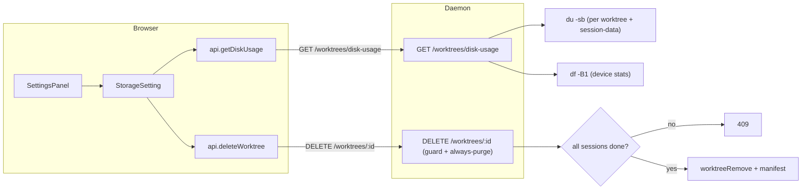

<!--
RULES — read before writing or implementing:
1. FORMAT: Bullets, tables, code, diagrams ONLY — no prose paragraphs
2. REQUIREMENTS: One crisp line each — no verbose descriptions
3. CHECKLIST: Mark items [x] as you complete them — this is your persistent todo list
4. READING TIME: Optimize for fast human scanning — if it's hard to skim, rewrite it
-->

## Problem & Concept

- Settings panel (desktop) renders ALL sections stacked in one scrollable column — adding Storage would produce an unusably tall dump
- No way to see how much disk each worktree uses or delete stale ones from the UI
- "Dismiss (keep files)" leaves orphaned git checkouts with no re-import path — a confusing half-deleted state
- DELETE /worktrees/:id has no guard: any worktree can be deleted regardless of session lifecycle state

Success state:
- Desktop settings nav is a true section-switcher (one section at a time, active pill highlight)
- Settings → Storage shows device disk bar + filterable/sortable worktree list with per-row disk usage + multi-select delete
- Dismiss is removed from all surfaces; DELETE always purges and rejects non-done worktrees with 409

---

## Requirements

| # | Requirement |
|---|-------------|
| R1 | Desktop SettingsPanel nav switches sections (one at a time); active item gets filled pill |
| R2 | Mobile SettingsPanel is unchanged (already tab-based) |
| R3 | DELETE /worktrees/:id always purges (no `?purge` param); rejects with 409 if any session ≠ `done` |
| R4 | `dismissWorktree()` removed from client, mock, and all UI call sites |
| R5 | GET /api/worktrees/disk-usage returns per-worktree diskBytes + device used/total/available |
| R6 | StorageSetting shows device disk bar, worktree list defaulting to filter=done, sort=creation-date-desc |
| R7 | Checkboxes and delete icons enabled only for worktrees where ALL sessions are lifecycle=done |
| R8 | Multi-select bulk delete with confirmation dialog listing names + sizes + total freed |
| R9 | Filter dropdown: Done (default) / All; Sort dropdown: Creation date ↓ / Disk usage ↓ |
| R10 | Confirmation dialog shows inline error banner on mid-flight 409 from daemon guard |

---

## Change Map

```
daemon/src/routes/
  worktrees.ts              ~ remove purge branch; add done guard; add disk-usage route
web-ui/src/api/
  client.ts                 ~ remove dismissWorktree; add getDiskUsage
  mock.ts                   ~ remove dismissWorktree mock; add getDiskUsage mock
web-ui/src/components/
  settings/
    SettingsPanel.tsx        ~ desktop: section-switcher (no scroll refs)
    StorageSetting.tsx       + new Storage section component
  layout/
    DashboardPanel.tsx       ~ remove dismiss button, pendingDismiss state, dismiss ConfirmDialog
    LeftSidebar.tsx          ~ remove dismiss context menu item, pendingDismiss, confirmDismissWorktree
```

| Today | After this plan |
|-------|-----------------|
| Desktop settings nav scrolls to anchored section cards | Desktop nav switches sections; only active section renders |
| DELETE /worktrees/:id?purge=true deletes, no purge = dismiss (keep files) | DELETE always purges; 409 if any session not done |
| Dismiss (keep files) affordance on dashboard card and sidebar context menu | Dismiss removed from all surfaces |
| No disk usage data exposed by daemon | GET /api/worktrees/disk-usage returns per-worktree bytes + device stats |
| No Storage settings section | Settings → Storage shows disk bar + filterable/deletable worktree list |

---

## Research

- `SettingsPanel.tsx:58-60` — `scrollTo` calls `ref.current?.scrollIntoView` on desktop; `activeTab` state already exists but only drives the mobile branch (line 63). The desktop branch never reads `activeTab`.
- `SettingsPanel.tsx:179-201` — desktop nav buttons call `scrollTo(section.ref)`, not `setActiveTab`. The fix is wiring these buttons to `setActiveTab` and collapsing the dual-branch into one render path.
- `client.ts:328-343` — `deleteWorktree` appends `?purge=true`; `dismissWorktree` omits it. Delete both; keep only `deleteWorktree`.
- `mock.ts:416-423` — `dismissWorktree` mock removes from in-memory arrays.
- `DashboardPanel.tsx:83,218,244,262-273,441-466` — `pendingDismiss` state, `showDismiss` flag, EyeOff icon button, ConfirmDialog for dismiss.
- `LeftSidebar.tsx:609,765-776,1859-1870,1990-1997` — `pendingDismiss` state, `confirmDismissWorktree()`, two ConfirmDialogs, context-menu item "Dismiss (keep files)".
- `worktrees.ts:859-909` — DELETE handler: `shouldPurge = purge === "true" || purge === "1"`; guard to add: check all `worktree.sessions` have `lifecycle.state === "done"`.
- `paths.ts:63-65` — `worktreePath(projectId, worktreeId)` → `~/.vibe-station/projects/<pid>/worktrees/<wid>` (git checkout).
- `paths.ts:88` — `sessionDataDir(projectId, worktreeId, sessionId)` → `~/.vibe-station/projects/<pid>/session-data/<wid>/<sid>`.
- `WorktreeRecord` (`types.ts:384`) has `createdAt: string` (ISO8601) — available for sort.
- `LifecycleState` (`types.ts:8-14`): `"not_started" | "working" | "idle" | "waiting_for_human" | "done" | "exited"` — guard checks ALL sessions have `"done"`.
- Device disk: `df -B1 <path>` gives bytes; `du -sb <path>` gives apparent size per directory.

---

## Architecture Diagram



---

## Design Details

### Critical User Journeys

**Happy path — delete a done worktree from Storage settings:**
```
User opens Settings → clicks Storage in nav
  → StorageSetting renders with filter=Done, sort=creation-date-desc
  → Device disk bar shows used/total/available
  → Worktree list shows only done worktrees with per-row disk bar
  → User checks one or more rows → "Delete selected" button activates
  → Confirmation dialog lists worktrees + sizes + total freed
  → User confirms → DELETE /worktrees/:id per selected worktree
  → Daemon checks all sessions done → purges checkout + manifest
  → UI removes rows, disk bar refreshes
```

**Error path — worktree no longer done at confirm time:**
```
User selects done worktree → opens confirm dialog
  → Meanwhile a sibling session starts (lifecycle → working)
  → User clicks Delete
  → Daemon returns 409 { error: "worktree_not_done", sessions: [...] }
  → Confirm dialog replaces button row with:
      "! <branch> is no longer done — deletion cancelled."
      [Close]
```

**Error path — filter=Done with no done worktrees:**
```
User opens Storage
  → All worktrees are active
  → List empty, hint: "No done worktrees. Switch to All to see active ones."
```

---

### API Contracts

#### GET /api/worktrees/disk-usage

New endpoint. No auth change (same session-cookie auth as other routes).

```
GET /api/worktrees/disk-usage

200 {
  device: {
    usedBytes: number,      // df: Used column
    totalBytes: number,     // df: 1K-blocks * 1024
    availableBytes: number, // df: Avail column
    mountPoint: string      // df: Mounted on
  },
  worktrees: [
    {
      id: string,           // WorktreeRecord.id
      diskBytes: number     // du -sb checkout + du -sb session-data/<id>, summed
    }
  ]
}

500 { error: "disk_usage_failed", details: string }
```

- `diskBytes` is apparent size (du -sb), not actual — matches user expectation
- Runs du/df in parallel per worktree via `Promise.all`; individual failures return 0 for that worktree
- Device stats from `df -B1` on `$VST_DATA_DIR` (the partition vst data lives on)

#### DELETE /worktrees/:id (modified)

```
DELETE /worktrees/:id
  (no longer reads ?purge — always purges)

200 { ok: true }
409 { error: "worktree_not_done", sessions: ["<id>", ...] }
404 { error: "Worktree '<id>' not found" }
```

- `?purge` query param is ignored (never read); backward-compat: existing callers that sent `?purge=true` still get a 200

---

### Key Decisions

#### Decision 1: Always-purge on DELETE
- **Decision:** remove the `shouldPurge` branch; `worktreeRemove()` is called unconditionally
- **Rationale:** dismiss (keep files) is removed; the only remaining caller (`client.ts:deleteWorktree`) always sent `?purge=true` anyway; backward compat: param still accepted but ignored
- **Where:** `daemon/src/routes/worktrees.ts:862-890`

#### Decision 2: done guard checks ALL sessions
- **Decision:** `worktree.sessions.every(s => s.lifecycle.state === "done")` must be true; exited does NOT satisfy the guard
- **Rationale:** `exited` means the agent crashed or was killed, not that the user marked work done — PRD is explicit that only `done` is deletable
- **Where:** `daemon/src/routes/worktrees.ts` (new check before releaseSessionRuntime loop)

#### Decision 3: Disk usage computed server-side per request
- **Decision:** no caching; fresh `du`/`df` on each GET /worktrees/disk-usage call
- **Rationale:** worktrees rarely change size between opens; complexity of cache invalidation outweighs benefit; `du` on typical worktree dirs completes in <200 ms
- **Where:** `daemon/src/routes/worktrees.ts` (new route)

#### Decision 4: Settings desktop → single `activeSection` state, no refs
- **Decision:** remove all `useRef` / `scrollIntoView` from desktop path; reuse existing `activeTab` state for both mobile and desktop; render only `sections.find(s => s.id === activeSection).content`
- **Rationale:** PRD §0 — mobile already works this way; unifying removes the dual-branch entirely; Storage needs full panel height, not a card in a scroll
- **Where:** `web-ui/src/components/settings/SettingsPanel.tsx:22-241`

#### Decision 5: Disk usage fetched once on StorageSetting mount; refresh after delete
- **Decision:** single `useEffect` on mount; after a successful delete, re-fetch disk-usage
- **Rationale:** avoids stale disk bar after deletion; no need for polling
- **Where:** `web-ui/src/components/settings/StorageSetting.tsx`

---

## Risks / Open Questions

| # | Question | Notes |
|---|----------|-------|
| 1 | `du -sb` on a large worktree with git history could take >200 ms | Mitigation: run all worktrees in parallel via Promise.all; acceptable for a settings screen |
| 2 | Which partition for device disk bar? | Use `$VST_DATA_DIR` partition — that's where the checkouts live |
| 3 | `exited` sessions — should they block deletion? | Decision 2: yes, only `done` passes. A crashed agent should be retried or manually marked done |

---

## Implementation Phases

### Phase 1 — Remove dismiss + add done guard (daemon + UI cleanup)

- [ ] **1.1** `daemon/src/routes/worktrees.ts` — add done guard before `releaseSessionRuntime` loop: if any session `lifecycle.state !== "done"`, return `reply.status(409).send({ error: "worktree_not_done", sessions: [...non-done ids] })`
- [ ] **1.2** `daemon/src/routes/worktrees.ts` — remove `const { purge } = req.query` and `shouldPurge` variable; call `worktreeRemove()` unconditionally (inside existing try/catch)
- [ ] **1.3** `web-ui/src/api/client.ts` — delete `dismissWorktree()` method (lines 337-343)
- [ ] **1.4** `web-ui/src/api/mock.ts` — delete `dismissWorktree()` mock (lines 416-423)
- [ ] **1.5** `web-ui/src/components/layout/DashboardPanel.tsx` — remove `pendingDismiss` state (line 83), `showDismiss` (line 218), `dashboard-card-shell--dismissable` class (line 244), EyeOff button (lines 262-273), dismiss ConfirmDialog (lines 441-466)
- [ ] **1.6** `web-ui/src/components/layout/LeftSidebar.tsx` — remove `pendingDismiss` state (line 609), `confirmDismissWorktree()` (lines 765-776), dismiss ConfirmDialogs (lines 1859-1870), context-menu item "Dismiss (keep files)" (lines 1990-1997)
- [ ] **1.7** Remove any CSS classes introduced solely for dismiss affordance (e.g. `dashboard-card-shell--dismissable` in the stylesheet)

**Verify phase 1:**
- [ ] **1.T1** Manual — open Dashboard: no EyeOff / dismiss button on any done card
- [ ] **1.T2** Manual — open LeftSidebar worktree context menu: no "Dismiss (keep files)" item
- [ ] **1.T3** Integration — `DELETE /worktrees/:id` (no purge param) on a done worktree: returns 200 and removes the worktree from the list
- [ ] **1.T4** Integration — `DELETE /worktrees/:id` on a working worktree: returns 409 `{ error: "worktree_not_done" }`
- [ ] **1.T5** Regression — `DELETE /worktrees/:id?purge=true` on a done worktree: still returns 200 (param ignored, not rejected)
- [ ] **1.T6** Regression — TypeScript build: `npm run build` (or `tsc --noEmit`) in `web-ui/` passes with no errors referencing `dismissWorktree`

### Phase 2 — Settings desktop section-switcher

- [ ] **2.1** `SettingsPanel.tsx` — remove the three worktree `useRef` hooks (`modesRef`, `appearanceRef`, `projectsRef`, `hiddenProjectsRef`) and the `scrollTo` callback (lines 23-26, 29, 58-60)
- [ ] **2.2** `SettingsPanel.tsx` — remove `ref` field from the `Section` interface (line 13) and from every `sections` array entry (lines 31-56)
- [ ] **2.3** `SettingsPanel.tsx` — unify mobile and desktop behind a single `activeTab` state: both branches read `sections.find(s => s.id === activeTab)`; remove the `if (isMobile)` hard split
- [ ] **2.4** `SettingsPanel.tsx` desktop nav — wire each nav button to `setActiveTab(section.id)` instead of `scrollTo(section.ref)`; add active-state styling: when `activeTab === section.id`, apply background pill (e.g. `background: "var(--bg-hover)"`, `borderRadius: "var(--radius-sm)"`, `fontWeight: "var(--font-weight-medium)"`)
- [ ] **2.5** `SettingsPanel.tsx` desktop content area — render only `sections.find(s => s.id === activeTab)?.content`; remove the `sections.map(...)` scroll loop (lines 207-238); remove `id`, `ref`, and `scrollMarginTop` from the content wrapper; remove the section-label caption (lines 212-222) — the section title is now in the nav
- [ ] **2.6** Add `Storage` to the `sections` array (placeholder content `<div>Storage coming soon</div>` — replaced in Phase 4)

**Verify phase 2:**
- [ ] **2.T1** Manual — open Settings desktop: clicking each nav item shows only that section's content
- [ ] **2.T2** Manual — active nav item has a filled pill; inactive items have no highlight
- [ ] **2.T3** Manual — open Settings mobile: tab bar still works, one section at a time (regression)
- [ ] **2.T4** Regression — all four existing sections (Modes, Appearance, Projects, Hidden projects) render their content correctly when selected

### Phase 3 — Disk usage daemon endpoint

- [ ] **3.1** `daemon/src/routes/worktrees.ts` — add `GET /worktrees/disk-usage` handler:
  - Import `execFile` from `node:child_process` and `promisify` if not already present
  - Device stats: `df -B1 <vstDataDir>` — parse `Used`, `1K-blocks`, `Avail`, `Mounted on` columns
  - Per-worktree diskBytes: for each worktree across all projects, `du -sb <checkoutPath>` + `du -sb <sessionDataParentDir>` (parent = `~/.vibe-station/projects/<pid>/session-data/<wid>`) — sum both; run via `Promise.all`; individual failures → 0
  - `checkoutPath` = `getWorktreePath(project.id, wt.id)`; `sessionDataParentDir` = `join(projectDir(project.id), "session-data", wt.id)`
  - Response shape: `{ device: { usedBytes, totalBytes, availableBytes, mountPoint }, worktrees: [{ id, diskBytes }] }`
- [ ] **3.2** `web-ui/src/api/client.ts` — add `getDiskUsage(): Promise<DiskUsageResponse>` hitting `GET /api/worktrees/disk-usage`
- [ ] **3.3** `web-ui/src/api/mock.ts` — add `getDiskUsage()` mock returning plausible static data
- [ ] **3.4** `web-ui/src/api/types.ts` — add `DiskUsageResponse`, `WorktreeDiskUsage`, `DeviceDiskInfo` interfaces

**Verify phase 3:**
- [ ] **3.T1** Integration — `curl http://localhost:<port>/api/worktrees/disk-usage` returns 200 JSON with `device` and `worktrees` array
- [ ] **3.T2** Integration — each worktree entry in the response has a non-negative `diskBytes`
- [ ] **3.T3** Integration — `device.availableBytes + device.usedBytes ≈ device.totalBytes` (within 5%)
- [ ] **3.T4** Regression — TypeScript build in `daemon/` passes with no errors

### Phase 4 — StorageSetting component

- [ ] **4.1** Create `web-ui/src/components/settings/StorageSetting.tsx`:
  - Props: `{ api: ApiInstance }`
  - State: `diskUsage: DiskUsageResponse | null`, `loading: boolean`, `error: string | null`, `filter: "done" | "all"` (default `"done"`), `sort: "created" | "disk"` (default `"created"`), `selected: Set<string>`, `pendingDelete: Worktree[] | null`, `deleteError: string | null`
  - On mount: fetch `api.getDiskUsage()` + `api.listWorktrees()` (or equivalent) in parallel
  - After successful delete: re-fetch `getDiskUsage()`
- [ ] **4.2** Device disk bar sub-component (inline in StorageSetting):
  - Show `usedBytes / totalBytes` as a filled bar (CSS width %)
  - Labels: `<usedHuman> / <totalHuman>` and `<availHuman> free` below
  - Use `formatBytes(n)` helper (KB/MB/GB, 1 decimal place)
- [ ] **4.3** Controls bar:
  - "Select all" checkbox — checks all visible (post-filter) done worktrees
  - Sort dropdown: `Creation date ↓` / `Disk usage ↓`
  - Filter dropdown: `Done` / `All`
- [ ] **4.4** Worktree list rows:
  - Checkbox: enabled only when all sessions of that worktree are `done`
  - Display: worktree id · branch, status dot (`● done` / `● idle` / etc.), creation date, mini disk bar (relative to max in list), human-readable size, delete icon (active if done, disabled with tooltip otherwise)
  - Status dot: reuse `StatusDot` component (from `web-ui/src/components/layout/StatusDot.tsx`)
  - Determine "all done" by checking `worktree.sessions` array — all `session.state === "done"`
- [ ] **4.5** Per-row delete icon (`XIcon` or trash): calls `handleDelete([worktree])` which sets `pendingDelete`
- [ ] **4.6** Bulk delete footer bar (visible when `selected.size > 0`): shows `N selected (X GB)` + `Delete selected` button
- [ ] **4.7** Confirmation dialog (`pendingDelete !== null`):
  - List each worktree: `• <branch> (<size>)`
  - Total freed
  - "This cannot be undone"
  - Cancel / Delete buttons
  - On confirm: call `api.deleteWorktree(id)` sequentially per selected; catch 409 → set `deleteError`; on `deleteError`, replace button row with inline error banner; on all success, close dialog + refresh
- [ ] **4.8** Replace placeholder in Phase 2.6 with `<StorageSetting api={api} />`; pass `api` prop down from `SettingsPanel`
- [ ] **4.9** Empty state: when filter=done and no done worktrees, show "No done worktrees. Switch to All to see active ones."
- [ ] **4.10** Loading state: show spinner while initial fetch is in-flight

**Verify phase 4:**
- [ ] **4.T1** Manual — open Settings → Storage: device disk bar shows reasonable used/free values
- [ ] **4.T2** Manual — filter=Done (default): only done worktrees shown; hint visible if none
- [ ] **4.T3** Manual — filter=All: all worktrees shown; active worktrees have disabled checkbox + greyed delete icon
- [ ] **4.T4** Manual — select 2 done worktrees → Delete selected → confirm → worktrees removed, disk bar updates
- [ ] **4.T5** Manual — per-row delete on a done worktree → confirm → removed
- [ ] **4.T6** Manual — sort by Disk usage: list reorders largest first
- [ ] **4.T7** Regression — other settings sections (Modes, Appearance, Projects, Hidden projects) unaffected
- [ ] **4.T8** Regression — TypeScript build in `web-ui/` passes with no errors

---

## Files & Phase Impact

| File | Status | Phase | Description / Contract Change |
|------|--------|-------|-------------------------------|
| `daemon/src/routes/worktrees.ts` | Modified | 1.1–1.2 | Done guard (409) + always-purge; Contract: `DELETE /worktrees/:id` — see API Contracts |
| `daemon/src/routes/worktrees.ts` | Modified | 3.1 | New `GET /worktrees/disk-usage` route — see API Contracts |
| `web-ui/src/api/client.ts` | Modified | 1.3, 3.2 | Remove `dismissWorktree`; add `getDiskUsage(): Promise<DiskUsageResponse>` |
| `web-ui/src/api/mock.ts` | Modified | 1.4, 3.3 | Remove `dismissWorktree` mock; add `getDiskUsage()` mock |
| `web-ui/src/api/types.ts` | Modified | 3.4 | Add `DiskUsageResponse`, `WorktreeDiskUsage`, `DeviceDiskInfo` interfaces |
| `web-ui/src/components/layout/DashboardPanel.tsx` | Modified | 1.5 | Remove `pendingDismiss`, `showDismiss`, EyeOff button, dismiss ConfirmDialog |
| `web-ui/src/components/layout/LeftSidebar.tsx` | Modified | 1.6 | Remove `pendingDismiss`, `confirmDismissWorktree`, dismiss ConfirmDialogs, context-menu item |
| `web-ui/src/components/settings/SettingsPanel.tsx` | Modified | 2.1–2.6 | Section-switcher: remove refs + scrollTo; unify behind `activeTab`; add Storage entry |
| `web-ui/src/components/settings/StorageSetting.tsx` | New | 4.1–4.10 | Storage management section — device disk bar, filtered/sorted worktree list, multi-select delete |
