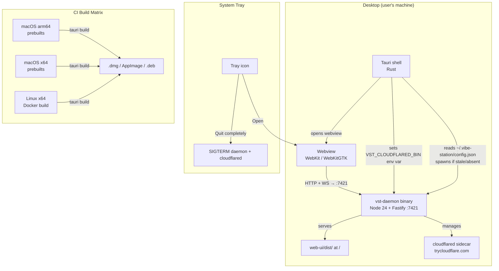

<!--
RULES — read before writing or implementing:
1. FORMAT: Bullets, tables, code, diagrams ONLY — no prose paragraphs
2. REQUIREMENTS: One crisp line each — no verbose descriptions
3. CHECKLIST: Mark items [x] as you complete them — this is your persistent todo list
4. READING TIME: Optimize for fast human scanning — if it's hard to skim, rewrite it
-->

# Plan: Tauri Desktop Shell for vibe-station

## Problem & Concept

- vibe-station runs as a browser-accessed web app today — no OS-level desktop presence, no app icon, no tray, no automatic daemon lifecycle
- Success: a `.dmg` (Mac) + AppImage/`.deb` (Linux) that a user double-clicks to get a fully working vibe-station desktop app — daemon starts automatically, web UI appears in a native window, tray keeps it alive in background

## Requirements

| # | Requirement |
|---|-------------|
| 1 | Tauri v2 shell spawns vst-daemon binary as a sidecar on launch |
| 2 | Shell detects an already-running daemon via `~/.vibe-station/config.json` (pid liveness check) and reuses it |
| 3 | Webview opens to `http://127.0.0.1:<port>` — port read from config.json after daemon starts |
| 4 | macOS: native traffic lights (`titleBarStyle: overlay`) at `{x:10, y:10}`; web TopBar is the drag region |
| 5 | Linux: frameless window (`decorations: false`); custom window controls rendered in existing TopBar |
| 6 | System tray: "Open vibe-station" + "Quit completely" (SIGTERMs daemon + cloudflared) |
| 7 | Daemon + cloudflared survive window close — only "Quit completely" kills them |
| 8 | cloudflared bundled as a second sidecar; resolved via `VST_CLOUDFLARED_BIN` env var set by the shell before spawning daemon |
| 9 | `vst doctor` gains a cloudflared PATH check with install hint |
| 10 | `tauri build` produces a signed `.dmg` (Mac) and AppImage + `.deb` (Linux) |
| 11 | CI matrix: Mac arm64, Mac x64, Linux x64 — Linux native addons compiled in Docker |

## Change Map

```
apps/
  desktop/                          + new Tauri app package
    src-tauri/
      src/
        main.rs                     + Tauri shell entry point
        daemon.rs                   + daemon spawn/detect/reuse logic
        tray.rs                     + system tray setup
      tauri.conf.json               + Tauri config (window, sidecar, entitlements)
      Cargo.toml                    + Rust deps
      Cargo.lock                    + lockfile
      icons/                        + app icons (png set)
      entitlements.mac.plist        + com.apple.security.network.client
      binaries/                     + platform sidecar binaries (gitignored, CI-populated)
        vst-daemon-aarch64-apple-darwin
        vst-daemon-x86_64-apple-darwin
        vst-daemon-x86_64-unknown-linux-gnu
        cloudflared-aarch64-apple-darwin
        cloudflared-x86_64-apple-darwin
        cloudflared-x86_64-unknown-linux-gnu
web-ui/src/components/layout/
  TopBar.tsx                        ~ add drag region + Linux window controls
  WindowControls.tsx                + Linux close/min/max buttons
daemon/src/services/
  cloudflared.ts                    ~ resolve binary from VST_CLOUDFLARED_BIN env var
cli/src/commands/
  doctor.ts                         ~ add cloudflared PATH check
scripts/
  build-daemon-binary.sh            + esbuild → yao-pkg pipeline script
  download-cloudflared.sh           + fetch cloudflared binaries for CI
```

| Today | After this plan |
|-------|-----------------|
| Users must run `vst daemon start` from a terminal | Double-clicking the app starts the daemon automatically |
| Web UI opens in a browser tab at localhost | Web UI opens in a native Tauri window with OS chrome |
| Window close = session ends | Window close hides the app; daemon stays running |
| No tray icon | Tray icon with Open / Quit |
| cloudflared must be on user PATH for QR feature | cloudflared bundled — QR works out of the box |
| `vst doctor` doesn't check cloudflared | `vst doctor` checks cloudflared and shows install hint |

## Research

- emdash chrome: `titleBarStyle: 'hiddenInset'` + `trafficLightPosition: {x:10, y:10}` on macOS; `frame: false` + custom `FramelessTitlebarOverlay` on Linux — `~/code/fastestdevalive/emdash/apps/emdash-desktop/src/main/host/window.ts:34–57`
- Tauri v2 equivalent: `"titleBarStyle": "overlay"` + `"hiddenTitle": true` in `tauri.conf.json`; drag region via `data-tauri-drag-region` on the TopBar div — Tauri v2 docs
- Daemon config written to `~/.vibe-station/config.json` with `{ port, pid, token }` on every start — `daemon/src/main.ts:77` (`writeConfig`). Shell reads this file for pid liveness; uses `kill(pid, 0)` same as daemon's own `acquireLock()` at `:46` (`.daemon.lock` — separate file, not read by shell)
- `cloudflared.ts` already PATH-based; actual `spawn("cloudflared", ...)` call at `daemon/src/services/cloudflared.ts:43`; ENOENT message at `:77–78`; one-line change to read `VST_CLOUDFLARED_BIN` env var first
- `vst doctor` checks binaries via `execSync("which <bin>")` with install hints for missing ones — `cli/src/commands/doctor.ts:43`; cloudflared check follows the same pattern
- `node-pty` has no Linux prebuilts; `better-sqlite3` has no prebuilts at all — must build from source in Docker for Linux targets — verified by subagent experiment
- esbuild → yao-pkg toolchain: esbuild converts ESM daemon to CJS, yao-pkg embeds Node 24; daemon entry after tsc is `cli/dist/daemon/main.js` (symlink: `cli/src/daemon → daemon/src`) — verified by Fable subagent

## Architecture Diagram



## Design Details

### Critical User Journeys

**Happy path — first launch:**
```
User double-clicks vibe-station.app
  → Tauri shell starts
  → reads ~/.vibe-station/config.json
    → file absent or pid dead → spawns vst-daemon sidecar
    → polls stdout for "listening on http://127.0.0.1:<port>"
    → reads port from config.json
  → opens webview to http://127.0.0.1:<port>
  → app appears; TopBar shows breadcrumb + traffic lights
  → tray icon appears in menu bar
```

**Happy path — subsequent launch (daemon already running):**
```
User clicks tray icon → Open
  → OR double-clicks app icon
  → Tauri shell starts
  → reads ~/.vibe-station/config.json → pid alive → skip spawn
  → opens webview to http://127.0.0.1:<port>
```

**Window close:**
```
User clicks red traffic light (macOS) or X (Linux)
  → window hides
  → daemon + cloudflared remain running
  → tray icon stays
  → NOT a quit
```

**Quit completely:**
```
User right-clicks tray → "Quit completely"
  → shell sends SIGTERM to daemon pid (from config.json)
  → daemon shuts down gracefully (existing SIGTERM handler)
  → cloudflared dies (daemon kills it on shutdown)
  → shell exits
  → tray disappears
```

**Error — daemon fails to start:**
```
vst-daemon sidecar crashes within 10s
  → shell shows a native dialog: "vibe-station daemon failed to start. Check logs at ~/.vibe-station/logs/"
  → webview not opened
  → tray still shows with "Restart daemon" option
```

### System Boundaries

**Shell → Daemon (sidecar lifecycle)**
```
Shell reads: ~/.vibe-station/config.json → { port: number, pid: number, token: string }
Shell writes: nothing (daemon owns config.json)
Spawn trigger: file absent OR kill(pid, 0) throws ESRCH
Readiness signal: stdout line matching /listening on http:\/\/127\.0\.0\.1:(\d+)/
Env vars injected by shell before spawn:
  VST_CLOUDFLARED_BIN=/path/to/bundled/cloudflared  ← new
Failure: daemon exits within 10s → native error dialog
```

**Shell → Webview**
```
URL: http://127.0.0.1:<port>  (port from config.json)
Port injection: shell injects window.__VST_PORT__ = <port> via Tauri initialization_script
  → React SPA reads it for any direct API calls
  → SPA already uses relative /api/* and /ws paths — no change needed for most calls
```

**TopBar → Tauri (drag + window controls)**
```
macOS: <div data-tauri-drag-region> on TopBar container
  → native traffic lights overlay at {x:10, y:10}
  → TopBar content starts at padding-left: ~72px to clear traffic lights
Linux: <div data-tauri-drag-region> + WindowControls.tsx rendered in TopBar right side
  → WindowControls calls: getCurrentWindow().minimize()/maximize()/close() from @tauri-apps/api/window (v2)
  → "close" hides window, does NOT quit (matches macOS traffic light red behavior)
```

### Key Decisions

#### Decision 1: Daemon reuse via pid liveness check
- **Decision:** read `~/.vibe-station/config.json`, call `kill(pid, 0)` — if no error, daemon is alive; skip spawn
- **Rationale:** existing daemon already writes this file with pid+port; avoids lock file races between CLI and app
- **Where:** `desktop/src-tauri/src/daemon.rs` — `detect_running_daemon()`

#### Decision 2: cloudflared resolved via `VST_CLOUDFLARED_BIN` env var
- **Decision:** shell sets `VST_CLOUDFLARED_BIN=/path/to/bundled/cloudflared` before spawning daemon; `cloudflared.ts` reads it with `process.env.VST_CLOUDFLARED_BIN ?? "cloudflared"` fallback
- **Rationale:** surgical — doesn't pollute PATH for tmux/git/claude subprocesses; fallback keeps CLI users working without env var
- **Where:** `daemon/src/services/cloudflared.ts:43` (spawn call) + `desktop/src-tauri/src/daemon.rs` (env injection)

#### Decision 3: macOS traffic lights — `titleBarStyle: overlay`
- **Decision:** follow emdash exactly: `titleBarStyle: overlay`, `hiddenTitle: true`, `trafficLightPosition: {x:10, y:10}`
- **Rationale:** native macOS feel; traffic lights at standard position; TopBar content flows alongside — see Research (emdash window.ts:34–57)
- **Where:** `desktop/src-tauri/tauri.conf.json` + `web-ui/src/components/layout/TopBar.tsx` (drag region + left padding)

#### Decision 4: Linux — frameless + custom controls
- **Decision:** `decorations: false`; `WindowControls.tsx` in TopBar renders min/max/close SVG buttons calling Tauri window API
- **Rationale:** emdash uses the same approach; Tauri's native `titleBarOverlay` is experimental on Linux
- **Where:** `desktop/src-tauri/tauri.conf.json` + `web-ui/src/components/layout/WindowControls.tsx` (new) + `web-ui/src/components/layout/TopBar.tsx`

#### Decision 5: Daemon + cloudflared survive window close
- **Decision:** window `close` event → hide window, return early; SIGTERM only on tray "Quit completely"
- **Rationale:** agents keep running; user can reopen; matches expected desktop app behavior
- **Where:** `desktop/src-tauri/src/main.rs` — window close handler

#### Decision 6: daemon binary toolchain — esbuild → yao-pkg
- **Decision:** `esbuild cli/dist/daemon/main.js --bundle --platform=node → bundle.cjs`; then `@yao-pkg/pkg bundle.cjs --target node24-<platform>`
- **Rationale:** yao-pkg alone fails on ESM `#`-prefixed imports (chalk); esbuild resolves them first — verified by subagent experiment
- **Where:** `scripts/build-daemon-binary.sh`

## Risks / Open Questions

| # | Question | Notes |
|---|----------|-------|
| 1 | xterm.js WebGL on WebKitGTK (Linux) | Test in `epiphany` on Ubuntu 22.04 before shipping — if broken, switch to Electron |
| 2 | macOS sandbox blocks cloudflared post-notarization | `com.apple.security.network.client` in entitlements.mac.plist should cover it; verify with notarized build |
| 3 | `window.__VST_PORT__` injection timing | Tauri `initialization_script` fires before page load — verify React reads it before API calls |
| 4 | cloudflared stdout URL format changes | Pin cloudflared version in CI; `TUNNEL_URL_RE` in cloudflared.ts is fragile |

## Implementation Phases

### Phase 1 — daemon binary build pipeline

- [ ] **1.1** Create `scripts/build-daemon-binary.sh` — runs esbuild on `cli/dist/daemon/main.js`, then yao-pkg for the target platform
- [ ] **1.2** Test script locally: build + run daemon binary, confirm `vst daemon start` equivalent works (tmux + PTY functional)
- [ ] **1.3** Create `scripts/download-cloudflared.sh` — downloads correct cloudflared static binary for current platform from Cloudflare GitHub releases, outputs to `desktop/binaries/`
- [ ] **1.T1** Manual: run built daemon binary, open browser to `:7421`, confirm login + terminal session works end-to-end

### Phase 2 — `cloudflared.ts` + `vst doctor` changes

- [ ] **2.1** `daemon/src/services/cloudflared.ts:43` — change `spawn("cloudflared", ...)` to `spawn(process.env.VST_CLOUDFLARED_BIN ?? "cloudflared", ...)`
- [ ] **2.2** `cli/src/commands/doctor.ts` — add cloudflared check after the bun inline check block (not inside the agent binaries loop); same pattern: `which cloudflared`, show `brew install cloudflared` hint on failure
- [ ] **2.T1** Unit: `cloudflared.ts` uses `VST_CLOUDFLARED_BIN` when set, falls back to `"cloudflared"` when unset
- [ ] **2.T2** Manual: `vst doctor` output shows cloudflared check line

### Phase 3 — Tauri shell (`desktop/`)

- [ ] **3.1** Scaffold `desktop/` — `cargo init` Tauri v2 app; add `"desktop"` to `pnpm-workspace.yaml` packages list
- [ ] **3.2** `tauri.conf.json` — configure window (1400×900, minWidth 700, minHeight 500), sidecar binaries (`vst-daemon`, `cloudflared`), macOS `titleBarStyle: overlay` + `hiddenTitle: true` + `trafficLightPosition: {x:10, y:10}`, Linux `decorations: false`
- [ ] **3.3** `entitlements.mac.plist` — add `com.apple.security.network.client` + `com.apple.security.network.server`
- [ ] **3.4** `daemon.rs` — `detect_running_daemon()`: read config.json, `kill(pid, 0)` liveness; `spawn_daemon()`: inject `VST_CLOUDFLARED_BIN`, poll stdout for ready signal, read port from config.json
- [ ] **3.5** `tray.rs` — system tray with "Open vibe-station" (show window) + "Quit completely" (SIGTERM daemon pid + exit)
- [ ] **3.6** `main.rs` — app setup: detect/spawn daemon, open webview, inject `window.__VST_PORT__` via `initialization_script`, hide window on close (not quit), register tray
- [ ] **3.T1** Manual (macOS): launch app, confirm traffic lights appear at correct position, TopBar content not obscured
- [ ] **3.T2** Manual (macOS): close window → reopen from tray → daemon still running (same pid in config.json)
- [ ] **3.T3** Manual: "Quit completely" from tray → daemon process gone (`ps aux | grep vst-daemon`)
- [ ] **3.T4** Manual: launch app twice → second launch reuses running daemon (no second daemon process)

### Phase 4 — TopBar chrome changes (web-ui)

- [ ] **4.1** `web-ui/src/components/layout/TopBar.tsx` — add `data-tauri-drag-region` to the outer container div; add fixed `padding-left: ~80px` on macOS to clear native traffic lights (Tauri sets `data-tauri-os="macos"` on `<body>` — use that as CSS selector)
- [ ] **4.2** Create `web-ui/src/components/layout/WindowControls.tsx` — close/min/max SVG buttons, calls `@tauri-apps/api/window` — rendered only on Linux (`window.__TAURI_INTERNALS__` guard)
- [ ] **4.3** Add `WindowControls` to TopBar right side, behind Linux guard
- [ ] **4.T1** Manual (macOS): drag TopBar to move window; traffic lights functional
- [ ] **4.T2** Manual (Linux): WindowControls visible; min/max/close work; browser fallback (no Tauri) renders nothing

### Phase 5 — CI build matrix

- [ ] **5.1** Create `.github/workflows/desktop-build.yml` — matrix: `{os: macos-latest, target: aarch64-apple-darwin}`, `{os: macos-13, target: x86_64-apple-darwin}`, `{os: ubuntu-22.04, target: x86_64-unknown-linux-gnu}`
- [ ] **5.2** Linux job: runs in Docker (`ubuntu:22.04`), installs build deps (`libwebkit2gtk-4.1-dev`, `build-essential`), compiles native addons from source, then builds daemon binary + runs `tauri build`
- [ ] **5.3** Mac jobs: download cloudflared binaries, build daemon binary (prebuilts available), run `tauri build --target <arch>`
- [ ] **5.4** Upload artifacts: `.dmg` (Mac), `.AppImage` + `.deb` (Linux)
- [ ] **5.T1** CI: all 3 matrix jobs green on a test branch

### Phase 6 — Verify dev flow still works

- [ ] **6.1** Add `tauri dev` config to `desktop/src-tauri/tauri.conf.json`: `"beforeDevCommand": "pnpm --filter web-ui dev"`, `"devUrl": "http://localhost:5173"` — confirm HMR still works for web-ui changes
- [ ] **6.2** `vst daemon start` from CLI still works (no regression from cloudflared.ts change)
- [ ] **6.T1** Manual: `pnpm dev` (web-ui only) still opens in browser as before — no Tauri required for web dev

## Files & Phase Impact

| File | Status | Phase | Description / Contract Change |
|------|--------|-------|-------------------------------|
| `scripts/build-daemon-binary.sh` | New | 1.1 | esbuild → yao-pkg pipeline; accepts `--target` arg |
| `scripts/download-cloudflared.sh` | New | 1.3 | Downloads cloudflared binary for target platform |
| `daemon/src/services/cloudflared.ts` | Modified | 2.1 | `spawn(process.env.VST_CLOUDFLARED_BIN ?? "cloudflared", ...)` at line 43 |
| `cli/src/commands/doctor.ts` | Modified | 2.2 | Add cloudflared check after bun; same `check()` + hint pattern |
| `desktop/src-tauri/src/main.rs` | New | 3.6 | Tauri entry; window close → hide; registers tray + daemon |
| `desktop/src-tauri/src/daemon.rs` | New | 3.4 | `detect_running_daemon()` + `spawn_daemon()` — reads/writes nothing outside `~/.vibe-station/config.json` |
| `desktop/src-tauri/src/tray.rs` | New | 3.5 | Tray: Open (show window) + Quit (SIGTERM pid from config.json) |
| `desktop/src-tauri/tauri.conf.json` | New | 3.2 | Window config, sidecar binaries, platform chrome |
| `desktop/src-tauri/Cargo.toml` | New | 3.1 | Rust deps: `tauri`, `serde_json`, `nix` (for kill) |
| `desktop/src-tauri/entitlements.mac.plist` | New | 3.3 | `network.client` + `network.server` entitlements |
| `web-ui/src/components/layout/TopBar.tsx` | Modified | 4.1 | Add `data-tauri-drag-region`; left padding guard for macOS traffic lights |
| `web-ui/src/components/layout/WindowControls.tsx` | New | 4.2 | Linux min/max/close buttons via `@tauri-apps/api/window`; no-op outside Tauri |
| `.github/workflows/desktop-build.yml` | New | 5.1 | 3-job matrix build; uploads `.dmg` + AppImage + `.deb` |
