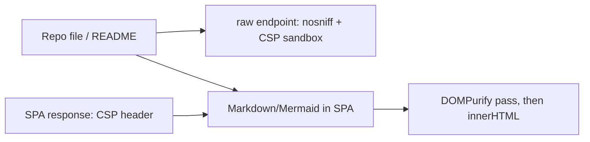

<!--
RULES — read before writing or implementing:
1. FORMAT: Bullets, tables, code, diagrams ONLY — no prose paragraphs
2. REQUIREMENTS: One crisp line each — no verbose descriptions
3. CHECKLIST: Mark items [x] as you complete them — this is your persistent todo list
4. READING TIME: Optimize for fast human scanning — if it's hard to skim, rewrite it
-->

# Plan: Untrusted-content hardening (mermaid, raw files, SPA CSP)

> Close the real parts of security finding #2 and #4: stale mermaid, unsafe raw SVG serving, no CSP on the daemon-served UI.

**Issue:** security triage Group 2 (+ finding #4)
**Branch:** `daemon-fix-token`
**Status:** WIP
**Source:** Fable review of the render path (HEAD `7802f451`)
**Commit policy (user override):** NO per-phase commits — the orchestrator makes ONE commit at the end (overrides turn-implement's per-phase auto-commit)

**Reference files:**
- Raw file responses: `rust/vst-daemon/src/server.rs` (4 handlers: `handle_project_get_file`, `handle_worktree_get_file`, `handle_project_lsp_external_file`, `handle_worktree_lsp_external_file` — `FileResponse::Text` arms ~1903, ~2319, ~2733, ~2761; `FileResponse::Image` arms ~1914, ~2330, ~2744, ~2772)
- SPA serving: `rust/vst-daemon/src/server.rs` `handle_fallback` (~4508), `serve_embedded_asset` (~4491)
- Mermaid: `web-ui/src/components/preview/MermaidView.tsx`, `MermaidView.test.tsx`
- Deps: `web-ui/package.json`, `pnpm-lock.yaml`

---

## Problem & Concept

- `mermaid@11.14.0` has a sanitizer-bypass advisory that `securityLevel:"strict"` does not stop (CVE-2026-41149, fixed in 11.15+; 11.16.1 also fixes CSS-injection/DoS/proto-pollution)
- Raw repo files are served with only `Content-Type`; an `.svg` opened by in-app link runs its script on the daemon origin
- The daemon-served SPA has no CSP, so any markup-injection bug becomes script execution in a browser (the desktop webview already has `script-src 'self'`)
- `dompurify@3.4.2` is ALSO affected (10 advisories incl. hook/config pollution; mermaid registers persistent hooks on the shared instance) — bump to ≥ 3.4.13; first-party code does not import it today, this plan starts using it

## Out of Scope

- Rewriting markdown rendering or adding `rehype-sanitize` (raw HTML already off, URLs filtered)
- Sanitizing shiki / diff / references HTML (already escaped)
- Switching mermaid to `securityLevel:"sandbox"` (breaks zoom/theming)
- Residual react-router advisories fixed only in v7 (CVE-2026-53669 backslash redirect, CVE-2026-53666 SSR-only)
- CSP on `/mobile-auth` and `/continue` static HTML pages (inline style, no script — low risk)
- CSP on the Vite dev server

## Requirements

| # | Requirement |
|---|-------------|
| 1 | Every raw-file response (text and image arms, all 4 endpoints) carries `X-Content-Type-Options: nosniff` and `Content-Security-Policy: sandbox; default-src 'none'; style-src 'unsafe-inline'; img-src data:` |
| 2 | Every response from the SPA fallback (embedded and disk-backed) carries the SPA CSP constant |
| 3 | SPA CSP keeps the app working: wasm for shiki, Google Fonts, blob/data/http(s) images, ws/wss, workers |
| 4 | Mermaid ≥ 11.16.1 and dompurify ≥ 3.4.13 resolved in `pnpm-lock.yaml` |
| 5 | Mermaid SVG is sanitized with DOMPurify before `innerHTML`; labels (`foreignObject`) still render |
| 6 | Unused `marked` dependency removed; `react-router-dom` ≥ 6.30.6 |
| 7 | Tauri CSP: `script-src` gets `'wasm-unsafe-eval'` (shiki wasm); add `img-src 'self' blob: data: https: http:`, Google Fonts `style-src`/`font-src` so blob images and fonts are not blocked by `default-src 'self'` |

---

## Change Map

```
rust/vst-daemon/src/
  server.rs          ~ raw-file + SPA headers
rust/vst-daemon/tests/
  hardening_headers.rs + header tests
web-ui/
  package.json       ~ versions, drop marked
  src/components/preview/MermaidView.tsx ~ sanitize svg
  src/components/preview/MermaidView.test.tsx ~ sanitize tests
desktop/src-tauri/
  tauri.conf.json    ~ wasm-unsafe-eval
docs/
  AUTH.md            ~ document headers
```

| Today | After this plan |
|-------|-----------------|
| Raw `.svg` served executable on daemon origin | Served sandboxed + nosniff |
| No CSP on daemon-served UI | CSP header on every SPA response |
| mermaid 11.14.0 | ≥ 11.16.1 + DOMPurify pass |

---

## Research

- `server.rs:1914-1916` (and `:2330`, `:2744`, `:2772`) — `FileResponse::Image` arms return `([(CONTENT_TYPE, mime)], content)` only; `rust/vst-routes/src/file_serving.rs:62` maps `svg` → `image/svg+xml`; `.html` is already forced to `text/plain` (`server.rs:1903-1909`)
- `server.rs:4491-4506` `serve_embedded_asset` and `:4546-4565` disk branch of `handle_fallback` build `([(CONTENT_TYPE, mime)], bytes)` — no CSP anywhere (`grep Content-Security-Policy rust/` is empty)
- `web-ui/src/components/preview/shikiHighlighter.ts:10-14` — `createHighlighter` from `shiki` (default Oniguruma wasm engine) ⇒ needs `'wasm-unsafe-eval'`
- `web-ui/src/styles/tokens.css:3-4` and `web-ui/index.html:19-24` — Google Fonts `@import`/`<link>` ⇒ CSP must allow `https://fonts.googleapis.com` (style) and `https://fonts.gstatic.com` (font)
- `MermaidView.tsx:42-55` — `mermaid.initialize({securityLevel:"strict"})`, then `el.innerHTML = svg` and `setSvgString(svg)`; `MermaidView.test.tsx` mocks `mermaid` and DOMPurify is not imported anywhere in `web-ui/src` (direct dep at `package.json:29`)
- `desktop/src-tauri/tauri.conf.json:29` — Tauri CSP is `default-src 'self'; connect-src 'self' http://127.0.0.1:* ws://127.0.0.1:*; script-src 'self'; style-src 'self' 'unsafe-inline'`: no wasm allowance, and no `img-src`/`font-src` so blob-URL images (`MarkdownView.tsx:45`, `FilePreviewPane.tsx:270`, `MermaidView.tsx:80`) and Google Fonts fall back to `'self'` and are blocked
- `server.rs:4071` already has `use axum::http::header::HeaderName;` at module scope; `header::X_CONTENT_TYPE_OPTIONS` and `header::CONTENT_SECURITY_POLICY` exist in `axum::http::header` — no new imports needed
- Mermaid's own sanitize call (`web-ui/node_modules/mermaid/dist/mermaid.core.mjs:1360-1364`) is `DOMPurify.sanitize(code, { ADD_TAGS: ["foreignobject"], ADD_ATTR: ["dominant-baseline"], HTML_INTEGRATION_POINTS: { foreignobject: true } })`; under dompurify 3.4.2 a `USE_PROFILES` config strips `dominant-baseline`
- `web-ui/node_modules` were installed by npm (no `.modules.yaml`) and hold mermaid 11.17.2 / dompurify 3.4.16, not the locked 11.14.0 / 3.4.2; mermaid itself depends on `marked@16.4.2`, so `marked` stays in the lockfile transitively
- `Router` in `build_app` (`server.rs:866-886`; `build_app` starts at `:559`) layers: `.fallback(handle_fallback)` → `auth_middleware` → `cors` → peer gate; SPA responses pass through all of them, so adding the header inside `handle_fallback` is enough
- Root cause: security headers were never set on content that is attacker-influenced (repo files, markdown, mermaid)

---

## Architecture Diagram

Single-module Rust change plus a single web-ui component; no cross-module boundary. Data flow:



---

## Design Details

### System Boundaries

| Boundary | Fields + types | Errors | Source of truth |
|----------|----------------|--------|-----------------|
| Daemon → browser (raw files) | response headers `x-content-type-options: nosniff`, `content-security-policy: <RAW_FILE_CSP>` | none (headers only) | `server.rs` constants |
| Daemon → browser (SPA) | response header `content-security-policy: <SPA_CSP>` | none | `server.rs` constant |

### Key Decisions

#### Decision 1: Constants + one wrapper per concern — *snippet, the exact strings are the contract*

- **Decision:** two `pub const`s and two small `pub fn`s in `server.rs`; apply at response construction, not as a layer
- **Rationale:** raw-file hardening must not hit API JSON/SPA; SPA CSP is only meaningful on fallback responses — see Research § Router
- **Where:** `rust/vst-daemon/src/server.rs`

```rust
pub const RAW_FILE_CSP: &str = "sandbox; default-src 'none'; style-src 'unsafe-inline'; img-src data:";
pub const SPA_CSP: &str = "default-src 'self'; script-src 'self' 'wasm-unsafe-eval'; \
style-src 'self' 'unsafe-inline' https://fonts.googleapis.com; font-src 'self' data: https://fonts.gstatic.com; \
img-src 'self' blob: data: https: http:; connect-src 'self' ws: wss:; worker-src 'self' blob:; \
object-src 'none'; base-uri 'self'; frame-ancestors 'none'; form-action 'self'";

pub fn harden_raw_file_response(mut resp: Response) -> Response {
    let h = resp.headers_mut();
    h.insert(HeaderName::from_static("x-content-type-options"), HeaderValue::from_static("nosniff"));
    h.insert(header::CONTENT_SECURITY_POLICY, HeaderValue::from_static(RAW_FILE_CSP));
    resp
}

pub fn with_spa_csp(mut resp: Response) -> Response {
    resp.headers_mut().insert(header::CONTENT_SECURITY_POLICY, HeaderValue::from_static(SPA_CSP));
    resp
}
```

#### Decision 2: Wrap `handle_fallback`, don't touch each exit

- **Decision:** rename the current `handle_fallback` to `handle_fallback_inner`; new `handle_fallback` calls it and returns `with_spa_csp(resp)`
- **Rationale:** the function has 6+ return points across embedded and disk branches

#### Decision 3: DOMPurify config mirrors mermaid's own — *snippet*

- **Decision:** sanitize the final SVG string with the SAME integration points mermaid uses so `foreignObject` labels survive
- **Rationale:** forbidding `foreignObject` would blank every flowchart label (htmlLabels default); a `USE_PROFILES` config drops `dominant-baseline` on dompurify 3.4.2 — see Research § Mermaid's own sanitize call
- **Where:** `MermaidView.tsx` (a `sanitizeSvg(svg: string): string` helper, exported for tests)

```ts
import DOMPurify from "dompurify";
// Same options mermaid itself passes, so foreignObject labels and
// dominant-baseline survive; DOMPurify's defaults already drop script/iframe/object/embed and on* attrs.
export function sanitizeSvg(svg: string): string {
  return DOMPurify.sanitize(svg, {
    ADD_TAGS: ["foreignobject"],
    ADD_ATTR: ["dominant-baseline"],
    HTML_INTEGRATION_POINTS: { foreignobject: true },
  });
}
```

### Data Model

No data model change.

### Critical User Journeys (CUJs)

#### CUJ 1 — Malicious README with an SVG link

```
User clicks [x](/api/worktrees/<id>/files/evil.svg) in a README
  → browser requests the raw file
  → response has CSP sandbox + nosniff
  → the SVG's script cannot run with the daemon origin / cookie
```

- **Error path:** a legitimate SVG still previews (the app fetches it as a blob and shows it in ``, unaffected by response CSP)

#### CUJ 2 — Mermaid state diagram with injected HTML

```
Agent output contains a ```mermaid classDef payload
  → MermaidView renders, DOMPurify strips  / <script>
  → diagram labels still visible
```

---

## Risks / Open Questions

| # | Question | Notes |
|---|----------|-------|
| 1 | SPA CSP could break a feature (fonts, wasm, images, workers) | Constant covers each use found in Research; `style-src 'unsafe-inline'` kept for React inline styles; automated check in 2.T5 confirms the built `index.html` has no inline scripts; a real browser load against the daemon-served UI is NOT automatable here — report as unverified |
| 2 | `frame-ancestors 'none'` blocks embedding | Only the daemon-served UI; the marketing-site embed uses `DemoEnv`, not the daemon |
| 3 | `pnpm install` needs network | If it fails, STOP and report; do not hand-edit `pnpm-lock.yaml`. Existing `node_modules` came from npm — use `CI=true pnpm install --no-frozen-lockfile` so pnpm may replace them |
| 4 | Tauri CSP additions loosen it slightly | `'wasm-unsafe-eval'` only permits WebAssembly compilation, not JS `eval`; `img-src` http(s) matches existing markdown-image behaviour |

---

## Implementation Phases

- Each phase ends with a verify block — the orchestrator runs it after the implementer stops
- Every phase: work from `/home/gb/.vibe-station/projects/vibe-station/worktrees/vs-216`; Rust commands in `rust/`; web commands in `web-ui/`; use `pnpm` only (never `npm install`, never create `package-lock.json`); do not commit

---

### Phase 1 — Rust headers (raw files + SPA CSP)

- [x] **1.1** In `rust/vst-daemon/src/server.rs` (no new imports; `Response`, `HeaderValue`, `header` are already imported) add exactly:

```rust
pub const RAW_FILE_CSP: &str = "sandbox; default-src 'none'; style-src 'unsafe-inline'; img-src data:";
pub const SPA_CSP: &str = "default-src 'self'; script-src 'self' 'wasm-unsafe-eval'; \
style-src 'self' 'unsafe-inline' https://fonts.googleapis.com; font-src 'self' data: https://fonts.gstatic.com; \
img-src 'self' blob: data: https: http:; connect-src 'self' ws: wss:; worker-src 'self' blob:; \
object-src 'none'; base-uri 'self'; frame-ancestors 'none'; form-action 'self'";

pub fn harden_raw_file_response(mut resp: Response) -> Response {
    let h = resp.headers_mut();
    h.insert(header::X_CONTENT_TYPE_OPTIONS, HeaderValue::from_static("nosniff"));
    h.insert(header::CONTENT_SECURITY_POLICY, HeaderValue::from_static(RAW_FILE_CSP));
    resp
}

pub fn with_spa_csp(mut resp: Response) -> Response {
    resp.headers_mut().insert(header::CONTENT_SECURITY_POLICY, HeaderValue::from_static(SPA_CSP));
    resp
}
```

- [x] **1.2** In the four handlers `handle_project_get_file`, `handle_worktree_get_file`, `handle_project_lsp_external_file`, `handle_worktree_lsp_external_file` (`server.rs` ~1903-1916, ~2319-2332, ~2733-2746, ~2761-2774) wrap EVERY `FileResponse::Text` and `FileResponse::Image` arm, e.g. `Ok(harden_raw_file_response(([(header::CONTENT_TYPE, mime)], content).into_response()))` and `Ok(harden_raw_file_response((<existing tuple>).into_response()))` for the text arms — 8 arms total, each becomes `harden_raw_file_response(<existing expression>.into_response())`
- [x] **1.3** Rename the existing `async fn handle_fallback` (`server.rs` ~4508) to `handle_fallback_inner` (unchanged body) and add:

```rust
async fn handle_fallback(State(state): State<AppState>, req: Request) -> Response {
    with_spa_csp(handle_fallback_inner(State(state), req).await)
}
```

  (the route registration `.fallback(handle_fallback)` stays as is)
- [x] **1.4** Create `rust/vst-daemon/tests/hardening_headers.rs` (copy the `make_opts` fixture pattern from `rust/vst-daemon/tests/fallback_path_traversal.rs`, including `network: NetworkControl::fixed(false)`): (a) unit — `harden_raw_file_response` on a response with `content-type: image/svg+xml` keeps that header and adds `x-content-type-options: nosniff` and a `content-security-policy` starting with `sandbox`; (b) integration — build the app with a temp `dist` containing `index.html` and `assets/app.js`; `GET /` and `GET /assets/app.js` (via `tower::ServiceExt::oneshot`, no auth header needed for SPA GETs) both return `content-security-policy` equal to `vst_daemon::server::SPA_CSP`; (c) `SPA_CSP` contains `script-src 'self' 'wasm-unsafe-eval'` and does not contain `'unsafe-inline'` inside its `script-src` directive

**Verify phase 1:**
- [x] **1.T1** `cd rust && cargo test -p vst-daemon --test hardening_headers` green
- [x] **1.T2** `grep -c "harden_raw_file_response(" rust/vst-daemon/src/server.rs` prints `9` (1 definition + 8 call sites)
- [x] **1.T3** `cd rust && cargo check --workspace --tests && cargo test -p vst-daemon -p vst-routes` all green

---

### Phase 2 — Mermaid/DOMPurify upgrade + sanitize + dependency hygiene

- [x] **2.1** `web-ui/package.json`: `mermaid` → `^11.16.1`, `dompurify` → `^3.4.13`, `react-router-dom` → `^6.30.6`, remove `marked`
- [x] **2.2** From the repo root run `CI=true pnpm install --no-frozen-lockfile` (network required; if it fails STOP and report, never hand-edit `pnpm-lock.yaml`); do not create `package-lock.json`
- [x] **2.3** In `web-ui/src/components/preview/MermaidView.tsx` add this exported helper (imports `DOMPurify` at the top of the file) and use it once: `const clean = sanitizeSvg(svg);` after `mermaid.render(...)`, then `el.innerHTML = clean;` and `setSvgString(clean);`:

```ts
import DOMPurify from "dompurify";
// Same options mermaid itself passes, so foreignObject labels and
// dominant-baseline survive; DOMPurify's defaults already drop script/iframe/object/embed and on* attrs.
export function sanitizeSvg(svg: string): string {
  return DOMPurify.sanitize(svg, {
    ADD_TAGS: ["foreignobject"],
    ADD_ATTR: ["dominant-baseline"],
    HTML_INTEGRATION_POINTS: { foreignobject: true },
  });
}
```

- [x] **2.4** In `web-ui/src/components/preview/MermaidView.test.tsx` (it mocks only `mermaid`; DOMPurify stays real under jsdom) add: (a) `sanitizeSvg('<svg><foreignObject><div class="label">Hi</div></foreignObject><script>alert(1)</script></svg>')` contains `Hi` and neither `<script` nor `onerror`; (b) `sanitizeSvg('<svg><text dominant-baseline="middle">x</text></svg>')` keeps `dominant-baseline`; (c) with `mermaid.render` mocked to return an svg containing `` the rendered container has no `[onerror]` element

**Verify phase 2:**
- [x] **2.T1** `cd web-ui && npx vitest run src/components/preview/MermaidView.test.tsx` green
- [x] **2.T2** `cd web-ui && npx tsc --noEmit` clean and `npx eslint src/components/preview/MermaidView.tsx` clean
- [x] **2.T3** `grep -nE "^  (mermaid|dompurify)@" pnpm-lock.yaml` shows mermaid ≥ 11.16.1 and dompurify ≥ 3.4.13 (only those versions); `pnpm --filter @vibestation/web list marked --depth 0` prints no `marked` dependency
- [x] **2.T4** Informational — `cd web-ui && pnpm audit --prod 2>&1 | grep -iE "mermaid|dompurify"` (report output; react-router v7-only advisories remaining are expected)
- [x] **2.T5** `cd web-ui && pnpm run build && grep -o '<script[^>]*>' dist/index.html` shows only `<script type="module" ... src="...">` tags (no inline script bodies); `dist/` is gitignored

---

### Phase 3 — Tauri CSP + docs + triage

- [x] **3.1** `desktop/src-tauri/tauri.conf.json` line ~29: replace the `csp` value with exactly `default-src 'self'; connect-src 'self' http://127.0.0.1:* ws://127.0.0.1:*; script-src 'self' 'wasm-unsafe-eval'; style-src 'self' 'unsafe-inline' https://fonts.googleapis.com; font-src 'self' data: https://fonts.gstatic.com; img-src 'self' blob: data: https: http:` (keep the JSON valid, one line)
- [x] **3.2** `docs/AUTH.md`: add a bullet after the "Desktop token is local-only" bullet: raw repo files are served with `X-Content-Type-Options: nosniff` and `Content-Security-Policy: sandbox; default-src 'none'…` (so an opened `.svg` cannot run script on the daemon origin), and every daemon-served SPA response carries a CSP (`script-src 'self' 'wasm-unsafe-eval'`, no inline scripts)
- [x] **3.3** `.vibekit/reports/2026-10-01-security-review-triage.md`: in the Bugs table set #2 to Verdict "Confirmed (mermaid 11.14.0, CVE-2026-41149; dompurify 3.4.2 also had advisories)" and Status "**Resolved**"; set #4 Status "**Resolved**" (raw files sandboxed + nosniff); in Action items mark 2.1, 2.2 and 4.1 `done`; add rows "SPA CSP header on daemon-served UI — done" and "Tauri CSP wasm/img/font alignment — done"; update the `Not checked` bullet about #4 to say headers were added but not exercised in a real browser

**Verify phase 3:**
- [x] **3.T1** `python3 -c "import json;print(json.load(open('desktop/src-tauri/tauri.conf.json'))['app']['security']['csp'])"` prints a CSP containing `script-src 'self' 'wasm-unsafe-eval'` and `img-src 'self' blob:`
- [x] **3.T2** `grep -n "nosniff" docs/AUTH.md` finds the new bullet
- [x] **3.T3** `grep -n "Resolved" .vibekit/reports/2026-10-01-security-review-triage.md` shows #2 and #4 as Resolved

---

## Files & Phase Impact

| File | Status | Phase | Description / Contract Change |
|------|--------|-------|-------------------------------|
| `rust/vst-daemon/src/server.rs` | **Modified** | 1.1-1.3 | Contract: `pub const RAW_FILE_CSP`, `pub const SPA_CSP`, `pub fn harden_raw_file_response(Response) -> Response`, `pub fn with_spa_csp(Response) -> Response` |
| `rust/vst-daemon/tests/hardening_headers.rs` | **New** | 1.4 | header tests |
| `web-ui/package.json` | **Modified** | 2.1 | mermaid, dompurify, react-router-dom, remove marked |
| `pnpm-lock.yaml` | **Modified** | 2.2 | regenerated by pnpm only |
| `web-ui/src/components/preview/MermaidView.tsx` | **Modified** | 2.3 | Contract: `export function sanitizeSvg(svg: string): string` |
| `web-ui/src/components/preview/MermaidView.test.tsx` | **Modified** | 2.4 | sanitize tests |
| `desktop/src-tauri/tauri.conf.json` | **Modified** | 3.1 | CSP: wasm, img, fonts |
| `docs/AUTH.md` | **Modified** | 3.2 | headers bullet |
| `.vibekit/reports/2026-10-01-security-review-triage.md` | **Modified** | 3.3 | statuses |

---

## Implementer Notes

- Phase 2: `pnpm install --no-frozen-lockfile` resolved mermaid 11.17.2 and dompurify 3.4.16 (both ≥ the required ^11.16.1 / ^3.4.13); `marked` was removed as a direct dep and remains only as a transitive dep of mermaid (`marked@16.4.2`), which is expected. No `package-lock.json` was created.
- Phase 3: the two new triage action rows ("SPA CSP header on daemon-served UI" / "Tauri CSP wasm/img/font alignment") were numbered 4.2 and 4.3 to sit under the existing (#4) 4.1 row; 2.1/2.2/4.1 marked done, Bugs #2 (Confirmed, CVE-2026-41149) and #4 marked Resolved, and the `Not checked` bullet updated to note headers were added but not exercised in a real browser.
