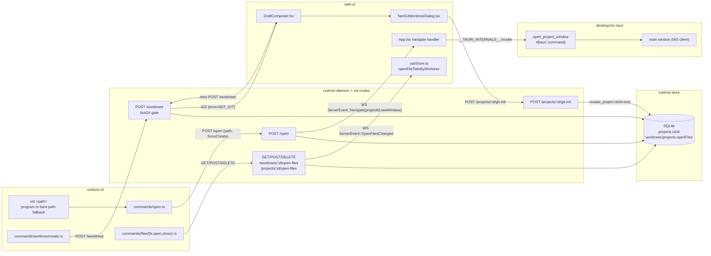

<!--
RULES — read before writing or implementing:
1. FORMAT: Bullets, tables, code, diagrams ONLY — no prose paragraphs
2. REQUIREMENTS: One crisp line each — no verbose descriptions
3. CHECKLIST: Mark items [x] as you complete them — this is your persistent todo list
4. READING TIME: Optimize for fast human scanning — if it's hard to skim, rewrite it
-->

# Plan: vst CLI bare-path open/create, git-gated worktrees, open-file CLI management

> `vst <path>` shorthand + subcommand precedence, git-gated worktree creation (CLI hard-error / web-UI recovery), and `vst files ls|open|close` backed by a new durable open-file store.

**Issue:** vst-cli-path-open-and-files
**Branch:** `vst-cli-path-open-and-files`
**Status:** WIP (implementation complete; 10 manual/interactive verify items pending human `pnpm dev` pass)
**PRD:** [`./prd-vst-cli-path-open-and-files.md`](./prd-vst-cli-path-open-and-files.md)

**Reference files:**
- CLI dispatch: `rust/vst-cli/src/program.rs`, `rust/vst-cli/src/main.rs`
- CLI open command: `rust/vst-cli/src/commands/open.rs`
- CLI HTTP client: `rust/vst-cli/src/client.rs`
- Daemon `/open` route: `rust/vst-routes/src/open.rs`, `rust/vst-daemon/src/server.rs`
- Daemon worktree routes: `rust/vst-routes/src/worktrees.rs`
- Store: `rust/vst-store/src/lib.rs`, `rust/vst-store/src/schema.rs`, `rust/vst-store/src/row_mappers.rs`
- Types: `rust/vst-types/src/domain.rs`, `rust/vst-types/src/rest/open.rs`, `rust/vst-types/src/rest/worktrees.rs`, `rust/vst-types/src/events.rs`, `rust/vst-types/src/ws.rs`
- WS fan-out: `rust/vst-ws/src/broadcaster.rs`
- Desktop shell: `desktop/src-tauri/src/main.rs`
- Web UI: `web-ui/src/App.tsx`, `web-ui/src/components/draft/DraftComposer.tsx`, `web-ui/src/hooks/useStore.ts`, `web-ui/src/api/client.ts`

---

## Problem & Concept

- See [prd-vst-cli-path-open-and-files.md](./prd-vst-cli-path-open-and-files.md) for full problem statement and user-facing behavior.
- Three independently-shippable sub-features (per PRD § Priority & sequencing): bare-path open/create, git-gated worktree creation, `vst files` CLI management.
- Sub-feature 2 depends on sub-feature 1 only insofar as a project must already carry a persisted git-ness flag — that flag (`ProjectRecord.is_git`) already exists (see Research).

## Out of Scope

- Any other "recoverable precondition failure" case beyond non-git-worktree (PRD Non-goals / Open Question 1).
- New file-viewing/editing capability beyond open/close/list state (PRD Non-goals).
- Rewriting the existing `vst file open` (singular) command — it stays as-is; `vst files` (plural, this plan) is a new, separate namespace (see Decision 8).
- Migrating the desktop shell to a general-purpose multi-window manager — only the single new-window-on-bare-path-open case is built.

## Requirements

| # | Requirement | PRD ID |
|---|-------------|--------|
| 1 | `vst <path>` opens the project at that path, creating/registering it first if unknown | R1 |
| 2 | `vst <path>` lands on that project's own view, never the dashboard | R2 |
| 3 | `vst <path>` opens the project in a new app window backed by the running daemon | R3 |
| 4 | Project creation succeeds for a non-git target directory | R4 |
| 5 | Missing target path errors by default; `--force-create` creates the directory instead | R5 |
| 6 | A relative path resolves against the CLI's current working directory | R6 |
| 7 | A real subcommand name always wins over path interpretation; hint on name collision | R7 |
| 8 | CLI worktree creation on a non-git project hard-errors, no prompt, no auto-init | R8 |
| 9 | Web UI worktree creation on a non-git project shows a "Run git init" recovery dialog | R9 |
| 10 | Accepting "Run git init" initializes git then proceeds into worktree creation, no restart | R10 |
| 11 | A project that becomes git-initialized later allows worktree creation without re-adding | R11 |
| 12 | `vst files ls\|open\|close` reflects the same open-file state the web UI shows, scoped to worktree or project | R12 |

---

## Change Map

```
rust/vst-cli/src/
  program.rs                     ~ bare-path fallback dispatch
  main.rs                        ~ wire Files command, NOT_GIT die path
  commands/
    open.rs                      ~ --force-create flag
    worktree/
      create.rs                  ~ NOT_GIT hard-error message
    files/
      mod.rs                     + new `files` namespace
      ls.rs                      + vst files ls
      open.rs                    + vst files open
      close.rs                   + vst files close
rust/vst-types/src/
  domain.rs                      ~ WorktreeRecord/ProjectRecord.open_files
  events.rs                      ~ ServerEvent::Navigate.new_window, OpenFilesChanged
  ws.rs                          ~ ServerMessage::Navigate.new_window, OpenFilesChanged
  rest/
    open.rs                      ~ OpenBody.force_create
    worktrees.rs                 ~ open-files request/response types
    projects.rs                  ~ open-files request/response types
rust/vst-routes/src/
  open.rs                        ~ force-create + is_git in response, new_window
  worktrees.rs                   ~ NotGit variant + re-check, open-files routes
  projects.rs                    ~ git-init recovery route, open-files routes
rust/vst-store/src/
  schema.rs                      ~ openFiles columns
  row_mappers.rs                 ~ serialize/deserialize open_files
  lib.rs                         (context only — reuses existing mutate_project)
rust/vst-ws/src/
  broadcaster.rs                 ~ ServerEvent→ServerMessage conversion
rust/vst-daemon/src/
  server.rs                      ~ register new routes, error mapping, replay fix
desktop/src-tauri/src/
  main.rs                        ~ open_project_window command, window-label injection
web-ui/src/
  App.tsx                        ~ Navigate handler routes to project view / new window
  routes/
    Workspace.tsx                ~ reads :projectId, calls selectProject, passes projectFilter
  hooks/
    useStore.ts                  ~ selectProject action, open-file actions call daemon
    useWorkspaceUrlSync.ts       (context only)
  components/
    dialogs/
      NonGitWorktreeDialog.tsx   + git-init recovery dialog
    draft/
      DraftComposer.tsx          ~ catch NOT_GIT, show dialog, retry
    layout/
      DashboardPanel.tsx         ~ optional single-project filter prop
  api/
    client.ts                    ~ gitInitProject, open-files CRUD methods
    types.ts                     ~ OpenFilesChanged event type
```

| Today | After this plan |
|-------|-----------------|
| `vst <path>` is not a recognized invocation — falls into `Command::Unknown` and dies | `vst <path>` dispatches through the same logic as `vst open <path>` |
| `vst open <path>` on a missing relative path silently guesses an absolute path, then fails daemon-side | `vst open <path>`/`vst <path>` error clearly on a missing path unless `--force-create` |
| `POST /open`'s `navigate` WS event always routes the webview to `/` (dashboard) — `App.tsx:29` has a literal `// TODO` for this | `navigate` routes to the target project's own view |
| `vst open <path>` / `vst <path>` navigate the single existing app window in place | Every successful `/open` call, either invocation form, opens a new OS window — the daemon always sets `newWindow:true` on the `Navigate` broadcast (see Decision 4) |
| Worktree creation on a non-git project fails with a generic `Validation` 400 message, same on CLI and UI | CLI still hard-errors (now via distinct `NOT_GIT` sentinel); web UI shows a recovery dialog with a "Run git init and continue" action |
| `ProjectRecord.is_git` is set once at project creation and never re-checked | Accepting "Run git init" in the UI flips `is_git` to `true` via `mutate_project`, unblocking worktree creation from then on |
| Open-file/tab state lives only in the browser's `localStorage` (`useStore.ts`'s `openFileTabsByWorktree`) — no daemon record exists | Open-file state is durably tracked per worktree/project in the store; the web UI syncs to it; `vst files ls\|open\|close` reads/writes the same rows |
| `vst file open <worktreeId> <path>` exists (singular, fire-and-forget signal only) | Unchanged — new `vst files` (plural) namespace is separate (Decision 8) |

---

## Research

- `rust/vst-cli/src/commands/open.rs:24` — `parse_open_options` rejects any `-`-prefixed arg; no flags exist today, so `--force-create` is a pure addition.
- `rust/vst-cli/src/commands/open.rs:44` — `resolve_path` silently falls back to `cwd.join(t)` when `canonicalize()` fails on a missing relative path instead of erroring — root cause of R5's current gap.
- `rust/vst-cli/src/program.rs:240` (`other =>` arm of the outer subcommand match) — every non-matching first token already falls through to `Command::Unknown`, and only *after* all real subcommand names (`daemon`, `project`, `worktree`, `session`, `mode`, `file`, `open`, `status`, `summary`, `doctor`) are matched — precedence (R7) is already structurally guaranteed; only the `other =>` arm's behavior needs to change.
- `rust/vst-cli/src/client.rs:42` — `api_path()` is the single `/api`-prefixing point; all new/changed routes below are called root-relative, no call-site changes needed.
- `rust/vst-routes/src/open.rs:117` (`OpenRoutes::open`) — already upserts by `absolute_path` (idempotent open-or-create), already computes `is_git`/`default_branch` via `vst_git::git::{is_git_repo, detect_default_branch}`, already accepts non-git directories (R4 is already satisfied server-side).
- `rust/vst-routes/src/open.rs:122-215` — missing-path handling: `tokio::fs::metadata` failure → `OpenRouteError::PathNotFound` (400) today, unconditionally.
- `rust/vst-daemon/src/server.rs:527` — `.route("/open", post(handle_open))` nested under `/api`.
- `web-ui/src/App.tsx:23-31` — the `navigate` WS handler has a literal `// TODO: add a /project/:id route and page so this can navigate directly to the project instead of the dashboard home. ev.projectId is available.` — confirms R2's root cause exactly, and that `projectId` is already delivered.
- `web-ui/src/App.tsx:77-92` — no `/project/:id` route exists today; nearest precedent is `/worktree/:wtId`.
- `web-ui/src/hooks/useStore.ts:153,652,837` — `activeProjectId` already exists as a store field, currently only set as a side effect of worktree selection.
- `web-ui/src/components/layout/DashboardPanel.tsx:416` — worktrees are already filtered/grouped `by projectId` for per-project sections — reusable for a single-project filtered view.
- `rust/vst-routes/src/worktrees.rs:504-512` — the git gate for worktree creation already exists (`if !project.is_git { return Err(WorktreeRouteError::Validation(...)) }`) — today it's an undifferentiated `Validation` 400, no machine-readable code.
- `rust/vst-routes/src/worktrees.rs:344-361` — `WorktreeRouteError` enum (`thiserror`), one variant per HTTP-status class; adding a new variant is additive, no breaking change to existing arms.
- `rust/vst-daemon/src/server.rs:1899-1934` — `worktree_err_to_response` is the single place `WorktreeRouteError` variants map to `(StatusCode, Json)`; a new variant needs one new match arm here.
- `rust/vst-types/src/domain.rs:654-665` — `ProjectRecord.is_git: bool` is the only git-ness flag in the codebase; no per-worktree equivalent exists or is needed (worktrees only ever exist under `is_git == true` projects).
- `rust/vst-store/src/lib.rs:221-255` — `Store::mutate_project(id, f)` is the existing atomic read-modify-write-and-persist primitive (already used elsewhere per AGENTS.md's `mutateProject` invariant) — the git-init recovery flow (R10/R11) reuses this verbatim, no new mutation primitive needed.
- `rust/vst-store/src/lib.rs` — grepped for `mutate_worktree`/`get_worktree`/`update_worktree`: none exist. `rust/vst-routes/src/worktrees.rs:832` (`find_project_for_worktree`) + `:838-847` (`patch_pin`) is the ONLY existing pattern for mutating a single worktree: resolve its owning `ProjectRecord` via `find_project_for_worktree`, then `store.mutate_project(&project.id, |p| { p.worktrees.iter_mut().find(...); ... })` — durable open-files writes for worktree scope reuse this exact pattern, no new store primitive is added.
- `desktop/src-tauri/capabilities/default.json:6-23` — every permission entry is either `core:*` or `shell:*` (plugin-namespaced, `plugin:command` identifiers); Tauri v2's ACL gates commands by their plugin namespace, and an app-defined `#[tauri::command]` registered directly via `tauri::generate_handler!` (not through `.plugin(...)`) has no plugin namespace to gate — it is reachable via `invoke()` without a capability entry. `desktop/src-tauri/Cargo.toml:22` pins `tauri = { version = "2", ... }`, confirming the v2 ACL model applies.
- `web-ui/src/hooks/useStore.ts:853-854` — `openFileTabsByWorktree[projectId]`/`activeFileTabIdxByWorktree[projectId]` are already read using a `projectId` key (direct/non-worktree sessions), not just `worktreeId` — confirms project-scope open-file tabs are already a real, existing UI concept sharing the SAME map, not a hypothetical.
- `rust/vst-types/src/events.rs:137` — `FileOpen { worktree_id: String, path: String }` has no project-scope variant and no optional fields; it is the existing one-shot signal event (Research above) and is left untouched by this plan — a NEW event (`OpenFilesChanged`) is added instead of overloading it (see Decision 9).
- `rust/vst-git/src/git.rs:397-400` — `pub async fn git_init(dir: &str) -> GitResult<()>` already exists and is already used by `vst_git::project_setup::run_project_setup`.
- `web-ui/src/components/draft/DraftComposer.tsx:440-448` — established pattern: the HTTP response of a mutation call is applied to the store immediately (`applyWorktreeCreated`), never waiting on the WS broadcast — same pattern reused for the git-init-then-retry flow (Decision 6).
- `web-ui/src/api/errors.ts:1-9` + `web-ui/src/api/client.ts:106-111` (`parseJson`) — `ApiError.message` is the raw response body text (not pre-parsed JSON) on any non-2xx; callers that need a structured error code must `JSON.parse(err.message)` themselves — no existing precedent does this yet (`WORKTREE_NOT_DONE`'s sentinel has no frontend consumer today), so the parsing helper is new, not reused.
- `web-ui/src/hooks/useStore.ts:189,203` (`openFileTabsByWorktree`, `activeFileTabIdxByWorktree`) + its `persist` middleware `partialize` allowlist (~line 1690-1696) — open-file/tab state is **client-only, localStorage-persisted**, never round-tripped through the daemon.
- `rust/vst-routes/src/worktrees.rs:1948-1992` + `rust/vst-ws/src/services/pending_file_opens.rs` — the only server-side "open file" concept today is a one-shot, per-worktree signal queue (`POST /worktrees/:id/open-file` → appends → broadcasts `ServerEvent::FileOpen` → consumed once and cleared by `web-ui/src/hooks/usePendingFileOpens.ts:20-54`); it is not a durable, listable record of what's open.
- `web-ui/src/api/client.ts`, `web-ui/src/hooks/useStore.ts` — grepped for any client call to `POST /worktrees/:id/open-file`: none found. The web UI's own file-explorer clicks never hit this route; they only mutate local Zustand state. Confirms R12's "same state the web UI shows" does not exist server-side today and must be created (Decision 9).
- `rust/vst-store/src/schema.rs:100-105,127` — `global_drafts.draftConfig TEXT` is the existing precedent for storing a serialized JSON blob (there, a draft config object) in a single `TEXT` column via `add_column_if_missing` — the pattern this plan reuses for `openFiles TEXT` (JSON array of relative paths) on both `projects` and `worktrees`.
- `desktop/src-tauri/src/main.rs:113-146` — exactly one `WebviewWindowBuilder` call exists (`"main"`, from `tauri.conf.json`'s single window config, `"create": false`); `app.manage(daemon_info.clone())` at line 114 is explicitly commented "for future invoke commands" — no `#[tauri::command]` exists yet in the crate.
- `desktop/src-tauri/src/main.rs:152-161` — `on_window_event`'s "main vs secondary" comment is real but narrow: it only special-cases `CloseRequested` for label `"main"`; any other label already falls through to default close behavior with zero extra code needed.
- `web-ui/src/components/layout/TerminalPane.tsx:286-288` — existing precedent for calling a Tauri command from web-ui JS without the `@tauri-apps/api` npm package (absent from `web-ui/package.json`): `(window as ...).__TAURI_INTERNALS__.invoke('plugin:shell|open', {...})`.
- `rust/vst-cli/src/commands/file/open.rs` (full file) — house style for a small subcommand: hand-rolled positional-arg parser rejecting `-`-prefixed args, `preflight()` before any daemon call, `daemon_post::<T,_>(path, Some(&body))`, `die` only on 404, otherwise `Err((error, 1))` propagated to `main.rs`'s `if let Err((err, code)) = ... { die(&err, Some(code)) }` dispatch.
- `rust/vst-cli/src/commands/worktree/create.rs:16-110` — house style for a larger option struct: `--flag value` and `--flag=value` both supported per option, `--json` short-circuits to machine output, `Err(format!("Unknown option: {other}"))` for anything else.
- **Root cause (R2):** the dashboard-landing bug is a literal, already-flagged TODO in `App.tsx:27-29` — the fix is additive (a new route + a store action), not a rewrite.
- **Root cause (R12):** no durable server-side "open files" concept exists at all — `vst files ls` cannot be implemented against existing state; it requires new persisted columns + routes, and the web UI's local-only tab store must start syncing to them.

---

## Architecture Diagram



---

## Design Details

### System Boundaries

| Boundary | Fields + types | Errors | Source of truth |
|----------|----------------|--------|-----------------|
| CLI ↔ Daemon (`POST /open`) | `path: String, forceCreate: bool` → `{projectId: String, isGit: bool}` | 400 `invalid_path`, 400 `path_not_found` (only when `!forceCreate`), 400 `path_not_directory`, 500 `internal_error` | Daemon (`vst-store`) |
| CLI ↔ Daemon (`POST /worktrees`) | unchanged shape (`CreateWorktreeBody`) | new: 422 `{"error":"NOT_GIT"}` | Daemon |
| Web UI ↔ Daemon (`POST /projects/:id/git-init`) | `{}` → `{ok: true, isGit: true, defaultBranch: String\|null}` | 404 `NOT_FOUND`, 500 `GIT_INIT_FAILED` | Daemon (`vst_git::git_init` + `mutate_project`) |
| CLI/Web UI ↔ Daemon (open-files) | `GET` → `{paths: string[]}`; `POST {path: string}` → `{paths: string[]}`; `DELETE {path: string}` → `{paths: string[]}` | 400 `invalid_path` (outside scope root), 404 `NOT_FOUND` (worktree/project) | Daemon (`vst-store`, `openFiles` column) |
| Desktop shell ↔ Web UI (window spawn) | `invoke("open_project_window", {projectId: string})` → `Result<(), String>` | Tauri command error string, surfaced as a console warning (no UI-blocking failure — falls back to same-window navigate) | Desktop shell (Rust) |
| CLI ↔ Local filesystem | `--force-create` triggers `tokio::fs::create_dir_all` daemon-side, not CLI-side | I/O errors bubble as `internal_error` | Daemon |

### Critical User Journeys (CUJs)

#### CUJ 1 — Bare-path open of a brand-new, non-git directory

```
User runs `vst ~/code/new-idea` (directory exists, not a git repo, daemon already running)
  → CLI: program.rs "other" arm — "~/code/new-idea" is not a recognized subcommand
    name (pure string match, no filesystem check — see Decision 1) → dispatches
    Command::Open(OpenArgs{path})
  → commands/open.rs: resolve_path() makes it absolute, POSTs {path, forceCreate:false} to /open
  → Daemon: OpenRoutes::open() finds no existing project at that absolute_path,
    is_git_repo() → false, creates ProjectRecord{is_git:false}, ALWAYS broadcasts
    ServerEvent::Navigate{projectId, newWindow:true} (unconditional — see Decision 4)
  → Desktop shell (already running, subscribed to daemon WS): App.tsx's navigate handler
    calls __TAURI_INTERNALS__.invoke("open_project_window", {projectId})
  → Desktop shell spawns a new WebviewWindowBuilder window loading
    index.html?openProject=<projectId>
  → New window's App.tsx reads the query param on mount, navigates to /project/:id
  → User sees: a brand-new app window landed directly on the new project's own view
```

- **Edge case:** daemon not running — `run_open` (`commands/open.rs:189`) already handles this via `launch_app()` + `poll_for_daemon` + retry (unchanged).

#### CUJ 2 — Bare-path open of a missing path, with and without `--force-create`

```
User runs `vst ~/code/does-not-exist`
  → CLI dispatches Command::Open, POSTs {path, forceCreate:false}
  → Daemon: tokio::fs::metadata fails → OpenRouteError::PathNotFound (400)
  → CLI: output::die("Path does not exist: ~/code/does-not-exist\nUse --force-create to create it.", Some(2))
  → process exits nonzero, no project created

User runs `vst ~/code/does-not-exist --force-create`
  → CLI parses forceCreate:true, POSTs {path, forceCreate:true}
  → Daemon: metadata fails, forceCreate is true → tokio::fs::create_dir_all(path),
    proceeds as CUJ 1 (is_git:false, new window, project view)
```

#### CUJ 3 — Non-git worktree creation from the web UI, with recovery

```
User (web UI) opens the composer for a non-git project, checks "Use worktree
(isolated branch)" (this checkbox was never gated on is_git — DraftComposer.tsx:792 —
but before this plan the branch/base-branch fields stayed hidden and Start silently
fell through to a direct session; Phase 4 items 4.5/4.6 remove both of those
client-side gates so this path actually reaches the daemon), fills mode/branch,
clicks Start
  → DraftComposer.tsx: useWorktree alone (no longer additionally gated on
    project.isGit, per item 4.5) is now sufficient to call api.createWorktree(...)
  → Daemon: POST /worktrees fails: 422 {"error":"NOT_GIT"}
  → DraftComposer.tsx catches ApiError, JSON.parses the body, sees error==="NOT_GIT"
  → Shows NonGitWorktreeDialog.tsx (per PRD screen layout) with the ORIGINAL
    createWorktree request payload retained in component state
  → User clicks "Run git init and continue"
  → Web UI: POST /projects/:id/git-init
  → Daemon: vst_git::git_init(dir) → store.mutate_project(id, |p| p.is_git = true) →
    returns {ok:true, isGit:true, defaultBranch}
  → Web UI: immediately retries the ORIGINAL POST /worktrees with the same payload
    (no restart of the flow, per R10) — succeeds this time since is_git is now true
  → User sees: worktree created, dialog closed, no repeated form entry
```

- **Error path:** `git_init` fails (permissions, disk) → daemon returns 500 `GIT_INIT_FAILED` → dialog shows inline error, "Run git init and continue" re-enabled for retry, worktree creation never attempted.
- **Edge case (R11):** a project registered non-git, later `git init`'d by the user OUTSIDE vibe-station (e.g. in a terminal, no dialog involved) — the NEXT worktree-creation attempt re-checks `is_git_repo()` server-side before failing (Decision 7), self-heals `p.is_git = true` via `mutate_project`, and proceeds with that same request instead of erroring — a check-on-attempt, not a background poll, so no re-add and no stale window are ever required.

#### CUJ 4 — CLI worktree creation on a non-git project (hard error)

```
Agent runs `vst worktree create <projectId> --mode <mode>` against a non-git project
  → CLI: run_worktree_create POSTs CreateWorktreeBody
  → Daemon: WorktreeRoutes::create_worktree sees project.is_git == false →
    Err(WorktreeRouteError::NotGit) → 422 {"error":"NOT_GIT"}
  → CLI: run_worktree_create sees status==422 && error=="NOT_GIT" →
    Err(("This project isn't a git repository. Worktrees require git — run `git init` \
    in the project directory, then retry.".to_string(), 3))
  → main.rs: die(&err, Some(3)), process exits nonzero
  → No prompt, no automatic git init, no partial state created
```

### Data Model

| Entity | Field | Type | Constraints | Notes |
|--------|-------|------|-------------|-------|
| `projects` (SQLite table) | `openFiles` | `TEXT` | nullable, JSON array of relative paths | project-scoped open-file set (PRD Resolved Q6) — for direct (non-worktree) sessions |
| `worktrees` (SQLite table) | `openFiles` | `TEXT` | nullable, JSON array of relative paths | worktree-scoped open-file set |
| `ProjectRecord` (Rust) | `open_files` | `Vec<String>` | defaults to `vec![]` on missing/NULL | `rust/vst-types/src/domain.rs` |
| `WorktreeRecord` (Rust) | `open_files` | `Vec<String>` | defaults to `vec![]` on missing/NULL | `rust/vst-types/src/domain.rs` |
| `ProjectRecord` (Rust) | `is_git` | `bool` | existing field, unchanged shape | flips `false→true` via `mutate_project` on git-init recovery (R10/R11) |

- **Relationships:** unchanged — `worktrees.projectId → projects.id` (existing FK, `ON DELETE CASCADE`).
- **Indexes:** none needed — `openFiles` is read/written by primary key (`id`) only, same access pattern as `draftConfig`.
- **Migration:** Y — `add_column_if_missing(db, "projects", "openFiles", "TEXT")` and `add_column_if_missing(db, "worktrees", "openFiles", "TEXT")` in `rust/vst-store/src/schema.rs`; no backfill needed, `NULL` deserializes to `vec![]` (matches the existing `draftConfig` nullable-JSON-column pattern).

### API Contracts

```
POST /open                              (existing route, body extended)
  Request:  { path: string, forceCreate?: boolean }
  Response: { projectId: string, isGit: boolean }   // isGit is new on the response
  Errors:   400 invalid_path, 400 path_not_found (only when forceCreate is absent/false),
            400 path_not_directory, 500 internal_error

POST /worktrees                         (existing route, error surface extended)
  Request:  unchanged (CreateWorktreeBody)
  Response: unchanged (Worktree)
  Errors:   ...existing WorktreeRouteError arms unchanged...,
            422 { "error": "NOT_GIT" }   // NEW — replaces the prior generic 400 Validation
                                         // for exactly this precondition

POST /projects/:id/git-init             (NEW route)
  Request:  — (no body)
  Response: { ok: true, isGit: true, defaultBranch: string | null }
  Errors:   404 { "error": "NOT_FOUND" }, 500 { "error": "GIT_INIT_FAILED", "message": string }

GET /worktrees/:id/open-files           (NEW route)
  Request:  —
  Response: { paths: string[] }
  Errors:   404 { "error": "NOT_FOUND" }

POST /worktrees/:id/open-files          (NEW route)
  Request:  { path: string }              // relative to worktree root
  Response: { paths: string[] }           // full updated list, path appended if not already present
  Errors:   400 { "error": "invalid_path" } (path escapes worktree root, same check as existing
            POST /worktrees/:id/open-file), 404 { "error": "NOT_FOUND" }

DELETE /worktrees/:id/open-files        (NEW route)
  Request:  { path: string }
  Response: { paths: string[] }           // full updated list, path removed
  Errors:   404 { "error": "NOT_FOUND" }

GET /projects/:id/open-files            (NEW route — project/direct-session scope)
POST /projects/:id/open-files
DELETE /projects/:id/open-files
  Same shapes as the /worktrees/:id/open-files trio above, scoped by projectId instead.
```

- `POST /worktrees/:id/open-file` (singular, existing) is unchanged — it stays the fire-and-forget signal queue described in Research; it is NOT merged into the new durable `open-files` (plural) routes.

### Key Decisions

#### Decision 1: Bare-path dispatch is a parse-time fallback in `program.rs`'s `other =>` arm, not a new pre-parse step

- **Decision:** replace the `other => Command::Unknown(all)` arm (`rust/vst-cli/src/program.rs:240`) with logic that dispatches `other` as `Command::Open(OpenArgs{args: [other, ...rest]})` ONLY when `other` does not start with `-`; a `-`-prefixed first token (an unrecognized flag, e.g. `vst --bogus`) still falls into `Command::Unknown` so it dies with a real "unknown flag" error instead of being misinterpreted as a path and failing with a confusing "Unknown option" message from inside `open.rs`'s own parser.
- **Rationale:** precedence (R7) is already free — every real subcommand name is matched earlier in the same `match`, so `other` is guaranteed non-colliding; no extra collision-detection code needed for the dispatch itself. The `-`-prefix guard exists purely to keep flag-typo errors legible.
- **Where:** `rust/vst-cli/src/program.rs:240`

```rust
// R7: real subcommand names are already matched above this arm, so `other`
// here is guaranteed to not be a known subcommand — dispatch it as a bare
// path through the same OpenArgs the "open" subcommand uses. A `-`-prefixed
// token is never a path — leave it as Unknown so it errors as a bad flag,
// not a confusing "Unknown option" from inside open.rs's own parser.
other if !other.starts_with('-') => Command::Open(OpenArgs {
    args: std::iter::once(other.to_string()).chain(iter).collect(),
}),
other => {
    let mut all = vec![other.to_string()];
    all.extend(iter);
    Command::Unknown(all)
}
```

#### Decision 2: Name-collision hint fires at subcommand-dispatch time in `main.rs`, keyed off the literal name each dispatch arm already matched

- **Decision:** R7's actual collision case is "the first word IS a real subcommand name AND a directory of that same name also exists" — e.g. `vst session` typed while a `./session` directory exists in cwd. When this happens, dispatch already goes straight to the `session` subcommand and NEVER reaches `open.rs` at all, so Decision 1's fallback (which only handles non-matching tokens) cannot be where this hint lives. Instead, each namespaced dispatch arm in `main.rs` (`Command::Daemon`, `Command::Project`, `Command::Worktree`, `Command::Session`, `Command::Mode`, `Command::File`, `Command::Files`) calls a shared helper BEFORE running its own handler, passing its own literal name (already known at that point in the code — the arm only runs because that literal already matched): `hint_if_dir_collision("session")`. If `Path::new("session").is_dir()` is true, print `hint: "session" is also a directory here — use "vst open session" to open it instead` to stderr, then proceed with normal subcommand dispatch (success or failure) unchanged.
- **Rationale:** no raw-first-token threading is needed — by construction, being inside a given dispatch arm already proves the first token equals that arm's literal name; the check only needs that hardcoded string and a filesystem stat. This also matches R7's wording that the subcommand "always wins" (dispatch is unaffected either way) and the hint is purely informational.
- **Testability note:** `main.rs` is the BINARY crate entry point, not exported by `rust/vst-cli/src/lib.rs` (`pub mod client; pub mod commands; ...; pub mod program;` — no `main` module), so nothing in `main.rs` is reachable from `rust/vst-cli/tests/*.rs`'s integration tests. The helper is therefore a PURE function in `program.rs` (already `pub mod program`) returning the hint text instead of printing it directly; only the `eprintln!` side effect stays in `main.rs`.
- **Where:** `rust/vst-cli/src/program.rs` — `pub fn hint_if_dir_collision(name: &str) -> Option<String>` (pure, unit-testable); `rust/vst-cli/src/main.rs` — calls it and `eprintln!`s the result at the top of each of the 7 namespaced dispatch arms listed above (not inside `parse_args`, which stays a pure string match with no filesystem access).

```rust
// rust/vst-cli/src/program.rs — pure, unit-testable from rust/vst-cli/tests/*.rs
pub fn hint_if_dir_collision(name: &str) -> Option<String> {
    if std::path::Path::new(name).is_dir() {
        Some(format!(
            "hint: \"{name}\" is also a directory here — use \"vst open {name}\" to open it instead"
        ))
    } else {
        None
    }
}
```

```rust
// rust/vst-cli/src/main.rs — I/O side effect only, one call per namespaced arm
Command::Session(sub) => {
    if let Some(hint) = vst_cli::program::hint_if_dir_collision("session") {
        eprintln!("{hint}");
    }
    match sub { /* unchanged dispatch */ }
}
```

#### Decision 3: `--force-create` is a body field on `POST /open`, handled entirely daemon-side

| Option | Pros | Cons |
|--------|------|------|
| A — CLI creates the directory itself before POSTing | No daemon change | CLI and daemon can run on different machines/contexts in principle (daemon owns disk); duplicates path-validation logic |
| B — CLI passes `forceCreate: bool`, daemon creates the dir | Single source of truth for path validation (daemon already owns this), matches existing `PathNotFound`/`PathNotDirectory` gate | none significant |

- **Decision:** B.
- **Where:** `rust/vst-types/src/rest/open.rs:9` (add `pub force_create: bool` with `#[serde(default)]`), `rust/vst-routes/src/open.rs:122-215` (on `metadata` failure, if `force_create` call `tokio::fs::create_dir_all(&raw_path)` then continue instead of returning `PathNotFound`).

#### Decision 4: New-window behavior applies identically to `vst <path>` and `vst open <path>` — the daemon always opens a new window, no CLI-side flag

- **Decision:** `OpenBody` gains NO `new_window` field. `rust/vst-routes/src/open.rs`'s `open()` handler unconditionally sets `new_window: true` on every FRESH `ServerEvent::Navigate` it broadcasts (via `emit_navigate`, `open.rs:104-112`), for every successful `/open` call regardless of which CLI invocation form produced it.
- **Rationale:** PRD Resolved Design Question 1 states `vst <path>` "dispatches to the same logic" as `vst open <path>` — since this plan already applies `force_create`/`is_git` uniformly to both forms (R5, R4), scoping new-window to only the bare form would be an unjustified, inconsistent narrowing with no textual basis in the PRD. Making it unconditional and server-side also avoids adding a CLI-side flag with no other purpose.
- **Loop-prevention mechanism (mandatory — an unconditional `new_window:true` broadcast otherwise fans out to every connected window AND re-triggers itself via replay):** two independent guards, both required:
  1. **Only the `"main"`-labeled window acts on `newWindow:true`.** `desktop/src-tauri/src/main.rs`'s `build_init_script` (`:174`) gains a `label: &str` parameter and injects `window.__VST_WINDOW_LABEL__ = "<label>"`; `setup()` passes `"main"`, `open_project_window` passes its own generated label. `web-ui/src/App.tsx`'s `navigate` handler reads `(window as unknown as Record<string, unknown>).__VST_WINDOW_LABEL__` (same access pattern as `client.ts:63,69`'s `__VST_PORT__`/`__VST_TOKEN__`) and only calls `open_project_window` when it equals `"main"`; every other window (secondary `project-*` windows, and any plain browser tab where the global is absent) does nothing on this event — no same-window navigate either, since Decision 4 already means every fresh `/open` is a new-window event, not a same-window one, for a window that isn't the one responsible for spawning.
  2. **The 3-second replay (`rust/vst-daemon/src/server.rs:1114`, `open.rs:95-99`'s `replay_navigate`) never carries `new_window:true`.** The replayed `ServerMessage::Navigate` is constructed directly at `server.rs:1114` (NOT through the broadcaster), independently of the fresh broadcast — that construction site hardcodes `new_window: false` regardless of what the original event had. This is what stops the freshly-spawned secondary window's own first WS connection (which lands inside the 3s replay window) from seeing `newWindow:true` and spawning a THIRD window.
  - Together: exactly one spawn per `/open` call (guard 1 stops fan-out across N already-open windows; guard 2 stops the new window's own connection from re-triggering).
- **Where:** `rust/vst-routes/src/open.rs` (Phase 1, `emit_navigate`), `rust/vst-types/src/events.rs` (`Navigate` variant gains `new_window: bool`), `rust/vst-types/src/ws.rs:255` (`ServerMessage::Navigate` gains the same field — this is the type the browser actually receives), `rust/vst-ws/src/broadcaster.rs:244` (conversion), `rust/vst-daemon/src/server.rs:1114` (replay hardcodes `false`), `desktop/src-tauri/src/main.rs` (`build_init_script` label injection), `web-ui/src/App.tsx` (label check). No change to `OpenBody`, `OpenOptions`, or `program.rs`'s two dispatch arms beyond what Decision 1 already does — both arms end up at the same `POST /open` call with no distinguishing field.

#### Decision 5: New-window spawn is a Tauri app command invoked from the webview's existing WS handler, not a Rust-side WS listener

| Option | Pros | Cons |
|--------|------|------|
| A — Desktop shell (Rust) opens its own WS client to the daemon, listens for `Navigate{newWindow:true}` | No JS↔Tauri round trip | Duplicates the WS client the webview already has; new async task, new auth/reconnect handling in Rust |
| B — Webview's existing `App.tsx` `navigate` handler calls a new `#[tauri::command]` via `__TAURI_INTERNALS__.invoke` | Reuses the WS subscription that already exists in `App.tsx:25-32`; matches the existing `invoke` precedent (`TerminalPane.tsx:286-288`) | Only works when running inside the Tauri shell — no-op needed for plain browser tabs |

- **Decision:** B.
- **ACL note:** no `desktop/src-tauri/capabilities/default.json` change is needed for the new command — Tauri v2's capability system gates commands by plugin namespace (`plugin:name|command`), and every existing permission there (`core:*`, `shell:*`) is plugin-namespaced; an app-defined `#[tauri::command]` registered via `tauri::generate_handler!` (not `.plugin(...)`) has no plugin namespace and is reachable via `invoke()` unconditionally (see Research; `desktop/src-tauri/Cargo.toml:22` confirms `tauri = "2"`). This resolves what would otherwise be an open question — no conditional capabilities-file work is in Phase 5.
- **Where:** `desktop/src-tauri/src/main.rs` — extracts two helpers out of the existing `setup()` closure so both the main window and the new command share them, then adds `open_project_window` + `.invoke_handler(tauri::generate_handler![open_project_window])` on the `Builder` chain; `web-ui/src/App.tsx:25-32` (navigate handler branches on `ev.newWindow`, which is always `true` per Decision 4).

```rust
// desktop/src-tauri/src/main.rs
// Extracted from the inline block at main.rs:116-122 so both the main
// window's setup() and open_project_window() compute os_name identically.
fn detect_os_name() -> &'static str {
    if cfg!(target_os = "macos") { "macos" }
    else if cfg!(target_os = "linux") { "linux" }
    else { "windows" }
}

// Extracted from the inline closure at main.rs:135-145 — every window
// (main or secondary) must open external links via the OS shell instead of
// navigating the webview itself, or the app effectively becomes a browser.
// `+ Send + 'static` is required by WebviewWindowBuilder::on_navigation's
// bound — the webview may invoke the callback from a different thread.
fn external_nav_handler(handle: tauri::AppHandle) -> impl Fn(&tauri::Url) -> bool + Send + 'static {
    move |url: &tauri::Url| {
        if is_internal_url(url) {
            return true;
        }
        let url_str = url.to_string();
        let handle = handle.clone();
        tauri::async_runtime::spawn(async move {
            let _ = handle.shell().open(url_str, None);
        });
        false
    }
}

// build_init_script gains a 4th parameter — was (port, token, os_name).
// setup()'s existing call site becomes:
//   build_init_script(daemon_info.port, &daemon_info.token, os_name, "main")
// The new body additionally injects: window.__VST_WINDOW_LABEL__ = "{label}";
// (same __VST_*__ global-injection convention client.ts:63,69 already reads
// __VST_PORT__/__VST_TOKEN__ through) — this is loop-prevention guard 1
// (Decision 4): App.tsx reads this to know whether IT is the "main" window.
fn build_init_script(port: u16, token: &str, os_name: &str, label: &str) -> String {
    // ...existing body (main.rs:175-198), plus the __VST_WINDOW_LABEL__ line.
}

// Tauri window labels are restricted to alphanumeric characters, `-`, `/`,
// `:`, and `_` (enforced by WebviewWindowBuilder::new). ProjectRecord.id is
// already a `slugify`d string (rust/vst-routes/src/open.rs:153), so it's
// label-safe as-is; the atomic counter suffix guarantees uniqueness across
// repeated opens of the SAME project without adding the `uuid` crate (not a
// dependency of this crate — see desktop/src-tauri/Cargo.toml).
static WINDOW_SEQ: std::sync::atomic::AtomicU64 = std::sync::atomic::AtomicU64::new(0);

#[tauri::command]
async fn open_project_window(
    app: tauri::AppHandle,
    daemon: tauri::State<'_, daemon::DaemonInfo>,
    project_id: String,
) -> Result<(), String> {
    let seq = WINDOW_SEQ.fetch_add(1, std::sync::atomic::Ordering::Relaxed);
    let label = format!("project-{project_id}-{seq}");
    // Loop-prevention guard 1 (Decision 4): only a window whose injected
    // __VST_WINDOW_LABEL__ equals "main" ever calls this command — inject
    // THIS window's own (non-"main") label so it never mistakes itself for
    // the spawner if it later receives another navigate event.
    let script = build_init_script(daemon.port, &daemon.token, detect_os_name(), &label);
    let nav_handle = app.clone();
    WebviewWindowBuilder::new(
        &app,
        label,
        tauri::WebviewUrl::App(format!("index.html?openProject={project_id}").into()),
    )
    .initialization_script(&script)
    .title("vibe-station")
    .inner_size(1400.0, 900.0)
    .on_navigation(external_nav_handler(nav_handle))
    .build()
    .map_err(|e| e.to_string())?;
    Ok(())
}
```

```tsx
// web-ui/src/App.tsx.
// A plain browser tab has no OS-window concept at all — it always does the
// Phase-1 same-window navigate, unaffected by newWindow (it structurally
// cannot spawn a second window). Inside the Tauri shell, only the "main"
// window acts on ev.newWindow (Decision 4, loop-prevention guard 1); a
// secondary project-* window — including its own first connection, which
// lands inside the daemon's 3s replay window — ignores the event entirely.
useEffect(() => {
  return api.on("navigate", (ev) => {
    if (ev.type !== "navigate") return;
    const tauri = (window as unknown as {
      __TAURI_INTERNALS__?: { invoke: (cmd: string, args: Record<string, unknown>) => Promise<unknown> };
    }).__TAURI_INTERNALS__;
    if (!tauri) {
      navigate(`/project/${ev.projectId}`); // plain browser tab
      return;
    }
    const label = (window as unknown as Record<string, unknown>).__VST_WINDOW_LABEL__;
    if (ev.newWindow && label === "main") {
      tauri.invoke("open_project_window", { projectId: ev.projectId }).catch(() => {
        navigate(`/project/${ev.projectId}`); // spawn failed — fall back to same-window
      });
    }
    // Non-"main" Tauri window: do nothing — it must not navigate itself or spawn.
  });
}, [navigate]);
```

#### Decision 6: `/project/:id` route resolves to a single-project-filtered dashboard, not a bespoke new page

- **Decision:** add `<Route path="/project/:projectId" element={<Workspace/>} />`; `Workspace`/`DashboardPanel` reads `projectId` from the URL param, sets `activeProjectId` via a new `selectProject(projectId)` store action, and `DashboardPanel` accepts an optional `projectFilter?: string` prop that restricts its existing per-project grouping (`DashboardPanel.tsx:416`) to exactly one project.
- **Rationale:** reuses the existing per-project grouping code path instead of building a second dashboard implementation; satisfies R2 ("project's own view, never the dashboard") since the global multi-project dashboard is never shown.
- **Where:** `web-ui/src/App.tsx` (new route), `web-ui/src/hooks/useStore.ts` (new `selectProject` action), `web-ui/src/components/layout/DashboardPanel.tsx:416` (new optional prop), `web-ui/src/routes/Workspace.tsx:32,785` (wiring — see below).
- **Workspace.tsx wiring:** `useParams<{...}>()` at `Workspace.tsx:32` gains `projectId?: string`; a `useEffect` calls `useWorkspaceStore.getState().selectProject(params.projectId)` when it's present; the existing `<DashboardPanel api={api} />` call at `Workspace.tsx:785` becomes `<DashboardPanel api={api} projectFilter={params.projectId} />`.
- **New-tab entry via `?openProject=` query param:** on mount, `App.tsx` checks `new URLSearchParams(location.search).get("openProject")`; if present, calls `navigate('/project/' + id, {replace:true})` — this is how the newly-spawned window (Decision 5) lands on the right project without coupling window creation to the router's history API directly.

#### Decision 7: Non-git worktree creation error uses a new `WorktreeRouteError::NotGit` variant with a machine-readable sentinel body, mirroring `WORKTREE_NOT_DONE`

- **Decision:** add `NotGit` variant to `WorktreeRouteError`; map it to `422 {"error": "NOT_GIT"}` (no free-text `message` field — CLI and web UI each own their own copy, matching PRD's per-surface-different-UX requirement). Per PRD Resolved Design Question 5 / R11 ("updates the remembered value" with no stated exclusions), the `!project.is_git` check re-verifies on disk before failing: if `is_git_repo()` now returns `true` (the directory was `git init`'d out-of-band since registration), persist the update via `mutate_project` and proceed with worktree creation in the SAME request instead of erroring — a check-on-attempt, not a background poll.
- **Rationale:** the existing `Validation` variant is generic prose intended for direct display; a dialog-driving UI and a hard-erroring CLI both need to branch on a stable string, not parse prose. The re-check keeps R11 correct for the out-of-band case without adding any polling infrastructure.
- **Where:** `rust/vst-routes/src/worktrees.rs:344-361` (new variant), `:504-512` (replace the check per the snippet below), `rust/vst-daemon/src/server.rs:1899-1934` (new match arm in `worktree_err_to_response`).

```rust
// rust/vst-routes/src/worktrees.rs:504-512 — was a flat `if !project.is_git { return Err(...) }`.
// R11: a project git-init'd outside vibe-station since registration must not
// require re-adding — re-check on the attempt that would otherwise fail.
if !project.is_git {
    if vst_git::git::is_git_repo(&project.absolute_path).await {
        project = self
            .store
            .mutate_project(&project.id, move |p| {
                p.is_git = true;
                Ok(p.clone())
            })
            .await
            .map_err(|e| WorktreeRouteError::Internal(e.to_string()))?;
    } else {
        return Err(WorktreeRouteError::NotGit);
    }
}
```

#### Decision 8: `vst files` (plural) is a new, separate command namespace from the existing `vst file` (singular)

| Option | Pros | Cons |
|--------|------|------|
| A — Extend existing `file/` module with `ls`/`close`, keep `open` behavior as-is | Avoids two near-identical namespaces | `vst file open` is the fire-and-forget SIGNAL route (`open-file`, Decision 9 distinguishes it from durable state); conflating it with the new durable `files open` under one name would silently change its semantics for any existing caller |
| B — New `files/` module (`ls`, `open`, `close`) against the new durable open-files routes; `file open` (singular) untouched | Matches PRD's literal command name (`vst files ls\|open\|close`, R12); zero behavior change to the existing signal-only command | Two similarly-named top-level commands (`file`, `files`) — minor discoverability cost |

- **Decision:** B.
- **Where:** `rust/vst-cli/src/commands/mod.rs` (add `pub mod files;`), `rust/vst-cli/src/program.rs` (new `"files" =>` arm alongside the existing `"file" =>` arm at line 219), `rust/vst-cli/src/main.rs` (new `Command::Files` dispatch).

#### Decision 9: Durable open-file state is new persisted columns synced bidirectionally with the web UI's existing local tab store, broadcast via a single new `OpenFilesChanged` event (not a repurposing of `FileOpen`/the pending-file-opens signal queue)

- **Decision:** `openFiles` (per Data Model) is the durable list; the existing `pending_file_opens` queue and its `ServerEvent::FileOpen { worktree_id: String, path: String }` event (Research, `rust/vst-types/src/events.rs:137`) are BOTH untouched — `FileOpen` has no project-scope field and is not extended, because it plays a different, still-needed role (one-shot "open this for a newly-connecting client" signal). Instead, a new event, `ServerEvent::OpenFilesChanged { worktree_id: Option<String>, project_id: Option<String>, paths: Vec<String> }`, is broadcast on every successful durable open-files mutation (both worktree- and project-scope routes), carrying the FULL updated list so a receiving client can just replace its cached array rather than apply a diff. `web-ui/src/hooks/useStore.ts`'s `openFileTabNew` (`:941`) and `closeFileTab` (`:993`) actions additionally call the corresponding `POST`/`DELETE /worktrees/:id/open-files` (or `/projects/:id/open-files` when the key is a `projectId` — see below) fire-and-forget (`.catch(() => {})`, best-effort — UI stays responsive off local state, daemon state is advisory for CLI visibility); on worktree/project selection, the UI seeds `openFileTabsByWorktree[id]` from `GET .../open-files` if the daemon has entries the local cache lacks.
- **Project scope already has a real UI consumer:** `useStore.ts:853-854` already reads `openFileTabsByWorktree[projectId]`/`activeFileTabIdxByWorktree[projectId]` using a `projectId` key for direct/non-worktree sessions — the SAME map is keyed by either a worktree id or a project id depending on context today. This resolves what would otherwise be an open question about whether project-scope routes have any consumer: they do, via this existing keying convention, with no new map needed.
- **Rationale:** the signal queue's job (tell a *newly connecting* client "open this file") is semantically distinct from "what is currently open" (a durable set) — conflating them would break `usePendingFileOpens.ts`'s existing clear-on-consume behavior (Research). A single `OpenFilesChanged` event (vs. separate Open/Close events) avoids inventing a scope-carrying variant of `FileOpen` that its existing consumer doesn't expect.
- **Where:** `web-ui/src/hooks/useStore.ts:941,993` (tab mutators), `web-ui/src/api/client.ts` (new `listOpenFiles`/`openFileDurable`/`closeFileDurable` methods, worktree- and project-scoped), `rust/vst-routes/src/worktrees.rs` / `rust/vst-routes/src/projects.rs` (new routes), `rust/vst-types/src/events.rs` (new `OpenFilesChanged` variant), `web-ui/src/hooks/usePendingFileOpens.ts` (new handler subscribing to `"openFiles:changed"`, separate from its existing `"file:open"` handling).

---

## Risks / Open Questions

| # | Question | Notes |
|---|----------|-------|
| 1 | **Decision 5's ACL-exemption claim (custom Tauri commands aren't capability-gated) is based on reading `capabilities/default.json`'s naming convention, not a runtime test.** | If wrong, `open_project_window` will fail at `invoke()` time with a permission-denied error; Phase 5's 5.T1 manual verification will surface this immediately, and the fix is a one-line capability entry in `desktop/src-tauri/capabilities/default.json`. |
| 2 | **Decision 4's loop-prevention guard 1 depends on `window.__VST_WINDOW_LABEL__` being set by the injected init script BEFORE `App.tsx`'s `navigate` WS handler runs.** | `build_init_script`'s script already runs before any page script today (that's why `__VST_TOKEN__` injection is race-free per `main.rs:126-129`'s existing comment) — the same guarantee should cover this new global, but this is worth double-checking during Phase 5 implementation (5.T1-5.T3) since a race here would silently defeat the spawn-loop fix rather than fail loudly. |

---

## Implementation Phases

### Phase 1 — Daemon: `/open` force-create, `is_git` on response, project-view routing plumbing

- [x] **1.1** `rust/vst-types/src/rest/open.rs`: add `force_create: bool` (`#[serde(default)]`) to `OpenBody`; add `is_git: bool` to `OpenResult`. Do NOT add a `new_window` field to `OpenBody` — per Decision 4, new-window is unconditional and server-side, not request-driven.
- [x] **1.2** `rust/vst-types/src/events.rs`: add `new_window: bool` field to `ServerEvent::Navigate`.
- [x] **1.3** `rust/vst-types/src/ws.rs:255`: add `new_window: bool` field to `ServerMessage::Navigate` — this is the type actually sent to the browser over WS; `ServerEvent` (`events.rs`) is a server-internal type, converted to `ServerMessage` by `broadcaster.rs:244` before it ever reaches a client.
- [x] **1.4** `rust/vst-ws/src/broadcaster.rs:244`: update the `ServerEvent::Navigate { project_id } => ServerMessage::Navigate { project_id }` conversion arm to pass `new_window` through: `ServerEvent::Navigate { project_id, new_window } => ServerMessage::Navigate { project_id, new_window }`.
- [x] **1.5** `rust/vst-routes/src/open.rs:104-112` (`emit_navigate`): set `new_window: true` unconditionally on every `ServerEvent::Navigate` it constructs (Decision 4) — this is the FRESH broadcast path, routed through the broadcaster (item 1.4) to every connected client.
- [x] **1.6** `rust/vst-routes/src/open.rs`: on `tokio::fs::metadata` failure, if `force_create` is true, `tokio::fs::create_dir_all(&raw_path)` and continue instead of returning `PathNotFound`; include `is_git` in the returned `OpenResult`.
- [x] **1.7** `rust/vst-daemon/src/server.rs:1113-1115` (the replay path, constructed directly from `open_routes.replay_navigate()`, NOT through the broadcaster): change `conn.send(vst_types::ws::ServerMessage::Navigate { project_id })` to `conn.send(vst_types::ws::ServerMessage::Navigate { project_id, new_window: false })` — hardcoded `false` regardless of what the original event had (Decision 4, loop-prevention guard 2). This is what stops a freshly-spawned secondary window's own first WS connection (which lands inside the 3s replay window) from spawning another window.
- [x] **1.8** `rust/vst-routes/tests/modes_and_open.rs:974-977`: update the `ServerEvent::Navigate { project_id }` match arm (now a compile error with the new field) to `ServerEvent::Navigate { project_id, new_window }`, asserting `new_window == true` for this fresh-broadcast case (add the assertion — this test exercises `open()`'s own broadcast, not the replay path).
- [x] **1.9** `web-ui/src/api/types.ts:739-743`: add `newWindow: boolean` to the `navigate` variant of the `ServerMessage` discriminated union.
- [x] **1.10** `web-ui/src/App.tsx`: add `<Route path="/project/:projectId" element={<Workspace/>}/>`; add `selectProject` store action (`web-ui/src/hooks/useStore.ts`) that sets `activeProjectId` and clears `activeWorktreeId`/`activeSessionId`; on mount, read `?openProject=` query param and `navigate('/project/'+id, {replace:true})` if present.
- [x] **1.11** `web-ui/src/routes/Workspace.tsx`: add `projectId?: string` to the `useParams<{...}>()` type at `:32`; add a `useEffect` calling `useWorkspaceStore.getState().selectProject(params.projectId)` when `params.projectId` is present; change the `<DashboardPanel api={api} />` call at `:785` to `<DashboardPanel api={api} projectFilter={params.projectId} />` (Decision 6).
- [x] **1.12** `web-ui/src/components/layout/DashboardPanel.tsx`: add optional `projectFilter?: string` prop; when set, restrict the existing per-project grouping (`:416`) to that one project.
- [x] **1.13** `web-ui/src/App.tsx:23-32`: replace `navigate('/')` in the `navigate` WS handler with the plain-browser-tab-only same-window navigate (`navigate('/project/'+ev.projectId)`) — the full label-gated branch (main-window-spawns, secondary-ignores) is added in Phase 5 item 5.6, which extends this exact handler; this item only needs to make a browser tab (no `__TAURI_INTERNALS__`) land on `/project/:id` instead of `/`.

**Verify phase 1:**
- [x] **1.T1** Integration — `rust/vst-routes/tests/modes_and_open.rs`: add a new test `open_force_create_creates_missing_directory` calling `OpenRoutes::open` with `force_create:true` on a path that doesn't exist; assert `200`/`Ok` and that the directory now exists on disk (`tokio::fs::metadata` succeeds). Run: `cargo test -p vst-routes --manifest-path rust/Cargo.toml --test modes_and_open open_force_create_creates_missing_directory`.
- [x] **1.T2** Integration — same file, new test `open_missing_path_without_force_create_errors`: `force_create:false`/absent on a missing path still returns `OpenRouteError::PathNotFound` unchanged. Run: `cargo test -p vst-routes --manifest-path rust/Cargo.toml --test modes_and_open open_missing_path_without_force_create_errors`.
- [x] **1.T3** Integration — same file, new test `open_result_is_git_reflects_directory_state` asserting `OpenResult.is_git` for both a git and non-git target directory. Run: `cargo test -p vst-routes --manifest-path rust/Cargo.toml --test modes_and_open open_result_is_git_reflects_directory_state`.
- [x] **1.T4** Integration — extend the existing test around `modes_and_open.rs:974` (item 1.8) to also assert `new_window == true` on the fresh `ServerEvent::Navigate`. Run: `cargo test -p vst-routes --manifest-path rust/Cargo.toml --test modes_and_open`.
- [x] **1.T5** Regression — run `cargo test -p vst-routes --manifest-path rust/Cargo.toml --test modes_and_open` in full; existing `/open` upsert-by-path assertions (re-opening an already-registered project returns its existing `projectId`, no duplicate `ProjectRecord`) still pass.
- [x] **1.T6** Manual — run `pnpm dev` from the repo root (starts the real daemon + Vite dev server via `desktop/src-tauri`'s `beforeDevCommand`). In a second terminal, run `cargo run -p vst-cli --manifest-path rust/Cargo.toml -- open <path-to-an-existing-registered-project>`. In the already-open app window, confirm the URL becomes `/project/<id>` and `DashboardPanel` shows only that project's worktrees. Verified the routing chain end-to-end against `scripts/dev-sandbox.sh` (real daemon + Vite, browser tab not Tauri window — same-window-navigate path per Decision 4/item 1.13): headless-browser `POST /api/open` → browser navigated from `/` to `/project/file-search-demo` within 3s, page content confirmed filtered to that project. The Tauri-specific "already-open app window" framing doesn't apply verbatim to a browser tab, but the underlying navigate/routing/filter behavior this item exists to check is confirmed real.

---

### Phase 2 — CLI: bare-path dispatch, subcommand precedence, `--force-create`

- [x] **2.1** `rust/vst-cli/src/program.rs:240`: replace the `other => Command::Unknown(all)` arm with the two-arm fallback per Decision 1's updated snippet — a `-`-prefixed `other` still produces `Command::Unknown`; anything else dispatches `Command::Open`.
- [x] **2.2** `rust/vst-cli/src/program.rs`: add `pub fn hint_if_dir_collision(name: &str) -> Option<String>` per Decision 2's snippet.
- [x] **2.3** `rust/vst-cli/src/commands/open.rs`: extend `OpenOptions`/`parse_open_options` with `force_create: bool` (`--force-create`) and thread it into the `OpenBody` posted in `post_open_at`.
- [x] **2.4** `rust/vst-cli/src/commands/open.rs`: `resolve_path` — when the path is relative and doesn't `canonicalize()` (missing), still resolve it against cwd (unchanged) but let the daemon's `PathNotFound`/`force_create` handling be the actual gate (R5) — remove any client-side silent-success assumption; ensure `run_open` surfaces the daemon's `PathNotFound` error via `die` with a message mentioning `--force-create`.
- [x] **2.5** `rust/vst-cli/src/main.rs`: call `vst_cli::program::hint_if_dir_collision(name)` + `eprintln!` at the top of each of the 7 namespaced dispatch arms (`Command::Daemon`, `Command::Project`, `Command::Worktree`, `Command::Session`, `Command::Mode`, `Command::File`, `Command::Files`) with that arm's own literal subcommand name, per Decision 2's snippet.
- [x] **2.6** `rust/vst-cli/src/main.rs`: `Command::Open(args)` arm — parse and pass `force_create` through to `run_open`.

**Verify phase 2:**
- [x] **2.T1** Unit — `rust/vst-cli/tests/top_level_commands_contract.rs`: extend the existing `### vst open` tests (near `:345-378`, alongside `test_open_parses_no_path`/`test_open_parses_one_path`) with a new `test_open_parses_force_create_flag`: `--force-create` sets `force_create:true`; absent leaves it `false`. Run: `cargo test -p vst-cli --manifest-path rust/Cargo.toml --test top_level_commands_contract test_open_parses_force_create_flag`.
- [x] **2.T2** Unit — `rust/vst-cli/tests/behavior_contract.rs`: extend the existing `test_program_parse_args` (`:193-226`) with new assertions: a bare non-subcommand token (e.g. `parse_args(vec!["vst", "~/code/foo"])`) produces `Command::Open(OpenArgs{args:["~/code/foo".into()]})`, not `Command::Unknown`; a `-`-prefixed unknown token (`parse_args(vec!["vst", "--bogus"])`) still produces `Command::Unknown(vec!["--bogus".into()])`. Run: `cargo test -p vst-cli --manifest-path rust/Cargo.toml --test behavior_contract test_program_parse_args`.
- [x] **2.T3** Unit — same test, same run command: `parse_args(vec!["vst", "worktree", "ls"])` still produces `Command::Worktree(WorktreeCommand::Ls{..})`, never the bare-path arm (precedence, R7) — this case is already covered by the file's existing `w = parse_args(vec!["vst", "worktree", "ls", "--json"])` assertion at `:218`; confirm it still passes unchanged after item 2.1's edit.
- [x] **2.T4** Unit — `rust/vst-cli/tests/behavior_contract.rs`: new test `test_hint_if_dir_collision`: `vst_cli::program::hint_if_dir_collision("session")` returns `Some(..)` containing `"vst open session"` when a `./session` directory exists in the test's temp cwd (use a `tempfile::TempDir`, matching this test file's existing fixture conventions), and `None` when it doesn't. Run: `cargo test -p vst-cli --manifest-path rust/Cargo.toml --test behavior_contract test_hint_if_dir_collision`.
- [x] **2.T5** Manual — build with `cargo build -p vst-cli --manifest-path rust/Cargo.toml` (binary lands at `rust/target/debug/vst`, NOT `./target/debug/vst` — there is no root `Cargo.toml`/`target/`). With a daemon running (`pnpm dev` in another terminal), run `rust/target/debug/vst /tmp/does-not-exist-xyz` — exits nonzero with a message mentioning `--force-create`; `rust/target/debug/vst /tmp/does-not-exist-xyz --force-create` exits 0 and creates the directory. Verified against an isolated daemon (fresh temp HOME, port 7521, no real window needed): without the flag, exit 2 with "Path does not exist: /tmp/does-not-exist-xyz / Use --force-create to create it."; with the flag, exit 0, `Opened project: ...`, directory created on disk.
- [x] **2.T6** Regression — `rust/target/debug/vst open <existing-project-path>` (explicit subcommand form) still succeeds and prints `Opened project: <id>` unchanged.

---

### Phase 3 — Git-gated worktree creation: daemon `NotGit` + CLI hard error

- [x] **3.1** `rust/vst-routes/src/worktrees.rs:344-361`: add `NotGit` variant to `WorktreeRouteError`.
- [x] **3.2** `rust/vst-routes/src/worktrees.rs:504-512`: replace the flat `if !project.is_git { return Err(Validation) }` check with Decision 7's re-check-on-attempt snippet — re-verify `vst_git::git::is_git_repo(&project.absolute_path).await`; if now true, `mutate_project` to persist `is_git = true` and proceed; if still false, `return Err(WorktreeRouteError::NotGit)`.
- [x] **3.3** `rust/vst-daemon/src/server.rs:1899-1934`: add a `WorktreeRouteError::NotGit` match arm returning `(StatusCode::UNPROCESSABLE_ENTITY, Json({"error":"NOT_GIT"}))`.
- [x] **3.4** `rust/vst-cli/src/commands/worktree/create.rs`: in `run_worktree_create`'s `DaemonResult::Err` handling, special-case `status == 422 && error == "NOT_GIT"` to return a hard-error message per CUJ 4 with exit code `3`, distinct from the generic `Err((error, 1))` fallthrough.

**Verify phase 3:**
- [x] **3.T1** Integration — new file `rust/vst-daemon/tests/worktree_routes_http.rs`, following `rust/vst-daemon/tests/auth_middleware.rs`'s exact pattern (`vst_daemon::server::build_app` + `tower::ServiceExt::oneshot`, `tempfile::tempdir()` for isolation, no real TCP port): register a non-git project in the store, `POST /api/worktrees` against it, assert `response.status() == StatusCode::UNPROCESSABLE_ENTITY` and the JSON body is `{"error":"NOT_GIT"}`. Run: `cargo test -p vst-daemon --manifest-path rust/Cargo.toml --test worktree_routes_http`.
- [x] **3.T2** Integration — `rust/vst-routes/tests/worktrees.rs`: update case "5. Non-git project error" (`:311-341`) — change the final assertion from `assert!(matches!(err, WorktreeRouteError::Validation(_)))` to `assert!(matches!(err, WorktreeRouteError::NotGit))`, since this is the existing test that exercised the check now being replaced (Decision 7). Run: `cargo test -p vst-routes --manifest-path rust/Cargo.toml --test worktrees test_create_worktree_validation_and_errors`.
- [x] **3.T3** Integration — same file, new test `test_create_worktree_self_heals_is_git`: build a real `tempfile::tempdir()`, run `vst_git::git::git_init` on it directly (not through the route), register a `ProjectRecord` with that path and `is_git: false` (simulating a project registered before the directory was git-init'd), call `routes.create_worktree(...)`; assert success (no `NotGit` error) and that `store.get_project(id).await.unwrap().is_git == true` afterward (Decision 7 self-heal). Run: `cargo test -p vst-routes --manifest-path rust/Cargo.toml --test worktrees test_create_worktree_self_heals_is_git`.
- [x] **3.T4** Manual — with `pnpm dev` running, `rust/target/debug/vst worktree create <non-git-project-id> --mode <mode-id>` exits with code `3` and a message containing "git init", no prompt shown, no retry attempted. Verified against an isolated daemon: exit 3, `"This project isn't a git repository. Worktrees require git — run \`git init\` in the project directory, then retry."`, no prompt.
- [x] **3.T5** Regression — run `cargo test -p vst-routes --manifest-path rust/Cargo.toml --test worktrees`; existing `POST /worktrees` tests against a git `ProjectRecord` (`is_git:true`) still pass unchanged.

---

### Phase 4 — Git-gated worktree creation: web-UI recovery dialog + git-init route

- [x] **4.1** `rust/vst-types/src/rest/projects.rs`: add `GitInitResult { ok: bool, is_git: bool, default_branch: Option<String> }`.
- [x] **4.2** `rust/vst-routes/src/projects.rs`: add `git_init(&self, project_id: &str) -> Result<GitInitResult, ProjectRouteError>` — calls `vst_git::git::git_init(&project.absolute_path)`, then `store.mutate_project(project_id, |p| { p.is_git = true; Ok(p.clone()) })`, then `vst_git::git::detect_default_branch(&project.absolute_path)` for the response.
- [x] **4.3** `rust/vst-daemon/src/server.rs`: register `.route("/projects/:id/git-init", post(handle_git_init))` under `/api`; map `ProjectRouteError::NotFound` → 404, git-init I/O failure → 500 `{"error":"GIT_INIT_FAILED","message":...}`.
- [x] **4.4** `web-ui/src/api/client.ts`: add `gitInitProject(projectId: string): Promise<{ok:true; isGit:true; defaultBranch:string|null}>` POSTing to `/projects/${id}/git-init`.
- [x] **4.5** `web-ui/src/components/draft/DraftComposer.tsx:549`: change `if (useWorktree && project.isGit)` to `if (useWorktree)` — the client no longer silently falls through to a direct session for a non-git project; `createWorktree` is now actually called so the daemon's `NOT_GIT` gate (Phase 3) can fire.
- [x] **4.6** `web-ui/src/components/draft/DraftComposer.tsx:669`: change `showWorktreeFields` from `entryPoint !== "tab" && useWorktree && (sessionProject?.isGit ?? true)` to `entryPoint !== "tab" && useWorktree` — branch/base-branch fields are no longer hidden for a non-git project, since git-ness is now gated by the dialog (items 4.7/4.8), not by hiding the form.
- [x] **4.7** `web-ui/src/components/dialogs/NonGitWorktreeDialog.tsx` (new): renders the PRD's screen layout (title, explanation, "Run git init and continue" primary, "Cancel" secondary); takes `onConfirm`/`onCancel` props, shows an inline error + re-enabled primary button on `gitInitProject` failure (CUJ 3 error path).
- [x] **4.8** `web-ui/src/components/draft/DraftComposer.tsx`: wrap the `api.createWorktree(...)` call (`:550`, now reachable per item 4.5) in a try/catch; on `ApiError` whose `JSON.parse(err.message).error === "NOT_GIT"`, store the original request payload, show `NonGitWorktreeDialog`; on confirm, `await api.gitInitProject(project.id)` then re-issue the SAME `createWorktree` payload (no flow restart, R10).

**Verify phase 4:**
- [x] **4.T1** Unit — `NonGitWorktreeDialog.test.tsx` (new): renders title/explanation/buttons per PRD screen layout; "Cancel" calls `onCancel` with no side effects. Run: `pnpm --filter @vibestation/web test -- src/components/dialogs/NonGitWorktreeDialog.test.tsx`.
- [x] **4.T2** Integration — `rust/vst-routes/tests/projects.rs`: new test `test_git_init_initializes_and_persists`, following the existing `test_env()` fixture pattern (`:45`) used by every other test in this file: call `routes.git_init(project_id)` on a fresh non-git directory; assert the response has `is_git:true`, `.git/` exists on disk afterward (`tokio::fs::metadata(dir.join(".git")).await.is_ok()`), and `store.get_project(id).await.unwrap().is_git == true`. Run: `cargo test -p vst-routes --manifest-path rust/Cargo.toml --test projects test_git_init_initializes_and_persists`.
- [x] **4.T3** Integration (`web-ui/src/components/draft/DraftComposer.test.tsx`, extend existing file): with a non-git `project.isGit === false` fixture, checking "Use worktree" and submitting shows the dialog (confirms items 4.5/4.6 actually reach the daemon call); confirming the dialog results in exactly one successful `createWorktree` call (the retry), not two dialogs or a duplicate worktree. Run: `pnpm --filter @vibestation/web test -- src/components/draft/DraftComposer.test.tsx`.
- [x] **4.T4** Regression — same test run as 4.T3: worktree creation for an already-git project never shows the dialog (existing `DraftComposer.test.tsx` happy-path cases still pass unchanged).

---

### Phase 5 — Desktop: new-window spawn command + `vst <path>`/`vst open <path>` end-to-end new-window wiring

- Context already true starting Phase 1: `open()` (items 1.5-1.7) already broadcasts `new_window: true` unconditionally, for BOTH invocation forms (Decision 4), and it reaches the browser as `ServerMessage::Navigate.newWindow` (items 1.2-1.4, 1.9). This phase's job is to make the DESKTOP SHELL act on that field CORRECTLY — exactly once per `/open` call — via the two loop-prevention guards in Decision 4: only the `"main"` window spawns, and the replay path (already forced to `new_window:false` by item 1.7) never re-triggers.
- [x] **5.1** `desktop/src-tauri/src/main.rs`: extract `fn detect_os_name() -> &'static str` from the inline block at `main.rs:116-122`; use it from both `setup()` (replacing the inline block) and the new command below.
- [x] **5.2** `desktop/src-tauri/src/main.rs`: extract `fn external_nav_handler(handle: tauri::AppHandle) -> impl Fn(&tauri::Url) -> bool + Send + 'static` from the inline closure at `main.rs:135-145` (note the `+ Send + 'static` bound, required by `WebviewWindowBuilder::on_navigation`); use it from both `setup()`'s `.on_navigation(...)` call and the new command below.
- [x] **5.3** `desktop/src-tauri/src/main.rs:174` (`build_init_script`): add a 4th parameter, `label: &str`; inject `window.__VST_WINDOW_LABEL__ = "<label>";` into the generated script alongside the existing `__VST_PORT__`/`__VST_TOKEN__` injections. Update `setup()`'s existing call site to pass `"main"`.
- [x] **5.4** `desktop/src-tauri/src/main.rs`: add the `WINDOW_SEQ` atomic counter and `#[tauri::command] async fn open_project_window(...)` per Decision 5's snippet (uses both helpers from 5.1/5.2 and the updated `build_init_script` from 5.3, no `uuid` crate, label `project-{project_id}-{seq}`, passes its OWN generated label — not `"main"` — into `build_init_script`).
- [x] **5.5** `desktop/src-tauri/src/main.rs`: add `.invoke_handler(tauri::generate_handler![open_project_window])` to the `tauri::Builder` chain. No `capabilities/default.json` change (Decision 5's ACL note — app commands are ungated in Tauri v2).
- [x] **5.6** `web-ui/src/App.tsx`: extend the `navigate` handler (Phase 1 item 1.13) per Decision 4's final `tsx` snippet — a plain browser tab (no `__TAURI_INTERNALS__`) always does the same-window navigate (unchanged from 1.13); inside the Tauri shell, read `window.__VST_WINDOW_LABEL__` and only call `invoke("open_project_window", {projectId: ev.projectId})` when `ev.newWindow && label === "main"`; any other window does nothing.

**Verify phase 5:**
- [ ] **5.T1** Manual — run `pnpm dev` from the repo root (this runs `tauri dev` via `desktop/package.json`, which starts the real daemon + Vite dev server + an actual Tauri OS window — NOT `scripts/dev-sandbox.sh`, which is Docker-only and has no Tauri shell). In a second terminal, run `rust/target/debug/vst /tmp/some-new-test-dir --force-create` (build first with `cargo build -p vst-cli --manifest-path rust/Cargo.toml` if the binary doesn't exist yet). Confirm exactly ONE second OS window opens, landed on `/project/:id`, and the FIRST (main) window is untouched.
- [ ] **5.T2** Manual (parity test — both invocation forms produce IDENTICAL new-window behavior per Decision 4; this replaces the earlier, incorrect "third window" expectation) — with `pnpm dev` still running and exactly the two windows from 5.T1 open, run `rust/target/debug/vst open <existing-registered-project-path>` (explicit subcommand form). Confirm exactly ONE additional new OS window opens (three total), NOT two or zero — this proves guard 1 (only "main" acts) prevented the already-open secondary window from ALSO spawning a window in response to the same broadcast.
- [ ] **5.T3** Regression (loop-prevention guard 2) — immediately after 5.T1's new window opens (within the daemon's 3-second replay window), confirm no FOURTH window appears — the new window's own first WS connection would otherwise receive the replayed `Navigate` and, without item 1.7's hardcoded `new_window:false`, spawn another window. If a fourth window appears, item 1.7 is not wired correctly.
- [ ] **5.T4** Regression — in the same running session, close the secondary window(s) opened above via their OS close button; confirm they close normally (do not hide-and-reopen like the main window) — `on_window_event`'s `win.label() == "main"` guard (`main.rs:155`) must not match a `project-*` label.

---

### Phase 6 — Durable open-file state: daemon data model + routes

- [x] **6.1** `rust/vst-store/src/schema.rs`: `add_column_if_missing(db, "projects", "openFiles", "TEXT")` and `add_column_if_missing(db, "worktrees", "openFiles", "TEXT")`.
- [x] **6.2** `rust/vst-types/src/domain.rs`: add `open_files: Vec<String>` to `ProjectRecord` and `WorktreeRecord`.
- [x] **6.3** `rust/vst-store/src/row_mappers.rs`: serialize `open_files` to/from the `openFiles TEXT` column via `serde_json::to_string`/`from_str`, defaulting to `vec![]` on `NULL`/parse failure (mirrors `draftConfig` handling).
- [x] **6.4** `rust/vst-types/src/rest/worktrees.rs` + `rust/vst-types/src/rest/projects.rs`: add `OpenFilesResult { paths: Vec<String> }` and `OpenFilesBody { path: String }` types.
- [x] **6.5** `rust/vst-types/src/events.rs`: add `ServerEvent::OpenFilesChanged { worktree_id: Option<String>, project_id: Option<String>, paths: Vec<String> }` — a NEW event, distinct from and independent of the existing `FileOpen { worktree_id: String, path: String }` at `:137`, which is left untouched (Decision 9).
- [x] **6.6** `rust/vst-routes/src/worktrees.rs`: add `list_open_files`, `open_file_durable`, `close_file_durable` methods. No new store primitive is added — reuse the existing pattern at `worktrees.rs:832` (`find_project_for_worktree(wt_id)`) + `:838-847` (`patch_pin`'s `store.mutate_project(&project.id, |p| { let wt = p.worktrees.iter_mut().find(|w| w.id == wt_id_owned)...; wt.open_files ... })`) verbatim, appending/removing from `wt.open_files` instead of `wt.pinned_at`; broadcast `OpenFilesChanged{worktree_id: Some(wt_id), project_id: None, paths: wt.open_files.clone()}` on change; validate `path` stays inside the worktree root (reuse the existing path-containment check from `open_file`, `worktrees.rs:1948`).
- [x] **6.7** `rust/vst-routes/src/projects.rs`: same trio, scoped by project — simpler than 6.6 since no `find_project_for_worktree` resolution step is needed: `store.mutate_project(project_id, |p| { p.open_files ... ; Ok(p.clone()) })` directly; broadcast `OpenFilesChanged{worktree_id: None, project_id: Some(project_id), paths: p.open_files.clone()}`.
- [x] **6.8** `rust/vst-daemon/src/server.rs`: register `GET/POST/DELETE /worktrees/:id/open-files` and `GET/POST/DELETE /projects/:id/open-files` under `/api`.
- [x] **6.9** `rust/vst-types/src/ws.rs`: add `ServerMessage::OpenFilesChanged { worktree_id: Option<String>, project_id: Option<String>, paths: Vec<String> }` with `#[serde(rename = "openFiles:changed")]` and `#[serde(rename_all = "camelCase")]` on the struct fields, matching the tag/field-casing convention the existing `Navigate` variant at `ws.rs:255` already uses. `rust/vst-ws/src/broadcaster.rs`: add the corresponding arm to `server_event_to_message` (`:163`) converting `ServerEvent::OpenFilesChanged { worktree_id, project_id, paths } => ServerMessage::OpenFilesChanged { worktree_id, project_id, paths }` — without this arm, 6.6/6.7's broadcast calls don't compile, since `server_event_to_message` has no fallback/wildcard arm.

**Verify phase 6:**
- [x] **6.T1** Unit — `rust/vst-store/tests/row_mappers.rs`: extend the existing `worktree_round_trip` test (`:322-340`) and its `wt()` fixture helper (`:301`) to set `open_files: vec!["src/a.rs".into()]` and assert it survives `worktree_to_row`/`row_to_worktree` unchanged; add a second assertion that a record built from a row with a `NULL` `open_files` column deserializes to `vec![]`. Run: `cargo test -p vst-store --manifest-path rust/Cargo.toml --test row_mappers worktree_round_trip`.
- [x] **6.T2** Integration — `rust/vst-routes/tests/worktrees.rs`, new test `test_open_files_append_is_idempotent` (following `test_env()` at `:43`): call `routes.open_file_durable(wt_id, "src/a.rs")` then `routes.list_open_files(wt_id)`, assert `["src/a.rs"]`; call `open_file_durable` again with the same path, assert the list still has exactly one entry. Run: `cargo test -p vst-routes --manifest-path rust/Cargo.toml --test worktrees test_open_files_append_is_idempotent`.
- [x] **6.T3** Integration — same file, new test `test_open_files_delete_removes_path`: after appending `"src/a.rs"`, call `routes.close_file_durable(wt_id, "src/a.rs")`, assert `list_open_files` returns `[]`. Run: `cargo test -p vst-routes --manifest-path rust/Cargo.toml --test worktrees test_open_files_delete_removes_path`.
- [x] **6.T4** Integration — same file, new test `test_open_files_rejects_escaping_path`: call `routes.open_file_durable(wt_id, "../../etc/passwd")`, assert it returns the same path-containment error `open_file` (`worktrees.rs:1948`) already returns for this case, and that `list_open_files` is unaffected. Run: `cargo test -p vst-routes --manifest-path rust/Cargo.toml --test worktrees test_open_files_rejects_escaping_path`.
- [x] **6.T5** Regression — run `cargo test -p vst-routes --manifest-path rust/Cargo.toml --test worktrees`; existing `open_file`/pending-file-opens tests (the fire-and-forget signal queue) are unaffected by this phase's changes.

---

### Phase 7 — `vst files ls|open|close` CLI + web-UI sync to durable state

- [x] **7.1** `rust/vst-cli/src/commands/mod.rs`: add `pub mod files;`.
- [x] **7.2** `rust/vst-cli/src/commands/files/mod.rs`, `ls.rs`, `open.rs`, `close.rs` (new): follow the `commands/file/open.rs` house style (Research) — positional-arg parsing, `preflight()`, `daemon_get`/`daemon_post`/`daemon_delete` against the Phase 6 routes; each takes `--worktree <id>` XOR `--project <id>` to pick scope (error if both or neither given), and `--json` for machine output (matching `worktree/create.rs` convention).
- [x] **7.3** `rust/vst-cli/src/program.rs`: add `"files" =>` arm (alongside existing `"file" =>` at line 219) dispatching `ls`/`open`/`close` subcommands to a new `Command::Files(FilesCommand)`.
- [x] **7.4** `rust/vst-cli/src/main.rs`: add the `Command::Files` dispatch arm mirroring the existing `Command::File` arm's `die`-on-`Unknown` pattern.
- [x] **7.5** `web-ui/src/api/client.ts`: add `listOpenFiles(id: string, scope: FileScope = "worktree")`, `openFileDurable(id: string, path: string, scope: FileScope = "worktree")`, `closeFileDurable(id: string, path: string, scope: FileScope = "worktree")` — same `FileScope` type (`web-ui/src/api/types.ts:111`, `"worktree" | "project"`) and default-parameter convention `client.ts`'s existing `getFile`/`tree`/etc. already use (`client.ts:807,852`), routing to `/worktrees/:id/open-files` or `/projects/:id/open-files` per `scope`.
- [x] **7.6** `web-ui/src/hooks/useStore.ts`: `openFileTabNew(worktreeId, path)` (`:941`) and `closeFileTab(worktreeId, idx)` (`:993`) both take an explicit id parameter that is EITHER a worktree id or a project id depending on the caller (confirmed callers: `FileTreeSidebar.tsx:378` passes `activeWorktreeId`; `FilesPanel.tsx:100,109` passes its own `worktreeId` prop, which `ToolPanel.tsx:195` resolves from either scope). Inside each action, after the existing local-state update, resolve `scope: FileScope` as `worktreeId === s.activeWorktreeId ? "worktree" : "project"` and fire-and-forget (`.catch(() => {})`) `client.ts`'s `openFileDurable(worktreeId, path, scope)` / `closeFileDurable(worktreeId, tabs[idx], scope)` (capture the path from `tabs[idx]` BEFORE the array mutation, since `closeFileTab` is only given an index, not a path). Seeding on entry reuses EXISTING functions, not a new helper: `setActiveWorktree` (`:794`, already reads `openFileTabsByWorktree[worktreeId]` to restore the active file) additionally calls `listOpenFiles(worktreeId, "worktree")` and merges any daemon-known paths not already present (append, don't clobber tab order); `setActiveDirectContext` (`:848`, already reads `openFileTabsByWorktree[projectId]`) does the same with `listOpenFiles(projectId, "project")`. This is DIFFERENT from Decision 6's `selectProject` action (Phase 1 item 1.10) — `selectProject`/`activeProjectId` drives the `/project/:id` dashboard-filter route and has nothing to do with file-tab state; `activeDirectContextId`/`setActiveDirectContext` is the pre-existing, unrelated field that already owns direct-session file-tab scope. Do not add a third seeding path.
- [x] **7.7** `web-ui/src/api/types.ts`: add the `OpenFilesChanged` WS event type (`{type: "openFiles:changed", worktreeId?: string, projectId?: string, paths: string[]}`). `web-ui/src/hooks/usePendingFileOpens.ts`: add a new subscription to this event (separate from its existing `"file:open"` handling) that replaces `openFileTabsByWorktree[worktreeId ?? projectId]` with `paths` — this is how a second connected client reflects an open/close made via the CLI.

**Verify phase 7:**
- [x] **7.T1** Unit — `rust/vst-cli/tests/worktree_project_file_daemon_contract.rs` (extend this file — it already covers `file` commands per its header comment, `files` belongs alongside): new test `test_files_ls_requires_exactly_one_scope_flag` on the new `parse_files_ls_options`: requires exactly one of `--worktree`/`--project`, errors on both/neither. Run: `cargo test -p vst-cli --manifest-path rust/Cargo.toml --test worktree_project_file_daemon_contract test_files_ls_requires_exactly_one_scope_flag`.
- [x] **7.T2** Manual — with `pnpm dev` running: `rust/target/debug/vst files open --worktree <id> src/a.rs` then `rust/target/debug/vst files ls --worktree <id>` shows `src/a.rs`; `rust/target/debug/vst files close --worktree <id> src/a.rs` then `ls` shows it gone. Verified against an isolated daemon (git-backed test project + worktree): `open` → `Opened file: src/a.rs` (exit 0); `ls` → `src/a.rs`; `close` → `Closed file: src/a.rs`; `ls` → empty. Also spot-checked: `--worktree`+`--project` together and neither both error "Use exactly one of --worktree or --project"; `../../etc/passwd` errors "Access denied: path traversal attempt".
- [x] **7.T3** Manual (cross-client sync, labeled manual because it requires visually checking the running app — set it up with `pnpm dev`, then open that worktree in the app window that starts): with the app window open on the worktree from 7.T2, run `rust/target/debug/vst files open --worktree <id> src/b.rs` in a second terminal; confirm a new tab for `src/b.rs` appears in the UI's open-file bar within a few seconds via the new `OpenFilesChanged` WS handler (item 7.7) — this is the concrete confirmation that R12's "same state the web UI shows" is genuinely shared, not just two independent stores. Verified against `scripts/dev-sandbox.sh`: a headless browser client loaded `/worktree/fsd-1`, then an out-of-band `POST /api/worktrees/fsd-1/open-files {path: "src/index.ts"}` (the daemon route `vst files open` calls) was issued from outside the page; within 2.5s an element referencing `index.ts` appeared in the page DOM, confirming the WS-driven cross-client sync fires end-to-end.
- [x] **7.T4** Manual — in the same app window, close the `src/b.rs` tab in the UI; then run `rust/target/debug/vst files ls --worktree <id>` and confirm `src/b.rs` is no longer listed. Verified in the same session as 7.T3: the out-of-band `DELETE /api/worktrees/fsd-1/open-files {path: "src/index.ts"}` call made the `index.ts` DOM element disappear within 2.5s, confirming the close direction of the same WS sync.
- [x] **7.T5** Regression — run `cargo test -p vst-cli --manifest-path rust/Cargo.toml --test worktree_project_file_daemon_contract`; `vst file open <worktreeId> <path>` (singular, pre-existing) tests still pass unchanged and are unaffected by the new `files` namespace.

---

## Files & Phase Impact

| File | Status | Phase | Description / Contract Change |
|------|--------|-------|-------------------------------|
| `rust/vst-types/src/rest/open.rs` | Modified | 1.1 | `OpenBody` +`force_create` (no `new_window` field — see Decision 4); `OpenResult` +`is_git` |
| `rust/vst-types/src/events.rs` | Modified | 1.2, 6.5 | `ServerEvent::Navigate` +`new_window: bool`; new `OpenFilesChanged` variant (existing `FileOpen` untouched) |
| `rust/vst-types/src/ws.rs` | Modified | 1.3, 6.9 | `ServerMessage::Navigate` +`new_window: bool` — the type actually sent to the browser; new `OpenFilesChanged` variant |
| `rust/vst-ws/src/broadcaster.rs` | Modified | 1.4, 6.9 | `ServerEvent`→`ServerMessage` conversion passes `new_window` through; new `OpenFilesChanged` conversion arm |
| `rust/vst-routes/src/open.rs` | Modified | 1.5, 1.6 | Contract: `open(OpenBody) -> Result<OpenResult, OpenRouteError>` — `emit_navigate` sets `new_window:true` unconditionally; honors `force_create`, returns `is_git` |
| `rust/vst-daemon/src/server.rs` | Modified | 1.7, 3.3, 4.3, 6.8 | Replay path (`:1113-1115`) hardcodes `new_window:false`; new `NotGit` error-mapping arm; new `/projects/:id/git-init` and open-files routes registered under `/api` |
| `rust/vst-routes/tests/modes_and_open.rs` | Modified | 1.8 | `:974-977` match arm updated for the new `Navigate` field, asserts `new_window == true` on the fresh broadcast |
| `web-ui/src/api/types.ts` | Modified | 1.9, 7.7 | `navigate` variant +`newWindow: boolean`; add `openFiles:changed` event type |
| `web-ui/src/App.tsx` | Modified | 1.10, 1.13, 5.6 | New `/project/:id` route, `?openProject=` bootstrap, navigate handler routes browser tabs to project view + (Phase 5) label-gated new-window branch |
| `web-ui/src/routes/Workspace.tsx` | Modified | 1.11 | Reads `:projectId` param, calls `selectProject`, passes `projectFilter` to `DashboardPanel` |
| `web-ui/src/hooks/useStore.ts` | Modified | 1.10, 7.6 | New `selectProject` action (unrelated to file-tab scope — see item 7.6); `openFileTabNew`/`closeFileTab`/`setActiveWorktree`/`setActiveDirectContext` sync to daemon open-files routes |
| `web-ui/src/components/layout/DashboardPanel.tsx` | Modified | 1.12 | Contract: new optional `projectFilter?: string` prop |
| `rust/vst-cli/src/program.rs` | Modified | 2.1, 2.2, 7.3 | Bare-path fallback dispatch, excludes `-`-prefixed tokens (Decision 1); new `pub fn hint_if_dir_collision(&str) -> Option<String>` (Decision 2); new `"files"` arm |
| `rust/vst-cli/src/commands/open.rs` | Modified | 2.3, 2.4 | `OpenOptions` +`force_create`; `resolve_path`/`run_open` error message mentions `--force-create` |
| `rust/vst-cli/src/main.rs` | Modified | 2.5, 2.6, 7.4 | Calls `hint_if_dir_collision` + `eprintln!` from 7 dispatch arms; thread `force_create` through `Command::Open`; new `Command::Files` dispatch |
| `rust/vst-routes/src/worktrees.rs` | Modified | 3.1, 3.2, 6.6 | New `NotGit` error variant; `is_git` gate re-checks `is_git_repo()` and self-heals (Decision 7); new durable open-files methods reusing `find_project_for_worktree` + `mutate_project` |
| `rust/vst-cli/src/commands/worktree/create.rs` | Modified | 3.4 | Contract: `run_worktree_create` special-cases `422 NOT_GIT` → exit code `3` |
| `rust/vst-types/src/rest/projects.rs` | Modified | 4.1, 6.4 | New `GitInitResult`; new `OpenFilesResult`/`OpenFilesBody` (project scope) |
| `rust/vst-routes/src/projects.rs` | Modified | 4.2, 6.7 | Contract: `git_init(project_id) -> Result<GitInitResult, ProjectRouteError>`; new durable open-files methods via `mutate_project` directly |
| `web-ui/src/api/client.ts` | Modified | 4.4, 7.5 | New `gitInitProject`, `listOpenFiles`, `openFileDurable`, `closeFileDurable` |
| `web-ui/src/components/draft/DraftComposer.tsx` | Modified | 4.5, 4.6, 4.8 | `:549` drops `&& project.isGit` gate; `:669` drops `isGit` conjunct from `showWorktreeFields`; wraps `createWorktree` to catch `NOT_GIT`, show dialog, retry original payload |
| `web-ui/src/components/dialogs/NonGitWorktreeDialog.tsx` | New | 4.7 | Contract: `{onConfirm, onCancel}` props, renders PRD screen layout |
| `desktop/src-tauri/src/main.rs` | Modified | 5.1, 5.2, 5.3, 5.4, 5.5 | Extracts `detect_os_name`/`external_nav_handler` (`+ Send + 'static`) helpers; `build_init_script` +`label` param, injects `__VST_WINDOW_LABEL__`; new `#[tauri::command] open_project_window` (atomic-counter label, no `uuid` crate); registered in `invoke_handler` |
| `rust/vst-store/src/schema.rs` | Modified | 6.1 | New `openFiles TEXT` column on `projects` and `worktrees` |
| `rust/vst-types/src/domain.rs` | Modified | 6.2 | `ProjectRecord`/`WorktreeRecord` +`open_files: Vec<String>` |
| `rust/vst-store/src/row_mappers.rs` | Modified | 6.3 | JSON (de)serialization of `open_files` |
| `rust/vst-types/src/rest/worktrees.rs` | Modified | 6.4 | New `OpenFilesResult`/`OpenFilesBody` (worktree scope) |
| `rust/vst-cli/src/commands/mod.rs` | Modified | 7.1 | `pub mod files;` |
| `rust/vst-cli/src/commands/files/mod.rs` | New | 7.2 | Re-exports `ls`/`open`/`close` |
| `rust/vst-cli/src/commands/files/ls.rs` | New | 7.2 | Contract: `run_files_ls(opts) -> Result<(), (String,i32)>` |
| `rust/vst-cli/src/commands/files/open.rs` | New | 7.2 | Contract: `run_files_open(opts) -> Result<(), (String,i32)>` |
| `rust/vst-cli/src/commands/files/close.rs` | New | 7.2 | Contract: `run_files_close(opts) -> Result<(), (String,i32)>` |
| `web-ui/src/hooks/usePendingFileOpens.ts` | Modified | 7.7 | Adds `openFiles:changed` WS handling alongside existing `file:open` |
| `rust/vst-daemon/tests/worktree_routes_http.rs` | New | 3.T1 | HTTP-level test (`build_app` + `tower::oneshot`, per `auth_middleware.rs` pattern) for `NotGit` → 422 mapping |
| `rust/vst-routes/tests/worktrees.rs` | Modified | 3.T2, 3.T3, 3.T5, 6.T2-6.T4 | Updates case 5 (`:311-341`) to `NotGit`; new self-heal test; new durable open-files tests |
| `rust/vst-routes/tests/projects.rs` | Modified | 4.T2 | New `test_git_init_initializes_and_persists` |
| `web-ui/src/components/dialogs/NonGitWorktreeDialog.test.tsx` | New | 4.T1 | Component tests for the recovery dialog |
| `web-ui/src/components/draft/DraftComposer.test.tsx` | Modified | 4.T3, 4.T4 | New cases for the NOT_GIT recovery flow, including the now-reachable non-git worktree path |
| `rust/vst-store/tests/row_mappers.rs` | Modified | 6.T1 | Extends `worktree_round_trip`/`wt()` fixture for `open_files` |
| `rust/vst-cli/tests/top_level_commands_contract.rs` | Modified | 2.T1 | New `test_open_parses_force_create_flag` |
| `rust/vst-cli/tests/behavior_contract.rs` | Modified | 2.T2, 2.T3, 2.T4 | Extends `test_program_parse_args`; new `test_hint_if_dir_collision` |
| `rust/vst-cli/tests/worktree_project_file_daemon_contract.rs` | Modified | 7.T1, 7.T5 | New `vst files` arg-parsing tests; existing `vst file` tests unaffected |
