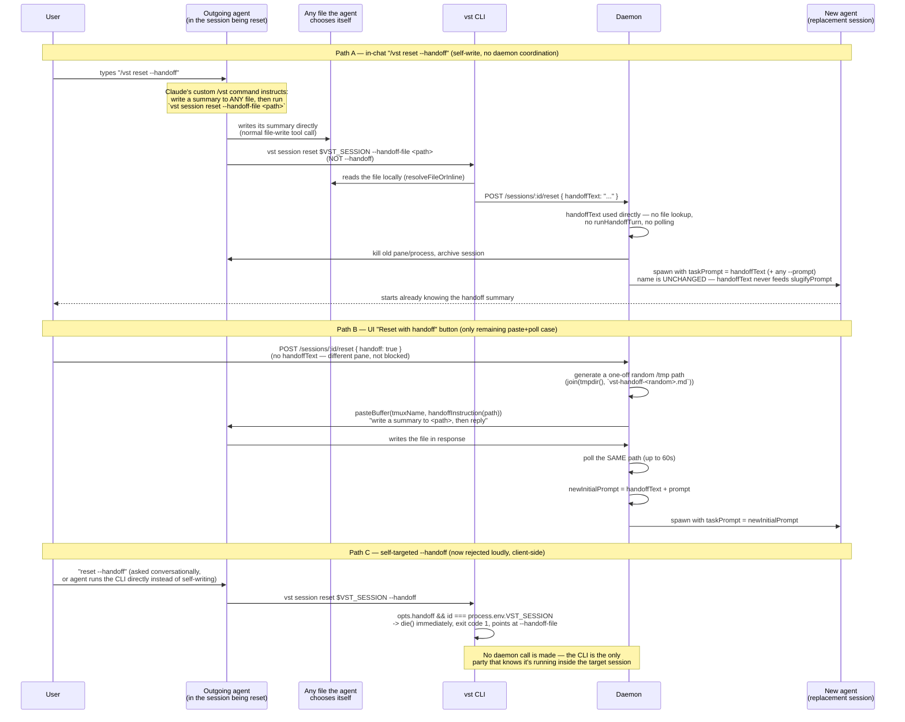

# Session reset `--handoff` flow (as currently implemented)

Rewritten after the `--handoff-file` redesign (see
`.vibekit/feature-plans/wip/session-tab-ux-fixes/plan-session-tab-ux-fixes.md`,
Phase 1). The old self-write flow relied on the daemon and the agent
independently agreeing on a fixed filesystem path (`.vibe-station/HANDOFF.md`)
with a 30s freshness window to disambiguate a fresh write from a stale
leftover — that coordination problem no longer exists. See
`daemon/src/services/handoff.ts` and the `POST /sessions/:id/reset` /
`POST /sessions/:id/handoff` handlers in `daemon/src/routes/sessions.ts`.

## Key facts

- The "send the summary as the new agent's initial prompt" behavior **already
  exists** and works automatically whenever `handoffText` is non-null:
  `daemon/src/routes/sessions.ts`'s reset handler builds
  `newInitialPrompt = [handoffText, prompt].filter(Boolean).join(...)` and
  passes it through as `taskPrompt` (`promptBuilder.ts`), which becomes the
  new agent's actual first message.
- `handoffText` and `prompt` are deliberately **separate** fields end to end
  (CLI flag, request body, route handling) — only `prompt` ever feeds
  `slugifyPrompt` for the new session's name. Reusing `--prompt-file` for a
  handoff summary would have produced a garbage session name; `--handoff-file`
  avoids that entirely.
- No env var and no `spawn.ts` changes anywhere in this design — the self-write
  path never needs the daemon to tell the agent a path; the agent picks its
  own and the CLI carries it over like any other `--*-file` flag
  (`cli/src/lib/text-source.ts`'s `resolveFileOrInline`, fail-loud on an
  unreadable file).
- The UI-driven paste+poll path (Path B) is the only remaining
  filesystem-based case. It generates a fresh random `/tmp` path per call and
  reads it back within the same request handler — "the file exists" is proof
  enough, no freshness window needed, since nothing else could ever have
  written to that exact random path.
- Path C fails **loudly** now: `vst session reset $VST_SESSION --handoff`
  exits non-zero with a message pointing at `--handoff-file`, before making
  any daemon call — no more silent 60s timeout producing a handoff-less reset.

## Status

All candidate follow-up fixes from the original investigation are implemented:
1. ~~Move the handoff file to a unique path under `/tmp`~~ — done for the one
   remaining filesystem-based case (Path B); the self-write case (Path A) no
   longer touches a daemon-known path at all.
2. ~~Make Path C fail loudly~~ — done via the CLI's client-side self-target
   guard in `cli/src/commands/session/reset.ts`.
