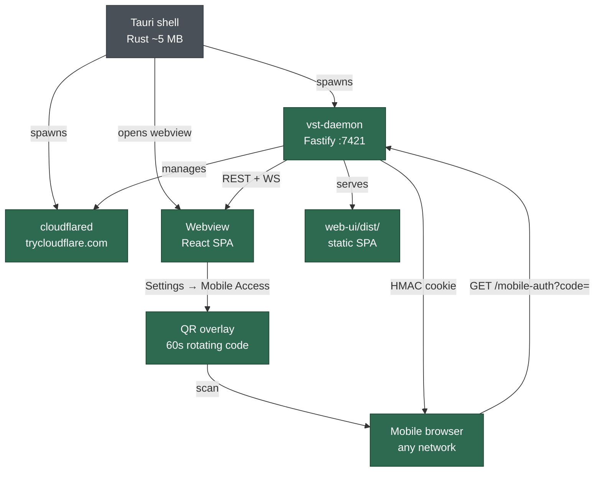
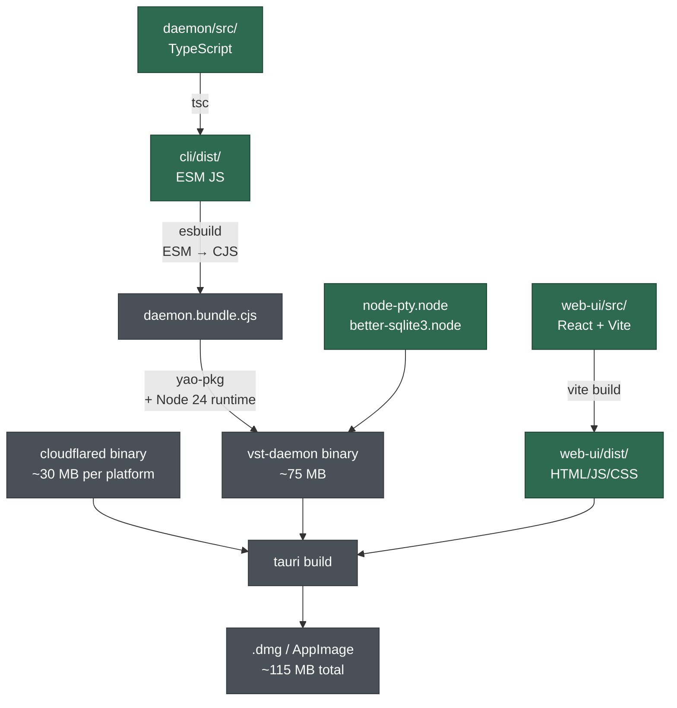

# Report: vibe-station desktop (Tauri) + mobile QR access plan

**Date:** 2026-09-02 · **Updated:** 2026-09-05 · **Commit:** 2f0aca5 · **Decisions:** Tauri v2 for desktop shell; Cloudflare Tunnel for mobile access (shipped)

> **Green boxes = already shipped. Grey boxes = still to build.**

---

## Answer

- **Mobile QR access: fully shipped** (`2f0aca5`) — cloudflared tunnel, one-time QR codes, session management, mobile-responsive settings UI, WS keepalive, static file serving in daemon. Nothing left to do here.
- **Desktop shell: not started** — Tauri v2 wrapper + daemon/cloudflared sidecar packaging is the remaining work.
- **cloudflared: bundle it in the Tauri app** (zero setup for users); keep PATH-based resolution for CLI users + add `vst doctor` check.

---

## What's shipped vs. what's left

| Area | Status | Commit |
|------|--------|--------|
| Cloudflare tunnel service (`cloudflared.ts`) | ✅ Shipped | 2f0aca5 |
| One-time QR code auth (`/auth/mobile-qr`, `/auth/local-qr`) | ✅ Shipped | 2f0aca5 |
| Mobile auth exchange (`/mobile-auth?code=`) | ✅ Shipped | 2f0aca5 |
| Session management (`/auth/sessions`, revoke) | ✅ Shipped | 2f0aca5 |
| Remote Access settings UI + QR overlay + countdown | ✅ Shipped | 2f0aca5 |
| Daemon serves `web-ui/dist/` as static files | ✅ Shipped | 2f0aca5 |
| SPA fallback route (`index.html` for all unknown routes) | ✅ Shipped | 2f0aca5 |
| WS server-side ping/pong keepalive | ✅ Shipped | 2f0aca5 |
| CORS open (`origin: true, credentials: true`) | ✅ Shipped | 2f0aca5 |
| Tauri desktop shell | ❌ Not started | — |
| Daemon standalone binary (esbuild → yao-pkg) | ❌ Not started | — |
| cloudflared bundled as Tauri sidecar | ❌ Not started | — |
| `vst doctor` cloudflared check | ❌ Not started | — |
| macOS notarization | ❌ Not started | — |
| CI build matrix (Mac arm64/x64, Linux x64) | ❌ Not started | — |

---

## Architecture

### Full system (green = shipped, grey = to build)



### Build + package pipeline



---

## Remaining work — Phase 1 (Tauri shell)

### 1. Daemon standalone binary

- Toolchain: `esbuild` (ESM → CJS) → `@yao-pkg/pkg` (embed Node 24 + extract `.node` addons to `/tmp`)
- `node-pty` and `better-sqlite3` have no Linux prebuilts — must compile from source in a Linux Docker container for Linux targets; Mac prebuilts exist
- Output: one binary per platform (`vst-daemon-aarch64-apple-darwin`, `vst-daemon-x86_64-unknown-linux-gnu`, etc.)
- Estimated size: ~75 MB per platform

### 2. cloudflared bundling

- **Tauri app:** bundle `cloudflared` static binary as a Tauri sidecar (`externalBin` in `tauri.conf.json`) — one per platform, downloaded in CI from Cloudflare's GitHub releases. Zero user setup; mobile QR just works.
- **CLI / bare daemon:** `cloudflared` resolved from PATH (already works today). Add to `vst doctor`:
  ```
  ✓ cloudflared is on PATH (required for mobile QR tunnel)
    → brew install cloudflared   OR   see https://developers.cloudflare.com/cloudflared/
  ```
- `daemon/src/services/cloudflared.ts` needs no changes for either path — already PATH-based with a clear `ENOENT` error.

### 3. Tauri shell (`desktop/`)

- Spawns `vst-daemon` sidecar; polls stdout for "listening on" to know it's ready
- Detects already-running daemon via `~/.vibe-station/config.json` (pid check) — reuses it instead of spawning a new one (supports CLI + app open at same time)
- Opens webview to `http://127.0.0.1:<port>` — port read from `config.json` after daemon starts
- **Daemon + cloudflared survive window close** — processes are detached, not killed on quit
- System tray: "Open vibe-station" / "Quit completely" (SIGTERM both)
- `tauri build` → `.dmg` (Mac) + AppImage + `.deb` (Linux)
- macOS entitlements: `com.apple.security.network.client` required for cloudflared subprocess to survive notarization sandbox

### 4. CI build matrix

| Job | Runner | Native addon build | Output |
|-----|--------|--------------------|--------|
| Mac arm64 | `macos-latest` (Apple Silicon) | prebuilts | `.dmg` |
| Mac x64 | `macos-13` (Intel) | prebuilts | `.dmg` |
| Linux x64 | Docker (`ubuntu:22.04`) | compile from source | `.AppImage` + `.deb` |

### 5. macOS notarization

- Requires Apple Developer account ($99/yr)
- `tauri build` supports notarization via `APPLE_CERTIFICATE`, `APPLE_ID`, `APPLE_TEAM_ID` env vars in CI
- Without notarization: users see "damaged app" Gatekeeper warning — cannot distribute without it

---

## Tauri vs Electron — final call

Given what's now shipped, the remaining shell is genuinely thin: spawn daemon, open webview, tray icon, detect existing daemon. **Tauri is still the right choice.**

| Factor | Assessment |
|--------|------------|
| xterm.js on WebKit | **Confirmed working** — user tested in Safari (same engine as Tauri on macOS) ✓ |
| xterm.js on WebKitGTK (Linux) | Still needs a smoke test in `epiphany` on Ubuntu 22.04 |
| Shell complexity | ~150 lines of Rust — thin enough that Rust overhead doesn't matter |
| Bundle size | ~115 MB (Tauri) vs ~200 MB (Electron) — Tauri still wins |
| Switch cost if needed | One day of work — React SPA and daemon are fully decoupled from the shell |

**Electron would only be the right call if** xterm.js Canvas is broken on WebKitGTK on Linux. Test that first; if it passes, proceed with Tauri.

---

## Unknowns remaining

| Unknown | How to verify |
|---------|---------------|
| xterm.js WebGL on WebKitGTK (Linux) | Run xterm.js in `epiphany` on Ubuntu 22.04 — 30 min experiment |
| `node-pty` + `yao-pkg` produces a working binary | `npx esbuild cli/dist/daemon/main.js --bundle --platform=node --outfile=bundle.cjs && npx @yao-pkg/pkg bundle.cjs --target node24-linux-x64` then run it |
| macOS sandbox allows cloudflared subprocess post-notarization | Add `com.apple.security.network.client` entitlement; test with a notarized build |
| cloudflared stdout URL format stability | Pin cloudflared version in CI download; `TUNNEL_URL_RE` in `cloudflared.ts` is fragile if format changes |

---

## Not checked

- Whether `window.__VST_PORT__` injection via Tauri's `initialization_script` fires before React hydrates
- Linux arm64 distribution (no CI job planned yet — add if there's demand)
