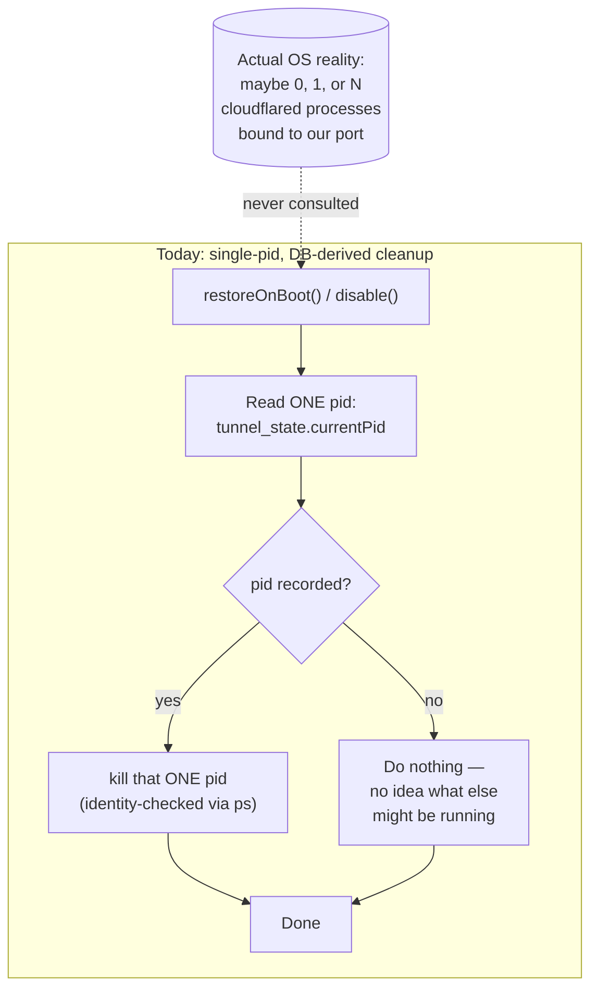
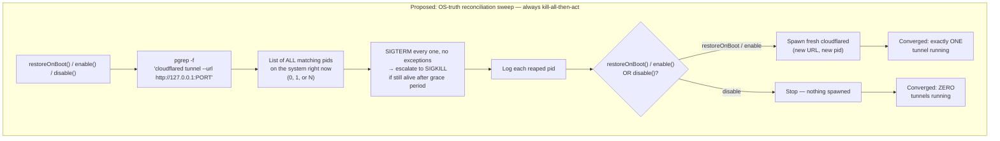

<!--
RULES — read before writing this report:
1. FORMAT: Bullets, tables, code, diagrams ONLY — no prose paragraphs
2. ANSWER FIRST: the finding goes at the top, before any evidence
3. EVERY CLAIM CITED: file:line, a command + its output, or a screenshot
4. READING TIME: optimize for fast human scanning — if it's hard to skim, rewrite it
-->

# Report: cloudflared orphan processes — root cause + proposed reconciliation sweep

**Date:** 2026-09-06 · **Commit:** `08e6924` (`feat(tunnel-persistence)`, merged to `main`, PR [#89](https://github.com/fastestdevalive/vibe-station/pull/89)) · **Scope:** live production investigation on this machine's actual running daemon — not a hypothetical; every process/DB fact below was captured directly, not simulated · **Method:** `ps`, `sqlite3` against `~/.vibe-station/vibe-station.db`, `git log -p` against the pre-PR `cloudflared.ts`, one `opus` subagent pass for the orphan root-cause trace

## Answer

- **Two live orphaned `cloudflared` processes were found and killed** (pids `412010`, `1805243`) — both predate PR #89 entirely, spawned by the old non-persisted code, which never used `detached` and had no DB to record a pid in. Confirmed dead; only the currently-tracked process (`1155210`) remains.
- **Root cause of the orphaning:** Node does **not** kill a child process when its parent dies on Linux — a child (detached or not) simply gets reparented to `init` (`PPID=1`, observed directly) and keeps running. The old `disable()` only ever killed an in-memory `ChildProcess` reference; any daemon death that skipped it (`SIGKILL` after `vst daemon stop`'s 5s timeout, an uncaught exception, a crash) left the OS process permanently unaddressable — no pid was ever written anywhere.
- **The current (post-PR) code narrows this a lot but doesn't close it structurally.** Cleanup is still single-pid and DB-derived (`tunnel_state` is a one-row table by design — `daemon/src/state/tunnel-store.ts:12`) — it can only ever kill the *one* pid it happens to remember, never enumerates what's actually running. Residual leak windows: a daemon crash in the ~10s between spawning cloudflared and persisting its pid (only written on successful URL scrape, `daemon/src/services/cloudflared.ts` `finishResolve`); a port change (stored but never compared); a spawn that produced a live process but never got its URL within the timeout.
- **`detached: true` is not the thing to change.** It doesn't affect orphan survival either way (proven by the very orphans this report is about — spawned *without* `detached` and they still survived). Removing it would be a regression: the daemon itself is deliberately spawned `detached` by the CLI (`cli/src/commands/daemon/start.ts:42-43`) specifically so it survives its launching terminal closing (`SIGHUP` to the foreground process group) — a non-detached cloudflared would inherit that same vulnerability.
- **Proposed fix:** a `pgrep`-based reconciliation sweep — treat the OS as the source of truth for "what's running," not the DB. Diagrams below.

## Evidence

| Claim | Source |
|-------|--------|
| Three `cloudflared` processes alive simultaneously before cleanup | `$ ps aux \| grep cloudflared` → pids `412010` (started `08:52` today), `1155210` (tracked, `13:43` today), `1805243` (started **Sep 5**, yesterday) |
| Both orphans reparented to `init`, not to any live daemon | `$ ps -eo pid,ppid,pgid,stat,lstart` → `412010`/`1805243` both `PPID=1`; `1155210` has `PPID=1141155` (the live daemon) and its own `PGID` (self-led group, the `detached` signature) |
| Old (pre-PR) `disable()` never persisted a pid anywhere | `$ git show 87c59c8:daemon/src/services/cloudflared.ts` — module-level `state.process` only, no DB, no `detached` flag on the `spawn()` call |
| Old `child.on("exit")` cleared `state.process` **unconditionally**, no identity guard | `87c59c8:...cloudflared.ts:84-85` — a late exit event from a superseded child could null out a newer child's handle, making the newer one unkillable by `disable()` even while the daemon kept running |
| `vst daemon stop`/`restart` signal only the single daemon pid, escalating to `SIGKILL` after 5s | `cli/src/commands/daemon/stop.ts:30,56-59`; `restart.ts:13` reuses the same `stopDaemon()` |
| Uncaught exceptions bypass the graceful shutdown handler entirely | `daemon/src/main.ts:118-129` rethrows anything but `EPIPE`/`ECONNRESET`; `shutdown()` is wired only to `SIGINT`/`SIGTERM` (`main.ts:221-222`) |
| Current cleanup is single-pid/DB-derived — only process-inspection call in the whole daemon is a single-pid identity check | `$ grep -rn 'pgrep\|pkill\|"ps"' daemon/src cli/src` → only hit is `execFileSync("ps", ["-o","comm=","-p", pid])` in `isLikelyCloudflaredProcess()`, `cloudflared.ts` |
| Both orphans confirmed dead after cleanup | `$ kill 412010 1805243 && ps -p 412010 -p 1805243` → no such process; `$ ps aux \| grep cloudflared` → only `1155210` remains |
| The daemon itself is spawned `detached: true` by the CLI, same as cloudflared | `cli/src/commands/daemon/start.ts:42-43` |

## Diagrams

### Today — trust the DB, never verify against reality

- `tunnel_state` is a **one-row table by construction** (`ROW_ID = 1`, `tunnel-store.ts:12`, upsert-only) — the system cannot even *represent* "there might be more than one," let alone find them
- Anything the DB didn't personally spawn and successfully record is invisible forever — exactly what happened to `412010` and `1805243`

### Proposed — reconcile against the OS, not the DB

> Corrected from the first draft of this diagram: the sweep always runs **before** any new spawn, so there is never an existing process to "keep" — it kills everything it finds, unconditionally, every time. Since a fresh boot / fresh `enable()` always mints a brand-new URL anyway (the whole point being every previous URL is invalidated by that act), there's nothing worth preserving at sweep time — no conditional "is this mine" branch needed at all.

- Matches on the **full argv including our port**, so a user's unrelated, manually-run `cloudflared` (different named tunnel, different port) is never touched
- Runs at **every** entry point that changes tunnel state — `restoreOnBoot`, the explicit `enable()` route, and `disable()` — same rule everywhere: "about to have a tunnel → sweep, then spawn. About to have no tunnel → sweep, then stop."
- Sweep always precedes the spawn, never follows it — no window where old and new tunnels are briefly both alive, and no exclusion logic needed since the new process doesn't exist yet when the sweep runs
- Escalates to `SIGKILL` after a grace period — today's `SIGTERM`-and-hope is never re-verified
- Additive, not a replacement: the existing single-pid persistence + `ps -o comm=` identity check stay exactly as-is; the sweep is a second, broader pass that stops depending on the DB being complete

## Not implemented

This report is diagnosis + design only, per this session's request — the sweep described above has not been written into `daemon/src/services/cloudflared.ts`.
