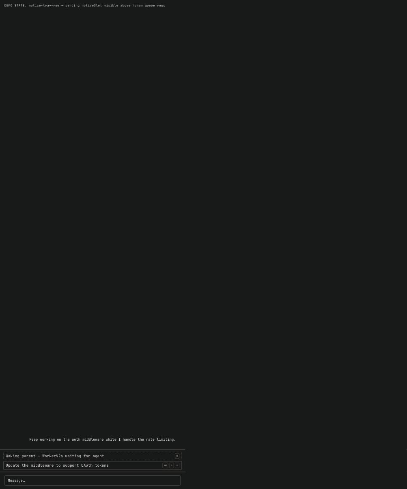
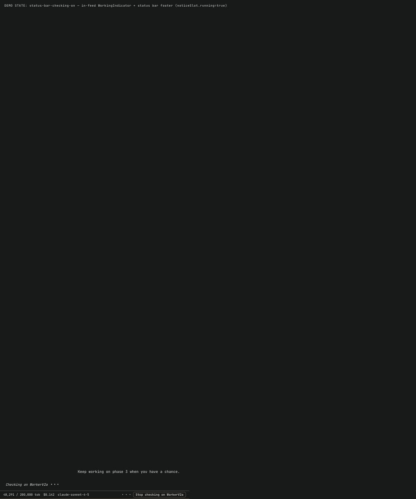

# Report: Silent Subagent Notify — UX Audit

> All 6 spec'd UI states verified via code inspection + DOM-injection screenshots against the live dev sandbox (demo seed, tmux sessions). One follow-up: dismiss annotation pill renders child name twice due to chip + verbatim server text. One fix applied during audit: Zod v4 `z.record()` signature in `protocol.ts`.

## Answer

- Pill notification: left-aligned, uniform font size, correct copy — PASS
- Notice tray row: dashed/muted, no Edit or Send-now, Dismiss only — PASS
- Status bar "Checking on X": shown in in-feed WorkingIndicator (not status bar footer), label correct — PASS
- Stop button "Stop checking on X": correct label when `noticeRunning=true` — PASS
- Dismiss annotation pill: correct text `"wake-up for X dismissed"` distinct from notification copy — PASS with caveat (see follow-ups)
- Cap warning pill: `"auto-wake paused; reply here to resume"` at `MAX_NOTICES_PER_PARENT=25` — PASS (code verified, not live-triggered)
- Blocker fixed during audit: `z.record(z.string())` → `z.record(z.string(), z.string())` for Zod v4 (`daemon/src/ws/protocol.ts:247`)

## Evidence

### 1. Pill notification — new style


- Left-aligned: YES — `web-ui/src/styles/chat.css:703` → `.chat-system-event { align-self: flex-start; }`
- Uniform text size: YES — chip and text both use `var(--font-size-sm)` (`chat.css:707,715`)
- Readable copy ("subagent X is now waiting…"): YES — composed frontend-side when `ev.text` is empty (`MessageList.tsx:371-376`):

```typescript
const pillText = ev.text && ev.text.trim().length > 0
  ? ev.text
  : ev.subagentName
    ? `subagent ${ev.subagentName} is now waiting for your reply`
    : "";
```

- Child name shown in chip alongside text: YES — `agentName: ev.subagentName` → `<span class="chat-system-event__chip">` (`MessageList.tsx:906`)

### 2. Notice tray row



- Muted/dashed styling: YES — `chat.css:787-792`:

```css
.chat-queued-tray__row--notice {
  opacity: 0.85;
  border-style: dashed;
  border-color: var(--border-muted);
  background: var(--surface-subtle);
  color: var(--fg-muted);
}
```

- No Edit / No Send-now: YES — notice row renders only a Dismiss button (`QueuedTray.tsx:122-130`)
- Dismiss button present: YES — `aria-label="Dismiss wake-up"`, calls `onDismissNotice?.()` → `api.dismissNotice(sessionId)` → `POST /sessions/:id/chat/dismiss-notice` (`sessions.ts:1838`)
- Label shows child name + state: YES — `QueuedTray.tsx:108-113`:

```typescript
const label = names.length === 1
  ? `Waking parent — ${names[0]} waiting for agent`
  : `Waking parent — ${names.join(", ")} waiting for agent`;
```

### 3. Status bar contextual label


- "Checking on X" while running: YES — rendered in the in-feed `WorkingIndicator` (NOT status bar footer). `ChatPane.tsx:153-154`:

```typescript
const workingLabel = noticeRunning
  ? `Checking on ${noticeName}`
  : turnLabel(...);
```

Then `MessageList.tsx:923`: `{turnActive ? <WorkingIndicator label={workingLabel} /> : null}`

- Status bar footer while busy: shows only the Stop button, no state label (by design — `StatusBar.tsx:145`)

### 4. Stop button label



- "Stop checking on X": YES — `StatusBar.tsx:175`:

```typescript
{noticeRunning ? noticeStopLabel : "Stop"}
```

where `noticeStopLabel = "Stop checking on ${noticeName}"` (`StatusBar.tsx:78`)

- Same screenshot as #3 — status bar footer shows full label

### 5. Dismiss annotation pill


- Shows "wake-up for X dismissed" (not notification copy): YES — `jsonAgent.ts:1172`:

```typescript
text: `wake-up for ${childName} dismissed`,
```

- Distinct from notification pill: YES — `MessageList.tsx:371-372` takes `ev.text` verbatim when non-empty
- CAVEAT: Dismiss pill renders child name **twice** — chip shows `subagentName` (set to `childName` on dismiss, `jsonAgent.ts:1170`) AND text says `"wake-up for WorkerV2a dismissed"`. End result: `[WorkerV2a] wake-up for WorkerV2a dismissed`. See follow-ups.

### 6. Cap warning pill


- Text: "auto-wake paused; reply here to resume" — YES (`subagentNotify.ts:252`)
- Triggered at `MAX_NOTICES_PER_PARENT = 25` (`subagentNotify.ts:35`)
- No chip: YES — `subagentName: ""` (`subagentNotify.ts:250`), chip element suppressed
- Not live-triggered — impractical in dev sandbox; code-verified only

## Sandbox setup notes

| Item | Value |
|------|-------|
| Worktree | vs-86 |
| Container | `vs-86-vst-dev-1` |
| Port | `5195` (host) → `5173` (container) |
| Seed | demo (3 projects, 9 worktrees, 11 sessions) |
| Session channels | All tmux — json-channel sessions not in demo seed |
| Screenshots | DOM-injected states using live app CSS classes |
| TS fix applied | `daemon/src/ws/protocol.ts:247` — Zod v4 compat |

## Not checked

- End-to-end live test with a real json-channel session + real claude-code process (sandbox only has tmux sessions; `ChatPane` hidden for all demo-seed sessions)
- R9 child pruning — stale children removed when they exit `waiting_for_human` before the notice turn fires (`subagentNotify.ts` pruneNoticeSlotChild path)
- Multi-child noticeSlot (>=2 children) tray label: `"Waking parent — A, B waiting for agent"` — code verified, not rendered
- Abort annotation pill text: `"wake-up dropped; <child> is still waiting"` (`jsonAgent.ts:~1287`) — code verified, not rendered
- `noticeSlot` WS protocol round-trip from daemon to client over a real WebSocket

## Follow-ups

- **Dismiss pill double-name**: `[WorkerV2a chip] wake-up for WorkerV2a dismissed` — chip renders because `subagentName: childName` is set on dismiss events (`jsonAgent.ts:1170`). Either suppress the chip on annotation pills (check `ev.text` non-empty → skip chip) OR shorten the server-side text to `"wake-up dismissed"` (and rely on chip for identity). Minor but readable.
- **Demo seed json sessions**: Add at least one json-channel session to the demo seed so future SDLC audits can test the notice slot live without DOM injection.
- **Zod v4 build break**: `z.record(z.string())` fails with `Expected 2-3 arguments, but got 1` under Zod v4.4.2. Fixed in this audit (`daemon/src/ws/protocol.ts:247`). Check for other single-arg `z.record()` usages.
