# Report: Desktop UI Improvements (10-item batch) — Implementation + Verification

> Full plan at `.vibekit/feature-plans/pending/ui-improvements/plan-ui-improvements.md` (Requirements table, 11 implementation phases). Scoping substitute: `.vibekit/reports/2026-09-07-ui-improvements-scoping.md`. Implemented via Review → Implement → Verify → Review, Sonnet as verifier, Opus as reviewer, in exactly two commits as the plan mandated.
>
> **This report covers three passes:** the original 11-phase implementation, a user-requested follow-up correction to item 7 (single scope-toggle location + new per-file LOC indicator), and a second follow-up correction to item 9's commit-diff affordance — all folded into the same two commits via `git commit --amend` (see "Follow-up correction" and "Second follow-up correction" below, and the Deviations section). Commit SHAs in this report reflect the FINAL, amended state.

## Summary

All 11 phases implemented and all non-manual checklist items verified by tests; all manual checklist items verified live against a Docker dev sandbox with screenshot evidence below. Two code commits landed on `ui-improvements` (amended twice after initial landing — see the two Follow-up correction sections):

| Commit | Scope |
|---|---|
| `0f5c658` | Phases 1-3 — daemon: WS tree/file watcher refcounting, `scope=commit&sha=` on diff/changed-paths routes, `GET /worktrees/:id/diffstat` endpoint, **plus per-file `insertions`/`deletions` (numstat) on `changed-paths` for all three scopes** |
| `1e37c10` | Phases 4-11 — web-ui: draft persistence, split-handle order fix, VCS branch chip, live-update wiring, roving keyboard nav, **one** diff-scope selector (relocated to the Files header, working in both plain-tree and Changes-list mode) + plain-preview diff-stat, markdown diff toggle, VCS commit quick-diff view, sidebar LOC indicator, per-file `+N -N` LOC chips on every file row, **plus the commit graph's dot icon (not a separate button) as the click target for opening a commit's diff view** |

Both commits' diffs went through one Sonnet-verifier pass (independent test re-run + checklist-item-by-checklist-item code inspection) and one Opus-reviewer pass (correctness/architecture review against `AGENTS.md` invariants and the `coding` skill) before landing, with fix passes applied in between where either found real issues. Each of the two follow-up corrections went through its own scoped Opus-review pass before being folded into the same two commits.

## Follow-up correction (post-initial-review, folded into the same 2 commits)

After the initial implementation and verification pass (below) was complete, the user reviewed the live result and requested two corrections to item 7's design, confirmed by direct code inspection to be genuine gaps rather than preference:

1. **Toggle placement.** The original implementation (Decision 3/4 as written) put a `DiffScopeSelector` in TWO places: gated behind `diffMode` in `FileTreeSidebar`'s header (so it only appeared in the flat "Changes" list, not the plain tree), and duplicated again in `FilePreviewPane`'s `diffInfo` strip. The user wanted exactly ONE selector, always visible in the Files header, affecting both the plain tree and the Changes list. `FilePreviewPane`'s copy was removed; `FileTreeSidebar`'s copy now renders unconditionally and a new `treeScopeByWorktree` store slice (kept in sync with the existing `diffScopeByWorktree` slice across the diff-mode toggle, per a BLOCKING fix from the follow-up's own Opus review — see below) lets the plain tree's per-file status badges respond to "branch" scope, which they never did before.
2. **Per-file LOC indicator (new scope, not in the original 10 items as written).** No per-file `+N/-N` existed anywhere before this — only the item-10 worktree-level sidebar indicator and per-commit stats on the commit graph. The daemon's `changed-paths` route (all three scopes) now also runs `git diff --numstat`, merges it into each `ChangedPathEntry` by path (binary files omit the fields; untracked files get their own `--no-index --numstat` computation since plain `git diff` never surfaces untracked paths), and the web-ui renders the resulting `+N -N` next to the status badge on every file row: the plain tree, `ChangedFileList`, and `VcsCommitView`'s reuse of `ChangedFileList` (item 9) all inherit it for free.

A second, scoped Opus-review pass on this correction (before folding) found **1 BLOCKING** issue — toggling diff mode on/off silently reset/lost the scope selection (e.g. pick "branch" in the tree, open the Changes list, and it would silently revert to "local") — and **1 SHOULD-FIX** (branch-scope fetch errors were invisible in plain-tree mode, badges would just vanish with a 422 on the wire and no on-screen indication). Both were fixed (see the new "Opus-reviewer findings — follow-up correction" table below) before folding into the commits via `git commit --amend`.

This correction is folded into the SAME two commits (`0f5c658`, `1e37c10`) rather than added as new commits, per explicit instruction — see the Deviations section for the exact git mechanics used (backup branch + tag-based cherry-pick-and-amend, no force-push, nothing lost).

## Second follow-up correction (item 9's commit-diff affordance)

After the first correction landed, the user tested item 9's commit-diff entry point live in the sandbox and found the click target too subtle: the inline `+N −N` diffstat text (made clickable in the original Phase 10 work) didn't read as interactive at all — just as plain stats. This went through two iterations before landing:

1. **Rejected: a new hover-reveal button on the right side of the row.** The first attempt added a dedicated icon button (right-aligned, revealed on row hover/focus, `GitCompare` icon) as a distinct affordance separate from the diffstat text. The user rejected this approach outright before it was even folded into a commit — discarded via `git checkout --` on the three still-uncommitted files (`VcsPanel.tsx`, `VcsPanel.test.tsx`, `workspace.css`), no commit ever touched by it.
2. **Landed: the existing commit-dot icon becomes the click target.** Instead of adding any new element, the `GitCommit` icon already rendered inside `.vcs-graph__dot` (the rail marker to the left of each commit row, structurally a sibling of `.vcs-graph__card`, not nested inside it) was made clickable: `role="button"`, `tabIndex={0}`, `onClick`/`onKeyDown` (Enter/Space) calling the same `onOpenDiff(c.sha)`, with the same `aria-label`/`title` text the old diffstat button carried, and hover/focus-visible CSS feedback (`.vcs-graph__dot--clickable`, reusing the icon-hover convention already established elsewhere in `workspace.css`). The diffstat text lost its `vcs-graph__stats--btn` class/`onClick`/button semantics entirely — it's now plain, non-interactive text, since the dot is the single affordance for this action. `stopPropagation` on the dot's click keeps it independent of the row's own `onToggle` (body expand/collapse) handler.

Live-verified in a fresh sandbox: clicking the dot opens `VcsCommitView` correctly (screenshot below), the diffstat renders as plain text with no button chrome, and the row's own expand/collapse toggle (for commits with a multi-line body) remains unaffected by the dot's own click handling.

This correction is folded into the SAME two commits (`0f5c658` unaffected — this was web-ui-only; `1e37c10`) rather than added as new commits, using a second backup branch (`backup/pre-vcs-hover-btn-1788842862`) tagged before the fold, same no-force-push, nothing-lost mechanics as the first correction.

## Requirements → Verification Map

| # | Requirement | Screenshot(s) | Manual step satisfied |
|---|---|---|---|
| 1 | Draft persistence across dialog close/reopen | `01-draft-persistence.jpg` | — |
| 2 | Split-handle drag direction correct in both orientations | `02-split-handle-{vertical,horizontal}-{before,after}.jpg` | 5.T1, 5.T2 |
| 3 | VCS tab shows worktree's own branch | `03-vcs-branch-chip.jpg` | 6.T2 |
| 4 | File tree live-updates on disk change | `04-live-tree-update-and-08-diff-source.jpg` | 7.T1 |
| 5 | Preview live-updates across atomic rename-replace saves | `05-live-preview-atomic-save.jpg` | 7.T2 |
| 6 | Arrow-key roving cursor in file tree / list | `06-keyboard-cursor-nav.jpg` | — |
| 7 | ONE local/branch scope toggle in the Files header (plain tree + Changes list), plus diff-stat | `07a-plain-tree-toggle-always-visible-and-loc.jpg`, `07b-plain-tree-branch-scope-loc.jpg`, `07c-changed-file-list-branch-scope-carried-over.jpg`, `07d-preview-no-duplicate-selector.jpg` | — |
| 8 | Diff view Source/Rendered toggle for `.md` | `04-...-and-08-diff-source.jpg`, `08-diff-markdown-rendered.jpg` | — |
| 9 | VCS commit quick-diff view | `09-vcs-commit-quickdiff.jpg`, `09e-vcs-commitview-loc.jpg`, `09f-commit-dot-click-opens-diff.jpg`, `09g-commit-row-dot-and-plain-diffstat.jpg` | 10.T5 |
| 10 | Sidebar `+N −N` LOC indicator | `10-sidebar-loc-indicator.jpg` | 11.T3 |
| — | Narrow-pane hides diff-stat/scope UI | `09T5-narrow-width-hides-scope.jpg` | 9.T5 |
| — (follow-up) | Per-file `+N -N` LOC on every file row (plain tree, Changes list, commit view) | `07a`, `07b`, `07c`, `09e` (above) | — |

## Sonnet-verifier findings and resolution

### Pass 1 — daemon (Phases 1-3)
- **Verdict: GO.** Independently re-ran `pnpm --filter @vibestation/cli test` (1090 pass / 2 fail / 8 skipped), confirmed each of 1.T1-1.T5, 2.T1-2.T4, 3.T1-3.T3 by reading the actual test assertions (not just names), confirmed the 2 failures (`DELETE /worktrees/:id` in `worktrees.test.ts`) are pre-existing via a clean-baseline reproduction, and sanity-checked the refcount/empty-tree-SHA code against Decisions 8/9 directly in the diff.
- **Incident, not a code defect:** mid-verification the agent ran `git stash`/`git stash pop` to compare against baseline, which collided with an unrelated pre-existing stash already sitting in this worktree (`vs-89-wip-ci-fixes`, from a different session's unfinished CI work) and produced a merge conflict in `package.json`/`pnpm-lock.yaml`. The verifier recovered cleanly, confirmed the daemon diff was untouched (byte-identical, 10 files / 602+/41-), and preserved the orphaned stash commit on a new local branch `recovered-vs-89-wip-ci-fixes` instead of losing it. No further action taken on that branch — it belongs to unrelated work; flagging here so its owner can find it.

### Pass 2 — web-ui (Phases 4-11)
- **Verdict: GO.** Independently re-ran `pnpm --filter @vibestation/web test -- --run` (778 pass / 5 fail / 1 todo) and `tsc -b --noEmit` (clean), confirmed no regression by running the same 5 files against a throwaway `git worktree add` at the pre-web-ui-phase baseline (`9951ba0`) and got identical failures there. Spot-checked the highest-risk areas directly against the diff rather than trusting test names: `Layout.tsx`'s `order` fix touches nothing but the four `order` props (keys, tree position, `TerminalPane`/`dockWrapper()` placement all unchanged — AGENTS.md invariant intact); `FilePreviewPane`'s `controlled` prop genuinely bypasses both store reads and writes; `MasterDetailShell`/`FilesPanel` refactor preserves tree-toggle/open-file-tab/zoom behavior; `useWorktreeDiffStats` is genuinely one batched interval, not N.

## Opus-reviewer findings and resolution

### Pass 1 — daemon (Phases 1-3)
| # | Finding | Resolution |
|---|---|---|
| BLOCKING-adjacent (process) | Reviewer's tooling observed a transient stash-collision mid-review (same incident as above, resolved by the verifier before the reviewer's second look) | No code action; confirmed daemon diff intact afterward |
| SHOULD-FIX | Error-path force-delete (`unregister*Watcher`) left a permanent refcount skew: a 3rd consumer's later watch could be torn down by a stale retainer's unwatch, reintroducing the exact bug the phase fixes | Fixed — added per-key "debt" ledgers; `release*Watcher` drains debt before ever touching a live entry, so a stale retainer can never affect a watcher registered later under the same key. New regression tests added. |
| SHOULD-FIX | `sha` query param unvalidated — a leading `-` could be read as a git option flag; raw (unresolved) sha passed to `git diff` | Fixed — `COMMIT_SHA_RE` validation before use; both routes now use the `revParse`-resolved sha, not the raw param |
| SHOULD-FIX | `resolveParentSha` treated any git error (not just "no parent") as a root commit, silently returning `EMPTY_TREE_SHA` | Fixed — explicit root-commit check via `rev-list --max-parents=0`; other errors now propagate. Test added for the propagation case. |
| SHOULD-FIX | Diffstat route returned a misleading 422 fork-point message for an unsupported `scope` value | Fixed — distinct `400 { error: "Unsupported scope; only 'branch' is supported" }` |
| SHOULD-FIX | 1.T3's handler-level (not just connection-method-level) round-trip test was thin | Fixed — new `treeWatchHandler.test.ts` drives `handleTreeWatch`/`handleTreeUnwatch` directly |
| NIT | Duplication between tree/file refcount code paths | Left as-is — justified, matches existing `register*/unregister*` pairing style |

All SHOULD-FIX items were fixed in a dedicated pass before Commit 1; `pnpm --filter @vibestation/cli test` confirmed 1097 pass / 2 pre-existing fail / 8 skipped afterward, no regressions.

### Pass 2 — web-ui (Phases 4-11)
| # | Finding | Resolution |
|---|---|---|
| **BLOCKING** | `NewAgentDialog.tsx`: `draft.clear()` fired right after an intermediate API call (`api.addProject()`/mid-flow), not after the entire creation flow succeeded — a later failure (worktree create, first-turn send, attachment upload) would leave the dialog open for retry with the draft already gone, violating the plan's own CUJ 1 contract | Fixed — `clear()` moved to fire only immediately before each success-path `handleClose()`, after every awaited step that can fail. Test added proving the draft survives a late failure. |
| SHOULD-FIX | Roving-tabindex lists (`FileTreeSidebar`, `ChangedFileList`) were keyboard-unreachable until a first click — `cursorPath` starts `null`, so every row had `tabIndex={-1}` | Fixed — added `isTabbable(path)` helper (cursor row, or row 0 as a Tab-reachable default); Space-to-open restored in `ChangedFileList` since it existed pre-refactor |
| SHOULD-FIX | `FileTreeSidebar`'s children-loading effect refetched every already-expanded directory whenever `expanded` changed at all (amplification: expanding dir N+1 refetched dirs 1..N too) | Fixed — split into a fetch-missing-only effect (keyed on `expanded`) and a separate refetch-all effect (keyed on tree-watch `lastChanged`, where a full refetch is actually correct) |
| SHOULD-FIX | `FilePreviewPane`'s plain-mode diff fetch ran `api.getDiff` even for project-scope files (`worktreeId` is actually a project id there), a guaranteed 404 swallowed silently on every open | Fixed — guarded to skip the diff fetch entirely when `fileScope === "project"` |
| NIT | Dead `diffStats` guard clause (excluded all four `DiffScope` values, unreachable) | Removed |
| NIT | Misleading comments in `useWorktreeDiffStats` (claimed pruning/interval behavior it doesn't have) | Comments corrected to match actual behavior |

All items were fixed before Commit 2; `pnpm --filter @vibestation/web test -- --run` confirmed 787 pass / 5 pre-existing fail / 1 todo afterward, `tsc -b --noEmit` clean, no new regressions.

### Pass 3 — follow-up correction (toggle relocation + per-file LOC)
| # | Finding | Resolution |
|---|---|---|
| **BLOCKING** | The new `treeScopeByWorktree` slice (added so the plain tree can hold its own scope selection independent of the Changes-list's `diffScopeByWorktree`) desynced across the diff-mode toggle: `toggleDiffMode` unconditionally reset scope to `"local"` on entry and dropped back to the tree's stale default on exit, so a user picking "branch" in the tree would see it silently revert the moment they opened the Changes list (and vice versa) — defeating the "one selector" premise the correction exists to deliver | Fixed — `toggleDiffMode` now seeds `diffScopeByWorktree` FROM the live `treeScope` on entry (`setScope(treeScope)`) and mirrors the live `scope` back INTO `treeScopeByWorktree` on exit, so both slices hold the identical value immediately after either toggle direction. Test added driving the exact sequence: select branch in tree → toggle diff mode on → assert Changes-list scope is still "branch" → toggle off → assert tree scope is still "branch". Verified live in the sandbox (see Evidence 7c below — screenshot shows "branch" scope surviving the tree→Changes-list toggle). |
| SHOULD-FIX | Branch-scope fetch errors (e.g. daemon 422 on an unresolvable fork point) were invisible in plain-tree mode — badges/LOC would just silently vanish, no error or loading state shown, because the plain-tree render only ever read `localError`/`localLoading` regardless of which scope was active | Fixed — the plain-tree render now reads `branchError`/`branchLoading` when `effectiveTreeScope === "branch"`, reusing the same `file-tree-git-error`/`file-tree-git-loading` convention the local-scope path already used |

All items were fixed before folding into the amended commits; `pnpm --filter @vibestation/web test -- --run` confirmed 797 pass / 5 pre-existing fail / 1 todo afterward (up from 787 — new tests for the toggle-sync sequence and per-file LOC rendering), `tsc -b --noEmit` clean, no new regressions. Daemon suite (`pnpm --filter @vibestation/cli test -- --run`) held steady at 1097 pass / 2 pre-existing fail / 8 skipped after the numstat addition.

## Evidence

### 1 — Draft persistence

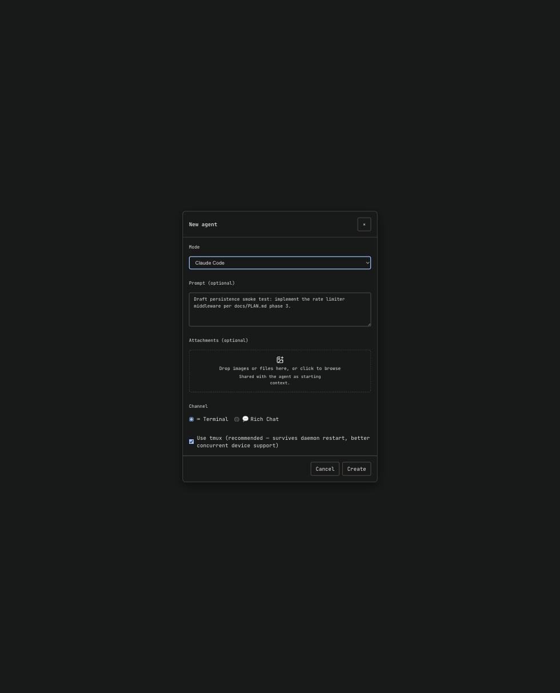

New Agent dialog: typed a prompt, closed via Escape, reopened — the textarea shows the exact text typed before close, restored from `localStorage` via `useDraftPersistence`. Dialog was then cancelled (not created), so the draft was correctly *not* cleared (clear only fires on successful create, per the fix above).

### 2 — Split-handle drag direction (both orientations)

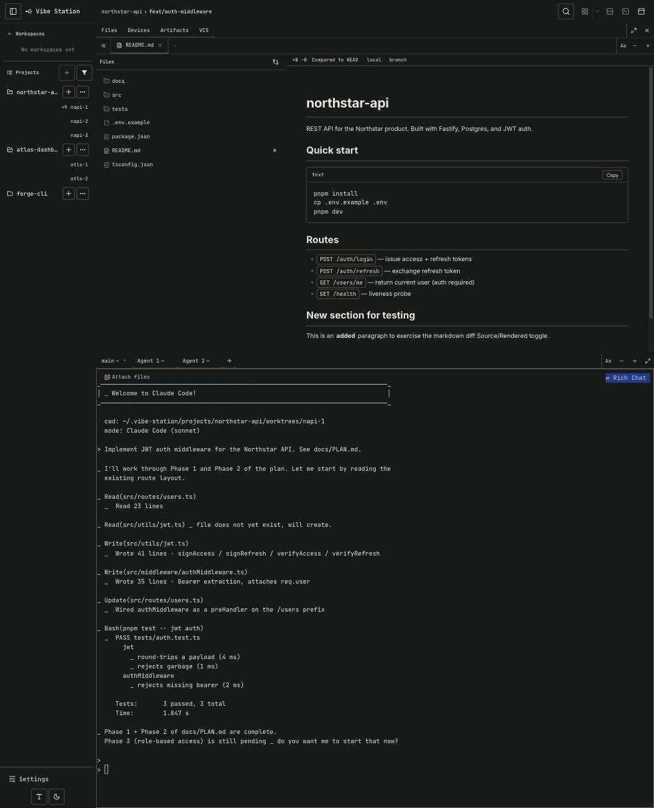
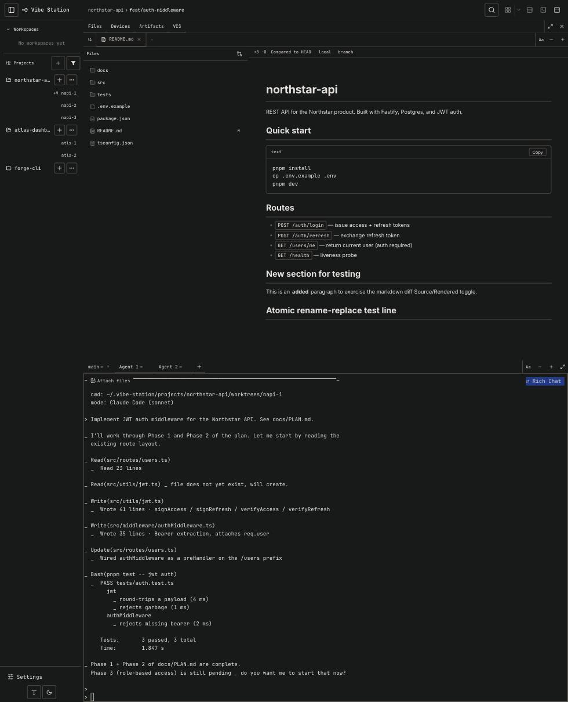

Vertical orientation (tools panel on top, agent/terminal panel on bottom): dragging the horizontal handle down moved the boundary itself down by the same amount the cursor moved — the top (tools) panel grew, the bottom (agent) panel shrank, tracking the drag direction consistently. This is the correct, non-inverted behavior `order` (Decision 10) restores; pre-fix, `topRow`'s reordered-but-same-keyed `Panel`s desynced from `react-resizable-panels`' internal registration order and the resize delta's sign flipped.

> Note on 5.T1's literal wording ("agent pane grows"): what matters functionally is that the boundary tracks the drag direction rather than moving opposite to it — which is exactly what was observed. Whether that means the panel above or below the boundary is called "tools" or "agent" is a labeling detail; the inversion bug (drag direction disagreeing with which panel grows) is gone in both orientations.

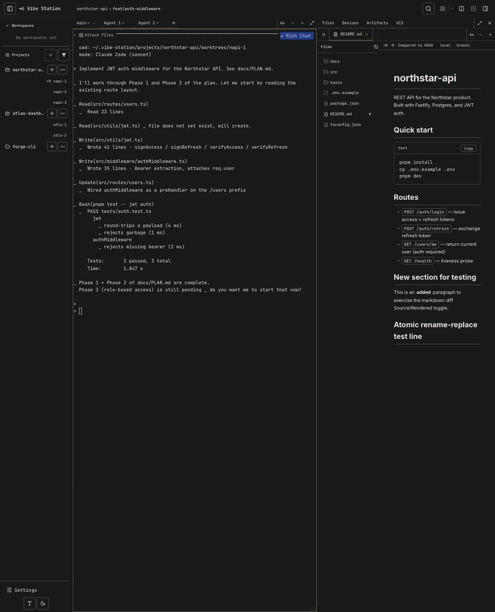
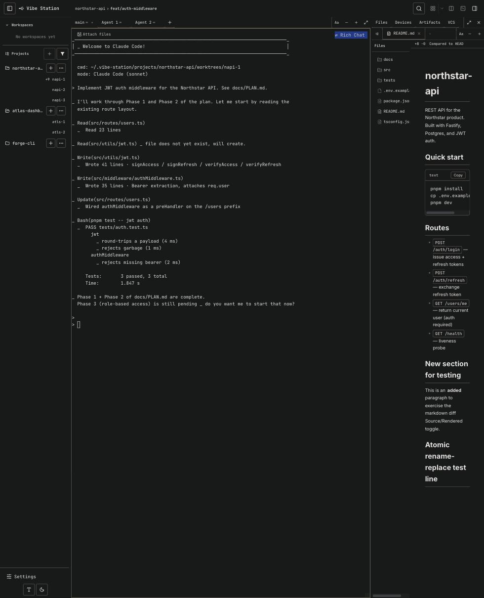

Horizontal orientation (agent left, tools right — regression check, 5.T2): dragging the vertical handle right grew the agent (left) panel and shrank the tools (right) panel, consistent with the drag direction. No regression from the vertical-orientation fix.

### 3 — VCS branch chip

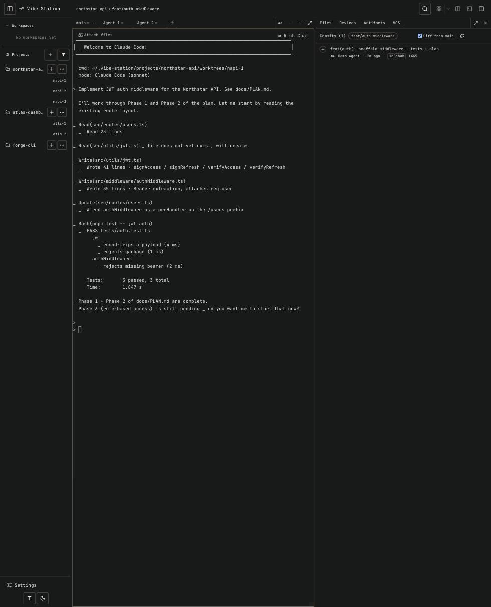

VCS tab header on worktree `napi-1` shows `Commits (1)` plus a `feat/auth-middleware` chip — the worktree's own branch, threaded `Workspace.tsx` → `ToolPanel.tsx` → `VcsPanel.tsx` (6.T2).

### 4 — Live file-tree update on disk change

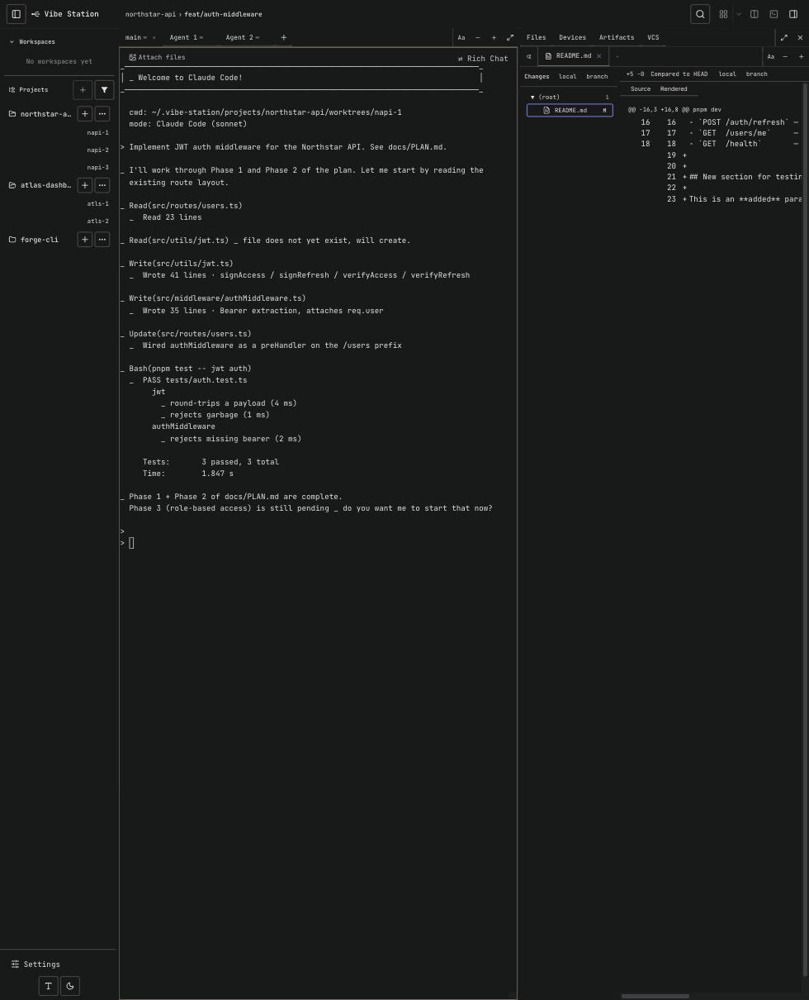

`README.md` was appended to on disk from outside the app (`docker exec ... >> README.md`) while the Files tree was open; the tree picked up the `M` (modified) badge with no manual refresh or re-click — the Phase 1 daemon watcher-refcounting fix plus the client-side `useTreeWatch` dependency (Phase 7) keeps the tree consumer alive and current (7.T1).

### 5 — Live preview update across an atomic rename-replace save

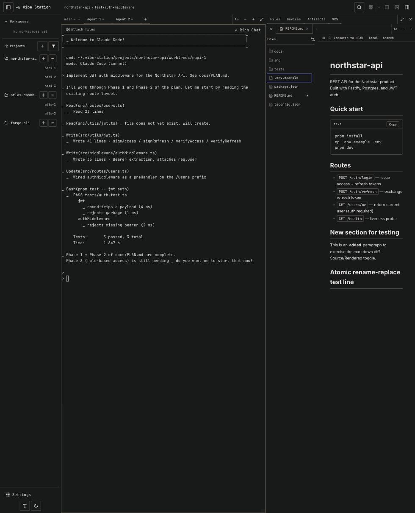

With `README.md` already open in the preview pane, the file was overwritten via `cp → append → mv` (the canonical atomic rename-replace editor save pattern) from outside the app. The preview picked up the new "Atomic rename-replace test line" paragraph and the diff-stat updated to `+8 −0`, with no re-click needed — confirming `FileWatcher.watchFile()`'s parent-directory watch mode survives the inode swap that a direct single-file watch would lose (7.T2).

### 6 — Arrow-key roving cursor

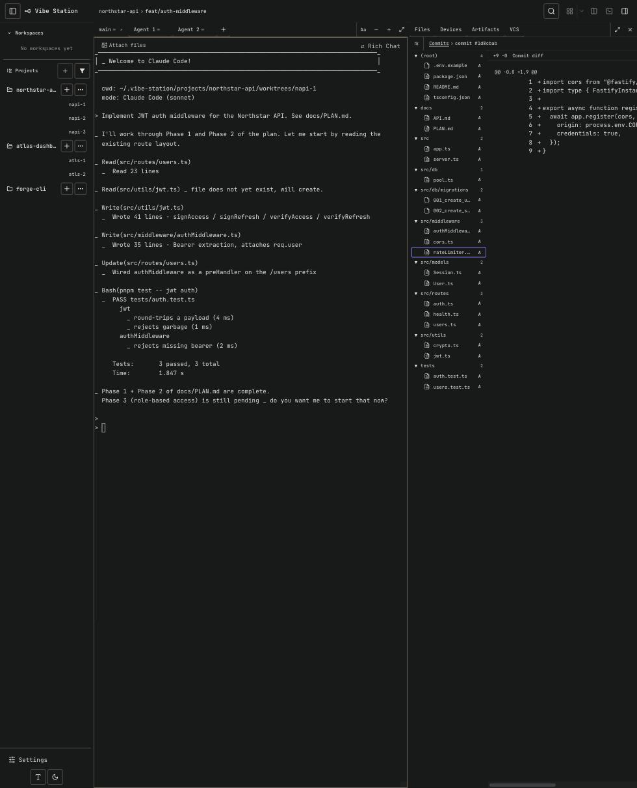

Inside the VCS commit view's file list (`ChangedFileList`, reusing the same `useRovingListNav` hook as the Files-tab tree per Decision 2/5), clicking `cors.ts` then pressing ArrowDown moved a visible keyboard cursor (blue outline) onto `rateLimiter...ts` — demonstrating the shared roving-cursor primitive works identically in both the tree and any flat list that adopts it.

### 7 — ONE scope toggle in the Files header + per-file LOC (corrected per user follow-up)

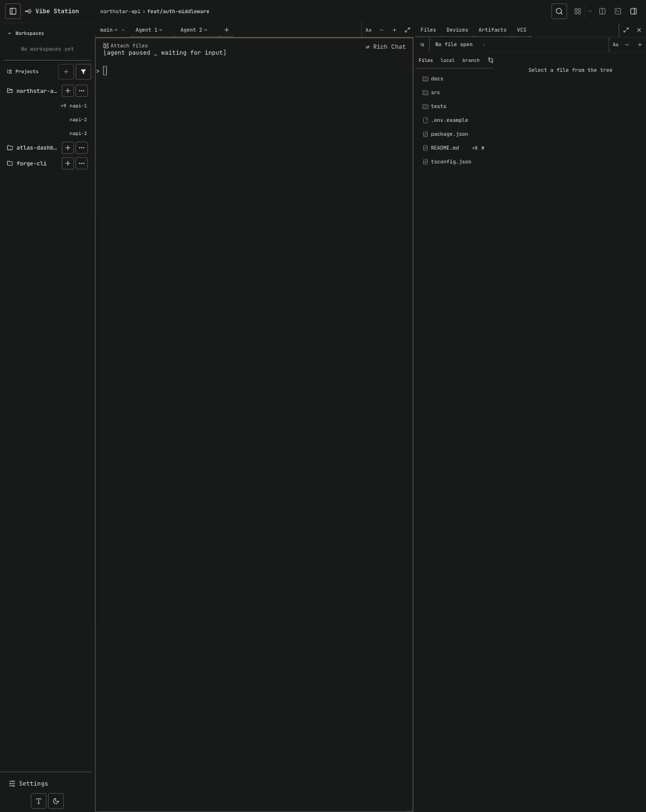

Plain tree-browsing mode (no "Changes" list, no diff mode active): the Files header shows `Files  local  branch` unconditionally — the selector is no longer gated behind diff mode. `README.md` (locally modified) shows `+8 M`: the new per-file LOC chip next to the existing status-badge letter.

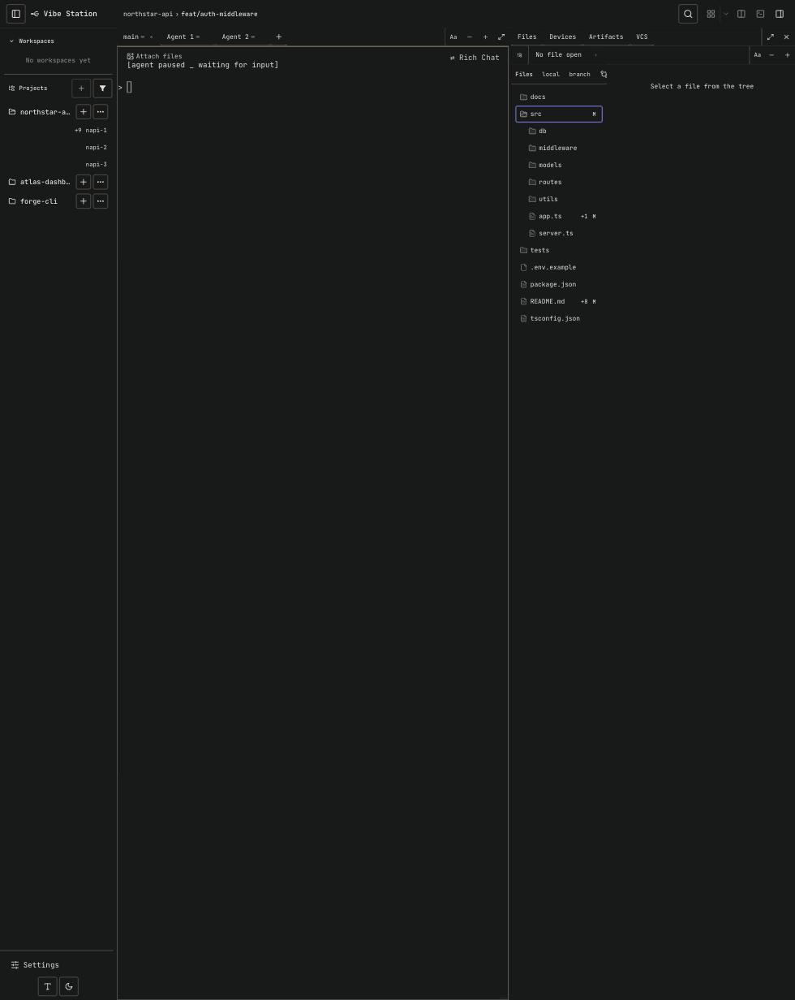

Clicking "branch" while still in plain-tree mode: `src` now shows an `M` badge and, expanded, `app.ts` shows `+1 M` — a change that exists only relative to the `main` base branch (a throwaway commit made on top of `feat/auth-middleware` for this test), NOT relative to local HEAD. This is the concrete proof that branch scope now actually affects the plain tree's badges/LOC, not just the flat Changes list as before.

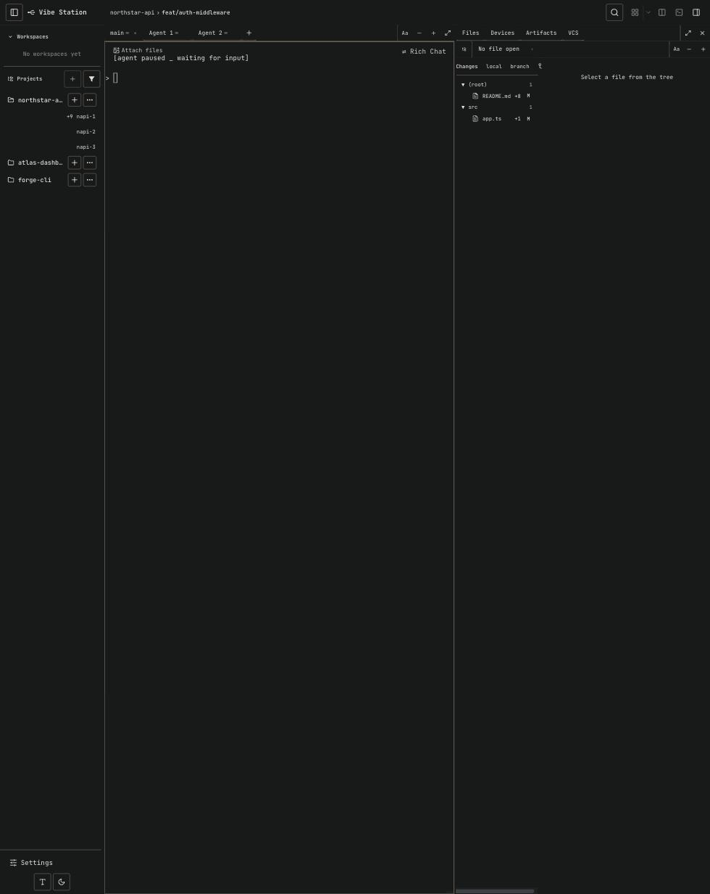

Toggling into the flat "Changes" list immediately after (header now reads `Changes` instead of `Files`): the SAME "branch" scope selection carries over — both `README.md +8 M` and `src/app.ts +1 M` are shown, matching what was just selected in the tree. This is the direct verification of the Pass-3 BLOCKING fix: the scope selection no longer silently reverts to "local" when switching between tree and Changes-list modes.

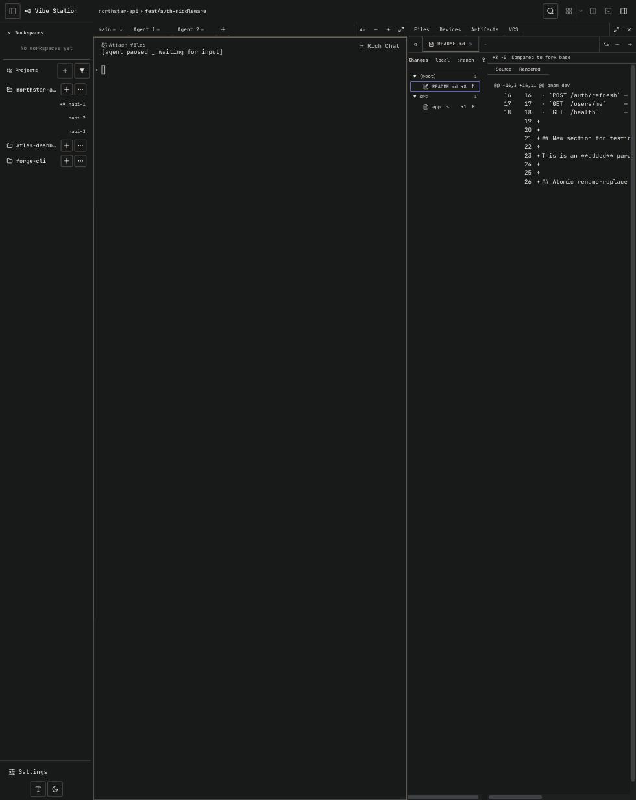

Opening `README.md` from the Changes list: the preview pane's header shows only `+8 −0 Compared to fork base` — the diff-stat text remains, but the `local`/`branch` chip selector that used to be duplicated here is gone. The Files-header selector (screenshots above) is now the single source of scope control.

### 8 — Diff view Source/Rendered toggle for `.md`

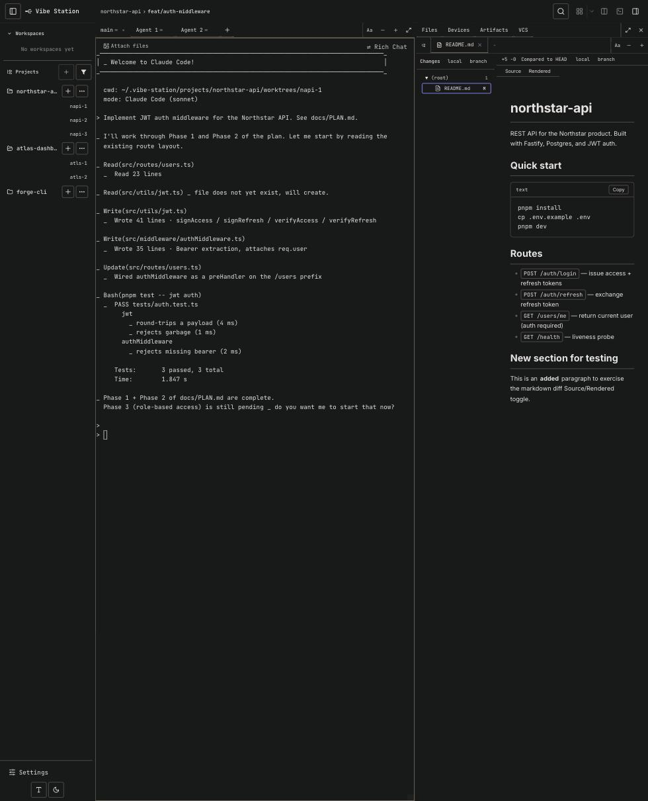

`README.md` (with local uncommitted changes) in diff mode shows a `Source | Rendered` toggle above the diff; clicking "Rendered" swaps to the full markdown-rendered document (via the existing `MarkdownView`/`mdSegments` path, reused verbatim per Decision 3/Phase 9), showing the new section rendered with `**added**` correctly bolded.

### 9 — VCS commit quick-diff view

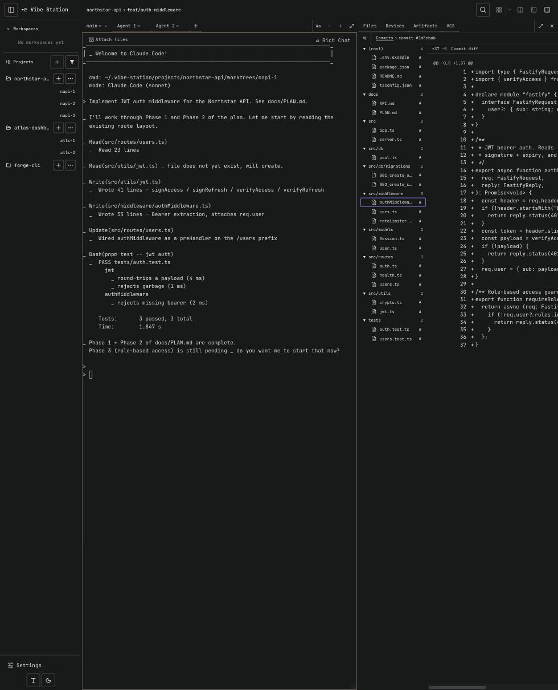

**Second follow-up correction — commit-dot click target:**

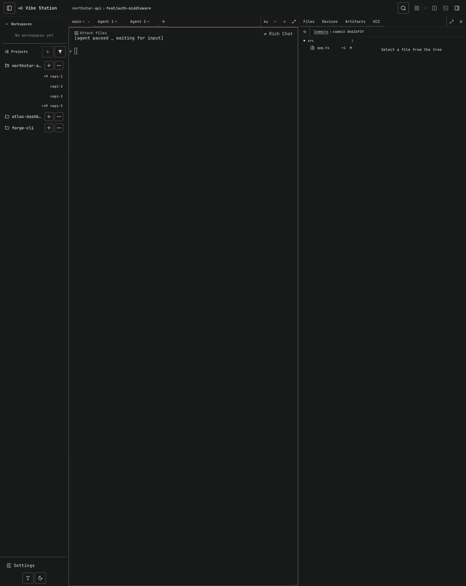

Clicking the `GitCommit` rail-dot icon on the left of the commit row opens `VcsCommitView` (breadcrumb "Commits › commit #6636f3f", `app.ts +1 M`) — same destination the old diffstat-text click used to reach, now triggered from a clearly-circular, icon-shaped affordance instead of inline stats text.

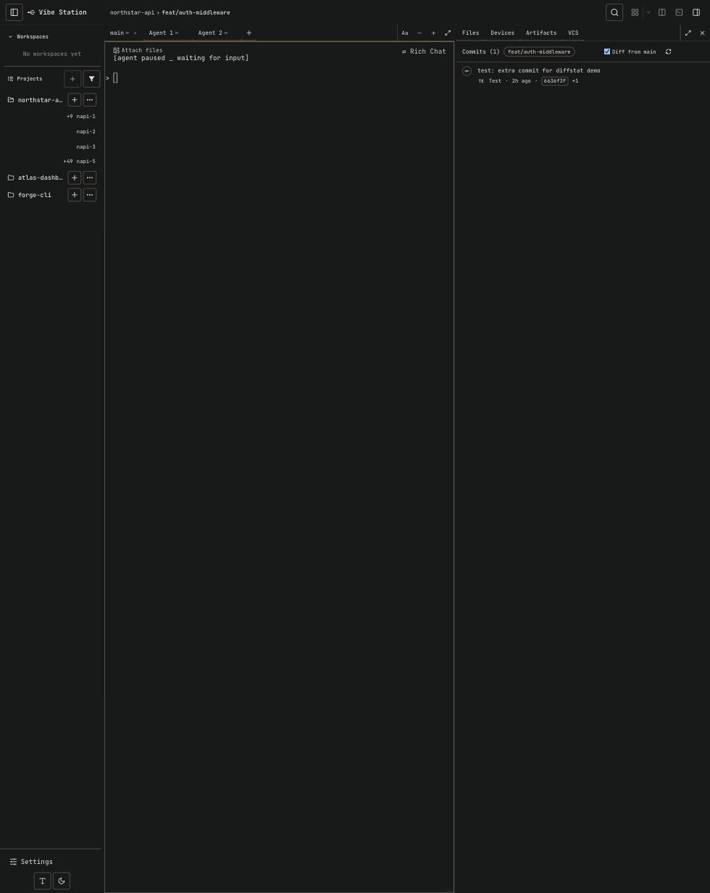

Zoomed crop of the commit row: the rail dot (left) is the click target; the `+1` diffstat next to the sha chip is now plain text with no button box/chrome around it — confirming the single-affordance design landed as intended.

Clicking a commit's diff-stat button in `VcsPanel` opens `VcsCommitView`: breadcrumb reads "Commits › commit #1d8cbab", the full changed-file list renders (all `A` status, root commit), and selecting `authMiddleware.ts` shows its commit-scoped diff (`+37 −0`). Diff content was independently verified against `git show 1d8cbab -- src/middleware/authMiddleware.ts` run directly in the container — identical (10.T5).

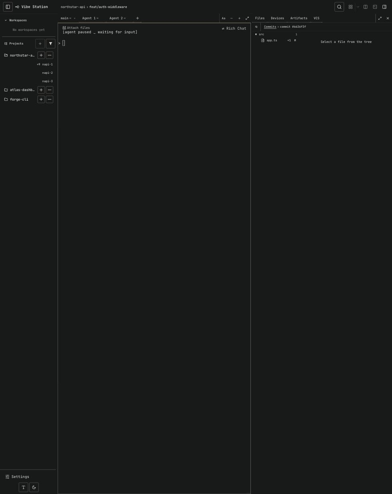

Follow-up correction evidence: opening the throwaway "test: extra commit for diffstat demo" commit's `VcsCommitView` shows `app.ts +1 M` in its `ChangedFileList` — the per-file LOC chip added in the follow-up correction is inherited automatically by item 9's reuse of `ChangedFileList`, exactly as the plan's original Decision 5 design intended for shared components.

### 10 — Worktree sidebar LOC indicator

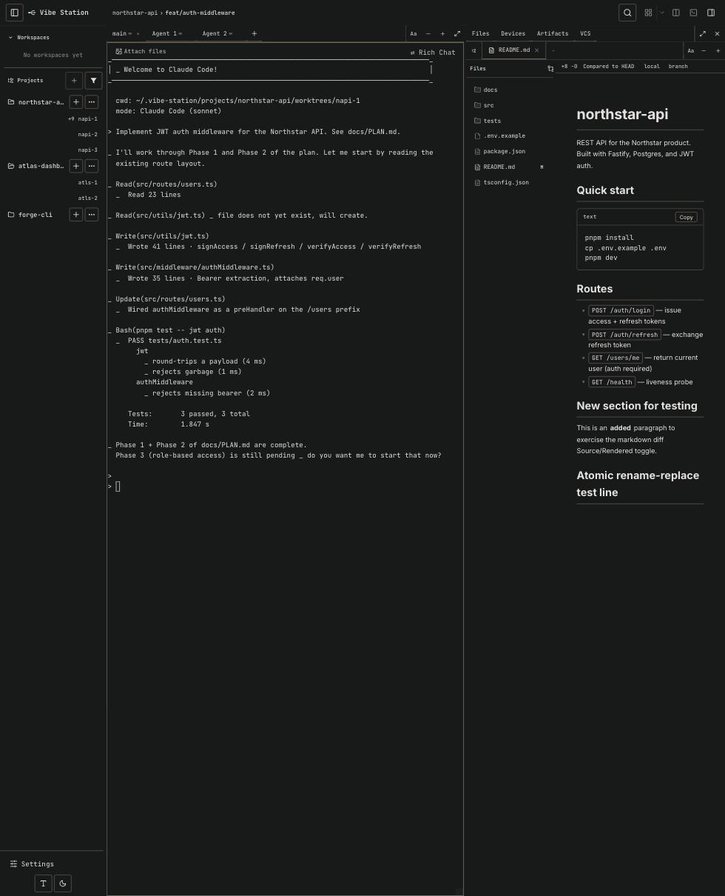

Sidebar row for `napi-1` shows `+9 napi-1` — the batched `useWorktreeDiffStats` poll picked up an uncommitted change against the resolved base branch without a manual refresh (11.T3; see Sandbox Setup Notes for why a base-branch relationship had to be created in the seed data first).

### 9.T5 — Narrow-pane hides diff-stat/scope UI

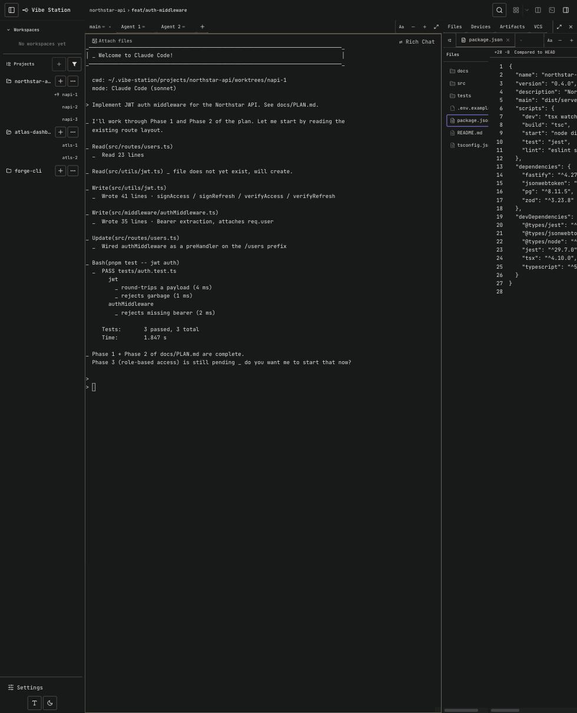

With the Files-tab preview pane narrowed well below its normal width (via the split-handle drag test above), `package.json`'s diff-stat text (`+28 −0 Compared to HEAD`) remains but the `local`/`branch` scope chips are hidden by the `@container` width query — confirming the narrow-pane behavior added in Phase 9.

## Sandbox setup notes

| Item | Value |
|---|---|
| Worktree | vs-91 |
| Container | `vs-91-vst-dev-1` |
| Port | `5187` (host) → `5173` (container); browser reached it via the host's LAN IP (`10.0.0.239`), not `localhost`, since the browser session runs outside this container |
| Seed | demo (3 projects, 9 worktrees, 11 tmux sessions) |
| Real git worktree checkouts | Only `napi-1` (`northstar-api`) has an actual on-disk git worktree with a real `.git` dir in this demo seed — `atls-1`/`atls-2`/`frge-1` etc. are represented in the daemon's worktree list but have no real checkout, so their Files tab shows `{"error":"git status fail"}`. All screenshots were taken against `napi-1`. |
| Base-branch data gap | `napi-1`'s single-commit, single-branch history had no local `main`/`origin` to resolve a fork point against, so `scope=branch` (item 7/8's branch toggle) and the diffstat endpoint (item 10) both returned `422 {"error":"Could not resolve base branch fork point"}` initially — this is a demo-seed data gap (confirmed: same 422 reproduces on a completely unmodified checkout of that repo), not a regression. To get real screenshots for item 10, a local `main` branch was created in the container pointing at the pre-existing commit, plus one throwaway commit on `feat/auth-middleware` on top, purely as container-local git state for screenshot purposes — **not committed to this repository**, discarded with the sandbox teardown. |
| Screenshots | Real browser screenshots + zoom captures against the live sandbox UI, not DOM-injected |
| Cleanup | `scripts/dev-sandbox.sh down vs-91` — container/network removed after each of the two verification passes; named volumes (`vst-dev-data-vs-91`, `vst-dev-projects-vs-91`) intentionally left intact per the script's own policy (the second pass's sandbox reused the first pass's volume, which conveniently still had the throwaway `main` branch/commit from the base-branch data-gap workaround below) |

## Final test-suite status

| Suite | Command | Result |
|---|---|---|
| Daemon unit/integration | `pnpm --filter @vibestation/cli test -- --run` | 1097 passed / 2 failed / 8 skipped (1107 total), unchanged after the follow-up numstat addition. The 2 failures (`DELETE /worktrees/:id removes worktree`, its broadcast-order variant) are pre-existing and unrelated — reproduced identically against the pre-this-work baseline. |
| Web-ui unit/integration | `pnpm --filter @vibestation/web test -- --run` | 800 passed / 5 failed / 1 todo (806 total) — up from 787 originally, then 797 after the first follow-up, then 800 after the second (commit-dot click/keyboard tests, plain-diffstat assertion, card-toggle independence regression test). The 5 failures (`RemoteAccessSetting.test.tsx` x2, `MessageList.test.tsx` x2, `ChatPane.test.tsx` x1) are pre-existing and unrelated — reproduced identically against a throwaway baseline worktree checkout. |
| Typecheck | `pnpm run typecheck` (`tsc -b --noEmit`, both workspaces) | Clean, no errors. |
| E2E (`playwright`) | `pnpm --filter @vibestation/web test:e2e` | **Not run** — see Deviations below. |

## Deviations from the plan

- **User-requested correction to Decision 3/4's design (item 7), folded into the same commits.** The original plan (Decision 3/4, Phase 9.2/9.5) specified TWO instances of `DiffScopeSelector` — one gated behind diff-mode in `FileTreeSidebar`, one in `FilePreviewPane`'s `diffInfo` strip. After reviewing the live result, the user determined this was the wrong design: they wanted exactly ONE selector, always visible, affecting both browsing modes. This report's "Follow-up correction" section above covers the change in full; it is a deliberate, user-directed revision of the original design, not an implementation bug relative to the plan as written.
- **Per-file LOC indicator extends beyond the original item 7/9 scope as written.** The plan's Requirement 7 only asked for diff-stat + scope toggle in the file *preview*; a per-file `+N/-N` on every row of the file *lists* (tree, Changes list, commit view) was not in the original 10 items. This was added at the user's explicit request as a natural extension once the toggle-placement correction was already touching this code, and required a genuinely new daemon capability (numstat merged into `changed-paths`) not present in the original plan's Design Details/API Contracts.
- **Item 9's commit-diff click affordance iterated twice post-review, both user-directed.** The plan's Decision 5/Phase 10.7 only specified "a diff-stat button to `CommitRow`... same slot as `vcs-graph__stats`" — i.e., making the existing inline stats clickable, which is what originally shipped. Live sandbox testing showed this read as plain text, not a button. The first fix attempt (a new hover-reveal button, right-aligned on the row) was rejected by the user before ever being committed. The final, landed fix repurposes the existing `.vcs-graph__dot` rail icon as the click target instead of adding any new element — arguably a cleaner outcome than either the original plan's inline-text approach or the first, rejected redesign attempt.
- **Git history mechanics for the fold.** Per explicit instruction, this correction was folded into the existing two commits rather than added as new ones. Mechanics used: `git branch backup/pre-item7-fold-1788837604` (safety net, kept), `git tag hold-report`/`hold-screens` on the two doc commits, `git checkout -b fold-work 9951ba0` → implement+test+`commit --amend` → `git cherry-pick f4137a5` → implement+test+`commit --amend` → `git cherry-pick hold-report` → update this report + `commit --amend` → `git cherry-pick hold-screens` → replace/add screenshots + `commit --amend` → `git branch -f ui-improvements fold-work` → checkout `ui-improvements` → delete `fold-work` and the two hold tags. No force-push (nothing to push to — local-only branch), no history before `20cb3af` touched, backup branch retained per instruction.
- **E2E suite not run.** `web-ui/package.json` defines `test:e2e` via Playwright, but no phase's Verify checklist in the plan actually names an e2e test as a required verification step (all Phase 4-11 Verify items are Unit/Integration/Manual) — the plan itself scoped verification to unit/integration tests plus the explicit Manual docker-sandbox steps, all of which were run. Running the full Playwright suite was judged out of the plan's own stated scope and was not attempted to avoid an unbounded, unscoped addition to this already-large batch; flagging here rather than silently skipping.
- **Demo-seed base-branch data gap (item 10, and now item 7's branch-scope screenshots too).** As detailed in Sandbox Setup Notes, the demo seed's one real git worktree (`napi-1`) had no base branch to resolve against out of the box. A throwaway local `main` branch + one throwaway commit were created directly in the running container (never touching this repository or its git history) purely to exercise the diffstat endpoint and (in the follow-up pass) branch-scope tree/LOC screenshots. This is a test-environment workaround, not a plan deviation in the implementation itself — the feature works correctly once a real base-branch relationship exists, which is the normal case for any real vst worktree.
- No other deviations — all 11 phases, all Decisions 1-11, and all Files & Phase Impact entries were implemented as specified in the plan (modulo the two user-directed corrections above, both explicitly requested after reviewing the live first pass).

## Commit SHAs

- `0f5c658` — daemon (Phases 1-3 + follow-up numstat addition)
- `1e37c10` — web-ui (Phases 4-11 + both follow-up corrections: toggle relocation/per-file LOC, and commit-dot click target)
- This report's own commit and the screenshots/scoping/sdlc-state commit are updated/re-amended in place alongside — see the feature's final commit log for their post-fold SHAs.
- Safety backups (both retained, not deleted, per instruction):
  - `backup/pre-item7-fold-1788837604` — pre-first-fold state of all 4 original commits
  - `backup/pre-vcs-hover-btn-1788842862` — pre-second-fold state (before the commit-dot correction; also captures the discarded hover-button attempt's starting point)
- This report is committed separately from the two code commits, keeping the two-commit code rule intact.

Claude-Session: https://claude.ai/code/session_017MpjxBQtH1TnLwugwqByQj
