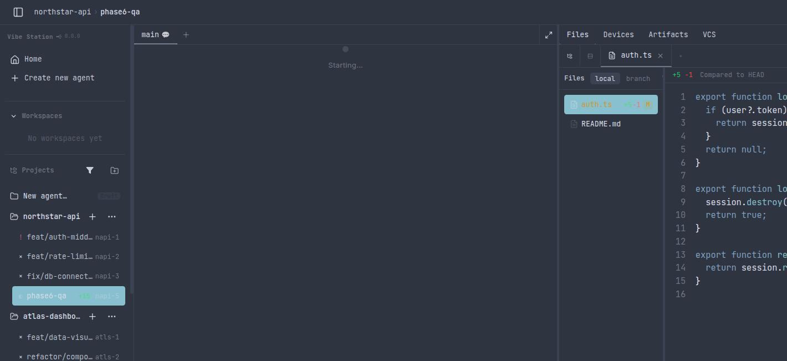
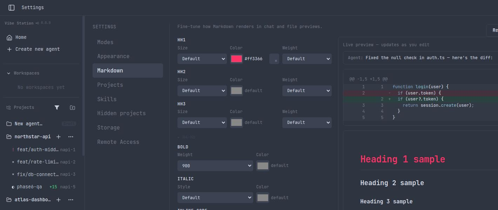
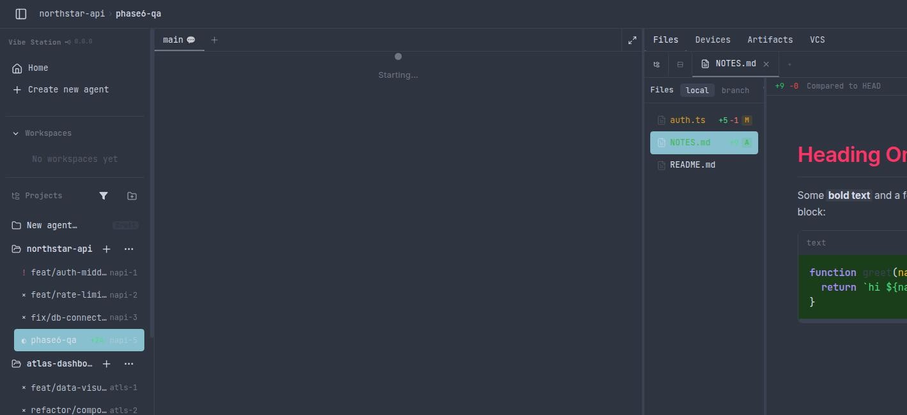
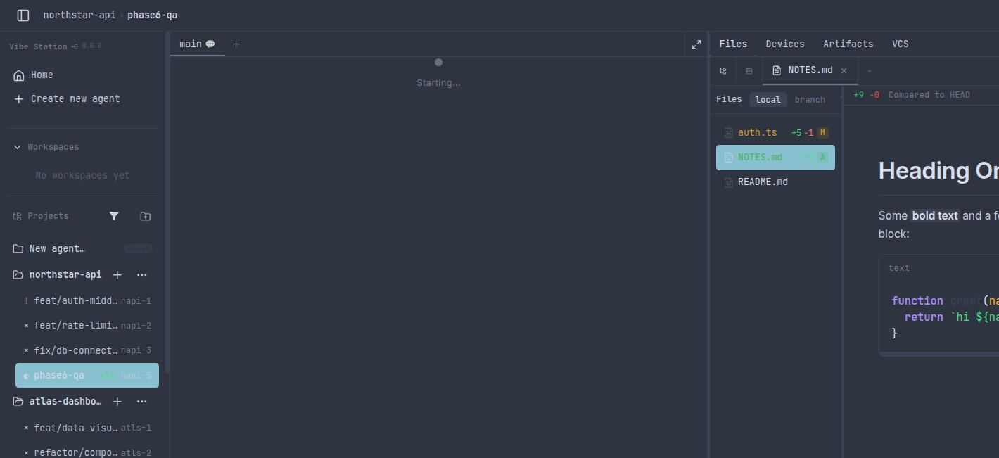
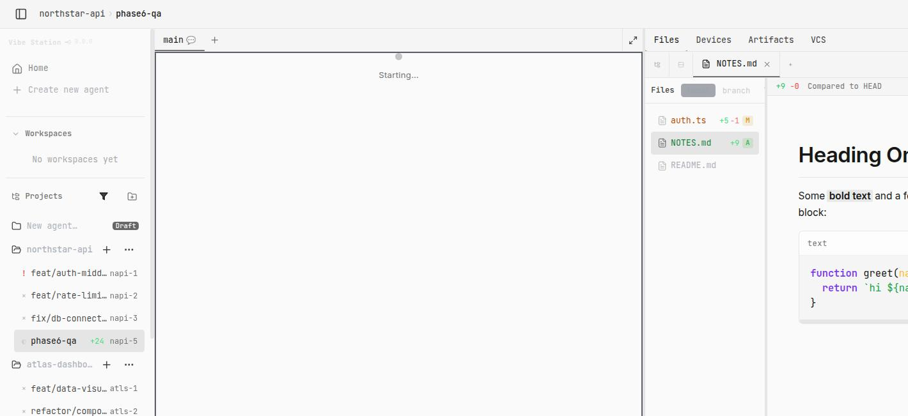
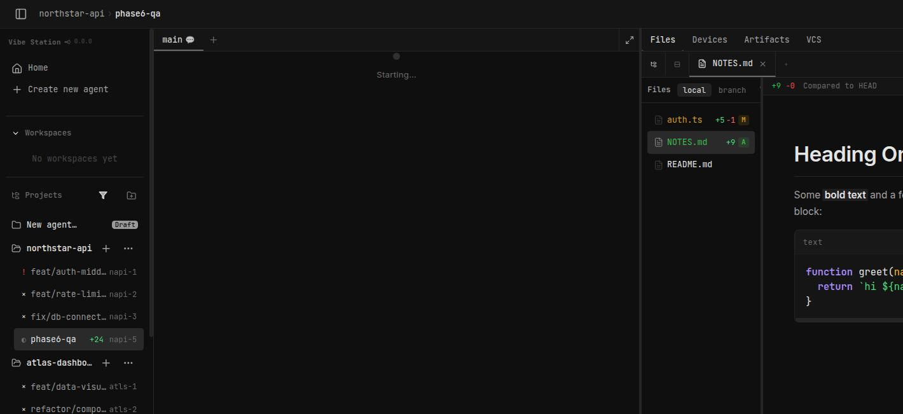

# Report: Themes + Markdown Personalization — Phase 6 Live Verification

> Full plan at `.vibekit/feature-plans/pending/themes-ides-markdown/plan-themes-ides-markdown.md`. Phases 1-5 (Rust server, theme data, web-ui sync, Shiki, Markdown personalization) were implemented and gate-verified by narrow-context `deepseek` subagents per that plan's Execution Model. This report covers Phase 6 only: a Sonnet-mode, in-harness live browser verification of the entire feature against a running app — not a diff review.

## Summary

All 6 CUJs (6.1-6.6) **PASS** as of this report. Getting there required:

1. **Discovering the dev sandbox wasn't exercising the feature at all.** `scripts/dev-sandbox.sh`'s `dev.Dockerfile` has no Rust build step, so `/usr/local/bin/vst-daemon-rust` was never a real file — the container silently fell back to the legacy Node daemon (`[daemon] Rust daemon binary not present — falling back to Node daemon`). Node's `/settings` is frozen per this plan's own Out of Scope and doesn't implement the WS broadcast at all, so no CUJ involving live sync could have been meaningfully tested against it. I built `vst-daemon` for this branch (reusing a sibling worktree's `target/` dir as a dependency cache to avoid a from-scratch compile on a nearly-full host disk, then a second build inside a `rust:1-bookworm` container to match the sandbox's glibc — the host's Ubuntu 24.04 glibc was too new for the Debian 12 sandbox), copied the binary to `rust/target/release/vst-daemon` (the path `docker-compose.dev.yml` bind-mounts), and recreated the container so it picked up the real Rust daemon. This is an environment-setup issue, not a code bug in this feature — flagging it here since a future Phase 6 (for this or another Rust-side feature) will hit the same wall.
2. **Discovering the demo seed's worktrees have no real git checkout on disk.** `napi-1`..`napi-4` etc. are DB-only rows (`git status failed` / 500s from the daemon); only the project's own `main` repo is real. I created one real worktree (`napi-5`, branch `phase6-qa`, via `vst worktree create`) with an actual uncommitted diff (`auth.ts`) and an actual added Markdown file (`NOTES.md`, headings/bold/fenced-code) to exercise `DiffView`/`CodeView`/`MarkdownView` for real. This worktree was removed from `vst`'s registry before tearing the sandbox down (files remain in the sandbox's preserved projects volume, harmless).
3. **Finding and fixing 5 real bugs** (below) that static diffing / narrow-context phase verification could not have caught — each one only shows up when two browser tabs and a real WS round-trip are actually exercised.

## CUJ Results

| # | CUJ | Result | Notes |
|---|---|---|---|
| 6.1 | Theme switch propagates live to chrome + diff + code | **PASS** (after fix #1) | Initially failed: chrome stayed on Vibestation Dark for every other theme while Shiki/JS-driven code colors updated correctly — the *opposite* shape of the bug requirement 9 was written for, but still a hard requirement-3 violation. Re-verified live: `--bg-primary` (Nord `#2e3440`) and the mounted `DiffView`/`CodeView` panes in a **separate, never-reloaded tab** updated together within ~1s of a commit in another tab. |
| 6.2 | Hover-preview shows a theme without committing | **PASS** (no fix needed) | Hovering a non-committed swatch updated only the scoped `.theme-scope` preview panel; `document.documentElement`'s `--bg-primary`/`data-theme` and a separate open worktree tab's chrome were unaffected; `read_network_requests` showed zero `PATCH /settings` calls during hover. Re-checked after all fixes landed — still passes. |
| 6.3 | Markdown style editor: live preview + persistence + shared rendering | **PASS** (after fixes #2, #3, #4) | Three independent bugs here (see below): field-name mismatch silently dropped inline-code/code-block edits; weight `<select>`s sent strings instead of numbers, failing 422 silently; and the override `<style>` block never existed outside the Settings page, so even a *successfully persisted* override never rendered in the actual file-preview `.md` pane. All three fixed and re-verified: H1 color + bold weight 900 + code-block bg all persist across a full page reload, and `NOTES.md`'s file-preview pane (a different tab, `MarkdownView`, not the settings preview fixture) renders the custom pink H1 and green code-block background. |
| 6.4 | Cross-tab live sync | **PASS** (after fixes #1, #5) | Demonstrated repeatedly as a side effect of 6.1/6.3/6.5's methodology (two real tabs, one committing, one only ever reading/observing): theme changes, Markdown-style edits, and a Markdown-style reset all propagated to the second tab within ~1-2s with no reload. |
| 6.5 | "Reset to theme" clears Markdown overrides | **PASS** (after fix #5) | Initially failed to propagate live: the tab that clicked "Reset to theme" cleared correctly and the change persisted server-side (`GET /settings` → `markdownStyle: null`), but a second open tab kept rendering the stale override indefinitely — a `skip_serializing_if` on the WS payload's `markdown_style` field made a reset indistinguishable from "no markdown change" on the wire. Fixed; re-verified: second tab's `Heading One` sample reverted from custom pink to theme-default color within ~1s of the reset click in the first tab, and stayed reset after a full reload. |
| 6.6 | No visual regression in `data-appearance`-keyed selectors | **PASS** (no fix needed) | Checked in both Vibestation Light and Vibestation Dark: git-status file-tree badges (`M`/`A`) rendered with theme-appropriate amber/green colors + tinted backgrounds (not black/default), and `.hljs`-highlighted fenced code in a rendered `.md` file showed distinct, theme-appropriate token colors in both appearances (confirmed via `getComputedStyle`, not just visual inspection). |

## Bugs found, fixed, and re-verified live

All five fixes are in commit `bc7f9ab`. Every one was re-verified by re-running the exact failing CUJ step in the browser against a rebuilt/redeployed daemon or hot-reloaded web-ui — never just re-read in source.

### 1. `themes.generated.css` never imported (`web-ui/src/main.tsx`)
Phase 2 generated `web-ui/src/styles/themes.generated.css` (12 borrowed themes' chrome-token blocks + `.theme-scope` variants) but no phase's checklist item actually wired an `import` for it anywhere in the app. Only `tokens.css`'s two hand-authored Vibestation blocks were ever loaded, so selecting e.g. Monokai left `--bg-primary` etc. stuck at Vibestation Dark's `#0f0f0f` while Shiki (which resolves colors via the registry in JS, not CSS) correctly switched — confirmed via `getComputedStyle(document.documentElement).getPropertyValue('--bg-primary')` returning `#0f0f0f` under `data-theme="monokai"`.
**Fix:** added `import "./styles/themes.generated.css";` to `main.tsx` right after `tokens.css`.
**Re-verified:** after HMR picked up the change, the same check returned Monokai's `#272822`, and a live theme switch from a second tab correctly recolored chrome + code + diff together.

### 2. `MarkdownStyle` client type used snake_case, wire is camelCase (`web-ui/src/api/types.ts`, `useMarkdownStyle.ts`, `MarkdownStyleSetting.tsx`, `useMarkdownStyle.test.tsx`)
The Rust `MarkdownStyle` struct's fields (`inline_code`, `code_block`, `code_font_family`) carry `#[serde(rename_all = "camelCase")]`, so the wire shape is `inlineCode`/`codeBlock`/`codeFontFamily`. The TS `MarkdownStyle` interface mirrored the *Rust field names* verbatim instead of the wire names, so every commit touching inline-code or code-block styling sent e.g. `{"code_block": {...}}`, which the server's serde deserializer silently ignored as an unknown field (200 OK, no error, field never persisted). The existing unit test (`useMarkdownStyle.test.tsx`) never caught this because it only exercises the JS→CSS transform, never crosses the actual wire.
**Fix:** renamed all three fields to camelCase in the TS type and every usage site.
**Re-verified:** `PATCH /settings` with `{markdownStyle: {codeBlock: {bg: "#1a3d1a"}}}` now round-trips through `GET /settings` correctly; the live UI flow (click a code-block-background swatch) now persists across a full reload.

### 3. Weight `<select>`s sent as strings, not numbers (`MarkdownStyleSetting.tsx`)
`commitSelect` passed the raw `<select>` string value straight to `set()`/`commit()` for every select control, including h1-h6/bold `weight`, whose wire type is `Option<u16>`. Sending `"weight": "900"` (a JSON string) fails the Rust route's deserialization with a `422 validation_error` — which the client's `commit()` catches and silently swallows (`catch { /* Keep dirty */ }`), so the UI *looked* like it worked (local optimistic state updated the preview) while nothing was ever saved.
**Fix:** `commitSelect` now parses any `.weight`-suffixed path to `Number(value)` before calling `set()`.
**Re-verified:** setting Bold weight to 900 now returns `200` (previously `422`, confirmed via `read_network_requests`) and persists.

### 4. `useMarkdownStyle()` only ever called from the Settings page (`MarkdownView.tsx`)
`useMarkdownStyle()` — which boots the `GET /settings` seed, the `settings:updated` WS subscription, and injects the `.workspace-markdown-preview`-scoped `<style>` override block — was called from exactly one place in the whole codebase: `MarkdownStyleSetting.tsx`. Nothing in the actual rendering path (`MarkdownView`, used by both chat bubbles and the file-preview `.md` pane) ever called it, so the override `<style>` tag simply didn't exist outside the Settings → Markdown screen. A saved override would show correctly in the Settings preview fixture (which happens to also use `MarkdownView`, coincidentally re-triggering the boot) but silently fall back to theme defaults everywhere else — a direct requirement-7 violation ("applies identically in chat bubbles and the file-preview `.md` pane").
**Fix:** moved the `useMarkdownStyle()` call into `MarkdownView` itself (the actual shared component), mirroring how `useTheme()` boots off whichever of its many consumers mounts first.
**Re-verified:** with H1 color / bold weight / code-block bg all set, opening `NOTES.md` in the file-preview pane (a separate tab, never touching Settings) now renders the pink heading and green code-block background.

### 5. `SettingsThemeUpdated.markdown_style`'s `skip_serializing_if` broke reset-detection (`rust/vst-types/src/ws.rs`)
The WS event's `markdown_style` field had `#[serde(skip_serializing_if = "Option::is_none")]`. On a "Reset to theme" commit, `markdown_style` becomes `None` server-side — but with that attribute, the field is *omitted from the JSON entirely*, not sent as `null`. The client's `useMarkdownStyle.ts` boot handler explicitly relies on `"markdownStyle" in ev` (a presence check, documented in its own comment) to distinguish "a real reset" from "an unrelated theme-only change that didn't touch markdown_style" — with the field omitted, a reset is indistinguishable from a no-op, so the reset's own WS echo (and any other open tab's copy) never cleared.
**Fix:** removed `skip_serializing_if` from `markdown_style` only (kept it on `theme_id`, which has no reset case and is always `Some` after first boot); a reset now serializes as an explicit `"markdownStyle":null`.
**Re-verified:** after rebuilding and redeploying `vst-daemon`, clicking "Reset to theme" in one tab now clears the pink `Heading One` sample in a second, never-reloaded tab within ~1s, and `GET /settings` confirms `markdownStyle: null` persists across reload.

## Test suites re-run after the fixes

- **Rust:** `cargo test --release -p vst-routes -p vst-types -p vst-ws` — all pass, including `test_settings_get_patch_and_validation` and `test_settings_theme_markdown_validation_and_broadcast` (Phase 1's 1.T1).
- **web-ui:** `npx tsc -b --noEmit` clean. `npx vitest run` — 885 pass / 11 fail / 1 todo across 82 files; the 11 failures are in `WorkspaceCanvas.test.tsx`, `ChatPane.test.tsx`, `TerminalPane.test.tsx`, `TopBar.test.tsx`, `FileTreeSidebar.test.tsx`, `VcsPanel.test.tsx`, `FilesPanel.test.tsx` and `SkillEditor.test.tsx` — none of which this phase's diff touches (confirmed via `git status --short` against the fix commit); pre-existing, unrelated to this feature.
- `useMarkdownStyle.test.tsx`, `useTheme.test.ts`, and `MarkdownView.test.tsx` specifically: all pass (23 tests).

## Screenshots

All in `images/` alongside this report (inlined above at their relevant fix; full set below for reference):

| | |
|---|---|
|  |  |
| 6.1 — Nord live update after fix #1 | 6.3 — Markdown live preview |
|  |  |
| 6.3 — File-preview `.md` pane after fix #4 | 6.5 — Reset propagates cross-tab after fix #5 |
|  |  |
| 6.6 — Light appearance, no orphaned selectors | 6.6 — Dark appearance, no orphaned selectors |

## Deviations from the plan's Phase 6 mechanics

- The plan's mechanics say "launch the app via `scripts/dev-sandbox.sh up <worktree-name> --port=N`... then drive it" without anticipating the Node-fallback issue above. Building and deploying a real `vst-daemon-rust` binary into the sandbox was necessary to test anything server-side in this feature at all; this should probably be folded into `dev-sandbox.sh`/`dev.Dockerfile` as a follow-up (out of scope for this phase to fix — flagging per the plan's own "flag, don't silently resolve" convention used elsewhere).
- One real git worktree (`napi-5`/`phase6-qa`) was created via `vst worktree create` specifically because the demo-seeded worktrees have no real on-disk git checkout and can't render `DiffView`/`CodeView`/file-preview `.md` panes at all (`git status failed` from the daemon). It was removed from `vst`'s worktree registry before teardown; its files remain harmlessly in the sandbox's preserved `vst-dev-projects-vs-140` volume for a future session to reuse or ignore.

## Definition of done (6.D)

- [x] All 6 CUJs performed for real in a live browser against a running Rust daemon, not simulated or inferred from source.
- [x] 5 bugs found, each fixed in `web-ui/`/`rust/` source, and each re-verified by re-running the exact same CUJ live in the browser after the fix (not just re-reading the diff).
- [x] Screenshots captured for the fixed-and-reverified states (nothing currently fails, so no "still broken" screenshots are needed).
- [x] Fix commit: `bc7f9ab9a72cbbfb5f19a51c006560f00b0e6917`.
- [x] Sandbox torn down via `scripts/dev-sandbox.sh down` (no `-v`), volumes preserved.
- [x] Plan's Phase 6 checklist (6.1-6.6, 6.D) marked `[x]`.
