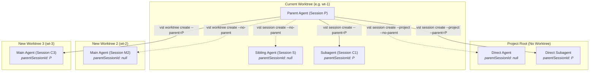
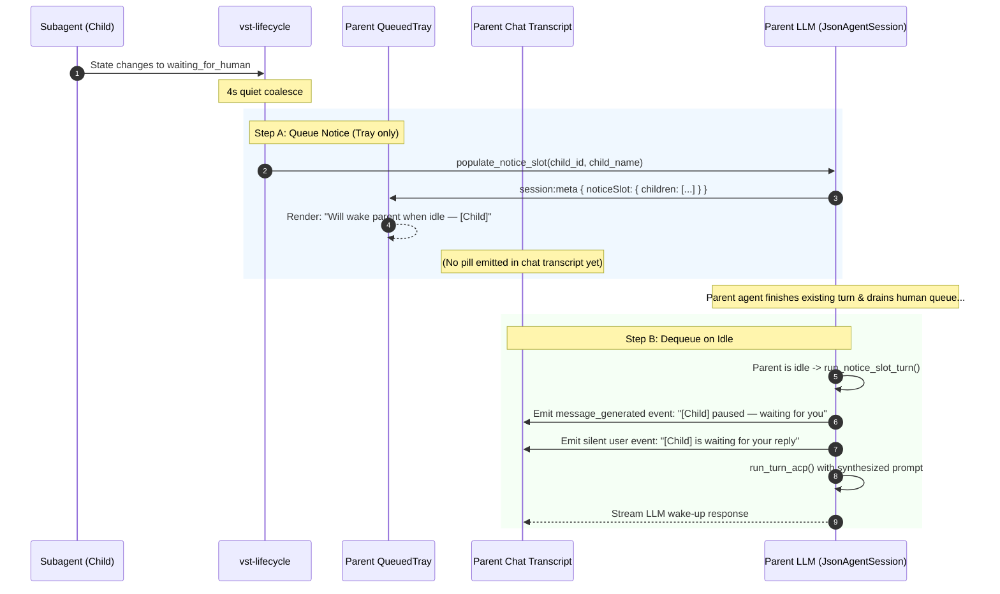

# Subagent Creation, Detachment, and Wake-up Lifecycle Report

**Date:** 2026-09-18  
**Scope:** `vst` CLI, `skill/SKILL.md`, `rust/vst-daemon`, `rust/vst-lifecycle`, `rust/vst-agents`, `web-ui`

---

## 1. Agent Creation Modes & Detachment

### 1.1 The Creation Topologies

There are six distinct topologies for creating an agent session in vibe-station:

| Topology | Location / Branch | Relationship | CLI Command | Documented in `SKILL.md`? |
|---|---|---|---|---|
| **1. Direct Agent in Project** | Project root (no worktree/branch) | Standalone (`parentSessionId: null`) | `vst session create --project=<projectId> --type=agent --mode=<modeId> --no-parent --prompt="..."` | ✅ Yes (Section 4 & 7) |
| **2. Direct Subagent in Project** | Project root (no worktree/branch) | Linked child (`parentSessionId: $VST_SESSION`) | `vst session create --project=<projectId> --type=agent --mode=<modeId> --parent="$VST_SESSION" --prompt="..."` | ✅ Yes (Section 4 & 7) |
| **3. Sibling in Same Worktree** | Current worktree (same branch, same files) | Independent peer (`parentSessionId: null`) | `vst session create <worktreeId> --type=agent --mode=<modeId> --no-parent --prompt="..."` | ✅ Yes (Section 4 & 6) |
| **4. Subagent in Same Worktree** | Current worktree (same branch, same files) | Child subagent linked to parent (`parentSessionId: $VST_SESSION`) | `vst session create <worktreeId> --type=agent --mode=<modeId> --parent="$VST_SESSION" --prompt="..."` | ✅ Yes (Section 4 & 6: **Standard Subagent Pattern**) |
| **5. Independent New Worktree** | New worktree (new git branch, isolated directory) | Standalone agent (`parentSessionId: null`) | `vst worktree create <projectId> --branch=<branch> --mode=<modeId> --no-parent --prompt="..."` | ✅ Yes (Section 4 & 5) |
| **6. Subagent in New Worktree (Cross-Worktree)** | New worktree (new git branch, isolated directory) | Linked child (`parentSessionId: $VST_SESSION`) | `vst worktree create <projectId> --branch=<branch> --mode=<modeId> --parent="$VST_SESSION" --prompt="..."` | ✅ Yes (Section 4 & 5: ⚠️ **Rare exception**) |

### 1.2 CLI and `SKILL.md` Updates

1. **`skill/SKILL.md` Subagent & Direct Agent Rules:**
   - Section 4 now features an explicit table of all 6 topologies.
   - Highlights that **Topology 4 (Subagent in Same Worktree)** is the default standard for subagents.
   - Clarifies that **Topology 6 (Cross-Worktree Subagent)** is almost NEVER needed unless explicitly requested by the user.
   - Documents **Topology 1 & 2 (Direct sessions in the project)** with `vst session create --project=<projectId>`.
2. **CLI Enhancements:**
   - `vst session create` supports `--project=<projectId>` for direct sessions in addition to `<worktreeId>`.
   - Added `vst session delink <sessionId>` (exposing `POST /api/sessions/:id/delink`) for manual unlinking.

---

## 2. Wake-up Call & Notice Slot Lifecycle

### 2.1 Does it Enqueue to the "Top" (Front) of the Parent?

**No.** The wake-up call does **not** jump to the front of the parent's human message queue.

- The human message queue (`s.queue`) is drained **completely** before the notice slot is touched.
- Notice slot (`noticeSlot`) is a dedicated single slot held in session memory outside the FIFO queue.
- While queued, it renders inside `QueuedTray` above the composer: `Will wake parent when idle — <Child Name>`.

### 2.2 Notification Pill Deferral (Chat Transcript Cleanliness)

Per user feedback, showing a timeline pill `[Child] paused — waiting for you` in the chat transcript **while the event was still sitting queued in the tray** caused confusion (users saw both the message and the tray simultaneously before anything actually happened).

**Updated Behavior:**
1. **At Queue Time:**
   - When a child transitions to `waiting_for_human`, `subagent_notify.rs` updates `noticeSlot` with the child's name and ID.
   - **No pill is emitted to the chat transcript.**
   - The tray renders `Will wake parent when idle — <Child Name>`.
2. **At Dequeue Time:**
   - When the parent finishes its current work and becomes idle, `run_notice_slot_turn` drains `noticeSlot`.
   - **At this exact moment of dequeue**, the timeline pill (`[Child Name] paused — waiting for you`) is emitted to the chat transcript, followed immediately by the automated wake-up prompt turn (`<Child Name> is waiting for your reply`).

