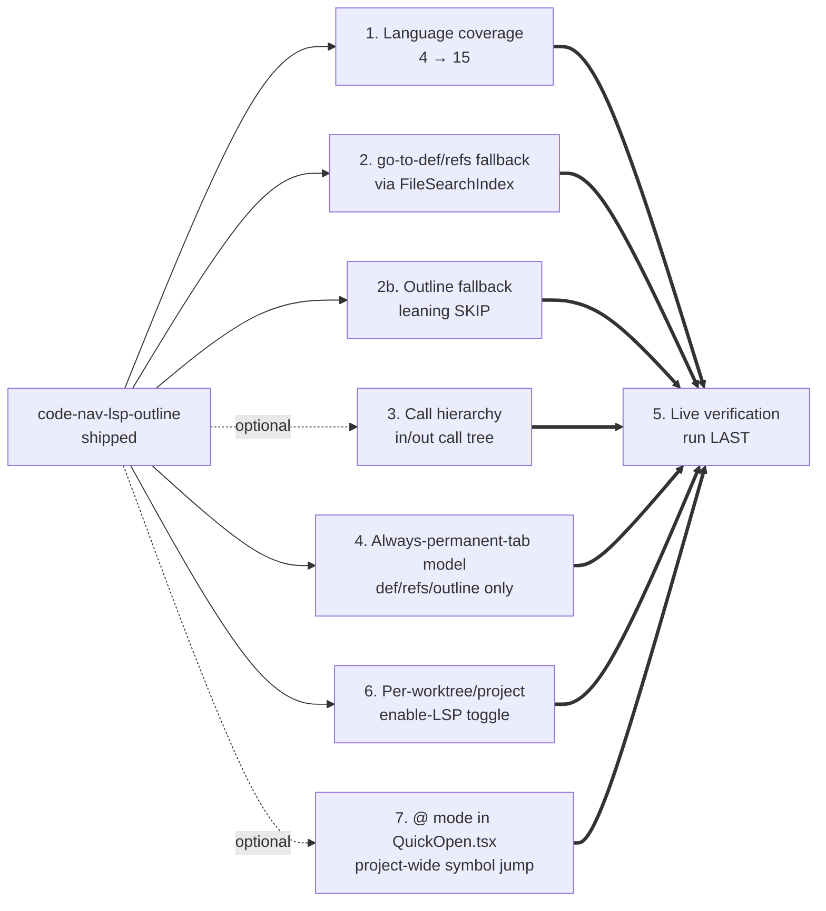

<!--
RULES — read before writing this report:
1. This is a SMALL file — bugs, root cause, action items, optional diagrams. Nothing else.
2. FORMAT: tables, bullet points, mermaid diagrams ONLY — no prose paragraphs
3. An empty section is omitted entirely, never left as a stub heading
4. This file MUST be written to disk at the path below — never answer `/sdlc report` in chat only
-->

# SDLC report: code-nav-lsp-outline/root — follow-up work

**Date:** 2026-09-23 · **Commit:** caab8f47 · **Sub-feature(s) covered:** root (done)

## Action items

| # | Action | Owner sub-feature | Status |
|---|--------|--------------------|--------|
| 1 | Expand language coverage from 4 (Rust/TS-JS/Python/Go) to 15: match the reference editor's 7 remaining (C/C++ via `clangd`, Zig via `zls`, Lua via `lua-language-server`, Ruby via `solargraph`, Java via `jdtls`, C# via `omnisharp`, LaTeX via `texlab`) + user-picked HTML/CSS/JSON (`vscode-{html,css,json}-language-server`, 3 registry entries) + Kotlin (`kotlin-language-server`) + Bash (`bash-language-server`) — registry-table-only change, no architecture change | new bundle | confirmed — ready for PRD/plan |
| 2 | Add a fast non-LSP fallback for go-to-def/references while a language server is starting/indexing/unsupported, by querying the existing per-worktree `FileSearchIndex` (already backs the Search tool tab) rather than building a new regex engine. **Scope confirmed: startup-window-only** — the fallback only fires while `LspStatus` is `starting`/`indexing`/`not_found`/`unsupported`; once the server answers `ready` once, LSP results are used exclusively (not always-dual-engine like the reference editor) | new bundle | confirmed — ready for PRD/plan |
| 2b | Outline needs a SEPARATE fallback mechanism from item 2 — `FileSearchIndex` finds symbol names, not structural boundaries (function/class ranges); needs a small per-language regex/structural rule table, similar to the reference editor's own outline fallback. Lean option: skip entirely — Outline's "Loading symbols…" wait is a smaller UX hit than a go-to-def click doing nothing, so a fallback here may not earn its cost | new bundle | still open — leaning toward SKIP, needs explicit user decision |
| 3 | Call hierarchy (in/out calls = "who calls this" / "what this calls", the entry/exit-point framing): reference editor triggers it from a "Calls" button in the hover tooltip (same slot as "Find references"), opens an expandable tree, each expand click round-trips that node's opaque `CallHierarchyItem` back to the server — stateless, no server-side graph kept. Our version: new "Calls" left-pane mode alongside Tree/Search/References/Outline, entered via a new hover-tooltip button using the same `pendingReferencesQuery`-style handoff Phase 5 built; backend needs `textDocument/prepareCallHierarchy` + `callHierarchy/{incoming,outgoing}Calls`, same stateless-per-request shape | not started | open — only if user wants it prioritized |
| 4 | Switch go-to-def/references/outline from peek-then-promote to always-permanent-tab (reference-editor style: activate existing tab or open a new permanent one, no ephemeral state): collapse `pushJump`'s branch (c) into branch (b); keep Search's roving preview ephemeral (coalesce path, tab-spam prevention); keep external (out-of-workspace) results non-promotable (reload-survival risk — token not guaranteed valid across page reload); back/forward unaffected (`recordHistoryEntry` already fires on the permanent-tab path). Frontend-only, no backend/API changes. Bulk of effort is rewriting Phase 3/5/6 tests that assert `peekFile` state for these 3 sources | new bundle | confirmed direction — ready for PRD/plan when prioritized |
| 5 | End-to-end live verification against a real language server (not the fake process doubles all Phase 1-6 tests used) — Ctrl-click/hover/outline against a real `rust-analyzer`/`typescript-language-server`/etc in a running dev instance | verify pass | **scheduled — run AFTER items 1/2/2b/3/4/6/7 land, not before** |
| 6 | No cap on concurrent LSP server processes — one process per **(worktree, language)** pair, not per worktree: a single worktree touching Rust+TS+Python already spins up 3 processes, gets more pressing as item 1 takes coverage from 4 to 15 languages. **Mitigation confirmed**: user-driven opt-in, not an automatic ceiling — a per-worktree (and per-project, direct sessions) "Enable code navigation" toggle, defaulting off; spawn-on-first-request (Decision 1) only fires if the toggle is on. Reuses the existing `LspStatusBadge` slot for the off state ("LSP: disabled — click to enable") | new bundle | confirmed direction — ready for PRD/plan |
| 7 | Fuzzy project-wide symbol jump — confirmed the reference editor has this, and confirmed it's NOT a separate shortcut: it's a prefix mode (`@`) inside the SAME Quick Open overlay (`Cmd/Ctrl+P`), same convention VS Code uses. For us: add `@` as a second prefix mode to the EXISTING `QuickOpen.tsx` (`Ctrl+P`) — it already has mode-prefix architecture, currently only `>` (a "commands" placeholder stub, unfinished). `Ctrl+Shift+F` (content search) is untouched, different domain (raw text vs. LSP symbols). Backed by a new `workspace/symbol` LSP call fanned out across whichever servers are alive for the worktree — architecturally separate from 2b (that's local/per-file, this is cross-file/project-wide) despite both being "symbol" features | not started | open — scope confirmed (project-wide, lives in `QuickOpen.tsx`'s `@` mode); still needs go/no-go |

## Diagrams

