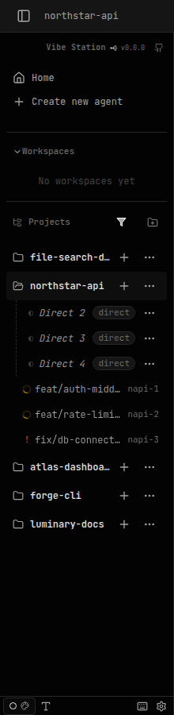
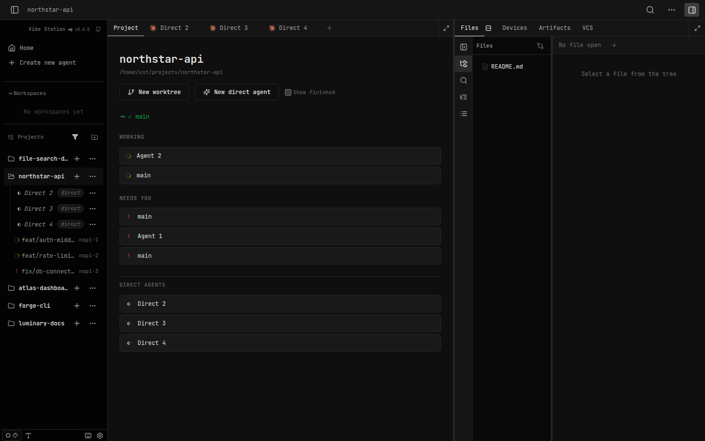
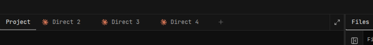
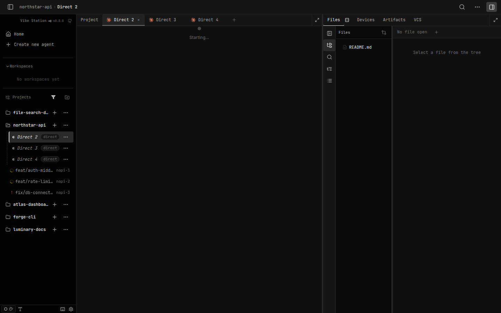
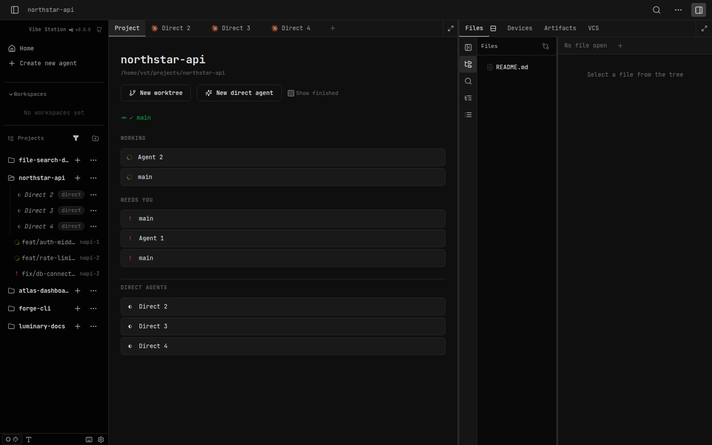

# SDLC report: project-home-workspace UI verification

**Date:** 2026-09-24 · **Sandbox:** http://localhost:7174 · **Commits verified:** ac690c05, eccc5ab0, bcd6eada, b07cb225

## Bugs (found and fixed this pass)
| # | Symptom | Where found | Severity | Status |
|---|---------|-------------|----------|--------|
| 1 | The pinned "Project" tab from the PRD's own mockups (R1, Resolved design question #3) never existed as an actual `TabsStrip` entry — the project home was only reachable as a bespoke `activeSessionId === null` fallback, with nothing in the tab strip representing it. First screenshot pass showed no tab strip content at all for an empty project. | `web-ui/src/components/layout/TabsStrip.tsx`, `web-ui/src/routes/Workspace.tsx` | High (explicit PRD requirement violated) | **Fixed** — `b07cb225` |
| 2 | `ProjectHomeTab.tsx`'s `project-home__*` classNames had zero matching CSS anywhere in the codebase — the whole Project tab rendered as unstyled raw HTML (no borders, no card backgrounds, no button styling). | `web-ui/src/styles/workspace.css` (missing block) | Medium (visually broken, no functional impact) | **Fixed** — `b07cb225` |

## Root cause
- **Bug 1:** `Workspace.tsx` rendered `ProjectHomeTab` as the fallback content when `activeSessionId == null`, but `TabsStrip.tsx`'s tab list was built purely from `orderedSessions` (agent sessions) — there was no tab representing "no session selected." `Workspace.test.tsx`'s own `4.T11` test encoded this as intentional ("bespoke, not a closeable TabsStrip tab"), which was itself wrong per the PRD.
- **Bug 2:** `ProjectHomeTab.tsx` was written using its own BEM-style classNames (`project-home`, `project-home__header`, etc.) that were never added to `workspace.css` — an oversight from the original implementation phase that neither `tsc` nor `vitest` could catch (they don't verify CSS coverage), only a real rendered screenshot did.

## Fix
- `TabsStrip.tsx`: added a real, always-first, non-sortable, non-closeable `role="tab"` "Project" entry, rendered only for `kind="agent" && scope="project"`. Active (`aria-selected`) whenever `activeSessionId == null`; clicking it calls `setActiveSession(null)`, which the existing `useProjectWorkspaceUrlSync` write effect already reflects onto the URL (`/project/:id`).
- `Workspace.tsx`: corrected the stale comment describing the Project tab as "bespoke... not a closeable TabsStrip tab."
- `Workspace.test.tsx` (`4.T11`) and new `TabsStrip.test.tsx` (`4.T3b`): rewritten/added to click the real tab and assert it's first, pinned (no close control), and correctly toggles `activeSessionId`/the URL — instead of asserting the old (wrong) bespoke behavior.
- `workspace.css`: added a full `.project-home*` rule block using the same design tokens (`--space-*`, `--bg-card`, `--border-default`, `--fg-success/warning/danger`, etc.) as the equivalent `DashboardPanel`/`.dashboard-card` styles it was always meant to visually match.
- Verified: `tsc --noEmit` clean, `Workspace.test.tsx` + `TabsStrip.test.tsx` + `ProjectHomeTab.test.tsx` + the other 5 previously-checked suites all green (182 passed, only the 5 pre-existing unrelated `TopBar.test.tsx` canvas-mode failures). Screenshots below regenerated against the fixed code and visually confirmed.

## Known non-blocking gap (not fixed this pass — separate, low-severity, pre-existing this feature)
| # | Symptom | Where found | Severity |
|---|---------|-------------|----------|
| 3 | Entering a project workspace fires `GET /api/worktrees/{projectId}/pending-file-opens` → 404 (project id passed to a worktree-only endpoint). Swallowed best-effort — no visible breakage, WS live path still works. | `web-ui/src/hooks/usePendingFileOpens.ts:41-53` → `client.ts` (hardcoded `/worktrees/:id/...`); daemon has no project-scoped route (`rust/vst-routes/src/worktrees.rs:1912-1926`) | Low |

**Action item (open):** give the project workspace a project-scoped `pending-file-opens` path — either add a daemon route under `/projects/:id/pending-file-opens`, or route the web-ui client methods to a project endpoint when scope is project, keying WS events `ev.worktreeId ?? ev.projectId` consistently.

## Screenshots (regenerated against the fixed code)

**Sidebar split** — left sidebar in the project workspace: `northstar-api` row. Clicking the **name** link navigates to `/project/northstar-api`; clicking the **folder** icon only toggles expand/collapse and does not navigate.

**Project tab** — the real tab strip is now visible and correct: **Project** (pinned, first, active/underlined) · Direct 2 · Direct 3 · Direct 4 · `+`. Below it, the properly-styled Project tab content: name + path header, git status "✓ main", bordered "New worktree"/"New direct agent" buttons, "Show finished" checkbox, and bordered card rows for the Working/Needs You sections plus a "Direct agents" list.

**New agent tab** — tab strip immediately after dogfooding "New direct agent" — a new live direct-agent tab appears alongside the pinned Project tab, with a "×" close control (not a terminate confirm), correct R16 close semantics.

**Agent tab active** — the "Direct 2" tab is active (highlighted, close "×" visible); breadcrumb reads `northstar-api › Direct 2`; the pinned "Project" tab remains visible with no close control; the same shared project-scoped Files tools pane persists on the right.

**Back to project tab** — clicked the real "Project" tab directly (previously impossible — this tab didn't exist) → URL `/project/northstar-api`, Project tab shown active/underlined, ProjectHomeTab content visible, shared tools pane persisted (no reset to empty on the switch).

## Console errors observed (this run)
- **Bug 3 above (open, not fixed this pass):** `GET /api/worktrees/northstar-api/pending-file-opens` → 404.
- **Pre-existing / not feature-caused:** `GET /api/worktrees/{wtId}/diffstat?scope=branch` → 422 for demo worktrees on the root dashboard, before navigating to any project — unrelated to this feature.
- No uncaught `pageerror` events during the run.

## Notes / non-bugs
- **Non-git project (step 7):** no non-git project exists in the seed data (all 5 projects report `isGit: true`) — skipped, not fabricated.
- **Direct-agent count drift:** repeated verification runs accumulate persisted direct agents for `northstar-api` (`Direct 2/3/4`, shown as "ClaudeDirect N×" in the sidebar) — expected side effect of dogfooding "New direct agent" across runs, not a bug.
