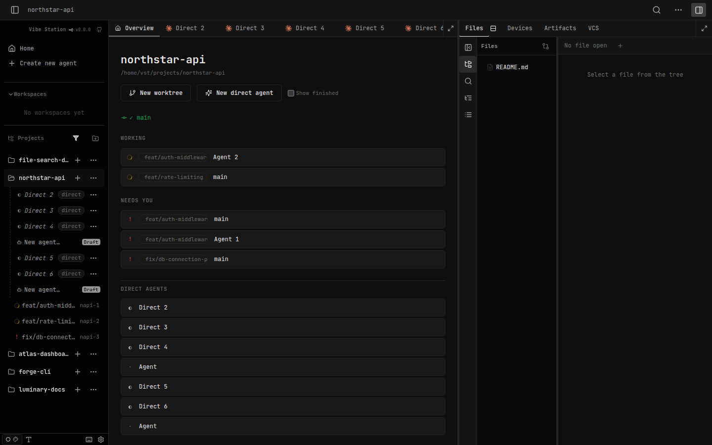
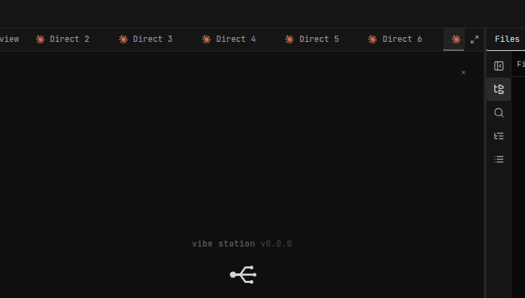
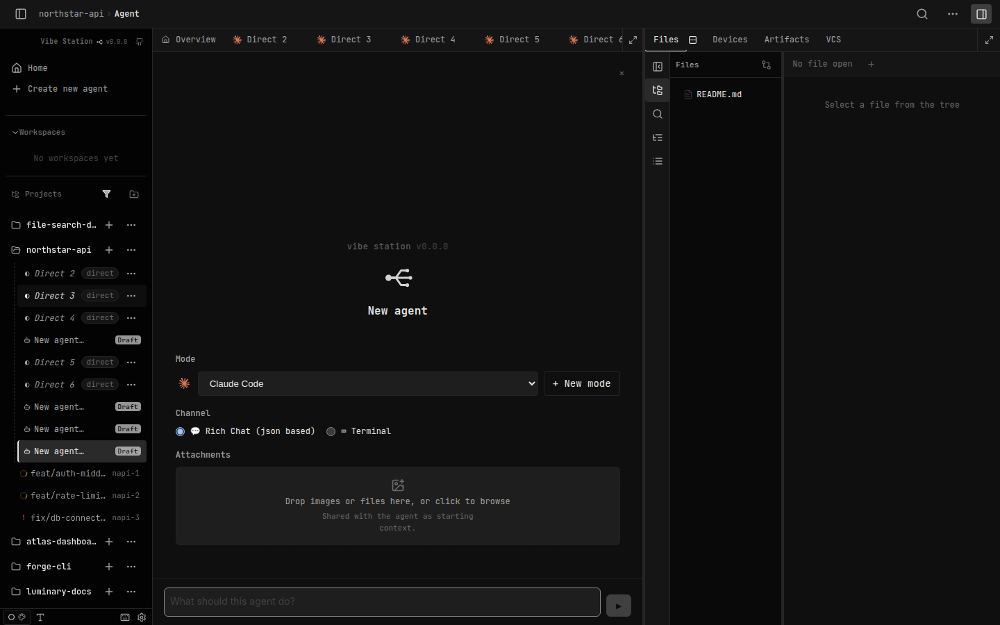
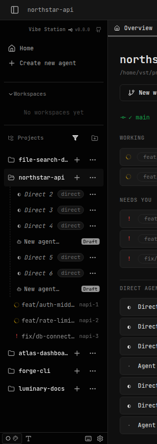

# SDLC report: project-home-workspace tab/sidebar UX fixes (plan-04)

**Date:** 2026-09-24 · **Sandbox:** http://localhost:7174 · **Plan:** `.vibekit/feature-plans/wip/project-home-workspace/plan-04-tab-sidebar-ux-fixes.md`

## Summary

Implemented all 6 items from live human testing of the shipped project-home-workspace feature:

| # | Item | Status |
|---|------|--------|
| 1 | Agents on the project page were not tappable | Fixed |
| 2 | Worktree shown in the agent chip | Fixed |
| 3 | "+" button now opens a draft, not a live agent | Fixed |
| 4 | Sidebar "+" → "Agent in project dir" matches tab "+" behavior | Fixed |
| 5 | Sidebar project-row tap target too small | Fixed |
| 6 | Tab renamed "Project" → "Overview" | Fixed (human-confirmed) |

Also DECIDED (human-confirmed, same round): ProjectHomeTab's own "New direct agent" button now also opens a draft, for consistency with the tab-strip "+" button.

## Fixes

### 1 & 2 — Tappable bucket/direct-agent rows + worktree chip
- `web-ui/src/components/layout/ProjectHomeTab.tsx`: bucket rows and "Direct agents" rows are now `<button>`s. Worktree rows call `onOpenAgent({ worktreeId, sessionId })` (reuses `Workspace.tsx`'s `handleAgentCreated`); direct rows call `openProjectAgentTab` + `setActiveSession`.
- Worktree bucket rows now show a `project-home__wt-chip` (branch/name + `GitBranch` icon) before the session label. `worktreeLabel()` moved from `LeftSidebar.tsx` into `web-ui/src/lib/sessionLabel.ts` so both files share one naming source.
- `ProjectHomeTabProps.onWorktreeCreated` renamed to `onOpenAgent` (does both jobs now).

### 3 — "+" opens a draft, not a live agent (+ DECIDED: "New direct agent" button too)
- New shared helper `web-ui/src/lib/projectDraft.ts` → `createProjectDirectDraft(api, projectId)`: calls `api.createDraftSession({ target: "direct", projectId, type: "agent", draftConfig: { entryPoint: "tab", channel: "json" } })`, registers the response with the store immediately (matches the existing draft-creation convention across the codebase).
- `TabsStrip.tsx`'s project-scope "+" and `ProjectHomeTab.tsx`'s "New direct agent" button both now use this helper instead of `createDirectSession`. Removed the now-dead `noModes`/`resolveDefaultModeId` plumbing from both (DraftComposer resolves its own default mode).
- `Workspace.tsx`: added a drafting branch to the project pane (mirrors the existing worktree-pane branch) so a project-scope draft renders `DraftComposer`, not a broken `PaneOutlet`. Excluded drafting sessions from `projectPaneKeys` so no `AgentPaneSlot` mounts for them.

### 4 — Sidebar "+" → "Agent in project dir" matches the tab "+"
- `LeftSidebar.tsx`'s `handleNewDirectAgent` now calls `createProjectDirectDraft` and navigates to `/project/:pid/:id`, instead of the legacy full-page `/draft/:id` composer.
- `draftsByProject` widened to include worktree-less `entryPoint: "tab"` drafts in the sidebar's direct-session list; their row links to/highlights on `/project/:pid/:id` instead of `/draft/:id`.
- `confirmDiscardSession` now handles the `/project/:pid/:id` case (closes the tab, navigates back to the project Overview) alongside the existing `/draft/:id` case.

### 5 — Sidebar project-row tap target
- `LeftSidebar.tsx`: the project row's name is no longer a link wrapping just the text (one line tall). It's now a plain label, with a full-row `.wt-row__stretch-link` (same pattern as every other sidebar row) providing the actual click target. The folder-toggle button and "+"/"⋯" actions sit above it via z-index so they stay independently clickable.
- Removed the now-unused `.tree-row__project-link` CSS rule.

### 6 — Naming: "Project" → "Overview"
- `TabsStrip.tsx`: the pinned tab's label changed from "Project" to "Overview", with a small `Home` icon that's always visible; the text label collapses on screens ≤600px (`aria-label="Overview"` keeps it announced to assistive tech either way).
- PRD mockups and R1 updated to reflect the shipped label.

## Verification

- `cd web-ui && npx tsc --noEmit` — clean.
- `cd web-ui && npx vitest run` (8 phase-relevant test files) — 264 passed.
- `cd web-ui && pnpm test -- --run` (full suite) — 1301 passed; the 9 failures are the same pre-existing, unrelated ones confirmed present before this round (`TopBar.test.tsx` canvas-mode ×5, `client.test.ts` file-watch ×1, `WorkspaceCanvas.test.tsx` ×1, `VcsPanel.test.tsx` ×2).
- Live-driven against the real dev sandbox (`scripts/verify-project-home-workspace-ux2.mjs`, screenshots below) — all 6 items confirmed working end to end, including the two the plan's own Risks section flagged as jsdom-unverifiable (item 5's real hit-area, item 3's draft-vs-live distinction).

## Screenshots

**Bucket rows with worktree chips (items 1, 2, 6)** — tab strip reads "Overview" first; each Working/Needs You row shows its worktree's branch as a chip before the session name; rows are visibly buttons.

**Item 3 — "+" opens a draft** — clicking the tab-strip "+" navigated to `/project/northstar-api/<id>` with a Draft chip and `DraftComposer` rendered (confirmed via DOM query, not just this crop) — never a live agent.

**Item 4 — sidebar "+" → "Agent in project dir"** — lands on the same `/project/:pid/:id` draft-tab URL the tab-strip "+" produces, with the sidebar row highlighted (`data-active="true"`).

**Item 5 — sidebar offset tap** — clicking a few px above the visible project-name text (still inside the row's own box) navigated to `/project/northstar-api` — previously a dead zone.

## Console errors observed (this run)
- Repeated 422 on `/api/worktrees/{wtId}/diffstat?scope=branch` — pre-existing, unrelated to this feature (confirmed in the prior round's report).
- 2× 404 — the already-documented open Bug 3 (`pending-file-opens` project-scope gap, `.vibekit/reports/2026-09-24-project-home-workspace-ui-verification.md`), unrelated to this round's fixes.
- No uncaught `pageerror` events.

## Not fixed this round (unchanged, tracked separately)
- Bug 3 from the prior UI-verification report (`pending-file-opens` 404 for project scope) — still open, low severity, out of scope for this UX-fix batch.

## Follow-up regression (item 5), found by the human immediately after this round, now fixed

Item 5's fix (full-row `.wt-row__stretch-link`, z-index 1) accidentally introduced the OPPOSITE bug: tapping a few px above/below the project name worked, but tapping exactly on the visible text did nothing — the reverse of the original complaint.

- **Root cause:** the fix raised `.tree-row__project-main` (`z-index: 2`) to keep the folder-toggle **button** independently clickable above the stretch-link. But that rule applied to the whole wrapper `
`, not just the button — so `.tree-row__label` (the plain text span, no click handler) was also lifted above the link. Confirmed via `document.elementFromPoint()` at the label's exact center: it resolved to `.tree-row__project-main` itself, not the stretch-link.
- **Fix (`web-ui/src/styles/workspace.css`):** `.tree-row__project-main` is now `pointer-events: none` (transparent to hit-testing everywhere, including over the label), with `pointer-events: auto` punched back explicitly onto `.tree-row__project-expand` — the one real interactive child that must stay independently clickable.
- **Verified live** via a headless Playwright + `elementFromPoint` check against the real dev sandbox (not just jsdom, which can't test pixel layout at all): the label's exact center, 6px above it, and 6px below it all now resolve to `.wt-row__stretch-link` and navigate to `/project/:id`; the folder-toggle icon still only toggles and does not navigate.
- jsdom's existing unit test (`LeftSidebar.test.tsx` `5.T2`) already only asserts click-handler wiring, not pixel geometry — left as-is per its own comment; this class of bug is only catchable in a real browser.
