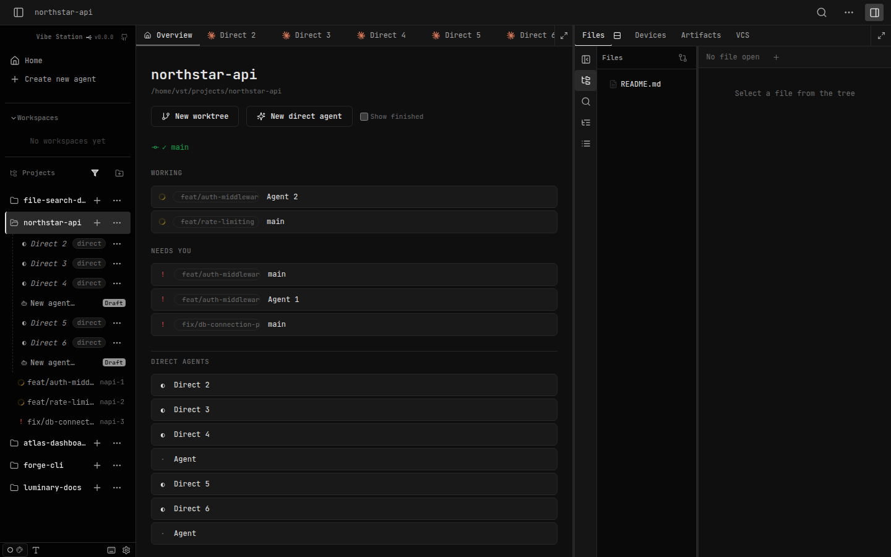

# SDLC report: project-home-workspace UX fixes, round 3

**Date:** 2026-09-25 · **Sandbox:** http://localhost:7174 · **Round:** follow-up to plan-04 (ux2-fixes)

## Bugs

| # | Symptom | Where found | Severity | Status |
|---|---------|-------------|----------|--------|
| 1 | Selecting a direct agent from the left sidebar correctly updated tab selection state, but the tab strip never scrolled to reveal the newly-active tab if it was outside the visible scroll area — no auto-scroll logic existed at all | `web-ui/src/components/layout/TabsStrip.tsx` | Medium | **Fixed** |
| 2 | The Overview tab's content was left-shifted, not horizontally centered; the scrollbar rendered inside the content's own padding rather than flush against the pane's true right edge | `web-ui/src/styles/workspace.css` (`.project-home`), `web-ui/src/components/layout/ProjectHomeTab.tsx` | Medium | **Fixed** |
| 3 | When the Overview tab was active, the sidebar's project row had no visual highlight at all — only individual session rows got `data-active` | `web-ui/src/components/layout/LeftSidebar.tsx` | Low | **Fixed** |

## Root cause

- **Item 1:** `TabsStrip.tsx` had zero `scrollIntoView`/`scrollLeft` logic tied to the active tab — confirmed by grep before touching anything. Clicking a tab in the strip itself is always visible (you clicked what you can see), so this only manifests when activation comes from elsewhere (sidebar, bucket rows, "New direct agent").
- **Item 2:** `.project-home` (`workspace.css:5258`) owned BOTH `overflow: auto` and `max-width: 760px` on the same box, with no `margin-inline: auto`. The scrollbar therefore rendered at the edge of the narrower, left-hugging content box, not the pane's actual right edge.
- **Item 3:** the project row `
` (`LeftSidebar.tsx:1794`) never set `data-active` at all — only session rows did. `.tree-row[data-active="true"]` already has generic highlight CSS (`workspace.css:1999`), it just needed the attribute wired up.

## Fix

- **Item 1:** new `useEffect` in `TabsStrip.tsx`, keyed on `activeSessionId`, queries `[data-active="true"]` inside the scroll container and calls `scrollIntoView({ block: "nearest", inline: "nearest", behavior: "smooth" })` — purely horizontal, no vertical/page-scroll side effects.
- **Item 2:** split into two elements — `.project-home-scroll` (new, full-width, owns `overflow: auto`, scrollbar now sits at the pane's true edge) wrapping `.project-home` (keeps `max-width: 760px`, gains `margin-inline: auto` to actually center).
- **Item 3:** `data-active={location.pathname === \`/project/${p.id}\`}` added to the project row — reuses existing generic highlight CSS, no new rules needed.

## Verification

- `cd web-ui && npx tsc --noEmit` — clean.
- `cd web-ui && npx vitest run` (TabsStrip, LeftSidebar, ProjectHomeTab, Workspace) — 154 passed.
- Live-verified against the real dev sandbox via headless Playwright (not just unit tests, which can't verify pixel layout or real scroll behavior):
  - Item 1: clicked a sidebar-linked direct-agent tab that was off the visible edge of a narrow (900px) tab strip — `fullyVisible: true` after the click, confirmed via `getBoundingClientRect()` comparison against the scroll container.
  - Item 2: at a wide (1900px) viewport, `.project-home`'s computed `max-width` is `760px` with left/right margins equal (~106px each) — genuinely centered, not just visually plausible.
  - Item 3: `document.querySelector('.tree-row--project').dataset.active === "true"` when on the bare `/project/:id` route.

## Screenshot

Sidebar's `northstar-api` row shows the active highlight (item 3); Overview content is at natural width here since the pane itself is narrower than the 760px cap at this viewport — see the Verification section above for the wide-viewport centering proof, which a screenshot alone can't demonstrate as precisely as the measured margins.
