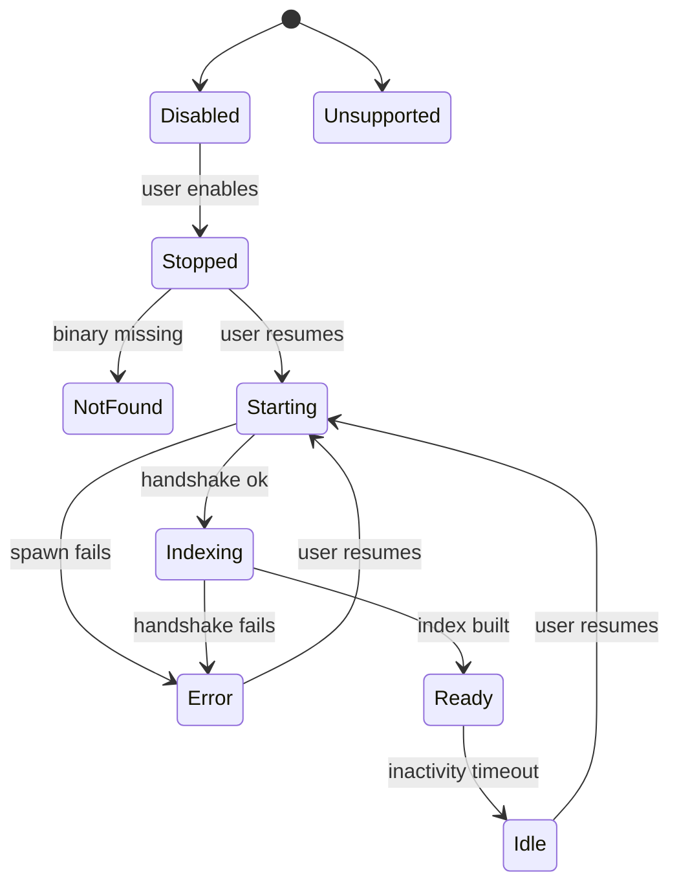

<!--
RULES — read before writing this report:
1. This is a SMALL file — bugs, root cause, action items, optional diagrams. Nothing else.
2. FORMAT: tables, bullet points, mermaid diagrams ONLY — no prose paragraphs
3. An empty section is omitted entirely, never left as a stub heading
4. This file MUST be written to disk at the path below — never answer `/sdlc report` in chat only
-->

# SDLC report: lsp-status/sidepanel-sync-and-states

**Date:** 2026-09-27 · **Commit:** 52ba68f2 · **Sub-feature(s) covered:** none yet (standalone scoping report, no active feature bundle)

## Bugs

| # | Symptom | Where found | Severity |
|---|---------|-------------|----------|
| 1 | Tools-pane sidepanel no longer shows an LSP status indicator at all — only the global bottom bar does. Not "out of sync", **absent**. | `web-ui/src/components/layout/ToolPanel.tsx` (removed), `web-ui/src/components/tools/LspStatusBadge.tsx` (now dead code, referenced only by its own test) | Medium — regresses user-visible expectation set by the task |
| 2 | LSP status popup renders offscreen/cropped at the right viewport edge | `web-ui/src/styles/workspace.css:6038` `.lsp-status-row__popup` | High — handled in companion change, see Action item 2 |
| 3 | No single reference documents all 9 `LspStatus` states and their UX treatment | scattered across `rust/vst-types/src/rest/lsp.rs:12-24`, `rust/vst-lsp/src/manager.rs:299-331`, `web-ui/src/hooks/useLspStatus.ts:83-100`, `web-ui/src/components/layout/LspStatusRow.tsx:19-41` | Low — no functional bug, but blocks the "improve the UI" ask |

## Root cause

- **Bug 1** → commit `a6423c49` ("move LSP status into a global bottom status bar") consolidated the indicator into one global-bar render site and deleted the tools-pane render call, without a recorded decision on whether the sidepanel should keep its own. `LspStatusBadge.tsx` was left orphaned instead of deleted.
- **Bug 2** → `.lsp-status-row__popup` (`workspace.css:6038`) anchors `left: var(--space-3)` relative to a trigger pinned at the far-right edge of the viewport (`.global-status-bar__spacer{flex:1}` pushes `.lsp-status-row` right, `workspace.css:5956-5967`), with `max-width: 420px` and no viewport clamp — pure CSS anchor-side bug, no JS positioning existed to catch it.
- **Bug 3** → `LspStatus`'s 9 variants (`unsupported`, `not_found`, `starting`, `indexing`, `ready`, `idle`, `stopped`, `error`, `disabled`) have their semantics spread across Rust enum comments, manager transition logic, and two separate frontend label maps — never unified into one doc a designer/reviewer can read without cross-referencing 4 files.

## Action items

| # | Action | Owner sub-feature | Status |
|---|--------|--------------------|--------|
| 1 | Decide whether the tools-pane sidepanel should regain its own LSP indicator alongside the global bar, or whether global-bar-only is the intended final state. If restoring: re-render using the already-shared `useLspStatus` hook (`web-ui/src/hooks/useLspStatus.ts`) — both consumers poll the same `GET /worktrees/:id/lsp/status` REST endpoint independently, so once both exist they are automatically consistent (no new store/sync mechanism needed, just two mount points on one source of truth). Either delete `LspStatusBadge.tsx` + `LspStatusBadge.test.tsx` (if not restoring) or repurpose them as the sidepanel's new render (if restoring) — don't leave them orphaned either way. | `lsp-status-fixes` | **done** — restored `<LspStatusRow>` verbatim in `ToolPanel.tsx`; `LspStatusBadge`/`lspLanguage.ts` deleted (not repurposed — see plan's Decision 6/Research). Shipped in the single squashed commit in [PR #185](https://github.com/fastestdevalive/vibe-station/pull/185). |
| 2 | Clamp `.lsp-status-row__popup` to the viewport (flip horizontal anchor + bound `max-width` by `100vw`) so it can never render offscreen. | this session (companion Opus subagent) | **done** — folded into the single squashed commit in [PR #185](https://github.com/fastestdevalive/vibe-station/pull/185) (originally its own commit, later squashed per user request). |
| 3 | Publish a single LSP-states reference (table below is a starting draft) — either as a new `docs/LSP-STATUS.md` (mirroring the pattern `docs/STATUS-INDICATORS.md` already sets for session lifecycle/PR status) or as a doc-comment block directly above `STATUS_WORD`/`STATUS_DOT_MOD` in `LspStatusRow.tsx:19-41`. | `lsp-status-fixes` | **partially done** — the "single reference" now lives in code as `vst_lsp::status::describe()` (the executable source of truth, not just docs); a standalone `docs/LSP-STATUS.md` was not written. Still open if a prose doc is wanted in addition. |
| 4 | UI polish pass on the status row + popup: (a) "Resume"/"Enable" action button (`LspStatusRow.tsx:129-131`) has no loading/disabled state while `onClick` is in flight — a double-click can double-fire; (b) popup only closes on outside-click (`LspStatusRow.tsx:60-69`) — no `Escape` key handler; (c) when a worktree has >1 active language, the bar only ever shows the *previewed file's* language — consider a small stacked-dot summary in the bar itself so a non-active language's `error`/`stopped` state isn't hidden until the popup is opened. | new bundle | open |

### Draft states reference (for action item 3)

| State | Rust variant | Meaning | Dot color | User action available | Reachable from |
|-------|-------------|---------|-----------|------------------------|-----------------|
| Disabled | `Disabled` | LSP turned off for this workspace (user setting) | gray | "Enable" button in popup | initial / user toggle |
| Unsupported | `Unsupported` | No language detected for the previewed file | gray | none (informational) | initial |
| Not found | `NotFound` | Language detected, but server binary missing on host | gray | none (informational — "server not found on host") | Disabled→enable, or Stopped |
| Stopped | `Stopped` | Language supported + server binary found, but no server process started yet | gray | "Resume" button in popup | Disabled→enable, Idle (after teardown), Error (after reset) |
| Starting | `Starting` | Server process spawned, not yet handshaked | yellow | none (transient) | Stopped→resume |
| Indexing | `Indexing` | Server handshaked, building its workspace index | yellow | none (transient) | Starting |
| Ready | `Ready` | Server fully up, serving requests | green | none | Indexing |
| Idle | `Idle` | Server was `Ready`, timed out from inactivity | gray | "Resume" button in popup (re-spawns) | Ready, after idle-timeout (`manager.rs:255-270`) |
| Error | `Error` | Spawn or handshake failed | red | none shown today (candidate for a "Retry" action — see action item 4) | Starting/Indexing (spawn failure, `manager.rs:666,724`) |

## Diagrams

