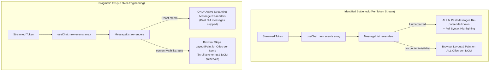

# SDLC report: rich-chat-performance/pragmatic-optimization

**Date:** 2026-09-27 · **Commit:** 74557a9d · **Sub-feature(s) covered:** root (rich-chat-perf)

## Bugs
| # | Symptom | Where found | Severity |
|---|---------|-------------|----------|
| 1 | Long-running chat sessions become sluggish (high CPU, typing lag, scroll stutter) | User report; verified in `useChat.ts` & `MessageList.tsx` | Major |
| 2 | Every live streaming token triggers unmemoized markdown re-parsing (`ReactMarkdown` + `remark` + `rehype`) across ALL historical messages | Code audit (`StreamingMarkdown.tsx`, `TextMessage.tsx`, `ThinkingBlock.tsx`, `ToolRunSummary.tsx`) | Critical |
| 3 | Off-screen messages trigger full layout and paint across thousands of DOM nodes without viewport containment | Code audit (`MessageList.tsx`, `chat.css`) | Major |
| 4 | Active chat event state grows unbounded in JS heap during long sessions | Code audit (`useChat.ts:304`) | Minor |

## Root cause
- `Full-Transcript-Markdown-Recomputation` → `StreamingMarkdown.tsx:36`, `TextMessage.tsx:25`, `ThinkingBlock.tsx:53`, `ToolRunSummary.tsx:295` — components rendering past messages lack `React.memo`; on every streamed token chunk, React re-renders every historical message, re-running markdown AST generation and syntax highlighting for the entire transcript.
- `Uncontained-Offscreen-Layout-and-Paint` → `chat.css` (`.chat-message-list > *`) — off-screen messages are continuously laid out and painted by the browser engine; missing CSS `content-visibility: auto` to allow the browser to skip rendering for off-screen nodes without sacrificing DOM continuity or scroll anchoring.
- `Unbounded-Live-Event-Accumulation` → `useChat.ts:304` — in-memory `events` array grows without a ceiling during an active session (secondary factor compared to markdown re-parsing).

## Action items
| # | Action | Owner sub-feature | Status |
|---|--------|--------------------|--------|
| 1 | Memoize settled message components: wrap `StreamingMarkdown`, `TextMessage`, and `ThinkingBlock` in `React.memo`, and add custom reference-preserving `areEqual` to `ToolRunSummary` so only the actively streaming bubble re-renders on token updates (~40 LOC) | `01-memoize-chat-items` | open |
| 2 | Apply CSS `content-visibility: auto` with `contain-intrinsic-size: auto 120px` to `.chat-message-list > *` (excluding floating buttons and sentinels) to skip browser layout/paint for off-screen messages without breaking existing 150-line scroll anchoring | `02-content-visibility` | open |
| 3 | (Rejected as over-engineering) Virtualization libraries (`@tanstack/react-virtual` / IO windowing) and bidirectional sliding event buffers: would require rewriting delicate scroll-anchor logic (`:568-771`) and prepend-delta math | n/a | rejected |
| 4 | (Optional Phase 3) Simple one-way turn-boundary tail cap on `useChat.ts` `events` (e.g. at 5,000 events) only if heap profiling after Phases 1–2 justifies it | `03-memory-cap-optional` | open |

## Diagrams

