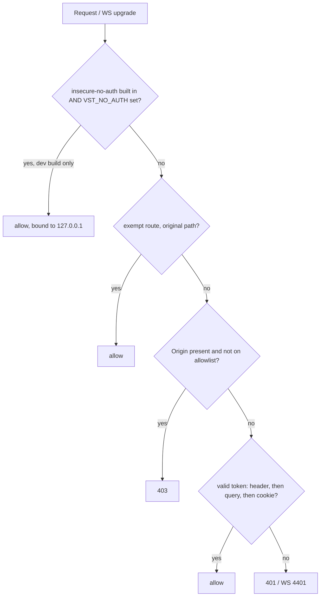

# SDLC report: api-ws-auth-proposal

**Date:** 2026-09-30 · **Commit:** c38b412e · **Sub-feature(s) covered:** root (audit + proposal, no code changed) · **Supersedes:** earlier draft audit (deleted) · **Reviewed:** Opus read-only review, corrections folded in

## Bugs
| # | Security issue | Applies to | Where found | Severity |
|---|----------------|------------|-------------|----------|
| 1 | `/ws` upgrade has no Origin check. Any web page the user visits can open `ws://localhost:<port>/ws` with no token and get full terminal/agent control (cross-site WebSocket hijacking) | Tauri (attended) | `server.rs:1057-1130` vs REST guard `server.rs:934-954` | High |
| 2 | `VST_NO_AUTH=1` disables all auth in any build while the daemon binds `0.0.0.0`; anyone on the LAN gets full control | Any build | `run.rs:338-346`, `run.rs:517` | High |
| 3 | Loopback trust: any local process or user calls every endpoint with no token | Tauri (attended) | `server.rs:932-988`, test `non_headless_daemon_still_trusts_loopback_with_no_token` | Medium |
| 4 | Loopback detection differs between HTTP (honors `X-Forwarded-For`) and WS (ignores it); a loopback proxy without `cf-connecting-ip` makes remote clients look local. Tailscale serve unverified | Tauri (attended) | `server.rs:908-930` vs `server.rs:1087-1088` | Medium |
| 5 | Same-origin GETs carry no `Origin` and `Host` is never validated, so DNS rebinding can read REST data | Tauri (attended) | `server.rs:934-954` | Medium |
| 6 | CORS mirrors any request Origin with credentials allowed, and the Origin check only runs inside the loopback branch, so cookie-authenticated tunnel/LAN requests get no Origin check; cookie is `SameSite=Lax`, so same-site pages (e.g. another localhost port) still get through | Remote/cookie sessions | `server.rs:555-557`, `server.rs:933` | Medium |
| 7 | Tunnel-only routes (tunnel enable/disable, QR codes, `/continue` mint) decide "remote" from `cf-connecting-ip` alone, so LAN and Tailscale clients, which never send it, count as local | Any | `server.rs:3853, 3869, 3895, 3909, 3987`; `mobile_auth.rs:299` `is_tunnel_request` | Low–Medium (needs a valid token first) |
| 8 | WS token order is header → cookie → `?token=`, so a stale cookie hides a valid query token; the Tauri token in the URL can appear in proxy logs (Vite, cloudflared) | Tauri, dev | `server.rs:1095-1107`, `client.ts:93-97` | Low |
| 9 | `parse_cookie_value(..).leak()` leaks a `String` per cookie-authenticated request | All | `server.rs:965`, `:1022`, `:1103` | Low |

## Root cause
- `loopback trust` (bugs 1, 3, 4, 5) → `server.rs:925-988` → added for the original desktop app, which had no login; later patched with the `cf-connecting-ip` check (`2ca4dffd`), XFF handling and the `headless` flag (`31535299`) to undo holes it opened
- `loopback trust is now vestigial` → the desktop app already sends its token: `main.rs:116` injects `__VST_TOKEN__`, `client.ts` `apiFetch` sends `Authorization: Bearer`, `wsUrl()` sends `?token=`; the session list already keys on token id (`server.rs:3742-3773`)
- `NO_AUTH kill-switch` (bug 2) → `run.rs:338` → runtime env var, no build gate, no bind guard
- `duplicated gate` (bugs 4, 8, 9) → HTTP middleware and WS handler each re-implement token extraction and loopback logic
- `origin handling` (bugs 1, 6) → Origin is checked in one branch only; CORS is permissive by default
- `cf-connecting-ip overloaded` (bug 7) → one header doubles as an auth-bypass guard and a "remote client" signal for route policy

## Proposal
One change: **the daemon always authenticates; the only bypass is a compile-time feature that release builds cannot contain.**

| # | Rule | How it works |
|---|------|--------------|
| P1 | No loopback concept in auth | Delete the `is_loopback` branches, the `headless` auth gate, and the XFF logic. Every request needs a valid token, except `/health`, `/mobile-auth`, `/continue`, `POST /api/auth/logout`, and static UI `GET`/`HEAD`. Match exemptions on the **original** path (not the post-`/api`-rewrite path). **Keep** `cf-connecting-ip` only as a route-policy signal (see P8), never as an auth input |
| P2 | One gate function | `authenticate(headers, query)` used by the HTTP middleware and `/ws`. Returns an owned token `String` (no `.leak()`). Defines token order explicitly: `Authorization` header → `?token=` (WS only) → cookie, so a stale cookie cannot shadow a valid token |
| P3 | Origin allowlist everywhere | Reject when `Origin` is present and not localhost/127.0.0.1/tauri or a known tunnel/LAN host. Applies to every authenticated request and the WS upgrade. Replace `AllowOrigin::mirror_request()` with the same allowlist |
| P4 | `VST_NO_AUTH` is compile-time | Cargo feature `insecure-no-auth`, off by default. Gate **only** the env read at `run.rs:338`; keep `BuildServerOptions.no_auth` (tests build servers with `no_auth: true`). Forward the feature through `vst-cli`'s features, since the published binary is `vst-cli`. Without the feature a set `VST_NO_AUTH` logs a warning and is ignored. `prep-sidecar.sh` and release CI never enable it; CI asserts the published binary rejects it |
| P5 | No-auth builds are local-only | With the feature on, bind `127.0.0.1` unless `VST_NO_AUTH_BIND_ALL=1`. The Docker sandbox's host `build:rust` step enables the feature and sets the opt-in (`dev-entrypoint.sh:220-232`) |
| P6 | Desktop never falls back to tokenless | Replace the empty-token fallback (`main.rs:88-96`) with an error screen |
| P7 | Remove `headless` / `VST_TAURI_SUPERVISED` | Its only security use was the loopback bypass. Delete the fields `DaemonOptions.headless`, `BuildServerOptions.headless`, `AppState.headless` (`run.rs:60,240,465`, `server.rs:120,142,514`); env parsing at `vst-daemon/src/main.rs:22` and `vst-cli/src/dispatch.rs:41` (`EntryMode::Daemon` loses its field); `vst-cli/src/main.rs:12-16` and `:505`; `desktop/src-tauri/src/daemon.rs:111`; `scripts/dev-start.sh:18-19,101`; `docker-compose.dev.yml:67-69` comment; `vst-agents/src/context.rs:182`; `vst-cli/src/launch.rs:248`. Keep `spawn_headless_daemon` and `skill/SKILL.md --headless` naming: they mean "no GUI", not an auth mode |
| P8 | Fix the "remote" signal for tunnel-only routes | Decide remote-ness from a token-scope or trusted-origin check instead of header presence alone, so LAN/Tailscale clients are not treated as local (bug 7) |

### How the proposal closes each issue
| Bug | Closed by | Residual |
|-----|-----------|----------|
| 1 WS hijack | P1 (hostile page has no token) + P3 (cookie-auth case) | None |
| 2 `NO_AUTH` on LAN | P4 + P5 | Dev builds only, loopback-bound by default |
| 3 Local process access | P1 | A same-user process can still read the token from `config.json` (mode 0600); other OS users and tokenless processes are blocked |
| 4 HTTP/WS divergence | P1 + P2 | None |
| 5 DNS rebinding | P1 (rebound page has no token) | `Host` validation not needed |
| 6 CORS mirror / cookie CSRF | P3 | `SameSite=Lax` cookie remains; allowlist makes it non-exploitable |
| 7 "remote" = header only | P8 | Needs design decision on the signal |
| 8 token order / URL leak | P2 (explicit order) | `?token=` stays in the WS URL (browsers cannot set WS headers); mitigated by short-lived, scoped tokens |
| 9 Cookie leak | P2 | None |

## Action items
Land 1–4 in **one change**: removing loopback trust without the desktop error screen and the sandbox build flag breaks the release fallback and the dev sandbox in between.

| # | Action | Done when | Status |
|---|--------|-----------|--------|
| 1 | P1 + P2 + P3 in `server.rs`; flip `non_headless_daemon_still_trusts_loopback_with_no_token` to expect 401; new `ws_auth_gate.rs` tests (hostile Origin refused, `tauri://localhost` + token allowed, stale cookie does not shadow valid `?token=`) | No `is_loopback` in the tree; both paths use `authenticate`; tests pass | done |
| 2 | P4 + P5: feature in `vst-daemon`, forwarded by `vst-cli`; update `dev-sandbox.sh`, `build:rust` for the sandbox, `docker-compose.dev.yml`, `AGENTS.md`; `take-screenshots-dev.ts` keeps working via the sandbox opt-in | Release-profile binary ignores `VST_NO_AUTH=1` (test); sandbox boots without login | done |
| 3 | P6: desktop error screen instead of empty token | Failed spawn shows an error, not a tokenless window | done |
| 4 | Verify every caller sends a token: `vst-cli` (reads `cliToken` from `$HOME/.vibe-station/config.json`, `daemon_url.rs:72-80`), spawned agents (get `VST_DAEMON_URL` but no token — confirm they share the daemon's `HOME`, otherwise pass a token), desktop attach-to-running-daemon, and the `dev-start.sh` flow where a browser opens Vite with no `__VST_TOKEN__` (document login via `vst open` / `/continue`) | Manual Tauri dev pass + CLI tests + a spawned-agent `vst` call succeeds | done |
| 5 | P7: remove the `headless` flag everywhere listed; delete `supervised_flag_*` tests in `dispatch.rs`, headless cases in `tests/auth_middleware.rs`, `serve_headless` in `tests/ws_auth_gate.rs:187`, and update `tests/continue_flow.rs:28-89` plus the `headless: false` fields in `tests/{doctor_routes_http,parity_harness,main_logic,fallback_path_traversal,worktree_routes_http,attachments_multipart}.rs` | `grep -rnw headless` returns only the whitelisted "no GUI" uses (`spawn_headless_daemon`, `platform.rs`, `SKILL.md --headless`); `grep VST_TAURI_SUPERVISED` empty; `cargo test` passes | done |
| 6 | P8: replace header-only "remote" checks on tunnel/QR/`/continue` routes | LAN client cannot enable a tunnel or mint a code it should not | done |
| 7 | CI guard: published builds exclude `insecure-no-auth` | CI fails if enabled | done |
| 8 | Remove docs saying `headless` gates auth or loopback is trusted (`AGENTS.md`, doc comments at `run.rs:53-60`, `server.rs:117-119`, `main.rs:12`) | No stale claims | done |

## Verification (live, post-implementation)
Run at commit `96bee269` + follow-ups, on isolated daemons (own `HOME`, ports 7461-7463, docker 7110); the main dev daemon on 7421 was not touched.

| # | Scenario | Result |
|---|----------|--------|
| 1 | Default build (no feature) with `VST_NO_AUTH=1` set | Env var ignored with a warning; `/api/sessions` and `/api/projects` tokenless → 401; `/health`, `/api/health`, SPA `/` → 200 |
| 2 | Same daemon, hostile `Origin: https://evil.com` | REST 403 (with or without a valid token); WS upgrade 403 |
| 3 | Same daemon, WS | No token → 101 then close 4401; bad token → 4401; `tauri://localhost` + `?token` → stays open; stale cookie + valid `?token` → stays open; stale cookie only → 4401 |
| 4 | `insecure-no-auth` build + `VST_NO_AUTH=1` | Tokenless 200; binds `127.0.0.1` only (LAN IP refused); with `VST_NO_AUTH_BIND_ALL=1` binds `0.0.0.0` and LAN tokenless → 200 |
| 5 | CLI (`vst project ls`) | Works when `HOME` is shared with the daemon (URL + `cliToken` from `config.json`, the spawned-agent case); `Not authenticated` without a token; `VST_CLI_TOKEN` override works |
| 6 | Tauri webview simulation (`__VST_PORT__` + `__VST_TOKEN__` injected) against a token-required daemon | UI authenticated, `/api/auth/check` 200, WS opened with `?token` and stayed open, cross-origin CORS with `Authorization` OK |
| 7 | Plain browser, no token | "not signed in" screen, `/api/auth/check` 401 |
| 8 | Browser login via `POST /api/auth/continue/mint` → `/continue?code` | 302, `vst-session` cookie (HttpOnly, SameSite=Lax), WS + API authenticated; replaying the code → 410; mint tokenless → 401 |
| 9 | Docker sandbox (`dev-sandbox.sh`, port 7110) | Builds daemon with `insecure-no-auth`; daemon logs "authentication is DISABLED"; UI loads with no login, API and WS tokenless through Vite |
| 10 | Existing daemon (old build, attended) on 7421 | Answered a CLI call with no valid token — the old loopback trust, observed live |
| 11 | Real `--release` build (LTO, stripped) of `vst-cli`, no feature | Marker string absent; `VST_NO_AUTH=1` ignored at runtime with a warning; tokenless `/api/sessions` → 401 |
| 12 | CI/packaging `strings` guard | Was vacuous: the grepped text existed in neither build. Fixed by selecting `resolve_no_auth` with `#[cfg]` so `INSECURE_NO_AUTH_MARKER` exists only in feature builds; verified 0 hits (default, release) vs 1 hit (feature) |

### Changes made during verification
- `/api/health` and `/api/ws` exempted from the middleware (requested, to avoid a 401 during disconnect). No route serves them (routing precedes the middleware's path rewrite), so the effect is 404 instead of 401, same as before this work. Test `auth_middleware_exempts_api_prefixed_health_and_ws`
- `scripts/seed-file-search-demo.sh` read a legacy `"token"` field the daemon stopped writing before this work; it now reads `cliToken`. Sandbox seeding was silently failing ("non-fatal seed error") at baseline
- `scripts/dev-start.sh` header documents how a plain browser signs in now that loopback trust is gone

### Not verified
- A real `tauri dev` / packaged desktop run (the main dev Tauri app was running; only its webview contract was simulated), and the `main.rs` empty-token error screen
- A spawned agent inside a real session calling `vst` (verified only via the shared-`HOME` CLI path)
- Worktree-deployed `agy-acp` was copied from the main checkout's build to get the sandbox up; submodule is not initialised in this worktree

### Final Opus code review (read-only, after implementation)
| # | Finding | Status |
|---|---------|--------|
| 1 | `strings \| grep -q` under `set -o pipefail` misses a match (SIGPIPE), so the marker guard in `prep-sidecar.sh` and `release.yml` let a feature build through. Reproduced locally: old form missed, `grep -qaF` on the binary fires | Fixed (`grep -qaF` on the file at both sites; verified fires on feature build, clean on release) |
| 2 | `wget -S` status parse in `release.yml` could pick busybox's trailing `wget: server returned error` line, failing every release (unconfirmed) | Fixed (awk anchored to `^ +HTTP/`) |
| 3 | Docs still said loopback bypasses auth (`docs/AUTH.md`, `docs/CURL-INSTALL.md`) | Fixed (rewritten) |
| 4 | `VST_CLI_TOKEN` env beat an explicit `home` and a self-heal re-read | Fixed: env token applies only to the ambient-home lookup and is ignored once self-heal has set `SELF_HEAL_OVERRIDE` (covers `preflight` retry and `present_login_url`); pure `get_daemon_token_from_home_and_env` + 4 unit tests |
| 4b | `rust-ci.yml` guard used a name filter, so it passed with 0 tests if the test was renamed | Fixed: `--exact` plus `grep "1 passed"`, run for both default and `insecure-no-auth` builds; verified locally incl. a negative (renamed test trips it) |
| 4c | Rejected WebSocket can receive one broadcast before the 4401 close (`server.rs:1339`) | Accepted — tiny window, nothing is processed from the socket before the close |
| 4d | Dev sandbox port published on all host interfaces with a no-auth daemon (`docker-compose.dev.yml:60`) | Accepted — LAN access to the sandbox is required for the dev workflow. Mitigation is documentation only (AGENTS.md "Network exposure" note); running sandboxes from before this change are in the same state. Optional later: opt-in `VST_SANDBOX_BIND`, and drop `VST_NO_AUTH_BIND_ALL` (Vite proxies inside the container, so it only widens exposure to other containers) |
| 5 | `*.trycloudflare.com` / `*.ts.net` in the Origin allowlist are registrable by anyone; a token is still required | Open — accepted for now (owner decision); tighten to the daemon's own tunnel/tailnet host later |
| 6 | `GET /continue` via Tailscale serve (loopback peer, no `cf-connecting-ip`, no Origin) is classed local; needs a valid one-time code | Open, low |
| — | Auth bypass paths, Origin parsing (`localhost@evil`, `localhost.evil`, `null`), `#[cfg]` split, feature forwarding, bind logic, leftovers | No defect found |

## Diagrams

## Not checked
- Whether `tailscale serve` forwards `X-Forwarded-For` (moot after P1, but confirms how severe bug 4 is today)
- Per-route scope gating (Browser/Mobile/Cli/Tauri) beyond `/daemon/stop` and `/continue`; only the auth layer was audited
- Rate limiting and code entropy on `/mobile-auth` and `/continue`
- Desktop attach-to-running-daemon path: whether `config.json` always holds a `tauriToken`
- Bug 7 and bug 6 details come from the Opus review; line refs spot-checked (`cf-connecting-ip` uses, `mirror_request`) but the `SameSite=Lax` claim was not re-read
- Nothing was run; findings come from code reading and existing test names
