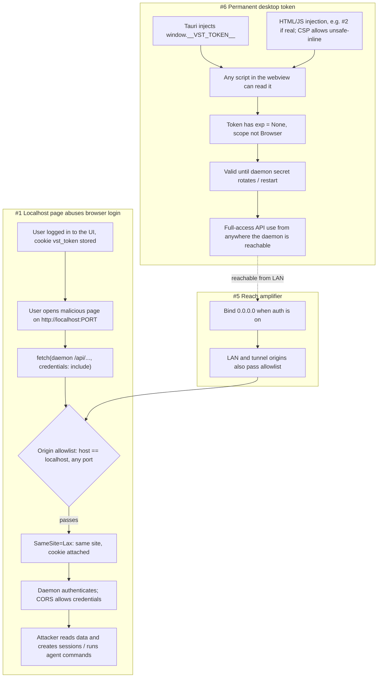

# SDLC report: security-review-triage

**Date:** 2026-10-01 · **Commit:** af2199be (triage) · **Status updated at:** `daemon-fix-token` HEAD · **Sub-feature(s) covered:** root (triage of external review findings #1, #2, #3, #5, #6)

## Bugs
| # | Symptom | Where found | Severity | Verdict | Status |
|---|---------|-------------|----------|---------|--------|
| 1 | Any page on `localhost:<any port>` passed the Origin allowlist; with `allow_credentials(true)` and a `SameSite=Lax` cookie it could read and write the daemon API | `rust/vst-daemon/src/server.rs` (CORS layer, origin check) | High | Confirmed | **Resolved** (`b83b60bf`) |
| 5 | Daemon listened on all interfaces | `rust/vst-daemon/src/run.rs` | Medium | Confirmed | **Resolved** — loopback by default, live Settings toggle (`bafb8a97`) |
| 3 | Daemon signing key (`daemonToken`) printed to stdout and `daemon.log` as "Browser login password" | `rust/vst-daemon/src/run.rs` | Medium | Confirmed | **Resolved** (`39dbb7e8`) — nothing consumed it |
| 6 | Desktop token exposed to page JS (`window.__VST_TOKEN__`) and valid off-machine | `desktop/src-tauri/src/main.rs`, `tauri.conf.json` | High (claimed) | Confirmed, severity lower than claimed | **Partially resolved** — CSP + loopback scoping done; JS global and expiry deliberately not changed |
| 2 | Mermaid/DOMPurify outdated, so malicious Markdown could run code | `pnpm-lock.yaml` (`mermaid@11.14.0`, `dompurify@3.4.2`) | High (claimed) | Confirmed (mermaid 11.14.0, CVE-2026-41149; dompurify 3.4.2 also had advisories) | **Resolved** |
| 4 | SVGs served as `image/svg+xml` | `server.rs`, `file_serving.rs` | Medium-High (claimed) | Not triaged | **Resolved** (raw files sandboxed + nosniff) |

## Root cause
- **#1 Origin check is host-only, not origin-exact** → `is_allowed_origin` accepts `localhost`, any loopback IP, any port, plus all RFC1918/CGNAT, `*.ts.net` and `*.trycloudflare.com`; it cannot tell the daemon's own UI from another local page
- **#1 Auth is ambient** → `authenticate()` (`server.rs:1004-1031`) accepts the `vst_token` cookie; `SameSite=Lax` treats different ports on `localhost` as same-site, so the browser attaches it to the attacker page's `fetch(..., {credentials:"include"})`
- **#1 Bind widens reach** → `run.rs:559-566` binds `0.0.0.0` whenever auth is on, so the LAN origins in the allowlist are reachable too (this is finding #5)
- **#6 (decisions)** → token expiry NOT added (desktop app is long-running; it already dies at every daemon restart because `daemonToken` is regenerated at boot, so a TTL would only add refresh logic); HttpOnly-cookie replacement NOT done (cross-site cookie from `tauri://localhost` to `http://127.0.0.1` is unreliable, and an injected script could still call the API same-origin); CLI-token confinement NOT done (CLI may target a non-local daemon via `VST_DAEMON_URL`, and the token is equally usable directly)
- **#6 Non-expiring scope** → `mint_token` sets `exp`/`epoch` only for `TokenScope::Browser`; every other scope, including the desktop one, gets `exp: None` and is valid until the daemon secret changes
- **#6 Token handed to JS** → Tauri `initialization_script` writes `window.__VST_TOKEN__ = <token>`, readable by any script in the webview; CSP allows `script-src 'unsafe-inline'` (`tauri.conf.json:29`), so any HTML injection can read it
- **#2 Unproven** → lockfile pins `dompurify@3.4.2` and `mermaid@11.14.0` (recent); the app sets `securityLevel: "strict"`; `web-ui/src` has no direct DOMPurify call, so DOMPurify is only a transitive dependency of mermaid. No advisory could be checked offline

## Action items

### Group 1 — Finding #1 (localhost daemon access) + #5 (LAN bind) — resolved
| # | Action | Status |
|---|--------|--------|
| 1.1 | Exact-origin policy (same-origin with `Host`, host allowlist, `VST_ALLOWED_ORIGINS`) | **done** — matrix in `docs/AUTH.md` |
| 1.2 | `SameSite=Strict` cookie, `X-VST-CSRF` on cookie writes, `Sec-Fetch-Site` refusal | **done** |
| 1.3 | (#5) Loopback by default + live "Allow network access" toggle (no restart) | **done** |

### Group 2 — Finding #2 (Mermaid/DOMPurify)
| # | Action | Status |
|---|--------|--------|
| 2.1 | Run `pnpm audit` / check advisories for `mermaid` and `dompurify` against the pinned versions | **done** |
| 2.2 | Bump either package if an advisory applies | **done** |

### Other
| # | Action | Status |
|---|--------|--------|
| 3.1 | (#3) Stop logging the daemon signing key | **done** |
| 6.1 | (#6) Drop `'unsafe-inline'` from the Tauri `script-src` CSP | **done** (`style-src` still allows it for React inline styles) |
| 6.2 | (#6) Refuse Tauri-scope tokens off-machine (tunnel/proxy headers or non-loopback peer, REST and WebSocket) | **done** |
| 6.3 | (#6) Token expiry; HttpOnly cookie instead of `window.__VST_TOKEN__`; CLI-token confinement | **decided against** (see Root cause) |
| 4.1 | (#4) Serve SVGs as downloads / with a restrictive CSP | **done** |
| 4.2 | SPA CSP header on daemon-served UI | **done** |
| 4.3 | Tauri CSP wasm/img/font alignment | **done** |

## Diagrams

## Not checked
- Whether `GET /api/*` is reachable without a cookie from a loopback caller (the "loopback auto-login" comment in `useAuth.ts` suggests it may be); `auth_middleware` lines 1060-1070 were not read in full
- Finding #4 (SVG headers): headers were added (nosniff + CSP sandbox) but not exercised in a real browser
- Existing `daemon.log` files on disk may still contain the old "Browser login password" line until they rotate
- No exploit was run; #1 and #6 are confirmed by code reading, not a live proof of concept
- No network access, so `mermaid`/`dompurify` CVEs were not looked up
