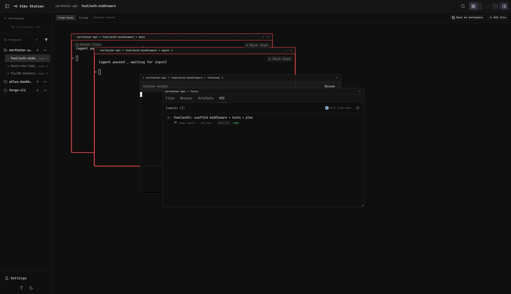
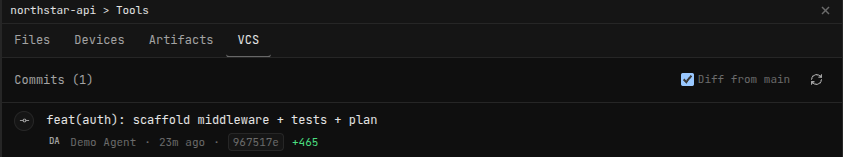
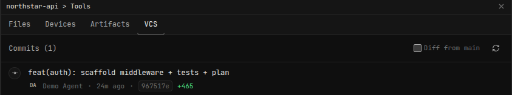
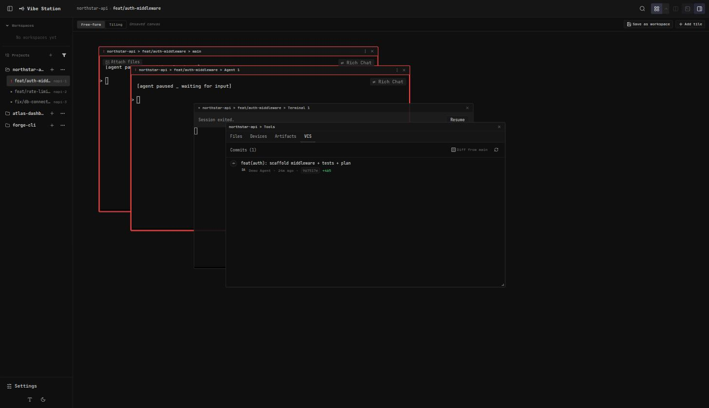
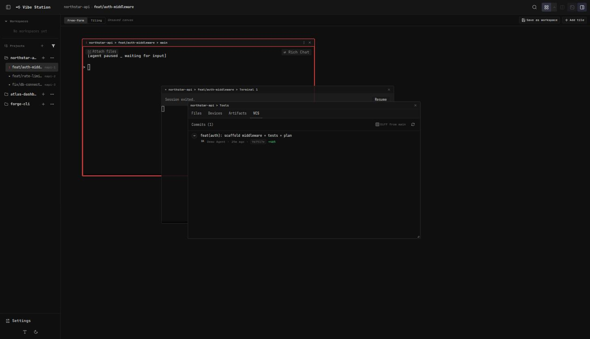

# Report: VCS tab + sidebar/canvas session-lifecycle fixes

**Feature:** `vcs-canvas-ux-fixes`
**Plan:** `.vibekit/feature-plans/wip/vcs-canvas-ux-fixes/plan-vcs-canvas-ux-fixes.md`
**Commit:** `16bc635` — `fix(daemon,web-ui): VCS diff-from-main toggle, PR re-latch, submodules, sidebar/canvas session-lifecycle fixes`
**Process:** `/sdlc` plan → opus plan review → sonnet implement → opus code review → sonnet fix-up → repo-wide verify → docker sandbox verify
**Verification server:** docker dev sandbox (`scripts/dev-sandbox.sh up vs-52`), `http://localhost:5174`

---

## Summary

5 user-reported UX bugs, bundled into one small plan-implement-verify cycle:

| # | Issue | Outcome |
|---|-------|---------|
| 1 | VCS tab shows more commits than the PR will contain after a rebase | Server-side logic was already rebase-safe; added a top-of-panel **"Diff from main" toggle**, ON by default, replacing a bottom accordion |
| 2 | Second/later PR on the same worktree branch not detected | **Real bug found and fixed**: GraphQL query used `last: 1` on a `CREATED_AT DESC`-ordered list, which returns the OLDEST PR, not the newest — fixed to `first: 1` |
| 3 | Worktree submodules' commits/PRs not shown | New `listSubmodules()` + `GET /worktrees/:id/submodules` route + "Submodules" section in the VCS tab (commit/branch/status, no per-submodule PR lookup — explicitly out of scope) |
| 4 | Clicking a worktree whose last-known agent is terminated doesn't fall back to main | `setActiveWorktree`'s fallback now excludes sessions in `state: "exited"` |
| 5 | Terminated agent's canvas tile lingers | New `removeTilesForSession` action, wired into the `session:deleted` WS event — tile disappears live, no reload |

**Bonus finds along the way:**
- A pre-existing bug in the shared `runGit()` helper's global `.trim()` was silently corrupting the first line of `git submodule status` output — fixed with a `runGitRaw()` variant, scoped only to that one call site.
- Opus's review of the first implementation pass caught 3 more real bugs before they shipped (see "Review findings" below) — all fixed in a follow-up pass.

---

## Review findings (opus, before ship)

An opus subagent reviewed the initial sonnet implementation's diff and found:

**Confirmed (fixed):**
1. A stale `pendingLoadMoreRef` could misfire the "diff from main" toggle OFF on an unrelated later load (e.g. Refresh, or switching worktrees) if a "Load more" had previously failed or been aborted.
2. The empty-state branch hid the "Load more" / server-cap footer whenever the toggle-filtered view was empty — a worktree with 0 own commits but 200 upstream commits showed no way to reach more history.
3. The "Submodules" list went stale across a worktree switch — old worktree's rows lingered under the new worktree's commit list.

**Plausible (also fixed, except one deferred):**
4. `status: "modified"` was unreachable for a submodule with uncommitted changes at its pinned commit (the dirty check only ran under a different status flag).
5. `.gitmodules` parser edge cases (quoted paths, case-sensitive keys) — **deliberately deferred**, low-likelihood for machine-written files, documented rather than silently dropped.
6. The toggle wasn't reset to ON when switching worktrees.
7. Deleting the currently-focused session left a blank pane instead of falling back to the worktree's main agent.
8. An undefined `--bg-tertiary` CSS variable left the "uninitialized" submodule badge with no background.

---

## Verification

**Automated (repo-wide, after all fixes):**
- `pnpm typecheck` — clean
- `pnpm --filter cli test` — 761/761 passed (1 pre-existing, unrelated `UnhandledRejection` flake in `sessions.test.ts`, documented as predating this change)
- `pnpm --filter @vibestation/web test` — 481/481 passed
- New/extended test files: `daemon/src/__tests__/github.test.ts`, `daemon/src/__tests__/git.submodules.test.ts` (new), `daemon/src/__tests__/worktrees.test.ts`, `web-ui/src/components/tools/VcsPanel.test.tsx`, `web-ui/src/hooks/useStore.test.ts`

**Live, in the docker dev sandbox (port 5174, demo seed):**

### 1. "Diff from main" toggle — top of panel, ON by default



Close-up, toggle ON (checked):



Toggle OFF (unchecked) — re-renders instantly, no extra network fetch:



### 3. Submodules route live

```
$ curl http://localhost:5174/api/worktrees/napi-1/submodules
{"submodules":[]}
$ curl -o /dev/null -w "%{http_code}\n" http://localhost:5174/api/worktrees/nonexistent-id/submodules
404
```
Empty-array case renders no "Submodules" section (correct per spec); the demo seed has no actual submodule repos, so the populated-row rendering is covered by unit tests (`git.submodules.test.ts`'s real `git submodule add` fixtures, `VcsPanel.test.tsx`'s mocked-data render tests) rather than a live screenshot.

### 4 + 5. Canvas tile removal on terminate, sidebar fallback to main

Before terminating "Agent 1" (free-form canvas: main / Agent 1 / Terminal 1 / VCS tiles):



Immediately after confirming "Terminate" on Agent 1's tile menu — tile gone live, no reload:



Navigated to a different worktree and back — worktree reopens cleanly on the main agent, no dead tile, no blank pane, and the "Diff from main" toggle reset back to ON per-worktree:


(Screenshot 01 above, taken at the very start of this verification pass, also independently shows "Agent 2" already absent from the same canvas — its earlier termination in a prior verification pass survived a full container down/up cycle, i.e. the fix is durable across daemon restarts, not just an in-session React state trick.)

---

## Files changed

| File | Phase |
|------|-------|
| `web-ui/src/components/tools/VcsPanel.tsx` (+ `.test.tsx`) | 1, 3 |
| `daemon/src/services/github.ts` | 2 |
| `daemon/src/__tests__/github.test.ts` | 2 |
| `daemon/src/services/git.ts` | 3 |
| `daemon/src/routes/worktrees.ts` | 3 |
| `web-ui/src/api/types.ts`, `client.ts`, `mock.ts` | 3 |
| `daemon/src/__tests__/git.submodules.test.ts` (new) | 3 |
| `daemon/src/__tests__/worktrees.test.ts` | 3 |
| `web-ui/src/hooks/useStore.ts` (+ `.test.ts`) | 4, 5 |
| `web-ui/src/hooks/useServerSync.ts` | 5 |
| `web-ui/src/styles/workspace.css` | 1, 3 |

---

## Follow-up (reported by user mid-verification, not in this bundle)

**"Reset with handoff" auto-starts work instead of just carrying context.** User expectation: reset-with-handoff should spawn a fresh agent that *has* the prior context, but should NOT immediately act on it — it should wait for explicit instruction like any other freshly-started agent. Currently it appears to start working right away. Not investigated or fixed in this pass — flagged for a follow-up `/sdlc` cycle.
