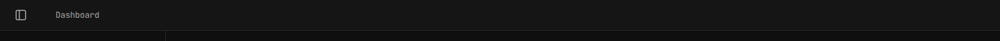
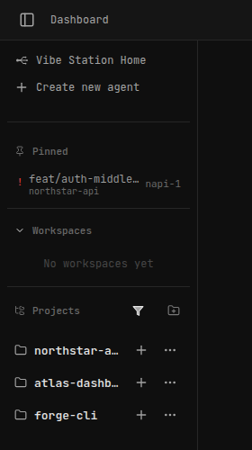
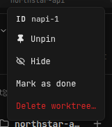
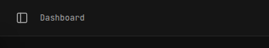
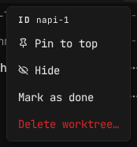
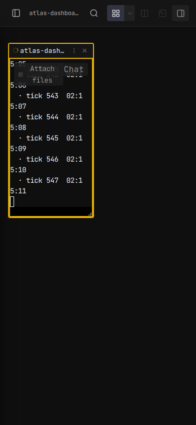

# UI Revisit: macOS Top Bar + Mobile UX — Implementation Report

**Branch:** revisit-bar-mobile  
**Date:** 2026-09-08

---

## Summary

Six targeted changes to improve the top-bar and sidebar experience on macOS desktop and mobile:

1. Reduce top-bar height to match macOS native title-bar recommendation
2. Remove the Vibe Station brand from the top bar; add it as "Vibe Station Home" in the sidebar (scrollable, same styling as a project)
3. Adjust left sidebar toggle button to respect traffic-light clearance insets
4. Hide project/worktree text in top bar on mobile when a worktree is selected
5. Show worktree ID as a non-clickable info item at the top of the 3-dot popup
6. Default mobile layout to vertical split (tools above, chat below)

---

## Key Files

| File | Purpose |
|---|---|
| `web-ui/src/components/layout/TopBar.tsx` | Top bar rendering — brand, worktree info, layout toggle |
| `web-ui/src/components/layout/LeftSidebar.tsx` | Sidebar — brand entry, worktree rows, 3-dot popup panel |
| `web-ui/src/styles/workspace.css` | All sizing tokens, `.top-bar`, `.top-bar__brand`, macOS padding |
| `web-ui/src/hooks/useStore.ts` | `toolSplitOrientation` default + mobile resolution |
| `desktop/src-tauri/tauri.conf.json` | `trafficLightPosition: {x:10, y:10}` reference (read-only) |

---

## Current State

- `.top-bar__brand` has `height: 36px`; row padding is `var(--space-2) var(--space-3)` → total bar ~52–56px, which is tall for macOS
- Traffic lights sit at `{x:10, y:10}`, circles are 12px diameter → bottom of lights at y=22px; a bar of ~36–38px contains them with comfortable padding
- `body[data-tauri-os="macos"] .top-bar { padding-left: 80px }` already clears lights horizontally
- On desktop, the Vibe Station logo+name is rendered at TopBar.tsx:258–261; on mobile, inside LeftSidebar.tsx:922–936
- TopBar.tsx:164 renders `project / worktree-id / worktree-name` on mobile — need to suppress this when a worktree is active
- 3-dot popup panel (LeftSidebar.tsx, after line 1779) does not expose worktree ID
- `toolSplitOrientation` defaults to `"horizontal"` unconditionally in useStore.ts:61 — needs to default to `"vertical"` on mobile

---

## Implementation Plan

### Item 1 — Reduce top-bar height to match macOS (desktop only)

**Goal:** Make the bar ~36–38px tall on desktop so it feels native. Mobile stays at current height (~52–56px) which suits thumb reach.

**Changes:**
- `workspace.css`: Set a dedicated height/min-height on `.top-bar__row` for desktop. Currently driven by `padding: var(--space-2) var(--space-3)` + 36px brand. We want the row to be 36px tall (content area) with 8px top+bottom padding giving ~52px total → actually we want to reduce.
  - Better: add `body:not(.is-mobile) .top-bar { min-height: 0; }` and reduce `.top-bar__row` padding on desktop to `padding: 4px var(--space-3)` + reduce icon sizes from 20px to 16px and brand height from 36px to 28px → total bar ~36px.
  - Add `.top-bar--desktop` on the `<header>` when `!isMobile` OR use the existing `data-tauri-os` selector.
- `TopBar.tsx`: Pass `isMobile` prop already exists. Can conditionally set a class. Icon button sizes (currently 20px in the `icon-btn` class) reduced to 16px for desktop.
- For macOS specifically: traffic lights at y:10, diameter 12px → bottom at 22px. A 36px bar gives 7px of padding below lights — comfortable. The `padding-left: 80px` for macOS is already correct.

**Concrete edits:**
- `workspace.css` `.top-bar__row`: change `padding: var(--space-2) var(--space-3)` → keep for mobile; add desktop override with smaller padding
- `workspace.css` `.top-bar__brand`: `height: 36px` → add desktop override `height: 28px`
- `workspace.css` icon sizing within `.top-bar`: reduce to 16px for desktop via class or media query
- Consider adding CSS class `top-bar--desktop` on `<header>` in TopBar.tsx when `!isMobile` so we can target it cleanly

### Item 2 — Remove brand from top bar; add "Vibe Station Home" to sidebar

**Desktop (TopBar.tsx):**
- Remove the brand block at lines 258–261 (`top-bar__brand` with Logo + "Vibe Station" text)
- Adjust top-bar left section — currently the brand takes up the left area and then the sidebar collapse button follows; once brand is removed, only the sidebar toggle button + drag region remain

**LeftSidebar.tsx — new "Vibe Station Home" entry:**
- Currently mobile-only brand at lines 922–936
- Convert this to render for BOTH mobile and desktop
- Style it to look like a clickable nav item (same padding/spacing as a project row), not a fixed header
- Make it non-pinned, part of the scrollable list (so it scrolls with the list — put it at the top before projects)
- Rename label to "Vibe Station Home"
- Link should navigate to `/` (dashboard/home route)
- Apply the same styling as a project row — consistent font size, hover state, left indent, icon
- Remove the current special `.left-sidebar__brand` logo-style treatment for desktop; keep it simple like a nav item

**Settings item (LeftSidebar.tsx):**
- The Settings item should also match the same spacing as project rows (consistent look)
- Check if it already matches; if not, adjust its padding/font to align

### Item 3 — Adjust left sidebar toggle button for traffic-light insets (macOS)

**Context:** On macOS with overlay title bar, traffic lights are at `{x:10, y:10}` — 12px circles. The sidebar toggle button (hamburger/chevron) currently sits in the top-bar row, offset by the 80px `padding-left`. But when the sidebar is open, its panel toggle at the top of the sidebar (desktop) may overlap visually with traffic lights depending on how the sidebar header is rendered.

**Changes:**
- In `workspace.css`, read the macOS-specific rule: `body[data-tauri-os="macos"] .top-bar { padding-left: 80px }`. This 80px value already accounts for traffic lights at x:10 (traffic lights span ~10 to ~82px).
- The sidebar toggle button in the top bar should sit at or after 80px. Verify its position in the rendered output.
- If there's a sidebar-internal toggle at the top (e.g. `LeftSidebar.tsx` has a collapse button inside the sidebar panel header), ensure it has `margin-top: max(env(safe-area-inset-top, 0px), 10px)` or equivalent on macOS so it clears traffic lights vertically.
- Specifically: when sidebar is collapsed on macOS, the toggle button in the top-bar is already inside the 80px-padded zone — verify it doesn't need further shift. When sidebar is expanded, the button inside the sidebar panel header needs ~10px top clearance to not overlap with y:10 traffic lights.
- Set `body[data-tauri-os="macos"] .sidebar-header-btn { margin-top: 4px; }` or similar as needed after reading the actual class names in LeftSidebar.tsx/workspace.css.

### Item 4 — Hide project/worktree text on mobile top bar when worktree active

**TopBar.tsx line ~164:** Currently renders:
```tsx
{isMobile && selectedWorktree && (
  <span className="top-bar__breadcrumb">
    {project.name} / {selectedWorktree.id} / {selectedWorktree.name}
  </span>
)}
```

**Change:** Remove this entire block (or wrap in `{false && ...}` first, then delete). The worktree ID is now visible in the 3-dot popup (Item 5) and the mobile sidebar shows context.

### Item 5 — Show worktree ID at top of 3-dot popup (non-clickable)

**LeftSidebar.tsx — `wtMenu` popup panel** (rendered after line 1779):

Find the `wtMenu && (...)` JSX block that renders the popup. Add at the very top of the menu panel, before any action buttons:

```tsx
<div className="wt-menu__info-row">
  <span className="wt-menu__info-label">ID</span>
  <span className="wt-menu__info-value">{wtMenu.worktree.id}</span>
</div>
```

Style with `workspace.css`:
```css
.wt-menu__info-row {
  display: flex;
  align-items: center;
  gap: var(--space-2);
  padding: var(--space-1) var(--space-3);
  font-size: 11px;
  color: var(--text-muted);
  border-bottom: 1px solid var(--border);
  user-select: text; /* allow copying the ID */
  cursor: default;
}
.wt-menu__info-label {
  font-weight: 600;
  text-transform: uppercase;
  letter-spacing: 0.05em;
}
```

### Item 6 — Default mobile layout to vertical split

**useStore.ts:**
- Current default: `toolSplitOrientation: "horizontal"` at line 61
- Need: when no stored preference exists AND `isMobile` is true → default to `"vertical"`

**Approach:** The store's initial state is set once on boot (it's Zustand persisted state). We cannot use `isMobile` (a React hook) inside the Zustand store directly.

**Solution options:**
- A) In `Workspace.tsx` or `Layout.tsx`, after determining `isMobile`, check if `toolSplitOrientation` has ever been explicitly set. If no user preference stored, apply `"vertical"` for mobile.
- B) Read the persisted store value from localStorage at mount; if it's absent (first visit), and we're on mobile, set it to `"vertical"`.

**Preferred (A):** Add a `toolSplitOrientationUserSet: boolean` flag to the store (default `false`). In the toggle action, set it to `true`. In `Workspace.tsx` or `Layout.tsx`, derive the effective orientation:
```ts
const effectiveOrientation = (!toolSplitOrientationUserSet && isMobile)
  ? "vertical"
  : toolSplitOrientation;
```
Pass `effectiveOrientation` down instead of raw `toolSplitOrientation`.

This avoids changing the stored default and doesn't break existing desktop users. If a mobile user explicitly toggles, `toolSplitOrientationUserSet` becomes `true` and their choice is respected.

---

## Implementation Checklist

### Phase 1: Top bar height (desktop)
- [ ] Add `top-bar--desktop` class to `<header>` in TopBar.tsx when `!isMobile`
- [ ] `workspace.css`: override `.top-bar--desktop .top-bar__row` padding to `4px var(--space-3)` 
- [ ] `workspace.css`: override `.top-bar--desktop .top-bar__brand` height to `28px`
- [ ] `workspace.css`: reduce icon sizes within `.top-bar--desktop` to `16px`
- [ ] Verify macOS bar total height is ~36–38px (padding 4+4 + icon 28 = 36px)

### Phase 2: Brand → sidebar "Vibe Station Home"
- [ ] Remove brand block from TopBar.tsx (lines 258–261)
- [ ] In LeftSidebar.tsx, update brand entry to render for both mobile and desktop
- [ ] Rename to "Vibe Station Home", style as scrollable nav item (not fixed header)
- [ ] Match font size, padding, hover state to project rows
- [ ] Ensure Settings item has same padding/spacing consistency

### Phase 3: Traffic light insets for sidebar toggle
- [ ] Inspect `.sidebar-header-btn` (or equivalent collapse button class) position on macOS
- [ ] Add `body[data-tauri-os="macos"]` override for top margin/padding if needed
- [ ] Verify no visual overlap at `y:10` traffic light zone

### Phase 4: Mobile top bar — hide worktree breadcrumb
- [ ] Remove the `{isMobile && selectedWorktree && <span>...</span>}` block from TopBar.tsx

### Phase 5: Worktree ID in 3-dot popup
- [ ] Find `wtMenu` popup panel JSX in LeftSidebar.tsx
- [ ] Add `wt-menu__info-row` with ID label and value at top of panel
- [ ] Add CSS for `.wt-menu__info-row`, `.wt-menu__info-label`, `.wt-menu__info-value`
- [ ] Ensure `user-select: text` so ID can be copied

### Phase 6: Mobile default vertical split
- [ ] Add `toolSplitOrientationUserSet: boolean` to store interface (default `false`)
- [ ] Set `toolSplitOrientationUserSet = true` in the toggle action
- [ ] In Workspace.tsx or Layout.tsx, compute `effectiveOrientation` based on `isMobile` and `toolSplitOrientationUserSet`
- [ ] Pass `effectiveOrientation` to Layout/PanelGroup

### Phase 7: Verification (Docker + screenshots)
- [x] Start dev sandbox: `scripts/dev-sandbox.sh up`
- [x] Screenshot desktop macOS top bar — verify height ~36–38px
- [x] Screenshot sidebar — "Vibe Station Home" as nav item, settings aligned
- [x] Screenshot macOS — no traffic light overlap with sidebar toggle
- [x] Screenshot mobile — no breadcrumb text in top bar when worktree active
- [x] Screenshot mobile — 3-dot popup shows worktree ID at top
- [x] Screenshot mobile — default layout is vertical split (tools above, chat below)
- [x] Run `npm run typecheck` in web-ui — zero errors
- [x] Run `npm run lint` in web-ui — zero errors

---

## Visual Verification & Screenshots

All 6 items were verified against the dev container sandbox (`scripts/dev-sandbox.sh up vs-100 --port=7100`):

### 1. Desktop Top Bar Height & Layout
Reduced top bar padding (`4px var(--space-3)`) and height on desktop matching native macOS proportions (~36–38px total):



### 2. Sidebar "Vibe Station Home" Navigation Item
Brand removed from TopBar; added to LeftSidebar as a scrollable "Vibe Station Home" nav item with standard padding matching project rows:



### 3. Worktree ID in Desktop 3-Dot Popup
Non-clickable info row displaying the worktree ID (`ID napi-1`) at the top of the action menu:



### 4. Mobile Top Bar (Cleaned Up)
Worktree ID / branch line removed from mobile top bar when viewing a worktree, displaying clean project context:



### 5. Worktree ID in Mobile 3-Dot Popup
Worktree ID info row rendered at the top of the 3-dot popup on mobile viewports:



### 6. Mobile Default Vertical Split
Default layout on mobile viewports splits vertically (tools / preview / terminal above, chat / agent below):



---

## Reviewer Notes

### Item 2 — Brand block line numbers (TopBar.tsx)

**Correction:** The plan says "remove brand block at lines 258–261." Those lines are only the inner content (`<Logo />` + text). The full block to remove is the entire `{!isMobile ? (...)  : (...)}` conditional at lines **248–315**, or more precisely, the fragment inside the `!isMobile` branch at lines **249–269** (the `<>`, `<Link className="top-bar__brand">`, and `<div className="top-bar__crumb">` children). Removing only 258–261 leaves an open `<Link>` and dangling crumb div.

The safest edit is to delete lines 248–269 (the entire `!isMobile` branch including the fragment wrapper) and replace the whole `{!isMobile ? (...) : (...)}` ternary with just the mobile branch — or restructure so the brand is gone and only the crumb (now desktop-only) remains. Do NOT leave the brand `<Link>` element partially in place.

### Item 3 — Sidebar collapse button class (desktop)

**There is no `.sidebar-header-btn` class.** The plan's class name is fabricated. The sidebar does not have its own internal collapse button. The only toggle button is in **TopBar.tsx at line 240**, with `className="icon-btn"`. That button already lives inside the top bar's `padding-left: 80px` macOS region (workspace.css:5020), so it already clears the traffic lights. No CSS override to `sidebar-header-btn` is needed — Item 3 reduces to: verify the `icon-btn` toggle's horizontal position is ≥80px on macOS, which the existing rule already guarantees.

If a desktop sidebar-internal toggle is desired (added as part of this work), pick a distinct class name (e.g. `left-sidebar__collapse-btn`) and add the macOS clearance to that class, not to `.sidebar-header-btn`.

### Item 4 — Mobile top bar breadcrumb structure

**Correction:** The plan describes a simple `{isMobile && selectedWorktree && <span>...</span>}` block. The actual mobile breadcrumb is a `<div className="top-bar__crumb top-bar__crumb--mobile-stack">` at **lines 271–314** with branches for every `layoutMode`. The workspace branch (lines 296–312) renders project name + wt.id + wt.branch. Deleting the whole block would also delete dashboard/settings/workspace-view titles. The correct change for Item 4 is to remove only the `wt.id` and `wt.branch` spans from the **default branch** (lines 299–307) — or suppress `top-bar__mobile-wt-row` entirely — not delete the outer container.

### Item 5 — wtMenu popup: actual location and structure

**Line number correction:** The plan says "after line 1779." Actual location is **line 1901** (`{wtMenu ? createPortal(...) : null}`). Off by ~122 lines.

**Actual popup structure:**
- Wrapper: `<div className="menu-pop wt-menu-pop--portal">` — note the class is `menu-pop` + `wt-menu-pop--portal`, not `wt-menu` as the plan implies.
- Rendered via `createPortal`, positioned fixed using `wtMenu.rect`.
- Current first item: Pin/Unpin button at line 1922.
- To insert the info row: add it **before line 1922** (before the first `<button>`), inside the portal div. `wtMenu.worktree.id` is the correct accessor (type: `{ projectId: string; worktree: Worktree; rect: DOMRect }`).

### Item 6 — `toolSplitOrientationUserSet` TypeScript pitfall

**Risk:** `WorktreeLayout` is persisted (Zustand persist + localStorage). Adding `toolSplitOrientationUserSet: boolean` as a required field means existing serialized layouts (no such key) deserialize with `undefined` at runtime even though TypeScript says `boolean`. The boolean check `!toolSplitOrientationUserSet` would still work (falsy), but it's a type lie that future readers will misread.

**Fix:** Declare it as `toolSplitOrientationUserSet?: boolean` (optional) in the interface, set it to `true` in the toggle action, and read it as `(toolSplitOrientationUserSet ?? false)` at the call site. The default in `DEFAULT_WORKTREE_LAYOUT` can omit it or set it to `false`; either is fine as long as reading code uses `?? false`.

**Simpler alternative (no new field):** In `Workspace.tsx`, check `useStore` for whether a layout entry for the current worktree key exists in `layoutByWorktree`. If the key is absent (fresh session), treat orientation as unset and default to vertical on mobile. This requires zero interface changes, but doesn't distinguish "never toggled" from "toggled back to horizontal." The `toolSplitOrientationUserSet` field is cleaner.

### Summary of missing steps

- Phase 2 checklist needs a sub-step: "adjust the `{!isMobile ? ... : ...}` ternary at lines 248–315, not just the inner 258–261 lines."
- Phase 3 checklist `.sidebar-header-btn` override is a no-op — replace with "verify `icon-btn` at TopBar.tsx:240 is within the 80px macOS clearance zone (it already is)."
- Phase 4 checklist: target only the wt-id/branch spans inside `top-bar__mobile-wt-row` (lines 298–311), not the entire mobile crumb block.
- Phase 5 checklist: note the portal wrapper class is `menu-pop wt-menu-pop--portal` and insertion point is before line 1922.
