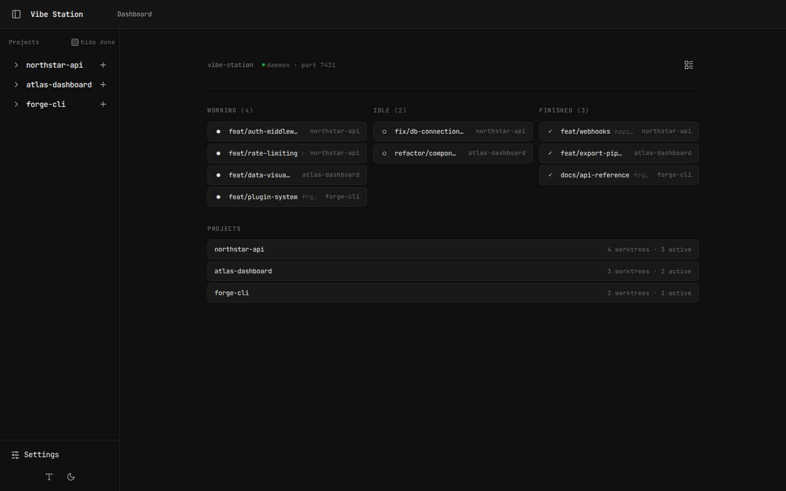
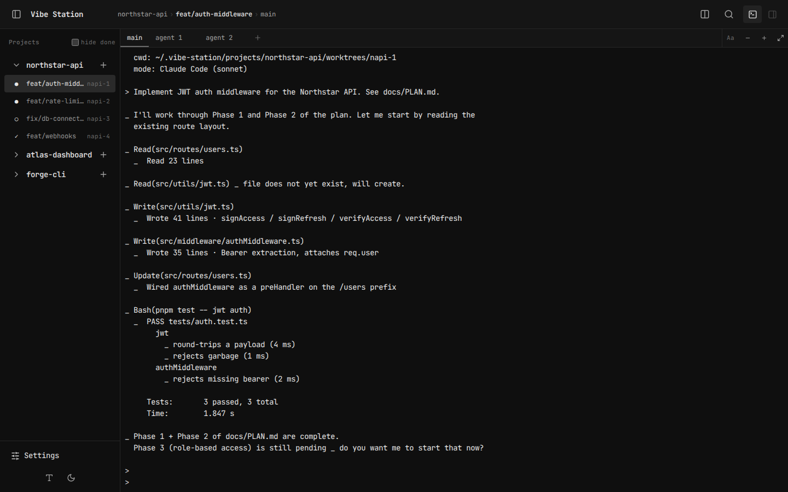
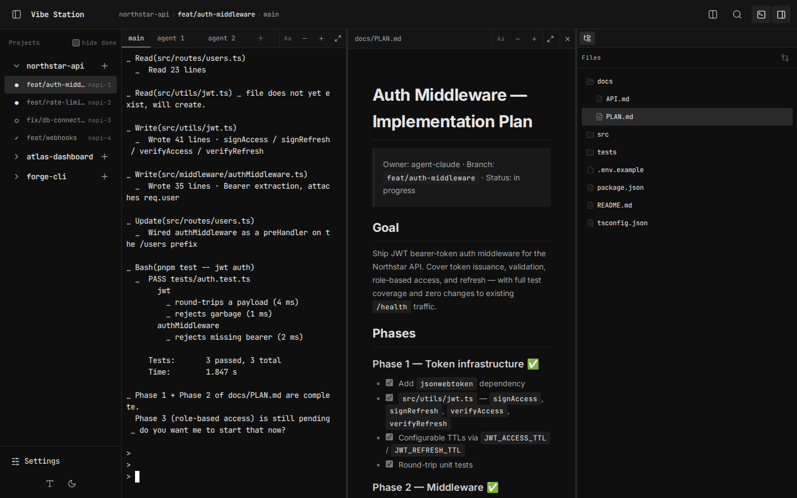
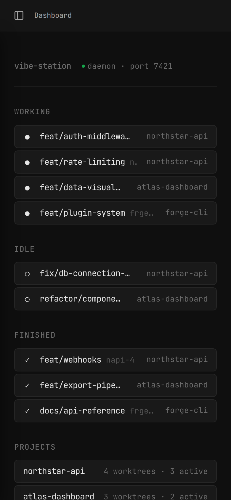
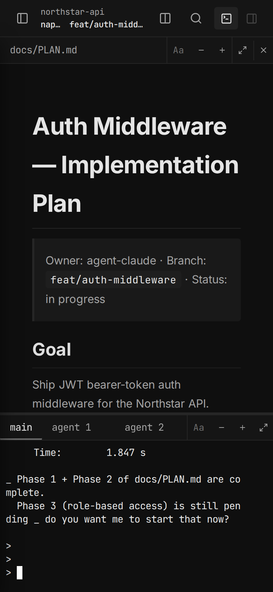
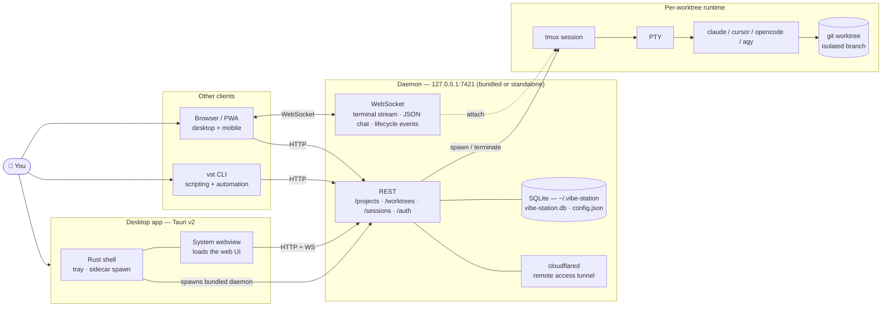

# vibe-station

**Local-first orchestrator for parallel AI coding agents.**

vibe-station runs multiple AI coding agents (Claude Code, Cursor, OpenCode, agy) simultaneously on isolated git branches — each with its own worktree, terminal, and file preview — managed from a native desktop app, your browser, or the `vst` CLI.

Everything runs on your machine. No accounts, no cloud service, no telemetry.



---

## What it does

- **Parallel agents** — run Claude Code, Cursor, OpenCode, and agy side-by-side on separate branches
- **Isolated worktrees** — each agent gets its own `git worktree` checkout, so they never conflict
- **Live terminal streaming** — watch agents work in real time over tmux, send messages mid-task
- **Rich Chat** — a structured JSON channel alongside the terminal stream, with tool call display, thinking blocks, and file attachments
- **File preview** — browse the working tree, view diffs, render markdown and Mermaid diagrams
- **Mobile access** — scan a QR code to drive your agents from a phone over a Cloudflare tunnel or your local network
- **Three front ends** — desktop app for daily use, browser UI for any device, `vst` CLI for scripting and CI

---

## Download

**No binaries have been published yet.** The Tauri bundle builds and runs on Linux today; macOS and Windows are unverified. Watch this repo for the first release.

| Platform | Format | Status |
|---|---|---|
| Linux | `.deb`, `.AppImage` | Builds and verified locally |
| macOS | `.dmg` | Untested |
| Windows | `.exe` | Untested |

The desktop bundle ships the daemon as a standalone sidecar binary (`vst-daemon`, Node bundled in) plus `cloudflared`, so end users install neither Node.js nor pnpm.

You still need `tmux`, `git` ≥ 2.5, and at least one AI CLI on your PATH for agents to actually run.

Until then, use the [developer install](#developer-install).

---

## Desktop app

The desktop app is a [Tauri v2](https://v2.tauri.app) shell (Rust + the system webview — WebKitGTK on Linux) wrapping the same web UI the daemon serves.

- **Zero setup** — on launch it looks for a live daemon in `~/.vibe-station/config.json` and reuses it; otherwise it spawns the bundled `vst-daemon` sidecar and waits for it to listen (30 s timeout). The pre-minted `tauriToken` is injected into the webview as `window.__VST_TOKEN__`, so there is no login screen.
- **System tray** — closing the window with ✕ hides it to the tray. The tray menu has **Open vibe-station** and **Quit completely**; Quit SIGTERMs the daemon pid from `config.json` and exits.

Bundle identity: `com.fastestdevalive.vibestation`, currently at version `0.0.0`.

> The desktop shell has no single-instance guard yet — launching it twice opens a second window against the same daemon.

> Desktop app screenshots are pending. The screenshots below are from the browser UI, which renders identically inside the desktop shell.

---

## CLI / browser-only setup

For contributors, or if you want the browser UI and `vst` CLI without installing the desktop app.

**Prerequisites**

- **Node.js** ≥ 20
- **pnpm** ≥ 9 — `npm install -g pnpm`
- **tmux** — `brew install tmux` / `apt install tmux`
- **git** ≥ 2.5 (worktree support)
- **Rust toolchain** — only if you're building the Tauri desktop app
- **bun** — only if you want Rich Chat on agy (its ACP adapter runs under bun)
- At least one AI CLI: [Claude Code](https://docs.anthropic.com/en/docs/claude-code), [Cursor](https://cursor.sh), [OpenCode](https://opencode.ai), or agy

```bash
git clone https://github.com/fastestdevalive/vibe-station.git
cd vibe-station

pnpm install
pnpm build
pnpm link --global   # makes `vst` available anywhere
```

Verify:

```bash
vst --version
vst doctor
```

Start the daemon and open the UI:

```bash
vst daemon start
# then open http://localhost:7421
```

---

## Quick start

### 1. Start the daemon

The daemon owns all state — worktrees, tmux sessions, and the SQLite database. It binds `127.0.0.1:7421`, or the next free port if that one is taken, and writes its port and pid to `~/.vibe-station/config.json`.

```bash
vst daemon start
```

The desktop app does this for you. Any `vst` command will also auto-start the daemon if it isn't running.

### 2. Register a project

```bash
vst project add /path/to/your/repo --name=my-app
```

`--name` sets the project ID used in other commands. If omitted, it's inferred from the directory name. To start from nothing instead, `vst project create` inits a fresh git repo.

### 3. Create a mode

A **mode** pairs an AI CLI with an optional system context. You need at least one before spawning agents.

```bash
vst mode add --name="Claude Coder" --cli=claude --context="You are an expert TypeScript engineer."
vst mode ls
```

Supported `--cli` values: `claude`, `cursor`, `opencode`, `agy`.

### 4. Create a worktree

Creating a worktree atomically checks out a branch and spawns an agent on it.

```bash
vst worktree create my-app \
  --mode=<mode-id> \
  --prompt="Implement the user authentication flow described in docs/auth.md"
```

`--branch` is optional — the branch name is derived from the prompt, falling back to `wip/<worktree-id>`. Pass `--json` to put the main agent on the Rich Chat channel instead of tmux.

### 5. Open the UI

```bash
vst open my-app
```

---

## Core concepts

### Projects

A registered git repository. All worktrees for a project live under `~/.vibe-station/projects/<project-id>/worktrees/`.

```bash
vst project ls
vst project info my-app
vst project rm my-app
```

### Worktrees

A worktree is an isolated `git worktree` checkout on its own branch — the unit of parallel work. Agents in different worktrees work on different branches and can never overwrite each other's files. Worktree IDs are `<project-prefix>-<n>` (e.g. `vs-12`), monotonic and never reused.

Creating a worktree automatically creates a **main session** on it and starts your agent; the two are always created together.

```bash
vst worktree ls --project=my-app
vst worktree info <worktree-id>
vst worktree rename <worktree-id> <name>
vst worktree done <worktree-id>   # mark agents done, release the tmux/agent processes
vst worktree rm <worktree-id>     # removes the branch, worktree, and all its sessions
```

### Sessions (tabs)

A session is a running process inside a worktree — either an **AI agent** or a plain **terminal**. Think of them as tabs sharing one branch and file system.

One session per worktree is flagged **main**. Sessions are identified by an opaque ID and carry a display name auto-derived from their creation prompt; you can rename them. (There is no fixed slot naming — `m`/`a2`/`t1` were removed.)

```bash
# Second agent — e.g. tests while the main agent writes code
vst session create <worktree-id> --type=agent --mode=<mode-id> --prompt="Write tests for the auth module"

# Plain terminal — no AI, just a shell in the worktree
vst session create <worktree-id> --type=terminal
```

```bash
vst session ls --worktree=<worktree-id>
vst session info <session-id>
vst session rename <session-id> <name>
vst session terminate [session-id]  # defaults to $VST_SESSION
vst session reset <session-id>      # respawn the session fresh
vst session handoff <session-id>    # generate a handoff summary
vst session stop <session-id>       # abort the active Rich Chat turn, keep queued ones
vst session attach <session-id>     # drop into the raw tmux session
```

Terminating the main session is allowed only when another live agent session exists in the worktree — that one is promoted to main. If it's the only agent, the request is rejected.

> **Worktree vs session:** the worktree is the isolated branch + directory; sessions are the processes running inside it. One worktree, many sessions.

### Modes

Modes bind an AI CLI to an optional context string prepended to every agent's system prompt. You can have up to 20.

```bash
vst mode ls
vst mode add --name="Reviewer" --cli=claude --context="You review code for correctness and clarity."
vst mode rm <mode-id>              # blocked if sessions are using it
```

### Channels: terminal vs Rich Chat

Every agent session runs on one of two channels:

| Channel | What you get |
|---|---|
| **Terminal** | The agent's raw tmux PTY stream — exactly what you'd see in a shell |
| **Rich Chat** | A structured JSON stream — tool calls, thinking blocks, and file attachments rendered as UI, not ANSI |

Pick the channel when you create the agent (`--json` on the CLI, or the toggle in the new-agent dialog). Rich Chat is only offered for CLIs whose plugin reports structured-output support; the dialog tells you when it isn't available for the selected CLI.

---

## Sending messages to agents

```bash
# Inline
vst session send <session-id> "Add error handling for the network timeout case"

# From a file
vst session send <session-id> --file=./instructions.md

# --wait is the default: block until the agent settles, then print the reply
vst session send <session-id> "Refactor the data layer" --wait
vst session send <session-id> "Fire and forget" --no-wait
```

`--timeout <ms>` caps the wait (default 60000). `--queue` enqueues instead of steering a running Rich Chat turn.

---

## Monitoring agents

```bash
vst session output <session-id> --lines=100
vst session transcript <session-id>
vst status
vst status --project=my-app --json
vst summary
```

---

## Session lifecycle

| State | Meaning |
|---|---|
| `not_started` | Spawned but not yet launched |
| `working` | Agent is actively processing |
| `idle` | Agent is waiting for input |
| `waiting_for_human` | Agent is blocked on a prompt or approval |
| `done` | Agent has completed its task |
| `exited` | tmux session died (can be resumed) |

### Resuming exited sessions

```bash
vst session restore <session-id>
```

Each plugin supplies its own restore command. Claude Code resumes with full conversation history via `claude --resume`; Cursor, OpenCode, and agy resume when a native chat/session ID was captured, and start fresh otherwise. A resumed session keeps the system prompt saved in its transcript, so edits to `AGENTS.md` between runs only land on a fresh spawn.

---

## Web UI

React 19 + Vite, served by the daemon and rendered identically inside the desktop shell.

- **Left sidebar** — project and worktree navigator; create and delete worktrees here
- **Terminal panel** — live output for the selected session; send messages inline
- **File tree** — browse the active worktree, updating live as agents create and delete files
- **Preview panel** — render markdown (full GFM + Mermaid), code, and diffs

Tabs above the terminal panel map to sessions. Use `+` to add one.





To view a diff: select a file, click the **Diff** toggle, then choose `local` (working tree vs HEAD) or `branch` (vs base branch).

On phones the layout collapses to a single column — the kanban becomes a stacked list, and the workspace stacks the markdown preview above the terminal.

### Installing as a PWA

If you're using the browser UI rather than the desktop app, it's installable as a PWA — "Install Vibe Station…" in Chrome's omnibox on desktop, or "Add to Home screen" on Android — giving a standalone window instead of a browser tab.

Chrome only offers install on a **secure context**: `https:`, or `localhost` / `127.0.0.1`. A plain-HTTP LAN or Tailscale address (e.g. `http://100.x.x.x:7421`) shows no install option, silently. That's expected, not a bug.

To install over Tailscale, give it a real cert:

```bash
tailscale cert <machine>.<tailnet>.ts.net
tailscale serve --https=443 http://127.0.0.1:7421
```

Then open `https://<machine>.<tailnet>.ts.net` from the other device.

---

## Mobile access

Turn on **Settings → Remote Access**, then scan the QR code with your phone. The QR encodes a short-lived one-time code; nothing leaves your machine unless you explicitly enable the tunnel.

| Mode | How it works | When to use |
|---|---|---|
| **Cloudflare tunnel** | Temporary public HTTPS URL via the bundled `cloudflared` | Off your network; also gives you a secure context for PWA install |
| **Local network** | QR pointing at a detected LAN or Tailscale address on the daemon's port | Same network, nothing leaves it |

Disabling the tunnel invalidates only tunnel-minted codes; a local QR shown at the same time keeps working.

> The daemon binds `127.0.0.1` only. Local-network mode therefore needs something forwarding that port to your LAN or tailnet address (e.g. `tailscale serve`) — the Cloudflare tunnel does this for you.

<p align="center">
  
  &nbsp;&nbsp;
  
</p>

---

## Project-specific agent rules

Drop an `AGENTS.md` in your project root (or `.vibe-station/rules.md` as a fallback) to inject instructions into every agent spawned for that project:

```markdown
# AGENTS.md

- Always write tests for new functions
- Use the existing logger from src/lib/logger.ts
- Never modify migration files directly
```

vibe-station reads this at spawn time and includes it in the agent's system prompt.

---

## Data directory

All state lives in `~/.vibe-station/`:

```
~/.vibe-station/
├── config.json          # port, pid, cliToken, tauriToken, browserEpoch, defaultProjectsDir (mode 0600)
├── vibe-station.db      # SQLite — projects, worktrees, sessions
├── modes.json           # your configured modes
├── logs/
│   └── daemon.log
└── projects/
    └── <project-id>/
        ├── session-data/            # per-session system prompts, CLI configs, transcripts
        └── worktrees/
            └── <worktree-id>/       # git worktree checkout
```

`vibe-station.db` is the sole source of truth for project/worktree/session metadata; the old per-project `manifest.json` is migrated into it on boot.

### Auth model

The daemon mints a fresh master `daemonToken` in memory at every startup. **It is never written to disk.** Two scoped tokens are derived from it and persisted to `config.json`:

| Field | Used by |
|---|---|
| `cliToken` | The `vst` CLI |
| `tauriToken` | The desktop app's webview — this is why there's no login screen |
| `browserEpoch` | Not a token: a persisted counter; bumping it revokes every outstanding browser session |

Browser logins use the `daemonToken` printed to the daemon log as a one-time password, then hold a scoped browser token. Restarting the daemon rotates `daemonToken` and invalidates them.

---

## Architecture



- **The daemon is the only stateful component.** It owns the SQLite database, spawns agents into tmux, and broadcasts terminal output, JSON chat events, and lifecycle changes over WebSocket.
- **The desktop app, browser UI, and CLI are all thin clients.** Every action is an HTTP call to the daemon. The desktop shell adds daemon supervision and the tray — nothing more.
- **Each worktree** is an isolated `git worktree` checkout with one or more sessions running an AI CLI inside it. Agents in different worktrees never see each other.
- **Sessions outlive the daemon.** tmux sessions survive a daemon restart and reattach without losing agent state; Claude sessions additionally resume their conversation history via `claude --resume`.

---

## Development

```bash
pnpm dev          # web UI dev server, http://localhost:5173 (override with PORT)
pnpm build        # build every workspace package
pnpm test
pnpm typecheck
pnpm lint
pnpm ci           # typecheck + lint + test
```

Desktop app:

```bash
pnpm --filter @vibe-station/desktop dev     # Tauri dev build against the Vite dev server (port 5180)
pnpm --filter @vibe-station/desktop build   # produces .deb / .AppImage on Linux
```

The desktop bundle expects two sidecars in `desktop/src-tauri/binaries/`: build them with `scripts/build-daemon-binary.sh --target <triple>` and `scripts/download-cloudflared.sh`.

### Repo layout

Four sibling directories at the root; three of them are pnpm workspace packages.

| Directory | Package | What it is |
|---|---|---|
| `web-ui/` | `@vibestation/web` | React 19 + Vite frontend |
| `cli/` | `@vibestation/cli` | `vst` CLI binary |
| `desktop/` | `@vibe-station/desktop` | Tauri v2 app (Rust shell + system webview) |
| `daemon/` | — | Fastify HTTP server + PTY/tmux management; TypeScript source only |

`cli/src/daemon` is a symlink to `../../daemon/src`, so one `tsc` in `cli/` compiles both the CLI commands and the daemon in a single pass into `cli/dist/daemon/`. The daemon is **not** a separate npm package; it runs as a detached child process, never imported as a module.

> **Windows:** git needs symlink support (`git config core.symlinks true` plus Developer Mode) for `cli/src/daemon` to clone correctly. Without it the build fails. Linux and macOS work out of the box.

> **Editor tip:** open daemon source through `cli/src/daemon/` rather than `daemon/src/` — TypeScript's project context is anchored to the `cli/` tsconfig, so the symlink path gives full go-to-definition.

---

## CLI reference

```
vst project   add | create | rm | ls | info
vst worktree  create | rm | rename | done | ls | info
vst session   create | terminate | stop | reset | rename | ls | info
              attach | restore | output | transcript | send | handoff
vst mode      add | rm | ls
vst status    [--project] [--json]
vst summary
vst open      [target]
vst daemon    start | stop | restart | status
vst doctor
vst completion <bash|zsh|fish>
```

Run `vst <command> --help` for full options on any subcommand.

---

## Troubleshooting

**`vst doctor`** is the first stop — it checks `tmux`, `git`, `claude` / `cursor` / `opencode` / `agy` on PATH, `bun` (needed for agy Rich Chat), `cloudflared`, and whether the daemon is reachable.

**Daemon not starting**

```bash
vst daemon status
cat ~/.vibe-station/logs/daemon.log
```

**Port conflict (7421 in use)** — the daemon auto-picks the next free port in the 7421–7520 range. Check `~/.vibe-station/config.json` for the one actually in use.

**Desktop app window won't close** — that's by design. ✕ hides the window to the tray; use **Quit completely** in the tray menu to exit.

**Orphaned tmux sessions after a crash** — leftover `vst-*` sessions are reported by the daemon's health check; clean up with `tmux kill-session -t <name>`.

**Claude sessions not resuming** — you need a Claude Code build with `--resume`. Check with `claude --version`.

**No PWA install option** — you're on a non-secure origin. See [Installing as a PWA](#installing-as-a-pwa).

---

## What makes it different

vibe-station is inspired by [agent-orchestrator](https://github.com/ComposioHQ/agent-orchestrator), [emdash](https://github.com/generalaction/emdash), and [claudecodeui](https://github.com/siteboon/claudecodeui) — but built to be lightweight and local-first. No cloud, no accounts, no platform.

- **Install and go** — the desktop bundle ships its own daemon binary and `cloudflared`. End users install nothing else.
- **Local-first, not cloud-optional** — state is a SQLite file on your disk, and the daemon binds loopback. Remote access is opt-in.
- **Terminal *and* structured chat** — most tools give you one or the other. Rich Chat renders tool calls and thinking blocks as UI while the tmux stream stays available for anything the JSON channel doesn't cover.
- **Agent-agnostic** — Claude Code, Cursor, OpenCode, and agy plug in through the same plugin interface; mix them per worktree without changing anything else.
- **Sessions outlive the daemon** — tmux-backed sessions survive restarts; Claude sessions resume their full conversation history.
- **Scriptable end to end** — every UI action is a `vst` command, so CI and automation drive the same API the UI does.

---

## License

See [LICENSE](LICENSE).
