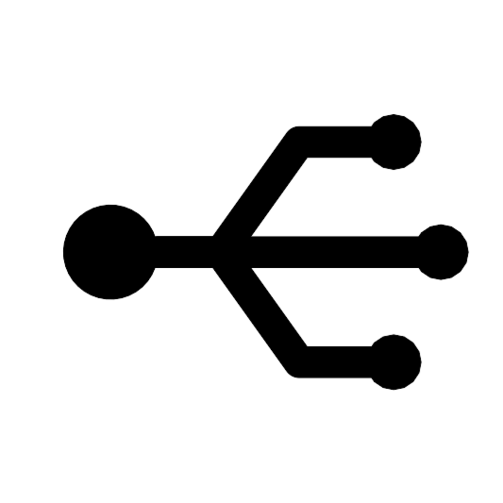
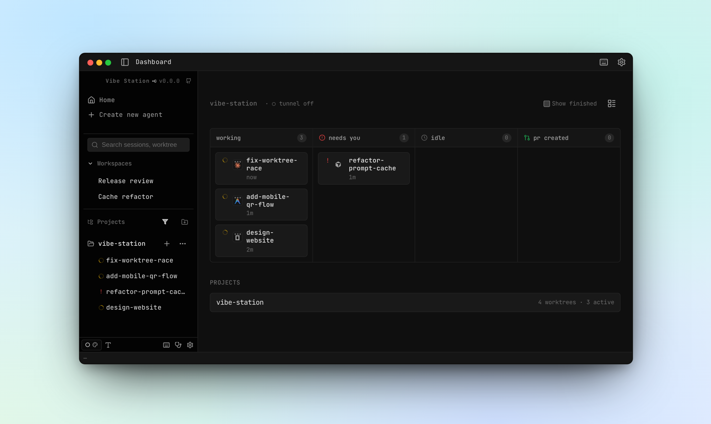
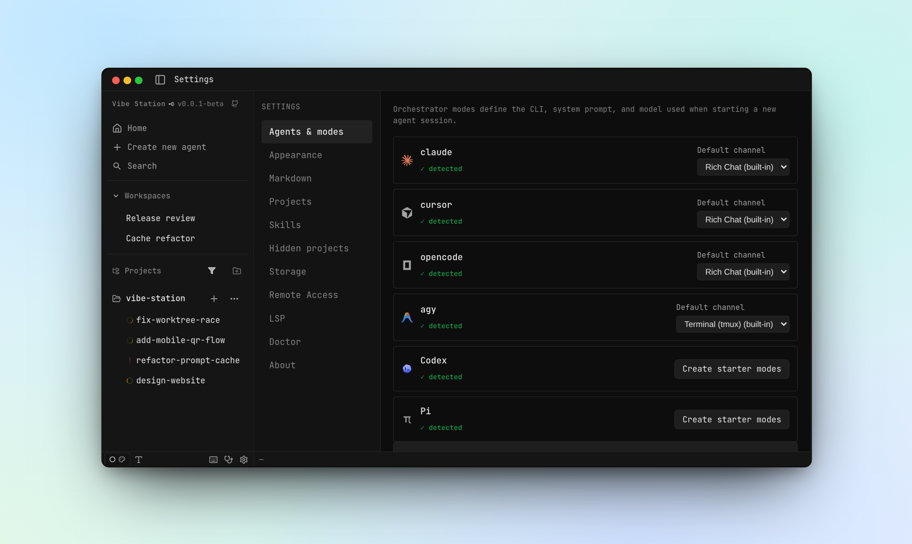
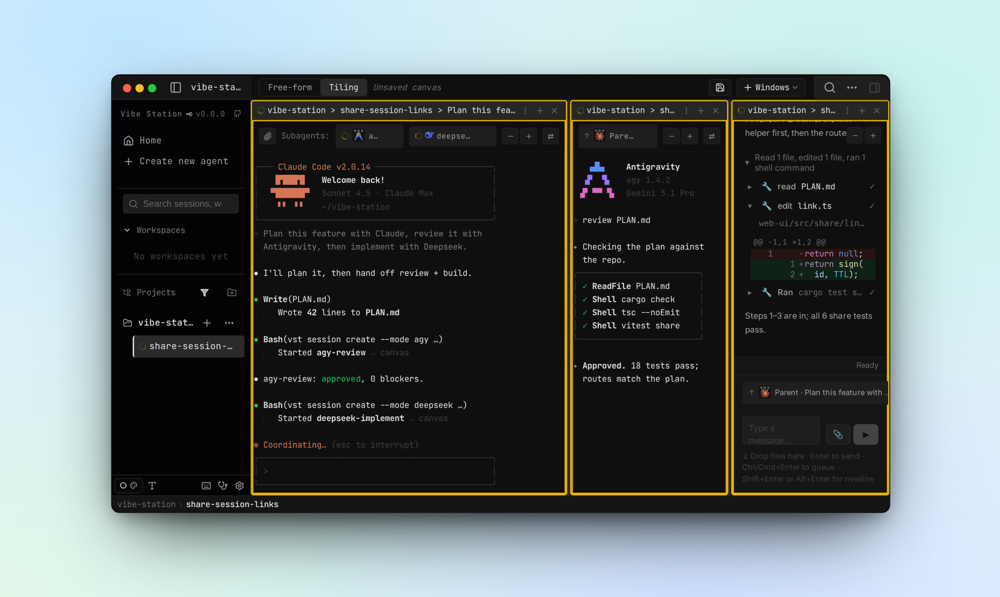
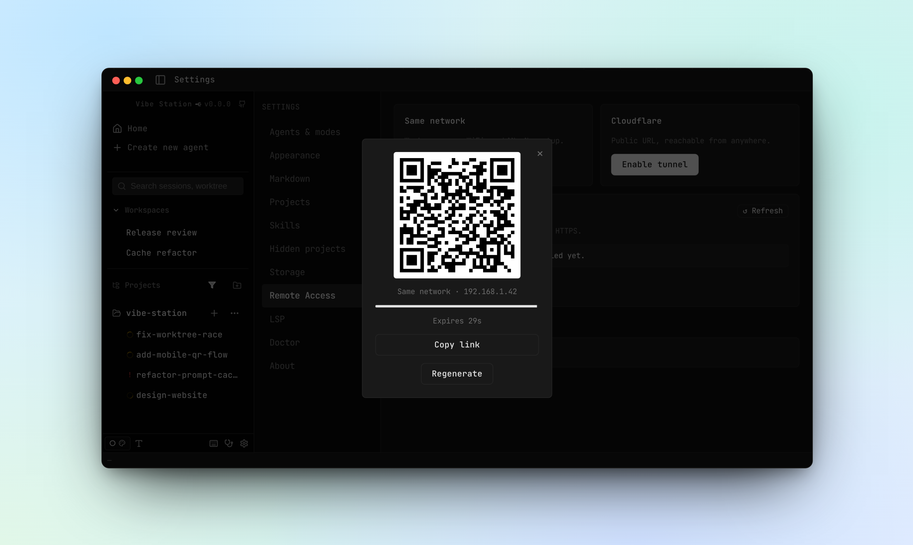
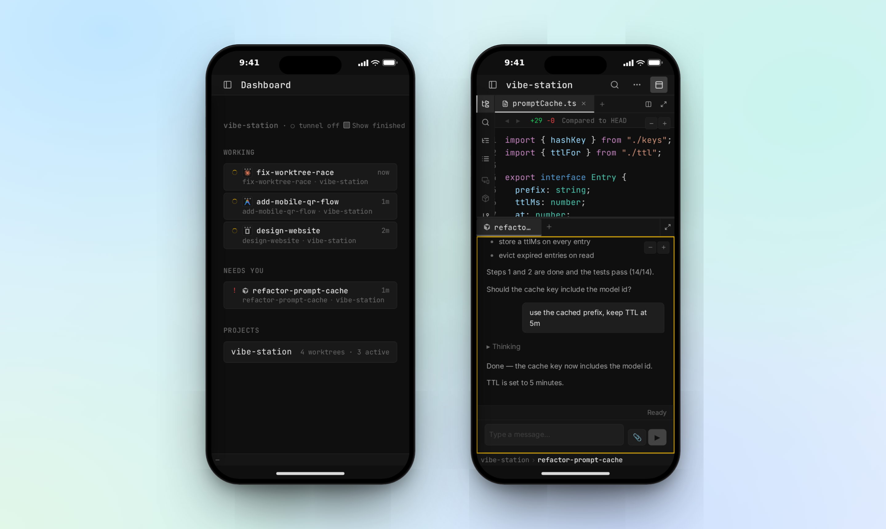
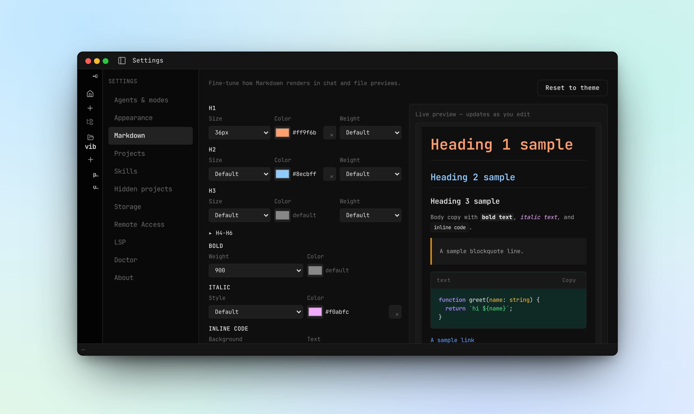
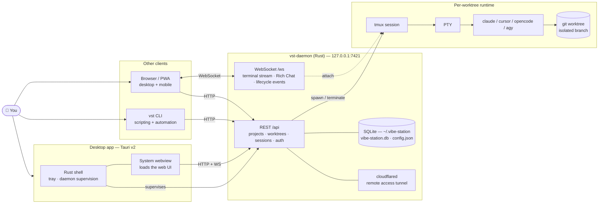

<div align="center">



# vibe-station

**Vibe code in parallel. Ship at scale.**

A local-first orchestrator for parallel AI coding agents — Claude Code, Cursor, OpenCode and agy, each on its own git worktree, driven from a desktop app, your browser, your phone, or the `vst` CLI.

[](https://github.com/fastestdevalive/vibe-station/stargazers)
[](https://github.com/fastestdevalive/vibe-station/releases)
[](LICENSE)
[](https://github.com/fastestdevalive/vibe-station/releases)
[](https://github.com/fastestdevalive/vibe-station/actions/workflows/desktop-build.yml)

[Install](#install) · [Quick start](#quick-start) · [Features](#features) · [Docs](docs/) · [Architecture](#architecture)

<br />



</div>

Everything runs on your machine. No accounts, no cloud service, no telemetry.

---

## Features

### One board for every agent

Every agent across every project lands on a single dashboard — **working**, **needs you**, **idle**, **PR created** — so you always know which one is waiting on you. Status is two independent axes (agent lifecycle and PR state); see [`docs/STATUS-INDICATORS.md`](docs/STATUS-INDICATORS.md).

### Every major harness, one app

Claude Code, Cursor, OpenCode and agy plug in through the same plugin interface. Define **modes** (a CLI + a system context) and mix them per worktree, per session, even per subagent.



### Isolated worktrees

Each task gets its own `git worktree` on its own branch, so agents can never overwrite each other's files. Creating a worktree checks out the branch and starts an agent on it in one step.

### Subagents that delegate and talk to each other

Ask one agent to plan, a second to review and a third to implement — each in its own mode and model. Subagents show up as rows above the composer and as tiles on a canvas; parents wake automatically when a subagent needs them.



### Rich Chat *and* a real terminal

Every agent runs on one of two channels. **Rich Chat** renders the CLI's structured output — tool calls, diffs, thinking blocks, file attachments — as UI, over ACP. **Terminal** is the raw tmux PTY, exactly what you'd see in a shell. Toggle between them on the same session. Details: [`docs/RICH-CHAT-ACP.md`](docs/RICH-CHAT-ACP.md).

### A code reader built for review

Browse the working tree live as agents edit it, read diffs (`local` vs `HEAD`, or vs the base branch), and render Markdown with full GFM and Mermaid. Syntax highlighting follows your theme, with 15+ languages and symbol navigation through LSP.

### Your phone, in your pocket

Turn on **Settings → Remote Access** and scan a QR code. The QR carries a short-lived one-time code; nothing leaves your machine unless you enable the tunnel.

<p align="center">
  
</p>

<p align="center">
  
</p>

### Make it look like yours

Themes, fonts, and per-element Markdown styling are all configurable, with a live preview.



### Three front ends, one daemon

A native **desktop app** for daily use, the **browser UI** (and installable PWA) for any device, and the **`vst` CLI** for scripting, CI, and for agents driving other agents. All three are thin clients over the same daemon.

---

## Install

> **No release has been published yet.** The installer and release workflow are in place; until the first tag lands, [build from source](#build-from-source). Watch the repo for the first release.

```bash
curl -fsSL https://raw.githubusercontent.com/fastestdevalive/vibe-station/main/scripts/install.sh | sh
```

| Platform | What you get | Status |
|---|---|---|
| Linux (x86_64) | `vst` CLI + desktop app (`.AppImage`; `.deb` from the Releases page) | Built in CI |
| Linux (aarch64) | `vst` CLI only | Built in CI |
| macOS (Apple Silicon) | `vst` CLI via the installer; desktop `.dmg` from the Releases page | Built in CI; the installer deliberately skips the `.dmg` so Gatekeeper still checks it |
| macOS (Intel), Windows | — | Not published |

The installer needs no `sudo`, puts the CLI in `~/.local/bin`, and is safe to re-run to upgrade. Options: `--version <tag>`, `--install-dir <dir>`, `--no-modify-path`.

The `vst` binary contains the daemon and web UI; the desktop bundle adds `cloudflared` as a sidecar — you install neither Node.js nor pnpm.

The CLI install also bundles the ACP adapters for Rich Chat as self-contained executables beside `vst` — `claude-acp` (the pinned Claude adapter compiled with the bun runtime, so no bun or Node is needed) and `agy-acp` (shipped ready for agy Rich Chat, which is off while agy is terminal-only). They still drive your own `agy` / `claude` CLIs, which you must have installed. `claude-acp` is a glibc build and is skipped on musl systems (e.g. Alpine). `cursor` and `opencode` use your own `cursor-agent` / `opencode` binaries.

**You still need** `tmux`, `git`, and at least one agent CLI on your `PATH`: [Claude Code](https://docs.anthropic.com/en/docs/claude-code), [Cursor](https://cursor.sh), [OpenCode](https://opencode.ai), or agy. Run `vst doctor` to check.

### Build from source

Prerequisites: a Rust toolchain (pinned in `rust/rust-toolchain.toml`), Node.js ≥ 20 and pnpm ≥ 9 (for the web UI and desktop shell), `tmux`, `git`, and `bun` for Claude Rich Chat.

```bash
git clone https://github.com/fastestdevalive/vibe-station.git
cd vibe-station

pnpm install
pnpm --filter @vibestation/web build   # the daemon embeds web-ui/dist, so build the UI first
pnpm build:rust          # builds the `vst` binary (CLI + daemon + embedded web UI)
# binary: rust/target/release/vst — put it on your PATH

vst --version
vst doctor
```

Rich Chat on agy additionally needs the `agy-acp` adapter (built from the vendored `rust/vendor/openab` submodule; see `scripts/build-agy-acp.sh`).

---

## Quick start

```bash
# 1. Check the daemon (any other vst command auto-starts it; `vst daemon run` runs it in the foreground)
vst daemon status

# 2. Register a project
vst project add /path/to/your/repo --name=my-app

# 3. Create a mode: an AI CLI + optional system context
vst mode add --name="Claude Coder" --cli=claude --context="You are an expert TypeScript engineer."

# 4. Create a worktree — checks out a branch and starts an agent on it
vst worktree create my-app --mode=<mode-id> \
  --prompt="Implement the user authentication flow described in docs/auth.md"

# 5. Open the UI
vst open /path/to/your/repo
```

The daemon binds `127.0.0.1:7421` (or the next free port) and writes its port and pid to `~/.vibe-station/config.json`. `--branch` is optional — it's derived from the prompt. Add `--channel=tmux|json` to pick Terminal or Rich Chat; otherwise the default is Rich Chat for Claude, Cursor and OpenCode, and Terminal for agy (changeable in Settings).

---

## Desktop app

A [Tauri v2](https://v2.tauri.app) shell (Rust + the system webview) around the same web UI the daemon serves.

- **Zero setup** — on launch it reuses a live daemon from `~/.vibe-station/config.json`, or spawns the bundled one and waits for it. A pre-minted token is injected into the webview, so there is no login screen.
- **System tray** — ✕ hides the window to the tray. The tray menu has **Open vibe-station** and **Quit completely**.

> The desktop shell has no single-instance guard yet — launching it twice opens a second window against the same daemon.

---

## Mobile access & PWA

| Mode | How it works | When to use |
|---|---|---|
| **Same network** | QR pointing at a detected LAN or Tailscale address | Same network; nothing leaves it |
| **Cloudflare tunnel** | Temporary public HTTPS URL via the bundled `cloudflared` | Off your network; also gives a secure context for PWA install |

The daemon binds loopback by default. Toggle **Settings → Remote access → Same network** to listen on your LAN with no restart (it persists `allowNetworkAccess` in `~/.vibe-station/config.json`), or start with `VST_ALLOW_NETWORK=1` to set the initial state. Disabling the tunnel invalidates only tunnel-minted codes.

**Installing as a PWA:** Chrome offers "Install Vibe Station…" (or "Add to Home screen" on Android) only on a secure context — `https:`, `localhost` or `127.0.0.1`. A plain-HTTP LAN/Tailscale address shows no install option; that's expected. Over Tailscale, give it a real cert:

```bash
tailscale cert <machine>.<tailnet>.ts.net
tailscale serve --https=443 http://127.0.0.1:7421
```

---

## Core concepts

<details>
<summary><b>Projects, worktrees, sessions, modes, channels</b></summary>

**Project** — a registered git repository. Worktrees live under `~/.vibe-station/projects/<project-id>/worktrees/`.

**Worktree** — an isolated `git worktree` checkout on its own branch, the unit of parallel work. IDs are `<project-prefix>-<n>` (e.g. `vs-12`), monotonic and never reused. Creating one creates a **main session** and starts your agent.

**Session (tab)** — a process in a worktree: an **AI agent** or a plain **terminal**. One session per worktree is flagged **main**; terminating it promotes another live agent, and is rejected if it's the only one.

**Mode** — an AI CLI plus an optional context string prepended to the agent's system prompt (up to 20 modes).

**Channel** — **Terminal** (raw tmux PTY) or **Rich Chat** (structured stream: tool calls, thinking blocks, attachments as UI). Rich Chat is only offered for CLIs whose plugin supports it.

```bash
vst worktree ls --project=my-app
vst worktree rename|done|rm <worktree-id>      # `done` releases processes; `rm` deletes branch + worktree

vst agent create <worktree-id> --mode=<mode-id> --prompt="Write tests for the auth module"
vst terminal create <worktree-id>              # plain shell, no AI
vst agent ls|info|rename|terminate|reset|handoff|stop|attach|restore <session-id>
```

> **Worktree vs session:** the worktree is the isolated branch + directory; sessions are the processes inside it. One worktree, many sessions.

</details>

<details>
<summary><b>Talking to agents, monitoring, lifecycle, resuming</b></summary>

```bash
vst agent send <session-id> "Add error handling for the network timeout case"
vst agent send <session-id> --file=./instructions.md --no-wait   # --wait is the default
vst agent output <session-id> --lines=100
vst agent transcript <session-id>
vst status --project=my-app --json
vst summary
```

`--timeout <ms>` caps the wait (default 60000); `--queue` enqueues instead of steering a running Rich Chat turn.

| State | Meaning |
|---|---|
| `not_started` | Spawned but not yet launched |
| `working` | Agent is actively processing |
| `idle` | Agent is waiting for input |
| `waiting_for_human` | Agent is blocked on a prompt or approval |
| `drafting` | A draft agent that hasn't been started yet |
| `done` | Marked done by you |
| `exited` | Process died (can be resumed) |

`vst agent restore <session-id>` resumes an exited session. Claude Code resumes with full history via `claude --resume`; Cursor, OpenCode and agy resume when a native chat/session ID was captured, and start fresh otherwise.

</details>

<details>
<summary><b>Project-specific agent rules</b></summary>

Drop an `AGENTS.md` in your project root (or `.vibe-station/rules.md` as a fallback) to inject instructions into every agent spawned for that project. It's read at spawn time and included in the agent's system prompt.

```markdown
# AGENTS.md
- Always write tests for new functions
- Use the existing logger from src/lib/logger.ts
- Never modify migration files directly
```

</details>

<details>
<summary><b>Data directory & auth model</b></summary>

```
~/.vibe-station/
├── config.json          # port, pid, cliToken, tauriToken, browserEpoch, … (mode 0600)
├── vibe-station.db      # SQLite — projects, worktrees, sessions (source of truth)
├── modes.json
├── logs/daemon.log
└── projects/<project-id>/
    ├── session-data/    # per-session system prompts, CLI configs, transcripts
    └── worktrees/<worktree-id>/
```

The daemon mints a master token in memory at every start and **never writes it to disk**. It always authenticates, including on loopback, and enforces an exact-origin policy with a CSRF header on writes. Two scoped tokens are derived and persisted: `cliToken` (the `vst` CLI) and `tauriToken` (the desktop webview, confined to the local machine). Browser logins redeem a one-time `/continue?code=…` link (`vst open` can mint and open it for you when it has just launched the daemon). Full details and the origin matrix: [`docs/AUTH.md`](docs/AUTH.md).

</details>

---

## Architecture


```mermaid
flowchart LR
  user([👤 You])

  subgraph desktop ["Desktop app — Tauri v2"]
    direction TB
    shell["Rust shell<br/>tray · daemon supervision"]
    webview["System webview<br/>loads the web UI"]
  end

  subgraph clients [Other clients]
    direction TB
    cli["vst CLI<br/>scripting + automation"]
    browser["Browser / PWA<br/>desktop + mobile"]
  end

  subgraph daemonbox ["vst-daemon (Rust) — 127.0.0.1:7421"]
    direction TB
    rest["REST /api<br/>projects · worktrees · sessions · auth"]
    ws["WebSocket /ws<br/>terminal stream · Rich Chat · lifecycle events"]
    state[("SQLite — ~/.vibe-station<br/>vibe-station.db · config.json")]
    tunnel["cloudflared<br/>remote access tunnel"]
  end

  subgraph runtime ["Per-worktree runtime"]
    direction TB
    tmux["tmux session"]
    pty["PTY"]
    agent["claude / cursor / opencode / agy"]
    repo[("git worktree<br/>isolated branch")]
  end

  user --> desktop
  user --> cli
  user --> browser
  shell -->|supervises| rest
  shell --- webview
  webview -->|HTTP + WS| rest
  cli -->|HTTP| rest
  browser -->|HTTP| rest
  browser <-->|WebSocket| ws
  rest --- state
  rest --- tunnel
  rest -->|spawn / terminate| tmux
  ws -.->|attach| tmux
  tmux --> pty --> agent
  agent --> repo
```

- **The daemon is the only stateful component.** It owns the SQLite database, spawns agents into tmux, and broadcasts terminal output, Rich Chat events and lifecycle changes over WebSocket.
- **Desktop, browser and CLI are thin clients.** Every action is an HTTP call to the daemon.
- **Each worktree** is an isolated checkout with one or more sessions. Agents in different worktrees never see each other.
- **Sessions outlive the daemon.** tmux sessions survive a restart and reattach; Claude sessions also resume their conversation.

More: [`docs/ARCHITECTURE.md`](docs/ARCHITECTURE.md) · [`docs/PLUGINS.md`](docs/PLUGINS.md) · [`docs/API-CONTRACT.md`](docs/API-CONTRACT.md)

---

## Development

```bash
pnpm install
pnpm docker       # isolated dev sandbox with demo data and hot reload (scripts/dev-sandbox.sh)
pnpm dev          # Tauri desktop dev build against the Vite dev server
pnpm run ci       # typecheck + lint + test across the workspaces

pnpm build:rust   # release `vst` binary (CLI + daemon + embedded UI)
pnpm build        # desktop bundle (.deb / .AppImage on Linux, .dmg on macOS)
```

Rust tests and lints: `cargo test` / `cargo clippy` from `rust/` (CI runs `rust/scripts/rust-gate.sh`). The desktop bundle expects the `vst` sidecar and `cloudflared` in `desktop/src-tauri/binaries/` (`scripts/prep-sidecar.sh`, `scripts/download-cloudflared.sh`).

| Path | What it is |
|---|---|
| `web-ui/` | React 19 + Vite frontend |
| `desktop/` | Tauri v2 app (Rust shell + system webview) |
| `rust/vst-daemon`, `vst-routes`, `vst-ws` | Axum daemon: REST routes, WebSocket streaming |
| `rust/vst-cli` | The `vst` CLI (also hosts the daemon in the single merged binary) |
| `rust/vst-store`, `vst-types`, `vst-lifecycle` | SQLite persistence, shared types, lifecycle poller |
| `rust/vst-agents`, `vst-agy-acp`, `vst-lsp`, `vst-git`, `vst-proc` | Agent plugins and ACP, language servers, git, process/tmux control |
| `skill/` | The `vst` agent skill published for external agents |

README screenshots are generated, not hand-captured — see [`docs/screenshots/README.md`](docs/screenshots/README.md). Contributor and agent guidelines live in [`AGENTS.md`](AGENTS.md).

---

## CLI reference

```
vst project   add | create | rm | ls | info
vst worktree  create | rm | rename | done | ls | info
vst agent     create | terminate | stop | reset | rename | ls | info
              attach | restore | output | transcript | send | handoff
vst terminal  create | terminate | rename | ls | info | attach | output
vst mode      add | rm | ls
vst files     ls | open | close
vst file      open
vst status    [--project] [--json]
vst summary
vst open      [target]
vst daemon    status | stop | run
vst doctor
```

---

## Troubleshooting

**`vst doctor`** is the first stop — it checks `tmux`, `git`, the agent CLIs on `PATH`, `cloudflared`, Tailscale, and whether a daemon is registered. It does not prove every API route works.

- **Daemon not starting** — `vst daemon status`, then `cat ~/.vibe-station/logs/daemon.log`.
- **Port 7421 in use** — the daemon picks the next free port up to 7520; the one in use is in `~/.vibe-station/config.json`.
- **Desktop window won't close** — by design, ✕ hides to the tray. Use **Quit completely**.
- **Phone can't connect / 403 on writes** — the daemon is loopback-only until you enable network access, and enforces exact origins; see [Mobile access](#mobile-access--pwa) and [`docs/AUTH.md`](docs/AUTH.md).
- **Orphaned tmux sessions after a crash** — `tmux kill-session -t <name>` for leftover `vst-*` sessions.
- **Claude sessions not resuming** — you need a Claude Code build with `--resume` (`claude --version`).
- **No PWA install option** — you're on a non-secure origin; see above.

---

## Why vibe-station

Inspired by [agent-orchestrator](https://github.com/ComposioHQ/agent-orchestrator), [emdash](https://github.com/generalaction/emdash) and [claudecodeui](https://github.com/siteboon/claudecodeui), but built to be lightweight and local-first.

- **Install and go** — one `vst` binary ships the daemon and web UI; the desktop bundle adds `cloudflared`.
- **Local-first, not cloud-optional** — state is a SQLite file on your disk, the daemon binds loopback, remote access is opt-in.
- **Terminal *and* structured chat** — Rich Chat renders tool calls and thinking blocks while the tmux stream stays available for everything else.
- **Agent-agnostic** — Claude Code, Cursor, OpenCode and agy through one plugin interface; mix them per worktree.
- **Agents that orchestrate agents** — subagents, handoffs and cross-harness messaging through the same CLI the UI uses.
- **Sessions outlive the daemon** — tmux-backed sessions survive restarts; Claude resumes its history.

---

## License

See [LICENSE](LICENSE).
