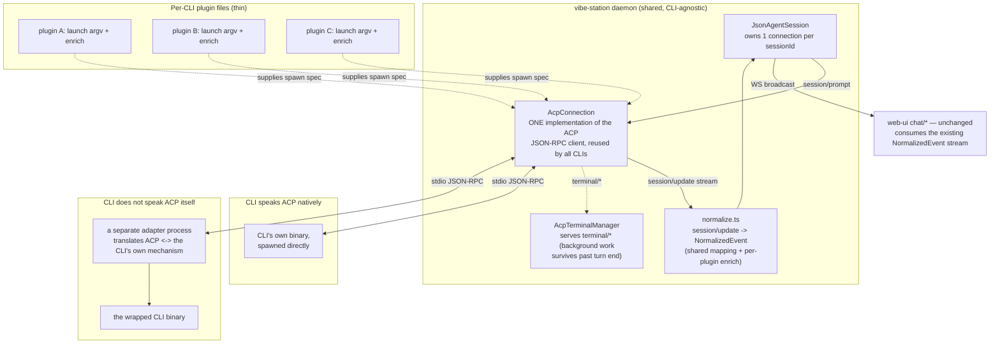
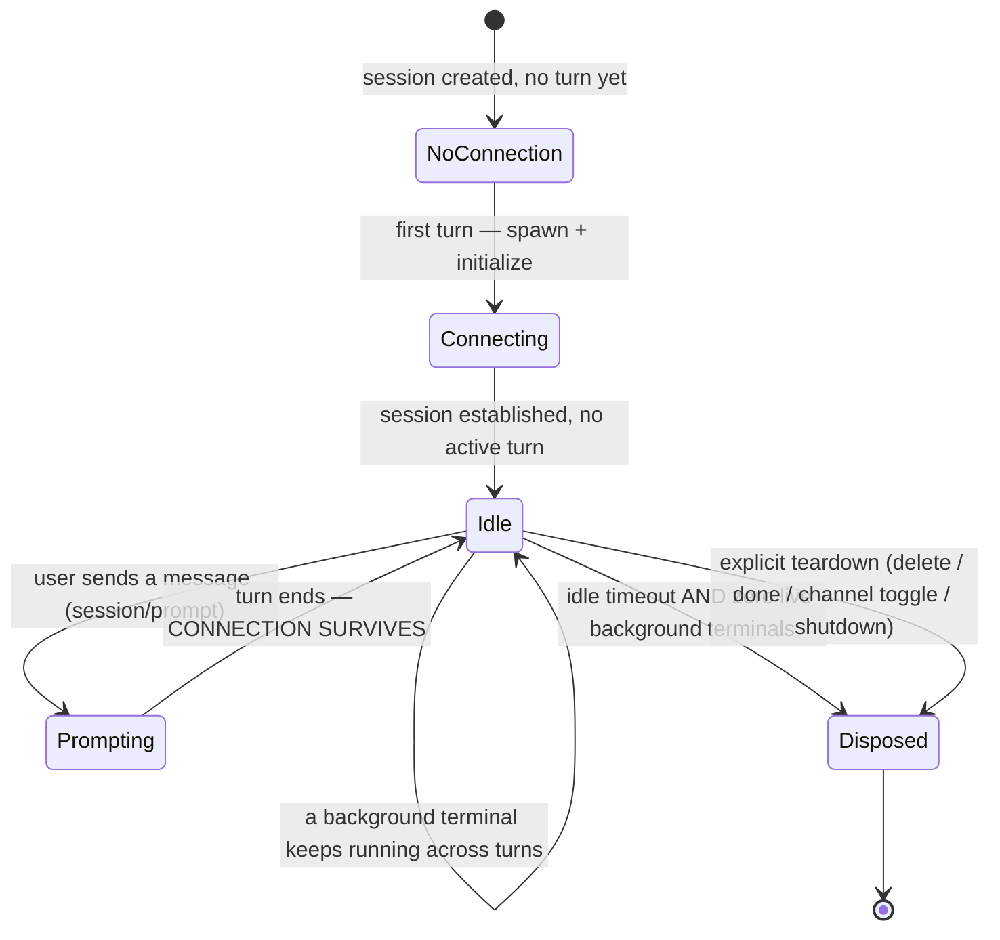

# ACP Transport — How It Works

Rich Chat's `json` channel talks to every coding-agent CLI over the same
protocol: the **Agent Client Protocol (ACP)**, a JSON-RPC 2.0 wire format
sent over stdio. This doc explains that layer specifically — the shared
transport, not the channel/toggle mechanics (see `JSON-CHAT-ARCHITECTURE.md`
for those) or per-CLI chat-id capture (see `AGENT-CHAT-ID-CAPTURE.md`).

## The key idea

ACP is a **protocol**, not a per-CLI library the daemon writes. The daemon
implements the client side of that protocol exactly once and reuses it for
every CLI. What differs per CLI is only:

1. Whether the CLI's own binary speaks ACP directly, or a separate
   **adapter process** sits in front of it and translates ACP calls into
   that CLI's native mechanism.
2. A small per-plugin file supplying (a) the launch command/args/env for
   that CLI's process, and (b) an `enrich()` hook for any CLI-specific
   event nuances.

Everything else — spawning, the JSON-RPC handshake, streaming updates,
cancellation, idle teardown, background-terminal handling — lives in one
shared module set and is never duplicated per plugin.

## Diagram

## What each layer owns

| Layer | Owns | Shared or per-CLI? |
|---|---|---|
| `JsonAgentSession` | FIFO turn queue, transcript persistence, "first turn on this connection" bookkeeping | Shared |
| `AcpConnection` | Process spawn/liveness, `initialize`, `session/new`/`load`/`prompt`/`cancel`, idle-TTL disposal | Shared — one implementation for every CLI |
| `normalize.ts` | Base `session/update -> NormalizedEvent` mapping | Shared, with a per-plugin `enrich()` hook for nuance only |
| `AcpTerminalManager` | Host-managed OS child processes started as ACP `terminal/*` calls, so background work (e.g. a dev server) survives past the turn that started it | Shared |
| Plugin file (per CLI) | Launch command/args/env for that CLI's process; its `enrich()` hook; nothing about the protocol itself | Per-CLI, intentionally thin |
| `agent-plugins/native-chat-id/` | Converting/recovering the CLI's OWN resume id, for the CLIs where it isn't just the ACP session id — see below | Per-CLI; one file only for a CLI that needs one |

The last row is the one place the protocol layer and the per-CLI adaptation
layer genuinely meet: `services/acp/` never knows which CLI it is driving,
while `agent-plugins/native-chat-id/` is *entirely* CLI-specific knowledge
about where that CLI keeps its own conversation state on disk.

## One process per session, not one per turn

Before ACP, each turn spawned a fresh one-shot CLI process that exited when
its own final response line landed — which meant any background work
started mid-turn (a backgrounded shell command, a dev server) died with it.

Under ACP, the daemon spawns **one** agent process per session, once, and
keeps it alive across every turn:

A turn's "done" signal is the `session/prompt` JSON-RPC call resolving —
not a process exiting. Stopping a turn sends `session/cancel` over the same
connection rather than killing the process tree, so the connection and any
live background terminal survive a Stop click.

## Why the plugin interface didn't need to change shape

`AgentPlugin` is still the seam between the daemon's turn engine and every
CLI. `runTurn(input, ctx, signal)` keeps its exact signature and its
`AsyncIterable<NormalizedEvent>` return type — internally it now gets the
session's connection (`ctx.getAcpConnection()`) and yields off its update
stream instead of spawning a process itself. Everything CLI-specific still
lives entirely inside that CLI's own plugin file; no shared daemon code
branches on which CLI is running.

## Related docs

- `JSON-CHAT-ARCHITECTURE.md` — the two channels (`json` / terminal), the
  toggle between them, and where per-CLI chat-id handling fits in.
- `AGENT-CHAT-ID-CAPTURE.md` — why the id a CLI's own resume flag expects
  isn't always the same as the id ACP hands back, and how each plugin
  reconciles that.
