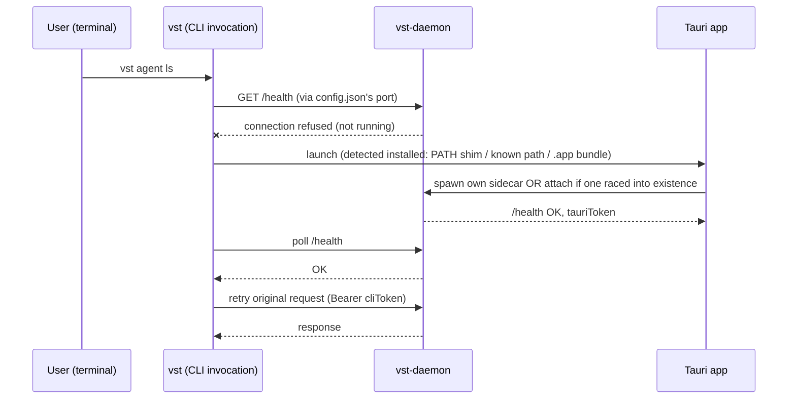
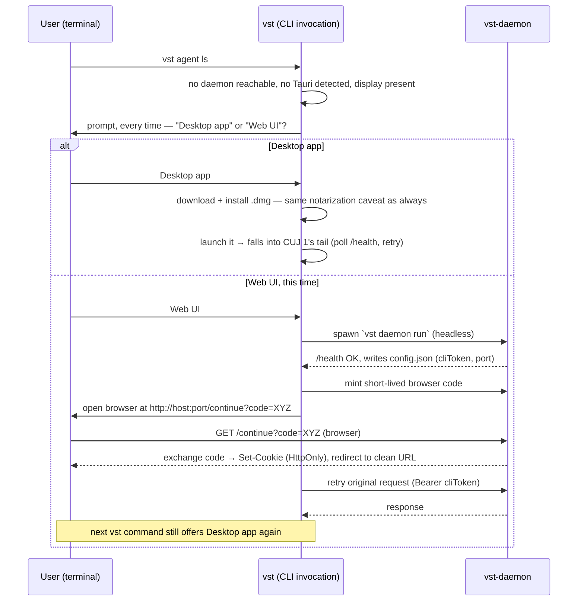
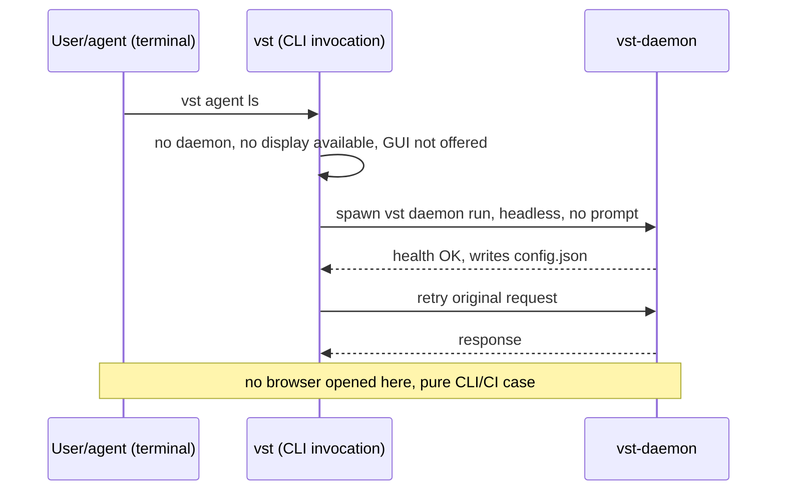
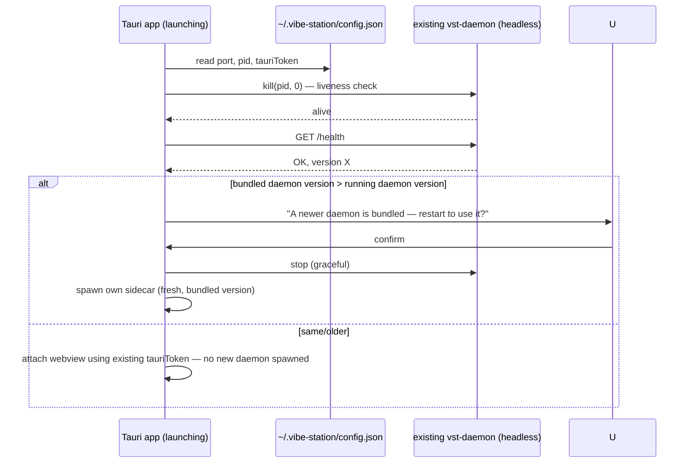
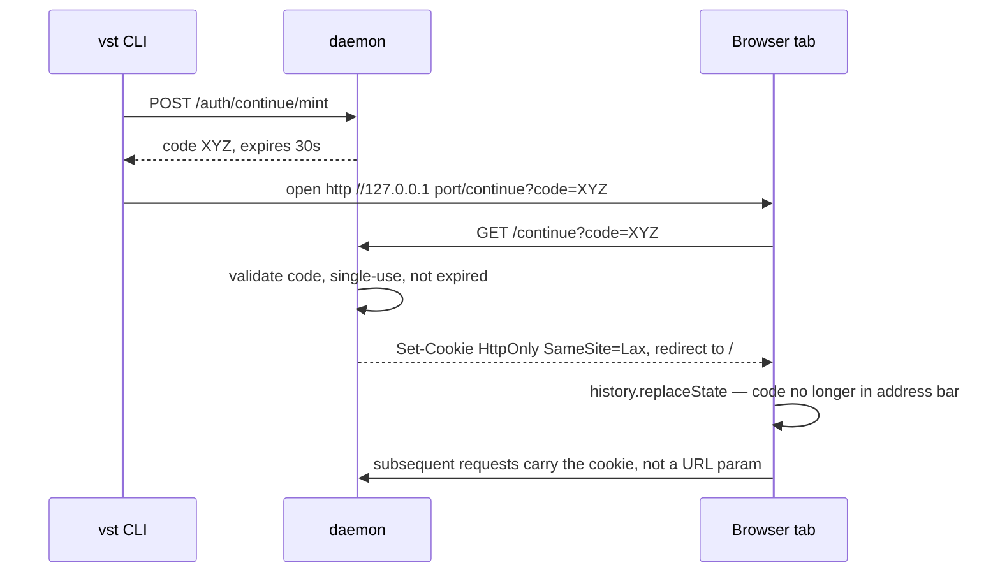
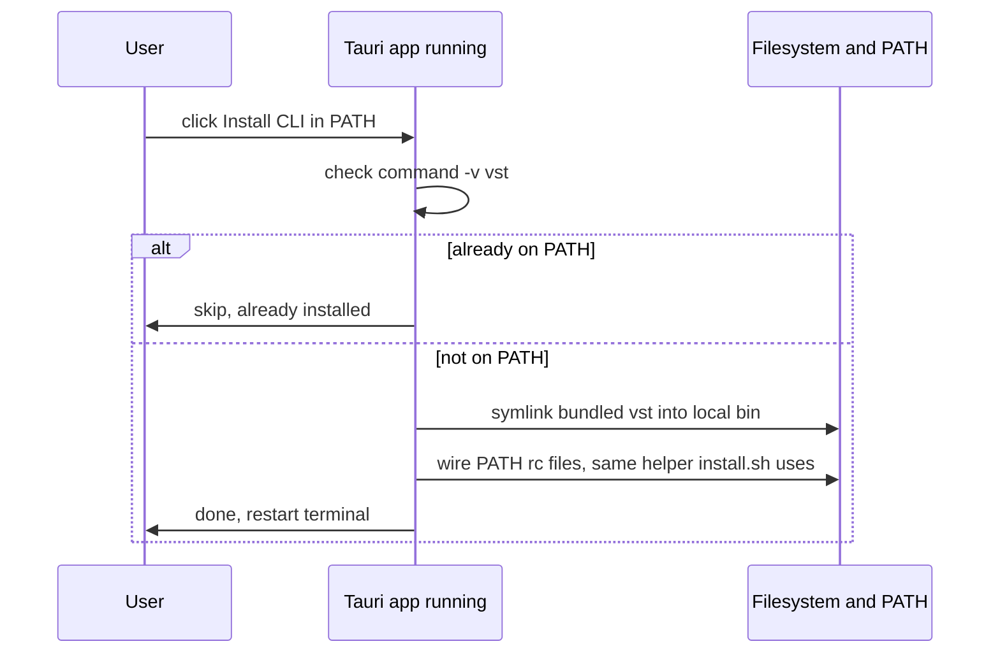

# CLI / daemon / Tauri — user journeys and token minting (future direction)

Companion to `docs/CURL-INSTALL.md`'s Goals section and `docs/AUTH.md`. Not
yet built — this documents the agreed design.

## Does merging `vst`+`vst-daemon` remove the need for a token?

**No.** Merging is a *binary* decision (one executable, dispatches on
subcommand/argv0) — it does not make a `vst <cmd>` invocation and the running
`vst daemon run` process the same OS process. Every `vst <cmd>` is a new,
short-lived process that still talks to the long-lived daemon process over
loopback HTTP. The daemon still can't tell "this request came from a process
sharing my binary" without a credential — binary identity isn't process
authorization.

What merging *does* give you: a guarantee that the executable agents get
(goal 3) is always the exact one paired with the running daemon. That's a
provenance guarantee, not an authentication mechanism — orthogonal to tokens.

Today, for a normal desktop (non-headless) daemon, the loopback-trust bypass
in `docs/AUTH.md` already makes `cliToken` largely redundant for the human at
the keyboard — it's sent, but not load-bearing. It becomes load-bearing
exactly when loopback trust is turned off — i.e. **headless mode** (the
CI/shared-box case) — where merging the binary changes nothing; you still
need a real secret to tell an authorized `vst` invocation apart from any
other local process/user on that box.

## Token minting cases

| Token | Minted by | Stored | Used by | Lifetime |
|---|---|---|---|---|
| `cliToken` | daemon, at boot | `~/.vibe-station/config.json` (0600) | human's `vst` CLI invocations | until daemon restarts |
| `tauriToken` | daemon, at boot | same `config.json` | Tauri webview (`__VST_TOKEN__` injected pre-load, never touches a URL) | until daemon restarts |
| one-time mobile/QR code | daemon, on demand | in-memory, ~30s | phone scanning the QR | single use, 30s |
| browser "continue" code *(new — corrected)* | daemon, on demand | in-memory, short TTL | a plain browser tab opened by the CLI's "Web UI" choice | single use — **reuses the mobile/QR exchange mechanism, not a copy of `cliToken`/`tauriToken`** (see below) |
| headless-mode requests | none new | `cliToken` | any local caller, now required even from loopback | until daemon restarts |
| per-agent scoped token | *(deferred)* | — | agent processes | not built yet — today agents ride loopback trust like everything else |

**Correction to the earlier draft of Goal 5:** it previously said "embed a
token in the URL the daemon opens" — that would put a long-lived credential
in the browser's address bar and history, indefinitely visible. Fixed: the
browser "continue" path mints a short-lived single-use code (identical
mechanism to the existing mobile/QR flow), the page exchanges it for an
`HttpOnly` cookie immediately, then scrubs the code out of the visible URL
via `history.replaceState`. No durable secret ever appears in a URL.

## Which CUJ applies where

Given the actual install matrix (`docs/CURL-INSTALL.md`), "no daemon, no
Tauri" is **not** a generic state — it's only reachable in two specific
places:

| Install | Tauri present? | Realistic first-run CUJ |
|---|---|---|
| Linux, glibc, via curl | Yes, always (goal 2 — bundled unconditionally) | CUJ 1 (daemon absent, Tauri present → launch it) |
| Linux, musl (Alpine/CI containers) | Never can be (AppImage needs glibc) | CUJ 2b (headless, no prompt) |
| Linux, glibc, but no display (CI/server, `$DISPLAY`/`$WAYLAND_DISPLAY` unset) | Present on disk, but not launchable | CUJ 2b (headless, no prompt) — **binary-present ≠ launchable**, must check for a display, not just check the file exists |
| macOS, via curl | No (deliberately excluded — notarization) | CUJ 2a (has a display → real prompt) |
| macOS, Tauri manually installed later | Yes | CUJ 1 |

So CUJ 2 splits into two genuinely different journeys, not one:

## CUJ 1 — `vst <cmd>`, no daemon running, Tauri app installed

## CUJ 2a — `vst <cmd>`, no daemon, no Tauri, has a display (macOS)

Not a one-time choice — the goal is for the user to eventually install the
desktop app, so **"Desktop app" is always offered, every time this state is
hit**, for as long as Tauri isn't installed. Picking "Web UI" doesn't
suppress the offer on the next invocation — it's a per-command choice, not a
permanent dismissal.

## CUJ 2b — `vst <cmd>`, no daemon, no Tauri possible/launchable (headless)

musl (Alpine/CI containers, GUI genuinely can't run there), **or** glibc
Linux with no `$DISPLAY`/`$WAYLAND_DISPLAY` (CI runner, remote server) even
if the AppImage happens to be on disk. **No prompt** — asking "want the
desktop app?" on a box with no display to show it on is nonsensical, so this
skips straight to Web UI.

## CUJ 3 — Tauri installed/launched while a headless daemon is already running

Confirmed already correct today for the base case (attach-not-duplicate) —
`desktop/src-tauri/src/main.rs`'s `detect_running_daemon()` uses
`kill(pid, 0)`, which works cross-platform. The version-check branch above is
**not built yet** (`/health` already returns `version`; nothing compares it
today).

**Known bug, separate from this CUJ:** `vst-daemon`'s own startup singleton
lock (`lock.rs`, used when a *second* `vst-daemon` process tries to start
directly — not via Tauri's smarter attach-or-spawn check above) tests
liveness via `/proc/<pid>`, which doesn't exist on macOS. On Mac, that
specific path can still double-start and clobber `config.json`. Needs fixing
regardless of anything in this doc.

## CUJ 4 — browser "continue" token exchange, detail

## CUJ 5 — GUI installed without curl, terminal has no `vst` at all

Reachable via `.dmg` (macOS) or a manually-downloaded `.AppImage` (Linux,
bypassing `install.sh`) — **neither has an install-time hook**, so nothing
ever puts `vst` on `PATH`. `.deb` is different: it has a postinst script, so
it *could* register `vst` on `PATH` automatically at install time — this CUJ
is specifically the case where that didn't happen.

Not built yet. This is the GUI-side mirror of `install.sh` — same PATH-rc
logic, but symlinking the binary already bundled in the app instead of
downloading one.

## CUJ 6 — GUI installed after curl (either order), PATH already set up

No new diagram needed — this is CUJ 5 (skip) plus CUJ 3 (attach, don't
duplicate) composed: whichever came first already did the real work; the
second install must detect that and no-op rather than re-registering PATH or
spawning a competing daemon.
