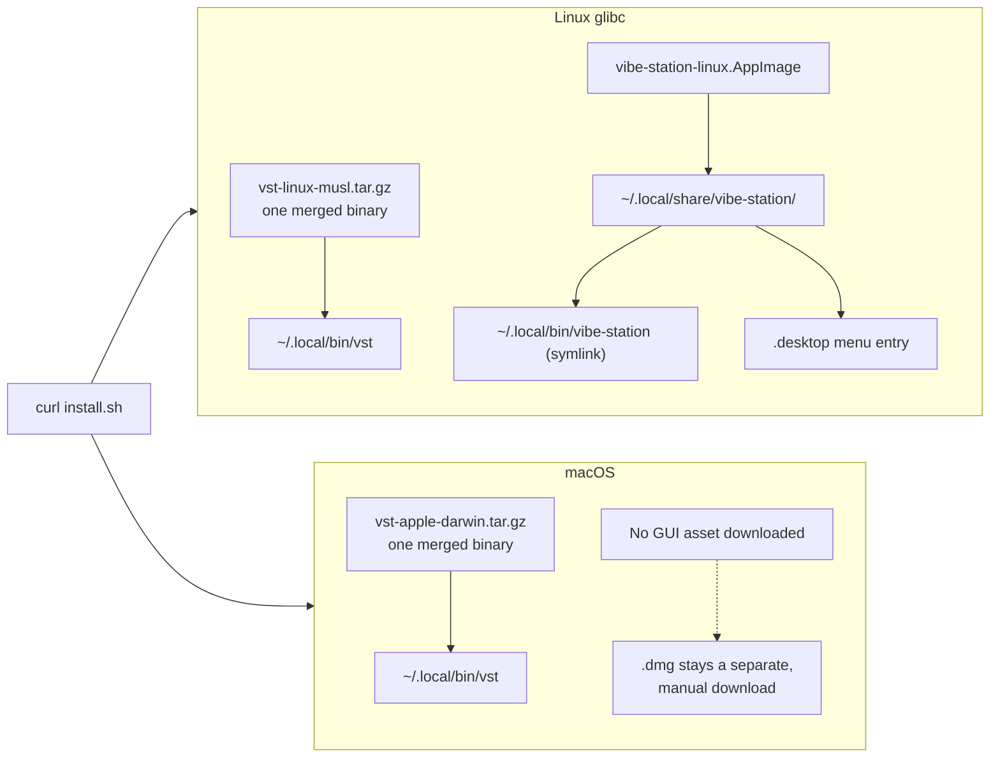

# `scripts/install.sh` — what it does, and where it's going

> **Status:** "Current script behavior" below matches the committed script as of
> Part 04 (macOS CLI supported, release workflow publishing artifacts). Full
> diagrams for every CUJ referenced here live in `docs/CLI-DAEMON-TAURI-CUJS.md`.

```
curl -fsSL https://raw.githubusercontent.com/fastestdevalive/vibe-station/main/scripts/install.sh | sh
```

## Current script behavior

| | Linux (glibc) | Linux (musl, e.g. Alpine) | macOS |
|---|---|---|---|
| Supported by this script? | Yes | Yes (CLI only) | Yes (CLI only) |
| `vst` CLI installed | Yes → `~/.local/bin` | Yes → `~/.local/bin` | Yes → `~/.local/bin` |
| Desktop app (GUI) installed | Yes → `.AppImage`, launcher + `.desktop` entry | No (needs glibc) — warns, doesn't fail | No (preserves Gatekeeper) — manual .dmg download |
| PATH set up | Yes, idempotent | Yes, idempotent | Yes, idempotent |
| Instead | — | — | Download `.dmg`, install manually |
| Why | — | AppImage can't run on musl | Curl downloads lack the quarantine flag; manual browser download preserves Gatekeeper checks |

**Release workflow:** `.github/workflows/release.yml` publishes standalone
`vst-<triple>.tar.gz` CLI assets for Linux (static-musl, verified under Alpine)
and macOS (Intel + Apple Silicon), alongside Tauri desktop assets (`.AppImage`,
`.dmg`, `.deb`) and their `.sha256` checksum files.

---

## Future direction — every install-path × platform combination

**What curl actually downloads and installs, per platform** (post-merge —
goal 3 below — so `vst-<triple>.tar.gz` contains one binary, not two):



The Linux CLI archive is a *static musl* build specifically so the same
archive works on both glibc and musl systems (Alpine) — the GUI asset is
separate and glibc-only, which is why row 2/3 in the matrix below can install
the CLI half of this picture while skipping the GUI half.

This is the matrix version of the goals below — read this first.

| # | Platform | How it got installed | CLI on PATH after? | GUI installed? | Daemon auto-starts on first `vst`? | What happens | CUJ |
|---|---|---|---|---|---|---|---|
| 1 | Linux glibc | `curl` | Yes | Yes (unconditional) | No (not yet running) | First `vst <cmd>` launches Tauri, which starts/attaches the daemon | 1 |
| 2 | Linux musl (Alpine/CI) | `curl` | Yes | No — can't (needs glibc) | No | First `vst <cmd>`: no prompt, straight to headless daemon | 2b |
| 3 | Linux glibc, no display (CI/server) | `curl` | Yes | On disk, but not launchable | No | Same as #2 — binary present ≠ launchable; must check `$DISPLAY`, not just the file | 2b |
| 4 | macOS | `curl` | Yes (new — today's script refuses macOS entirely) | No (notarization) | No | First `vst <cmd>`: prompt **Desktop app** or **Web UI** | 2a |
| 5 | Linux glibc | `.deb`, direct (no curl) | **Depends** — `.deb` *can* self-register via `postinst`, unlike `.dmg`/`.AppImage` | Yes | No | If `postinst` registers it: same as #1. If not: same gap as #6 | 1 or 5 |
| 6 | Linux glibc | `.AppImage`, direct (no curl) | **No** — AppImage has no install-time hook | Yes (the AppImage itself) | N/A | Terminal: `vst: command not found` until the user explicitly runs "Install CLI in PATH" from the app | 5 |
| 7 | macOS | `.dmg`, direct (no curl) | **No** — `.dmg` has no install-time hook either | Yes | N/A | Same gap as #6 | 5 |
| 8 | macOS | `curl`, then `.dmg` later | Yes (already, from curl) | Yes (added) | Depends | `.dmg`'s install must detect the existing PATH entry and no-op; app launch attaches to the already-running curl-daemon if one exists, else spawns its own | 3 + 6 |
| 9 | Linux glibc | `curl`, then a manually-downloaded `.deb`/`.AppImage` later | Yes (already) | Yes (already, or idempotently re-added) | Depends | Same as #8 | 3 + 6 |
| 10 | Any | GUI installed (any method), user never touches a terminal | N/A | Yes | N/A | No CUJ triggered at all — pure GUI usage is out of scope for this doc | — |

**The asymmetry worth remembering:** `.deb` has a postinst script (can
self-register CLI-on-PATH at install time, like most Linux system packages
do); `.dmg` and `.AppImage` have no install-time hook at all (drag-to-folder,
or chmod+run) — those two categorically need the explicit in-app "Install CLI
in PATH" action (CUJ 5), `.deb` might not.

## All CUJs, one line each

- **CUJ 1** — no daemon, Tauri present → launch it, it starts/attaches the daemon.
- **CUJ 2a** — no daemon, no Tauri, display exists (macOS) → prompt Desktop app vs. Web UI.
- **CUJ 2b** — no daemon, no Tauri possible/launchable (headless) → no prompt, straight to headless daemon.
- **CUJ 3** — Tauri launches while a daemon's already running → attach, don't duplicate (version-check still TBD).
- **CUJ 4** — browser "continue" flow → short-lived code → cookie exchange → URL scrubbed, never a durable secret in the address bar.
- **CUJ 5** — GUI installed via `.dmg`/`.AppImage` (no install hook), CLI never separately installed → explicit "Install CLI in PATH" action, symlinks the already-bundled binary.
- **CUJ 6** — GUI and CLI installed in either order → second install detects the first and no-ops (PATH and daemon-spawn both).

Full sequence diagrams for all of these: `docs/CLI-DAEMON-TAURI-CUJS.md`.

---

## Design decisions behind the matrix

1. **CLI + daemon ship together, curl installs both — macOS too, not just
   Linux.** `vst` is useless without `vst-daemon` reachable, so one archive,
   one install step, on every platform this script supports.

2. **Linux keeps installing the GUI unconditionally via `install.sh`**
   (already committed, unchanged — no notarization gate there). **macOS is
   the one platform curl doesn't install the GUI on** — see CUJ 2a/CUJ 5 for
   what happens instead.

3. **The `vst`-CLI sidecar merges into `vst-daemon` — one binary, not two.**
   Decided, not open: `vst daemon run` (or argv0 `vst-daemon`, for
   compatibility) binds and serves; every other invocation is the CLI
   against whatever daemon is running. Already low-coupling today (the CLI
   is a pure HTTP client depending only on `vst-types`); merged is smaller
   than today's two binaries combined (~15.5MB vs. ~19MB); real precedent is
   `k3s` (server+agent+CLI as one binary, specifically to prevent drift on a
   node) — `docker`/`tailscale` are *not* a counter-example, those clients
   negotiate with a genuinely different daemon version over a network,
   which isn't our case. Packaging fallout: `SKILL.md` moves to
   `include_str!` (baked in, no more Tauri resource entry); `externalBin`
   drops the separate `vst` entry (`[vst, cloudflared, agy-acp]`, down from
   4 sidecars); agents reach `vst` via a daemon-owned symlink specific to
   *that* daemon (fixes today's real bug: the current `~/.vibe-station/bin`
   shim is machine-global, rewritten by whichever daemon booted last).

4. **Daemon lifecycle — currently unbuilt, two separate concerns.** Headless
   `vst daemon run` doesn't exist at all yet (today only Tauri's sidecar
   ever starts a daemon). Needed: (a) proper process detaching
   (`setsid`-equivalent + redirected stdio) so it survives the spawning CLI
   process exiting and the terminal closing; (b) crash recovery is
   currently nonexistent — it's spawn-once, nothing supervises/restarts it;
   a real systemd/launchd user-service story is a separate, bigger decision.

5. **Token flow — full design and diagrams in `docs/CLI-DAEMON-TAURI-CUJS.md`.**
   `cliToken`/`tauriToken` minting is unchanged. The browser "continue" path
   does **not** put a long-lived token in the URL — reuses the existing
   mobile/QR short-lived-code → cookie-exchange mechanism, then scrubs the
   code from the URL. Merging the CLI+daemon binary (point 3) does **not**
   remove the need for this — they're still separate OS processes, same
   executable ≠ same running process. Headless mode needs the loopback-trust
   bypass turned off (today, any loopback request is trusted with no token
   check — fine for "a human is at this desktop," unsafe once a daemon can
   start unattended on a shared/CI box). Known unrelated bug blocking this:
   `vst-daemon`'s own startup singleton-lock checks PID liveness via
   `/proc/<pid>`, which doesn't exist on macOS — a live daemon always looks
   dead there, so a second one can start and clobber `config.json`.

6. **LAN-reachable by default — already true, not a new decision.** The
   daemon already binds `0.0.0.0`; loopback-trust vs. remote-auth is exactly
   what `docs/AUTH.md` already documents.
