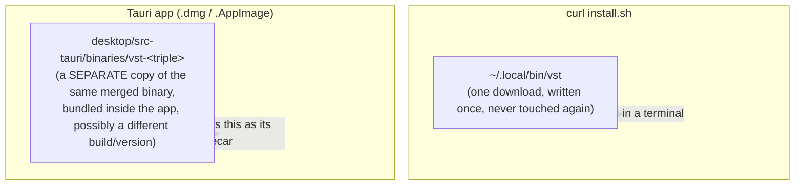
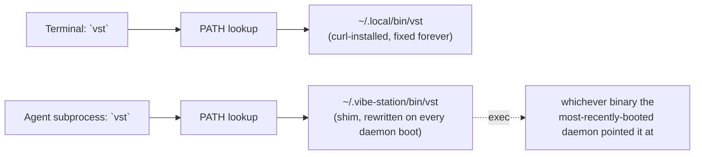
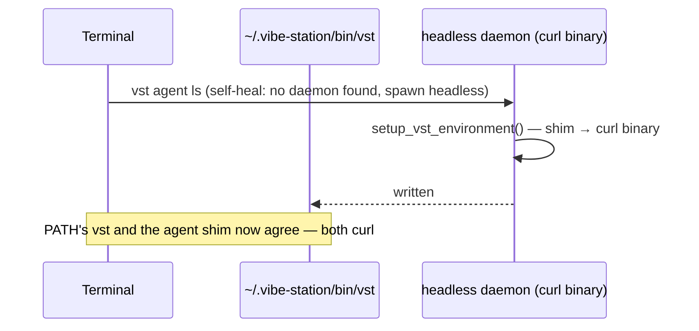
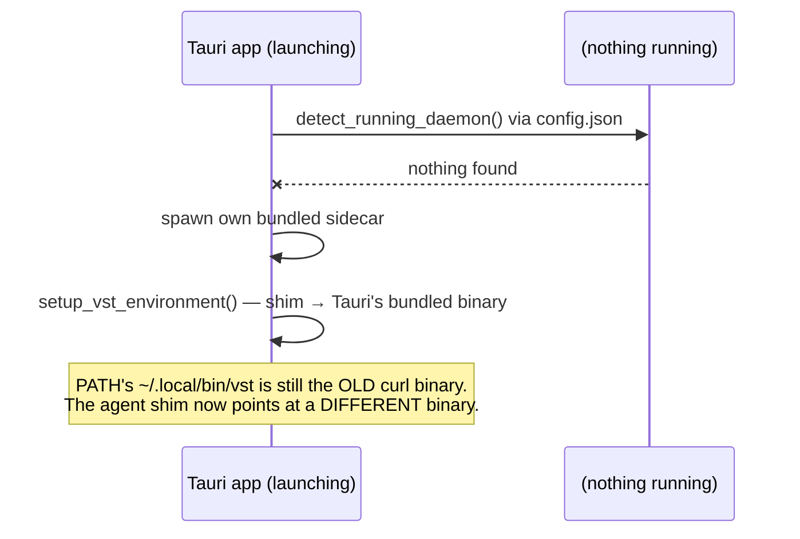

# `scripts/install.sh` and the daemon lifecycle — what actually happens

> **Status:** matches the code as shipped (Parts 00–04 of `cli-daemon-unification`,
> commit history on `release-ci-version`). This is the one place to read for
> "which `vst` binary is actually running right now" — the mental model below
> replaces the older, partly-aspirational `docs/CLI-DAEMON-TAURI-CUJS.md`.

```
curl -fsSL https://raw.githubusercontent.com/fastestdevalive/vibe-station/main/scripts/install.sh | sh
```

## What curl installs, per platform

| | Linux (glibc) | Linux (musl, e.g. Alpine) | macOS |
|---|---|---|---|
| `vst` CLI installed | Yes → `~/.local/bin/vst` | Yes → `~/.local/bin/vst` | Yes → `~/.local/bin/vst` (Apple Silicon only — Intel isn't published) |
| Desktop app (GUI) installed | Yes, unconditionally → `.AppImage`, launcher symlink + `.desktop` entry | No (needs glibc) — warns, doesn't fail | No — curl downloads lack the quarantine flag, so installing a `.dmg` this way would bypass Gatekeeper. Manual `.dmg` download only. |
| PATH set up | Yes, idempotent | Yes, idempotent | Yes, idempotent |

**Release workflow** (`.github/workflows/release.yml`) publishes standalone
`vst-<triple>.tar.gz` CLI archives (static-musl Linux x86_64+aarch64,
Apple-Silicon macOS) and Tauri desktop assets (`.AppImage`, `.dmg`, `.deb`),
each with a `.sha256` checksum `install.sh` verifies before installing anything.

---

## The core thing to understand: there can be TWO separate `vst` binaries, and TWO daemons that come and go

This is true on **both Linux and macOS** — curl already installing the Linux
AppImage does not eliminate the risk, because the AppImage bundles **its own
separate copy** of the `vst` binary (see "Two binaries" below), distinct from
the one curl put on `PATH`.



**Neither binary is "the" daemon** — each is the same merged CLI+daemon
executable (`vst daemon run` boots it as a daemon; any other subcommand talks
to whichever daemon is reachable). Whichever one is *actually spawned* wins
the machine for a while — see below.

### Agents don't use your terminal's `vst` — they use a separate shim

Your shell's `vst` (`~/.local/bin/vst` from curl, on `PATH`) is **not** what
spawned agent subprocesses call. Agents reach `vst` via a shim at
**`~/.vibe-station/bin/vst`** — a tiny `#!/bin/sh; exec "<real-binary>" "$@"`
script, also added to `PATH` (separately, by the daemon itself, see below) so
both a human and an agent can type plain `vst` and get *something* — just not
necessarily the same something.



### The shim is overwritten on **every daemon boot** — not once, not "first wins forever"

`rust/vst-daemon/src/run.rs` (around the `setup_vst_environment` call, right
after the daemon acquires its single-instance `flock` — a losing racer never
reaches this code) unconditionally rewrites `~/.vibe-station/bin/vst` on
**every successful daemon start**, via `rust/vst-daemon/src/env_setup.rs`:

- `resolve_vst_cli_bin_source()` picks the binary: `VST_CLI_BIN` env var if
  set (Tauri's sidecar spawn sets this — see "why VST_CLI_BIN exists" below),
  else a sibling file literally named `vst`/`vst-cli` next to
  `current_exe()` (what a curl-launched headless daemon resolves to, since
  it *is* that file).
- The daemon **also** idempotently patches your shell rc files
  (`patch_shell_configs`) so `~/.vibe-station/bin` is on `PATH` — this
  happens on daemon boot too, guarded by a one-time sentinel file, not tied
  to which binary won.

**An *attach* to an already-running daemon never touches any of this.**
Tauri's `detect_running_daemon()` (`desktop/src-tauri/src/main.rs`) checks
`config.json` first; if a daemon is already up, it just uses it — no sidecar
spawn, no shim rewrite.

**So the rule is:** whichever daemon most recently went from *not running* to
*running via an actual spawn* is the one whose binary agents get — and this
can flip back and forth indefinitely as daemons come and go (crash, `vst
daemon stop`, a reboot — **nothing auto-restarts a daemon**; there is no
systemd/launchd service in this codebase, spawn is one-shot).

---

## Walking through the scenarios

### (a) curl-only, first run from terminal



### (b) curl first, Tauri `.dmg` installed and launched LATER, curl daemon still running

Tauri **attaches**, doesn't spawn — shim is untouched, stays on curl's binary.
No divergence.

### (c) curl first, Tauri launched after the curl daemon died (e.g. after a reboot)



This is the divergence case: your terminal's `vst` and what agents actually
run are now two different physical files (possibly two different versions).

### (d) Tauri `.dmg`/`.AppImage` installed and launched FIRST, curl never run

No `~/.local/bin/vst` exists at all. Tauri's first boot both writes the shim
**and** patches PATH via `patch_shell_configs` — the exact same mechanism
curl's `install.sh` would have used. One binary on the machine, so PATH and
the agent shim trivially agree.

### (e) First run ever is from terminal, but Tauri is already installed (not yet launched)

Self-heal's `launch_app()` tries `open -a vibe-station` (macOS) /
direct-spawns known app paths (Linux) **first**, before falling back to
headless. If that succeeds, **the app itself** boots the daemon — same
shim-write mechanism as (c), same divergence risk against a pre-existing curl
`PATH` entry.

---

## macOS: a nudge toward installing the desktop app

Since macOS never gets the GUI via curl (Gatekeeper), `vst <path>`'s
self-heal path prints a one-line suggestion right before falling back to a
headless daemon spawn, when `vibe-station.app` isn't found:

```
(no vibe-station.app found -- for a better experience, consider installing the
desktop app: https://github.com/fastestdevalive/vibe-station/releases)
```

See `suggest_desktop_app()` in `rust/vst-cli/src/launch.rs`. It's informational
only — the headless daemon still spawns and works either way.

---

## Why `VST_CLI_BIN` exists (it is NOT a second CLI binary)

Only **one** `vst` binary ships inside the Tauri app — `tauri.conf.json`'s
`externalBin: [..., "binaries/vst", ...]` bundles a single merged
CLI+daemon binary (`scripts/prep-sidecar.sh` builds it once). When Tauri
spawns it as `.sidecar("vst")` with `daemon run`, that spawned process *is*
the bundled binary — same file, not a different one.

`VST_CLI_BIN` (`desktop/src-tauri/src/daemon.rs`) exists purely because of
**how that one binary is named on disk once bundled**: Tauri's `externalBin`
convention keeps the filename target-triple-suffixed even inside the final
app (e.g. `vst-aarch64-apple-darwin`), and `resolve_vst_cli_bin_source()`'s
generic fallback only looks for siblings literally named `vst`/`vst-cli`.
Without `VST_CLI_BIN`, the Tauri-spawned daemon couldn't find its own binary
to write into the shim and would silently skip the shim write entirely. So
`main.rs` (the one place that actually knows the real bundle path via
`resource_dir()`) passes it explicitly.

---

## Known, documented, currently-unfixed limitation

The shim being one **machine-global** file, rewritten by whichever daemon
booted most recently, is a real limitation — not a bug introduced carelessly.
The proper fix (a daemon-owned, per-daemon symlink instead of one shared
file) is scoped as **future work only** and is not implemented in this PR.
Don't be surprised if an agent turns out to be running an older/newer `vst`
build than what your own terminal resolves — that's this mechanism, working
as currently designed, not a malfunction.

---

## Design decisions (background, unchanged from earlier drafts)

1. **CLI + daemon ship together — one binary, not two.** `vst daemon run` (or
   argv0 `vst-daemon`, kept for compatibility) binds and serves; every other
   invocation is the CLI against whatever daemon is running.
2. **Daemon lifecycle is currently spawn-once, no supervisor.** Proper
   process detaching (`setsid` + redirected stdio, via `vst_proc::spawn_detached`)
   is implemented; crash recovery / a real systemd/launchd service is not —
   see "known limitation" above, which is a direct consequence of this.
3. **Token flow is unchanged by the binary merge.** Same executable ≠ same
   running process — the daemon still can't trust "shares my binary" as
   authorization. Full design: `docs/AUTH.md`.
4. **LAN-reachable by default, not new.** The daemon already binds `0.0.0.0`;
   loopback-trust vs. remote-auth is documented in `docs/AUTH.md`.
