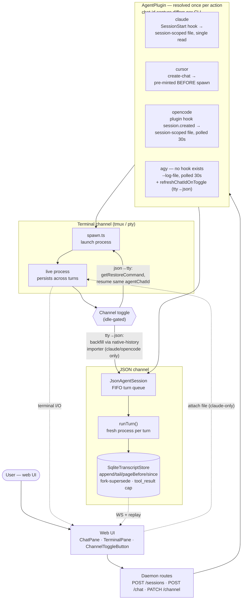

# JSON Agent Chat — Architecture (PR #29)

One diagram covering the whole feature: the two execution channels a
session can run on, how the daemon spawns/talks to each, and where the four
CLI plugins genuinely diverge (chat-id capture — the source of the agy bug
fixed in this PR). Read alongside `SESSION-EXECUTION.md` (channel mechanics)
and `AGENT-CHAT-ID-CAPTURE.md` (the per-CLI capture detail this diagram only
summarizes).

## How to read it

- **Read it top to bottom, one spine.** Every action resolves a plugin
  once (`PLUGINS`), then either goes down the terminal branch or the JSON
  branch. The `TOGGLE` node is the one place those two branches connect —
  it's genuinely bidirectional (that's what a toggle is), so it's the only
  node with an edge pointing back up into the terminal branch.
- **Two channels, one session record.** A session is always on exactly one
  of `tmux`/`pty` (a live, persistent process) or `json` (no persistent
  process — the daemon spawns the CLI fresh for every single turn). The
  toggle switches a session between them without losing the conversation.
- **Dashed arrows are live loopbacks to the UI**, not the main request
  flow — the terminal's raw I/O stream and the transcript store's WS
  broadcast both feed back into the same `WEBUI` box that started the
  request, and file upload goes the other way (UI → live process).
- **`TerminalPane` never remounts**, toggle or not — it's always in the
  React tree; only its visibility and the session id it's bound to change.
  This is why the terminal-side bugs in this PR (stale exited-banner,
  overlapping overlays) were subtle: the pane itself was never the problem,
  the *lifecycle state feeding it* was.
- **The plugin layer is where the four CLIs genuinely diverge**, and it's
  almost entirely about one thing: how does the daemon learn a CLI's own
  conversation id? Three different answers (pre-mint, hook, log-file
  inference) — see `AGENT-CHAT-ID-CAPTURE.md` for the full detail and why
  agy's (log-file) needed two attempts to get right.
- **`SqliteTranscriptStore` is the one thing both channels write into** —
  live per-turn events from the JSON path, and backfilled terminal-phase
  turns (via the P2 importer) when toggling tty→json. This is also where
  the fork/edit feature (P4) and the `tool_result` size cap live, since both
  are really "what gets written to this store" concerns.

## Commit map (PR #29 → diagram)

| Commit | What it added to this picture |
|---|---|
| `feat: JSON agent chat channel — core feature (P0-P4)` | Everything except the toggle arrows and the terminal-upload arrow: `JsonAgentSession`, the SQLite store + pagination, the native-history importer, the toggle route itself, fork. |
| `feat: complete the channel-toggle UX` | The `ChannelToggleButton` shared component, extending the toggle to all 4 CLIs, the terminal-upload path, and fixing the tmux-spawn/lifecycle-banner bugs in the terminal-channel box. |
| `fix: agy chat-id capture` | The `agy` plugin box specifically — `--log-file` + `refreshChatIdOnToggle`, replacing an earlier (wrong) cache-file-based design. |
| `docs: ...` | This diagram + `AGENT-CHAT-ID-CAPTURE.md`. |
