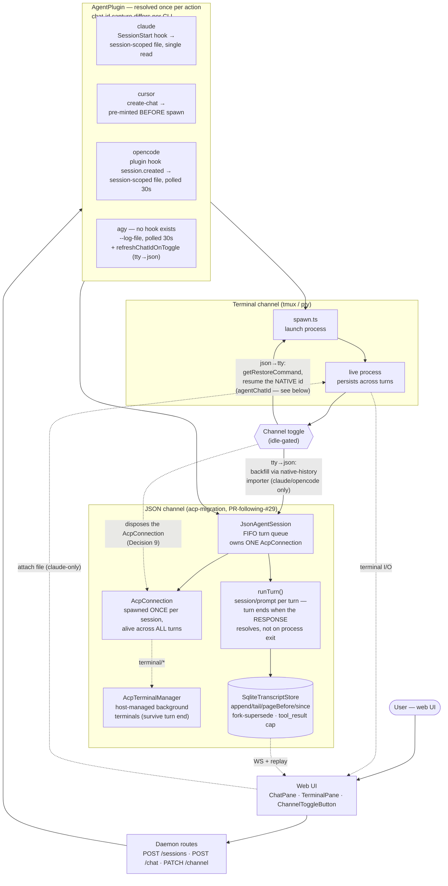

# JSON Agent Chat — Architecture (PR #29)

One diagram covering the whole feature: the two execution channels a
session can run on, how the daemon spawns/talks to each, and where the four
CLI plugins genuinely diverge (chat-id capture — the source of the agy bug
fixed in this PR). Read alongside `SESSION-EXECUTION.md` (channel mechanics)
and `AGENT-CHAT-ID-CAPTURE.md` (the per-CLI capture detail this diagram only
summarizes).

## How to read it

- **Read it top to bottom, one spine.** Every action resolves a plugin
  once (`PLUGINS`), then either goes down the terminal branch or the JSON
  branch. The `TOGGLE` node is the one place those two branches connect —
  it's genuinely bidirectional (that's what a toggle is), so it's the only
  node with an edge pointing back up into the terminal branch.
- **Two channels, one session record.** A session is always on exactly one
  of `tmux`/`pty` (a live, persistent process) or `json`. **Both channels are
  now persistent-process models** (acp-migration, superseding the original
  "fresh process per turn" design): the JSON channel spawns ONE Agent Client
  Protocol (ACP) connection per session, alive across every turn, and each
  turn is one `session/prompt` over that same connection — the turn ends when
  that call's response resolves, not when a process exits. This is why
  background work started mid-turn (a backgrounded shell command, a dev
  server) now survives past the turn that started it: it runs as a
  host-managed ACP terminal (`AcpTerminalManager`) that the connection, not
  any single turn, owns. The toggle switches a session between the two
  channels without losing the conversation.
- **Dashed arrows are live loopbacks to the UI**, not the main request
  flow — the terminal's raw I/O stream and the transcript store's WS
  broadcast both feed back into the same `WEBUI` box that started the
  request, and file upload goes the other way (UI → live process).
- **`TerminalPane` never remounts**, toggle or not — it's always in the
  React tree; only its visibility and the session id it's bound to change.
  This is why the terminal-side bugs in this PR (stale exited-banner,
  overlapping overlays) were subtle: the pane itself was never the problem,
  the *lifecycle state feeding it* was.
- **The plugin layer is where the four CLIs genuinely diverge**, and it's
  almost entirely about one thing: how does the daemon learn a CLI's own
  conversation id? Three different answers (pre-mint, hook, log-file
  inference) — see `AGENT-CHAT-ID-CAPTURE.md` for the full detail and why
  agy's (log-file) needed two attempts to get right.
- **`SqliteTranscriptStore` is the one thing both channels write into** —
  live per-turn events from the JSON path, and backfilled terminal-phase
  turns (via the P2 importer) when toggling tty→json. This is also where
  the fork/edit feature (P4) and the `tool_result` size cap live, since both
  are really "what gets written to this store" concerns.

## Per-plugin ACP id vs. native id (acp-migration Decision 6)

`sessions.agentChatId` always means "the id the CLI's OWN `--resume`/
`--session`/`--conversation` flag and native transcript store understand" —
this invariant never changes. The open question the ACP migration had to
answer PER PLUGIN, empirically (Phase 1.8's spike procedure, run once per
CLI), was whether the ACP `session/new` id IS that same value:

| Plugin | ACP id == native id? | Storage | Toggle (json→tty) behavior |
|---|---|---|---|
| claude | **Yes** (byte-identical; verified `claude --resume <ACP id>` recalls the conversation) | `agentChatId` only — no `acpSessionId` column used | Normal: `getRestoreCommand` resumes correctly |
| opencode | **Yes** (byte-identical; verified via a direct `opencode.db` query AND `opencode --session <ACP id>`) | `agentChatId` only | Normal |
| cursor | **No, and no fix exists** (re-investigated live 2026-08-30). `cursor-agent`'s ACP mode persists each session at `~/.cursor/acp-sessions/<sessionId>/store.db` — a dedicated SQLite store keyed by the ACP session id, structurally separate from BOTH the interactive `~/.cursor/chats/` store and the print-mode `~/.cursor/projects/<slug>/agent-transcripts/` store that the raw CLI's `--resume` flag and `findLatestCursorChatId` read. `cursor-agent acp` takes no flags to bridge into an existing ACP session — the only way to resume one is the ACP `session/load` RPC, which a plain terminal invocation cannot call. Live-tested and refuted: this is NOT a timing/async-sync issue (polled >90s, no `agent-transcripts/` entry ever appears for an ACP-only session in a fresh cwd) | `sessions.acpSessionId` (new nullable column, `session/load` only) + `agentChatId` populated out-of-band by `findLatestCursorChatId(cwd)` (may legitimately stay NULL) | **Degraded, documented, confirmed final**: when the native id can't be recovered, `getRestoreCommand` returns `null` and the toggle falls through to a FRESH terminal launch — no crash, no bogus `--resume`. The Rich Chat transcript itself is unaffected (it lives in SQLite, not in cursor's own state) |
| agy | **No, but a real fix exists** (found and live-verified 2026-08-30). The ACP `session/new` id is a different uuid than agy's own native conversation id, BUT the third-party `antigravity-acp` npm adapter (which drives agy under ACP) persists its own session↔conversation binding to `~/.agy-acp/sessions.json`, keyed by the exact ACP session id — verified live end-to-end: spawned a real ACP session, read the adapter's own file, and confirmed `agy --conversation <that id>` correctly resumed the conversation | `sessions.acpSessionId` (session/load only) + `agentChatId` populated out-of-band by `readAgyAcpSessionConversationId(acpSessionId)` (reads the adapter's own `~/.agy-acp/sessions.json`; falls back to the old cwd-keyed `readLatestAgyConversationId(cwd)` only if that file/entry is missing) | **Normal — NOT degraded**: `getRestoreCommand` resumes correctly via the adapter-provided id in the common case; falls to the old cwd-keyed best-effort path (and, from there, possibly the documented degrade) only for sessions from an adapter version predating this store |

**Queryable, not just documented:** the "Toggle (json→tty) behavior" column above is exposed as a named capability, `AgentPlugin.supportsChannelResume?(): boolean` (`spawn.ts`) — `false` only for cursor, defaulting to `true` for the other three. It's surfaced through `GET /supported-clis` (`supportsChannelResume` field) and consumed by `web-ui`'s `StatusBar.tsx` to show an honest pre-toggle warning for cursor rather than a silent degrade discovered only after switching. The toggle is never disabled by this flag — it only changes the copy.

**Important caveat on the agy plugin (flag for human review before shipping):**
unlike claude (an npm-installable, Anthropic-affiliated adapter) and
cursor/opencode (first-party native ACP subcommands on binaries this plugin
already required), agy's only available ACP adapter is a **third-party,
single-maintainer npm package** (`antigravity-acp`, not published by
Google/Zed/agentclientprotocol), built on **Bun** — it introduces a brand-new
system-level runtime dependency (`bun`/`bunx`) that nothing else in this
stack needs, and it carries the supply-chain trust profile of an individual
maintainer's package rather than a vendor-backed one. The live spike
(`initialize` + `session/new` + `session/prompt`, no auth hang) succeeded on
the machine this was implemented on, but this trade-off was not something the
original plan anticipated and deserves an explicit go/no-go from a human
before agy's ACP path ships to real users.

## Commit map (PR #29 → diagram)

| Commit | What it added to this picture |
|---|---|
| `feat: JSON agent chat channel — core feature (P0-P4)` | Everything except the toggle arrows and the terminal-upload arrow: `JsonAgentSession`, the SQLite store + pagination, the native-history importer, the toggle route itself, fork. |
| `feat: complete the channel-toggle UX` | The `ChannelToggleButton` shared component, extending the toggle to all 4 CLIs, the terminal-upload path, and fixing the tmux-spawn/lifecycle-banner bugs in the terminal-channel box. |
| `fix: agy chat-id capture` | The `agy` plugin box specifically — `--log-file` + `refreshChatIdOnToggle`, replacing an earlier (wrong) cache-file-based design. |
| `docs: ...` | This diagram + `AGENT-CHAT-ID-CAPTURE.md`. |
