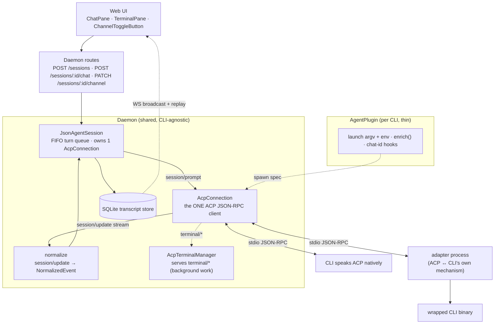
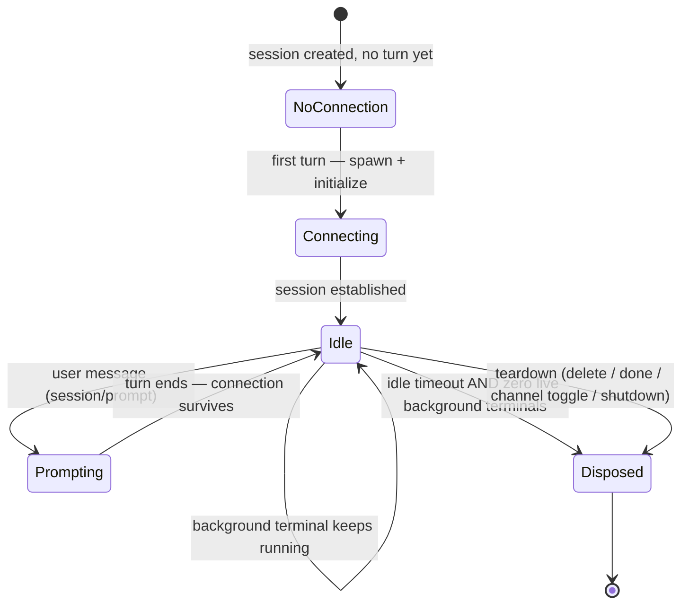
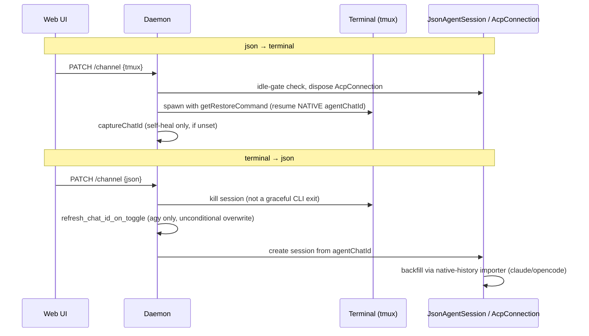
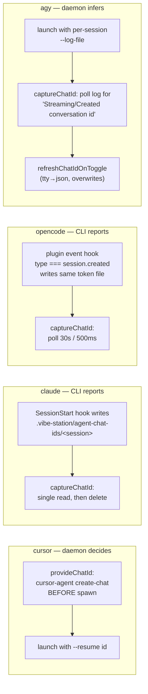
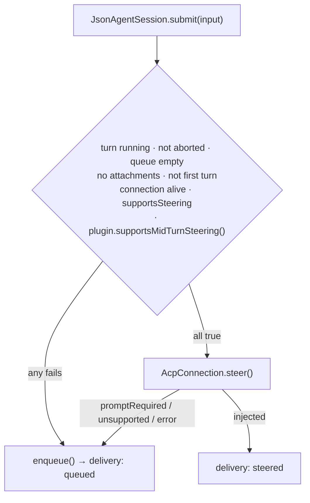

# Rich Chat over ACP

How Rich Chat (the `json` channel in code) drives every coding-agent CLI
through the **Agent Client Protocol (ACP)** — a JSON-RPC 2.0 wire format over
stdio. Condensed from the former `ACP-TRANSPORT-OVERVIEW`, `JSON-CHAT-ARCHITECTURE`,
`AGENT-CONTEXT`, `CLI-SUPPORT` and `AGENT-CHAT-ID-CAPTURE` docs. Implementation
lives in `rust/vst-agents` (plugins, `acp_connection.rs`, `json_agent_session/`).

> The daemon implements the ACP client **once**. Per-CLI code is limited to
> launch argv/env, an `enrich()` event hook, and chat-id handling. Nothing in
> shared code branches on which CLI is running (see `AGENTS.md` → Agent plugin).

> **TEMPORARY — agy is terminal-only.** `agy` currently has `supports_json() ==
> false`, so it cannot be created as, or toggled to, Rich Chat. Reason: the
> daemon passes agy's NATIVE conversation id to `agy-acp`'s `session/load`,
> which only knows ACP ids from its own store, so it fails with `unknown
> sessionId` and the daemon silently falls back to a fresh session (and Rich
> Chat → terminal also forks). A proper bridge (map native↔ACP ids in the
> adapter) is deferred; until it lands, agy must not offer Rich Chat. Revert
> `agy::supports_json` (and the web-ui `supportsJson: false` for agy in
> `web-ui/src/api/mock.ts`) once bridged. See § Two session identities below.

## 1. Architecture

| Layer | Owns | Shared / per-CLI |
|---|---|---|
| `JsonAgentSession` | FIFO turn queue, transcript persistence, first-turn bookkeeping | Shared |
| `AcpConnection` | Process spawn/liveness, `initialize`, `session/new`/`load`/`prompt`/`cancel`, idle-TTL disposal | Shared |
| `normalize` | Base `session/update → NormalizedEvent` mapping | Shared + per-plugin `enrich()` |
| `AcpTerminalManager` | Host-managed child processes for ACP `terminal/*`, so background work (e.g. a dev server) outlives the turn | Shared |
| Plugin file | Launch command/args/env, `enrich()`, chat-id capture | Per-CLI |
| Transcript store | Everything both channels write; pagination, fork-supersede, `tool_result` size cap | Shared |

## 2. Connection lifecycle — one process per session, not per turn

A turn ends when the `session/prompt` call **resolves**, not when a process
exits. Stop sends `session/cancel` over the same connection, so the connection
and any background terminal survive.

## 3. Two channels, one session

A session is on exactly one channel: `tmux`/`pty` (live TTY process) or `json`
(Rich Chat). Both are persistent-process models. The toggle is idle-gated and
preserves the conversation.

### 3.1 History across the toggle (native import)

On terminal → json the daemon imports native-transcript turns Rich Chat does
not have yet (claude/opencode/codex importers; cursor/agy have none). Rules:

- User text is the first text block that is not the vst system-prompt marker
  (`# vibe-station Agent Skill`) — claude appends the system prompt as a 2nd
  block of the first prompt.
- Harness-injected autonomous user lines (`turnOrigin` task_notification /
  scheduled, `origin.kind: task-notification`) start their own turn group (with
  a status row); compaction summaries are skipped.
- Skip rule (the import is idempotent and safe to re-run). A group containing
  tool use is skipped iff its turn id or any of its tool-use ids already exists.
  A tool-less group is skipped iff its turn id exists or its content fingerprint
  (`u:` + user text, or `a:` + concatenated assistant text for user-less
  autonomous groups) matches an existing turn; turns with a cancelled/silent
  user row never contribute a fingerprint, so a re-typed prompt is imported.
  Identical text-only groups therefore dedupe.
- Known limitation: live out-of-band bursts split on a 30 s gap while the importer
  splits per autonomous native line, so two wake-ups within 30 s can import a
  duplicate text-only group.

### 3.2 Out-of-turn updates

Claude Code can keep working after a prompt resolves (task-notification and
scheduled wake-ups). Those `session/update`s arrive with no prompt in flight; the
connection routes them to an out-of-band sink (attached only after
`session/load`, so the adapter's history replay is not persisted again). They are
persisted under synthetic `notif-*` turns (a status row opens each burst) and
broadcast like normal events. Usage and command-list updates only touch session
meta. Lifecycle state is deliberately **not** changed by these updates.

### 3.3 Replay on open / reconnect

`chat:open` with `sinceSeq` returns a delta (max 200 rows). If the delta
overflows, the daemon answers with the normal tail frame instead, and the client
drops its stale cache via gap detection; on WS reconnect the client re-arms gap
detection from its last seen seq.

## 4. Context delivery at spawn

Three layers compose the system prompt: **L1** base `vst` instructions
(`agent-system-prompt.md`), **L2** project/worktree context (names, paths,
branch, base branch, sibling sessions, mode), **L3** project-level rules
(`<project>/AGENTS.md` or `.vibe-station/rules.md`).

| Env var injected on every spawn | Value |
|---|---|
| `VST_SESSION` | session id |
| `VST_WORKTREE` | worktree id (worktree sessions only) |
| `VST_PROJECT` | project id |
| `VST_DATA_DIR` | `~/.vibe-station/projects/<project-id>` |
| `VST_DAEMON_URL` | `http://127.0.0.1:<port>` |

Agents use these to call `vst agent send`, `vst agent output`, etc.

## 5. Two session identities

A session that has run a Rich Chat turn carries **two** ids:

| Field | Layer | Minted by | Understood by |
|---|---|---|---|
| `acpSessionId` | Protocol | ACP `session/new` | `session/load` / `session/prompt` on the same ACP connection only |
| `agentChatId` | CLI | the CLI (hook, pre-mint, log, or adapter store) | the CLI's own `--resume`/`--session`/`--conversation` flag and native transcript store |

**Invariant:** `agentChatId` is always the *native* id, never the ACP one.
Whether the two coincide is a per-CLI fact (established by a live spike), and
each plugin declares it only by which optional methods it implements:

| CLI | Strategy | ACP id == native id? | `capture_native_chat_id` | `supports_json_to_terminal_resume` | json→tty toggle |
|---|---|---|---|---|---|
| claude | `identical` | Yes | not implemented | `true` (default) | Resumes correctly |
| opencode | `identical` | Yes | not implemented | `true` (default) | Resumes correctly |
| agy | `bridged` | No — but the `agy-acp` adapter persists an ACP-id-keyed mapping in `~/.vibe-station/agy-acp/sessions.json` | reads that file | `true` (default) | Resumes correctly; falls back to a cwd-keyed best effort only for sessions predating the store |
| cursor | `unavailable` | No, and no bridge exists (`cursor-agent acp` stores sessions in `~/.cursor/acp-sessions/<id>/store.db`, separate from what `--resume` reads) | best-effort cwd-keyed guess | **`false`** (`cursor.rs`) | Starts a **fresh** terminal conversation (no crash, no bogus `--resume`); UI warns beforehand via `GET /supported-clis`. Rich Chat transcript is unaffected (lives in SQLite) |
| codex | `bridged` | No — but `codex-acp`'s `session/new` sets `sessionId` directly to codex's native `thread_id`, so the native id is trivially recoverable with no separate lookup | `capture_native_chat_id` (trivial: adopts ACP session id verbatim) | `true` (default) | Resumes correctly via `codex resume <id>` |
| pi | no ACP / no json channel | N/A — no ACP layer exists for pi | not implemented | `true` (default, but meaningless — json channel is never offered for pi) | N/A — terminal only |

Per-CLI native-id resolvers live in `rust/vst-agents/src/native_chat_id.rs`; opencode's
absence there is meaningful (its id never needs out-of-band discovery).

## 6. How the native id is first learned (terminal start)

| CLI | Pre-mint | Terminal-start capture | Toggle self-heal (tty→json) | Resume/restore self-heal (→tty) |
|---|---|---|---|---|
| claude | No | `SessionStart` hook → session-scoped file, single read | Not needed | `capture_chat_id`, only if unset |
| cursor | **Yes** (`create-chat`) | N/A — known before spawn | Not needed | Not needed |
| opencode | No | plugin `session.created` hook → session-scoped file, polled | Not needed | `capture_chat_id`, only if unset |
| agy | No | none (no hook exists); polls per-session `--log-file` | **`refresh_chat_id_on_toggle`**, unconditional overwrite, single read | `capture_chat_id`, only if unset |
| codex | No | `SessionStart` hook (`.codex/vibe-recorder.sh`) writes the thread id to `.vibe-station/agent-chat-ids/<sessionId>`; `capture_chat_id` / `get_restore_command` read it (per session, so two agents in one worktree never share a thread) | Not needed (ACP session id IS the native thread_id) | `capture_chat_id`, only if unset |
| pi | No | Pre-assigned: launched with `--session-id <vst session id>` (pi creates it if missing, resumes it otherwise); `capture_chat_id` returns that id | N/A — no Rich Chat | `capture_chat_id`, only if unset |

Rules that matter:
- Every JSON turn's `session_init.agentChatId` is adopted **only if unset** (or
  during `--fork-session`). It is not an ongoing correction mechanism.
- Token files are keyed by our own session id, so a miss is `null`, never
  someone else's id.
- For a CLI with no hook, prefer a signal written **as a side effect of the
  conversation** (live log, per-turn callback) over one flushed **on exit** —
  vibe-station force-kills terminals on teardown. agy's earlier
  `last_conversations.json` cache design failed for exactly this reason (only
  written on graceful `/quit`, and keyed by cwd with no session identity).
- Known gap: agy's "Do you trust this folder?" prompt in a brand-new worktree
  isn't bypassed by `--dangerously-skip-permissions`; capture times out to
  `null` and self-heals at toggle time.

## 7. Mid-turn steering

"Steering" = the user sends a message during a running turn and it reaches the
agent **without cancelling the turn** (via the `_session/steering` ACP
extension); otherwise the message is queued (cancel-and-resend is the ceiling).

| CLI | Steering | Notes |
|---|---|---|
| claude | **Supported, verified end-to-end** | `claude-agent-acp` ≥ 0.70.0; reports `_meta.steering.supported: true` in `initialize`. The only plugin implementing `supports_mid_turn_steering()` |
| opencode | **Disabled deliberately** | Advertises steering and replies `injected`, but the text never reaches the model (silently swallowed). Re-enable only after a fixed version is verified |
| agy | Not supported | `agy-acp` has no `_session/steering`; handshake reports `false` |
| cursor | Not supported | Closed binary, no steering surface; cancelling starts a fresh conversation |
| codex | Not supported | `codex-acp` has no `_session/steering` extension |
| pi | N/A | Terminal only — no Rich Chat channel at all |

**Two gates, both required:** `supportsSteering` (what the CLI *claims* in
`initialize`) **and** `plugin.supportsMidTurnSteering()` (what we *verified*,
opt-in). Advertising steering is not enough — verify end-to-end, then opt in.

`delivery` is returned in the `POST /sessions/:id/chat` 202 body; the Composer
send button's `aria-label` reads "Interrupts and steers the running turn" when
`meta.canSteer` is true.

## 8. Context window

| CLI | Window | Knob exposed? | Notes |
|---|---|---|---|
| claude | Up to 1M via `betas: ["context-1m-2025-08-07"]` | **Passed** — `claude.rs` `acp_meta()` sends the beta and the model on `session/new` | The adapter ranks `ANTHROPIC_MODEL` above everything else; inherited from the user's shell (e.g. `claude-sonnet-4-6`), it was re-asserted on `session/load`, so a `sonnet` mode ran 4-6 at 200k. `acp_model_env()` pins the var to the session's model (left alone when the mode has none). `_meta` is also ignored on load, so `acp_initial_config_option()` re-pins the model with `session/set_config_option` after every load, and a status event says so |
| opencode / cursor / agy | CLI-managed | None | No ACP field exposes it |
| codex | CLI-managed | None | No ACP field exposes it |
| pi | CLI-managed | None | Terminal only — no ACP |

Update sections 5–8 when a CLI ships a new ACP version or the daemon wires a
new capability.
